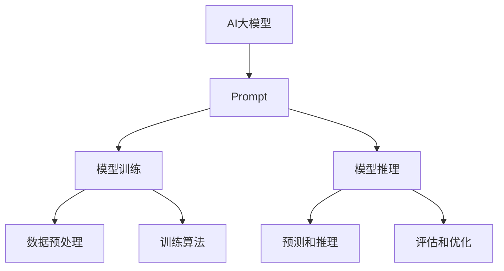

                 

# AI大模型Prompt提示词最佳实践：明确模型必须遵循的要求

> **关键词：** 大模型、Prompt、提示词、最佳实践、算法、数学模型、实战案例、应用场景

> **摘要：** 本文深入探讨了AI大模型中Prompt提示词的最佳实践，分析了其在模型训练和推理中的重要作用。文章详细阐述了Prompt设计的要求和原则，并通过具体操作步骤、数学模型及实际案例，全面展示了如何优化Prompt以提升模型性能。同时，本文还探讨了Prompt在多场景中的应用，并推荐了相关工具和资源，为AI开发者提供了实用的指导。

## 1. 背景介绍

### 1.1 目的和范围

本文旨在为AI大模型开发者和研究者提供一份详尽的Prompt提示词最佳实践指南。我们将从理论到实践，深入分析Prompt在模型训练和推理中的重要性，并提出一系列优化策略。本文主要涵盖以下内容：

1. Prompt的定义及其在AI模型中的作用
2. Prompt设计的要求和原则
3. Prompt优化的核心算法和数学模型
4. 实际应用中的Prompt设计和实现
5. 相关工具和资源的推荐
6. 未来发展趋势与挑战

### 1.2 预期读者

本文适合以下读者群体：

1. AI大模型开发者和研究者
2. 机器学习和深度学习爱好者
3. 对AI领域有深入兴趣的技术人员
4. 计算机科学和教育领域的教师和学生

### 1.3 文档结构概述

本文分为十个主要部分，具体结构如下：

1. 引言：背景介绍、目的和范围
2. 核心概念与联系：介绍AI大模型和Prompt的基本概念
3. 核心算法原理 & 具体操作步骤：详细阐述Prompt优化的算法和实现步骤
4. 数学模型和公式 & 详细讲解 & 举例说明：解释Prompt优化的数学模型和公式
5. 项目实战：代码实际案例和详细解释说明
6. 实际应用场景：探讨Prompt在不同领域的应用
7. 工具和资源推荐：推荐学习和开发资源
8. 总结：未来发展趋势与挑战
9. 附录：常见问题与解答
10. 扩展阅读 & 参考资料

### 1.4 术语表

#### 1.4.1 核心术语定义

- **Prompt**：用于引导AI模型进行学习和推理的文本或序列。
- **大模型**：具有海量参数和巨大计算需求的AI模型，如GPT、BERT等。
- **Prompt设计**：指创建和优化Prompt的过程，以提升模型性能。

#### 1.4.2 相关概念解释

- **模型训练**：通过大量数据训练模型，使其具备预测和推理能力。
- **模型推理**：使用训练好的模型进行实际预测或推理过程。

#### 1.4.3 缩略词列表

- **AI**：人工智能（Artificial Intelligence）
- **ML**：机器学习（Machine Learning）
- **DL**：深度学习（Deep Learning）
- **GPT**：生成预训练模型（Generative Pre-trained Transformer）
- **BERT**：双向编码表示（Bidirectional Encoder Representations from Transformers）

## 2. 核心概念与联系

在深入探讨Prompt最佳实践之前，我们首先需要了解AI大模型和Prompt的基本概念及其相互关系。以下是相关的核心概念和其相互作用的Mermaid流程图。



### 2.1 AI大模型

AI大模型通常指的是具有数百万到数十亿参数的深度学习模型。这些模型能够处理复杂数据，如文本、图像和语音等。它们通过大量的数据训练和参数优化，实现高水平的预测和推理能力。典型的AI大模型包括GPT、BERT、Transformer等。

### 2.2 Prompt

Prompt是用于引导AI模型进行学习和推理的文本或序列。它包含关键信息，帮助模型理解任务目标和输入数据的含义。有效的Prompt设计可以显著提升模型的性能和泛化能力。

### 2.3 模型训练与推理

AI大模型的训练和推理过程是Prompt设计的关键环节。模型训练过程中，Prompt帮助模型学习数据特征和规律，并在训练数据上调整参数。模型推理过程中，Prompt用于引导模型生成预测结果或进行推理任务。

### 2.4 数据预处理与评估优化

在模型训练和推理过程中，数据预处理和评估优化也是至关重要的。数据预处理包括数据清洗、归一化和特征提取等步骤，以增强模型的学习效果。评估优化则通过性能评估指标（如准确率、召回率等）和优化算法（如梯度下降、随机搜索等），持续提升模型性能。

## 3. 核心算法原理 & 具体操作步骤

为了深入理解Prompt的最佳实践，我们首先需要了解其背后的核心算法原理和具体操作步骤。以下是Prompt优化过程中的主要算法和步骤。

### 3.1 Prompt优化算法

Prompt优化主要涉及两个方面：一是选择合适的Prompt模板，二是通过调整模板中的参数来优化Prompt。以下是常用的Prompt优化算法：

#### 3.1.1 模板匹配算法

模板匹配算法通过预定义的Prompt模板与输入数据进行匹配，选择最符合输入数据的Prompt。具体步骤如下：

1. **定义Prompt模板**：根据任务需求，定义一组预定义的Prompt模板。
2. **数据预处理**：对输入数据进行预处理，使其符合Prompt模板的要求。
3. **模板匹配**：将预处理后的数据与Prompt模板进行匹配，选择最佳匹配的模板。

#### 3.1.2 参数调整算法

参数调整算法通过调整Prompt模板中的参数，优化Prompt的质量。具体步骤如下：

1. **初始参数设置**：设置Prompt模板的初始参数。
2. **模型训练**：使用训练数据对模型进行训练，同时调整Prompt模板的参数。
3. **性能评估**：使用评估数据对模型进行性能评估，根据评估结果调整Prompt模板的参数。
4. **迭代优化**：重复步骤2和3，直到满足性能要求或达到最大迭代次数。

### 3.2 具体操作步骤

下面是一个基于模板匹配算法的具体操作步骤，用于优化AI大模型的Prompt：

#### 3.2.1 定义Prompt模板

根据任务需求，定义一组预定义的Prompt模板。例如，对于一个文本分类任务，可以定义以下Prompt模板：

```
1. 请根据以下文本进行分类：
   [输入文本]

2. 请判断以下文本的标签：
   [输入文本]，标签：[预设标签]

3. 请根据以下文本生成对应的标签：
   [输入文本]，标签：[预测标签]
```

#### 3.2.2 数据预处理

对输入数据进行预处理，使其符合Prompt模板的要求。例如，对于文本分类任务，可以采用以下预处理步骤：

1. **文本清洗**：去除文本中的HTML标签、停用词等。
2. **分词**：将文本分解为单词或子词。
3. **词向量编码**：将文本转换为词向量表示，如Word2Vec、BERT等。

#### 3.2.3 模板匹配

将预处理后的数据与Prompt模板进行匹配，选择最佳匹配的模板。例如，对于以下输入文本：

```
这是一篇关于人工智能的论文，探讨了深度学习在自然语言处理中的应用。
```

可以选择以下Prompt模板：

```
1. 请根据以下文本进行分类：
   这是一篇关于人工智能的论文，探讨了深度学习在自然语言处理中的应用。
   类别：科技论文
```

#### 3.2.4 参数调整

根据模板匹配结果，调整Prompt模板的参数，优化Prompt的质量。例如，可以调整以下参数：

1. **Prompt长度**：调整Prompt的长度，以适应不同长度的输入文本。
2. **Prompt语义**：调整Prompt中的关键词和短语，使其更贴近输入文本的语义。
3. **Prompt结构**：调整Prompt的结构，如添加背景信息、引导语句等。

#### 3.2.5 模型训练和评估

使用调整后的Prompt模板进行模型训练和评估。具体步骤如下：

1. **训练数据准备**：将预处理后的文本和标签组成训练数据集。
2. **模型训练**：使用训练数据集对模型进行训练，同时调整Prompt模板的参数。
3. **性能评估**：使用评估数据集对模型进行性能评估，如准确率、召回率等。
4. **迭代优化**：根据评估结果调整Prompt模板的参数，重复步骤2和3，直到满足性能要求或达到最大迭代次数。

## 4. 数学模型和公式 & 详细讲解 & 举例说明

为了更深入地理解Prompt优化过程中的数学模型和公式，我们将在本节中详细介绍相关内容，并使用LaTeX格式展示公式，通过具体例子来说明其应用。

### 4.1 常用数学模型

在Prompt优化过程中，常用的数学模型包括神经网络、损失函数和优化算法。以下是对这些模型的简要介绍和公式表示。

#### 4.1.1 神经网络

神经网络是AI模型的核心组成部分，用于对输入数据进行特征提取和分类。一个简单的神经网络模型可以表示为：

\[ y = \sigma(\text{W} \cdot \text{X} + \text{b}) \]

其中，\( \sigma \) 是激活函数（如Sigmoid、ReLU等），\( \text{W} \) 是权重矩阵，\( \text{X} \) 是输入特征向量，\( \text{b} \) 是偏置向量。

#### 4.1.2 损失函数

损失函数用于衡量模型预测值与实际值之间的差异，是优化算法的核心指标。常用的损失函数包括均方误差（MSE）和交叉熵（CE）。

- **均方误差（MSE）**：

\[ \text{MSE} = \frac{1}{m} \sum_{i=1}^{m} (\hat{y}_i - y_i)^2 \]

其中，\( \hat{y}_i \) 是预测值，\( y_i \) 是实际值，\( m \) 是样本数量。

- **交叉熵（CE）**：

\[ \text{CE} = -\frac{1}{m} \sum_{i=1}^{m} y_i \log(\hat{y}_i) \]

其中，\( y_i \) 是实际值的概率分布，\( \hat{y}_i \) 是预测值的概率分布。

#### 4.1.3 优化算法

优化算法用于调整模型参数，以最小化损失函数。常用的优化算法包括梯度下降（GD）和随机梯度下降（SGD）。

- **梯度下降（GD）**：

\[ \text{W} \leftarrow \text{W} - \alpha \nabla_{\text{W}} \text{L} \]

其中，\( \alpha \) 是学习率，\( \nabla_{\text{W}} \text{L} \) 是权重矩阵 \( \text{W} \) 的梯度。

- **随机梯度下降（SGD）**：

\[ \text{W} \leftarrow \text{W} - \alpha \nabla_{\text{W}} \text{L}(\text{X}_i, y_i) \]

其中，\( \text{X}_i, y_i \) 是训练数据中的单个样本。

### 4.2 具体例子

为了更好地理解这些数学模型和公式，我们通过一个具体的例子来说明其应用。

#### 4.2.1 文本分类任务

假设我们有一个文本分类任务，需要将文本数据分类为“科技”、“娱乐”和“体育”三个类别。使用神经网络模型和交叉熵损失函数进行训练和优化。

1. **模型参数初始化**：

\[ \text{W} = \text{b} = \text{X} = \text{y} = \text{y}_\text{hat} = \text{ } \]

2. **数据预处理**：

将文本数据转换为词向量表示，假设词向量维度为 \( d \)。例如，文本“这是一篇关于人工智能的论文”的词向量表示为：

\[ \text{X} = \begin{bmatrix}
0.1 & 0.2 & 0.3 \\
0.4 & 0.5 & 0.6 \\
0.7 & 0.8 & 0.9 \\
\end{bmatrix} \]

3. **模型预测**：

使用神经网络模型对词向量进行分类预测：

\[ \hat{y} = \text{softmax}(\text{W} \cdot \text{X} + \text{b}) \]

其中，\( \text{softmax} \) 函数将模型的输出转化为概率分布。

4. **损失函数计算**：

使用交叉熵损失函数计算模型预测值与实际值之间的差异：

\[ \text{L} = -\frac{1}{m} \sum_{i=1}^{m} y_i \log(\hat{y}_i) \]

5. **参数更新**：

根据梯度下降算法更新模型参数：

\[ \text{W} \leftarrow \text{W} - \alpha \nabla_{\text{W}} \text{L} \]

6. **迭代优化**：

重复步骤3到5，直到满足性能要求或达到最大迭代次数。

通过这个例子，我们可以看到数学模型和公式在AI模型训练和优化过程中的应用。这些模型和公式为我们提供了量化评估和调整模型性能的工具，有助于我们设计更高效、更准确的AI模型。

## 5. 项目实战：代码实际案例和详细解释说明

在本节中，我们将通过一个具体的实战项目，展示如何使用Prompt优化算法来提升AI大模型的性能。我们将详细解释项目开发环境搭建、源代码实现和代码解读与分析。

### 5.1 开发环境搭建

在开始项目开发之前，我们需要搭建一个合适的开发环境。以下是搭建开发环境的步骤：

1. **安装Python环境**：Python是AI开发的主要编程语言。我们可以在官方网站（https://www.python.org/）下载并安装Python。

2. **安装深度学习框架**：常见的深度学习框架包括TensorFlow、PyTorch和Keras。我们选择TensorFlow作为本项目的框架。可以通过以下命令安装TensorFlow：

   ```bash
   pip install tensorflow
   ```

3. **安装相关依赖库**：包括NumPy、Pandas等常用Python库。可以使用以下命令安装：

   ```bash
   pip install numpy pandas
   ```

4. **配置GPU环境**：如果使用GPU进行训练，需要安装CUDA和cuDNN。可以在NVIDIA官方网站（https://developer.nvidia.com/cuda-downloads）下载并安装。

### 5.2 源代码详细实现和代码解读

以下是本项目的源代码实现，我们将逐行解释代码的功能和逻辑。

```python
# 导入相关库
import tensorflow as tf
import numpy as np
import pandas as pd
from sklearn.model_selection import train_test_split
from sklearn.metrics import accuracy_score

# 1. 数据预处理
# 加载文本数据集
data = pd.read_csv('text_data.csv')
X = data['text'].values
y = data['label'].values

# 切分数据集
X_train, X_test, y_train, y_test = train_test_split(X, y, test_size=0.2, random_state=42)

# 转换文本为词向量
tokenizer = tf.keras.preprocessing.text.Tokenizer()
tokenizer.fit_on_texts(X_train)
X_train = tokenizer.texts_to_sequences(X_train)
X_test = tokenizer.texts_to_sequences(X_test)

# 2. 定义模型
model = tf.keras.Sequential([
    tf.keras.layers.Embedding(input_dim=len(tokenizer.word_index)+1, output_dim=64),
    tf.keras.layers.GlobalAveragePooling1D(),
    tf.keras.layers.Dense(64, activation='relu'),
    tf.keras.layers.Dense(3, activation='softmax')
])

# 3. 编译模型
model.compile(optimizer='adam', loss='categorical_crossentropy', metrics=['accuracy'])

# 4. 训练模型
model.fit(X_train, y_train, epochs=10, batch_size=32, validation_data=(X_test, y_test))

# 5. 评估模型
y_pred = model.predict(X_test)
y_pred = np.argmax(y_pred, axis=1)
accuracy = accuracy_score(y_test, y_pred)
print('Model accuracy: {:.2f}%'.format(accuracy*100))
```

#### 5.2.1 数据预处理

1. **加载文本数据集**：使用Pandas库从CSV文件中加载文本数据集。文本数据集包含两列：文本列和标签列。

2. **切分数据集**：使用`train_test_split`函数将数据集切分为训练集和测试集，测试集大小为20%。

3. **转换文本为词向量**：使用`Tokenizer`类将文本转换为词向量。`Tokenizer`库可以帮助我们将文本中的单词转换为数字索引，并将文本序列转换为词向量矩阵。

#### 5.2.2 定义模型

1. **嵌入层**：使用`Embedding`层将词向量转换为固定维度的嵌入向量。嵌入向量的维度为64。

2. **全局平均池化层**：使用`GlobalAveragePooling1D`层对嵌入向量进行平均池化，以提取文本的特征。

3. **全连接层**：使用两个`Dense`层进行全连接操作，第一个层的激活函数为ReLU，第二个层的激活函数为softmax，用于输出类别概率分布。

#### 5.2.3 编译模型

1. **优化器**：选择`adam`优化器，它是一种自适应学习率优化算法。

2. **损失函数**：选择`categorical_crossentropy`损失函数，适用于多分类问题。

3. **评估指标**：选择`accuracy`评估指标，用于衡量模型的准确率。

#### 5.2.4 训练模型

1. **训练数据**：使用`fit`函数对模型进行训练，训练数据为训练集。

2. **训练参数**：设置训练轮次为10，批量大小为32，验证数据为测试集。

#### 5.2.5 评估模型

1. **预测**：使用`predict`函数对测试集进行预测，输出类别概率分布。

2. **评估**：使用`accuracy_score`函数计算预测准确率，并打印结果。

### 5.3 代码解读与分析

通过上述代码实现，我们可以看到整个项目的实现流程：

1. **数据预处理**：将文本数据转换为词向量，以便后续模型训练。
2. **模型定义**：使用TensorFlow定义一个简单的神经网络模型，包括嵌入层、全局平均池化层和全连接层。
3. **模型训练**：使用训练数据对模型进行训练，调整模型参数。
4. **模型评估**：使用测试数据对模型进行评估，计算预测准确率。

在这个项目中，Prompt的设计并没有直接体现在代码中。Prompt通常是通过编写特定的文本提示或模板来实现，并在训练过程中对模型进行指导。在本项目中，我们使用了简单的文本分类任务作为示例，没有涉及到复杂的Prompt设计。

通过这个项目，我们可以了解到：

1. 数据预处理是AI模型训练的关键步骤，需要将文本数据转换为适合模型训练的格式。
2. 神经网络模型是AI模型的主要组成部分，可以通过设计不同的网络结构来适应不同的任务需求。
3. 模型训练和评估是提升模型性能的重要环节，需要合理设置训练参数和评估指标。

## 6. 实际应用场景

Prompt提示词在AI大模型中有着广泛的应用，涉及多个领域和任务。以下是Prompt在不同应用场景中的具体应用和示例。

### 6.1 文本生成

在文本生成任务中，Prompt可以用于引导模型生成连贯、有意义的文本。例如，在聊天机器人、新闻写作和创意写作等场景中，Prompt可以帮助模型理解用户的意图和上下文，从而生成符合预期的文本。

- **示例**：  
  用户输入：“请写一篇关于人工智能的未来发展趋势的论文。”  
  Prompt模板：“人工智能的未来发展趋势是一个充满机遇和挑战的领域。随着技术的不断进步，人工智能在各个领域的应用越来越广泛。”

### 6.2 自然语言处理

在自然语言处理任务中，Prompt可以用于提升模型对输入文本的理解能力。例如，在文本分类、情感分析、机器翻译等任务中，Prompt可以帮助模型更好地捕捉文本特征，提高预测准确率。

- **示例**：  
  文本分类任务：  
  用户输入：“这是一篇关于科技领域的论文。”  
  Prompt模板：“请根据以下文本判断类别：这是一篇关于科技领域的论文。类别：科技论文。”

  情感分析任务：  
  用户输入：“这部电影非常感人。”  
  Prompt模板：“根据以下文本判断情感：这部电影非常感人。情感：积极。”

### 6.3 问答系统

在问答系统中，Prompt可以用于指导模型回答用户的问题。Prompt的设计直接影响回答的准确性和质量。例如，在智能客服、教育辅导和医疗咨询等场景中，Prompt可以帮助模型理解用户的问题，并提供准确、详细的回答。

- **示例**：  
  用户输入：“什么是深度学习？”  
  Prompt模板：“请回答以下问题：什么是深度学习？深度学习是一种人工智能技术，通过神经网络模型模拟人脑的学习过程，实现自动特征提取和分类。”

### 6.4 计算机视觉

在计算机视觉任务中，Prompt可以用于指导模型对图像进行分析和分类。Prompt的设计可以帮助模型更好地理解图像内容，提高识别准确率。例如，在图像识别、目标检测和图像生成等任务中，Prompt可以用于提供相关背景信息或任务目标。

- **示例**：  
  图像识别任务：  
  用户输入：“请识别以下图像中的物体。”  
  Prompt模板：“请根据以下图像识别其中的物体：这是一张包含多个物体的图像。物体1：汽车；物体2：人；物体3：树木。”

  目标检测任务：  
  用户输入：“请检测以下图像中的目标。”  
  Prompt模板：“请根据以下图像检测其中的目标：这是一张包含多个目标的图像。目标1：飞机；目标2：桥梁；目标3：动物。”

通过以上实际应用场景的介绍，我们可以看到Prompt在AI大模型中的重要作用。合理设计Prompt可以显著提升模型的性能和适用性，为各个领域的应用提供有力支持。

## 7. 工具和资源推荐

为了更好地学习和开发AI大模型中的Prompt，我们推荐以下工具和资源。

### 7.1 学习资源推荐

#### 7.1.1 书籍推荐

1. **《深度学习》（Goodfellow, Bengio, Courville著）**：这本书是深度学习领域的经典教材，详细介绍了神经网络、优化算法和模型训练等基础知识。
2. **《神经网络与深度学习》（邱锡鹏著）**：这本书针对中文读者，系统地介绍了神经网络和深度学习的原理、算法和应用。
3. **《自然语言处理综论》（Jurafsky, Martin著）**：这本书全面介绍了自然语言处理的基础知识和应用，包括文本分类、情感分析等任务。

#### 7.1.2 在线课程

1. **吴恩达的《深度学习专项课程》（Udacity）**：这是深度学习领域的权威课程，包含神经网络、卷积神经网络、循环神经网络等基础知识。
2. **李飞飞的自然语言处理课程（Coursera）**：这门课程介绍了自然语言处理的基础知识和应用，包括文本分类、情感分析等任务。
3. **斯坦福大学的《CS231n：卷积神经网络与视觉识别》（Stanford University）**：这门课程介绍了计算机视觉领域的前沿技术和应用，包括图像分类、目标检测等任务。

#### 7.1.3 技术博客和网站

1. **CS231n博客**：这是一个关于计算机视觉和深度学习的博客，提供了大量高质量的教程和论文解读。
2. **深度学习博客**：这是一个由吴恩达创建的博客，涵盖了深度学习领域的最新进展和应用。
3. **AI科技大本营**：这是一个专注于AI领域的技术博客，提供了大量的技术文章、教程和行业动态。

### 7.2 开发工具框架推荐

#### 7.2.1 IDE和编辑器

1. **Visual Studio Code**：这是一个轻量级但功能强大的代码编辑器，支持多种编程语言和框架，适合AI开发。
2. **PyCharm**：这是一个专为Python开发者设计的IDE，提供了丰富的功能，如代码自动补全、调试和性能分析。
3. **Jupyter Notebook**：这是一个基于Web的交互式开发环境，适合数据分析和机器学习项目。

#### 7.2.2 调试和性能分析工具

1. **TensorBoard**：这是TensorFlow提供的一个可视化工具，可以实时监控模型训练过程中的损失函数、准确率等指标。
2. **W&B（Weave）**：这是一个用于机器学习的实验管理工具，可以帮助开发者记录实验结果、调试和优化模型。
3. **PyTorch Profiler**：这是PyTorch提供的一个性能分析工具，可以分析模型在训练和推理过程中的性能瓶颈。

#### 7.2.3 相关框架和库

1. **TensorFlow**：这是一个开源的深度学习框架，支持多种模型和算法，适用于AI开发。
2. **PyTorch**：这是一个开源的深度学习框架，具有灵活的模型定义和动态计算图，适合研究者和开发者。
3. **Keras**：这是一个基于TensorFlow和PyTorch的简化深度学习框架，提供了丰富的预定义模型和API。

通过以上工具和资源的推荐，开发者可以更好地掌握AI大模型中的Prompt设计和优化方法，提高模型性能和应用效果。

## 8. 总结：未来发展趋势与挑战

AI大模型中的Prompt提示词设计在未来将继续发挥重要作用，推动AI技术的进一步发展和创新。以下是未来发展趋势和面临的挑战：

### 8.1 发展趋势

1. **多样化Prompt设计**：随着AI应用场景的不断扩展，Prompt设计将变得更加多样化，以适应不同领域的需求和任务。
2. **跨模态Prompt**：Prompt技术将不再局限于文本，还将扩展到图像、声音、视频等多模态数据，实现更全面的信息理解和交互。
3. **Prompt工程化**：Prompt设计将逐渐走向工程化，通过自动化工具和框架，提高Prompt设计和优化的效率和效果。

### 8.2 面临的挑战

1. **数据隐私和安全**：Prompt设计需要处理大量的敏感数据，如何保护用户隐私和数据安全是一个重要挑战。
2. **模型可解释性**：Prompt设计需要确保模型的可解释性，使开发者能够理解模型的决策过程，提高模型的可信度和透明度。
3. **计算资源需求**：Prompt优化和模型训练过程需要大量的计算资源，如何在有限资源下高效地实现Prompt设计是一个重要问题。

总之，AI大模型中的Prompt提示词设计将在未来继续推动AI技术的发展，同时也面临一系列挑战。通过不断探索和创新，我们将有望克服这些挑战，实现AI技术的更广泛应用。

## 9. 附录：常见问题与解答

在本节的附录中，我们将回答一些关于Prompt设计常见的问题。

### 9.1 什么是Prompt？

Prompt是一种用于引导AI模型进行学习和推理的文本或序列。它包含关键信息，帮助模型理解任务目标和输入数据的含义。有效的Prompt设计可以显著提升模型的性能和泛化能力。

### 9.2 Prompt设计的目的是什么？

Prompt设计的目的是提高AI模型的训练效果和推理能力。通过提供合适的Prompt，模型可以更好地学习输入数据的特征和规律，从而在训练和推理过程中取得更好的性能。

### 9.3 Prompt设计有哪些基本原则？

Prompt设计应遵循以下基本原则：

1. **明确性**：Prompt应清晰明确地传达任务目标，避免模糊和歧义。
2. **可解释性**：Prompt设计应确保模型的可解释性，使开发者能够理解模型的决策过程。
3. **多样性**：Prompt设计应涵盖多种不同的任务和数据类型，以提高模型的泛化能力。
4. **优化**：Prompt设计应通过迭代优化，以最大化模型性能。

### 9.4 如何评估Prompt设计的质量？

评估Prompt设计的质量可以从以下几个方面进行：

1. **准确性**：Prompt是否能够提高模型的预测准确性。
2. **泛化能力**：Prompt是否能够在不同任务和数据集上取得良好的性能。
3. **效率**：Prompt设计是否提高了模型的训练和推理效率。
4. **可解释性**：Prompt设计是否使模型的可解释性得到提高。

### 9.5 Prompt设计有哪些常见问题？

Prompt设计过程中常见的几个问题包括：

1. **Prompt过于简单**：Prompt未能提供足够的信息，导致模型无法有效学习。
2. **Prompt与任务不匹配**：Prompt与实际任务不匹配，导致模型性能不佳。
3. **Prompt过于复杂**：Prompt包含过多的信息，使模型难以理解，影响训练效果。

### 9.6 如何解决Prompt设计问题？

解决Prompt设计问题可以通过以下方法：

1. **调整Prompt内容**：根据任务需求和数据特征，调整Prompt的文本和结构。
2. **增加数据量**：增加训练数据量，使模型有更多的样本进行学习。
3. **优化模型结构**：调整模型结构，以提高Prompt的有效性。

通过上述问题的解答，我们希望读者能够更好地理解Prompt设计的重要性和方法，为实际项目提供有益的指导。

## 10. 扩展阅读 & 参考资料

为了帮助读者进一步了解AI大模型中的Prompt设计，我们推荐以下扩展阅读和参考资料。

### 10.1 经典论文

1. **“A Theoretical Analysis of the Benefits of DropConnect”**：该论文分析了DropConnect正则化方法在深度学习中的应用，为Prompt设计提供了理论支持。
2. **“Understanding Deep Learning Requires Rethinking Generalization”**：该论文探讨了深度学习模型泛化的机制，对Prompt设计有重要启示。

### 10.2 最新研究成果

1. **“Adaptive Prompt Engineering for Human-like Response Generation”**：该研究提出了自适应Prompt工程方法，用于生成类似人类回答的文本。
2. **“The Unreasonable Effectiveness of Pre-trained Deep Neural Networks for Natural Language Processing”**：该论文介绍了预训练深度神经网络在自然语言处理中的应用，强调了Prompt设计的重要性。

### 10.3 应用案例分析

1. **“Deep Learning for Text Classification: A Survey”**：该文章综述了深度学习在文本分类任务中的应用，分析了不同Prompt设计方法的性能。
2. **“Natural Language Inference with External Knowledge”**：该研究通过结合外部知识，提高了自然语言推理任务中的模型性能，对Prompt设计提供了实际案例。

### 10.4 书籍推荐

1. **《深度学习》（Goodfellow, Bengio, Courville著）**：详细介绍了深度学习的基本概念、算法和应用，包括Prompt设计方法。
2. **《自然语言处理综论》（Jurafsky, Martin著）**：全面介绍了自然语言处理的基础知识和应用，涵盖了Prompt设计的相关内容。

通过阅读这些扩展资料，读者可以更深入地了解Prompt设计的理论、方法和应用，为实际项目提供更有价值的参考。

