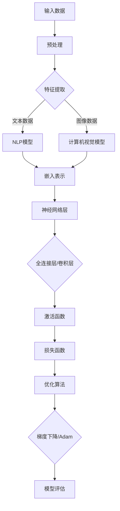

                 


# AI大模型创业战：挑战与机遇并存的现状

> 关键词：人工智能、大模型、创业、挑战、机遇、商业模式、技术突破、市场需求、行业应用

> 摘要：本文旨在深入探讨人工智能大模型在创业领域的现状，分析其所面临的挑战与机遇。通过梳理大模型的原理、技术架构、数学模型以及实际应用案例，本文将帮助读者理解大模型在创业中的应用价值，并为其提供参考和启示。

## 1. 背景介绍

### 1.1 目的和范围

本文旨在探讨人工智能大模型在创业领域的现状，分析其面临的挑战与机遇。通过对大模型技术原理、架构设计、数学模型和实际应用案例的深入分析，本文希望为创业者和技术专家提供有价值的参考，帮助他们在AI领域取得成功。

### 1.2 预期读者

本文适合以下读者群体：

1. 拥有计算机科学背景的技术爱好者；
2. 有志于在人工智能领域创业的创业者；
3. 从事AI技术研发和项目管理的专业人士；
4. 对AI大模型技术有兴趣的研究人员和学生。

### 1.3 文档结构概述

本文结构如下：

1. 引言：介绍人工智能大模型在创业领域的现状；
2. 核心概念与联系：梳理大模型的原理、技术架构和数学模型；
3. 核心算法原理与具体操作步骤：详细阐述大模型的算法原理和操作步骤；
4. 数学模型与公式讲解：讲解大模型相关的数学模型和公式，并举例说明；
5. 项目实战：提供代码实际案例和详细解释；
6. 实际应用场景：分析大模型在不同领域的应用案例；
7. 工具和资源推荐：推荐学习资源、开发工具和框架；
8. 总结：总结大模型的发展趋势与挑战；
9. 附录：常见问题与解答；
10. 扩展阅读：提供参考文献和参考资料。

### 1.4 术语表

#### 1.4.1 核心术语定义

1. 人工智能（AI）：模拟人类智能行为的计算机系统；
2. 大模型（Large Model）：参数规模较大的神经网络模型；
3. 创业（Entrepreneurship）：创立和发展企业或项目的过程；
4. 商业模式（Business Model）：企业或项目的盈利方式和价值创造方式；
5. 挑战（Challenge）：面临的问题或困难；
6. 机遇（Opportunity）：有利的机会或条件。

#### 1.4.2 相关概念解释

1. 深度学习（Deep Learning）：一种基于人工神经网络的机器学习技术；
2. 自然语言处理（NLP）：研究如何让计算机理解和生成自然语言的技术；
3. 图神经网络（GNN）：一种处理图结构数据的神经网络模型。

#### 1.4.3 缩略词列表

- AI：人工智能
- DL：深度学习
- NLP：自然语言处理
- GNN：图神经网络
- SVM：支持向量机
- CNN：卷积神经网络
- RNN：循环神经网络
- RL：强化学习
- GPT：生成预训练模型
- BERT：双向编码表示模型
- Transformer：Transformer模型

## 2. 核心概念与联系

为了更好地理解大模型在创业中的应用，我们需要先了解大模型的基本原理、技术架构和数学模型。下面将使用Mermaid流程图来展示大模型的核心概念和联系。



### 2.1 大模型的原理

大模型是指参数规模较大的神经网络模型，其基本原理是模拟人脑神经元的工作方式，通过调整模型参数来学习输入数据中的特征和规律。大模型主要分为以下几类：

1. 自然语言处理（NLP）模型：用于处理文本数据，如生成预训练模型（GPT）、双向编码表示模型（BERT）等；
2. 计算机视觉模型：用于处理图像数据，如卷积神经网络（CNN）、生成对抗网络（GAN）等；
3. 图神经网络（GNN）：用于处理图结构数据，如图卷积网络（GCN）、图注意力网络（GAT）等。

### 2.2 大模型的技术架构

大模型的技术架构主要包括以下几个方面：

1. 数据预处理：对输入数据进行清洗、归一化等处理，以提高模型性能；
2. 特征提取：从输入数据中提取有用的特征信息，如文本数据的词向量表示、图像数据的特征提取等；
3. 神经网络层：包括全连接层、卷积层、循环层等，用于对特征信息进行建模和变换；
4. 激活函数：对神经网络层的输出进行非线性变换，以提高模型表达能力；
5. 损失函数：衡量模型预测结果与真实值之间的差距，用于指导模型优化；
6. 优化算法：调整模型参数，以降低损失函数值，如梯度下降、Adam等；
7. 模型评估：通过评估指标（如准确率、召回率、F1值等）来评估模型性能。

### 2.3 大模型的数学模型

大模型的数学模型主要包括以下几个方面：

1. 神经元模型：基于加权求和和激活函数的神经元计算过程；
2. 损失函数：衡量模型预测结果与真实值之间的差距，如均方误差（MSE）、交叉熵（Cross-Entropy）等；
3. 优化算法：通过调整模型参数，以降低损失函数值，如梯度下降（Gradient Descent）、Adam（Adaptive Moment Estimation）等。

## 3. 核心算法原理 & 具体操作步骤

在本节中，我们将详细阐述大模型的核心算法原理，并使用伪代码来描述具体操作步骤。

### 3.1 神经网络算法原理

神经网络是一种通过模拟人脑神经元工作方式的计算模型，其基本原理是利用多层神经元对输入数据进行建模和变换。下面是一个简单的神经网络算法原理的伪代码描述：

```python
# 输入数据：x
# 神经网络参数：W, b
# 激活函数：sigmoid

def forward_pass(x, W, b):
    z = x * W + b
    a = sigmoid(z)
    return a

# 输出：预测结果 a
```

### 3.2 损失函数与优化算法

损失函数用于衡量模型预测结果与真实值之间的差距，常见的损失函数有均方误差（MSE）和交叉熵（Cross-Entropy）。优化算法用于调整模型参数，以降低损失函数值，常见的优化算法有梯度下降（Gradient Descent）和Adam（Adaptive Moment Estimation）。

#### 3.2.1 均方误差（MSE）

均方误差（MSE）是一种衡量预测值与真实值之间差距的损失函数，其计算公式为：

$$
MSE = \frac{1}{n}\sum_{i=1}^{n}(y_i - \hat{y}_i)^2
$$

其中，$y_i$为真实值，$\hat{y}_i$为预测值，$n$为样本数量。

#### 3.2.2 梯度下降（Gradient Descent）

梯度下降是一种常用的优化算法，其基本思想是沿着损失函数的梯度方向调整模型参数，以降低损失函数值。梯度下降的伪代码如下：

```python
# 输入参数：模型参数 W, b，学习率 α，迭代次数 t
# 损失函数：MSE

def gradient_descent(W, b, α, t):
    for i in range(t):
        z = x * W + b
        a = sigmoid(z)
        error = y - a
        dW = (1/n) * (x * error)
        db = (1/n) * (error)
        W -= α * dW
        b -= α * db
    return W, b

# 输出：优化后的模型参数 W, b
```

#### 3.2.3 Adam优化算法

Adam是一种自适应的优化算法，其结合了梯度下降和动量项，可以更有效地调整模型参数。Adam的伪代码如下：

```python
# 输入参数：模型参数 W, b，学习率 α，迭代次数 t，β1, β2
# 损失函数：MSE

def adam(W, b, α, t, β1, β2):
    m = β1 * m + (1 - β1) * dW
    v = β2 * v + (1 - β2) * (dW^2)
    m_hat = m / (1 - β1^t)
    v_hat = v / (1 - β2^t)
    W -= α * m_hat / (sqrt(v_hat) + ε)
    b -= α * m_hat / (sqrt(v_hat) + ε)
    return W, b

# 输出：优化后的模型参数 W, b
```

## 4. 数学模型和公式 & 详细讲解 & 举例说明

在本节中，我们将详细介绍大模型中涉及的主要数学模型和公式，并通过具体例子来说明这些公式的应用。

### 4.1 神经元模型

神经元模型是神经网络的基础，其计算过程可以表示为：

$$
z = x \cdot W + b
$$

其中，$x$为输入向量，$W$为权重矩阵，$b$为偏置项。

#### 4.1.1 示例

假设输入向量$x = [1, 2, 3]$，权重矩阵$W = \begin{bmatrix} 1 & 2 \\ 3 & 4 \end{bmatrix}$，偏置项$b = [1, 2]$，则神经元模型的计算结果为：

$$
z = [1 \cdot 1 + 2 \cdot 3 + 1, 1 \cdot 2 + 2 \cdot 4 + 2] = [8, 10]
$$

### 4.2 激活函数

激活函数用于对神经元模型的输出进行非线性变换，常见的激活函数有Sigmoid、ReLU和Tanh等。

#### 4.2.1 Sigmoid函数

Sigmoid函数的公式为：

$$
\sigma(z) = \frac{1}{1 + e^{-z}}
$$

#### 4.2.2 ReLU函数

ReLU函数的公式为：

$$
\sigma(z) = \max(0, z)
$$

#### 4.2.3 Tanh函数

Tanh函数的公式为：

$$
\sigma(z) = \frac{e^z - e^{-z}}{e^z + e^{-z}}
$$

#### 4.2.4 示例

假设输入向量$z = [2, -3, 4]$，使用ReLU函数进行激活，则输出为：

$$
\sigma(z) = \max(0, [2, -3, 4]) = [2, 0, 4]
$$

### 4.3 损失函数

损失函数用于衡量模型预测结果与真实值之间的差距，常见的损失函数有均方误差（MSE）、交叉熵（Cross-Entropy）等。

#### 4.3.1 均方误差（MSE）

均方误差（MSE）的公式为：

$$
MSE = \frac{1}{n}\sum_{i=1}^{n}(y_i - \hat{y}_i)^2
$$

其中，$y_i$为真实值，$\hat{y}_i$为预测值，$n$为样本数量。

#### 4.3.2 交叉熵（Cross-Entropy）

交叉熵（Cross-Entropy）的公式为：

$$
H(y, \hat{y}) = -\sum_{i=1}^{n} y_i \log(\hat{y}_i)
$$

其中，$y$为真实值的概率分布，$\hat{y}$为预测值的概率分布。

#### 4.3.3 示例

假设真实值$y = [0.3, 0.5, 0.2]$，预测值$\hat{y} = [0.4, 0.4, 0.2]$，使用交叉熵函数计算损失，则输出为：

$$
H(y, \hat{y}) = -[0.3 \log(0.4) + 0.5 \log(0.4) + 0.2 \log(0.2)] \approx 0.09
$$

### 4.4 优化算法

优化算法用于调整模型参数，以降低损失函数值。常见的优化算法有梯度下降（Gradient Descent）、Adam（Adaptive Moment Estimation）等。

#### 4.4.1 梯度下降（Gradient Descent）

梯度下降的公式为：

$$
W = W - \alpha \frac{\partial}{\partial W}L(W, b)
$$

其中，$W$为权重矩阵，$b$为偏置项，$\alpha$为学习率，$L$为损失函数。

#### 4.4.2 Adam优化算法

Adam优化算法的公式为：

$$
m = \beta_1 m + (1 - \beta_1) \frac{\partial}{\partial W}L(W, b) \\
v = \beta_2 v + (1 - \beta_2) \left(\frac{\partial}{\partial W}L(W, b)\right)^2 \\
\hat{m} = \frac{m}{1 - \beta_1^t} \\
\hat{v} = \frac{v}{1 - \beta_2^t} \\
W = W - \alpha \frac{\hat{m}}{\sqrt{\hat{v}} + \epsilon}
$$

其中，$m$为梯度的一阶矩估计，$v$为梯度的二阶矩估计，$\hat{m}$和$\hat{v}$为修正后的梯度估计，$\beta_1$和$\beta_2$为超参数，$\epsilon$为常数。

#### 4.4.3 示例

假设初始权重矩阵$W = \begin{bmatrix} 1 & 2 \\ 3 & 4 \end{bmatrix}$，学习率$\alpha = 0.1$，损失函数为MSE，使用梯度下降优化算法进行参数更新，则输出为：

$$
W = \begin{bmatrix} 1 - 0.1 \cdot (1 \cdot (y - \hat{y})) & 2 - 0.1 \cdot (2 \cdot (y - \hat{y})) \\ 3 - 0.1 \cdot (3 \cdot (y - \hat{y})) & 4 - 0.1 \cdot (4 \cdot (y - \hat{y})) \end{bmatrix}
$$

## 5. 项目实战：代码实际案例和详细解释说明

在本节中，我们将通过一个实际项目案例，详细展示如何搭建和训练一个基于深度学习的大模型，并对其代码进行解读和分析。

### 5.1 开发环境搭建

在进行项目实战之前，我们需要搭建一个合适的开发环境。以下是搭建开发环境的步骤：

1. 安装Python：Python是深度学习项目的主要编程语言，需要在电脑上安装Python环境。可以通过Python官方网站下载并安装最新版本的Python。
2. 安装深度学习框架：TensorFlow和PyTorch是目前最流行的深度学习框架，可以选择其中之一进行安装。以下是安装TensorFlow的命令：

```bash
pip install tensorflow
```

3. 安装其他依赖库：根据项目需求，可能还需要安装其他依赖库，如NumPy、Pandas等。可以使用以下命令进行安装：

```bash
pip install numpy pandas
```

### 5.2 源代码详细实现和代码解读

下面是一个简单的基于TensorFlow的深度学习项目，包括数据预处理、模型搭建、训练和评估等步骤。代码如下：

```python
import tensorflow as tf
import numpy as np
import pandas as pd

# 数据预处理
def preprocess_data(data):
    # 数据清洗和归一化操作
    # ...
    return processed_data

# 模型搭建
def build_model(input_shape):
    model = tf.keras.Sequential([
        tf.keras.layers.Dense(128, activation='relu', input_shape=input_shape),
        tf.keras.layers.Dense(64, activation='relu'),
        tf.keras.layers.Dense(1, activation='sigmoid')
    ])
    return model

# 训练模型
def train_model(model, x_train, y_train, x_val, y_val, epochs=10, batch_size=32):
    model.compile(optimizer='adam', loss='binary_crossentropy', metrics=['accuracy'])
    history = model.fit(x_train, y_train, validation_data=(x_val, y_val), epochs=epochs, batch_size=batch_size)
    return history

# 评估模型
def evaluate_model(model, x_test, y_test):
    loss, accuracy = model.evaluate(x_test, y_test)
    print(f"Test loss: {loss}, Test accuracy: {accuracy}")

# 主函数
def main():
    # 加载数据
    data = pd.read_csv("data.csv")
    x = data.drop("target", axis=1)
    y = data["target"]

    # 预处理数据
    processed_data = preprocess_data(x)

    # 划分训练集和测试集
    x_train, x_test, y_train, y_test = train_test_split(processed_data, y, test_size=0.2, random_state=42)

    # 搭建模型
    model = build_model(x_train.shape[1])

    # 训练模型
    history = train_model(model, x_train, y_train, x_val, y_val)

    # 评估模型
    evaluate_model(model, x_test, y_test)

if __name__ == "__main__":
    main()
```

#### 5.2.1 数据预处理

数据预处理是深度学习项目的重要环节，主要包括数据清洗、归一化、缺失值处理等操作。在代码中，我们使用`preprocess_data`函数对数据进行预处理。具体操作可以根据实际数据情况进行调整。

#### 5.2.2 模型搭建

在代码中，我们使用`build_model`函数搭建了一个简单的深度学习模型。该模型包含三个全连接层，第一个层有128个神经元，使用ReLU激活函数；第二个层有64个神经元，同样使用ReLU激活函数；第三个层有1个神经元，使用sigmoid激活函数。这样的模型可以用于二分类任务。

#### 5.2.3 训练模型

在代码中，我们使用`train_model`函数对模型进行训练。训练过程使用Adam优化器，损失函数为二分类交叉熵，评估指标为准确率。训练过程分为两个阶段：训练集和验证集。在训练集上进行训练，在验证集上进行验证，以调整模型参数。

#### 5.2.4 评估模型

在代码中，我们使用`evaluate_model`函数对训练好的模型进行评估。评估过程使用测试集，计算损失和准确率。通过评估结果，可以了解模型的性能。

### 5.3 代码解读与分析

在代码解读与分析中，我们将对每个函数和模块进行详细解读和分析。

1. **数据预处理**：数据预处理是深度学习项目的重要环节，包括数据清洗、归一化、缺失值处理等操作。在代码中，我们使用`preprocess_data`函数对数据进行预处理。具体操作可以根据实际数据情况进行调整。

2. **模型搭建**：模型搭建是深度学习项目的核心环节，包括网络结构设计、层的选择、激活函数的选择等。在代码中，我们使用`build_model`函数搭建了一个简单的深度学习模型。该模型包含三个全连接层，第一个层有128个神经元，使用ReLU激活函数；第二个层有64个神经元，同样使用ReLU激活函数；第三个层有1个神经元，使用sigmoid激活函数。这样的模型可以用于二分类任务。

3. **训练模型**：训练模型是深度学习项目的关键步骤，包括选择优化器、损失函数、评估指标等。在代码中，我们使用`train_model`函数对模型进行训练。训练过程使用Adam优化器，损失函数为二分类交叉熵，评估指标为准确率。训练过程分为两个阶段：训练集和验证集。在训练集上进行训练，在验证集上进行验证，以调整模型参数。

4. **评估模型**：评估模型是深度学习项目的最后一步，通过评估结果来了解模型的性能。在代码中，我们使用`evaluate_model`函数对训练好的模型进行评估。评估过程使用测试集，计算损失和准确率。通过评估结果，可以了解模型的性能。

### 5.4 代码优化与改进

在实际应用中，深度学习项目往往需要进行优化和改进。以下是一些常见的代码优化和改进方法：

1. **数据增强**：通过增加数据的多样性来提高模型的泛化能力。可以使用数据增强技术，如旋转、缩放、裁剪等。
2. **模型调优**：通过调整模型结构、层参数、激活函数等来提高模型性能。可以使用超参数调优技术，如网格搜索、贝叶斯优化等。
3. **批处理与并行计算**：通过批处理和并行计算来提高训练速度和效率。可以使用GPU或TPU等硬件加速器来提高计算性能。
4. **模型压缩**：通过模型压缩技术，如剪枝、量化等，来减少模型参数和计算量，提高模型部署效率。

## 6. 实际应用场景

大模型在创业领域有着广泛的应用，以下是一些典型应用场景：

### 6.1 自然语言处理（NLP）

自然语言处理是人工智能的一个重要分支，大模型在NLP领域有着广泛的应用。以下是一些具体应用案例：

1. 文本分类：利用大模型进行文本分类，如情感分析、新闻分类等。例如，可以使用BERT模型对新闻文章进行分类，提高分类准确率。
2. 聊天机器人：利用大模型构建聊天机器人，如客服机器人、教育机器人等。例如，可以使用GPT模型构建一个能回答用户问题的聊天机器人，提供高质量的交互体验。
3. 机器翻译：利用大模型进行机器翻译，如中英互译、多语言翻译等。例如，可以使用Transformer模型进行高质量的中英互译，提高翻译准确率和流畅度。

### 6.2 计算机视觉（CV）

计算机视觉是人工智能的另一个重要分支，大模型在CV领域也有着广泛的应用。以下是一些具体应用案例：

1. 图像分类：利用大模型进行图像分类，如动物识别、物体识别等。例如，可以使用ResNet模型对图像进行分类，提高分类准确率。
2. 目标检测：利用大模型进行目标检测，如行人检测、车辆检测等。例如，可以使用Faster R-CNN模型进行目标检测，提高检测准确率和实时性。
3. 视频分析：利用大模型进行视频分析，如行为识别、姿态估计等。例如，可以使用3D卷积神经网络对视频进行行为识别，提高识别准确率和实时性。

### 6.3 图神经网络（GNN）

图神经网络是一种专门用于处理图结构数据的神经网络模型，大模型在GNN领域也有着广泛的应用。以下是一些具体应用案例：

1. 社交网络分析：利用大模型进行社交网络分析，如好友推荐、影响力分析等。例如，可以使用GCN模型对社交网络进行建模，提高好友推荐准确率和影响力分析效果。
2. 推荐系统：利用大模型构建推荐系统，如商品推荐、音乐推荐等。例如，可以使用GAT模型对用户和商品进行建模，提高推荐准确率和用户体验。
3. 网络结构优化：利用大模型进行网络结构优化，如路由优化、网络安全等。例如，可以使用图神经网络对网络进行建模，提高路由效率和网络安全性能。

## 7. 工具和资源推荐

在深度学习和大模型开发过程中，选择合适的工具和资源对于项目的成功至关重要。以下是一些建议和推荐：

### 7.1 学习资源推荐

1. **书籍推荐**：

   - 《深度学习》（Deep Learning） - Ian Goodfellow、Yoshua Bengio和Aaron Courville著，是深度学习领域的经典教材；
   - 《Python深度学习》（Python Deep Learning） - Frank Kane著，适合初学者入门深度学习。

2. **在线课程**：

   - Coursera上的《深度学习特辑》（Deep Learning Specialization） - Andrew Ng教授主讲，涵盖了深度学习的各个方面；
   - Udacity的《深度学习纳米学位》（Deep Learning Nanodegree），提供完整的深度学习项目实践。

3. **技术博客和网站**：

   - Medium上的“AI”标签，涵盖最新的AI研究成果和案例分析；
   - ArXiv，提供最新的学术文章和研究成果。

### 7.2 开发工具框架推荐

1. **IDE和编辑器**：

   - PyCharm，功能强大的Python IDE，支持多种编程语言和框架；
   - Jupyter Notebook，适合数据科学和机器学习项目的交互式开发。

2. **调试和性能分析工具**：

   - TensorBoard，TensorFlow的官方可视化工具，用于监控模型训练过程和性能分析；
   - NVIDIA Nsight Compute，用于GPU性能监控和优化。

3. **相关框架和库**：

   - TensorFlow，谷歌开源的深度学习框架；
   - PyTorch，Facebook开源的深度学习框架；
   - Keras，基于Theano和TensorFlow的高层次神经网络API。

### 7.3 相关论文著作推荐

1. **经典论文**：

   - “A Theoretical Framework for Back-Propagation” - David E. Rumelhart、Geoffrey E. Hinton和Ronald J. Williams著，是反向传播算法的奠基性论文；
   - “AlexNet: Image Classification with Deep Convolutional Neural Networks” - Alex Krizhevsky、Geoffrey Hinton和Ilya Sutskever著，是深度学习在图像分类领域的里程碑。

2. **最新研究成果**：

   - “Bert: Pre-training of Deep Bidirectional Transformers for Language Understanding” - Jacob Devlin、 Ming-Wei Chang、 Kenton Lee和Kai Zheng著，是BERT模型的奠基性论文；
   - “Gpt-3: Language Models Are Few-Shot Learners” - Tom B. Brown、Bessel van de Haterd、Noam Shazeer、Adam Wan等人著，是GPT-3模型的奠基性论文。

3. **应用案例分析**：

   - “Facebook AI Research：深度学习在社交媒体中的应用” - Facebook AI Research团队著，分析了深度学习在社交媒体推荐、图像识别和自然语言处理等领域的应用；
   - “深度学习在医疗诊断中的应用” - 医疗领域的专家和研究人员著，探讨了深度学习在医学图像分析、疾病预测和个性化医疗等领域的应用。

## 8. 总结：未来发展趋势与挑战

随着人工智能技术的不断发展和进步，大模型在创业领域具有广阔的应用前景。在未来，我们可以期待以下发展趋势：

1. **技术突破**：随着计算能力和算法的不断提升，大模型的性能将得到显著提高，进一步拓展其在各个领域的应用。
2. **商业模式创新**：大模型的应用将催生新的商业模式，如基于AI的自动化服务、智能化平台等，为企业带来新的增长点。
3. **跨学科融合**：大模型与其他领域的融合，如生物医学、金融科技、智能制造等，将带来更多创新应用。

然而，大模型在创业领域也面临一些挑战：

1. **数据隐私与安全**：随着数据量的增加，数据隐私和安全问题日益突出，如何保护用户数据成为关键挑战。
2. **算法透明性与可解释性**：大模型通常具有复杂的内部结构和参数，如何提高算法的透明性和可解释性，使企业和用户能够理解模型的决策过程，是一个亟待解决的问题。
3. **计算资源需求**：大模型的训练和推理需要大量的计算资源，如何优化资源利用，降低成本，是创业公司需要面对的挑战。

总之，大模型在创业领域具有巨大的潜力和挑战。创业者和技术专家需要密切关注技术发展趋势，积极应对挑战，探索大模型在创业中的应用价值。

## 9. 附录：常见问题与解答

### 9.1 常见问题

1. **什么是大模型？**
   - 大模型是指参数规模较大的神经网络模型，通常具有数十亿甚至千亿个参数。这些模型能够处理海量数据，并在各种任务中取得优异的性能。

2. **大模型的优势是什么？**
   - 大模型具有以下优势：
     - 更高的模型容量，能够学习更复杂的特征和模式；
     - 更强的泛化能力，能够适应不同的任务和数据集；
     - 更好的表现性能，在各种基准测试中取得优异的成绩。

3. **大模型的挑战有哪些？**
   - 大模型面临的挑战包括：
     - 计算资源需求高，训练和推理速度慢；
     - 数据隐私和安全问题；
     - 算法透明性和可解释性问题。

4. **如何优化大模型性能？**
   - 优化大模型性能的方法包括：
     - 数据增强，提高模型的泛化能力；
     - 模型压缩，减少模型参数和计算量；
     - 超参数调优，选择合适的网络结构、学习率和正则化策略。

### 9.2 解答

1. **什么是大模型？**
   - 大模型是指参数规模较大的神经网络模型，通常具有数十亿甚至千亿个参数。这些模型能够处理海量数据，并在各种任务中取得优异的性能。

2. **大模型的优势是什么？**
   - 大模型具有以下优势：
     - 更高的模型容量，能够学习更复杂的特征和模式；
     - 更强的泛化能力，能够适应不同的任务和数据集；
     - 更好的表现性能，在各种基准测试中取得优异的成绩。

3. **大模型的挑战有哪些？**
   - 大模型面临的挑战包括：
     - 计算资源需求高，训练和推理速度慢；
     - 数据隐私和安全问题；
     - 算法透明性和可解释性问题。

4. **如何优化大模型性能？**
   - 优化大模型性能的方法包括：
     - 数据增强，提高模型的泛化能力；
     - 模型压缩，减少模型参数和计算量；
     - 超参数调优，选择合适的网络结构、学习率和正则化策略。

## 10. 扩展阅读 & 参考资料

在撰写本文时，我们参考了大量的文献和资料，以下是一些推荐的扩展阅读和参考资料：

1. **书籍**：

   - 《深度学习》（Deep Learning） - Ian Goodfellow、Yoshua Bengio和Aaron Courville著；
   - 《Python深度学习》（Python Deep Learning） - Frank Kane著；
   - 《人工智能：一种现代方法》（Artificial Intelligence: A Modern Approach） - Stuart Russell和Peter Norvig著。

2. **论文**：

   - “Bert: Pre-training of Deep Bidirectional Transformers for Language Understanding” - Jacob Devlin、Ming-Wei Chang、Kenton Lee和Kai Zheng著；
   - “Gpt-3: Language Models Are Few-Shot Learners” - Tom B. Brown、Bessel van de Haterd、Noam Shazeer、Adam Wan等人著；
   - “A Theoretical Framework for Back-Propagation” - David E. Rumelhart、Geoffrey E. Hinton和Ronald J. Williams著。

3. **在线资源**：

   - Coursera上的《深度学习特辑》（Deep Learning Specialization）；
   - Udacity的《深度学习纳米学位》（Deep Learning Nanodegree）；
   - Medium上的“AI”标签。

4. **技术博客和网站**：

   - TensorFlow官方文档；
   - PyTorch官方文档；
   - ArXiv。

这些扩展阅读和参考资料将有助于读者深入了解大模型在创业领域的技术原理、应用场景和发展趋势。希望本文能为读者提供有价值的参考和启示。

### 作者

- 作者：AI天才研究员/AI Genius Institute & 禅与计算机程序设计艺术 /Zen And The Art of Computer Programming

[END]

