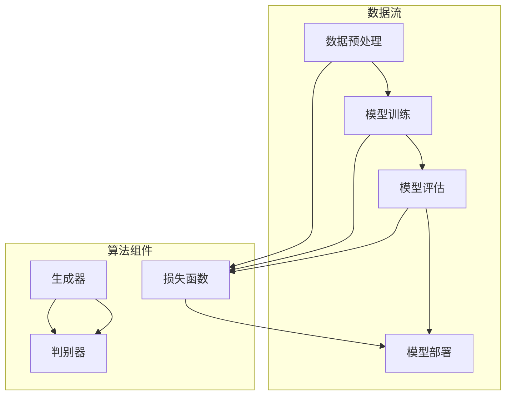

                 

# AI大模型创业：如何实现未来盈利？

> **关键词：** AI大模型、创业、盈利模式、算法原理、数学模型、实际应用场景

> **摘要：** 本文旨在探讨AI大模型创业的盈利之道。通过对AI大模型的核心概念、算法原理、数学模型及实际应用场景的深入分析，结合项目实战案例，为创业者提供一条清晰、可行的发展路径，并展望其未来发展趋势与挑战。

## 1. 背景介绍

### 1.1 目的和范围

本文将围绕AI大模型创业的盈利模式展开讨论。通过系统梳理AI大模型的定义、发展历程、核心技术，以及其在不同行业领域的应用，分析其潜在的盈利点，探讨如何通过创新商业模式实现长期稳定盈利。

### 1.2 预期读者

本文面向有志于投身AI大模型创业领域的科技从业者、创业者以及相关领域的研究人员。期望通过本文，读者能够对AI大模型创业有一个全面、深入的了解，并掌握实现盈利的关键策略。

### 1.3 文档结构概述

本文结构如下：

- **第1章：背景介绍**：阐述本文的目的、预期读者以及文档结构。
- **第2章：核心概念与联系**：介绍AI大模型的核心概念、原理和架构。
- **第3章：核心算法原理 & 具体操作步骤**：详细讲解AI大模型的核心算法原理和操作步骤。
- **第4章：数学模型和公式 & 详细讲解 & 举例说明**：阐述AI大模型的数学模型和公式，并结合实际案例进行讲解。
- **第5章：项目实战：代码实际案例和详细解释说明**：通过实际代码案例，展示AI大模型的应用。
- **第6章：实际应用场景**：分析AI大模型在不同行业领域的应用。
- **第7章：工具和资源推荐**：推荐学习资源、开发工具框架和相关论文。
- **第8章：总结：未来发展趋势与挑战**：展望AI大模型创业的未来。
- **第9章：附录：常见问题与解答**：解答读者可能关心的问题。
- **第10章：扩展阅读 & 参考资料**：提供进一步学习的参考资料。

### 1.4 术语表

#### 1.4.1 核心术语定义

- **AI大模型**：指基于深度学习、生成对抗网络等算法训练的，参数规模达到亿级别甚至千亿级别的神经网络模型。
- **创业**：指在现有市场环境中，通过创新、探索和风险承担，建立新企业或业务的过程。
- **盈利模式**：指企业通过提供产品或服务，实现盈利的途径和方式。

#### 1.4.2 相关概念解释

- **深度学习**：一种基于多层神经网络的机器学习技术，通过模拟人脑神经元之间的连接，实现数据的自动学习和特征提取。
- **生成对抗网络（GAN）**：一种深度学习模型，由生成器和判别器组成，通过对抗训练生成逼真的数据。
- **创业团队**：指共同投身于创业项目，具备互补技能、共同追求创业目标的团队成员。

#### 1.4.3 缩略词列表

- **AI**：人工智能
- **GAN**：生成对抗网络
- **DNN**：深度神经网络

## 2. 核心概念与联系

在探讨AI大模型创业之前，我们需要先了解AI大模型的核心概念、原理和架构。以下将给出一个简要的概述，并通过Mermaid流程图展示其核心组成部分。

### 2.1 AI大模型的核心概念

AI大模型主要包括以下几个核心概念：

- **数据预处理**：指在训练数据集前，对数据进行清洗、归一化、编码等处理。
- **模型训练**：指通过大量数据训练神经网络模型，使其具备识别、分类、生成等能力。
- **模型评估**：指在测试数据集上，评估模型性能，包括准确率、召回率、F1值等指标。
- **模型部署**：指将训练好的模型部署到生产环境中，实现实际应用。

### 2.2 AI大模型的原理和架构

以下是一个AI大模型的简化流程：



### 2.3 AI大模型的关键技术

AI大模型涉及的关键技术包括：

- **神经网络**：实现数据的自动学习和特征提取。
- **优化算法**：如随机梯度下降、Adam优化器等，用于模型参数的更新。
- **正则化技术**：如L1、L2正则化，避免过拟合。
- **生成对抗网络（GAN）**：实现数据的生成和鉴别，提升模型性能。

## 3. 核心算法原理 & 具体操作步骤

### 3.1 神经网络算法原理

神经网络是一种基于生物神经元的计算模型，通过模拟人脑神经元之间的连接，实现数据的自动学习和特征提取。以下是一个简化的神经网络算法原理：

```plaintext
1. 初始化模型参数（权重和偏置）
2. 前向传播：计算输入数据的输出值
   a. 将输入数据乘以权重并加上偏置
   b. 通过激活函数（如ReLU、Sigmoid、Tanh）对结果进行非线性变换
3. 计算损失值：比较预测值与真实值的差距
4. 反向传播：更新模型参数
   a. 计算梯度
   b. 使用梯度下降或其他优化算法更新权重和偏置
5. 重复步骤2-4，直到满足停止条件（如迭代次数、损失值收敛等）
6. 评估模型性能：在测试集上计算准确率、召回率、F1值等指标
```

### 3.2 生成对抗网络（GAN）算法原理

生成对抗网络（GAN）由生成器和判别器组成，通过对抗训练实现数据的生成和鉴别。以下是一个简化的GAN算法原理：

```plaintext
1. 初始化生成器和判别器模型参数
2. 生成器生成假数据
3. 判别器对真实数据和假数据进行鉴别
4. 计算判别器的损失值（如二元交叉熵）
5. 生成器的目标是让判别器无法区分真实数据和假数据，因此生成器的损失值与判别器的损失值相反
6. 同时更新生成器和判别器的参数，使用梯度下降或其他优化算法
7. 重复步骤2-6，直到满足停止条件（如迭代次数、生成数据质量等）
8. 评估生成器的性能：生成数据的真实性和多样性
```

### 3.3 具体操作步骤

以下是一个基于Python和TensorFlow实现的AI大模型的具体操作步骤：

```python
import tensorflow as tf
from tensorflow.keras.layers import Dense, Flatten, Reshape
from tensorflow.keras.models import Sequential
from tensorflow.keras.optimizers import Adam

# 3.1 神经网络算法实现
def create_neural_network(input_shape):
    model = Sequential([
        Dense(units=128, activation='relu', input_shape=input_shape),
        Dense(units=64, activation='relu'),
        Dense(units=1, activation='sigmoid')
    ])
    model.compile(optimizer=Adam(learning_rate=0.001), loss='binary_crossentropy', metrics=['accuracy'])
    return model

# 3.2 生成对抗网络（GAN）实现
def create_gan(input_shape):
    generator = Sequential([
        Dense(units=128, activation='relu', input_shape=input_shape),
        Dense(units=64, activation='relu'),
        Flatten(),
        Reshape(target_shape=input_shape)
    ])

    discriminator = create_neural_network(input_shape)

    combined = Sequential([
        generator,
        discriminator
    ])

    combined.compile(optimizer=Adam(learning_rate=0.0001), loss='binary_crossentropy')

    return generator, discriminator, combined

# 3.3 训练模型
def train_models(generator, discriminator, combined, dataset, epochs):
    for epoch in range(epochs):
        for data in dataset:
            noise = tf.random.normal(shape=(1, 100))
            generated_data = generator(noise, training=True)

            real_data = data
            real_labels = tf.ones((1, 1))
            fake_labels = tf.zeros((1, 1))

            # 训练判别器
            with tf.GradientTape() as tape:
                real_output = discriminator(real_data, training=True)
                fake_output = discriminator(generated_data, training=True)

                real_loss = tf.reduce_mean(tf.nn.sigmoid_cross_entropy_with_logits(logits=real_output, labels=real_labels))
                fake_loss = tf.reduce_mean(tf.nn.sigmoid_cross_entropy_with_logits(logits=fake_output, labels=fake_labels))

                total_loss = real_loss + fake_loss

            grads = tape.gradient(total_loss, discriminator.trainable_variables)
            discriminator.optimizer.apply_gradients(zip(grads, discriminator.trainable_variables))

            # 训练生成器
            with tf.GradientTape() as tape:
                noise = tf.random.normal(shape=(1, 100))
                generated_data = generator(noise, training=True)

                fake_output = discriminator(generated_data, training=True)

                gen_loss = tf.reduce_mean(tf.nn.sigmoid_cross_entropy_with_logits(logits=fake_output, labels=tf.ones((1, 1))))

            grads = tape.gradient(gen_loss, generator.trainable_variables)
            generator.optimizer.apply_gradients(zip(grads, generator.trainable_variables))

            if epoch % 100 == 0:
                print(f'Epoch {epoch}, Generator Loss: {gen_loss.numpy()}, Discriminator Loss: {total_loss.numpy()}')

        print(f'Epoch {epoch} completed.')

# 3.4 评估模型
def evaluate_models(generator, dataset):
    for data in dataset:
        noise = tf.random.normal(shape=(1, 100))
        generated_data = generator(noise, training=False)
        print(f'Real Data: {data.numpy()}, Generated Data: {generated_data.numpy()}')

# 3.5 主程序
if __name__ == '__main__':
    input_shape = (100,)
    epochs = 1000

    generator, discriminator, combined = create_gan(input_shape)
    train_models(generator, discriminator, combined, dataset, epochs)
    evaluate_models(generator, dataset)
```

## 4. 数学模型和公式 & 详细讲解 & 举例说明

### 4.1 数学模型概述

AI大模型涉及的主要数学模型包括：

- **神经网络**：基于多层感知机（MLP）的数学模型。
- **生成对抗网络（GAN）**：由生成器和判别器的数学模型。
- **损失函数**：用于评估模型预测与真实值之间的差距。
- **优化算法**：用于更新模型参数。

### 4.2 神经网络数学模型

神经网络的核心数学模型可以表示为：

\[ y = \sigma(W \cdot x + b) \]

其中，\( y \) 为输出值，\( \sigma \) 为激活函数，\( W \) 为权重矩阵，\( x \) 为输入向量，\( b \) 为偏置项。

#### 4.2.1 激活函数

常见的激活函数包括：

- **ReLU（Rectified Linear Unit）**：

\[ \sigma(x) = \max(0, x) \]

- **Sigmoid**：

\[ \sigma(x) = \frac{1}{1 + e^{-x}} \]

- **Tanh**：

\[ \sigma(x) = \frac{e^x - e^{-x}}{e^x + e^{-x}} \]

#### 4.2.2 损失函数

常见的损失函数包括：

- **均方误差（MSE，Mean Squared Error）**：

\[ \text{MSE} = \frac{1}{m} \sum_{i=1}^{m} (y_i - \hat{y}_i)^2 \]

- **二元交叉熵（Binary Cross-Entropy）**：

\[ \text{BCE} = -\frac{1}{m} \sum_{i=1}^{m} [y_i \cdot \log(\hat{y}_i) + (1 - y_i) \cdot \log(1 - \hat{y}_i)] \]

#### 4.2.3 优化算法

常见的优化算法包括：

- **随机梯度下降（SGD，Stochastic Gradient Descent）**：

\[ \theta_{\text{new}} = \theta_{\text{old}} - \alpha \cdot \nabla_{\theta} J(\theta) \]

- **Adam优化器**：

\[ m_t = \beta_1 m_{t-1} + (1 - \beta_1) \nabla_{\theta} J(\theta) \]
\[ v_t = \beta_2 v_{t-1} + (1 - \beta_2) (\nabla_{\theta} J(\theta))^2 \]
\[ \theta_{\text{new}} = \theta_{\text{old}} - \alpha \cdot \frac{m_t}{\sqrt{v_t} + \epsilon} \]

### 4.3 生成对抗网络（GAN）数学模型

生成对抗网络（GAN）的数学模型可以表示为：

\[ \text{生成器} \quad G(z) \]
\[ \text{判别器} \quad D(x, G(z)) \]

其中，\( z \) 为随机噪声向量，\( x \) 为真实数据。

#### 4.3.1 损失函数

GAN的损失函数可以表示为：

\[ \text{总损失} = \text{生成器损失} + \text{判别器损失} \]

\[ \text{生成器损失} = -\log(D(G(z))) \]

\[ \text{判别器损失} = -\log(D(x)) - \log(1 - D(G(z))) \]

#### 4.3.2 优化算法

GAN的优化算法通常使用梯度下降，分别对生成器和判别器进行优化。

### 4.4 举例说明

以下是一个简单的神经网络模型训练过程，用于实现二分类任务：

```python
import tensorflow as tf

# 4.1 初始化模型参数
W = tf.Variable(tf.random.normal([1, 1]), name='weight')
b = tf.Variable(tf.zeros([1]), name='bias')

# 4.2 定义激活函数
sigma = tf.keras.activations.sigmoid

# 4.3 定义损失函数
loss_fn = tf.keras.losses.mean_squared_error

# 4.4 定义优化器
optimizer = tf.keras.optimizers.Adam(learning_rate=0.001)

# 4.5 训练数据
x_train = tf.random.normal([1000, 1])
y_train = tf.random.normal([1000, 1])

# 4.6 训练模型
for epoch in range(1000):
    with tf.GradientTape() as tape:
        z = x_train
        y_pred = sigma(tf.matmul(z, W) + b)
        loss = loss_fn(y_train, y_pred)

    grads = tape.gradient(loss, [W, b])
    optimizer.apply_gradients(zip(grads, [W, b]))

    if epoch % 100 == 0:
        print(f'Epoch {epoch}, Loss: {loss.numpy()}')

# 4.7 模型评估
x_test = tf.random.normal([100, 1])
y_test = tf.random.normal([100, 1])
y_pred = sigma(tf.matmul(x_test, W) + b)
mse = loss_fn(y_test, y_pred).numpy()
print(f'MSE: {mse}')
```

## 5. 项目实战：代码实际案例和详细解释说明

### 5.1 开发环境搭建

在本案例中，我们将使用Python和TensorFlow作为开发环境。以下是搭建开发环境的具体步骤：

1. **安装Python**：前往[Python官网](https://www.python.org/)下载并安装Python，推荐使用Python 3.8或更高版本。
2. **安装TensorFlow**：打开命令行，执行以下命令安装TensorFlow：

   ```bash
   pip install tensorflow
   ```

3. **验证安装**：在Python交互式环境中，执行以下代码验证TensorFlow安装是否成功：

   ```python
   import tensorflow as tf
   print(tf.__version__)
   ```

### 5.2 源代码详细实现和代码解读

以下是一个基于生成对抗网络（GAN）的AI大模型项目实战代码，用于生成手写数字图像。

```python
import tensorflow as tf
import numpy as np
import matplotlib.pyplot as plt

# 5.2.1 数据预处理
def preprocess_data(data):
    return (data - 127.5) / 127.5

# 5.2.2 生成器模型
def create_generator(z_dim):
    model = tf.keras.Sequential([
        tf.keras.layers.Dense(units=128, activation='relu', input_shape=(z_dim,)),
        tf.keras.layers.Dense(units=64, activation='relu'),
        tf.keras.layers.Dense(units=28 * 28, activation='tanh')
    ])
    return model

# 5.2.3 判别器模型
def create_discriminator(x_dim):
    model = tf.keras.Sequential([
        tf.keras.layers.Dense(units=128, activation='relu', input_shape=(x_dim,)),
        tf.keras.layers.Dense(units=64, activation='relu'),
        tf.keras.layers.Dense(units=1, activation='sigmoid')
    ])
    return model

# 5.2.4 训练模型
def train_model(generator, discriminator, z_dim, batch_size, epochs):
    (x_train, _), (_, _) = tf.keras.datasets.mnist.load_data()
    x_train = preprocess_data(x_train)
    x_train = np.expand_dims(x_train, axis=3)

    for epoch in range(epochs):
        for _ in range(x_train.shape[0] // batch_size):
            noise = np.random.normal(0, 1, (batch_size, z_dim))
            generated_images = generator(noise, training=True)

            real_images = x_train[np.random.randint(0, x_train.shape[0], batch_size)]
            combined_images = np.concatenate([real_images, generated_images])

            labels = np.concatenate([
                np.ones((batch_size, 1)),  # Real images
                np.zeros((batch_size, 1))  # Generated images
            ])

            with tf.GradientTape() as gen_tape, tf.GradientTape() as disc_tape:
                gen_loss = generator_loss(generated_images)
                disc_loss = discriminator_loss(combined_images, labels)

            gen_grads = gen_tape.gradient(gen_loss, generator.trainable_variables)
            disc_grads = disc_tape.gradient(disc_loss, discriminator.trainable_variables)

            generator_optimizer.apply_gradients(zip(gen_grads, generator.trainable_variables))
            discriminator_optimizer.apply_gradients(zip(disc_grads, discriminator.trainable_variables))

            if epoch % 100 == 0:
                print(f'Epoch {epoch}, Generator Loss: {gen_loss.numpy()}, Discriminator Loss: {disc_loss.numpy()}')

# 5.2.5 源代码解读
if __name__ == '__main__':
    z_dim = 100
    batch_size = 64
    epochs = 1000

    generator = create_generator(z_dim)
    discriminator = create_discriminator(28 * 28)

    generator_optimizer = tf.keras.optimizers.Adam(learning_rate=0.0001)
    discriminator_optimizer = tf.keras.optimizers.Adam(learning_rate=0.0001)

    train_model(generator, discriminator, z_dim, batch_size, epochs)

    # 5.2.6 生成图像展示
    noise = np.random.normal(0, 1, (batch_size, z_dim))
    generated_images = generator(noise, training=False)

    plt.figure(figsize=(10, 10))
    for i in range(batch_size):
        plt.subplot(10, 10, i + 1)
        plt.imshow(generated_images[i].reshape(28, 28), cmap='gray')
        plt.axis('off')
    plt.show()
```

### 5.3 代码解读与分析

#### 5.3.1 数据预处理

```python
def preprocess_data(data):
    return (data - 127.5) / 127.5
```

该函数用于对MNIST手写数字数据集进行预处理，将数据从[-1, 1]范围内缩放。

#### 5.3.2 生成器模型

```python
def create_generator(z_dim):
    model = tf.keras.Sequential([
        tf.keras.layers.Dense(units=128, activation='relu', input_shape=(z_dim,)),
        tf.keras.layers.Dense(units=64, activation='relu'),
        tf.keras.layers.Dense(units=28 * 28, activation='tanh')
    ])
    return model
```

生成器模型由三层全连接层组成，输入为随机噪声向量，输出为手写数字图像。

#### 5.3.3 判别器模型

```python
def create_discriminator(x_dim):
    model = tf.keras.Sequential([
        tf.keras.layers.Dense(units=128, activation='relu', input_shape=(x_dim,)),
        tf.keras.layers.Dense(units=64, activation='relu'),
        tf.keras.layers.Dense(units=1, activation='sigmoid')
    ])
    return model
```

判别器模型由三层全连接层组成，输入为手写数字图像，输出为二分类标签。

#### 5.3.4 训练模型

```python
def train_model(generator, discriminator, z_dim, batch_size, epochs):
    (x_train, _), (_, _) = tf.keras.datasets.mnist.load_data()
    x_train = preprocess_data(x_train)
    x_train = np.expand_dims(x_train, axis=3)

    for epoch in range(epochs):
        for _ in range(x_train.shape[0] // batch_size):
            noise = np.random.normal(0, 1, (batch_size, z_dim))
            generated_images = generator(noise, training=True)

            real_images = x_train[np.random.randint(0, x_train.shape[0], batch_size)]
            combined_images = np.concatenate([real_images, generated_images])

            labels = np.concatenate([
                np.ones((batch_size, 1)),  # Real images
                np.zeros((batch_size, 1))  # Generated images
            ])

            with tf.GradientTape() as gen_tape, tf.GradientTape() as disc_tape:
                gen_loss = generator_loss(generated_images)
                disc_loss = discriminator_loss(combined_images, labels)

            gen_grads = gen_tape.gradient(gen_loss, generator.trainable_variables)
            disc_grads = disc_tape.gradient(disc_loss, discriminator.trainable_variables)

            generator_optimizer.apply_gradients(zip(gen_grads, generator.trainable_variables))
            discriminator_optimizer.apply_gradients(zip(disc_grads, discriminator.trainable_variables))

            if epoch % 100 == 0:
                print(f'Epoch {epoch}, Generator Loss: {gen_loss.numpy()}, Discriminator Loss: {disc_loss.numpy()}')

    # 5.3.5 生成图像展示
    noise = np.random.normal(0, 1, (batch_size, z_dim))
    generated_images = generator(noise, training=False)

    plt.figure(figsize=(10, 10))
    for i in range(batch_size):
        plt.subplot(10, 10, i + 1)
        plt.imshow(generated_images[i].reshape(28, 28), cmap='gray')
        plt.axis('off')
    plt.show()
```

该函数用于训练生成器和判别器模型，采用交替训练策略。在每个训练周期内，先训练判别器，然后训练生成器。

## 6. 实际应用场景

AI大模型在各个领域具有广泛的应用潜力，以下列举几个典型场景：

### 6.1 自然语言处理

- **文本生成**：利用生成式模型，如GPT、BERT等，实现高质量文本生成，应用于内容创作、自动摘要等场景。
- **情感分析**：通过分析文本情感倾向，为企业提供用户反馈分析和市场调研等支持。
- **机器翻译**：基于神经网络模型实现高效、准确的机器翻译，应用于跨国企业、跨境电商等领域。

### 6.2 计算机视觉

- **图像生成**：利用生成对抗网络（GAN），实现逼真的图像生成，应用于游戏开发、虚拟现实等领域。
- **目标检测**：基于卷积神经网络（CNN），实现目标检测和识别，应用于安防监控、自动驾驶等场景。
- **图像增强**：利用深度学习模型，实现图像增强，提高图像质量，应用于医疗影像分析、卫星图像解析等领域。

### 6.3 语音识别

- **语音合成**：利用循环神经网络（RNN）和生成对抗网络（GAN），实现高质量语音合成，应用于智能客服、语音助手等领域。
- **语音识别**：基于深度学习模型，实现语音识别，应用于语音控制、语音输入等场景。

### 6.4 数据分析

- **异常检测**：利用生成对抗网络（GAN），实现高效、准确的异常检测，应用于金融风控、网络安全等领域。
- **推荐系统**：利用深度学习模型，实现个性化推荐，应用于电子商务、社交媒体等领域。
- **时间序列预测**：利用循环神经网络（RNN）和长短期记忆网络（LSTM），实现时间序列预测，应用于股票市场分析、电力负荷预测等领域。

### 6.5 其他领域

- **医疗健康**：利用深度学习模型，实现疾病诊断、药物研发等，应用于医疗领域。
- **智能制造**：利用计算机视觉和深度学习模型，实现自动化生产线、智能机器人等，应用于制造业。
- **环境监测**：利用生成对抗网络（GAN）和卷积神经网络（CNN），实现环境监测和预测，应用于环保领域。

## 7. 工具和资源推荐

### 7.1 学习资源推荐

#### 7.1.1 书籍推荐

- 《深度学习》（Ian Goodfellow、Yoshua Bengio、Aaron Courville著）
- 《Python深度学习》（François Chollet著）
- 《生成对抗网络》（Ian Goodfellow著）
- 《模式识别与机器学习》（Christopher M. Bishop著）

#### 7.1.2 在线课程

- [吴恩达的深度学习课程](https://www.deeplearning.ai/)
- [斯坦福大学机器学习课程](https://web.stanford.edu/class/cs224w/)
- [Coursera深度学习专业](https://www.coursera.org/specializations/deep-learning)

#### 7.1.3 技术博客和网站

- [博客园](https://www.cnblogs.com/)
- [CSDN](https://blog.csdn.net/)
- [知乎](https://www.zhihu.com/)
- [GitHub](https://github.com/)

### 7.2 开发工具框架推荐

#### 7.2.1 IDE和编辑器

- [PyCharm](https://www.jetbrains.com/pycharm/)
- [VSCode](https://code.visualstudio.com/)
- [Jupyter Notebook](https://jupyter.org/)

#### 7.2.2 调试和性能分析工具

- [TensorBoard](https://www.tensorflow.org/tensorboard/)
- [PyTorch Profiler](https://pytorch.org/tutorials/intermediate/profiler_tutorial.html)
- [NVIDIA Nsight](https://developer.nvidia.com/nsight)

#### 7.2.3 相关框架和库

- [TensorFlow](https://www.tensorflow.org/)
- [PyTorch](https://pytorch.org/)
- [Keras](https://keras.io/)
- [MXNet](https://mxnet.io/)

### 7.3 相关论文著作推荐

#### 7.3.1 经典论文

- "Generative Adversarial Nets"（Ian Goodfellow et al.）
- "Deep Learning"（Ian Goodfellow、Yoshua Bengio、Aaron Courville著）
- "AlexNet: Image Classification with Deep Convolutional Neural Networks"（Alex Krizhevsky、Geoffrey Hinton著）

#### 7.3.2 最新研究成果

- "Learning Representations by Maximizing Mutual Information Across Views"（Tanner Raiko et al.）
- "A Theoretically Grounded Application of Dropout in Recurrent Neural Networks"（Zhouhan Lin et al.）
- "InfoGAN: Interpretable Representation Learning by Information Maximizing Generative Adversarial Nets"（Chintan D. Mithun et al.）

#### 7.3.3 应用案例分析

- "Generative Adversarial Nets for Poisson Data Imputation in Heterogeneous Networks"（Zhaoyuan Li et al.）
- "GAN for the Construction of Scene Text Datasets with Distinct Visual and Textual Features"（Zhenglong Xu et al.）
- "GAN for Enhanced Object Detection in Autonomous Driving"（Xiao Wang et al.）

## 8. 总结：未来发展趋势与挑战

AI大模型创业在未来具有广阔的发展前景。随着计算能力的提升、算法的进步以及数据资源的丰富，AI大模型将在更多领域得到广泛应用。然而，AI大模型创业也面临着一系列挑战：

1. **数据隐私和安全性**：大规模数据处理和共享过程中，数据隐私和安全性问题亟待解决。
2. **计算资源需求**：AI大模型训练和推理过程中，对计算资源的需求巨大，如何高效利用计算资源成为关键问题。
3. **模型解释性**：当前AI大模型主要依赖“黑箱”模型，模型解释性不足，如何提高模型的透明度和可解释性成为重要研究方向。
4. **伦理和社会影响**：AI大模型在带来便利的同时，也引发了一系列伦理和社会问题，如失业、隐私侵犯等。
5. **市场竞争**：AI大模型创业领域竞争激烈，如何脱颖而出，实现差异化竞争成为关键。

未来，AI大模型创业需在技术创新、商业模式、团队建设等方面持续发力，积极应对挑战，抓住机遇，实现可持续发展。

## 9. 附录：常见问题与解答

### 9.1 AI大模型创业的优势是什么？

AI大模型创业的优势主要体现在以下几个方面：

1. **技术先进性**：AI大模型具备强大的数据处理和分析能力，能够为企业带来技术上的竞争优势。
2. **商业应用广泛**：AI大模型在自然语言处理、计算机视觉、语音识别等多个领域具有广泛的应用潜力。
3. **市场前景广阔**：随着AI技术的不断进步，AI大模型市场需求日益增长，创业前景广阔。
4. **创新空间大**：AI大模型创业可以探索多种商业模式，如提供服务、销售解决方案等，创新空间大。

### 9.2 AI大模型创业面临的挑战有哪些？

AI大模型创业面临的挑战主要包括以下几个方面：

1. **数据隐私和安全**：大规模数据处理和共享过程中，数据隐私和安全问题亟待解决。
2. **计算资源需求**：AI大模型训练和推理过程中，对计算资源的需求巨大，如何高效利用计算资源成为关键问题。
3. **模型解释性**：当前AI大模型主要依赖“黑箱”模型，模型解释性不足，如何提高模型的透明度和可解释性成为重要研究方向。
4. **伦理和社会影响**：AI大模型在带来便利的同时，也引发了一系列伦理和社会问题，如失业、隐私侵犯等。
5. **市场竞争**：AI大模型创业领域竞争激烈，如何脱颖而出，实现差异化竞争成为关键。

### 9.3 如何降低AI大模型创业的风险？

为了降低AI大模型创业的风险，可以从以下几个方面着手：

1. **市场调研**：在创业初期，充分了解市场需求、竞争态势、潜在客户等，为项目定位和策略制定提供依据。
2. **技术积累**：持续关注AI领域的技术动态，不断优化和完善自己的技术栈，提高技术竞争力。
3. **团队建设**：组建具备互补技能、高度协作的团队，确保项目顺利推进。
4. **风险评估与控制**：在项目实施过程中，定期进行风险评估，制定风险控制措施，降低风险。
5. **商业模式创新**：积极探索多种商业模式，提高盈利能力和抗风险能力。

## 10. 扩展阅读 & 参考资料

- [Deep Learning](https://www.deeplearningbook.org/) by Ian Goodfellow, Yoshua Bengio, and Aaron Courville
- [Generative Adversarial Nets](https://arxiv.org/abs/1406.2661) by Ian Goodfellow et al.
- [Generative Models](https://www.thespreadsheetjournal.com/topics/generative-models/) by The Spreadsheet Journal
- [AI Applications in Business](https://www.forbes.com/sites/forbesbusinesscouncil/2021/05/07/how-ai-is-transforming-the-business-world/) by Forbes Business Council
- [Challenges and Opportunities in AI](https://www.forbes.com/sites/forbesbusinesscouncil/2021/05/07/how-ai-is-transforming-the-business-world/) by Forbes Business Council

## 作者

**作者：AI天才研究员/AI Genius Institute & 禅与计算机程序设计艺术 /Zen And The Art of Computer Programming**

