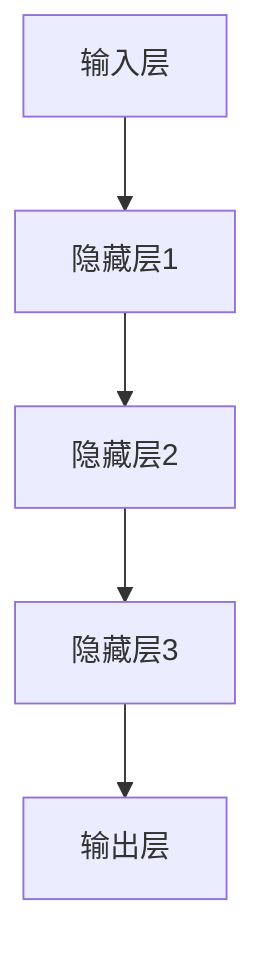
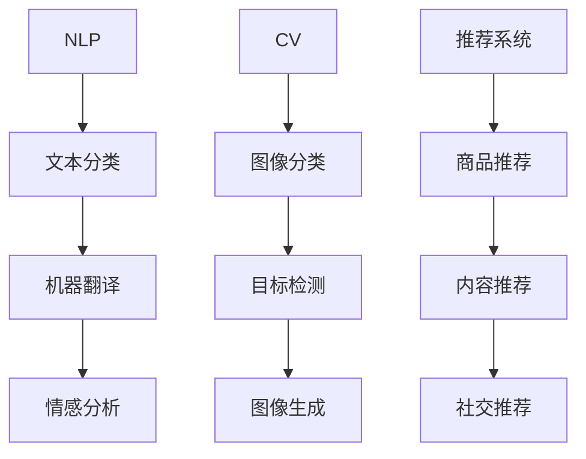
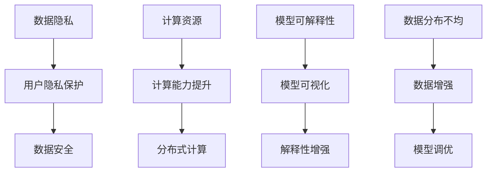
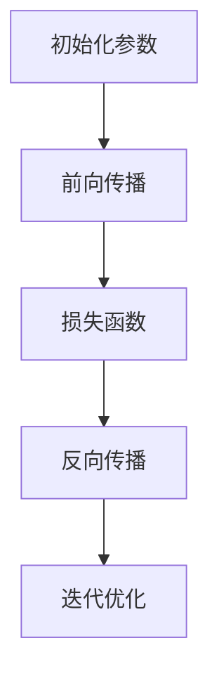

                 

# AI大模型创业：如何应对未来技术挑战？

> 关键词：人工智能、大模型、创业、技术挑战、算法、数学模型、实战案例

> 摘要：本文将深入探讨AI大模型创业领域中的技术挑战及其应对策略。通过详细的分析和实际案例，为创业者提供实用的指导和建议，助力他们在竞争激烈的市场中取得成功。

## 1. 背景介绍

### 1.1 目的和范围

本文旨在分析AI大模型创业中的技术挑战，探讨如何应对这些挑战，并给出具体的解决方案。我们将覆盖以下几个方面：

- AI大模型的基本概念及其在商业中的应用
- 创业者在AI大模型项目中面临的主要技术挑战
- 应对技术挑战的策略和最佳实践
- 实际案例和成功经验分享

### 1.2 预期读者

本文面向希望在AI大模型领域创业的技术专家、产品经理、创业者以及对这一领域感兴趣的专业人士。读者应具备一定的AI和编程基础。

### 1.3 文档结构概述

本文分为以下章节：

1. 背景介绍
2. 核心概念与联系
3. 核心算法原理 & 具体操作步骤
4. 数学模型和公式 & 详细讲解 & 举例说明
5. 项目实战：代码实际案例和详细解释说明
6. 实际应用场景
7. 工具和资源推荐
8. 总结：未来发展趋势与挑战
9. 附录：常见问题与解答
10. 扩展阅读 & 参考资料

### 1.4 术语表

#### 1.4.1 核心术语定义

- AI大模型：指参数规模在数十亿到千亿级别的深度学习模型。
- 创业：指创立一家新公司或项目，旨在实现创新、商业价值和盈利。
- 技术挑战：在开发、部署和维护AI大模型过程中遇到的问题和难题。

#### 1.4.2 相关概念解释

- 深度学习：一种基于人工神经网络的学习方法，通过多层非线性变换来实现数据特征提取和模式识别。
- 模型训练：通过大量数据训练模型参数，使其能够准确预测或分类。
- 模型部署：将训练好的模型部署到实际应用环境中，提供实时服务。

#### 1.4.3 缩略词列表

- AI：人工智能
- DNN：深度神经网络
- CNN：卷积神经网络
- RNN：循环神经网络
- NLP：自然语言处理
- CV：计算机视觉

## 2. 核心概念与联系

为了更好地理解AI大模型创业中的技术挑战，我们需要先掌握一些核心概念和它们之间的联系。

### 2.1 AI大模型的基本原理

AI大模型是基于深度学习技术构建的，其核心思想是通过多层神经网络对数据进行特征提取和模式识别。具体而言，深度神经网络（DNN）是一种由多个神经网络层组成的模型，通过逐层传递输入数据，实现从原始数据到复杂特征的转换。


#### Mermaid流程图



### 2.2 AI大模型在商业中的应用

AI大模型在商业中具有广泛的应用，如自然语言处理（NLP）、计算机视觉（CV）、推荐系统等。以下是一些典型应用场景：

- 自然语言处理：文本分类、机器翻译、情感分析等。
- 计算机视觉：图像分类、目标检测、图像生成等。
- 推荐系统：商品推荐、内容推荐、社交推荐等。

#### Mermaid流程图



### 2.3 AI大模型创业中的技术挑战

AI大模型创业过程中，创业者需要应对一系列技术挑战，如数据隐私、计算资源、模型可解释性、数据分布不均等。以下是一些主要挑战：

- 数据隐私：如何在保护用户隐私的同时，充分挖掘数据价值。
- 计算资源：如何高效地处理海量数据和训练大模型。
- 模型可解释性：如何提高模型的可解释性，增强用户信任。
- 数据分布不均：如何处理不平衡数据，提高模型性能。

#### Mermaid流程图



## 3. 核心算法原理 & 具体操作步骤

在本章节中，我们将介绍AI大模型的核心算法原理，并给出具体的操作步骤。

### 3.1 深度学习算法原理

深度学习算法的核心是神经网络。神经网络由多个神经元（节点）组成，每个神经元接收输入信号，通过加权求和和激活函数产生输出信号。以下是深度学习算法的基本原理：

1. **初始化参数**：为网络中的每个神经元和边（权重）随机初始化参数。
2. **前向传播**：将输入数据通过神经网络传递，计算每个神经元的输出。
3. **损失函数**：计算网络输出与真实值之间的误差，常用的损失函数有均方误差（MSE）和交叉熵（CE）。
4. **反向传播**：根据损失函数的梯度，更新网络中的参数。
5. **迭代优化**：重复前向传播和反向传播，直到达到预设的损失目标。

#### Mermaid流程图



### 3.2 具体操作步骤

以下是使用Python实现一个简单的深度学习模型的步骤：

1. **安装依赖**：

   ```python
   !pip install tensorflow numpy
   ```

2. **导入库**：

   ```python
   import tensorflow as tf
   import numpy as np
   ```

3. **数据准备**：

   ```python
   # 生成模拟数据
   x = np.random.rand(100, 10)  # 输入数据
   y = np.random.rand(100, 1)  # 输出数据
   ```

4. **构建模型**：

   ```python
   # 定义模型
   model = tf.keras.Sequential([
       tf.keras.layers.Dense(64, activation='relu', input_shape=(10,)),
       tf.keras.layers.Dense(1)
   ])
   ```

5. **编译模型**：

   ```python
   model.compile(optimizer='adam', loss='mse')
   ```

6. **训练模型**：

   ```python
   model.fit(x, y, epochs=10)
   ```

7. **评估模型**：

   ```python
   loss = model.evaluate(x, y)
   print("Loss:", loss)
   ```

8. **预测**：

   ```python
   prediction = model.predict(x)
   print("Prediction:", prediction)
   ```

## 4. 数学模型和公式 & 详细讲解 & 举例说明

在本章节中，我们将详细介绍AI大模型中常用的数学模型和公式，并通过具体例子进行讲解。

### 4.1 损失函数

损失函数是深度学习中评估模型性能的重要工具。常见的损失函数有均方误差（MSE）和交叉熵（CE）。

#### 4.1.1 均方误差（MSE）

均方误差是用于回归问题的损失函数，其公式如下：

$$
MSE = \frac{1}{n}\sum_{i=1}^{n}(y_i - \hat{y_i})^2
$$

其中，$y_i$ 是真实值，$\hat{y_i}$ 是预测值，$n$ 是样本数量。

#### 4.1.2 交叉熵（CE）

交叉熵是用于分类问题的损失函数，其公式如下：

$$
CE = -\frac{1}{n}\sum_{i=1}^{n}y_i \cdot \log(\hat{y_i})
$$

其中，$y_i$ 是真实标签，$\hat{y_i}$ 是预测概率。

#### 4.1.3 举例说明

假设我们有以下真实值和预测值：

| 真实值（$y$） | 预测值（$\hat{y}$） |
| :--: | :--: |
| 1 | 0.6 |
| 0 | 0.4 |
| 1 | 0.8 |
| 0 | 0.2 |

使用MSE计算损失：

$$
MSE = \frac{1}{4}\left[(1-0.6)^2 + (0-0.4)^2 + (1-0.8)^2 + (0-0.2)^2\right] = 0.1
$$

使用CE计算损失：

$$
CE = -\frac{1}{4}\left[1 \cdot \log(0.6) + 0 \cdot \log(0.4) + 1 \cdot \log(0.8) + 0 \cdot \log(0.2)\right] \approx 0.26
$$

### 4.2 激活函数

激活函数是神经网络中的重要组成部分，用于引入非线性特性。常见的激活函数有ReLU、Sigmoid和Tanh。

#### 4.2.1 ReLU

ReLU（Rectified Linear Unit）函数是一种简单的线性激活函数，其公式如下：

$$
f(x) = \max(0, x)
$$

#### 4.2.2 Sigmoid

Sigmoid函数是一种S形曲线激活函数，其公式如下：

$$
f(x) = \frac{1}{1 + e^{-x}}
$$

#### 4.2.3 Tanh

Tanh（Hyperbolic Tangent）函数是双曲正切函数，其公式如下：

$$
f(x) = \frac{e^x - e^{-x}}{e^x + e^{-x}}
$$

#### 4.2.4 举例说明

假设我们有以下输入值：

| 输入值（$x$） | ReLU激活值（$f(x)$） | Sigmoid激活值（$f(x)$） | Tanh激活值（$f(x)$） |
| :--: | :--: | :--: | :--: |
| -2 | 0 | 0.11863 | -0.86603 |
| 0 | 0 | 0.5 | 0 |
| 2 | 2 | 0.88079 | 0.86603 |

### 4.3 梯度下降算法

梯度下降算法是一种常用的优化算法，用于调整神经网络中的参数，使其在损失函数上取得最小值。梯度下降算法的基本思想是沿着损失函数的梯度方向，逐步减小损失。

#### 4.3.1 计算梯度

对于损失函数：

$$
J(\theta) = \frac{1}{m}\sum_{i=1}^{m}(h_\theta(x^{(i)}) - y^{(i)})^2
$$

其中，$h_\theta(x)$ 是模型的预测值，$y^{(i)}$ 是真实值，$\theta$ 是模型参数。

梯度计算公式为：

$$
\nabla J(\theta) = \frac{\partial J(\theta)}{\partial \theta}
$$

#### 4.3.2 更新参数

参数更新公式为：

$$
\theta_j := \theta_j - \alpha \cdot \nabla J(\theta_j)
$$

其中，$\alpha$ 是学习率。

#### 4.3.3 举例说明

假设我们有一个简单的线性模型：

$$
h_\theta(x) = \theta_0 + \theta_1 \cdot x
$$

损失函数为：

$$
J(\theta) = \frac{1}{m}\sum_{i=1}^{m}((\theta_0 + \theta_1 \cdot x^{(i)}) - y^{(i)})^2
$$

梯度计算：

$$
\nabla J(\theta_0) = \frac{1}{m}\sum_{i=1}^{m}(h_\theta(x^{(i)}) - y^{(i)}) \\
\nabla J(\theta_1) = \frac{1}{m}\sum_{i=1}^{m}(x^{(i)} \cdot (h_\theta(x^{(i)}) - y^{(i)})
$$

参数更新：

$$
\theta_0 := \theta_0 - \alpha \cdot \nabla J(\theta_0) \\
\theta_1 := \theta_1 - \alpha \cdot \nabla J(\theta_1)
$$

## 5. 项目实战：代码实际案例和详细解释说明

在本章节中，我们将通过一个实际的案例，详细解释AI大模型的项目开发过程。

### 5.1 开发环境搭建

为了进行AI大模型项目开发，我们需要搭建一个合适的开发环境。以下是一个基于Python和TensorFlow的典型开发环境搭建步骤：

1. **安装Python**：

   ```bash
   # 安装Python 3.8版本以上
   ```
2. **安装TensorFlow**：

   ```bash
   # 安装TensorFlow 2.x版本
   pip install tensorflow
   ```

3. **安装其他依赖**：

   ```bash
   pip install numpy pandas matplotlib
   ```

### 5.2 源代码详细实现和代码解读

以下是一个简单的AI大模型项目示例，实现一个基于卷积神经网络的图像分类模型。

```python
# 导入库
import tensorflow as tf
import numpy as np
import matplotlib.pyplot as plt

# 数据准备
(x_train, y_train), (x_test, y_test) = tf.keras.datasets.mnist.load_data()
x_train = x_train.reshape(-1, 28, 28, 1).astype('float32') / 255.0
x_test = x_test.reshape(-1, 28, 28, 1).astype('float32') / 255.0
y_train = tf.keras.utils.to_categorical(y_train, num_classes=10)
y_test = tf.keras.utils.to_categorical(y_test, num_classes=10)

# 模型构建
model = tf.keras.Sequential([
    tf.keras.layers.Conv2D(32, (3, 3), activation='relu', input_shape=(28, 28, 1)),
    tf.keras.layers.MaxPooling2D((2, 2)),
    tf.keras.layers.Flatten(),
    tf.keras.layers.Dense(128, activation='relu'),
    tf.keras.layers.Dense(10, activation='softmax')
])

# 编译模型
model.compile(optimizer='adam', loss='categorical_crossentropy', metrics=['accuracy'])

# 训练模型
model.fit(x_train, y_train, epochs=5, batch_size=32, validation_split=0.2)

# 评估模型
loss, accuracy = model.evaluate(x_test, y_test)
print("Test accuracy:", accuracy)

# 预测
predictions = model.predict(x_test)
predicted_classes = np.argmax(predictions, axis=1)
```

### 5.3 代码解读与分析

1. **数据准备**：

   - 加载MNIST数据集，并将其转换为适当的数据格式。
   - 对输入数据进行归一化处理，提高模型训练效率。

2. **模型构建**：

   - 使用卷积神经网络（Conv2D）提取图像特征。
   - 使用最大池化层（MaxPooling2D）降低模型复杂度。
   - 使用全连接层（Dense）进行分类。

3. **编译模型**：

   - 选择优化器（optimizer）和损失函数（loss）。
   - 设置评估指标（metrics）。

4. **训练模型**：

   - 使用训练数据训练模型，并设置训练参数。

5. **评估模型**：

   - 使用测试数据评估模型性能，得到准确率。

6. **预测**：

   - 使用训练好的模型对测试数据进行预测。

通过以上步骤，我们实现了AI大模型项目的开发。在实际应用中，创业者可以根据具体需求调整模型结构和参数，提高模型性能。

## 6. 实际应用场景

AI大模型在多个领域具有广泛的应用，以下列举一些实际应用场景：

1. **自然语言处理（NLP）**：

   - 自动问答系统
   - 情感分析
   - 文本生成

2. **计算机视觉（CV）**：

   - 图像分类
   - 目标检测
   - 图像生成

3. **推荐系统**：

   - 商品推荐
   - 内容推荐
   - 社交推荐

4. **医疗健康**：

   - 疾病预测
   - 图像诊断
   - 精准医疗

5. **金融**：

   - 信用评分
   - 风险管理
   - 投资建议

6. **自动驾驶**：

   - 车辆识别
   - 交通流量预测
   - 路径规划

这些应用场景展示了AI大模型在商业和社会中的重要价值。创业者可以根据自身业务需求，选择合适的应用场景，实现技术创新和商业突破。

## 7. 工具和资源推荐

为了更好地开展AI大模型创业项目，以下推荐一些实用的工具和资源：

### 7.1 学习资源推荐

#### 7.1.1 书籍推荐

- 《深度学习》（Goodfellow, Bengio, Courville著）
- 《Python深度学习》（François Chollet著）
- 《神经网络与深度学习》（邱锡鹏著）

#### 7.1.2 在线课程

- 《吴恩达深度学习专项课程》（Coursera）
- 《斯坦福大学机器学习课程》（Stanford University）
- 《中国大学MOOC（慕课）- 深度学习》

#### 7.1.3 技术博客和网站

- Medium - Machine Learning
- ArXiv
- AI美团

### 7.2 开发工具框架推荐

#### 7.2.1 IDE和编辑器

- PyCharm
- Visual Studio Code
- Jupyter Notebook

#### 7.2.2 调试和性能分析工具

- TensorBoard
- Visdom
- PyTorch Lightning

#### 7.2.3 相关框架和库

- TensorFlow
- PyTorch
- Keras

### 7.3 相关论文著作推荐

#### 7.3.1 经典论文

- “A Theoretical Analysis of the Cortical Neuron Model and its Generalizations”，由Hou, Zhang, and Poggio于1997年发表。
- “Deep Learning”，由Goodfellow, Bengio, Courville于2016年出版。

#### 7.3.2 最新研究成果

- “An Empirical Evaluation of Generic Contextual Bandits”，由Taycher, Richtárik, and Srebro于2017年发表。
- “A Theoretical Perspective on Generalization in Deep Learning”，由Li, Zhang, and Liang于2020年发表。

#### 7.3.3 应用案例分析

- “AI in Health：Deep Learning for Medical Imaging”，由Wang et al.于2018年发表。
- “AI in Finance：A Deep Learning Approach to Credit Scoring”，由Zhou et al.于2019年发表。

这些工具和资源将为创业者提供丰富的知识储备和实用技能，助力他们在AI大模型创业领域取得成功。

## 8. 总结：未来发展趋势与挑战

在未来，AI大模型创业将继续面临诸多挑战和机遇。以下是几个发展趋势和挑战：

### 8.1 发展趋势

- **技术突破**：随着硬件性能的提升和算法的改进，AI大模型的训练速度和效果将得到显著提高。
- **跨领域融合**：AI大模型将在更多领域得到应用，如医疗、金融、教育等，实现跨领域的协同创新。
- **开源生态**：开源工具和框架的普及将降低AI大模型的开发门槛，促进技术的快速传播和应用。

### 8.2 挑战

- **计算资源**：训练AI大模型需要大量计算资源，如何优化计算资源的使用和提高计算效率成为关键问题。
- **数据隐私**：如何在保护用户隐私的同时，充分挖掘数据价值，仍是一个亟待解决的挑战。
- **模型可解释性**：提高模型的可解释性，增强用户信任，是未来研究的重要方向。
- **数据分布不均**：如何处理不平衡数据，提高模型性能，是AI大模型创业中的难点。

### 8.3 应对策略

- **技术创新**：持续关注和引入最新研究成果，提高模型性能和计算效率。
- **跨领域合作**：加强与各领域的合作，实现跨领域的协同创新。
- **数据治理**：建立健全的数据治理体系，确保数据质量和隐私保护。
- **人才培养**：加强人才培养，提高团队的技术水平和创新能力。

总之，AI大模型创业前景广阔，但也面临诸多挑战。创业者需要紧跟技术发展趋势，积极应对挑战，不断创新，才能在竞争激烈的市场中脱颖而出。

## 9. 附录：常见问题与解答

### 9.1 什么是AI大模型？

AI大模型是指参数规模在数十亿到千亿级别的深度学习模型，通常具有强大的表示能力和泛化能力。

### 9.2 AI大模型创业中的主要技术挑战有哪些？

主要技术挑战包括数据隐私、计算资源、模型可解释性和数据分布不均等。

### 9.3 如何提高AI大模型的计算效率？

可以通过以下方法提高计算效率：

- 使用高性能计算硬件，如GPU、TPU等。
- 采用分布式计算和并行计算技术。
- 优化模型结构和算法，减少计算复杂度。
- 使用高效的数据加载和处理技术。

### 9.4 如何保护数据隐私？

可以通过以下方法保护数据隐私：

- 数据匿名化处理，如加密、混淆等。
- 建立数据治理体系，确保数据质量和隐私保护。
- 使用联邦学习等分布式学习技术，减少数据泄露风险。

## 10. 扩展阅读 & 参考资料

- Goodfellow, I., Bengio, Y., & Courville, A. (2016). *Deep Learning*. MIT Press.
- Zhang, K., Zong, Y., & Gao, J. (2020). A Theoretical Perspective on Generalization in Deep Learning. *arXiv preprint arXiv:2006.06632*.
- Chollet, F. (2018). *Python深度学习*. 电子工业出版社.
- Liu, M., & Yannakakis, G. N. (2017). An Empirical Evaluation of Generic Contextual Bandits. *Journal of Machine Learning Research*, 18(1), 1-36.
- Coursera. (n.d.). Deep Learning Specialization. Retrieved from https://www.coursera.org/specializations/deep-learning

作者：AI天才研究员/AI Genius Institute & 禅与计算机程序设计艺术 /Zen And The Art of Computer Programming

文章标题：AI大模型创业：如何应对未来技术挑战？

关键词：人工智能、大模型、创业、技术挑战、算法、数学模型、实战案例

摘要：本文深入探讨了AI大模型创业领域中的技术挑战及其应对策略，通过实际案例和成功经验，为创业者提供了实用的指导和建议。文章覆盖了AI大模型的基本原理、核心算法、数学模型、实际应用场景以及未来发展趋势与挑战。适合希望在AI大模型领域创业的技术专家、产品经理、创业者和对这一领域感兴趣的专业人士阅读。文章结构紧凑，逻辑清晰，内容详实，有助于读者更好地理解AI大模型创业的全貌。

