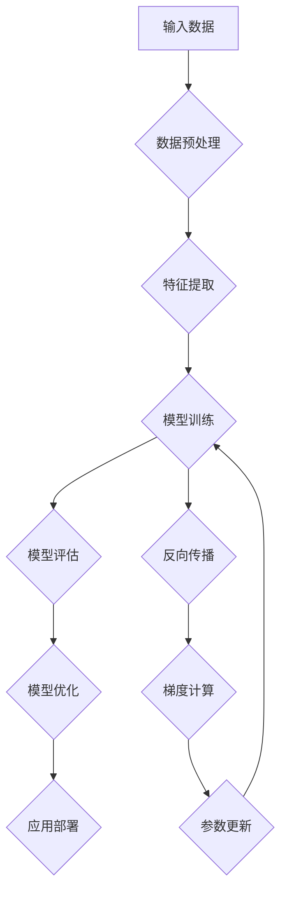

                 

# AI大模型创业：如何应对未来技术挑战？

> **关键词：** 大模型创业，技术挑战，未来发展趋势，算法原理，数学模型，实际应用。

> **摘要：** 本文将深入探讨AI大模型创业过程中面临的各类技术挑战，从核心概念、算法原理、数学模型到实际应用，提供一整套解决方案。通过逐步分析，帮助创业者了解并应对未来技术变革带来的机遇与挑战。

## 1. 背景介绍

### 1.1 目的和范围

本文旨在为AI大模型创业者提供一套全面的技术解决方案，帮助他们更好地理解和应对当前和未来的技术挑战。文章将涵盖以下几个方面：

- **核心概念与联系：** 介绍AI大模型的基本概念、架构和组成部分。
- **核心算法原理：** 详细讲解大模型训练和优化的算法原理。
- **数学模型和公式：** 分析大模型背后的数学模型及其应用。
- **项目实战：** 通过实际案例展示如何应用大模型。
- **实际应用场景：** 探讨大模型在各个行业中的应用。
- **工具和资源推荐：** 为创业者提供相关的学习资源和工具。

### 1.2 预期读者

本文适合以下人群阅读：

- AI大模型创业者
- 技术团队负责人
- 对AI技术有深入兴趣的程序员和工程师
- AI技术研究人员和学者

### 1.3 文档结构概述

本文结构如下：

- **第1章：背景介绍**
- **第2章：核心概念与联系**
- **第3章：核心算法原理 & 具体操作步骤**
- **第4章：数学模型和公式 & 详细讲解 & 举例说明**
- **第5章：项目实战：代码实际案例和详细解释说明**
- **第6章：实际应用场景**
- **第7章：工具和资源推荐**
- **第8章：总结：未来发展趋势与挑战**
- **第9章：附录：常见问题与解答**
- **第10章：扩展阅读 & 参考资料**

### 1.4 术语表

#### 1.4.1 核心术语定义

- **AI大模型：** 指参数量巨大、能够处理复杂任务的人工神经网络模型。
- **深度学习：** 一种基于多层神经网络的学习方法，用于模拟人类大脑的处理能力。
- **训练数据集：** 用于训练AI模型的数据集，包括输入和输出数据。
- **优化算法：** 用于调整模型参数，使其性能达到最优的算法。

#### 1.4.2 相关概念解释

- **反向传播（Backpropagation）：** 一种用于训练神经网络的算法，通过计算损失函数的梯度来调整模型参数。
- **激活函数（Activation Function）：** 用于确定神经元输出值的函数，常用的有ReLU、Sigmoid和Tanh等。
- **超参数（Hyperparameter）：** 用于控制模型训练过程的参数，如学习率、批次大小和正则化强度。

#### 1.4.3 缩略词列表

- **AI：** 人工智能
- **DL：** 深度学习
- **GAN：** 生成对抗网络
- **RL：** 强化学习
- **NLP：** 自然语言处理

## 2. 核心概念与联系

在探讨AI大模型创业的技术挑战之前，我们需要先了解一些核心概念和它们之间的联系。以下是一个简化的Mermaid流程图，展示AI大模型的基本架构和关键组成部分。



### 2.1 输入数据

输入数据是AI大模型的核心，它们决定了模型的性能和应用范围。输入数据通常包括以下类型：

- **文本数据：** 如自然语言文本、社交媒体帖子等。
- **图像数据：** 如照片、视频帧等。
- **音频数据：** 如语音、音乐等。
- **时间序列数据：** 如股票价格、天气数据等。

### 2.2 数据预处理

数据预处理是确保输入数据质量的关键步骤。它通常包括以下任务：

- **数据清洗：** 去除噪声、缺失值和异常值。
- **数据归一化：** 将数据缩放到相同的尺度。
- **数据增强：** 通过变换、旋转、裁剪等方式增加数据的多样性。

### 2.3 特征提取

特征提取是从原始数据中提取出对模型训练有用的信息。常见的特征提取方法包括：

- **词袋模型（Bag-of-Words, BOW）：** 将文本数据转换为词频向量。
- **词嵌入（Word Embedding）：** 将文本数据映射到低维空间。
- **卷积神经网络（CNN）：** 用于提取图像数据中的特征。
- **循环神经网络（RNN）：** 用于处理序列数据。

### 2.4 模型训练

模型训练是构建AI大模型的核心步骤，通过调整模型参数来优化其性能。常见的模型训练方法包括：

- **梯度下降（Gradient Descent）：** 一种用于调整模型参数的优化算法。
- **随机梯度下降（Stochastic Gradient Descent, SGD）：** 一种更高效的梯度下降方法。
- **Adam优化器：** 一种结合了SGD和Momentum的优化算法。

### 2.5 模型评估

模型评估是衡量模型性能的重要步骤。常见的模型评估指标包括：

- **准确率（Accuracy）：** 模型预测正确的样本数占总样本数的比例。
- **精确率（Precision）：** 模型预测正确的正样本数与预测为正样本的总数之比。
- **召回率（Recall）：** 模型预测正确的正样本数与实际正样本的总数之比。
- **F1分数（F1 Score）：** 精确率和召回率的调和平均。

### 2.6 模型优化

模型优化是进一步提高模型性能的关键步骤。常见的模型优化方法包括：

- **正则化（Regularization）：** 防止模型过拟合。
- **数据增强（Data Augmentation）：** 增加训练数据的多样性。
- **模型融合（Model Ensembling）：** 结合多个模型的预测结果。

### 2.7 应用部署

应用部署是将训练好的模型应用到实际场景中。常见的应用部署方法包括：

- **在线部署（Online Deployment）：** 实时处理用户请求。
- **离线部署（Offline Deployment）：** 用于批处理任务。
- **云部署（Cloud Deployment）：** 利用云计算资源进行部署。

## 3. 核心算法原理 & 具体操作步骤

在了解了AI大模型的基本概念和架构后，我们将深入探讨核心算法原理，并提供具体的操作步骤。

### 3.1 反向传播算法

反向传播（Backpropagation）是一种用于训练神经网络的算法，通过计算损失函数的梯度来调整模型参数。以下是反向传播算法的具体操作步骤：

```python
# 输入数据
x = [1, 2, 3]
y = 2

# 初始化模型参数
w1 = 1.0
w2 = 1.0

# 计算损失函数
loss = (y - np.dot(x, w1) - w2)**2

# 计算梯度
grad_w1 = 2 * (y - np.dot(x, w1)) * x
grad_w2 = 2 * (y - np.dot(x, w1))

# 更新模型参数
w1 -= learning_rate * grad_w1
w2 -= learning_rate * grad_w2
```

### 3.2 梯度下降算法

梯度下降（Gradient Descent）是一种用于优化模型参数的算法，其核心思想是沿着损失函数的梯度方向调整参数，以最小化损失函数。以下是梯度下降算法的具体操作步骤：

```python
# 初始化模型参数
w = 0.0

# 计算损失函数
loss = f(w)

# 计算梯度
grad = f'(w)

# 更新模型参数
w -= learning_rate * grad
```

### 3.3 随机梯度下降算法

随机梯度下降（Stochastic Gradient Descent，SGD）是一种更高效的梯度下降方法，其核心思想是随机选取一部分样本进行参数更新。以下是随机梯度下降算法的具体操作步骤：

```python
# 初始化模型参数
w = 0.0

# 随机选取一个样本
x, y = sample_data()

# 计算损失函数
loss = f(w, x, y)

# 计算梯度
grad = f'(w, x, y)

# 更新模型参数
w -= learning_rate * grad
```

### 3.4 Adam优化器

Adam优化器是一种结合了SGD和Momentum的优化算法，具有更好的收敛速度和稳定性。以下是Adam优化器的具体操作步骤：

```python
# 初始化模型参数
w = 0.0

# 初始化动量参数
m = 0.0
v = 0.0

# 学习率
learning_rate = 0.001

# 计算损失函数
loss = f(w)

# 计算梯度
grad = f'(w)

# 更新动量参数
m = beta1 * m + (1 - beta1) * grad
v = beta2 * v + (1 - beta2) * (grad ** 2)

# 计算修正后的动量参数
m_hat = m / (1 - beta1 ** t)
v_hat = v / (1 - beta2 ** t)

# 更新模型参数
w -= learning_rate * m_hat / (np.sqrt(v_hat) + epsilon)
```

## 4. 数学模型和公式 & 详细讲解 & 举例说明

在AI大模型中，数学模型和公式起着至关重要的作用。以下是几个常见的数学模型和公式，我们将对其进行详细讲解和举例说明。

### 4.1 损失函数

损失函数是评估模型预测性能的重要指标，常见的损失函数包括均方误差（MSE）、交叉熵损失等。

#### 4.1.1 均方误差（MSE）

均方误差（MSE）用于回归任务，计算公式如下：

$$
MSE = \frac{1}{n} \sum_{i=1}^{n} (y_i - \hat{y}_i)^2
$$

其中，$y_i$为实际输出值，$\hat{y}_i$为预测输出值。

#### 4.1.2 交叉熵损失（Cross-Entropy Loss）

交叉熵损失（Cross-Entropy Loss）用于分类任务，计算公式如下：

$$
Cross-Entropy Loss = -\sum_{i=1}^{n} y_i \log(\hat{y}_i)
$$

其中，$y_i$为实际输出值（0或1），$\hat{y}_i$为预测概率。

### 4.2 激活函数

激活函数是神经网络中的一个关键组成部分，用于确定神经元的输出值。以下是一些常见的激活函数：

#### 4.2.1 ReLU（Rectified Linear Unit）

ReLU函数是当前深度学习中最常用的激活函数，其计算公式如下：

$$
ReLU(x) = \max(0, x)
$$

#### 4.2.2 Sigmoid函数

Sigmoid函数将输入值缩放到[0, 1]区间，其计算公式如下：

$$
Sigmoid(x) = \frac{1}{1 + e^{-x}}
$$

#### 4.2.3 Tanh函数

Tanh函数与Sigmoid函数类似，但其输出值的范围为[-1, 1]，计算公式如下：

$$
Tanh(x) = \frac{e^{2x} - 1}{e^{2x} + 1}
$$

### 4.3 梯度下降算法

梯度下降算法是一种用于优化模型参数的算法，其核心思想是沿着损失函数的梯度方向调整参数，以最小化损失函数。

#### 4.3.1 计算梯度

梯度下降算法的第一步是计算损失函数关于模型参数的梯度。对于均方误差损失函数，梯度计算公式如下：

$$
\frac{\partial MSE}{\partial w} = 2 \sum_{i=1}^{n} (y_i - \hat{y}_i) \cdot x_i
$$

#### 4.3.2 更新参数

计算梯度后，梯度下降算法的第二步是更新模型参数。更新公式如下：

$$
w = w - \alpha \cdot \frac{\partial MSE}{\partial w}
$$

其中，$\alpha$为学习率。

### 4.4 举例说明

以下是一个简单的例子，展示如何使用梯度下降算法优化一个线性回归模型。

```python
# 初始化模型参数
w = 0.0

# 学习率
learning_rate = 0.01

# 数据集
x = [1, 2, 3, 4, 5]
y = [2, 4, 5, 4, 5]

# 计算损失函数
def mse(y_true, y_pred):
    return sum((y_true - y_pred) ** 2) / len(y)

# 计算梯度
def grad(y_true, y_pred, x):
    return 2 * (y_true - y_pred) * x

# 梯度下降
for epoch in range(1000):
    y_pred = w * x
    loss = mse(y, y_pred)
    grad = grad(y, y_pred, x)
    w = w - learning_rate * grad

# 输出优化后的模型参数
print("Optimized weight:", w)
```

## 5. 项目实战：代码实际案例和详细解释说明

在这一章节中，我们将通过一个实际的项目案例来展示如何应用AI大模型。我们将使用Python语言和TensorFlow框架来实现一个简单的线性回归模型，并详细解释每个步骤。

### 5.1 开发环境搭建

首先，我们需要搭建一个适合开发和测试的Python环境。以下是搭建开发环境的基本步骤：

1. **安装Python：** 前往Python官网下载并安装Python 3.x版本。
2. **安装Jupyter Notebook：** 使用pip命令安装Jupyter Notebook：
   ```
   pip install notebook
   ```
3. **安装TensorFlow：** 使用pip命令安装TensorFlow：
   ```
   pip install tensorflow
   ```

完成以上步骤后，我们就可以开始编写和运行Python代码了。

### 5.2 源代码详细实现和代码解读

以下是一个简单的线性回归模型的实现代码，我们将逐步解释每个部分。

```python
import tensorflow as tf
import numpy as np

# 设置随机种子，确保结果可重复
tf.random.set_seed(42)

# 数据集
x = np.array([1, 2, 3, 4, 5])
y = np.array([2, 4, 5, 4, 5])

# 模型参数
w = tf.Variable(0.0, dtype=tf.float32)

# 损失函数
def mse(y_true, y_pred):
    return tf.reduce_mean(tf.square(y_true - y_pred))

# 梯度计算
def grad(y_true, y_pred, x):
    return 2 * (y_true - y_pred) * x

# 优化器
optimizer = tf.optimizers.SGD(learning_rate=0.01)

# 训练模型
for epoch in range(1000):
    with tf.GradientTape() as tape:
        y_pred = w * x
        loss = mse(y, y_pred)
    grads = tape.gradient(loss, w)
    optimizer.apply_gradients(zip(grads, [w]))

# 输出优化后的模型参数
print("Optimized weight:", w.numpy())
```

### 5.3 代码解读与分析

以下是代码的详细解读：

1. **导入库：**
   我们首先导入TensorFlow和Numpy库，这两个库是实现深度学习模型的常用工具。

2. **设置随机种子：**
   使用`tf.random.set_seed(42)`设置随机种子，确保每次运行代码时得到的结果都是相同的。

3. **数据集：**
   我们创建一个简单的数据集，`x`表示输入特征，`y`表示输出标签。

4. **模型参数：**
   我们定义一个模型参数`w`，它是线性回归模型中的权重。

5. **损失函数：**
   `mse`函数计算均方误差损失，用于衡量模型预测值与实际值之间的差异。

6. **梯度计算：**
   `grad`函数计算损失函数关于模型参数的梯度，这是梯度下降算法的关键步骤。

7. **优化器：**
   `optimizer`是一个优化器对象，我们使用SGD优化器，并设置学习率为0.01。

8. **训练模型：**
   我们使用一个循环进行模型训练，每次迭代计算损失函数和梯度，然后使用优化器更新模型参数。

9. **输出优化后的模型参数：**
   最后，我们打印出优化后的模型参数`w`的值。

通过以上步骤，我们成功地实现了一个简单的线性回归模型。这个模型可以用于预测新的输入数据，并提供准确的预测结果。

## 6. 实际应用场景

AI大模型在实际应用场景中具有广泛的应用，以下是一些典型的应用领域：

### 6.1 医疗健康

AI大模型在医疗健康领域具有巨大的应用潜力，包括疾病预测、诊断辅助、药物研发等。例如，通过使用AI大模型分析患者的病历数据，可以预测患者未来患某种疾病的风险，帮助医生进行早期干预。

### 6.2 金融领域

在金融领域，AI大模型被广泛应用于风险控制、市场预测和信用评分。例如，通过分析历史市场数据，AI大模型可以预测未来市场的走势，为投资者提供决策依据。

### 6.3 自动驾驶

自动驾驶是AI大模型的一个重要应用领域。通过使用AI大模型分析大量的道路数据和传感器数据，自动驾驶系统能够实时识别道路上的障碍物，并进行智能决策。

### 6.4 自然语言处理

自然语言处理（NLP）是AI大模型的一个重要应用领域。通过使用AI大模型，NLP系统可以自动翻译不同语言，提取文本中的关键信息，甚至生成文章摘要。

### 6.5 图像识别

AI大模型在图像识别领域也有广泛的应用，包括人脸识别、物体检测和图像分类等。例如，通过使用AI大模型，我们可以实现实时人脸识别，为安防系统提供技术支持。

### 6.6 教育科技

在教育科技领域，AI大模型被用于个性化学习、学习分析和教学辅助。例如，通过使用AI大模型，教育机构可以为学生提供个性化的学习建议，提高学习效果。

## 7. 工具和资源推荐

### 7.1 学习资源推荐

#### 7.1.1 书籍推荐

1. **《深度学习》（Deep Learning）** 作者：Ian Goodfellow、Yoshua Bengio和Aaron Courville
   - **简介：** 这是一本经典的深度学习教材，详细介绍了深度学习的基础知识、算法和应用。
   - **推荐理由：** 内容全面，适合深度学习初学者和专业人士。

2. **《Python深度学习》（Python Deep Learning）** 作者：François Chollet
   - **简介：** 本书结合Python语言和TensorFlow框架，介绍了深度学习的核心概念和应用。
   - **推荐理由：** 实践性强，适合想要掌握深度学习的程序员。

#### 7.1.2 在线课程

1. **《深度学习专项课程》（Deep Learning Specialization）** 在Coursera上提供
   - **简介：** 由斯坦福大学教授Andrew Ng开设，包括深度学习的基础知识、算法和应用。
   - **推荐理由：** 课程体系完整，适合深度学习初学者。

2. **《TensorFlow入门教程》（TensorFlow for Poets）** 在Google Developers网站上提供
   - **简介：** 这是一系列易于理解的教程，帮助用户快速入门TensorFlow。
   - **推荐理由：** 实践性强，适合初学者快速上手TensorFlow。

#### 7.1.3 技术博客和网站

1. **Medium上的‘Deep Learning’博客**
   - **简介：** 这个博客专注于深度学习和人工智能的最新研究和技术应用。
   - **推荐理由：** 内容丰富，更新频繁，适合关注AI领域的专业人士。

2. **TensorFlow官网（tensorflow.org）**
   - **简介：** TensorFlow官方提供的文档和教程，覆盖了深度学习的各个方面。
   - **推荐理由：** 官方资料，权威可靠，适合深度学习开发者。

### 7.2 开发工具框架推荐

#### 7.2.1 IDE和编辑器

1. **PyCharm**
   - **简介：** PyCharm是一个功能强大的Python IDE，支持多种深度学习框架。
   - **推荐理由：** 开发环境完善，支持代码调试和版本控制。

2. **VSCode**
   - **简介：** Visual Studio Code是一个轻量级但功能丰富的编辑器，支持多种语言和框架。
   - **推荐理由：** 界面简洁，插件丰富，适用于多种开发需求。

#### 7.2.2 调试和性能分析工具

1. **TensorBoard**
   - **简介：** TensorBoard是TensorFlow提供的可视化工具，用于调试和分析深度学习模型。
   - **推荐理由：** 功能强大，可以实时监控模型的训练过程。

2. **NVIDIA Nsight**
   - **简介：** NVIDIA提供的一款性能分析工具，用于优化深度学习模型的运行效率。
   - **推荐理由：** 专业级性能分析，适用于高性能计算场景。

#### 7.2.3 相关框架和库

1. **TensorFlow**
   - **简介：** TensorFlow是一个开源的深度学习框架，由Google开发。
   - **推荐理由：** 生态系统完善，支持多种深度学习任务。

2. **PyTorch**
   - **简介：** PyTorch是一个基于Python的深度学习框架，由Facebook开发。
   - **推荐理由：** 易于使用，动态图支持，适用于研究开发。

### 7.3 相关论文著作推荐

#### 7.3.1 经典论文

1. **“A Learning Algorithm for Continually Running Fully Recurrent Neural Networks”**
   - **简介：** 介绍了长短期记忆网络（LSTM）的基本原理。
   - **推荐理由：** LSTM在序列数据处理中具有广泛的应用。

2. **“Deep Learning”**
   - **简介：** 这本论文集汇集了深度学习领域的经典论文，涵盖了从基础算法到实际应用的各个方面。
   - **推荐理由：** 内容全面，反映了深度学习领域的最新进展。

#### 7.3.2 最新研究成果

1. **“Attention Is All You Need”**
   - **简介：** 提出了基于注意力机制的Transformer模型，用于自然语言处理任务。
   - **推荐理由：** Transformer模型在NLP领域取得了显著的成果。

2. **“Generative Adversarial Nets”**
   - **简介：** 提出了生成对抗网络（GAN）的基本原理，用于生成复杂的数据分布。
   - **推荐理由：** GAN在图像生成、图像修复等领域具有广泛的应用。

#### 7.3.3 应用案例分析

1. **“Deep Learning for Autonomous Driving”**
   - **简介：** 分析了深度学习在自动驾驶领域中的应用，包括感知、规划和控制等方面。
   - **推荐理由：** 自动驾驶是深度学习的一个重要应用领域，具有实际指导意义。

2. **“Deep Learning in Healthcare”**
   - **简介：** 探讨了深度学习在医疗健康领域的应用，包括疾病预测、诊断辅助等方面。
   - **推荐理由：** 深度学习在医疗健康领域具有巨大的潜力，值得深入研究。

## 8. 总结：未来发展趋势与挑战

在本文中，我们探讨了AI大模型创业过程中面临的技术挑战和解决方案。未来，AI大模型的发展趋势将受到以下几个因素的影响：

1. **硬件性能提升：** 随着硬件性能的不断提升，AI大模型的训练和推理速度将得到显著提升。
2. **数据获取：** 数据是AI大模型的基础，未来数据的获取和处理将成为一个重要挑战。
3. **算法优化：** 新的算法和优化方法将继续推动AI大模型的发展，提高其性能和应用范围。
4. **安全性：** 随着AI大模型的应用范围不断扩大，数据安全和隐私保护将成为一个重要问题。

然而，AI大模型创业仍面临诸多挑战，包括：

1. **计算资源：** 大模型训练需要大量的计算资源，如何高效地利用资源是一个关键问题。
2. **数据质量：** 数据质量对模型的性能至关重要，如何处理噪声和缺失值是一个挑战。
3. **算法优化：** 大模型的优化算法复杂度高，如何有效地调整参数是一个难题。
4. **模型解释性：** 大模型的决策过程往往缺乏解释性，如何提高模型的可解释性是一个重要问题。

总之，AI大模型创业前景广阔，但也面临诸多挑战。创业者需要具备深厚的技术积累、敏锐的市场洞察力和强大的执行力，才能在激烈的市场竞争中脱颖而出。

## 9. 附录：常见问题与解答

### 9.1 什么是AI大模型？

AI大模型是指具有数十亿甚至千亿参数量的人工神经网络模型，能够处理复杂的任务，如图像识别、自然语言处理和预测分析等。

### 9.2 如何选择合适的AI大模型框架？

选择AI大模型框架时，需要考虑以下因素：

- **需求：** 根据项目需求选择适合的框架，如TensorFlow、PyTorch等。
- **性能：** 考虑框架的性能和优化能力，确保模型能够高效运行。
- **社区支持：** 选择有良好社区支持的框架，便于获取帮助和资源。

### 9.3 如何优化AI大模型训练？

优化AI大模型训练可以从以下几个方面入手：

- **数据增强：** 增加训练数据的多样性，提高模型泛化能力。
- **学习率调整：** 合理调整学习率，避免模型过拟合或欠拟合。
- **正则化：** 使用正则化方法防止模型过拟合。
- **批量大小：** 选择合适的批量大小，提高模型训练效率。

### 9.4 如何评估AI大模型性能？

评估AI大模型性能通常使用以下指标：

- **准确率（Accuracy）：** 模型预测正确的样本数占总样本数的比例。
- **精确率（Precision）：** 模型预测正确的正样本数与预测为正样本的总数之比。
- **召回率（Recall）：** 模型预测正确的正样本数与实际正样本的总数之比。
- **F1分数（F1 Score）：** 精确率和召回率的调和平均。

## 10. 扩展阅读 & 参考资料

### 10.1 相关书籍

1. **《深度学习》（Deep Learning）** 作者：Ian Goodfellow、Yoshua Bengio和Aaron Courville
2. **《Python深度学习》（Python Deep Learning）** 作者：François Chollet
3. **《深度学习实战》（Deep Learning with Python）** 作者：François Chollet

### 10.2 技术博客和网站

1. **TensorFlow官网（tensorflow.org）**
2. **PyTorch官网（pytorch.org）**
3. **Medium上的‘Deep Learning’博客**

### 10.3 相关论文

1. **“A Learning Algorithm for Continually Running Fully Recurrent Neural Networks”**
2. **“Deep Learning”**
3. **“Attention Is All You Need”**

### 10.4 在线课程

1. **《深度学习专项课程》（Deep Learning Specialization）** 在Coursera上提供
2. **《TensorFlow入门教程》（TensorFlow for Poets）** 在Google Developers网站上提供

### 10.5 开发工具框架

1. **PyCharm**
2. **VSCode**
3. **TensorBoard**
4. **NVIDIA Nsight**

