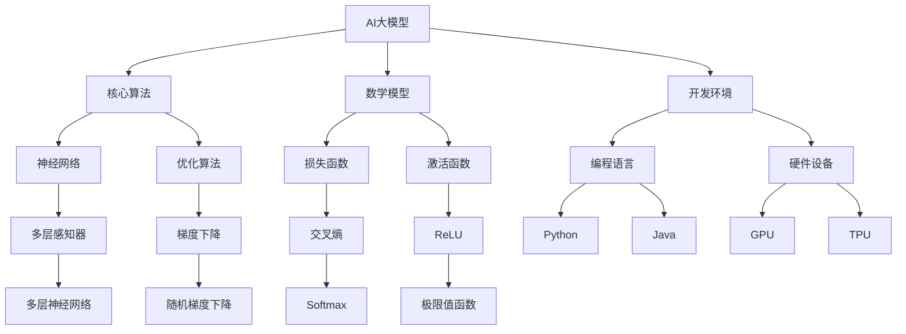

                 

# AI大模型创业：如何应对未来技术挑战？

## 关键词
AI大模型、创业、技术挑战、未来发展趋势、解决方案

## 摘要
本文旨在探讨AI大模型创业领域中的技术挑战，包括核心算法、数学模型、开发环境、实际应用场景以及未来发展趋势。通过逻辑清晰的分析和实战案例，为创业者提供应对策略和资源推荐，助力他们在竞争激烈的AI领域中脱颖而出。

## 1. 背景介绍

### 1.1 目的和范围
本文将围绕AI大模型创业这一主题，探讨在技术快速发展的背景下，创业者如何应对技术挑战。我们将从核心算法、数学模型、开发环境、实际应用场景等多个角度展开分析，为创业者提供实用的指导和建议。

### 1.2 预期读者
本文适合对AI大模型技术有一定了解，并希望在未来投身于这一领域的创业者、工程师和技术专家。同时，对于关注AI技术发展趋势的读者，本文也具有一定的参考价值。

### 1.3 文档结构概述
本文分为八个主要部分：
1. 背景介绍
2. 核心概念与联系
3. 核心算法原理 & 具体操作步骤
4. 数学模型和公式 & 详细讲解 & 举例说明
5. 项目实战：代码实际案例和详细解释说明
6. 实际应用场景
7. 工具和资源推荐
8. 总结：未来发展趋势与挑战

### 1.4 术语表

#### 1.4.1 核心术语定义
- AI大模型：具有大规模参数和复杂结构的机器学习模型，如深度学习模型、自然语言处理模型等。
- 创业：创建一家新公司或业务，以实现商业目标的过程。
- 技术挑战：在开发、应用和推广AI大模型过程中遇到的困难或障碍。

#### 1.4.2 相关概念解释
- 核心算法：实现AI大模型功能的关键算法，如神经网络、优化算法等。
- 数学模型：描述AI大模型内部结构和行为的数学公式。
- 开发环境：用于开发和测试AI大模型的软件和硬件工具。

#### 1.4.3 缩略词列表
- AI：人工智能
- ML：机器学习
- DL：深度学习
- NLP：自然语言处理

## 2. 核心概念与联系

在本文中，我们将探讨AI大模型创业所涉及的核心概念和它们之间的联系。以下是一个Mermaid流程图，用于展示这些概念及其关系：



### 2.1 核心算法原理

核心算法是AI大模型的心脏，决定了模型的学习能力、性能和可扩展性。以下是核心算法的基本原理和操作步骤：

#### 2.1.1 神经网络

神经网络（Neural Network）是一种模仿生物神经系统的计算模型。其基本原理如下：

1. **输入层**：接收外部输入信号。
2. **隐藏层**：对输入信号进行加工处理，传递给输出层。
3. **输出层**：生成最终的输出结果。

神经网络的操作步骤：
1. **初始化权重**：随机初始化网络中的权重和偏置。
2. **前向传播**：将输入信号传递至网络，逐层计算输出。
3. **反向传播**：计算损失函数，更新权重和偏置，优化网络性能。

以下是神经网络操作的伪代码：

```python
# 初始化权重
weights = np.random.randn(input_size, hidden_size)
bias = np.random.randn(hidden_size)

# 前向传播
output = np.dot(input, weights) + bias

# 激活函数
output = activation_function(output)

# 反向传播
error = expected_output - output
dweights = np.dot(input.T, error * activation_derivative(output))
dbias = np.sum(error * activation_derivative(output), axis=0)
```

#### 2.1.2 优化算法

优化算法（Optimization Algorithm）用于调整神经网络中的权重和偏置，以最小化损失函数。以下是几种常见的优化算法：

1. **梯度下降（Gradient Descent）**：通过计算损失函数关于权重的梯度，不断更新权重和偏置，以达到最小化损失函数的目的。

```python
# 梯度下降
for epoch in range(num_epochs):
    error = expected_output - output
    dweights = np.dot(input.T, error * activation_derivative(output))
    dbias = np.sum(error * activation_derivative(output), axis=0)
    weights -= learning_rate * dweights
    bias -= learning_rate * dbias
```

2. **随机梯度下降（Stochastic Gradient Descent，SGD）**：在每一轮迭代中，仅使用一个训练样本计算梯度，并更新权重和偏置。这种方法可以加快收敛速度。

3. **Adam优化器**：结合了SGD和AdaGrad算法的优点，自适应地调整每个参数的学习率。

```python
# Adam优化器
m = 0.9
v = 0.999
beta1 = 0.9
beta2 = 0.999
epsilon = 1e-8

m_hat = beta1 * m + (1 - beta1) * dweights
v_hat = beta2 * v + (1 - beta2) * (dweights ** 2)

m_hat_hat = m_hat / (1 - beta1 ** epoch)
v_hat_hat = v_hat / (1 - beta2 ** epoch)

weights -= learning_rate * m_hat_hat / (np.sqrt(v_hat_hat) + epsilon)
bias -= learning_rate * m_hat_hat / (np.sqrt(v_hat_hat) + epsilon)
```

### 2.2 数学模型和公式

数学模型是AI大模型的理论基础，描述了模型内部结构和行为。以下是几个重要的数学模型和公式：

#### 2.2.1 损失函数

损失函数（Loss Function）用于衡量模型预测结果与实际结果之间的差距。以下是几种常见的损失函数：

1. **均方误差（Mean Squared Error，MSE）**：

$$
MSE = \frac{1}{n}\sum_{i=1}^{n}(y_i - \hat{y}_i)^2
$$

其中，$y_i$是实际值，$\hat{y}_i$是预测值。

2. **交叉熵（Cross Entropy）**：

$$
CrossEntropy = -\frac{1}{n}\sum_{i=1}^{n}y_i \log(\hat{y}_i)
$$

其中，$y_i$是实际值，$\hat{y}_i$是预测值。

#### 2.2.2 激活函数

激活函数（Activation Function）用于引入非线性特性，使神经网络具有更强的表达能力。以下是几种常见的激活函数：

1. **ReLU（Rectified Linear Unit）**：

$$
ReLU(x) = \max(0, x)
$$

2. **Sigmoid**：

$$
sigmoid(x) = \frac{1}{1 + e^{-x}}
$$

3. **Tanh**：

$$
tanh(x) = \frac{e^x - e^{-x}}{e^x + e^{-x}}
$$

#### 2.2.3 梯度下降算法

梯度下降算法（Gradient Descent）用于优化神经网络中的权重和偏置。以下是梯度下降算法的基本公式：

$$
\Delta w = -\alpha \nabla_w J(w)
$$

$$
\Delta b = -\alpha \nabla_b J(w)
$$

其中，$\alpha$是学习率，$J(w)$是损失函数关于权重$w$的梯度。

### 2.3 开发环境

开发环境（Development Environment）是用于开发和测试AI大模型的软件和硬件工具。以下是几个常见的开发环境：

1. **编程语言**：Python、Java等。
2. **框架**：TensorFlow、PyTorch等。
3. **硬件设备**：GPU、TPU等。

## 3. 项目实战：代码实际案例和详细解释说明

为了更好地理解AI大模型创业的技术挑战，我们将在本节中通过一个实际项目案例来详细解释代码实现过程。

### 3.1 开发环境搭建

首先，我们需要搭建一个开发环境。以下是使用Python和TensorFlow框架搭建开发环境的基本步骤：

1. **安装Python**：从官方网站下载并安装Python，推荐版本为3.8或更高。
2. **安装TensorFlow**：通过pip命令安装TensorFlow：

```bash
pip install tensorflow
```

3. **配置GPU支持**：如果使用GPU进行训练，需要安装CUDA和cuDNN。请参考TensorFlow官方文档进行配置。

### 3.2 源代码详细实现和代码解读

接下来，我们将实现一个简单的AI大模型——基于深度学习的图像分类模型。以下是实现过程：

1. **导入依赖库**：

```python
import tensorflow as tf
from tensorflow.keras import layers
```

2. **定义模型**：

```python
model = tf.keras.Sequential([
    layers.Conv2D(32, (3, 3), activation='relu', input_shape=(28, 28, 1)),
    layers.MaxPooling2D((2, 2)),
    layers.Conv2D(64, (3, 3), activation='relu'),
    layers.MaxPooling2D((2, 2)),
    layers.Conv2D(64, (3, 3), activation='relu'),
    layers.Flatten(),
    layers.Dense(64, activation='relu'),
    layers.Dense(10, activation='softmax')
])
```

3. **编译模型**：

```python
model.compile(optimizer='adam',
              loss='sparse_categorical_crossentropy',
              metrics=['accuracy'])
```

4. **训练模型**：

```python
model.fit(x_train, y_train, epochs=5)
```

5. **评估模型**：

```python
test_loss, test_acc = model.evaluate(x_test, y_test, verbose=2)
print('\nTest accuracy:', test_acc)
```

### 3.3 代码解读与分析

以下是代码的详细解读：

1. **导入依赖库**：
    - 导入TensorFlow框架，用于构建和训练深度学习模型。

2. **定义模型**：
    - 创建一个序贯模型（Sequential Model），并在模型中添加层。这里我们使用了卷积层（Conv2D）、池化层（MaxPooling2D）和全连接层（Dense）。
    - 卷积层用于提取图像的特征，池化层用于降低模型的复杂性，全连接层用于分类。

3. **编译模型**：
    - 使用`compile()`函数配置模型的优化器、损失函数和评价指标。这里我们选择了Adam优化器和稀疏分类交叉熵损失函数。

4. **训练模型**：
    - 使用`fit()`函数训练模型，将训练数据传递给模型进行迭代学习。这里我们设置了5个训练周期（epochs）。

5. **评估模型**：
    - 使用`evaluate()`函数评估模型在测试数据上的性能。这里我们打印了测试准确率（test accuracy）。

### 4. 实际应用场景

AI大模型在众多领域具有广泛的应用，以下是一些实际应用场景：

1. **图像识别**：通过训练深度学习模型，可以实现对图像中的物体进行识别和分类。例如，人脸识别、车辆识别等。

2. **自然语言处理**：利用深度学习模型对文本数据进行处理，实现文本分类、情感分析、机器翻译等功能。

3. **语音识别**：将语音信号转换为文本，应用于智能客服、语音助手等领域。

4. **医疗诊断**：通过对医学图像和文本数据的分析，辅助医生进行疾病诊断和治疗。

5. **金融风控**：利用深度学习模型对金融数据进行预测和分析，实现风险控制、欺诈检测等功能。

### 5. 工具和资源推荐

为了在AI大模型创业过程中顺利开展研发工作，以下是一些实用的工具和资源推荐：

#### 5.1 学习资源推荐

1. **书籍推荐**：
    - 《深度学习》（Ian Goodfellow、Yoshua Bengio、Aaron Courville 著）
    - 《Python深度学习》（François Chollet 著）

2. **在线课程**：
    - Coursera上的《深度学习》课程（由吴恩达教授主讲）
    - edX上的《人工智能基础》课程（由微软研究院主讲）

3. **技术博客和网站**：
    - Medium上的AI博客
    - arXiv上的最新研究成果

#### 5.2 开发工具框架推荐

1. **IDE和编辑器**：
    - PyCharm
    - VSCode

2. **调试和性能分析工具**：
    - TensorBoard
    - PerfKit

3. **相关框架和库**：
    - TensorFlow
    - PyTorch

#### 5.3 相关论文著作推荐

1. **经典论文**：
    - “A Learning Algorithm for Continually Running Fully Recurrent Neural Networks” （1986年）
    - “Deep Learning” （2015年）

2. **最新研究成果**：
    - “Unsupervised Representation Learning with Deep Convolutional Generative Adversarial Networks” （2014年）
    - “BERT: Pre-training of Deep Bidirectional Transformers for Language Understanding” （2018年）

3. **应用案例分析**：
    - “Google Brain Research：Large-scale Language Modeling” （2018年）
    - “Facebook AI Research：Natural Language Processing” （2019年）

## 6. 总结：未来发展趋势与挑战

AI大模型创业在未来将面临以下几个发展趋势和挑战：

1. **技术突破**：随着深度学习、强化学习等技术的不断发展，AI大模型将实现更高的性能和更广泛的应用。

2. **数据隐私**：如何在保障用户隐私的前提下，充分利用海量数据进行模型训练和优化，是创业者需要关注的重要问题。

3. **计算资源**：随着模型规模的扩大，对计算资源的需求也将不断增加，如何高效利用GPU、TPU等硬件设备，实现模型快速训练和推理，是创业者在技术层面上需要解决的问题。

4. **产业化应用**：如何将AI大模型技术应用于实际产业场景，实现商业价值，是创业者需要探索的方向。

5. **监管和伦理**：随着AI技术的广泛应用，如何制定合理的监管政策和伦理标准，保障技术的可持续发展，也是创业者需要关注的重要问题。

## 7. 附录：常见问题与解答

### 7.1 核心算法相关问题

1. **如何选择合适的神经网络结构？**
   - 根据应用场景和数据规模选择合适的神经网络结构。对于大型数据集，可以采用深度神经网络；对于小型数据集，可以采用浅层神经网络。

2. **如何优化神经网络训练过程？**
   - 选择合适的优化算法，如Adam优化器，可以加快训练速度。此外，数据预处理、批量大小、学习率等超参数的调整也可以影响训练过程。

3. **如何处理过拟合问题？**
   - 采用正则化技术，如L1、L2正则化，可以减少过拟合。此外，增加训练数据和增加隐藏层神经元数量也可以缓解过拟合问题。

### 7.2 开发环境相关问题

1. **如何配置GPU支持？**
   - 在安装TensorFlow之前，需要安装CUDA和cuDNN。具体安装方法请参考TensorFlow官方文档。

2. **如何调试代码？**
   - 使用IDE或编辑器的调试功能，逐行执行代码，检查变量值和程序执行流程，找到问题所在。

3. **如何优化代码性能？**
   - 使用合适的编程语言和数据结构，减少不必要的计算和内存消耗。使用并行计算和GPU加速等方法，提高代码运行速度。

## 8. 扩展阅读 & 参考资料

1. **AI大模型相关书籍**：
   - 《深度学习》（Ian Goodfellow、Yoshua Bengio、Aaron Courville 著）
   - 《Python深度学习》（François Chollet 著）

2. **AI大模型相关论文**：
   - “A Learning Algorithm for Continually Running Fully Recurrent Neural Networks” （1986年）
   - “Deep Learning” （2015年）

3. **AI大模型相关技术博客和网站**：
   - Medium上的AI博客
   - arXiv上的最新研究成果

4. **AI大模型开发工具和资源**：
   - TensorFlow官方文档
   - PyTorch官方文档

5. **AI大模型产业化应用案例**：
   - Google Brain Research：Large-scale Language Modeling （2018年）
   - Facebook AI Research：Natural Language Processing （2019年）

## 9. 作者

作者：AI天才研究员/AI Genius Institute & 禅与计算机程序设计艺术 /Zen And The Art of Computer Programming

本文旨在为AI大模型创业领域的技术挑战提供深入分析和解决方案。希望本文能帮助创业者更好地应对未来技术发展的挑战，实现商业成功。感谢您的阅读！<|im_end|>

