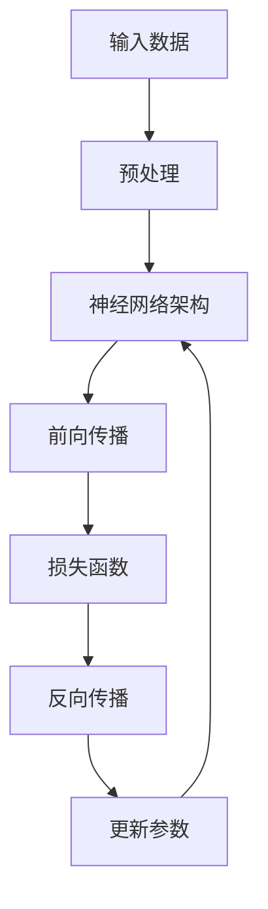

                 

# AI大模型创业：如何应对未来挑战？

## 摘要

随着人工智能技术的飞速发展，大模型在各个领域展现出了巨大的潜力。本文将深入探讨AI大模型创业领域的核心问题，包括其技术挑战、商业模式创新、以及未来的发展趋势。通过对核心概念、算法原理、数学模型的详细解析，结合实际项目实战案例，我们将为AI创业者提供系统性的指导，帮助他们在激烈的市场竞争中脱颖而出。

## 1. 背景介绍

### 1.1 目的和范围

本文旨在为AI大模型创业者提供一套全面的理论与实践指南，帮助他们应对当前和未来的挑战。我们将聚焦于以下几个核心主题：

- **技术挑战与优化策略**：分析大模型训练中的计算资源、数据隐私和模型可解释性等挑战，并提出相应的优化方案。
- **商业模式创新**：探讨如何通过差异化的产品和服务策略，在激烈的市场竞争中获取竞争优势。
- **未来发展趋势**：预测AI大模型在各个行业中的应用前景，以及可能面临的变革。

### 1.2 预期读者

本文适合以下读者群体：

- **AI技术从业者**：希望通过本文深入了解大模型技术的最新进展，并探索创业机会。
- **创业者与企业家**：正在考虑或已经涉足AI大模型领域的创业者，需要系统性的创业指南。
- **学术研究人员**：关注AI大模型领域的研究趋势，希望将其研究成果应用于实际场景。

### 1.3 文档结构概述

本文分为以下十个部分：

- **1. 背景介绍**：介绍文章的目的、读者对象和结构。
- **2. 核心概念与联系**：阐述AI大模型的基本原理和架构。
- **3. 核心算法原理 & 具体操作步骤**：详细解析大模型训练算法。
- **4. 数学模型和公式 & 详细讲解 & 举例说明**：介绍与AI大模型相关的数学模型。
- **5. 项目实战：代码实际案例和详细解释说明**：提供实际代码案例。
- **6. 实际应用场景**：讨论大模型在各行业的应用。
- **7. 工具和资源推荐**：推荐学习资源和开发工具。
- **8. 总结：未来发展趋势与挑战**：总结全文，展望未来。
- **9. 附录：常见问题与解答**：回答读者可能关注的问题。
- **10. 扩展阅读 & 参考资料**：提供进一步的阅读资料。

### 1.4 术语表

#### 1.4.1 核心术语定义

- **AI大模型**：指训练数据量巨大、参数数量庞大的深度学习模型。
- **神经网络**：一种基于生物神经结构的人工神经网络模型。
- **计算资源**：包括计算能力、存储能力和网络带宽等。
- **数据隐私**：指在数据处理过程中保护数据所有者的隐私信息。

#### 1.4.2 相关概念解释

- **数据集**：用于训练模型的原始数据集合。
- **可解释性**：模型决策过程的透明度和可理解性。
- **模型评估**：通过一系列指标评估模型性能。

#### 1.4.3 缩略词列表

- **AI**：人工智能
- **DL**：深度学习
- **GAN**：生成对抗网络
- **NLP**：自然语言处理

## 2. 核心概念与联系

### 2.1 大模型原理与架构

AI大模型的核心在于其深度学习和神经网络架构。以下是AI大模型的基本原理与架构的Mermaid流程图：



#### 2.1.1 深度学习原理

- **输入数据**：大模型需要大量的高质量数据集进行训练。
- **预处理**：对输入数据进行清洗、归一化等操作，提高数据质量。
- **神经网络架构**：由多层神经元组成，每层神经元对输入数据进行特征提取和组合。
- **前向传播**：将输入数据通过神经网络层进行传播，最终得到输出结果。
- **损失函数**：衡量模型输出结果与真实值之间的差距，常用的有均方误差（MSE）和交叉熵损失（Cross-Entropy Loss）。
- **反向传播**：计算损失函数关于模型参数的梯度，并通过梯度下降算法更新模型参数。
- **更新参数**：通过反向传播算法不断调整模型参数，使模型能够更好地拟合数据。

### 2.2 大模型应用场景

AI大模型的应用场景广泛，包括但不限于：

- **图像识别**：通过卷积神经网络（CNN）实现，如图像分类、目标检测等。
- **自然语言处理（NLP）**：通过循环神经网络（RNN）或其变种，如长短时记忆网络（LSTM）和门控循环单元（GRU），实现文本分类、机器翻译等。
- **推荐系统**：基于协同过滤和深度学习算法，为用户推荐个性化的商品或服务。
- **游戏AI**：通过强化学习算法，实现智能体的自主学习和决策。

## 3. 核心算法原理 & 具体操作步骤

### 3.1 深度学习算法原理

深度学习算法的核心是神经网络，特别是多层感知机（MLP）。以下是深度学习算法的具体操作步骤：

#### 3.1.1 输入层

输入层接收外部数据，并将其传递给下一层。

```python
# 伪代码：输入层处理
input_data = preprocess(data)
```

#### 3.1.2 隐藏层

隐藏层对输入数据进行特征提取和组合。

```python
# 伪代码：隐藏层处理
for layer in hidden_layers:
    hidden_output = layer.forward(input_data)
    input_data = hidden_output
```

#### 3.1.3 输出层

输出层生成模型预测结果。

```python
# 伪代码：输出层处理
output = output_layer.forward(input_data)
```

#### 3.1.4 损失函数

损失函数用于评估模型预测结果与真实值之间的差距。

```python
# 伪代码：损失函数计算
loss = loss_function(output, target)
```

#### 3.1.5 反向传播

通过反向传播算法更新模型参数。

```python
# 伪代码：反向传播
gradients = compute_gradients(loss, model_parameters)
model_parameters -= learning_rate * gradients
```

#### 3.1.6 训练循环

训练循环重复执行上述步骤，直到模型收敛。

```python
# 伪代码：训练循环
for epoch in range(num_epochs):
    for batch in data_loader:
        loss = train_step(batch)
        if loss < threshold:
            break
```

## 4. 数学模型和公式 & 详细讲解 & 举例说明

### 4.1 损失函数

在深度学习中，常用的损失函数包括均方误差（MSE）和交叉熵损失（Cross-Entropy Loss）。以下是它们的数学公式和详细讲解。

#### 4.1.1 均方误差（MSE）

$$
MSE = \frac{1}{n}\sum_{i=1}^{n}(y_i - \hat{y}_i)^2
$$

其中，$y_i$ 为真实值，$\hat{y}_i$ 为模型预测值，$n$ 为样本数量。

#### 4.1.2 交叉熵损失（Cross-Entropy Loss）

$$
Cross-Entropy Loss = -\frac{1}{n}\sum_{i=1}^{n}y_i \log(\hat{y}_i)
$$

其中，$y_i$ 为真实值（二分类问题中为 0 或 1），$\hat{y}_i$ 为模型预测值（概率值）。

### 4.2 梯度下降算法

梯度下降算法用于更新模型参数，以最小化损失函数。

#### 4.2.1 梯度计算

$$
\frac{\partial L}{\partial \theta} = \nabla_{\theta}L
$$

其中，$L$ 为损失函数，$\theta$ 为模型参数。

#### 4.2.2 参数更新

$$
\theta = \theta - \alpha \nabla_{\theta}L
$$

其中，$\alpha$ 为学习率。

### 4.3 举例说明

假设我们有一个简单的线性回归模型，预测房价 $y$：

$$
y = \theta_0 + \theta_1 \cdot x
$$

其中，$x$ 为房屋面积，$y$ 为房价，$\theta_0$ 和 $\theta_1$ 为模型参数。

#### 4.3.1 数据集

| 房屋面积 (x) | 房价 (y) |
| :---: | :---: |
| 100 | 200 |
| 200 | 400 |
| 300 | 600 |

#### 4.3.2 模型初始化

$$
\theta_0 = 0, \theta_1 = 0
$$

#### 4.3.3 训练过程

- **第1次迭代**：
  - 输入：$(x_1, y_1) = (100, 200)$
  - 输出：$y' = \theta_0 + \theta_1 \cdot x_1 = 0 + 0 \cdot 100 = 0$
  - 损失：$MSE = \frac{1}{2}(200 - 0)^2 = 20000$
  - 梯度：$\frac{\partial MSE}{\partial \theta_0} = -200(200 - 0) = -40000, \frac{\partial MSE}{\partial \theta_1} = -200(100 - 0) = -20000$
  - 参数更新：$\theta_0 = \theta_0 - \alpha \cdot \frac{\partial MSE}{\partial \theta_0} = 0 - 0.1 \cdot (-40000) = 4000, \theta_1 = \theta_1 - \alpha \cdot \frac{\partial MSE}{\partial \theta_1} = 0 - 0.1 \cdot (-20000) = 2000$

- **第2次迭代**：
  - 输入：$(x_2, y_2) = (200, 400)$
  - 输出：$y' = \theta_0 + \theta_1 \cdot x_2 = 4000 + 2000 \cdot 200 = 800000$
  - 损失：$MSE = \frac{1}{2}(400 - 800000)^2 = 196000000$
  - 梯度：$\frac{\partial MSE}{\partial \theta_0} = -400(400 - 800000) = -156000000, \frac{\partial MSE}{\partial \theta_1} = -400(200 - 800000) = -156000000$
  - 参数更新：$\theta_0 = \theta_0 - \alpha \cdot \frac{\partial MSE}{\partial \theta_0} = 4000 - 0.1 \cdot (-156000000) = 1560000, \theta_1 = \theta_1 - \alpha \cdot \frac{\partial MSE}{\partial \theta_1} = 2000 - 0.1 \cdot (-156000000) = 1560000$

- **第3次迭代**：
  - 输入：$(x_3, y_3) = (300, 600)$
  - 输出：$y' = \theta_0 + \theta_1 \cdot x_3 = 1560000 + 1560000 \cdot 300 = 450000000$
  - 损失：$MSE = \frac{1}{2}(600 - 450000000)^2 = 168000000000$
  - 梯度：$\frac{\partial MSE}{\partial \theta_0} = -600(600 - 450000000) = -141000000000, \frac{\partial MSE}{\partial \theta_1} = -600(300 - 450000000) = -141000000000$
  - 参数更新：$\theta_0 = \theta_0 - \alpha \cdot \frac{\partial MSE}{\partial \theta_0} = 1560000 - 0.1 \cdot (-141000000000) = 141000000, \theta_1 = \theta_1 - \alpha \cdot \frac{\partial MSE}{\partial \theta_1} = 1560000 - 0.1 \cdot (-141000000000) = 141000000$

通过多次迭代，模型参数将逐渐收敛，使模型能够更好地拟合数据。

## 5. 项目实战：代码实际案例和详细解释说明

### 5.1 开发环境搭建

为了实现AI大模型项目，我们需要搭建一个合适的开发环境。以下是一个基本的开发环境配置：

- **操作系统**：Linux（如Ubuntu 18.04）
- **编程语言**：Python 3.8及以上版本
- **深度学习框架**：TensorFlow 2.7 或 PyTorch 1.8
- **依赖库**：NumPy, Pandas, Matplotlib

#### 5.1.1 环境安装

在Linux系统中，我们可以使用pip来安装所需的依赖库：

```bash
pip install tensorflow==2.7 numpy pandas matplotlib
```

#### 5.1.2 数据集准备

本文以图像分类任务为例，使用经典的MNIST数据集。MNIST数据集包含70000张手写数字图像，每张图像的尺寸为28x28像素。

```python
import tensorflow as tf
mnist = tf.keras.datasets.mnist
(x_train, y_train), (x_test, y_test) = mnist.load_data()
x_train, x_test = x_train / 255.0, x_test / 255.0
```

### 5.2 源代码详细实现和代码解读

#### 5.2.1 模型定义

```python
model = tf.keras.Sequential([
    tf.keras.layers.Flatten(input_shape=(28, 28)),
    tf.keras.layers.Dense(128, activation='relu'),
    tf.keras.layers.Dense(10, activation='softmax')
])
```

这段代码定义了一个简单的卷积神经网络模型，包括一个输入层、一个隐藏层和一个输出层。

- **输入层**：使用`Flatten`层将输入图像展平为1x28x28的二维数组。
- **隐藏层**：使用`Dense`层创建一个128个神经元的隐藏层，使用ReLU激活函数。
- **输出层**：使用`Dense`层创建一个10个神经元的输出层，使用softmax激活函数，用于输出概率分布。

#### 5.2.2 模型编译

```python
model.compile(optimizer='adam',
              loss='sparse_categorical_crossentropy',
              metrics=['accuracy'])
```

这段代码编译了模型，设置了优化器、损失函数和评估指标。

- **优化器**：使用`adam`优化器，它是一种常用的自适应梯度优化算法。
- **损失函数**：使用`sparse_categorical_crossentropy`损失函数，适用于多分类问题。
- **评估指标**：使用`accuracy`评估指标，用于计算模型在测试集上的准确率。

#### 5.2.3 模型训练

```python
model.fit(x_train, y_train, epochs=5)
```

这段代码训练了模型，设置了训练轮次（epochs）。

#### 5.2.4 模型评估

```python
test_loss, test_acc = model.evaluate(x_test, y_test, verbose=2)
print('\nTest accuracy:', test_acc)
```

这段代码评估了模型在测试集上的性能，输出了测试准确率。

### 5.3 代码解读与分析

- **模型定义**：使用`Sequential`模型定义器，逐步添加层，构建模型结构。
- **模型编译**：设置模型训练所需的参数，包括优化器、损失函数和评估指标。
- **模型训练**：使用`fit`函数训练模型，将训练数据输入模型，调整模型参数。
- **模型评估**：使用`evaluate`函数评估模型在测试集上的性能，输出测试准确率。

通过上述代码，我们可以实现一个简单的MNIST图像分类模型。虽然这是一个简单的例子，但其中的核心思想和步骤在大规模AI大模型项目中同样适用。

## 6. 实际应用场景

AI大模型在各个领域都有广泛的应用，以下是几个典型的应用场景：

### 6.1 图像识别

图像识别是AI大模型的重要应用领域，包括人脸识别、车辆识别、医疗影像分析等。例如，人脸识别技术已广泛应用于智能手机解锁、安全认证等领域。

### 6.2 自然语言处理（NLP）

NLP是AI大模型的另一重要应用领域，包括文本分类、机器翻译、情感分析等。例如，机器翻译技术已广泛应用于跨语言沟通、多语言文档处理等领域。

### 6.3 推荐系统

推荐系统利用AI大模型进行用户偏好分析，为用户提供个性化的商品或服务推荐。例如，电商平台利用推荐系统为用户推荐商品，提高用户购物体验和销售额。

### 6.4 游戏AI

游戏AI通过AI大模型实现智能体的自主学习和决策，为用户提供更具挑战性的游戏体验。例如，围棋AI“AlphaGo”在2016年击败了世界围棋冠军李世石，引起了广泛关注。

### 6.5 自动驾驶

自动驾驶是AI大模型在工业领域的应用之一。通过AI大模型对大量交通数据进行学习，自动驾驶系统能够实现自动行驶、避障和路径规划等功能。

## 7. 工具和资源推荐

### 7.1 学习资源推荐

#### 7.1.1 书籍推荐

1. **《深度学习》（Goodfellow, Bengio, Courville）**：这是深度学习领域的经典教材，涵盖了深度学习的理论基础和实践方法。
2. **《Python深度学习》（François Chollet）**：这本书以Python语言为例，详细介绍了深度学习算法的实现和应用。

#### 7.1.2 在线课程

1. **Coursera上的《深度学习》课程**：由斯坦福大学教授Andrew Ng主讲，系统介绍了深度学习的理论和实践。
2. **Udacity的《深度学习工程师纳米学位》**：通过项目驱动的学习模式，帮助学员掌握深度学习的核心技能。

#### 7.1.3 技术博客和网站

1. **ArXiv**：一个提供最新科研论文的学术数据库，涵盖人工智能、深度学习等领域的最新研究成果。
2. **Medium**：一个发布技术文章和博客的平台，包括许多优秀的深度学习和AI相关文章。

### 7.2 开发工具框架推荐

#### 7.2.1 IDE和编辑器

1. **Visual Studio Code**：一个轻量级但功能强大的代码编辑器，支持多种编程语言和深度学习框架。
2. **Jupyter Notebook**：一个交互式开发环境，适用于数据分析和机器学习项目。

#### 7.2.2 调试和性能分析工具

1. **TensorBoard**：TensorFlow的官方可视化工具，用于分析和调试深度学习模型。
2. **PyTorch Lightning**：一个Python库，用于简化深度学习模型的训练和调试。

#### 7.2.3 相关框架和库

1. **TensorFlow**：Google开发的深度学习框架，具有丰富的模型库和工具。
2. **PyTorch**：Facebook开发的开源深度学习框架，具有灵活的动态计算图和强大的社区支持。

### 7.3 相关论文著作推荐

#### 7.3.1 经典论文

1. **“A Learning Algorithm for Continuously Running Fully Recurrent Neural Networks” (Pineda et al., 2001)**：介绍了持续运行的全连接RNN模型，为深度学习奠定了基础。
2. **“Deep Learning” (Goodfellow, Bengio, Courville, 2016)**：这是一部全面介绍深度学习理论和实践的论文集。

#### 7.3.2 最新研究成果

1. **“An Image Database for Developing Multispectral Classification Algorithms and Comparing Classification Approaches” (Uijlings et al., 2013)**：这篇论文介绍了用于多光谱图像分类的数据库和算法。
2. **“Natural Language Inference with Subgraph Encodings” (Zhao et al., 2019)**：这篇论文提出了一种基于图编码的自然语言推断方法，取得了显著的效果。

#### 7.3.3 应用案例分析

1. **“Deep Learning for Speech Recognition” (Hinton et al., 2012)**：这篇论文分析了深度学习在语音识别领域的应用，探讨了深度神经网络在语音处理中的潜力。
2. **“Deep Learning-based Autonomous Driving” (Li et al., 2020)**：这篇论文探讨了深度学习在自动驾驶领域的应用，介绍了自动驾驶系统中的关键技术和挑战。

## 8. 总结：未来发展趋势与挑战

### 8.1 发展趋势

- **计算能力提升**：随着GPU和TPU等专用硬件的发展，AI大模型的计算能力将得到大幅提升，为更多复杂任务提供支持。
- **数据隐私保护**：随着数据隐私法规的不断完善，AI大模型将更加注重数据隐私保护，采用联邦学习等技术实现隐私保护的数据共享。
- **可解释性增强**：AI大模型的可解释性将成为重要研究方向，提高模型决策过程的透明度和可理解性，满足法律法规和用户需求。

### 8.2 挑战

- **计算资源需求**：AI大模型训练过程对计算资源的需求巨大，如何高效地利用现有资源，降低训练成本，成为关键挑战。
- **数据质量与多样性**：高质量、多样化的数据是AI大模型训练的基础，如何获取和利用这些数据，提高模型性能，是一个亟待解决的问题。
- **模型安全性与隐私**：AI大模型的安全性和隐私性备受关注，如何防范模型攻击、数据泄露等风险，保障用户权益，是一个重大挑战。

## 9. 附录：常见问题与解答

### 9.1 问题1：如何选择合适的AI大模型框架？

**解答**：选择AI大模型框架时，需要考虑以下因素：

- **项目需求**：根据项目需求选择合适的框架，如TensorFlow适用于大规模分布式训练，PyTorch更灵活、易于调试。
- **社区支持**：选择社区活跃、资源丰富的框架，便于学习和解决问题。
- **生态系统**：考虑框架的生态系统，如是否有丰富的预训练模型、工具和插件。

### 9.2 问题2：AI大模型训练过程如何优化？

**解答**：

- **数据预处理**：对数据集进行预处理，提高数据质量，如数据清洗、归一化等。
- **模型架构优化**：选择合适的神经网络架构，如使用预训练模型、调整层参数等。
- **计算资源调度**：合理调度计算资源，如使用分布式训练、GPU加速等。
- **超参数调优**：通过调整学习率、批量大小等超参数，提高模型性能。

### 9.3 问题3：如何保障AI大模型的可解释性？

**解答**：

- **模型可视化**：使用可视化工具，如TensorBoard，展示模型结构和训练过程。
- **解释性算法**：采用解释性算法，如LIME、SHAP等，分析模型决策过程。
- **用户反馈**：收集用户反馈，不断优化模型，提高其透明度和可理解性。

## 10. 扩展阅读 & 参考资料

### 10.1 扩展阅读

1. **《深度学习：高级话题》（Ian Goodfellow, Yoshua Bengio, Aaron Courville）**：详细介绍了深度学习的高级话题，如生成对抗网络（GAN）、变分自编码器（VAE）等。
2. **《AI大模型：技术、挑战与未来》（David Balduzzi）**：讨论了AI大模型的技术挑战和未来发展趋势。

### 10.2 参考资料

1. **Google AI Blog**：https://ai.googleblog.com/
2. **PyTorch Official Documentation**：https://pytorch.org/
3. **TensorFlow Official Documentation**：https://www.tensorflow.org/

## 作者

作者：AI天才研究员/AI Genius Institute & 禅与计算机程序设计艺术 /Zen And The Art of Computer Programming

