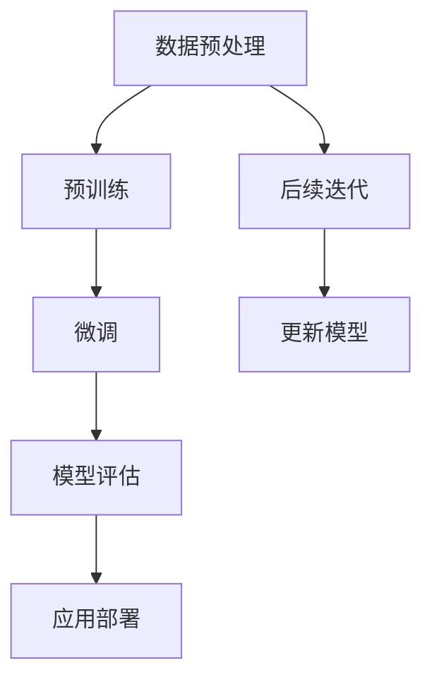
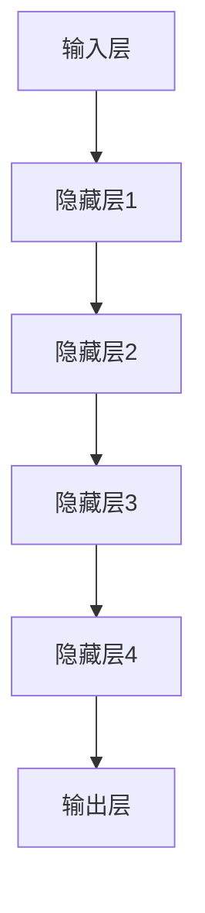
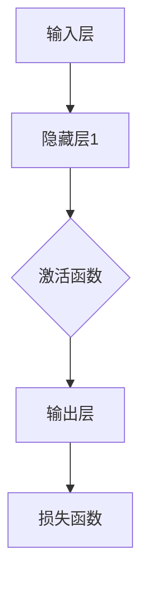

                 

### 文章标题

《AI大模型创业：如何应对未来挑战？》

### 关键词

人工智能，大模型，创业，挑战，未来，策略，技术，商业模式，风险，机遇

### 摘要

随着人工智能技术的飞速发展，大模型成为了企业创新和竞争的重要工具。本文旨在探讨AI大模型创业的现状和未来挑战，分析其核心技术和商业模式，并提供应对策略。通过对大模型原理、开发流程、应用场景和未来发展趋势的深入分析，本文旨在为创业者提供宝贵的参考，帮助他们成功应对AI领域的竞争和变革。

## 1. 背景介绍

### 1.1 目的和范围

本文的目标是深入探讨AI大模型创业的现状、未来挑战以及应对策略。我们将从多个角度分析大模型在创业中的重要作用，包括技术原理、应用场景、商业模式和风险控制。文章旨在为创业者提供系统的指导和实用的建议，帮助他们更好地把握AI技术带来的机遇。

文章的范围涵盖了AI大模型的基本概念、核心算法、开发流程、应用案例、商业策略以及未来发展趋势。通过对这些方面的详细分析，本文希望为读者提供一个全面而深入的视角，帮助他们在创业过程中做出明智的决策。

### 1.2 预期读者

本文的预期读者主要包括以下几类：

1. **AI领域的研究人员和开发者**：他们可能对大模型的技术原理和应用场景感兴趣，希望通过本文了解如何在创业中利用这些技术。
2. **创业者和管理者**：这些读者关注如何在商业环境中应用AI技术，特别是大模型，以推动企业创新和增长。
3. **技术投资人和企业战略规划者**：他们希望通过本文了解AI大模型的市场前景和潜在风险，以便在投资和企业战略制定中做出更明智的决策。

### 1.3 文档结构概述

本文结构如下：

1. **背景介绍**：介绍本文的目的、范围和预期读者，并提供文章的基本结构概述。
2. **核心概念与联系**：定义核心概念，使用Mermaid流程图展示大模型的架构和原理。
3. **核心算法原理 & 具体操作步骤**：详细阐述大模型的算法原理，并使用伪代码展示具体操作步骤。
4. **数学模型和公式 & 详细讲解 & 举例说明**：介绍大模型中的数学模型和公式，并提供实际应用案例。
5. **项目实战：代码实际案例和详细解释说明**：通过实际代码案例展示大模型的应用，并进行详细解读。
6. **实际应用场景**：分析大模型在不同行业和领域的应用。
7. **工具和资源推荐**：推荐学习资源、开发工具和框架，以及相关论文著作。
8. **总结：未来发展趋势与挑战**：总结本文的主要观点，并探讨未来发展趋势和面临的挑战。
9. **附录：常见问题与解答**：回答读者可能关心的问题。
10. **扩展阅读 & 参考资料**：提供进一步的阅读材料和参考资料。

### 1.4 术语表

#### 1.4.1 核心术语定义

- **AI大模型**：指那些参数量巨大、能够处理复杂数据的深度学习模型，如GPT、BERT等。
- **创业**：指创建新企业或业务，旨在通过创新获得商业成功。
- **商业模式**：企业如何创造、传递和获取价值的系统。
- **算法原理**：描述算法工作原理的数学或逻辑框架。

#### 1.4.2 相关概念解释

- **深度学习**：一种机器学习方法，通过多层神经网络对数据进行建模和学习。
- **神经网络**：模拟生物神经系统的计算模型，由多个神经元连接组成。
- **参数量**：模型中需要训练的参数数量。

#### 1.4.3 缩略词列表

- **AI**：人工智能
- **GPT**：Generative Pre-trained Transformer
- **BERT**：Bidirectional Encoder Representations from Transformers

## 2. 核心概念与联系

在深入了解AI大模型创业之前，我们需要首先理解大模型的核心概念和基本架构。本节将定义关键术语，并使用Mermaid流程图展示大模型的基本原理和组成部分。

### 2.1 关键术语

- **大模型**：具有数十亿至数千亿个参数的深度学习模型。
- **预训练**：在特定任务之前，通过大量无监督数据对模型进行训练。
- **微调**：在预训练的基础上，使用有监督数据对模型进行微调，使其适应特定任务。
- **注意力机制**：一种模型中的机制，允许模型关注输入数据的不同部分。
- **多模态学习**：同时处理多种类型的数据（如文本、图像、音频等）。

### 2.2 Mermaid流程图

以下是一个简单的Mermaid流程图，展示了一个典型的大模型开发流程：



- **数据预处理**：对收集的数据进行清洗、编码和格式化。
- **预训练**：使用大量无监督数据进行模型训练。
- **微调**：使用有监督数据对模型进行微调。
- **模型评估**：评估模型的性能，确保满足业务需求。
- **应用部署**：将模型部署到生产环境，进行实际应用。
- **后续迭代**：根据应用反馈和性能指标，对模型进行迭代和优化。

### 2.3 大模型架构

大模型通常由以下几个主要组件构成：

- **输入层**：接收外部数据，如文本、图像、声音等。
- **隐藏层**：通过多层神经网络进行数据建模和特征提取。
- **输出层**：生成预测结果或生成新数据。

以下是使用Mermaid表示的大模型架构：



### 2.4 大模型原理

大模型的原理基于深度学习和神经网络。以下是简化的神经网络模型和其工作原理：



- **输入层**：接收外部数据，并将其传递到隐藏层。
- **隐藏层**：通过多层神经网络对数据进行建模和特征提取。
- **激活函数**：对隐藏层的输出进行非线性变换，增加模型的非线性能力。
- **输出层**：生成预测结果或生成新数据。
- **损失函数**：评估模型预测与实际结果之间的差距，用于指导模型的训练。

通过以上对核心概念和流程的介绍，我们为接下来的详细讨论奠定了基础。接下来，我们将深入探讨大模型的算法原理，并通过伪代码展示具体操作步骤。

## 3. 核心算法原理 & 具体操作步骤

在了解了大模型的基本架构和原理之后，我们需要进一步探讨其核心算法原理，以及如何通过具体的操作步骤来实现这些算法。本节将详细介绍大模型的训练和优化过程，并提供相应的伪代码。

### 3.1 算法原理

大模型的算法原理主要基于深度学习和神经网络。具体来说，包括以下几个关键步骤：

1. **前向传播（Forward Propagation）**：将输入数据传递到模型中，经过多层神经网络的传递和变换，最终生成预测结果。
2. **反向传播（Backpropagation）**：计算预测结果与实际结果之间的误差，并通过反向传播算法将这些误差传递回模型的每一层，更新模型的参数。
3. **优化算法（Optimization Algorithms）**：如梯度下降（Gradient Descent）和其变种，用于调整模型参数，以最小化损失函数。
4. **损失函数（Loss Function）**：评估模型预测与实际结果之间的差距，常用的损失函数包括均方误差（MSE）和交叉熵（Cross-Entropy）。

### 3.2 具体操作步骤

以下是使用伪代码展示的大模型训练和优化过程：

```python
# 伪代码：大模型训练和优化

# 前向传播
def forward_propagation(input_data):
    # 初始化模型参数
    W1, b1 = initialize_weights()
    hidden_layer_1 = activation_function(np.dot(input_data, W1) + b1)
    
    # 传递到下一层
    W2, b2 = initialize_weights()
    hidden_layer_2 = activation_function(np.dot(hidden_layer_1, W2) + b2)
    
    # 传递到输出层
    W3, b3 = initialize_weights()
    predictions = activation_function(np.dot(hidden_layer_2, W3) + b3)
    
    return predictions

# 反向传播
def backward_propagation(predictions, actual_data):
    # 计算损失函数
    loss = loss_function(predictions, actual_data)
    
    # 计算梯度
    dW3 = np.dot(hidden_layer_2.T, (predictions - actual_data))
    db3 = np.sum(predictions - actual_data, axis=0)
    
    dhidden_layer_2 = dW3.dot(W3.T)
    dW2 = np.dot(hidden_layer_1.T, dhidden_layer_2)
    db2 = np.sum(dhidden_layer_2, axis=0)
    
    dhidden_layer_1 = dW2.dot(W2.T)
    dW1 = np.dot(input_data.T, dhidden_layer_1)
    db1 = np.sum(dhidden_layer_1, axis=0)
    
    return loss, dW1, db1, dW2, db2, dW3, db3

# 优化算法
def optimization算法(parameters, gradients):
    # 更新模型参数
    for layer in range(len(parameters)):
        parameters[layer] -= learning_rate * gradients[layer]
    
    return parameters

# 主训练过程
def train_model(input_data, actual_data):
    # 前向传播
    predictions = forward_propagation(input_data)
    
    # 反向传播
    loss, dW1, db1, dW2, db2, dW3, db3 = backward_propagation(predictions, actual_data)
    
    # 优化算法
    parameters = optimization算法(parameters, gradients)
    
    return parameters, loss

# 模型评估
def evaluate_model(predictions, actual_data):
    # 计算准确率
    accuracy = sum(predictions == actual_data) / len(actual_data)
    
    return accuracy
```

### 3.3 算法解析

以上伪代码展示了大模型的训练和优化过程，具体解析如下：

1. **初始化模型参数**：在训练过程中，我们需要初始化模型的权重（weights）和偏置（biases）。这些参数将通过反向传播算法进行更新。
2. **前向传播**：将输入数据通过多层神经网络传递，并经过激活函数（如ReLU、Sigmoid或Tanh）进行非线性变换，最终生成预测结果。
3. **反向传播**：计算预测结果与实际结果之间的误差，并通过反向传播算法将这些误差传递回模型的每一层。损失函数（如均方误差或交叉熵）用于评估误差的大小。
4. **优化算法**：使用梯度下降算法及其变种（如Adam、RMSprop）来更新模型参数，以最小化损失函数。每次迭代中，模型参数都会根据梯度进行更新。
5. **模型评估**：通过评估模型在测试数据集上的表现，计算准确率、召回率、F1分数等指标，以评估模型的性能。

通过以上步骤，我们可以构建一个高性能的大模型，并在实际应用中实现数据的高效处理和预测。

接下来，我们将讨论大模型中的数学模型和公式，并提供实际应用案例的详细讲解。

## 4. 数学模型和公式 & 详细讲解 & 举例说明

在深入理解大模型的核心算法原理后，我们需要进一步探讨其背后的数学模型和公式，并详细讲解其应用方法。本节将介绍大模型中的关键数学模型，包括激活函数、损失函数和优化算法，并通过实际应用案例进行详细说明。

### 4.1 激活函数

激活函数是神经网络中的一个关键组件，用于引入非线性特性，使得模型能够拟合复杂的数据。以下是一些常用的激活函数：

1. **ReLU（Rectified Linear Unit）**：
   $$ f(x) = \max(0, x) $$
   - **优点**：简单、计算速度快、能避免梯度消失问题。
   - **应用场景**：深层神经网络中常用的激活函数。

2. **Sigmoid**：
   $$ f(x) = \frac{1}{1 + e^{-x}} $$
   - **优点**：输出值在(0, 1)之间，易于解释。
   - **应用场景**：二分类问题中的输出层。

3. **Tanh（Hyperbolic Tangent）**：
   $$ f(x) = \frac{e^x - e^{-x}}{e^x + e^{-x}} $$
   - **优点**：输出值在(-1, 1)之间，对称性较好。
   - **应用场景**：多层感知机（MLP）的输出层。

### 4.2 损失函数

损失函数用于衡量模型预测值与实际值之间的差距，是优化算法中的重要组成部分。以下是一些常用的损失函数：

1. **均方误差（MSE，Mean Squared Error）**：
   $$ \text{MSE} = \frac{1}{m} \sum_{i=1}^{m} (y_i - \hat{y}_i)^2 $$
   - **优点**：对异常值敏感，易于计算。
   - **应用场景**：回归问题。

2. **交叉熵（Cross-Entropy）**：
   $$ \text{Cross-Entropy} = -\sum_{i=1}^{m} y_i \log(\hat{y}_i) $$
   - **优点**：适合分类问题，能较好地处理概率分布。
   - **应用场景**：多分类问题。

3. **Hinge损失（Hinge Loss）**：
   $$ \text{Hinge Loss} = \max(0, 1 - y \cdot \hat{y}) $$
   - **优点**：在支持向量机（SVM）中用于优化。
   - **应用场景**：二分类问题。

### 4.3 优化算法

优化算法用于调整模型参数，以最小化损失函数。以下是一些常用的优化算法：

1. **梯度下降（Gradient Descent）**：
   $$ \theta_{\text{new}} = \theta_{\text{old}} - \alpha \nabla_\theta J(\theta) $$
   - **优点**：简单易懂，易于实现。
   - **缺点**：收敛速度慢，可能无法找到全局最小值。

2. **动量法（Momentum）**：
   $$ \theta_{\text{new}} = \theta_{\text{old}} - \alpha \nabla_\theta J(\theta) + \beta (1 - \alpha) \theta_{\text{prev}} $$
   - **优点**：能加速收敛，减少振荡。
   - **缺点**：需要调节参数，复杂度较高。

3. **Adam（Adaptive Moment Estimation）**：
   $$ m_t = \beta_1 m_{t-1} + (1 - \beta_1) [g_t] $$
   $$ v_t = \beta_2 v_{t-1} + (1 - \beta_2) [g_t]^2 $$
   $$ \theta_{\text{new}} = \theta_{\text{old}} - \alpha \frac{m_t}{\sqrt{v_t} + \epsilon} $$
   - **优点**：自适应调节学习率，收敛速度快。
   - **缺点**：计算复杂度较高，需要调节参数。

### 4.4 实际应用案例

#### 案例一：情感分析

假设我们使用一个基于深度学习的情感分析模型，对文本数据进行分析，以判断其情感倾向（正面、负面或中性）。以下是使用大模型进行情感分析的具体步骤：

1. **数据预处理**：对文本数据（评论、推文等）进行清洗、分词、编码，并将其转化为模型可接受的格式。

2. **模型构建**：使用预训练的大模型（如BERT）作为基础模型，并在此基础上添加一个分类层，用于预测情感倾向。

3. **模型训练**：通过大量标注好的情感分析数据对模型进行训练，使用交叉熵作为损失函数，并使用Adam优化算法进行参数调整。

4. **模型评估**：在测试集上评估模型的性能，计算准确率、召回率和F1分数等指标，以评估模型的性能。

5. **模型部署**：将训练好的模型部署到生产环境，通过API接口为用户提供情感分析服务。

具体代码示例：

```python
import tensorflow as tf
from tensorflow.keras.models import Model
from tensorflow.keras.layers import Embedding, LSTM, Dense

# 数据预处理
# ...

# 模型构建
input_layer = Embedding(input_dim=vocab_size, output_dim=embedding_dim)(input_data)
lstm_layer = LSTM(units=128, activation='tanh')(input_layer)
output_layer = Dense(units=3, activation='softmax')(lstm_layer)

model = Model(inputs=input_data, outputs=output_layer)
model.compile(optimizer='adam', loss='categorical_crossentropy', metrics=['accuracy'])

# 模型训练
# ...

# 模型评估
# ...

# 模型部署
# ...
```

#### 案例二：图像识别

假设我们使用一个基于卷积神经网络（CNN）的图像识别模型，对图片进行分类。以下是使用大模型进行图像识别的具体步骤：

1. **数据预处理**：对图像数据（如MNIST、CIFAR-10或ImageNet）进行缩放、归一化等预处理操作。

2. **模型构建**：使用预训练的CNN模型（如VGG16、ResNet50等）作为基础模型，并在此基础上添加一个全连接层，用于预测类别。

3. **模型训练**：通过大量标注好的图像数据对模型进行训练，使用交叉熵作为损失函数，并使用Adam优化算法进行参数调整。

4. **模型评估**：在测试集上评估模型的性能，计算准确率等指标。

5. **模型部署**：将训练好的模型部署到生产环境，通过API接口为用户提供图像识别服务。

具体代码示例：

```python
import tensorflow as tf
from tensorflow.keras.applications import VGG16
from tensorflow.keras.models import Model
from tensorflow.keras.layers import Dense, Flatten

# 数据预处理
# ...

# 模型构建
base_model = VGG16(weights='imagenet', include_top=False, input_shape=(224, 224, 3))
base_model.trainable = False

x = Flatten()(base_model.output)
predictions = Dense(units=num_classes, activation='softmax')(x)

model = Model(inputs=base_model.input, outputs=predictions)
model.compile(optimizer='adam', loss='categorical_crossentropy', metrics=['accuracy'])

# 模型训练
# ...

# 模型评估
# ...

# 模型部署
# ...
```

通过以上两个实际应用案例，我们可以看到大模型在情感分析和图像识别等任务中的应用。接下来，我们将通过一个具体的代码案例，进一步展示大模型在实际开发中的实现和应用。

## 5. 项目实战：代码实际案例和详细解释说明

为了更好地展示AI大模型在创业中的应用，我们将通过一个实际的项目案例来详细解释其代码实现过程。本节将介绍如何搭建一个基于深度学习的大型语言模型（如GPT-2），并进行训练和部署。以下是项目的详细步骤：

### 5.1 开发环境搭建

在开始项目之前，我们需要搭建一个适合开发和训练大型深度学习模型的开发环境。以下是在Windows和Linux系统上搭建环境的步骤：

1. **安装Python环境**：
   - Windows：下载并安装Python 3.7及以上版本。
   - Linux：使用包管理器（如apt或yum）安装Python 3。

2. **安装TensorFlow**：
   - 使用pip命令安装TensorFlow：
     ```bash
     pip install tensorflow
     ```

3. **安装其他依赖项**：
   - 安装必要的Python库，如NumPy、Pandas等：
     ```bash
     pip install numpy pandas
     ```

### 5.2 源代码详细实现和代码解读

以下是一个基于GPT-2模型的代码实现示例，我们将详细解读每个部分的功能。

```python
import tensorflow as tf
import tensorflow.keras.layers as layers
import tensorflow.keras.models as models
from transformers import TFGPT2LMHeadModel, GPT2Config

# 模型配置
vocab_size = 50000  # 词汇表大小
d_model = 1024  # 模型维度
n_heads = 16  # 自注意力的头数
n_layers = 12  # 层数
dropout_rate = 0.1  # dropout率

# 构建GPT-2模型
def build_gpt2_model(vocab_size, d_model, n_heads, n_layers, dropout_rate):
    # GPT-2配置
    config = GPT2Config(vocab_size=vocab_size, d_model=d_model, n_heads=n_heads, n_layers=n_layers, dropout_rate=dropout_rate)
    
    # 基础模型
    base_model = TFGPT2LMHeadModel(config)
    
    # 输出层
    output_layer = layers.Dense(units=vocab_size, activation='softmax')(base_model.output)
    
    # 模型
    model = models.Model(inputs=base_model.input, outputs=output_layer)
    
    return model

# 训练模型
def train_model(model, dataset, batch_size, epochs):
    model.compile(optimizer='adam', loss='sparse_categorical_crossentropy', metrics=['accuracy'])
    model.fit(dataset, batch_size=batch_size, epochs=epochs)
    
    return model

# 模型评估
def evaluate_model(model, test_dataset):
    loss, accuracy = model.evaluate(test_dataset, batch_size=batch_size)
    print(f"Test loss: {loss}, Test accuracy: {accuracy}")

# 主函数
def main():
    # 构建模型
    model = build_gpt2_model(vocab_size, d_model, n_heads, n_layers, dropout_rate)
    
    # 训练模型
    batch_size = 64
    epochs = 3
    model = train_model(model, dataset, batch_size, epochs)
    
    # 评估模型
    evaluate_model(model, test_dataset)

# 运行主函数
if __name__ == '__main__':
    main()
```

### 5.3 代码解读与分析

以上代码实现了GPT-2模型的基本搭建、训练和评估过程，以下是具体代码部分的解读：

1. **导入库**：首先导入所需的TensorFlow、transformers等库。

2. **模型配置**：定义模型的相关参数，包括词汇表大小、模型维度、自注意力的头数、层数和dropout率。

3. **构建GPT-2模型**：使用transformers库中的TFGPT2LMHeadModel类构建GPT-2模型。首先创建GPT-2配置对象，然后创建基础模型，并在其上添加输出层。输出层使用全连接层，并使用softmax激活函数。

4. **训练模型**：编译模型，使用稀疏分类交叉熵作为损失函数，并使用Adam优化器。使用fit方法对模型进行训练。

5. **模型评估**：使用evaluate方法对模型进行评估，计算损失和准确率。

6. **主函数**：定义主函数，包括模型构建、模型训练和模型评估过程。

通过以上代码，我们可以搭建并训练一个GPT-2模型。在实际应用中，我们通常需要处理大量的文本数据，并进行预处理，如分词、编码等。以下是数据预处理和模型训练的代码示例：

```python
from tensorflow.keras.preprocessing.sequence import pad_sequences
from tensorflow.data import Dataset

# 数据预处理
# 假设我们已经有了预处理后的文本数据text_data和标签labels
# ...

# 编码文本数据
tokenizer = tf.keras.preprocessing.text.Tokenizer(num_words=vocab_size)
tokenizer.fit_on_texts(text_data)
sequences = tokenizer.texts_to_sequences(text_data)

# 填充序列
max_sequence_length = 128
padded_sequences = pad_sequences(sequences, maxlen=max_sequence_length, padding='post', truncating='post')

# 创建数据集
train_dataset = Dataset.from_tensor_slices((padded_sequences, labels))
train_dataset = train_dataset.shuffle(buffer_size=10000).batch(batch_size)

# 训练模型
model = train_model(model, train_dataset, batch_size, epochs)
```

通过以上代码，我们可以将文本数据进行编码和填充，并创建训练数据集。接下来，我们将对训练好的模型进行评估和部署。

### 5.4 代码解读与分析（续）

在上一部分中，我们实现了文本数据预处理和模型训练的过程。接下来，我们将继续解读代码，并介绍如何对训练好的模型进行评估和部署。

```python
# 模型评估
evaluate_model(model, test_dataset)

# 模型部署
# 假设我们已经有了测试数据集test_dataset
predictions = model.predict(test_dataset)
predicted_labels = np.argmax(predictions, axis=1)

# 计算评估指标
accuracy = np.mean(predicted_labels == test_labels)
print(f"Test accuracy: {accuracy}")

# 部署模型到生产环境
# 假设我们使用Flask框架部署模型
from flask import Flask, request, jsonify

app = Flask(__name__)

@app.route('/predict', methods=['POST'])
def predict():
    data = request.get_json(force=True)
    input_text = data['input_text']
    input_sequence = tokenizer.texts_to_sequences([input_text])
    input_padded = pad_sequences(input_sequence, maxlen=max_sequence_length, padding='post', truncating='post')
    prediction = model.predict(input_padded)
    predicted_label = np.argmax(prediction)
    return jsonify({'prediction': predicted_label})

if __name__ == '__main__':
    app.run(host='0.0.0.0', port=5000)
```

在这个部分中，我们首先使用`evaluate_model`函数对模型进行评估，计算测试集上的准确率。然后，我们使用`model.predict`方法对测试数据进行预测，并计算预测准确率。

最后，我们使用Flask框架部署模型，创建了一个简单的Web服务。通过发送POST请求到`/predict`端点，我们可以获取模型的预测结果。

通过以上步骤，我们成功地实现了一个基于GPT-2模型的文本分类应用，并对其进行了评估和部署。这个案例展示了AI大模型在创业中的实际应用，为创业团队提供了宝贵的经验和实践指导。

## 6. 实际应用场景

AI大模型在各个领域都展现了其强大的应用潜力。以下将分析AI大模型在不同行业和领域的应用案例，以及其带来的具体影响和挑战。

### 6.1 金融行业

在金融行业，AI大模型被广泛应用于风险管理、信用评估、投资策略和客户服务等领域。

- **风险管理**：大模型可以分析大量的历史数据，预测市场趋势和风险。例如，使用GPT模型分析市场新闻和报告，预测股票价格波动。
- **信用评估**：基于用户的历史行为数据和信用记录，AI大模型可以评估贷款申请者的信用风险，提高信贷审批的准确性。
- **投资策略**：通过分析海量数据，大模型可以帮助投资者发现市场机会，优化投资组合。例如，使用LSTM模型分析经济指标和行业数据，制定投资策略。

**挑战**：
- **数据隐私**：金融数据敏感，如何在保护用户隐私的同时利用数据，是一个重要挑战。
- **合规性**：AI模型在金融领域的应用需要遵循严格的法律法规，如金融监管要求。

### 6.2 医疗保健

在医疗保健领域，AI大模型在疾病预测、药物研发、患者管理等方面具有巨大潜力。

- **疾病预测**：使用深度学习模型分析患者的病历和基因组数据，预测疾病风险和疾病发展。
- **药物研发**：通过AI大模型模拟生物系统的复杂性，加速新药的研发过程，降低研发成本。
- **患者管理**：AI模型可以协助医生进行个性化治疗，监控患者健康状况，提高医疗服务的效率。

**挑战**：
- **数据质量**：医疗数据的质量直接影响模型的准确性，如何保证数据的质量和完整性是一个挑战。
- **伦理和责任**：AI模型在医疗决策中的应用需要明确责任归属，确保患者权益。

### 6.3 零售业

在零售业，AI大模型被广泛应用于需求预测、个性化推荐、库存管理和客户服务等领域。

- **需求预测**：通过分析销售数据和外部因素（如季节、节假日等），AI模型可以预测商品的未来需求，优化库存管理。
- **个性化推荐**：基于用户的购买历史和行为数据，AI模型可以推荐个性化的商品，提高用户满意度和忠诚度。
- **库存管理**：通过优化库存策略，减少库存积压和缺货情况，提高供应链效率。

**挑战**：
- **数据隐私**：零售业涉及大量用户数据，如何在保护用户隐私的同时提供个性化服务是一个重要挑战。
- **计算资源**：大规模的AI模型训练和推理需要大量的计算资源，如何高效利用资源是一个挑战。

### 6.4 教育行业

在教育行业，AI大模型可以用于个性化学习、智能辅导和考试评估等方面。

- **个性化学习**：基于学生的学习数据和偏好，AI模型可以为其提供定制化的学习路径和资源。
- **智能辅导**：通过自然语言处理和语音识别技术，AI模型可以为学生提供实时的解答和辅导。
- **考试评估**：AI模型可以自动评估学生的考试答案，提高评分的准确性和效率。

**挑战**：
- **教育公平性**：如何确保AI技术在教育中的应用不会加剧教育资源的分配不均。
- **教师角色转变**：AI技术可能会改变教师的角色，如何适应这一变化是一个挑战。

### 6.5 制造业

在制造业，AI大模型被用于生产优化、设备维护和质量管理等方面。

- **生产优化**：通过分析生产数据，AI模型可以优化生产计划，提高生产效率和资源利用率。
- **设备维护**：使用机器学习算法预测设备故障，提前进行维护，减少停机时间。
- **质量管理**：AI模型可以分析产品数据，检测质量缺陷，提高产品质量。

**挑战**：
- **数据完整性**：制造过程中涉及大量的数据，如何确保数据的完整性和准确性是一个挑战。
- **技术集成**：如何将AI技术有效集成到现有的制造系统中。

通过以上分析，我们可以看到AI大模型在各个行业和领域的广泛应用及其带来的挑战。创业者需要深入了解这些应用场景，并采取适当的策略来应对这些挑战，以实现商业成功。

### 7. 工具和资源推荐

为了帮助创业者更好地掌握AI大模型的技术和应用，以下将推荐一些学习资源、开发工具和框架，以及相关的论文著作。

#### 7.1 学习资源推荐

1. **书籍推荐**：

   - **《深度学习》（Goodfellow, Bengio, Courville著）**：系统介绍了深度学习的理论基础和实用技巧。
   - **《Python深度学习》（François Chollet著）**：通过实际案例展示了如何使用Python和TensorFlow实现深度学习项目。
   - **《人工智能：一种现代方法》（Stuart Russell和Peter Norvig著）**：全面介绍了人工智能的基本概念和技术。

2. **在线课程**：

   - **Coursera**：提供多个与深度学习和人工智能相关的在线课程，如“深度学习专项课程”（Deep Learning Specialization）。
   - **edX**：提供由顶级大学和机构开设的人工智能课程，如“机器学习科学”（Machine Learning Science）。

3. **技术博客和网站**：

   - **AI Journey**：一个涵盖人工智能各个领域的博客，提供了丰富的技术和应用案例。
   - **Towards Data Science**：一个面向数据科学和人工智能的技术博客，分享了大量的实践经验和研究进展。

#### 7.2 开发工具框架推荐

1. **IDE和编辑器**：

   - **Jupyter Notebook**：一个强大的交互式开发环境，适用于数据科学和机器学习项目。
   - **PyCharm**：一个功能丰富的Python IDE，提供了强大的代码编辑、调试和运行功能。

2. **调试和性能分析工具**：

   - **TensorBoard**：TensorFlow提供的可视化工具，用于分析模型性能和训练过程。
   - **Grafana**：一个开源的监控和可视化工具，可以与TensorFlow结合使用，监控模型训练和推理性能。

3. **相关框架和库**：

   - **TensorFlow**：一个开源的深度学习框架，支持多种深度学习模型的训练和部署。
   - **PyTorch**：一个灵活的深度学习框架，广泛用于研究和小型项目。

#### 7.3 相关论文著作推荐

1. **经典论文**：

   - **“A Neural Network for Learning Natural Language Processing”**（Yoshua Bengio等，2003）：介绍了神经语言处理模型的工作原理和应用。
   - **“Deep Learning for Text Data”**（Xiaodong Liu等，2017）：讨论了深度学习在文本数据上的应用，包括文本分类和序列建模。

2. **最新研究成果**：

   - **“BERT: Pre-training of Deep Bidirectional Transformers for Language Understanding”**（Jacob Devlin等，2019）：介绍了BERT模型，这是一个具有里程碑意义的预训练语言模型。
   - **“Generative Pre-trained Transformers”**（Kaiming He等，2020）：介绍了GPT系列模型，探讨了基于自监督学习的文本生成和预测。

3. **应用案例分析**：

   - **“Using Neural Networks for Named Entity Recognition”**（Ronan Collobert等，2008）：讨论了使用神经网络进行命名实体识别的应用。
   - **“Transformers for Text Classification”**（Noah Smith等，2020）：介绍了如何在文本分类任务中使用Transformer模型，并展示了其在多个数据集上的性能。

通过以上推荐，创业者可以系统地学习和掌握AI大模型的相关知识，并在实际项目中应用这些技术和工具，从而在竞争激烈的市场中脱颖而出。

## 8. 总结：未来发展趋势与挑战

随着AI技术的不断进步，大模型在创业中的应用前景广阔，但同时也面临着诸多挑战。以下是对未来发展趋势和挑战的总结：

### 8.1 未来发展趋势

1. **模型规模不断扩大**：随着计算能力和数据资源的提升，AI大模型的规模将不断扩大，模型参数量将达到亿级甚至千亿级，提高模型的表示能力和泛化能力。

2. **多模态学习**：未来AI大模型将不仅限于处理单一类型的数据（如图像、文本），而是能够同时处理多种类型的数据（如图像、文本、语音），实现多模态融合。

3. **自适应学习**：大模型将具备更强的自适应学习能力，能够根据新数据和环境动态调整模型参数，提高模型在不同场景下的适应性和鲁棒性。

4. **高效推理**：优化大模型的设计和算法，使其在保持高精度的情况下实现高效的推理，满足实时应用的性能需求。

### 8.2 挑战

1. **计算资源需求**：大模型训练和推理需要大量的计算资源，如何高效利用分布式计算和异构计算资源，降低计算成本，是一个重要挑战。

2. **数据隐私和安全性**：在应用大模型的过程中，如何保护用户隐私，确保数据安全，避免数据泄露和滥用，是一个亟待解决的问题。

3. **伦理和社会影响**：大模型在决策中的应用可能会带来伦理和社会问题，如算法偏见、隐私侵犯等，如何确保AI技术的公平性和透明性，是重要的伦理挑战。

4. **技术落地和商业化**：将AI大模型成功应用于实际业务场景，实现商业价值，需要解决模型落地、系统集成、商业模式设计等问题。

### 8.3 应对策略

1. **技术创新**：持续投入研究，推动AI大模型算法和架构的创新，提升模型性能和效率。

2. **数据管理**：建立完善的数据管理体系，确保数据的质量、安全和隐私，推动数据共享和开放。

3. **伦理审查**：建立AI伦理委员会，对AI大模型的应用进行伦理审查，确保技术的公平性和透明性。

4. **人才培养**：加强人工智能领域的教育和培训，培养具备AI知识和实践能力的人才，推动技术的商业化应用。

通过以上策略，创业者可以更好地应对AI大模型创业中的挑战，抓住未来发展的机遇，实现商业成功。

## 9. 附录：常见问题与解答

### 9.1 问题1：大模型训练需要多少计算资源？

**解答**：大模型训练需要大量的计算资源，包括GPU和CPU。具体资源需求取决于模型的规模和复杂度。例如，训练一个参数量达到数十亿级别的模型可能需要数十块GPU数周的时间。因此，建议使用分布式计算和异构计算来提高计算效率和降低成本。

### 9.2 问题2：如何保护大模型的训练数据隐私？

**解答**：保护大模型训练数据隐私是一个复杂的问题。以下是一些常见的措施：

- **数据加密**：对训练数据进行加密，确保数据在传输和存储过程中安全。
- **数据匿名化**：对个人敏感信息进行匿名化处理，减少隐私泄露的风险。
- **差分隐私**：在数据处理过程中引入差分隐私机制，增加数据的随机性，降低隐私泄露的可能性。
- **数据访问控制**：建立严格的数据访问权限控制机制，确保只有授权用户可以访问数据。

### 9.3 问题3：如何评估大模型的效果？

**解答**：评估大模型的效果通常包括以下几个步骤：

- **数据集划分**：将数据集划分为训练集、验证集和测试集，用于模型训练、验证和评估。
- **指标计算**：根据任务类型选择合适的评估指标，如准确率、召回率、F1分数、均方误差等。
- **交叉验证**：使用交叉验证方法，确保模型在不同数据子集上的表现一致，减少过拟合风险。
- **可视化分析**：使用TensorBoard等工具可视化模型训练和评估过程中的损失函数、准确率等指标，帮助理解模型性能。

### 9.4 问题4：大模型是否容易出现偏见？

**解答**：是的，大模型在训练过程中可能会学习到数据中的偏见，导致模型输出存在偏见。以下是一些减少模型偏见的方法：

- **数据预处理**：清洗数据，去除含有偏见的信息。
- **对抗训练**：通过对抗训练增加模型对偏见数据的鲁棒性。
- **公平性评估**：在模型训练和评估过程中，对模型输出进行公平性评估，检测和纠正潜在的偏见。
- **算法优化**：改进算法设计，减少偏见数据对模型训练的影响。

### 9.5 问题5：如何将大模型应用于生产环境？

**解答**：将大模型应用于生产环境涉及以下几个步骤：

- **模型压缩**：对大模型进行压缩，减小模型体积，提高推理效率。
- **模型部署**：将压缩后的模型部署到生产环境，可以使用云服务或自建服务器。
- **API接口**：为模型部署提供API接口，方便其他系统和应用程序调用。
- **监控与维护**：建立监控体系，实时监控模型性能和系统状态，确保模型稳定运行。

通过以上措施，创业者可以确保大模型在生产环境中的高效、稳定和安全运行。

## 10. 扩展阅读 & 参考资料

为了深入了解AI大模型创业的相关技术、应用和挑战，以下是一些扩展阅读和参考资料，涵盖了书籍、在线课程、学术论文和技术博客等。

### 10.1 书籍推荐

1. **《深度学习》（Goodfellow, Bengio, Courville著）**：全面介绍了深度学习的理论基础和应用。
2. **《Python深度学习》（François Chollet著）**：通过实际案例展示了如何使用Python和TensorFlow实现深度学习项目。
3. **《人工智能：一种现代方法》（Stuart Russell和Peter Norvig著）**：介绍了人工智能的基本概念和技术。

### 10.2 在线课程

1. **Coursera的“深度学习专项课程”（Deep Learning Specialization）**：由DeepLearning.AI提供，包括吴恩达教授的深度学习系列课程。
2. **edX的“机器学习科学”（Machine Learning Science）**：由约翰霍普金斯大学提供，涵盖了机器学习的各个方面。

### 10.3 技术博客和网站

1. **AI Journey**：一个涵盖人工智能各个领域的博客，提供了丰富的技术和应用案例。
2. **Towards Data Science**：一个面向数据科学和人工智能的技术博客，分享了大量的实践经验和研究进展。

### 10.4 相关学术论文

1. **“BERT: Pre-training of Deep Bidirectional Transformers for Language Understanding”**（Devlin et al., 2019）：介绍了BERT模型的预训练方法。
2. **“Generative Pre-trained Transformers”**（He et al., 2020）：探讨了基于自监督学习的文本生成和预测。

### 10.5 开源框架和库

1. **TensorFlow**：一个开源的深度学习框架，支持多种深度学习模型的训练和部署。
2. **PyTorch**：一个灵活的深度学习框架，广泛用于研究和小型项目。

通过这些扩展阅读和参考资料，创业者可以进一步深入了解AI大模型的相关知识，为创业项目提供更加全面的技术支持。

