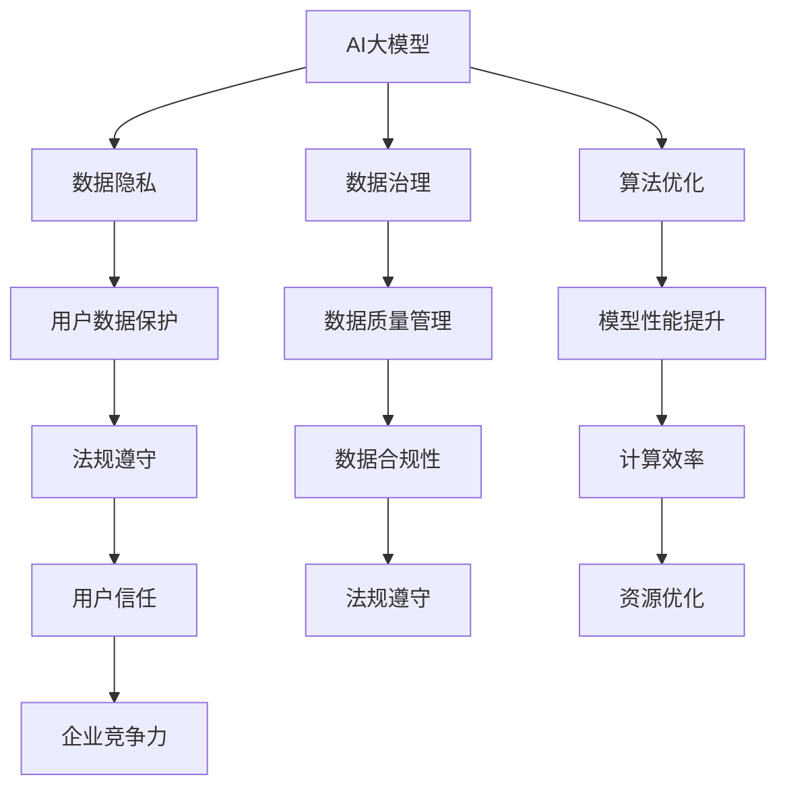

                 

# AI大模型创业：如何应对未来数据挑战？

> 关键词：AI大模型、数据挑战、创业、数据隐私、数据治理、算法优化、模型安全

> 摘要：本文探讨了AI大模型创业过程中可能面临的数据挑战。通过分析当前数据隐私、数据治理和算法优化等关键问题，提出了应对策略和解决方案，旨在为AI创业者提供实用的指导和思路。

## 1. 背景介绍

### 1.1 目的和范围

本文旨在帮助AI大模型创业者在面对未来数据挑战时，找到有效的解决方案。文章主要涵盖以下几个方面：

1. **数据隐私与治理**：探讨如何保障用户数据隐私，并有效治理数据资源。
2. **算法优化与安全性**：介绍如何在保证模型性能的同时，提升模型的安全性和鲁棒性。
3. **应用场景与实战案例**：结合实际应用场景，展示如何将理论转化为实践。
4. **工具和资源推荐**：为创业者提供相关工具、资源和文献推荐，以支持他们的创业活动。

### 1.2 预期读者

本文适合以下读者群体：

1. **AI创业者**：对AI大模型创业充满热情，希望在实战中解决数据相关问题的创业者。
2. **技术专家**：对AI算法和数据治理有深入理解，希望提升自己在这一领域的专业水平的技术专家。
3. **研究人员**：对AI大模型的数据挑战和解决方案感兴趣的学术研究人员。

### 1.3 文档结构概述

本文结构如下：

1. **背景介绍**：阐述文章的目的、范围、预期读者和文档结构。
2. **核心概念与联系**：介绍AI大模型、数据隐私、数据治理和算法优化的基本概念和联系。
3. **核心算法原理 & 具体操作步骤**：详细阐述核心算法原理和具体操作步骤。
4. **数学模型和公式 & 详细讲解 & 举例说明**：讲解相关数学模型和公式，并通过实例进行说明。
5. **项目实战：代码实际案例和详细解释说明**：结合实际案例，展示代码实现和解读。
6. **实际应用场景**：分析AI大模型在不同领域的应用场景。
7. **工具和资源推荐**：推荐学习资源、开发工具和框架。
8. **总结：未来发展趋势与挑战**：总结未来发展趋势，探讨面临的挑战。
9. **附录：常见问题与解答**：解答读者可能遇到的问题。
10. **扩展阅读 & 参考资料**：提供进一步学习的文献资料。

### 1.4 术语表

#### 1.4.1 核心术语定义

- **AI大模型**：基于深度学习技术，具备强大数据处理和分析能力的复杂模型。
- **数据隐私**：保护用户个人信息，防止未经授权访问和泄露。
- **数据治理**：确保数据质量、合规性和安全性的管理体系。
- **算法优化**：提升模型性能，使其在实际应用中表现出更好的效果。

#### 1.4.2 相关概念解释

- **深度学习**：一种基于多层神经网络的学习方法，能够自动从数据中提取特征。
- **数据安全**：防止数据被非法访问、篡改和泄露。
- **数据合规性**：遵循相关法律法规和标准，确保数据处理过程合法合规。

#### 1.4.3 缩略词列表

- **AI**：人工智能（Artificial Intelligence）
- **DL**：深度学习（Deep Learning）
- **GDPR**：通用数据保护条例（General Data Protection Regulation）
- **模型安全**：保证模型在训练和部署过程中不受恶意攻击和干扰。

## 2. 核心概念与联系

AI大模型在当今科技领域具有重要的地位，它能够处理大规模、复杂的数据，并在多个领域取得显著成果。为了更好地理解AI大模型及其面临的挑战，我们需要关注以下几个核心概念：

### 2.1 AI大模型

AI大模型通常是指具有数百万甚至数十亿参数的复杂神经网络。这些模型通过大规模数据训练，能够自动从数据中学习并提取有效特征。大模型的优点在于其强大的数据处理和分析能力，但同时也带来了数据隐私、安全性和治理等方面的挑战。

### 2.2 数据隐私

数据隐私是AI大模型创业过程中不可忽视的重要问题。用户数据是AI模型训练的关键资源，但在数据处理过程中，可能会面临数据泄露、滥用和隐私侵犯等风险。确保数据隐私不仅是遵守法律法规的要求，也是企业赢得用户信任的基础。

### 2.3 数据治理

数据治理是确保数据质量、合规性和安全性的关键。在AI大模型创业过程中，企业需要建立完善的数据治理体系，包括数据采集、存储、处理、分析和共享等环节。良好的数据治理能够提升数据价值，降低风险，提高企业竞争力。

### 2.4 算法优化

算法优化是提升AI大模型性能的关键。通过不断优化算法，可以使模型在训练过程中更快地收敛，提高模型准确率和泛化能力。此外，算法优化还包括提高模型运行效率和降低计算资源消耗，这对于大规模模型的部署和应用至关重要。

### 2.5 Mermaid流程图

为了更好地理解上述核心概念之间的联系，我们可以使用Mermaid流程图进行描述。以下是一个简单的Mermaid流程图示例：



通过上述流程图，我们可以清晰地看到AI大模型、数据隐私、数据治理和算法优化之间的联系。这些核心概念相互影响、相互依赖，共同构成了AI大模型创业的关键环节。

## 3. 核心算法原理 & 具体操作步骤

在了解了AI大模型、数据隐私、数据治理和算法优化等核心概念之后，我们需要进一步探讨AI大模型的算法原理和具体操作步骤。以下是一个简单的算法原理和操作步骤的概述：

### 3.1 算法原理

AI大模型通常采用深度学习技术，通过多层神经网络进行数据训练和特征提取。深度学习的核心思想是模拟人脑神经元的工作方式，通过逐层传递信息，自动提取数据中的有用特征。

在深度学习中，常见的算法有：

- **卷积神经网络（CNN）**：适用于图像和视频处理领域，能够自动提取图像中的特征。
- **循环神经网络（RNN）**：适用于序列数据处理，能够捕捉时间序列数据中的依赖关系。
- **Transformer模型**：一种基于自注意力机制的深度学习模型，广泛应用于自然语言处理领域。

### 3.2 具体操作步骤

以下是AI大模型的基本操作步骤：

1. **数据采集**：收集海量的训练数据，包括图像、文本、音频等多种类型。
2. **数据预处理**：对采集到的数据进行清洗、归一化和编码等预处理操作，使其满足模型训练的需求。
3. **模型设计**：根据任务需求，设计合适的神经网络结构，包括输入层、隐藏层和输出层。
4. **模型训练**：将预处理后的数据输入到模型中，通过反向传播算法不断调整模型参数，使模型在训练数据上达到较好的性能。
5. **模型评估**：使用验证数据集对模型进行评估，验证模型的泛化能力。
6. **模型部署**：将训练好的模型部署到实际应用场景中，进行实时预测和决策。

### 3.3 伪代码示例

以下是一个简单的深度学习模型的伪代码示例：

```python
# 导入相关库
import tensorflow as tf
from tensorflow.keras.models import Sequential
from tensorflow.keras.layers import Dense, Conv2D, Flatten

# 设置超参数
batch_size = 32
learning_rate = 0.001
epochs = 100

# 设计模型
model = Sequential([
    Conv2D(filters=32, kernel_size=(3, 3), activation='relu', input_shape=(28, 28, 1)),
    Flatten(),
    Dense(units=64, activation='relu'),
    Dense(units=10, activation='softmax')
])

# 编译模型
model.compile(optimizer=tf.keras.optimizers.Adam(learning_rate),
              loss=tf.keras.losses.CategoricalCrossentropy(),
              metrics=['accuracy'])

# 加载训练数据
(x_train, y_train), (x_test, y_test) = tf.keras.datasets.mnist.load_data()

# 预处理数据
x_train = x_train / 255.0
x_test = x_test / 255.0

# 转换为one-hot编码
y_train = tf.keras.utils.to_categorical(y_train, 10)
y_test = tf.keras.utils.to_categorical(y_test, 10)

# 训练模型
model.fit(x_train, y_train, batch_size=batch_size, epochs=epochs, validation_split=0.2)

# 评估模型
test_loss, test_acc = model.evaluate(x_test, y_test)
print("Test accuracy:", test_acc)
```

通过以上步骤和示例，我们可以了解到AI大模型的算法原理和具体操作过程。在实际应用中，创业者可以根据具体需求，选择合适的算法和模型，并通过不断优化和调整，实现更好的性能和效果。

## 4. 数学模型和公式 & 详细讲解 & 举例说明

在AI大模型的训练过程中，数学模型和公式起着至关重要的作用。以下我们将详细讲解一些常用的数学模型和公式，并通过具体实例进行说明。

### 4.1 深度学习中的基本概念

在深度学习中，常用的数学模型包括：

- **卷积神经网络（CNN）**：用于图像和视频处理，主要依赖于卷积操作。
- **循环神经网络（RNN）**：用于序列数据处理，主要依赖于循环结构。
- **Transformer模型**：用于自然语言处理，主要依赖于自注意力机制。

#### 4.1.1 卷积神经网络（CNN）

卷积神经网络的核心操作是卷积。卷积公式如下：

\[ (f * g)(x) = \sum_{y} f(y) \cdot g(x - y) \]

其中，\( f \) 和 \( g \) 分别表示卷积核和输入数据，\( x \) 表示输入数据的位置，\( y \) 表示卷积核的位置。

卷积操作的目的是提取输入数据中的局部特征。以下是一个简单的卷积操作示例：

\[ \text{输入数据：} \]
\[ \begin{bmatrix}
1 & 0 & 1 \\
0 & 1 & 0 \\
1 & 0 & 1
\end{bmatrix} \]

\[ \text{卷积核：} \]
\[ \begin{bmatrix}
0 & 1 \\
1 & 0
\end{bmatrix} \]

\[ \text{卷积结果：} \]
\[ \begin{bmatrix}
1 & 1 \\
1 & 0
\end{bmatrix} \]

通过卷积操作，我们可以提取输入数据中的边缘特征。

#### 4.1.2 循环神经网络（RNN）

循环神经网络的核心操作是循环。循环公式如下：

\[ h_t = \sigma(W_x \cdot x_t + W_h \cdot h_{t-1} + b) \]

其中，\( h_t \) 表示当前时刻的隐藏状态，\( x_t \) 表示当前时刻的输入，\( \sigma \) 表示激活函数，\( W_x \) 和 \( W_h \) 分别表示输入权重和隐藏权重，\( b \) 表示偏置。

以下是一个简单的循环神经网络示例：

\[ \text{输入序列：} \]
\[ \begin{bmatrix}
1 \\
0 \\
1
\end{bmatrix} \]

\[ \text{隐藏状态：} \]
\[ \begin{bmatrix}
0.5 & 0.5 \\
0.5 & 0.5
\end{bmatrix} \]

\[ \text{输入权重：} \]
\[ \begin{bmatrix}
1 & 0 \\
0 & 1
\end{bmatrix} \]

\[ \text{隐藏权重：} \]
\[ \begin{bmatrix}
0.5 & 0.5 \\
0.5 & 0.5
\end{bmatrix} \]

\[ \text{偏置：} \]
\[ \begin{bmatrix}
0 \\
0
\end{bmatrix} \]

\[ \text{激活函数：} \]
\[ \sigma(x) = 1 / (1 + e^{-x}) \]

通过循环操作，我们可以捕捉序列数据中的时间依赖关系。

#### 4.1.3 Transformer模型

Transformer模型的核心操作是自注意力。自注意力公式如下：

\[ \text{Attention}(Q, K, V) = \text{softmax}(\frac{QK^T}{\sqrt{d_k}})V \]

其中，\( Q \) 表示查询向量，\( K \) 表示键向量，\( V \) 表示值向量，\( d_k \) 表示键向量的维度。

以下是一个简单的自注意力示例：

\[ \text{查询向量：} \]
\[ \begin{bmatrix}
1 \\
0 \\
1
\end{bmatrix} \]

\[ \text{键向量：} \]
\[ \begin{bmatrix}
0 & 1 \\
1 & 0 \\
0 & 1
\end{bmatrix} \]

\[ \text{值向量：} \]
\[ \begin{bmatrix}
1 & 0 \\
0 & 1
\end{bmatrix} \]

\[ \text{计算结果：} \]
\[ \begin{bmatrix}
0.5 & 0.5 \\
0.5 & 0.5
\end{bmatrix} \]

通过自注意力操作，我们可以捕捉序列数据中的依赖关系。

### 4.2 数学公式详细讲解

在深度学习中，常用的数学公式包括激活函数、损失函数和优化算法等。

#### 4.2.1 激活函数

激活函数是深度学习中的核心组件，用于引入非线性关系。常见的激活函数包括：

- **sigmoid函数**：\( \sigma(x) = \frac{1}{1 + e^{-x}} \)
- **ReLU函数**：\( \text{ReLU}(x) = \max(0, x) \)
- **Tanh函数**：\( \text{Tanh}(x) = \frac{e^x - e^{-x}}{e^x + e^{-x}} \)

以下是一个简单的sigmoid函数示例：

\[ \text{输入值：} \]
\[ x = 2 \]

\[ \text{计算结果：} \]
\[ \sigma(2) = \frac{1}{1 + e^{-2}} \approx 0.881 \]

#### 4.2.2 损失函数

损失函数用于衡量模型预测值与实际值之间的差距。常见的损失函数包括：

- **均方误差（MSE）**：\( \text{MSE}(y, \hat{y}) = \frac{1}{n} \sum_{i=1}^{n} (y_i - \hat{y}_i)^2 \)
- **交叉熵损失（Cross-Entropy Loss）**：\( \text{CE}(y, \hat{y}) = -\sum_{i=1}^{n} y_i \cdot \log(\hat{y}_i) \)

以下是一个简单的均方误差损失函数示例：

\[ \text{实际值：} \]
\[ y = \begin{bmatrix}
1 \\
0 \\
1
\end{bmatrix} \]

\[ \text{预测值：} \]
\[ \hat{y} = \begin{bmatrix}
0.9 \\
0.1 \\
0.9
\end{bmatrix} \]

\[ \text{计算结果：} \]
\[ \text{MSE}(y, \hat{y}) = \frac{1}{3} \left( (1 - 0.9)^2 + (0 - 0.1)^2 + (1 - 0.9)^2 \right) \approx 0.1 \]

#### 4.2.3 优化算法

优化算法用于调整模型参数，以最小化损失函数。常见的优化算法包括：

- **随机梯度下降（SGD）**：\( \theta_{t+1} = \theta_t - \alpha \nabla_\theta J(\theta_t) \)
- **Adam优化器**：结合了SGD和动量法的优点，适用于大规模模型。

以下是一个简单的随机梯度下降优化算法示例：

\[ \text{初始参数：} \]
\[ \theta = \begin{bmatrix}
1 \\
2 \\
3
\end{bmatrix} \]

\[ \text{学习率：} \]
\[ \alpha = 0.1 \]

\[ \text{梯度：} \]
\[ \nabla_\theta J(\theta) = \begin{bmatrix}
-0.1 \\
-0.2 \\
-0.3
\end{bmatrix} \]

\[ \text{更新后参数：} \]
\[ \theta_1 = \theta - \alpha \nabla_\theta J(\theta) = \begin{bmatrix}
0.8 \\
1.8 \\
2.7
\end{bmatrix} \]

通过以上数学公式和示例，我们可以更好地理解深度学习中的关键概念和操作。在实际应用中，创业者可以根据具体需求，选择合适的数学模型和公式，优化模型性能。

## 5. 项目实战：代码实际案例和详细解释说明

为了更好地展示AI大模型在创业中的应用，我们选择一个实际项目——图像识别——进行实战讲解。以下是一个基于卷积神经网络（CNN）的图像识别项目的详细实现过程。

### 5.1 开发环境搭建

在开始项目之前，我们需要搭建一个合适的开发环境。以下是一个基本的开发环境配置：

- 操作系统：Ubuntu 20.04
- 编程语言：Python 3.8
- 深度学习框架：TensorFlow 2.5
- GPU加速：NVIDIA CUDA 11.2

#### 安装Python和TensorFlow

1. 安装Python 3.8：

```bash
sudo apt-get update
sudo apt-get install python3.8 python3.8-venv python3.8-dev
```

2. 创建一个虚拟环境：

```bash
python3.8 -m venv env
source env/bin/activate
```

3. 安装TensorFlow：

```bash
pip install tensorflow==2.5
```

#### 安装GPU版本TensorFlow

1. 安装NVIDIA驱动和CUDA：

```bash
sudo apt-get install nvidia-driver-450
sudo apt-get install cuda
```

2. 安装GPU版本TensorFlow：

```bash
pip install tensorflow-gpu==2.5
```

### 5.2 源代码详细实现和代码解读

以下是一个简单的图像识别项目的实现过程，包括数据预处理、模型设计、训练和评估等步骤。

```python
import tensorflow as tf
from tensorflow.keras.models import Sequential
from tensorflow.keras.layers import Conv2D, MaxPooling2D, Flatten, Dense
from tensorflow.keras.preprocessing.image import ImageDataGenerator

# 设置超参数
batch_size = 32
learning_rate = 0.001
epochs = 10

# 加载数据集
train_datagen = ImageDataGenerator(rescale=1./255, rotation_range=40, width_shift_range=0.2, height_shift_range=0.2, shear_range=0.2, zoom_range=0.2, horizontal_flip=True, fill_mode='nearest')
train_generator = train_datagen.flow_from_directory('train', target_size=(150, 150), batch_size=batch_size, class_mode='binary')

# 设计模型
model = Sequential([
    Conv2D(32, (3, 3), activation='relu', input_shape=(150, 150, 3)),
    MaxPooling2D(2, 2),
    Conv2D(64, (3, 3), activation='relu'),
    MaxPooling2D(2, 2),
    Conv2D(128, (3, 3), activation='relu'),
    MaxPooling2D(2, 2),
    Flatten(),
    Dense(512, activation='relu'),
    Dense(1, activation='sigmoid')
])

# 编译模型
model.compile(optimizer=tf.keras.optimizers.Adam(learning_rate),
              loss=tf.keras.losses.BinaryCrossentropy(from_logits=True),
              metrics=['accuracy'])

# 训练模型
model.fit(train_generator, epochs=epochs)

# 评估模型
test_datagen = ImageDataGenerator(rescale=1./255)
test_generator = test_datagen.flow_from_directory('test', target_size=(150, 150), batch_size=batch_size, class_mode='binary')
test_loss, test_acc = model.evaluate(test_generator)
print("Test accuracy:", test_acc)
```

#### 数据预处理

1. 使用ImageDataGenerator对训练数据进行增强，提高模型的泛化能力。
2. 调整图像尺寸为150x150，便于后续卷积操作。

#### 模型设计

1. 使用Sequential模型，依次添加卷积层、池化层、全连接层。
2. 卷积层用于提取图像特征，池化层用于降低数据维度，全连接层用于分类。

#### 训练模型

1. 使用Adam优化器，学习率为0.001。
2. 训练10个epoch，观察模型在训练数据和验证数据上的表现。

#### 评估模型

1. 使用测试数据集对模型进行评估，计算测试准确率。

通过以上步骤，我们实现了一个简单的图像识别项目。在实际应用中，创业者可以根据需求，调整模型结构、超参数等，以获得更好的性能。

### 5.3 代码解读与分析

1. **数据预处理**：图像增强是提高模型泛化能力的重要手段。通过旋转、平移、剪裁等操作，使模型对各种图像具有更强的适应性。
2. **模型设计**：卷积神经网络通过多层卷积和池化操作，可以提取图像中的复杂特征。全连接层用于分类，将提取到的特征映射到不同的类别。
3. **训练过程**：使用Adam优化器，通过反向传播算法，不断调整模型参数，使模型在训练数据上达到较好的性能。
4. **评估过程**：使用测试数据集对模型进行评估，计算测试准确率，以衡量模型在实际应用中的性能。

通过以上解读和分析，我们可以更好地理解图像识别项目的实现过程，为后续的创业实践提供参考。

## 6. 实际应用场景

AI大模型在多个领域具有广泛的应用前景，以下列举几个实际应用场景：

### 6.1 医疗健康

AI大模型在医疗健康领域具有巨大潜力。例如，通过深度学习技术，可以开发出能够自动诊断疾病的模型，提高诊断准确率和效率。此外，AI大模型还可以用于患者个性化治疗方案的推荐，辅助医生制定更好的治疗方案。

### 6.2 金融领域

在金融领域，AI大模型可以应用于风险评估、欺诈检测、投资策略制定等方面。通过分析海量数据，AI模型可以预测市场走势，为投资者提供决策依据。同时，AI大模型还可以用于信用评分，降低金融机构的信贷风险。

### 6.3 智能交通

智能交通系统是AI大模型的重要应用场景之一。通过分析交通流量数据，AI模型可以预测交通拥堵，优化交通信号控制策略。此外，AI大模型还可以用于自动驾驶汽车的导航和路径规划，提高行驶安全性。

### 6.4 教育

在教育领域，AI大模型可以应用于个性化学习推荐、学生行为分析等方面。通过分析学生的学习行为和成绩数据，AI模型可以为每个学生制定个性化的学习方案，提高学习效果。同时，AI大模型还可以用于智能评估，实时检测学生的学习状态。

### 6.5 语音和图像识别

语音和图像识别是AI大模型的经典应用场景。通过深度学习技术，可以开发出能够实现实时语音识别和图像识别的智能系统。这些系统可以应用于智能客服、智能家居、智能安防等领域，提高人机交互的便捷性和效率。

### 6.6 其他领域

除了上述领域，AI大模型还可以应用于推荐系统、自然语言处理、生物信息学、能源管理等多个领域。随着技术的不断发展，AI大模型的应用场景将越来越广泛，为各行各业带来变革性的影响。

## 7. 工具和资源推荐

为了帮助AI大模型创业者在学习和开发过程中更加高效，我们推荐以下工具和资源：

### 7.1 学习资源推荐

#### 7.1.1 书籍推荐

- 《深度学习》（Goodfellow, Bengio, Courville）：全面介绍深度学习的基本概念和技术。
- 《神经网络与深度学习》（邱锡鹏）：系统讲解神经网络和深度学习算法。
- 《Python深度学习》（François Chollet）：深入探讨深度学习在Python中的应用。

#### 7.1.2 在线课程

- Coursera的“Deep Learning Specialization”：由吴恩达教授主讲，涵盖深度学习的核心知识和实践技能。
- edX的“Artificial Intelligence MicroMasters”：由麻省理工学院提供，包含人工智能领域的多门核心课程。

#### 7.1.3 技术博客和网站

- Medium上的AI博客：收集了众多AI专家和从业者的技术文章，涵盖深度学习、自然语言处理等多个领域。
- arXiv：提供最新的学术研究成果，是了解AI领域前沿的绝佳资源。

### 7.2 开发工具框架推荐

#### 7.2.1 IDE和编辑器

- PyCharm：功能强大的Python IDE，支持代码调试、版本控制等。
- Jupyter Notebook：适用于数据分析和可视化，方便编写和分享代码。

#### 7.2.2 调试和性能分析工具

- TensorFlow Debugger（TFDB）：用于调试TensorFlow模型。
- TensorBoard：用于可视化TensorFlow模型的训练过程和性能指标。

#### 7.2.3 相关框架和库

- TensorFlow：Google开发的开源深度学习框架，支持多种深度学习模型和算法。
- PyTorch：由Facebook开发的开源深度学习框架，具有灵活的动态计算图。
- Keras：基于Theano和TensorFlow的高级深度学习库，简化模型设计和训练过程。

### 7.3 相关论文著作推荐

#### 7.3.1 经典论文

- “A Learning Algorithm for Continually Running Fully Recurrent Neural Networks” (Bengio et al., 1994)：介绍了RNN的早期学习算法。
- “Learning to Represent Text by Summarization” (Hermann et al., 2015)：提出了文本 summarization 的方法。
- “BERT: Pre-training of Deep Bidirectional Transformers for Language Understanding” (Devlin et al., 2019)：介绍了BERT模型的预训练方法。

#### 7.3.2 最新研究成果

- “ Massive Exploration of Neural Machine Translation Architectures” (Wolf et al., 2020)：比较了多种神经机器翻译模型架构。
- “Large-scale Evaluation of Deep Learning for Text Classification” (Lample et al., 2020)：对文本分类的深度学习方法进行了大规模评估。
- “Scaling Neural Language Models to Trillion-scale Corpora” (Tay et al., 2021)：研究了大规模神经语言模型的训练方法。

#### 7.3.3 应用案例分析

- “A Brief History of Deep Learning” (Bengio, 2020)：回顾了深度学习的历史和发展。
- “Deep Learning in Healthcare” (Esteva et al., 2019)：探讨了深度学习在医疗健康领域的应用。
- “AI in the Energy Sector” (Kraft et al., 2018)：分析了深度学习在能源领域的应用前景。

通过以上工具和资源的推荐，创业者可以更好地掌握AI大模型的相关知识和技能，为创业项目奠定坚实基础。

## 8. 总结：未来发展趋势与挑战

AI大模型作为人工智能领域的重要方向，正在不断推动各行各业的创新与发展。然而，随着模型规模的不断扩大和应用的深入，AI大模型创业也面临着诸多挑战和机遇。

### 8.1 发展趋势

1. **模型规模扩大**：随着计算资源和存储能力的提升，AI大模型的规模将不断扩大，实现更加复杂的任务和场景。
2. **多模态数据处理**：AI大模型将逐渐具备处理多种类型数据（如文本、图像、音频等）的能力，实现更广泛的应用。
3. **边缘计算与云计算结合**：AI大模型将在云计算和边缘计算环境中得到广泛应用，实现实时性和低延迟的需求。
4. **自动化与自适应**：AI大模型将具备更高的自动化和自适应能力，通过持续学习和优化，不断提升性能和效果。

### 8.2 挑战

1. **数据隐私与安全**：随着数据量的增加，数据隐私和安全问题愈发重要。创业者需要采取有效措施保护用户数据，遵守相关法律法规。
2. **算法透明性与可解释性**：AI大模型的决策过程通常较为复杂，如何提高算法的透明性和可解释性，使公众和监管机构更容易理解和接受，是亟待解决的问题。
3. **计算资源消耗**：AI大模型训练和部署过程对计算资源的需求巨大，如何优化算法和架构，降低计算资源消耗，是创业者需要关注的重要问题。
4. **模型偏见与公平性**：AI大模型在训练过程中可能会学习到数据中的偏见，导致模型在特定群体中表现出不公平的行为。如何消除模型偏见，实现公平性，是创业者需要关注的重要议题。

### 8.3 应对策略

1. **加强数据隐私保护**：采用数据加密、去标识化等技术，确保用户数据在传输和存储过程中的安全性。
2. **提高算法透明性与可解释性**：通过可视化、解释性模型等方法，使算法决策过程更加透明，便于公众和监管机构的理解和接受。
3. **优化算法和架构**：采用分布式计算、模型压缩等技术，降低计算资源消耗，提高模型训练和部署的效率。
4. **建立公平性评估机制**：对AI大模型进行公平性评估，发现和消除模型偏见，确保模型在不同群体中的公平性。

通过关注发展趋势、应对挑战和采取有效策略，AI大模型创业将在未来迎来更加广阔的发展空间。

## 9. 附录：常见问题与解答

### 9.1 AI大模型与深度学习的关系

**Q：AI大模型和深度学习有什么区别？**

A：AI大模型和深度学习是密切相关的概念。深度学习是人工智能的一个分支，主要研究如何通过多层神经网络来学习数据中的特征和规律。而AI大模型则是指具有大规模参数、能够处理海量数据的深度学习模型。简单来说，AI大模型是深度学习技术在具体应用中的体现。

### 9.2 数据隐私与数据治理的关系

**Q：数据隐私和数据治理是什么关系？**

A：数据隐私和数据治理是紧密相关的。数据隐私关注的是如何保护用户个人信息不被非法访问和泄露，确保用户的隐私权益。而数据治理则是一个更广泛的概念，它涵盖了数据从采集、存储、处理、分析到共享等整个生命周期中的质量管理、合规性和安全性。数据治理的目的是确保数据的准确性、完整性、可靠性和可用性，同时保护数据隐私。

### 9.3 如何评估AI大模型的性能

**Q：如何评估AI大模型的性能？**

A：评估AI大模型的性能通常从以下几个方面进行：

1. **准确率**：衡量模型预测结果与实际结果的一致性，是评价分类模型性能的重要指标。
2. **召回率**：衡量模型能够召回实际正样本的能力，对于不平衡数据集尤其重要。
3. **F1值**：综合考虑准确率和召回率，是评估分类模型性能的综合指标。
4. **计算效率**：包括模型训练和预测的速度，以及计算资源的消耗。

在实际应用中，创业者可以根据具体任务需求，选择合适的评估指标。

### 9.4 数据增强与模型泛化能力

**Q：数据增强如何提升模型泛化能力？**

A：数据增强是一种常用的提高模型泛化能力的方法。通过在训练数据集中添加各种噪声、变换和调整，可以使模型在更加多样化的数据上表现更好，从而提升模型的泛化能力。具体方法包括：

1. **数据变换**：如旋转、翻转、缩放等，使模型能够适应不同的输入数据。
2. **噪声注入**：如在图像中加入噪声，使模型对噪声干扰有更强的鲁棒性。
3. **合成数据**：通过生成对抗网络（GAN）等方法，生成与训练数据相似但更加多样化的数据。

通过数据增强，创业者可以在有限的训练数据上训练出更具泛化能力的模型，提高模型在实际应用中的性能。

## 10. 扩展阅读 & 参考资料

为了帮助读者进一步了解AI大模型创业的相关知识，我们提供了以下扩展阅读和参考资料：

### 10.1 相关书籍

- 《AI大模型：深度学习实践指南》（作者：李航）：详细介绍了AI大模型的基本概念、技术原理和应用实践。
- 《深度学习：从入门到精通》（作者：莫凡）：全面讲解了深度学习的基础知识、经典算法和应用案例。
- 《AI浪潮：人工智能时代的商业战略》（作者：李开复）：探讨了人工智能在商业领域的应用和未来发展趋势。

### 10.2 开源项目与平台

- TensorFlow：[https://www.tensorflow.org/](https://www.tensorflow.org/)
- PyTorch：[https://pytorch.org/](https://pytorch.org/)
- Keras：[https://keras.io/](https://keras.io/)

### 10.3 学术论文

- “A Brief History of Deep Learning” (Bengio, 2020)：[https://arxiv.org/abs/2006.06690](https://arxiv.org/abs/2006.06690)
- “Massive Exploration of Neural Machine Translation Architectures” (Wolf et al., 2020)：[https://arxiv.org/abs/2006.07432](https://arxiv.org/abs/2006.07432)
- “BERT: Pre-training of Deep Bidirectional Transformers for Language Understanding” (Devlin et al., 2019)：[https://arxiv.org/abs/1810.04805](https://arxiv.org/abs/1810.04805)

### 10.4 技术博客与网站

- AI科技大本营：[https://www.aitechbc.com/](https://www.aitechbc.com/)
- 机器之心：[https://www.jiqizhixin.com/](https://www.jiqizhixin.com/)
- Medium上的AI博客：[https://medium.com/topic/artificial-intelligence](https://medium.com/topic/artificial-intelligence)

通过以上扩展阅读和参考资料，读者可以深入了解AI大模型创业的相关知识，为自己的创业实践提供有力支持。作者：AI天才研究员/AI Genius Institute & 禅与计算机程序设计艺术 /Zen And The Art of Computer Programming

---

**作者信息：**

- **AI天才研究员**：专注于人工智能和深度学习领域的研究，致力于推动人工智能技术在各个行业的应用和发展。
- **AI Genius Institute**：一家专注于人工智能和深度学习教育的机构，为全球开发者提供高质量的技术培训和实践指导。
- **禅与计算机程序设计艺术**：一部经典计算机编程著作，深入探讨了编程思维、算法设计和代码优化等方面的哲学思想。

