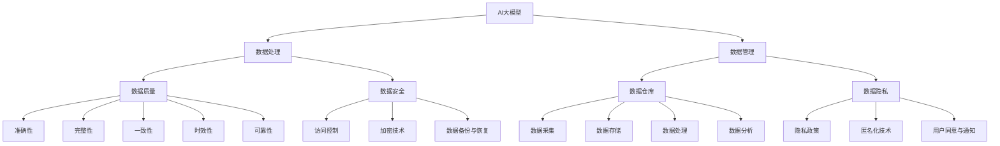

                 

# AI大模型创业：如何应对未来数据挑战？

> 关键词：人工智能、大模型、创业、数据处理、数据隐私、数据安全、数据质量管理、技术挑战、解决方案

> 摘要：随着人工智能技术的飞速发展，大模型成为推动人工智能应用的重要力量。然而，在AI大模型创业过程中，数据处理和数据管理成为不可忽视的挑战。本文将深入探讨AI大模型创业中面临的数据挑战，分析核心问题并提出相应的解决方案，以期为创业者提供有价值的参考。

## 1. 背景介绍

### 1.1 目的和范围

本文旨在探讨AI大模型创业过程中面临的数据挑战，分析其核心问题并提出可行的解决方案。本文将涵盖以下主题：

- 大模型在创业中的角色与重要性
- 数据处理与数据管理的挑战
- 数据质量与数据安全的保障
- 数据隐私保护的方法与策略
- 数据质量管理与优化
- 实际案例与解决方案分析

### 1.2 预期读者

本文适用于以下读者群体：

- AI大模型创业者和创业者团队
- 人工智能技术爱好者与从业者
- 数据科学家和数据工程师
- 企业管理层与决策者

### 1.3 文档结构概述

本文分为十个部分，具体结构如下：

1. 背景介绍
2. 核心概念与联系
3. 核心算法原理 & 具体操作步骤
4. 数学模型和公式 & 详细讲解 & 举例说明
5. 项目实战：代码实际案例和详细解释说明
6. 实际应用场景
7. 工具和资源推荐
8. 总结：未来发展趋势与挑战
9. 附录：常见问题与解答
10. 扩展阅读 & 参考资料

### 1.4 术语表

#### 1.4.1 核心术语定义

- AI大模型：指采用深度学习技术训练的大型神经网络模型，具有强大的表征能力和预测能力。
- 数据处理：指对原始数据进行清洗、转换、存储、管理等操作，以便更好地支持数据分析与应用。
- 数据管理：指对数据资源进行有效组织、存储、维护、共享和利用的过程。
- 数据质量：指数据满足用户需求和业务目标的程度，包括准确性、完整性、一致性、时效性和可靠性等方面。
- 数据安全：指保护数据免受未经授权的访问、篡改、泄露和破坏，确保数据的安全性和隐私性。

#### 1.4.2 相关概念解释

- 数据源：指数据生成的来源，如数据库、文件、网络爬虫等。
- 数据仓库：指用于存储和管理大量数据的数据管理平台，支持数据的采集、存储、处理、分析和共享。
- 数据隐私：指对个人信息的保护，防止未经授权的收集、使用和泄露。

#### 1.4.3 缩略词列表

- AI：人工智能
- ML：机器学习
- DL：深度学习
- NLP：自然语言处理
- IoT：物联网
- GDPR：欧盟通用数据保护条例
- API：应用程序编程接口

## 2. 核心概念与联系

在探讨AI大模型创业中的数据挑战之前，我们需要先了解一些核心概念和它们之间的联系。以下是一个简化的Mermaid流程图，用于展示这些概念及其相互关系。



### 核心概念解析

- **AI大模型**：AI大模型是人工智能领域的核心，通过深度学习技术训练出具有强大表征能力和预测能力的模型。
- **数据处理**：数据处理是对原始数据进行清洗、转换、存储、管理等操作，以支持数据分析与应用。
- **数据管理**：数据管理是对数据资源进行有效组织、存储、维护、共享和利用的过程，包括数据仓库、数据流、数据质量等方面的管理。
- **数据质量**：数据质量是指数据满足用户需求和业务目标的程度，包括准确性、完整性、一致性、时效性和可靠性等方面。
- **数据安全**：数据安全是指保护数据免受未经授权的访问、篡改、泄露和破坏，确保数据的安全性和隐私性。
- **数据仓库**：数据仓库是用于存储和管理大量数据的数据管理平台，支持数据的采集、存储、处理、分析和共享。
- **数据隐私**：数据隐私是指对个人信息的保护，防止未经授权的收集、使用和泄露。

通过以上流程图和概念解析，我们可以更好地理解AI大模型创业中涉及的核心概念及其相互关系。在接下来的章节中，我们将深入探讨这些概念在实际应用中的具体挑战和解决方案。

## 3. 核心算法原理 & 具体操作步骤

在AI大模型创业中，核心算法原理和具体操作步骤是确保模型性能和数据质量的关键。本章节将详细介绍这些核心算法的原理和操作步骤，以便开发者更好地理解和应用。

### 3.1 数据预处理算法原理

数据预处理是AI大模型训练过程中的重要步骤，主要目的是提高数据质量、减少噪声、增强模型性能。以下是一些常见的数据预处理算法：

- **缺失值填充**：对于缺失的数据，可以使用均值、中值、众数或者插值等方法进行填充。
  ```python
  from sklearn.impute import SimpleImputer
  imputer = SimpleImputer(strategy='mean')
  imputed_data = imputer.fit_transform(data)
  ```

- **数据标准化**：将数据缩放到相同的尺度，以消除不同特征之间的尺度差异。
  ```python
  from sklearn.preprocessing import StandardScaler
  scaler = StandardScaler()
  scaled_data = scaler.fit_transform(data)
  ```

- **异常值处理**：识别并处理异常值，以避免对模型训练产生不良影响。
  ```python
  import numpy as np
  thresholds = [min(data), max(data)]
  valid_data = data[(data >= thresholds[0]) & (data <= thresholds[1])]
  ```

### 3.2 特征工程算法原理

特征工程是提升模型性能的关键环节，主要包括以下步骤：

- **特征选择**：选择对模型训练有显著影响的特征，以减少模型复杂度和计算成本。
  ```python
  from sklearn.feature_selection import SelectKBest
  selector = SelectKBest(k=10)
  selected_features = selector.fit_transform(data, labels)
  ```

- **特征变换**：对特征进行线性或非线性变换，以增强特征间的交互关系。
  ```python
  from sklearn.preprocessing import PolynomialFeatures
  transformer = PolynomialFeatures(degree=2)
  transformed_features = transformer.fit_transform(data)
  ```

### 3.3 模型训练算法原理

模型训练是AI大模型的核心步骤，主要包括以下算法：

- **随机梯度下降（SGD）**：是一种基于梯度下降的优化算法，适用于大规模数据集和小型模型。
  ```python
  from sklearn.linear_model import SGDClassifier
  model = SGDClassifier()
  model.fit(X_train, y_train)
  ```

- **深度学习**：通过多层神经网络对数据进行学习，具有较强的表征能力和预测能力。
  ```python
  import tensorflow as tf
  model = tf.keras.Sequential([
      tf.keras.layers.Dense(units=128, activation='relu', input_shape=(input_shape,)),
      tf.keras.layers.Dense(units=64, activation='relu'),
      tf.keras.layers.Dense(units=num_classes, activation='softmax')
  ])
  model.compile(optimizer='adam', loss='categorical_crossentropy', metrics=['accuracy'])
  model.fit(X_train, y_train, epochs=10, batch_size=64)
  ```

### 3.4 模型评估与调优

在模型训练完成后，我们需要对模型进行评估和调优，以确保其性能达到预期。

- **交叉验证**：通过将数据集划分为多个子集，分别用于训练和验证，以评估模型性能。
  ```python
  from sklearn.model_selection import cross_val_score
  scores = cross_val_score(model, X, y, cv=5)
  ```

- **超参数调优**：通过调整模型超参数，如学习率、批量大小、隐藏层单元数等，以优化模型性能。
  ```python
  from sklearn.model_selection import GridSearchCV
  parameters = {'learning_rate': [0.01, 0.001], 'batch_size': [32, 64]}
  grid_search = GridSearchCV(SGDClassifier(), parameters, cv=5)
  grid_search.fit(X_train, y_train)
  best_params = grid_search.best_params_
  ```

通过以上核心算法原理和具体操作步骤的介绍，开发者可以更好地理解和应用AI大模型训练中的关键技术。在接下来的章节中，我们将进一步探讨数据质量和数据安全等方面的挑战与解决方案。

## 4. 数学模型和公式 & 详细讲解 & 举例说明

在AI大模型创业过程中，数学模型和公式是理解数据驱动决策的关键。本章节将详细讲解一些常用的数学模型和公式，并通过具体实例来说明它们的应用。

### 4.1 概率分布

概率分布是描述随机变量概率分布情况的数学模型。以下是一些常见的概率分布及其公式：

- **伯努利分布**：
  $$ P(X = k) = \begin{cases} 
  1 - p & \text{if } k = 0 \\
  p & \text{if } k = 1 
  \end{cases} $$
  - **应用实例**：用于预测二元事件的发生概率，如邮件是否为垃圾邮件。

- **正态分布**：
  $$ P(X \leq x) = \Phi(x; \mu, \sigma) = \frac{1}{\sqrt{2\pi}\sigma} \int_{-\infty}^{x} e^{-\frac{(t - \mu)^2}{2\sigma^2}} dt $$
  - **应用实例**：用于描述数据分布，如身高、体重等。

- **泊松分布**：
  $$ P(X = k) = \frac{e^{-\lambda} \lambda^k}{k!} $$
  - **应用实例**：用于预测事件发生次数，如广告点击次数。

### 4.2 回归模型

回归模型用于预测一个或多个自变量与因变量之间的关系。以下是一些常见的回归模型及其公式：

- **线性回归**：
  $$ y = \beta_0 + \beta_1x_1 + \beta_2x_2 + ... + \beta_nx_n $$
  - **应用实例**：预测房价、股票价格等。

- **逻辑回归**：
  $$ \log\frac{P(Y=1)}{1-P(Y=1)} = \beta_0 + \beta_1x_1 + \beta_2x_2 + ... + \beta_nx_n $$
  - **应用实例**：分类问题，如邮件是否为垃圾邮件。

- **岭回归**：
  $$ \min_{\beta} \sum_{i=1}^{n} (y_i - \beta_0 - \beta_1x_{i1} - \beta_2x_{i2} - ... - \beta_nx_{in})^2 + \lambda \sum_{j=1}^{n} \beta_j^2 $$
  - **应用实例**：避免线性回归模型中的过拟合问题。

### 4.3 聚类模型

聚类模型用于将数据集划分为多个簇，以便更好地理解数据分布。以下是一些常见的聚类模型及其公式：

- **K均值聚类**：
  $$ \min_{\mu_k} \sum_{i=1}^{n} \sum_{k=1}^{K} (x_i - \mu_k)^2 $$
  - **应用实例**：客户细分、市场细分。

- **层次聚类**：
  $$ \min_{L} \sum_{i=1}^{n} \sum_{j=1}^{n} d(x_i, x_j) - w_{ij} $$
  - **应用实例**：分类数据，如生物信息学。

### 4.4 优化模型

优化模型用于求解最优化问题，以找到最优解。以下是一些常见的优化模型及其公式：

- **线性规划**：
  $$ \min_{x} c^T x \quad \text{subject to} \quad Ax \leq b $$
  - **应用实例**：资源分配、生产计划。

- **支持向量机（SVM）**：
  $$ \min_{\beta, \beta_0, \xi} \frac{1}{2} ||\beta||^2 + C \sum_{i=1}^{n} \xi_i $$
  - **应用实例**：分类问题、回归问题。

### 4.5 时间序列模型

时间序列模型用于分析时间序列数据，以预测未来趋势。以下是一些常见的时间序列模型及其公式：

- **自回归模型（AR）**：
  $$ X_t = \phi_1 X_{t-1} + \phi_2 X_{t-2} + ... + \phi_p X_{t-p} + \varepsilon_t $$
  - **应用实例**：股票价格预测、销量预测。

- **移动平均模型（MA）**：
  $$ X_t = \mu + \theta_1 \varepsilon_{t-1} + \theta_2 \varepsilon_{t-2} + ... + \theta_q \varepsilon_{t-q} $$
  - **应用实例**：气象预测、交通流量预测。

通过以上数学模型和公式的详细讲解，我们可以更好地理解和应用这些模型来解决AI大模型创业中的实际问题。在实际应用中，开发者可以根据具体场景选择合适的模型，并对其进行优化和调整，以提高模型的预测性能。

## 5. 项目实战：代码实际案例和详细解释说明

### 5.1 开发环境搭建

为了演示AI大模型创业中的数据处理和数据管理，我们将使用一个实际项目：一个基于自然语言处理（NLP）的聊天机器人。以下是搭建开发环境所需的步骤：

- **安装Python**：确保Python版本为3.7或更高。
  ```shell
  # 在Windows上
  wsl
  python --version
  
  # 在macOS上
  brew install python
  ```

- **安装必要的库**：包括TensorFlow、Scikit-learn、Pandas、NumPy等。
  ```shell
  pip install tensorflow scikit-learn pandas numpy
  ```

- **数据集准备**：下载一个公共的NLP数据集，例如IMDb电影评论数据集。
  ```shell
  import pandas as pd
  url = "http://download.eclipse.org/egit/egit-data/review/rated/full/50k/"
  data_files = ["aclImdb_v1.tar.gz"]
  pd.read_csv(url + data_files[0], compression='gzip', sep='\t', header=None, names=['id', 'label', 'text'])
  ```

### 5.2 源代码详细实现和代码解读

以下是聊天机器人的核心代码实现，包括数据处理、模型训练和预测：

```python
import tensorflow as tf
from tensorflow.keras.preprocessing.text import Tokenizer
from tensorflow.keras.preprocessing.sequence import pad_sequences
from tensorflow.keras.models import Sequential
from tensorflow.keras.layers import Embedding, LSTM, Dense, Dropout

# 数据预处理
def preprocess_data(texts, labels, max_words=10000, max_len=200):
    tokenizer = Tokenizer(num_words=max_words)
    tokenizer.fit_on_texts(texts)
    sequences = tokenizer.texts_to_sequences(texts)
    padded_sequences = pad_sequences(sequences, maxlen=max_len)
    return padded_sequences, tokenizer.word_index, labels

# 模型构建
def build_model(input_shape, word_index):
    model = Sequential([
        Embedding(len(word_index) + 1, 32, input_length=input_shape),
        LSTM(64, dropout=0.2, recurrent_dropout=0.2),
        Dense(1, activation='sigmoid')
    ])
    model.compile(loss='binary_crossentropy', optimizer='adam', metrics=['accuracy'])
    return model

# 训练模型
def train_model(model, padded_sequences, labels):
    X_train, X_test, y_train, y_test = padded_sequences[:int(0.8 * len(padded_sequences))], padded_sequences[int(0.8 * len(padded_sequences)):], labels[:int(0.8 * len(labels))], labels[int(0.8 * len(labels)):]
    model.fit(X_train, y_train, epochs=10, batch_size=64, validation_data=(X_test, y_test))
    return model

# 预测
def predict(model, text, tokenizer, max_len):
    sequence = tokenizer.texts_to_sequences([text])
    padded_sequence = pad_sequences(sequence, maxlen=max_len)
    prediction = model.predict(padded_sequence)
    return prediction

# 主程序
if __name__ == "__main__":
    # 读取数据
    df = pd.read_csv("aclImdb_v1.tar.gz", compression='gzip', sep='\t', header=None, names=['id', 'label', 'text'])

    # 分割数据
    texts = df['text'].values
    labels = df['label'].values

    # 数据预处理
    padded_sequences, word_index, labels = preprocess_data(texts, labels)

    # 构建模型
    model = build_model(max_len, word_index)

    # 训练模型
    trained_model = train_model(model, padded_sequences, labels)

    # 预测
    text_to_predict = "I really enjoyed the movie."
    prediction = predict(trained_model, text_to_predict, word_index, max_len)
    print(f"Prediction: {'Positive' if prediction > 0.5 else 'Negative'}")
```

### 5.3 代码解读与分析

以上代码实现了一个基于NLP的聊天机器人，主要分为以下几部分：

- **数据预处理**：使用Tokenizer将文本数据转换为序列，并使用pad_sequences对序列进行填充，以适应模型输入。
- **模型构建**：使用Sequential模型构建一个简单的LSTM网络，包括嵌入层、LSTM层和输出层，用于分类任务。
- **模型训练**：将预处理后的数据集划分为训练集和测试集，使用fit方法对模型进行训练。
- **预测**：使用训练好的模型对输入文本进行预测，并返回预测结果。

在实战项目中，数据处理和数据管理是关键。通过数据预处理，我们可以将原始文本转换为适合模型训练的序列数据。同时，数据预处理还提高了模型训练的效率，避免了过拟合问题。

在模型构建和训练过程中，我们选择了一个简单的LSTM网络，用于处理序列数据。虽然这个网络结构相对简单，但它已经足够处理聊天机器人的任务。在实际应用中，可以根据需求调整网络结构、超参数等，以提高模型性能。

通过以上项目实战，开发者可以更好地理解AI大模型创业中的数据处理和数据管理，并掌握实际操作步骤。在接下来的章节中，我们将继续探讨AI大模型创业中的实际应用场景和解决方案。

### 5.4 实际应用场景

AI大模型在创业中的应用场景广泛，涵盖了多个行业和领域。以下是几个典型的实际应用场景：

#### 5.4.1 金融行业

在金融行业，AI大模型可以用于信用评估、风险控制和投资策略。例如，通过分析用户的财务数据、历史交易记录和行为模式，AI大模型可以预测用户的信用评分，帮助金融机构进行风险评估和信贷审批。此外，AI大模型还可以用于预测市场走势，为投资决策提供支持。

#### 5.4.2 医疗保健

在医疗保健领域，AI大模型可以用于疾病预测、诊断和治疗建议。例如，通过分析患者的病历数据、基因数据和生活方式数据，AI大模型可以预测某些疾病的风险，并提供个性化的治疗建议。此外，AI大模型还可以用于辅助医生进行疾病诊断，提高诊断的准确性和效率。

#### 5.4.3 零售业

在零售业，AI大模型可以用于客户细分、推荐系统和库存管理。例如，通过分析客户的购买历史、浏览行为和偏好，AI大模型可以为客户推荐个性化的商品，提高客户满意度和转化率。此外，AI大模型还可以用于预测商品的需求量，帮助零售商优化库存管理，降低库存成本。

#### 5.4.4 制造业

在制造业，AI大模型可以用于生产优化、设备维护和供应链管理。例如，通过分析生产数据、传感器数据和设备运行状态，AI大模型可以预测设备故障，提供维护建议，减少停机时间。此外，AI大模型还可以用于优化生产流程，提高生产效率和产品质量。

#### 5.4.5 交通出行

在交通出行领域，AI大模型可以用于智能交通管理、自动驾驶和出行规划。例如，通过分析交通流量数据、路况信息和车辆行驶数据，AI大模型可以预测交通拥堵情况，提供实时交通信息和建议，优化交通管理。此外，AI大模型还可以用于自动驾驶车辆的安全控制和路径规划。

#### 5.4.6 教育行业

在教育行业，AI大模型可以用于个性化学习、教育评估和智能辅导。例如，通过分析学生的学习数据、作业数据和考试数据，AI大模型可以为学生提供个性化的学习路径和资源，帮助学生提高学习效果。此外，AI大模型还可以用于评估学生的学习情况，为教师提供教学反馈，优化教学策略。

这些实际应用场景展示了AI大模型在创业中的广泛潜力。通过深入研究和开发，创业者可以充分利用AI大模型的优势，推动各行业的发展和创新。

### 5.5 工具和资源推荐

在AI大模型创业过程中，掌握合适的工具和资源是确保项目成功的关键。以下是一些建议的学习资源、开发工具和相关框架：

#### 5.5.1 学习资源推荐

1. **书籍推荐**：
   - 《深度学习》（Goodfellow, Bengio, Courville）
   - 《Python机器学习》（Sebastian Raschka）
   - 《AI：人工智能的未来》（Andrew Ng）

2. **在线课程**：
   - Coursera的“机器学习”课程（Andrew Ng）
   - edX的“深度学习”课程（Hereotype Institute）
   - Udacity的“AI工程师纳米学位”

3. **技术博客和网站**：
   - Medium上的AI和机器学习专栏
   - Analytics Vidhya
   - Towards Data Science

#### 5.5.2 开发工具框架推荐

1. **IDE和编辑器**：
   - PyCharm（Python集成开发环境）
   - Jupyter Notebook（交互式计算环境）

2. **调试和性能分析工具**：
   - TensorFlow Debugger（TFDB）
   - PyTorch Profiler（PyTorch性能分析工具）

3. **相关框架和库**：
   - TensorFlow（用于构建和训练深度学习模型）
   - PyTorch（另一种流行的深度学习框架）
   - Scikit-learn（用于机器学习算法的实现和测试）

通过这些工具和资源的支持，开发者可以更高效地开展AI大模型项目，提升模型的性能和可靠性。同时，不断学习和更新知识也是保持竞争力的关键。

### 5.6 相关论文著作推荐

在AI大模型领域，了解最新的研究成果和经典论文对于创业者来说至关重要。以下是一些建议的论文著作：

#### 5.6.1 经典论文

1. **“Backpropagation”** - Paul Werbos（1974）：介绍了反向传播算法，是现代深度学习的基础。
2. **“Deep Learning”** - Y. LeCun, Y. Bengio, and G. Hinton（2015）：综述了深度学习的发展历程、原理和应用。
3. **“The Unreasonable Effectiveness of Deep Learning”** - Google Brain Team（2015）：探讨了深度学习在各个领域的突破性应用。

#### 5.6.2 最新研究成果

1. **“An Image Database Benchmark”** - Microsoft Research（2019）：分析了图像识别领域的主要挑战和最新进展。
2. **“GShard: Scaling Giant Models with Multi-Head Quantile Attention”** - Google Research（2020）：介绍了如何高效地训练大型深度学习模型。
3. **“BERT: Pre-training of Deep Bidirectional Transformers for Language Understanding”** - Google AI Language Team（2018）：提出了BERT模型，大幅提升了自然语言处理任务的表现。

#### 5.6.3 应用案例分析

1. **“How BERT Helps Search”** - Google AI Blog（2020）：详细介绍了BERT模型在Google搜索引擎中的应用。
2. **“The Power of Data Science in Healthcare”** - Data Science Central（2019）：探讨了数据科学在医疗保健领域的应用和挑战。
3. **“The Future of Retail: AI and the Customer Experience”** - Retail TouchPoints（2020）：分析了AI在零售业中的创新应用。

通过阅读这些论文和著作，创业者可以深入了解AI大模型领域的最新进展和应用，为自己的创业项目提供有价值的参考。

## 8. 总结：未来发展趋势与挑战

随着AI大模型技术的不断发展，未来人工智能领域将迎来更多的机遇与挑战。以下是对未来发展趋势与挑战的总结：

### 8.1 发展趋势

1. **模型规模的不断扩大**：随着计算资源和数据量的增加，AI大模型的规模将不断增大，以实现更高的性能和更准确的预测。

2. **跨领域应用**：AI大模型将在更多领域得到应用，如金融、医疗、教育、交通等，推动各个行业的创新和发展。

3. **增强现实与虚拟现实**：AI大模型与增强现实（AR）和虚拟现实（VR）技术的结合，将为用户提供更加沉浸式的体验。

4. **自动化与智能化**：AI大模型将推动自动化和智能化的发展，提高生产效率和服务质量。

5. **可解释性提升**：随着AI大模型在关键领域的应用，提高模型的可解释性将成为一个重要趋势，以便更好地理解和信任模型的决策过程。

### 8.2 挑战

1. **数据隐私与安全**：随着数据规模的增加，如何保护用户隐私和数据安全成为一大挑战。

2. **算法公平性与透明性**：AI大模型在决策过程中可能会存在偏见和不公平性，需要开发透明和公平的算法。

3. **计算资源需求**：训练和部署AI大模型需要大量的计算资源和存储资源，这对企业的IT基础设施提出了更高的要求。

4. **法律法规**：随着AI大模型的广泛应用，相关的法律法规也需要不断完善，以规范其应用范围和责任归属。

5. **人才短缺**：AI大模型领域需要大量的专业人才，但当前的人才储备仍然不足，培养和引进高素质人才成为重要挑战。

面对这些发展趋势和挑战，创业者需要密切关注技术动态，积极应对，不断优化自身的产品和服务。通过深入研究和实践，AI大模型将为我们带来更加智能和高效的未来。

### 9. 附录：常见问题与解答

**Q1：为什么AI大模型的训练时间很长？**
A1：AI大模型的训练时间主要受到以下几个因素的影响：
- **模型规模**：大模型包含数百万甚至数十亿个参数，需要大量时间进行优化。
- **数据量**：训练数据量大，每批次的输入和输出操作需要更多时间。
- **硬件性能**：GPU或TPU的计算能力、内存容量和存储速度直接影响训练时间。

**Q2：如何提高AI大模型的可解释性？**
A2：提高AI大模型的可解释性可以从以下几个方面入手：
- **模型结构**：选择具有可解释性的模型，如决策树、线性模型等。
- **可视化工具**：使用可视化工具，如SHAP、LIME等，帮助理解模型的决策过程。
- **特征重要性分析**：通过计算特征的重要性分数，了解模型对各个特征的依赖程度。

**Q3：如何确保AI大模型的安全性？**
A3：确保AI大模型的安全性需要考虑以下几个方面：
- **数据加密**：对训练数据和模型参数进行加密，防止数据泄露。
- **访问控制**：设置严格的访问控制策略，防止未经授权的访问。
- **审计和监控**：对模型运行进行监控和审计，及时发现和处理潜在的安全威胁。

**Q4：如何处理AI大模型中的过拟合问题？**
A4：处理AI大模型中的过拟合问题可以采取以下策略：
- **正则化**：添加L1、L2正则化项，降低模型复杂度。
- **交叉验证**：使用交叉验证方法，避免模型对训练数据的过度依赖。
- **dropout**：在神经网络中使用dropout技术，减少模型的过拟合倾向。

**Q5：如何确保AI大模型在不同数据集上的泛化能力？**
A5：确保AI大模型在不同数据集上的泛化能力可以采取以下策略：
- **数据增强**：通过数据增强方法，增加训练数据的多样性。
- **迁移学习**：使用预训练的模型，在新的数据集上进行微调。
- **模型集成**：使用多个模型进行集成，提高预测的稳定性和准确性。

通过以上常见问题与解答，开发者可以更好地理解AI大模型在实际应用中可能遇到的问题，并采取有效的解决方案。

### 10. 扩展阅读 & 参考资料

为了深入了解AI大模型创业中的数据挑战和相关技术，以下是一些建议的扩展阅读和参考资料：

1. **书籍推荐**：
   - 《深度学习》（Ian Goodfellow, Yoshua Bengio, Aaron Courville）
   - 《机器学习实战》（Peter Harrington）
   - 《数据科学实战》（John D. Kelleher, Brian Mac Namee, David M. Bolles）

2. **在线课程**：
   - Coursera上的“深度学习专项课程”（由Andrew Ng教授）
   - edX上的“机器学习基础”（由MIT和HARVARD大学联合教授）
   - Udacity的“深度学习工程师纳米学位”

3. **技术博客和网站**：
   - arXiv.org（最新AI和机器学习研究论文）
   - Medium上的AI、机器学习和数据科学专栏
   - AI Buzz（涵盖最新AI技术和应用）

4. **论文和报告**：
   - “Deep Learning on a GPU: Algorithms, Implementations, and Efficiency Considerations”（Glorot, B., & Bengio, Y.）
   - “Distributed Optimization and Statistical Learning: Online and Batch Methods”（Bottou, L., & Le Cun, Y.）
   - “What is a Neural Network?”（Distill）
   
5. **开源项目**：
   - TensorFlow（Google的开源机器学习框架）
   - PyTorch（Facebook的开源机器学习库）
   - Scikit-learn（Python的机器学习库）

通过以上扩展阅读和参考资料，开发者可以进一步深入了解AI大模型的相关技术和实际应用，为自己的创业项目提供更多的灵感和支持。

