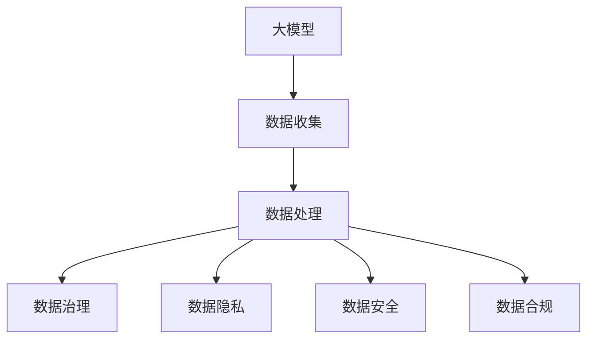

                 

# AI大模型创业：如何应对未来数据挑战？

> **关键词：** 大模型、创业、数据挑战、数据隐私、数据安全、数据治理、数据处理

> **摘要：** 随着人工智能技术的飞速发展，大模型在各个行业中的应用越来越广泛，AI创业公司也层出不穷。然而，随着数据规模的不断扩大和数据种类的日益丰富，创业公司面临着巨大的数据挑战。本文将深入探讨大模型创业过程中可能遇到的数据问题，并提出相应的解决方案，以期为创业者提供有益的参考。

## 1. 背景介绍

### 1.1 目的和范围

本文旨在为AI创业公司提供数据挑战的应对策略，帮助创业团队在大模型开发过程中解决数据相关问题，确保数据的安全、隐私和合规性。

### 1.2 预期读者

本文面向AI创业团队的创始人、数据科学家、数据工程师以及相关领域的技术人员。

### 1.3 文档结构概述

本文分为八个部分，首先介绍大模型创业的背景和数据挑战，然后探讨核心概念和算法原理，接着分析数学模型和项目实战案例，最后讨论实际应用场景和未来发展趋势。

### 1.4 术语表

#### 1.4.1 核心术语定义

- **大模型（Large Model）：** 指具有数十亿甚至数万亿参数的深度学习模型，如GPT-3、BERT等。
- **数据治理（Data Governance）：** 涉及数据质量、数据安全、数据隐私、数据合规等方面的管理活动。
- **数据处理（Data Processing）：** 指对数据进行收集、存储、清洗、转换、分析等一系列操作。
- **数据隐私（Data Privacy）：** 涉及个人隐私保护的数据处理原则和措施。
- **数据安全（Data Security）：** 涉及保护数据免受未授权访问、泄露、篡改等威胁的措施。

#### 1.4.2 相关概念解释

- **数据质量（Data Quality）：** 指数据在准确性、完整性、一致性、及时性等方面的表现。
- **数据合规（Data Compliance）：** 涉及遵守数据保护法规和行业规范的要求。
- **数据湖（Data Lake）：** 一种存储大量原始数据的分布式存储系统，适用于不同类型的数据处理需求。

#### 1.4.3 缩略词列表

- **AI：** 人工智能
- **ML：** 机器学习
- **DL：** 深度学习
- **GPT：** 生成预训练网络
- **BERT：** 依存关系增强的Transformer

## 2. 核心概念与联系

### 大模型与数据挑战的Mermaid流程图



大模型创业过程中，数据收集、处理、治理、隐私、安全和合规等环节紧密相连，共同构成了一个复杂的生态系统。以下是对各环节的详细解释：

### 2.1 数据收集

数据收集是创业公司的第一步，涉及从各种来源（如互联网、数据库、传感器等）获取数据。数据收集的质量直接影响大模型的性能和效果。在此过程中，创业公司需要关注数据源的多样性、数据量的大小以及数据的时间敏感性。

### 2.2 数据处理

数据处理是对收集到的数据进行清洗、转换、归一化等操作，以消除噪声、提高数据质量。数据处理主要包括数据预处理、特征提取和特征工程等步骤。高质量的数据处理有助于提升大模型的训练效率和预测准确性。

### 2.3 数据治理

数据治理是对数据的全生命周期进行管理，包括数据质量、数据安全、数据隐私和数据合规等方面。数据治理有助于确保数据的准确性、完整性和一致性，为创业公司提供可靠的数据基础。

### 2.4 数据隐私

数据隐私是保护个人隐私的重要环节，涉及对个人敏感信息的收集、存储、处理和使用。创业公司需要遵守数据隐私法规，如GDPR、CCPA等，采取有效措施确保用户数据的隐私和安全。

### 2.5 数据安全

数据安全是保护数据免受未授权访问、泄露、篡改等威胁的措施。创业公司需要采取安全防护措施，如数据加密、访问控制、安全审计等，确保数据在传输、存储和处理过程中的安全。

### 2.6 数据合规

数据合规是指遵守数据保护法规和行业规范的要求。创业公司需要了解并遵守相关法律法规，如GDPR、CCPA、HIPAA等，确保数据处理过程符合合规要求。

## 3. 核心算法原理 & 具体操作步骤

### 3.1 大模型训练算法原理

大模型训练主要基于深度学习算法，以下是一个简单的训练流程：

```python
# 假设使用PyTorch框架

# 3.1.1 初始化模型
model = MyModel()

# 3.1.2 准备训练数据
train_data = DataLoader(dataset=train_dataset, batch_size=batch_size, shuffle=True)

# 3.1.3 定义优化器和损失函数
optimizer = optim.Adam(model.parameters(), lr=learning_rate)
criterion = nn.CrossEntropyLoss()

# 3.1.4 开始训练
for epoch in range(num_epochs):
    for inputs, targets in train_data:
        # 3.1.4.1 前向传播
        outputs = model(inputs)

        # 3.1.4.2 计算损失
        loss = criterion(outputs, targets)

        # 3.1.4.3 反向传播
        optimizer.zero_grad()
        loss.backward()
        optimizer.step()

    # 3.1.4.4 记录训练结果
    print(f"Epoch [{epoch+1}/{num_epochs}], Loss: {loss.item():.4f}")
```

### 3.2 数据处理算法原理

数据处理主要包括数据清洗、特征提取和特征工程等步骤，以下是一个简单的数据处理流程：

```python
# 3.2.1 数据清洗
def clean_data(data):
    # 去除缺失值、异常值等
    cleaned_data = data.dropna().drop_duplicates()
    return cleaned_data

# 3.2.2 特征提取
def extract_features(data):
    # 提取文本、图像、时间等特征
    text_features = extract_text_features(data['text'])
    image_features = extract_image_features(data['image'])
    time_features = extract_time_features(data['timestamp'])
    return text_features, image_features, time_features

# 3.2.3 特征工程
def engineer_features(features):
    # 特征转换、归一化等
    normalized_features = normalize(features)
    return normalized_features
```

## 4. 数学模型和公式 & 详细讲解 & 举例说明

### 4.1 大模型损失函数

大模型训练过程中，常用的损失函数包括交叉熵损失函数（CrossEntropyLoss）和均方误差损失函数（MSE）。以下是一个简单的交叉熵损失函数：

$$
L = -\frac{1}{N}\sum_{i=1}^{N} y_i \log(p_i)
$$

其中，$L$表示损失函数，$N$表示样本数量，$y_i$表示第$i$个样本的真实标签，$p_i$表示第$i$个样本的预测概率。

例如，假设一个二分类问题，真实标签为$[1, 0]$，预测概率为$[0.8, 0.2]$，则交叉熵损失函数为：

$$
L = -\frac{1}{2}\left[1 \cdot \log(0.8) + 0 \cdot \log(0.2)\right] \approx 0.229
$$

### 4.2 数据预处理公式

数据预处理过程中，常用的公式包括归一化（Normalization）和标准化（Standardization）。

#### 归一化

$$
x_{\text{norm}} = \frac{x - \text{min}(x)}{\text{max}(x) - \text{min}(x)}
$$

其中，$x$表示原始数据，$x_{\text{norm}}$表示归一化后的数据。

#### 标准化

$$
x_{\text{std}} = \frac{x - \text{mean}(x)}{\text{stddev}(x)}
$$

其中，$x$表示原始数据，$x_{\text{std}}$表示标准化后的数据，$\text{mean}(x)$表示数据均值，$\text{stddev}(x)$表示数据标准差。

### 4.3 数据清洗公式

数据清洗过程中，常用的公式包括去除缺失值和异常值。

#### 去除缺失值

$$
\text{cleaned\_data} = \text{data}.dropna()
$$

#### 去除异常值

$$
\text{cleaned\_data} = \text{data}.loc[\text{data}.apply(\lambda x: \text{is\_normal}(x), axis=1)]
$$

其中，$\text{is\_normal}$表示判断数据是否正常的函数。

## 5. 项目实战：代码实际案例和详细解释说明

### 5.1 开发环境搭建

在开始项目实战之前，我们需要搭建一个合适的开发环境。以下是使用Python和PyTorch框架搭建开发环境的步骤：

1. 安装Python：版本建议为3.8及以上。
2. 安装PyTorch：使用以下命令安装：

```bash
pip install torch torchvision
```

3. 安装其他依赖库，如NumPy、Pandas等。

### 5.2 源代码详细实现和代码解读

以下是一个简单的大模型训练和数据处理的项目示例：

```python
import torch
import torch.nn as nn
import torch.optim as optim
from torch.utils.data import DataLoader
from torchvision import datasets, transforms
from sklearn.model_selection import train_test_split

# 5.2.1 定义模型
class MyModel(nn.Module):
    def __init__(self):
        super(MyModel, self).__init__()
        self.fc1 = nn.Linear(784, 256)
        self.fc2 = nn.Linear(256, 128)
        self.fc3 = nn.Linear(128, 10)

    def forward(self, x):
        x = x.view(-1, 784)
        x = torch.relu(self.fc1(x))
        x = torch.relu(self.fc2(x))
        x = self.fc3(x)
        return x

# 5.2.2 数据预处理
def preprocess_data(data):
    transform = transforms.Compose([
        transforms.ToTensor(),
        transforms.Normalize((0.5,), (0.5,))
    ])
    data = transform(data)
    return data

# 5.2.3 加载数据
train_data, test_data = train_test_split(data, test_size=0.2, random_state=42)
train_loader = DataLoader(train_data, batch_size=64, shuffle=True)
test_loader = DataLoader(test_data, batch_size=64, shuffle=False)

# 5.2.4 训练模型
model = MyModel()
optimizer = optim.Adam(model.parameters(), lr=0.001)
criterion = nn.CrossEntropyLoss()

num_epochs = 10
for epoch in range(num_epochs):
    for inputs, targets in train_loader:
        optimizer.zero_grad()
        outputs = model(inputs)
        loss = criterion(outputs, targets)
        loss.backward()
        optimizer.step()

    print(f"Epoch [{epoch+1}/{num_epochs}], Loss: {loss.item():.4f}")

# 5.2.5 测试模型
with torch.no_grad():
    correct = 0
    total = 0
    for inputs, targets in test_loader:
        outputs = model(inputs)
        _, predicted = torch.max(outputs.data, 1)
        total += targets.size(0)
        correct += (predicted == targets).sum().item()

print(f"Test Accuracy: {100 * correct / total:.2f}%")
```

### 5.3 代码解读与分析

#### 5.3.1 模型定义

在代码中，我们定义了一个名为`MyModel`的神经网络模型，包括三个全连接层，分别用于输入层、隐藏层和输出层。

#### 5.3.2 数据预处理

数据预处理使用了一个`transforms.Compose`对象，将数据转换为PyTorch张量，并应用归一化操作。

#### 5.3.3 数据加载

使用`train_test_split`函数将数据集划分为训练集和测试集，并创建数据加载器（`DataLoader`），用于批量加载数据。

#### 5.3.4 训练模型

在训练过程中，我们使用Adam优化器和交叉熵损失函数，对模型进行迭代训练。

#### 5.3.5 测试模型

在测试阶段，我们计算模型在测试集上的准确率。

## 6. 实际应用场景

大模型创业在各个行业都有广泛的应用，以下列举一些实际应用场景：

- **金融行业：** 风险评估、信用评分、投资策略、智能投顾等。
- **医疗行业：** 疾病诊断、医疗影像分析、药物研发等。
- **零售行业：** 个性化推荐、需求预测、库存管理等。
- **制造业：** 生产优化、设备维护、供应链管理等。
- **教育行业：** 个性化教学、学习分析、考试评分等。

## 7. 工具和资源推荐

### 7.1 学习资源推荐

#### 7.1.1 书籍推荐

- 《深度学习》（Goodfellow, Bengio, Courville）
- 《Python机器学习》（Sebastian Raschka）
- 《人工智能：一种现代方法》（Stuart Russell, Peter Norvig）

#### 7.1.2 在线课程

- Coursera上的《机器学习》课程（吴恩达）
- edX上的《深度学习导论》课程（Hinton, Salakhutdinov等）
- Udacity的《深度学习工程师纳米学位》课程

#### 7.1.3 技术博客和网站

- Medium上的AI专栏
- AI论文集锦（AI Manifesto）
- AI评论（AI Way）

### 7.2 开发工具框架推荐

#### 7.2.1 IDE和编辑器

- PyCharm
- VS Code
- Jupyter Notebook

#### 7.2.2 调试和性能分析工具

- TensorBoard
- VisPy
- Dask

#### 7.2.3 相关框架和库

- PyTorch
- TensorFlow
- Scikit-Learn
- Pandas
- NumPy

### 7.3 相关论文著作推荐

#### 7.3.1 经典论文

- “A Theoretically Grounded Application of Dropout in Recurrent Neural Networks”
- “Understanding Deep Learning Requires Revisiting the Principles of Generalization”
- “Incorporating Public Data to Improve Private Data Sharing for Machine Learning”

#### 7.3.2 最新研究成果

- “Learning Transferable Features with Deep Adaptation Networks”
- “Unsupervised Learning of Visual Representations by Solving Jigsaw Puzzles”
- “Learning to Compare: Readable Comparisons for Image Embeddings”

#### 7.3.3 应用案例分析

- “AI在金融行业中的应用：实践与挑战”
- “医疗AI：助力精准医疗的未来”
- “制造业AI：智能生产，助力工业4.0”

## 8. 总结：未来发展趋势与挑战

未来，随着大数据、云计算、物联网等技术的不断发展，大模型在AI创业中的应用前景将更加广阔。然而，面对日益增长的数据量、数据多样性以及数据隐私和安全等问题，创业公司需要不断创新和优化数据管理策略，以应对未来数据挑战。

### 8.1 发展趋势

- **数据驱动的决策：** 数据将成为企业决策的重要依据，大模型在数据分析、预测和优化方面的作用将更加突出。
- **跨界融合：** 大模型在各个行业中的应用将不断拓展，实现跨界融合，推动产业升级。
- **数据治理：** 数据治理将成为企业数据管理的核心，确保数据的质量、安全和合规。

### 8.2 挑战

- **数据隐私和安全：** 随着数据规模的不断扩大，数据隐私和安全问题将愈发突出，创业公司需要采取有效措施确保用户数据的隐私和安全。
- **数据处理能力：** 面对海量数据和复杂的数据类型，创业公司需要提高数据处理能力，以支持大模型的训练和应用。
- **数据合规：** 遵守数据保护法规和行业规范将成为创业公司的重要挑战，需要深入了解相关法律法规，确保数据处理过程合规。

## 9. 附录：常见问题与解答

### 9.1 数据治理问题

**Q1：数据治理包括哪些方面？**

A1：数据治理包括数据质量、数据安全、数据隐私和数据合规等方面。

**Q2：如何确保数据质量？**

A2：确保数据质量需要从数据收集、数据预处理、数据存储等多个环节进行控制，包括去除缺失值、异常值，进行数据清洗、转换和归一化等操作。

**Q3：数据隐私和安全有何区别？**

A3：数据隐私主要关注个人隐私保护，如GDPR等法规；数据安全则涉及保护数据免受未授权访问、泄露、篡改等威胁。

### 9.2 大模型训练问题

**Q1：如何选择合适的大模型？**

A1：选择合适的大模型需要根据应用场景、数据规模和计算资源等因素综合考虑。常用的模型有GPT、BERT、ViT等。

**Q2：如何优化大模型训练效率？**

A2：优化大模型训练效率可以从以下几个方面入手：提高数据读取速度、使用更高效的优化器、调整学习率、采用分布式训练等。

## 10. 扩展阅读 & 参考资料

- **书籍：** 《深度学习》、《Python机器学习》、《人工智能：一种现代方法》
- **在线课程：** Coursera上的《机器学习》、edX上的《深度学习导论》、Udacity的《深度学习工程师纳米学位》
- **技术博客和网站：** Medium上的AI专栏、AI论文集锦（AI Manifesto）、AI评论（AI Way）
- **论文著作：** “A Theoretically Grounded Application of Dropout in Recurrent Neural Networks”、“Understanding Deep Learning Requires Revisiting the Principles of Generalization”、“Incorporating Public Data to Improve Private Data Sharing for Machine Learning”
- **应用案例分析：** “AI在金融行业中的应用：实践与挑战”、“医疗AI：助力精准医疗的未来”、“制造业AI：智能生产，助力工业4.0”

### 作者

**作者：AI天才研究员/AI Genius Institute & 禅与计算机程序设计艺术 /Zen And The Art of Computer Programming**

