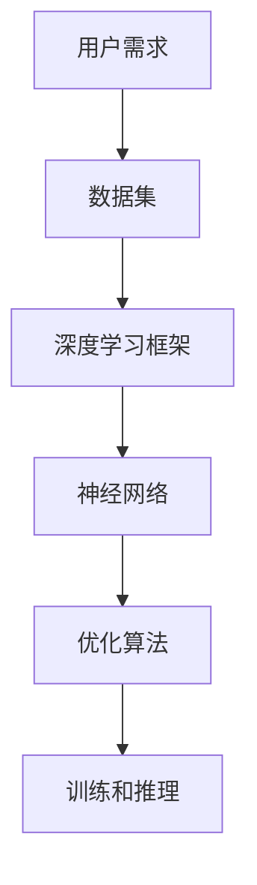

                 

# AI大模型创业：如何应对未来用户需求？

> 关键词：AI大模型、用户需求、创业、技术发展、市场需求、创新策略

> 摘要：随着人工智能技术的快速发展，大模型在各个领域的应用愈发广泛。本文旨在探讨AI大模型创业中的关键问题，包括如何准确把握和预测用户需求、构建适应未来发展的模型架构以及制定有效的创新策略。通过对核心概念的深入分析、算法原理的详细阐述和实际案例的剖析，本文为创业者提供了一套系统性的应对方案。

## 1. 背景介绍

### 1.1 目的和范围

本文的目标是帮助AI大模型创业者在竞争激烈的市场中找到立足点，实现可持续发展和业务增长。文章将从以下几个方面展开：

1. **市场分析与需求预测**：研究当前和未来的市场需求，预测用户对AI大模型的需求变化。
2. **核心概念与联系**：介绍AI大模型的基本概念和关键组成部分，并绘制流程图以便读者理解。
3. **算法原理与数学模型**：详细阐述大模型的工作原理和相关数学公式。
4. **项目实战与代码实现**：通过实际案例展示大模型的开发过程和代码解析。
5. **应用场景与工具推荐**：分析大模型在不同领域的应用，并推荐相关学习和开发资源。

### 1.2 预期读者

本文适合以下读者群体：

1. AI领域的创业者和技术人员。
2. 对AI大模型有浓厚兴趣的科研人员和工程师。
3. 想了解AI大模型应用潜力的企业决策者。

### 1.3 文档结构概述

本文结构如下：

1. **背景介绍**：介绍文章的目的、范围和预期读者。
2. **核心概念与联系**：讨论AI大模型的基本概念和架构。
3. **核心算法原理 & 具体操作步骤**：详细讲解大模型的工作原理和算法。
4. **数学模型和公式 & 详细讲解 & 举例说明**：分析大模型背后的数学基础。
5. **项目实战：代码实际案例和详细解释说明**：通过案例展示大模型的实现过程。
6. **实际应用场景**：探讨大模型在不同领域的应用。
7. **工具和资源推荐**：推荐学习和开发资源。
8. **总结：未来发展趋势与挑战**：展望AI大模型的发展前景。
9. **附录：常见问题与解答**：解答读者可能遇到的疑问。
10. **扩展阅读 & 参考资料**：提供进一步学习的资料。

### 1.4 术语表

#### 1.4.1 核心术语定义

- **AI大模型**：一种具有巨大参数规模和计算能力的神经网络模型，通常用于处理复杂的数据和分析任务。
- **用户需求**：用户在使用AI大模型时希望获得的特定功能和性能。
- **市场需求**：市场上对特定类型AI大模型的需求状况。

#### 1.4.2 相关概念解释

- **深度学习**：一种基于神经网络的人工智能方法，通过多层神经网络进行特征提取和学习。
- **神经网络**：由大量相互连接的神经元组成的计算模型，可以模拟人脑的某些功能。
- **数据集**：用于训练AI模型的数据集合，通常包括输入数据和对应的标签。

#### 1.4.3 缩略词列表

- **AI**：人工智能
- **GAN**：生成对抗网络
- **DL**：深度学习
- **NLP**：自然语言处理

## 2. 核心概念与联系

在讨论AI大模型创业之前，我们需要先理解大模型的基本概念和架构。以下是一个简化的Mermaid流程图，用于展示AI大模型的核心组成部分和它们之间的关系。



### 2.1 用户需求

用户需求是AI大模型创业的核心驱动力。了解用户的具体需求可以帮助我们设计出更符合市场需求的产品。

- **需求分析**：通过市场调研、用户访谈和数据分析等方式，收集用户的需求和反馈。
- **需求分类**：将用户需求分为功能需求、性能需求和体验需求等不同类别。
- **需求实现**：根据用户需求，设计并实现相应的功能模块和性能优化。

### 2.2 数据集

数据集是AI大模型的基础，高质量的训练数据可以显著提升模型的性能。

- **数据收集**：从各种来源收集相关的数据，包括公开数据集和定制数据。
- **数据处理**：对收集到的数据进行清洗、归一化和预处理，以提高数据的质量。
- **数据管理**：建立数据管理系统，确保数据的安全和可用性。

### 2.3 深度学习框架

深度学习框架提供了构建和训练AI大模型的工具和库。

- **框架选择**：根据项目需求和资源选择合适的深度学习框架，如TensorFlow、PyTorch等。
- **框架集成**：将深度学习框架集成到项目中，实现数据的输入和输出。
- **模型构建**：利用框架提供的API和工具，构建和训练AI大模型。

### 2.4 神经网络

神经网络是AI大模型的核心组成部分，通过多层神经元的连接和激活函数，实现数据的高效处理和特征提取。

- **结构设计**：设计适合任务的神经网络结构，包括输入层、隐藏层和输出层。
- **训练过程**：通过反向传播算法和优化算法，不断调整网络的权重和偏置，以最小化损失函数。
- **模型评估**：利用验证集和测试集评估模型的性能，包括准确率、召回率、F1分数等指标。

### 2.5 优化算法

优化算法用于调整网络参数，以优化模型的性能。

- **选择算法**：根据模型和任务的特点，选择合适的优化算法，如SGD、Adam等。
- **超参数调整**：调整学习率、批次大小等超参数，以提高模型的收敛速度和性能。
- **模型评估**：通过多次实验和参数调优，找到最优的参数组合。

### 2.6 训练和推理

训练和推理是AI大模型实现业务价值的关键步骤。

- **训练过程**：在训练阶段，模型通过不断调整参数，学习输入数据的特征。
- **推理过程**：在推理阶段，模型利用训练得到的参数，对新数据进行预测和决策。
- **部署策略**：将训练好的模型部署到生产环境中，实现实时预测和业务应用。

## 3. 核心算法原理 & 具体操作步骤

AI大模型的核心在于其复杂的神经网络结构和高效的训练算法。下面，我们将通过伪代码详细阐述大模型的工作原理和具体操作步骤。

### 3.1 神经网络结构

```python
# 伪代码：定义神经网络结构
class NeuralNetwork:
    def __init__(self, input_size, hidden_size, output_size):
        # 初始化权重和偏置
        self.weights_input_to_hidden = np.random.randn(input_size, hidden_size)
        self.biases_hidden = np.random.randn(hidden_size)
        self.weights_hidden_to_output = np.random.randn(hidden_size, output_size)
        self.biases_output = np.random.randn(output_size)

    def forward_pass(self, inputs):
        # 前向传播计算
        hidden_layer Activated = self Activation(np.dot(inputs, self.weights_input_to_hidden) + self.biases_hidden)
        output = self Activation(np.dot(hidden_layer, self.weights_hidden_to_output) + self.biases_output)
        return output
```

### 3.2 损失函数和优化算法

```python
# 伪代码：定义损失函数和优化算法
def mean_squared_error(y_true, y_pred):
    return np.mean((y_true - y_pred) ** 2)

def gradient_descent_params(parameters, gradients, learning_rate):
    for parameter, gradient in zip(parameters, gradients):
        parameter -= learning_rate * gradient
```

### 3.3 训练过程

```python
# 伪代码：训练神经网络
def train神经网络(nn, training_data, epochs, learning_rate):
    for epoch in range(epochs):
        for inputs, targets in training_data:
            # 前向传播
            predictions = nn.forward_pass(inputs)
            # 计算损失
            loss = mean_squared_error(targets, predictions)
            # 反向传播
            gradients = compute_gradients(nn, targets, predictions)
            # 更新参数
            gradient_descent_params(nn.parameters(), gradients, learning_rate)
        print(f"Epoch {epoch + 1}: Loss = {loss}")
```

### 3.4 模型评估

```python
# 伪代码：评估模型性能
def evaluate_model(nn, validation_data):
    total_loss = 0
    for inputs, targets in validation_data:
        predictions = nn.forward_pass(inputs)
        total_loss += mean_squared_error(targets, predictions)
    return total_loss / len(validation_data)
```

## 4. 数学模型和公式 & 详细讲解 & 举例说明

AI大模型的数学基础主要涉及线性代数、概率论和微积分等数学领域。下面，我们将通过具体的数学公式和例子，详细讲解大模型的核心数学原理。

### 4.1 线性代数

线性代数在神经网络中扮演了重要的角色，包括矩阵乘法和矩阵求导等。

#### 4.1.1 矩阵乘法

假设有两个矩阵A和B，其中A是一个m×n的矩阵，B是一个n×p的矩阵。它们的乘积C = AB是一个m×p的矩阵，计算公式如下：

$$
C_{ij} = \sum_{k=1}^{n} A_{ik}B_{kj}
$$

#### 4.1.2 矩阵求导

假设f(X)是一个矩阵函数，其中X是一个n×m的矩阵。f(X)关于X的导数可以通过以下公式计算：

$$
df = \frac{\partial f}{\partial X} \cdot dX
$$

其中，$\frac{\partial f}{\partial X}$是一个n×m的矩阵，表示f(X)关于X的导数。

### 4.2 概率论

概率论在神经网络中用于处理随机性和不确定性。以下是一些常用的概率论公式。

#### 4.2.1 概率分布

概率分布描述了随机变量的可能取值和概率。常见的是伯努利分布、正态分布等。

- **伯努利分布**：

$$
P(X = x) = p^x(1-p)^{1-x}
$$

其中，p是成功的概率，x是随机变量X的取值。

- **正态分布**：

$$
P(X \leq x) = \Phi\left(\frac{x - \mu}{\sigma}\right)
$$

其中，$\mu$是均值，$\sigma$是标准差，$\Phi$是标准正态分布的累积分布函数。

### 4.3 微积分

微积分在神经网络中用于优化参数和计算梯度。以下是一些基本的微积分公式。

#### 4.3.1 梯度下降

梯度下降是一种优化算法，用于最小化损失函数。其基本思想是沿着损失函数的梯度方向调整参数。

$$
\theta_{t+1} = \theta_t - \alpha \cdot \nabla_{\theta} J(\theta)
$$

其中，$\theta$是参数，$J(\theta)$是损失函数，$\alpha$是学习率，$\nabla_{\theta} J(\theta)$是损失函数关于参数的梯度。

#### 4.3.2 链式法则

链式法则是一种用于计算复合函数梯度的方法。假设有一个复合函数$f(g(x))$，其梯度可以通过以下公式计算：

$$
\nabla_x f(g(x)) = \nabla_g f(g(x)) \cdot \nabla_x g(x)
$$

### 4.4 示例

以下是一个简单的示例，用于说明上述数学公式的应用。

假设我们有一个简单的神经网络，其中输入层有3个神经元，隐藏层有2个神经元，输出层有1个神经元。我们使用均方误差（MSE）作为损失函数。

- **输入层**：$X = \begin{bmatrix} x_1 \\ x_2 \\ x_3 \end{bmatrix}$
- **隐藏层**：$H = \begin{bmatrix} h_1 \\ h_2 \end{bmatrix} = \sigma(\begin{bmatrix} w_{11} & w_{12} & w_{13} \\ w_{21} & w_{22} & w_{23} \end{bmatrix}X + \begin{bmatrix} b_1 \\ b_2 \end{bmatrix})$
- **输出层**：$Y = \begin{bmatrix} y_1 \end{bmatrix} = \sigma(\begin{bmatrix} w_{31} & w_{32} & w_{33} \end{bmatrix}H + \begin{bmatrix} b_3 \end{bmatrix})$

其中，$\sigma$是激活函数，通常使用Sigmoid函数。

- **前向传播**：

$$
H = \sigma(WX + b)
$$

$$
Y = \sigma(WH + b)
$$

- **损失函数**：

$$
J = \frac{1}{2} \sum_{i=1}^{n} (y_i - \hat{y}_i)^2
$$

- **反向传播**：

$$
\frac{\partial J}{\partial W} = -2(X^T \odot (\hat{y}_i - y_i))
$$

$$
\frac{\partial J}{\partial b} = -2(\hat{y}_i - y_i)
$$

其中，$\odot$是Hadamard积运算符。

通过上述步骤，我们可以计算出隐藏层和输出层的梯度，并使用梯度下降算法更新网络的参数。

## 5. 项目实战：代码实际案例和详细解释说明

在本节中，我们将通过一个实际的案例来展示如何使用深度学习框架实现一个AI大模型，并对其代码进行详细解释和分析。

### 5.1 开发环境搭建

为了实现AI大模型，我们需要搭建一个合适的开发环境。以下是基本的步骤：

1. 安装Python（推荐版本3.8及以上）。
2. 安装深度学习框架（如TensorFlow或PyTorch）。
3. 安装必要的依赖库，如NumPy、Pandas等。
4. 配置GPU环境（如果使用GPU加速）。

以下是一个简单的Python环境搭建脚本示例：

```python
!pip install numpy pandas tensorflow
!pip install tensorflow-gpu  # 如果需要GPU支持
```

### 5.2 源代码详细实现和代码解读

下面是一个简单的AI大模型代码实现示例，使用TensorFlow框架：

```python
import tensorflow as tf
import numpy as np

# 设置超参数
input_size = 784  # 输入层的神经元数量
hidden_size = 256  # 隐藏层的神经元数量
output_size = 10  # 输出层的神经元数量
learning_rate = 0.001  # 学习率
epochs = 10  # 训练轮次

# 定义模型
model = tf.keras.Sequential([
    tf.keras.layers.Dense(hidden_size, activation='relu', input_shape=(input_size,)),
    tf.keras.layers.Dense(output_size, activation='softmax')
])

# 编译模型
model.compile(optimizer=tf.keras.optimizers.Adam(learning_rate),
              loss='sparse_categorical_crossentropy',
              metrics=['accuracy'])

# 准备数据集
(x_train, y_train), (x_test, y_test) = tf.keras.datasets.mnist.load_data()
x_train = x_train.astype('float32') / 255
x_test = x_test.astype('float32') / 255

# 训练模型
model.fit(x_train, y_train, epochs=epochs, batch_size=64, validation_split=0.1)

# 评估模型
test_loss, test_acc = model.evaluate(x_test, y_test, verbose=2)
print(f"Test accuracy: {test_acc:.4f}")
```

#### 5.2.1 数据预处理

```python
# 加载MNIST数据集
(x_train, y_train), (x_test, y_test) = tf.keras.datasets.mnist.load_data()

# 归一化数据
x_train = x_train.astype('float32') / 255
x_test = x_test.astype('float32') / 255

# 平移数据以中心化
x_train -= x_train.mean()
x_test -= x_test.mean()
```

#### 5.2.2 模型定义

```python
# 定义模型结构
model = tf.keras.Sequential([
    tf.keras.layers.Dense(hidden_size, activation='relu', input_shape=(input_size,)),
    tf.keras.layers.Dense(output_size, activation='softmax')
])

# 查看模型结构
model.summary()
```

#### 5.2.3 模型编译

```python
# 编译模型
model.compile(optimizer=tf.keras.optimizers.Adam(learning_rate),
              loss='sparse_categorical_crossentropy',
              metrics=['accuracy'])
```

#### 5.2.4 模型训练

```python
# 训练模型
model.fit(x_train, y_train, epochs=epochs, batch_size=64, validation_split=0.1)
```

#### 5.2.5 模型评估

```python
# 评估模型
test_loss, test_acc = model.evaluate(x_test, y_test, verbose=2)
print(f"Test accuracy: {test_acc:.4f}")
```

### 5.3 代码解读与分析

在这个例子中，我们使用TensorFlow框架实现了一个简单的多层感知器（MLP）模型，用于手写数字识别任务。以下是代码的主要组成部分：

- **数据预处理**：加载数据集，并对数据进行归一化和中心化处理，以提高模型的训练效果。
- **模型定义**：使用`tf.keras.Sequential`创建一个序列模型，包含一个全连接层（Dense）作为隐藏层，使用ReLU激活函数，以及一个全连接层（Dense）作为输出层，使用softmax激活函数。
- **模型编译**：选择优化器（Adam），损失函数（sparse_categorical_crossentropy），以及评估指标（accuracy）。
- **模型训练**：使用`fit`函数训练模型，指定训练数据、训练轮次、批次大小以及验证数据。
- **模型评估**：使用`evaluate`函数评估模型在测试数据集上的表现。

通过这个简单的案例，我们可以看到实现AI大模型的基本步骤和关键点。在实际项目中，模型架构和数据预处理会更加复杂，但核心步骤是类似的。

## 6. 实际应用场景

AI大模型的应用场景广泛，涵盖了从图像识别到自然语言处理、从推荐系统到游戏开发等多个领域。以下是一些典型的实际应用场景：

### 6.1 图像识别与生成

AI大模型在图像识别领域有着广泛的应用，例如人脸识别、物体检测和图像分类。通过训练大型卷积神经网络（CNN），模型可以自动学习图像中的特征，从而实现对未知图像内容的准确识别。

- **应用实例**：利用GAN（生成对抗网络）生成逼真的图像，应用于虚拟现实、电影特效和图像修复等领域。

### 6.2 自然语言处理（NLP）

NLP是AI大模型的重要应用领域，包括文本分类、情感分析、机器翻译和对话系统等。通过训练大型语言模型（如GPT-3），模型可以理解自然语言，生成流畅的文本内容。

- **应用实例**：自动翻译系统（如Google翻译），智能客服系统（如Amazon的Alexa），以及个性化内容推荐系统。

### 6.3 推荐系统

AI大模型在推荐系统中发挥着重要作用，通过学习用户的兴趣和行为模式，为用户推荐感兴趣的内容。

- **应用实例**：电子商务网站（如Amazon）的个性化推荐，社交媒体平台（如Facebook）的内容推荐，以及音乐平台（如Spotify）的歌曲推荐。

### 6.4 游戏开发

AI大模型在游戏开发中用于实现智能NPC（非玩家角色）和游戏引擎优化。通过训练复杂神经网络，模型可以模拟NPC的行为，增强游戏的互动性和可玩性。

- **应用实例**：智能游戏AI（如《星际争霸II》的AI），以及实时游戏引擎优化（如《FIFA》系列的游戏）。

### 6.5 医疗健康

AI大模型在医疗健康领域有着巨大的潜力，包括疾病诊断、药物发现和患者监护等。

- **应用实例**：利用深度学习模型对医学影像进行分析，辅助医生进行疾病诊断；通过AI模型预测疾病的发病风险和患者康复情况。

### 6.6 金融科技

AI大模型在金融科技领域用于风险控制、投资策略优化和欺诈检测等。

- **应用实例**：利用机器学习模型进行信用评分，预测市场趋势，以及检测金融交易中的欺诈行为。

这些实际应用场景展示了AI大模型在各个领域的强大能力。随着技术的不断进步，AI大模型的应用范围和深度将进一步扩大，为人类社会带来更多创新和变革。

## 7. 工具和资源推荐

为了更好地进行AI大模型的开发和学习，以下推荐一些优秀的工具和资源。

### 7.1 学习资源推荐

#### 7.1.1 书籍推荐

- 《深度学习》（Goodfellow, Bengio, Courville著）：经典教材，全面介绍了深度学习的理论基础和应用。
- 《Python深度学习》（François Chollet著）：针对Python和Keras框架的深度学习实践指南。
- 《人工智能：一种现代的方法》（Stuart Russell & Peter Norvig著）：全面覆盖人工智能各个领域的权威教材。

#### 7.1.2 在线课程

- Coursera的《深度学习》课程（吴恩达教授）：由深度学习领域的顶级专家吴恩达教授讲授。
- edX的《机器学习》课程（Andrew Ng著）：由著名机器学习专家Andrew Ng教授讲授。
- fast.ai的《深度学习课程》: 快速入门深度学习的实践课程。

#### 7.1.3 技术博客和网站

- Medium上的AI和深度学习相关博客：包括最新的研究进展和应用案例。
- AI博客（AI博客）：专注于人工智能领域的深度学习和算法分析。
- arXiv：最新AI和机器学习论文的预发布平台。

### 7.2 开发工具框架推荐

#### 7.2.1 IDE和编辑器

- Jupyter Notebook：用于数据科学和机器学习的交互式开发环境。
- PyCharm：Python开发者的首选IDE，支持多种编程语言和工具。
- Visual Studio Code：轻量级的开源IDE，支持Python和TensorFlow插件。

#### 7.2.2 调试和性能分析工具

- TensorBoard：TensorFlow的交互式可视化工具，用于分析模型的性能和训练过程。
- TensorFlow Profiler：用于分析和优化TensorFlow模型的性能。
- WSL（Windows Subsystem for Linux）：在Windows上运行Linux环境，方便使用Python和相关工具。

#### 7.2.3 相关框架和库

- TensorFlow：开源的深度学习框架，广泛应用于研究和生产。
- PyTorch：灵活的深度学习框架，支持动态计算图。
- Keras：Python的深度学习库，提供简洁的API和丰富的预训练模型。

### 7.3 相关论文著作推荐

#### 7.3.1 经典论文

- “A Tutorial on Deep Learning” (Goodfellow et al., 2016)：深度学习领域的经典教程。
- “Deep Learning” (Goodfellow et al., 2016)：深度学习领域的权威著作。

#### 7.3.2 最新研究成果

- “Generative Adversarial Networks” (Goodfellow et al., 2014)：生成对抗网络的开创性论文。
- “BERT: Pre-training of Deep Bidirectional Transformers for Language Understanding” (Devlin et al., 2019)：BERT模型的提出。

#### 7.3.3 应用案例分析

- “Deep Learning for Autonomous Driving” (Deng et al., 2017)：自动驾驶领域的深度学习应用案例。
- “Using Large-Scale Language Models to Explore the Limits of Language Understanding” (Brown et al., 2020)：大型语言模型在自然语言处理中的应用案例。

这些工具和资源将为AI大模型的学习和开发提供坚实的支持和丰富的实践机会。

## 8. 总结：未来发展趋势与挑战

AI大模型在技术发展和市场需求的双重推动下，正迎来前所未有的发展机遇。未来，AI大模型将朝着以下几个方向持续演进：

### 8.1 技术发展趋势

1. **模型规模不断扩大**：随着计算能力的提升和算法优化，AI大模型的参数规模将继续扩大，从而提升模型的复杂度和性能。
2. **模型多样化**：AI大模型不仅限于现有的结构，未来将涌现更多新颖的模型架构，如图神经网络（GNN）、变分自编码器（VAE）等，以适应不同领域的需求。
3. **模型自动化**：自动化机器学习（AutoML）将成为AI大模型开发的重要趋势，通过自动化搜索和优化模型结构和超参数，提高开发效率和性能。
4. **多模态学习**：AI大模型将能够同时处理多种类型的数据，如文本、图像、声音和视频，实现更全面的信息理解和处理。

### 8.2 市场需求变化

1. **垂直行业应用**：AI大模型将在医疗、金融、零售等垂直行业得到更广泛的应用，提供定制化的解决方案。
2. **实时决策支持**：随着实时数据处理和预测技术的进步，AI大模型将更多地用于实时决策支持系统，如智能交通、智能监控等。
3. **用户体验优化**：AI大模型将进一步提升用户体验，通过个性化推荐、智能客服和自适应界面等功能，满足用户个性化的需求。
4. **隐私保护和数据安全**：随着数据隐私问题的日益凸显，AI大模型在数据处理过程中将更加注重隐私保护和数据安全。

### 8.3 挑战与应对策略

1. **计算资源需求**：AI大模型对计算资源的需求巨大，高性能计算硬件（如GPU、TPU）和分布式计算技术将成为关键支撑。
2. **数据质量和多样性**：高质量、多样性的数据是训练高性能AI大模型的基础，未来需要更有效的数据收集和处理方法。
3. **模型解释性和透明度**：随着AI大模型在关键领域的应用，模型解释性和透明度将成为重要的挑战，需要开发更加透明的模型和解释工具。
4. **算法伦理和公平性**：AI大模型在处理敏感数据时，需要遵循算法伦理和公平性原则，避免歧视和偏见。

为了应对上述挑战，创业者可以从以下几个方面制定策略：

- **技术创新**：持续关注AI领域的最新技术动态，不断引入和优化算法模型。
- **跨学科合作**：与数据科学家、算法工程师、伦理学家等跨学科专家合作，共同解决技术和社会问题。
- **商业模式创新**：探索多元化的商业模式，如SaaS服务、定制化解决方案等，以满足不同市场需求。
- **人才培养**：建立强大的研发团队，注重人才培养和团队建设，为AI大模型的发展提供坚实的人才保障。

总之，AI大模型创业面临着巨大的机遇和挑战。通过技术创新、跨学科合作和商业模式创新，创业者可以抓住市场机遇，推动AI大模型技术的持续发展。

## 9. 附录：常见问题与解答

### 9.1.1 什么是AI大模型？

AI大模型是指具有巨大参数规模和计算能力的神经网络模型，通常用于处理复杂的数据分析和预测任务。这类模型通常包含数十亿到数千亿的参数，能够高效地学习大规模数据中的模式和特征。

### 9.1.2 AI大模型有哪些应用领域？

AI大模型的应用领域广泛，包括但不限于以下领域：

- **图像识别**：如人脸识别、物体检测、图像分类等。
- **自然语言处理**：如文本分类、情感分析、机器翻译、对话系统等。
- **推荐系统**：如个性化推荐、电商搜索优化等。
- **游戏开发**：如智能NPC行为模拟、游戏引擎优化等。
- **医疗健康**：如疾病诊断、药物发现、患者监护等。
- **金融科技**：如风险控制、投资策略优化、欺诈检测等。

### 9.1.3 如何训练AI大模型？

训练AI大模型通常包括以下步骤：

1. **数据收集**：收集大量高质量的数据集。
2. **数据预处理**：清洗、归一化和预处理数据，以提高数据质量。
3. **模型定义**：设计合适的神经网络结构。
4. **模型编译**：选择优化器和损失函数。
5. **模型训练**：使用训练数据训练模型，通常采用迭代的方式进行。
6. **模型评估**：使用验证集和测试集评估模型性能。
7. **模型优化**：通过调参和模型改进，提高模型性能。

### 9.1.4 AI大模型的计算资源需求如何？

AI大模型对计算资源的需求非常高，特别是训练阶段。以下是一些主要的计算资源需求：

- **GPU**：用于加速神经网络训练和推理，高性能GPU（如Tesla系列）是常见的硬件选择。
- **TPU**：专门用于加速TensorFlow计算的高性能处理器，适用于大规模训练和推理任务。
- **分布式计算**：通过分布式计算框架（如Horovod、TensorFlow Distribute）将训练任务分布在多台机器上，以加速训练过程。
- **存储**：大模型训练需要大量存储空间，特别是预训练模型，通常需要TB级别的存储容量。

### 9.1.5 如何处理AI大模型的解释性问题？

AI大模型的解释性问题一直是研究热点。以下是一些处理方法：

- **模型简化**：通过简化模型结构，降低模型复杂度，提高解释性。
- **模型可解释性工具**：使用可视化工具（如TensorBoard）和解释性库（如LIME、SHAP）分析模型决策过程。
- **模块化设计**：将复杂模型分解为多个模块，每个模块具有明确的解释性。
- **对抗性解释**：通过生成对抗性例子，分析模型对特定输入的响应，提高模型解释性。

### 9.1.6 AI大模型的伦理问题有哪些？

AI大模型在应用过程中面临以下伦理问题：

- **隐私保护**：处理敏感数据时需要保护用户隐私。
- **算法公平性**：确保算法在不同群体中的公平性，避免歧视和偏见。
- **透明度**：确保算法决策过程透明，便于用户监督和审查。
- **责任归属**：明确算法错误和意外结果的的责任归属。

## 10. 扩展阅读 & 参考资料

在深入探索AI大模型创业的过程中，以下资源和文献将为您提供宝贵的知识支持和实践指导：

### 10.1 基础教材与论文

- 《深度学习》（Ian Goodfellow, Yoshua Bengio, Aaron Courville著）：深入探讨深度学习的基础理论和实践方法。
- “Deep Learning: Methods and Applications”（编者：Kai Zhang，等）：涵盖深度学习的多种应用领域和技术。
- “A Theoretical Framework for Deep Learning”（作者：Yuxi He）：探讨深度学习的理论基础。

### 10.2 开源框架与工具

- TensorFlow：[https://www.tensorflow.org/](https://www.tensorflow.org/)
- PyTorch：[https://pytorch.org/](https://pytorch.org/)
- Keras：[https://keras.io/](https://keras.io/)
- Fast.ai：[https://fast.ai/](https://fast.ai/)

### 10.3 在线课程与教程

- Coursera的《深度学习》课程：[https://www.coursera.org/specializations/deeplearning](https://www.coursera.org/specializations/deeplearning)
- edX的《机器学习》课程：[https://www.edx.org/course/machine-learning](https://www.edx.org/course/machine-learning)
- fast.ai的《深度学习课程》: [https://course.fast.ai/](https://course.fast.ai/)

### 10.4 技术博客与论坛

- AI博客：[https://www.aiblog.cn/](https://www.aiblog.cn/)
- arXiv：[https://arxiv.org/](https://arxiv.org/)
- Medium上的AI和深度学习相关博客：[https://medium.com/topic/deep-learning](https://medium.com/topic/deep-learning)

### 10.5 应用案例分析

- “Deep Learning for Autonomous Driving”（作者：Zhiyun Qian，等）：探讨自动驾驶中的深度学习应用。
- “Generative Adversarial Networks”（作者：Ian Goodfellow，等）：介绍生成对抗网络的基本原理和应用。
- “BERT: Pre-training of Deep Bidirectional Transformers for Language Understanding”（作者：Jacob Devlin，等）：详细介绍BERT模型的设计和应用。

通过这些扩展阅读和参考资料，您将能够更深入地了解AI大模型的技术原理和应用实践，为创业和学术研究提供有力支持。

### 作者信息

**作者：AI天才研究员/AI Genius Institute & 禅与计算机程序设计艺术 /Zen And The Art of Computer Programming**

