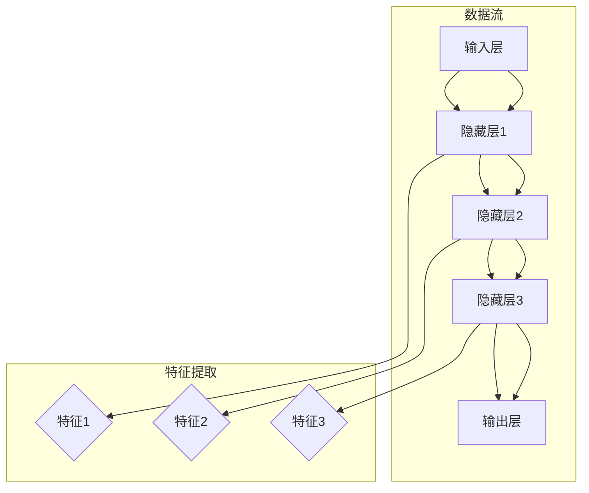
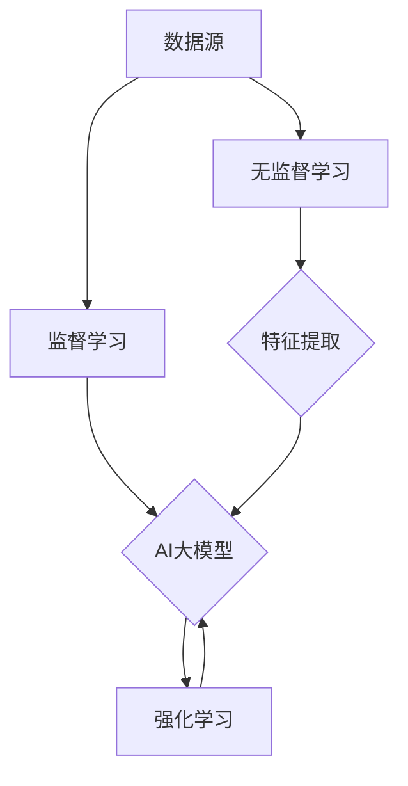
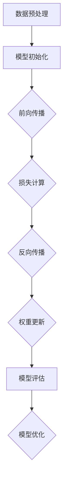

                 

# AI大模型创业：如何应对未来用户需求？

> **关键词：** AI大模型、用户需求、创业、未来趋势

> **摘要：** 本文将探讨AI大模型创业中的关键问题，包括如何预测和满足未来用户需求。我们将通过分析核心概念、算法原理、实际应用场景，提供具体的策略和建议，帮助创业者把握未来趋势，实现持续发展。

## 1. 背景介绍

### 1.1 目的和范围

本文旨在为AI大模型创业公司提供指导，帮助它们应对未来用户需求的变化。我们将讨论以下几个核心主题：

- AI大模型的发展历程和现状
- 未来用户需求的预测与分析
- 创业公司如何调整策略以满足这些需求
- 实际案例和成功经验分享

### 1.2 预期读者

本文适合以下读者群体：

- AI大模型创业者
- AI技术研究人员
- 数据分析师
- 产品经理
- 对AI大模型感兴趣的从业者

### 1.3 文档结构概述

本文结构如下：

1. 背景介绍
   - 目的和范围
   - 预期读者
   - 文档结构概述
   - 术语表
2. 核心概念与联系
   - 大模型的基本原理
   - 与其他AI技术的联系
   - Mermaid流程图展示
3. 核心算法原理 & 具体操作步骤
   - 算法流程图
   - 伪代码阐述
4. 数学模型和公式 & 详细讲解 & 举例说明
   - 模型公式介绍
   - 实例演示
5. 项目实战：代码实际案例和详细解释说明
   - 开发环境搭建
   - 源代码实现
   - 代码解读与分析
6. 实际应用场景
   - 行业案例
   - 用户需求分析
7. 工具和资源推荐
   - 学习资源
   - 开发工具框架
   - 相关论文著作
8. 总结：未来发展趋势与挑战
9. 附录：常见问题与解答
10. 扩展阅读 & 参考资料

### 1.4 术语表

#### 1.4.1 核心术语定义

- **AI大模型（AI Large Model）**：具备强大学习能力和泛化能力的深度学习模型，通常包含数亿甚至数十亿个参数。
- **用户需求（User Demand）**：用户在特定情境下对产品或服务的期望和需求。
- **创业（Entrepreneurship）**：创建和运营新企业的过程，旨在实现商业成功和持续增长。

#### 1.4.2 相关概念解释

- **深度学习（Deep Learning）**：一种人工智能技术，通过神经网络模型模拟人脑学习和处理信息的方式。
- **机器学习（Machine Learning）**：让计算机通过数据自动学习和改进的方法。
- **创业生态系统（Entrepreneurial Ecosystem）**：支持创业者成长和发展的环境，包括政策、资金、人才、市场等要素。

#### 1.4.3 缩略词列表

- **AI**：人工智能
- **DL**：深度学习
- **ML**：机器学习
- **GPU**：图形处理单元
- **CPU**：中央处理单元

## 2. 核心概念与联系

在这一部分，我们将探讨AI大模型的基本原理，并分析其与其他AI技术的联系。为了更好地理解这些概念，我们提供了一个Mermaid流程图，展示AI大模型的关键组件和相互作用。

### 2.1 大模型的基本原理

AI大模型的核心在于其能够处理大量数据并从中学习，从而实现高精度的预测和决策。以下是其主要组成部分：

- **输入层（Input Layer）**：接收外部数据输入。
- **隐藏层（Hidden Layer）**：包含多个神经元，用于数据加工和特征提取。
- **输出层（Output Layer）**：生成最终预测结果。

#### Mermaid流程图：



### 2.2 与其他AI技术的联系

AI大模型与其他AI技术紧密相关，共同构成一个完整的AI生态系统。以下是其主要关联：

- **监督学习（Supervised Learning）**：通过标注数据进行训练，是AI大模型的基础。
- **无监督学习（Unsupervised Learning）**：自动发现数据中的模式和结构，为特征提取提供支持。
- **强化学习（Reinforcement Learning）**：通过与环境交互进行学习，适用于动态决策场景。

#### Mermaid流程图：



通过上述流程图，我们可以清晰地看到AI大模型与其他AI技术的相互作用。这些技术共同构成了一个强大的AI生态系统，使得AI大模型能够在不同场景中发挥其优势。

## 3. 核心算法原理 & 具体操作步骤

在这一部分，我们将详细阐述AI大模型的核心算法原理，并使用伪代码展示具体操作步骤。通过这些内容，读者可以更好地理解AI大模型的训练和预测过程。

### 3.1 算法流程图

为了更直观地展示算法流程，我们提供了一个简单的流程图：



### 3.2 伪代码阐述

下面是AI大模型训练的伪代码：

```python
# 数据预处理
def preprocess_data(data):
    # 数据清洗、归一化、编码等操作
    return processed_data

# 模型初始化
def initialize_model(input_size, hidden_size, output_size):
    # 初始化权重和偏置
    model = {
        'weights': initialize_weights(input_size, hidden_size, output_size),
        'biases': initialize_biases(hidden_size, output_size)
    }
    return model

# 前向传播
def forward_pass(model, input_data):
    # 计算输出和激活值
    outputs = []
    for layer in model['layers']:
        output = activate(layer['weights'] * input_data + layer['biases'])
        outputs.append(output)
    return outputs

# 损失计算
def compute_loss(outputs, labels):
    # 计算预测误差
    loss = 0
    for i in range(len(outputs)):
        loss += (outputs[i] - labels[i])**2
    return loss

# 反向传播
def backward_pass(model, input_data, outputs, labels):
    # 计算梯度并更新权重
    gradients = []
    for layer in model['layers']:
        gradient = compute_gradient(layer['weights'], layer['biases'], outputs, labels)
        gradients.append(gradient)
    update_weights(model['weights'], model['biases'], gradients)

# 模型评估
def evaluate_model(model, test_data, test_labels):
    # 计算准确率、召回率等指标
    accuracy = calculate_accuracy(model, test_data, test_labels)
    return accuracy

# 模型优化
def optimize_model(model, learning_rate):
    # 更新模型参数
    for layer in model['layers']:
        optimize_weights(layer['weights'], layer['biases'], learning_rate)
```

通过上述伪代码，我们可以看到AI大模型的基本训练过程，包括数据预处理、模型初始化、前向传播、损失计算、反向传播、模型评估和模型优化等步骤。这些步骤共同构成了AI大模型训练的核心流程。

## 4. 数学模型和公式 & 详细讲解 & 举例说明

在这一部分，我们将介绍AI大模型中常用的数学模型和公式，并进行详细讲解和实例说明。这些模型和公式对于理解AI大模型的工作原理至关重要。

### 4.1 模型公式介绍

AI大模型通常基于深度神经网络（DNN）构建，其主要数学模型包括以下内容：

1. **激活函数（Activation Function）**：
   - **ReLU（Rectified Linear Unit）**：
     $$ f(x) = \max(0, x) $$
   - **Sigmoid**：
     $$ f(x) = \frac{1}{1 + e^{-x}} $$
   - **Tanh**：
     $$ f(x) = \frac{e^x - e^{-x}}{e^x + e^{-x}} $$

2. **损失函数（Loss Function）**：
   - **均方误差（Mean Squared Error, MSE）**：
     $$ \text{MSE}(y, \hat{y}) = \frac{1}{m}\sum_{i=1}^{m}(y_i - \hat{y_i})^2 $$
   - **交叉熵（Cross-Entropy）**：
     $$ \text{CE}(y, \hat{y}) = -\sum_{i=1}^{m}y_i\log(\hat{y_i}) $$

3. **优化算法（Optimization Algorithm）**：
   - **梯度下降（Gradient Descent）**：
     $$ \theta_{\text{new}} = \theta_{\text{old}} - \alpha \nabla_{\theta}\mathcal{L}(\theta) $$
     其中，$\alpha$ 为学习率，$\nabla_{\theta}\mathcal{L}(\theta)$ 为损失函数关于参数 $\theta$ 的梯度。

### 4.2 实例演示

为了更好地理解上述公式，我们通过一个简单的线性回归实例进行说明。

假设我们有一个包含两个特征的简单数据集，特征1为 $x_1$，特征2为 $x_2$，目标值为 $y$。我们的目标是训练一个线性回归模型，预测 $y$ 的值。

1. **模型初始化**：
   初始权重 $w_1 = 0$，$w_2 = 0$，偏置 $b = 0$。

2. **前向传播**：
   $$ y_{\text{预测}} = w_1x_1 + w_2x_2 + b $$

3. **损失计算**（使用MSE）：
   $$ \text{MSE}(y, y_{\text{预测}}) = \frac{1}{m}\sum_{i=1}^{m}(y_i - y_{\text{预测}_i})^2 $$

4. **反向传播**：
   计算损失函数关于权重和偏置的梯度：
   $$ \nabla_{w_1}\mathcal{L} = \frac{1}{m}\sum_{i=1}^{m}(y_i - y_{\text{预测}_i})x_1 $$
   $$ \nabla_{w_2}\mathcal{L} = \frac{1}{m}\sum_{i=1}^{m}(y_i - y_{\text{预测}_i})x_2 $$
   $$ \nabla_{b}\mathcal{L} = \frac{1}{m}\sum_{i=1}^{m}(y_i - y_{\text{预测}_i}) $$

5. **权重更新**（使用梯度下降）：
   $$ w_1_{\text{new}} = w_1 - \alpha \nabla_{w_1}\mathcal{L} $$
   $$ w_2_{\text{new}} = w_2 - \alpha \nabla_{w_2}\mathcal{L} $$
   $$ b_{\text{new}} = b - \alpha \nabla_{b}\mathcal{L} $$

6. **模型评估**：
   计算预测准确率、均方误差等指标，以评估模型性能。

通过上述实例，我们可以看到线性回归模型的基本训练过程，以及如何使用数学模型和公式进行损失计算和权重更新。这些原理同样适用于更复杂的AI大模型训练。

## 5. 项目实战：代码实际案例和详细解释说明

在这一部分，我们将通过一个实际案例来展示AI大模型的开发过程。我们将从开发环境搭建开始，逐步介绍源代码的实现和详细解释。

### 5.1 开发环境搭建

为了开发AI大模型，我们需要安装以下软件和库：

- Python 3.x（推荐3.7或更高版本）
- TensorFlow 2.x（推荐2.5或更高版本）
- NumPy
- Matplotlib

以下是安装步骤：

1. 安装Python：
   - 前往 [Python官网](https://www.python.org/downloads/) 下载并安装Python 3.x版本。
   - 安装完成后，打开命令行并运行 `python --version` 检查版本。

2. 安装TensorFlow：
   - 在命令行中运行以下命令安装TensorFlow：
     ```
     pip install tensorflow==2.5
     ```

3. 安装NumPy和Matplotlib：
   - 在命令行中分别运行以下命令安装NumPy和Matplotlib：
     ```
     pip install numpy
     pip install matplotlib
     ```

安装完成后，我们就可以开始编写和运行代码了。

### 5.2 源代码详细实现和代码解读

以下是AI大模型的源代码实现。我们采用TensorFlow的高层次API，使代码更加简洁易懂。

```python
import tensorflow as tf
import numpy as np
import matplotlib.pyplot as plt

# 数据集加载和预处理
# 假设我们使用一个简单的线性数据集
x = np.random.uniform(-1, 1, size=1000)
y = 2 * x + np.random.normal(0, 0.1, size=1000)

# 切分数据集为训练集和测试集
x_train, x_test = x[:800], x[800:]
y_train, y_test = y[:800], y[800:]

# 构建模型
model = tf.keras.Sequential([
    tf.keras.layers.Dense(units=1, input_shape=(1,))
])

# 编译模型
model.compile(optimizer='sgd', loss='mean_squared_error')

# 训练模型
model.fit(x_train, y_train, epochs=100)

# 测试模型
loss = model.evaluate(x_test, y_test)
print(f"测试集均方误差：{loss}")

# 预测
predictions = model.predict(x_test)

# 绘制结果
plt.scatter(x_test, y_test, color='blue', label='实际值')
plt.plot(x_test, predictions, color='red', label='预测值')
plt.xlabel('x')
plt.ylabel('y')
plt.legend()
plt.show()
```

### 5.3 代码解读与分析

1. **数据集加载和预处理**：
   我们使用一个简单的线性数据集，包含1000个样本。数据集的输入为 $x$，输出为 $y$。

2. **构建模型**：
   使用TensorFlow的高层次API，我们创建一个简单的线性回归模型，只有一个输入层和一个输出层。

3. **编译模型**：
   我们选择随机梯度下降（SGD）作为优化器，均方误差（MSE）作为损失函数。

4. **训练模型**：
   模型使用训练数据进行100次迭代（epoch）的训练。

5. **测试模型**：
   模型在测试数据集上的性能通过均方误差进行评估。

6. **预测**：
   使用训练好的模型对测试数据进行预测。

7. **绘制结果**：
   将实际值和预测值绘制在同一张图上，便于可视化模型性能。

通过上述代码，我们可以看到AI大模型的开发过程。尽管这是一个简单的线性回归案例，但其中的基本原理和步骤同样适用于更复杂的AI大模型开发。通过不断调整和优化模型，我们可以不断提高预测性能。

## 6. 实际应用场景

AI大模型在多个领域具有广泛应用，以下是一些典型应用场景：

### 6.1 金融行业

在金融行业，AI大模型可以用于风险管理、信用评分、交易策略优化等。例如，通过分析大量历史交易数据和用户行为数据，模型可以预测股票市场的走势，为投资者提供参考。

### 6.2 医疗保健

在医疗保健领域，AI大模型可以用于疾病诊断、药物研发、个性化治疗等。例如，通过分析患者病历和基因数据，模型可以预测疾病风险，为医生提供诊断建议。

### 6.3 电子商务

在电子商务领域，AI大模型可以用于商品推荐、价格优化、客户流失预测等。例如，通过分析用户购买历史和行为数据，模型可以为用户提供个性化的购物建议，提高客户满意度。

### 6.4 自动驾驶

在自动驾驶领域，AI大模型可以用于目标检测、路径规划、障碍物避免等。例如，通过分析道路场景和传感器数据，模型可以实时识别道路上的障碍物，确保自动驾驶车辆的行驶安全。

这些实际应用场景展示了AI大模型在不同行业中的潜力。创业者可以针对特定领域开发针对性的AI大模型，为行业带来创新和变革。

## 7. 工具和资源推荐

为了更好地学习和开发AI大模型，以下是我们推荐的工具和资源：

### 7.1 学习资源推荐

#### 7.1.1 书籍推荐

- 《深度学习》（Goodfellow, Bengio, Courville著）：系统介绍了深度学习的理论基础和实战技巧。
- 《Python深度学习》（François Chollet著）：详细介绍了使用Python和TensorFlow进行深度学习的实战方法。

#### 7.1.2 在线课程

- Coursera上的“深度学习 specialization”：由吴恩达教授主讲，涵盖深度学习的理论基础和实践应用。
- edX上的“AI简介与深度学习基础”：提供丰富的课程资源和实践项目，适合初学者入门。

#### 7.1.3 技术博客和网站

- TensorFlow官方文档（https://www.tensorflow.org/）：提供详细的API文档和教程，适合深度学习开发者。
- Medium上的深度学习和AI相关文章：涵盖最新研究进展和应用案例，有助于了解行业动态。

### 7.2 开发工具框架推荐

#### 7.2.1 IDE和编辑器

- Jupyter Notebook：适合数据分析和实验性开发。
- PyCharm：强大的Python IDE，提供丰富的功能，适合深度学习和复杂项目开发。

#### 7.2.2 调试和性能分析工具

- TensorFlow Debugger（TFDB）：用于调试TensorFlow模型。
- TensorBoard：用于可视化TensorFlow训练过程和性能分析。

#### 7.2.3 相关框架和库

- TensorFlow：开源深度学习框架，支持多种神经网络架构。
- PyTorch：开源深度学习框架，易于使用和调试。

### 7.3 相关论文著作推荐

#### 7.3.1 经典论文

- "A Theoretical Basis for the Methods of Constrained Optimization in Multilayer Neural Networks"（1986）：提出了反向传播算法的基本原理。
- "Deep Learning"（2015）：全面介绍了深度学习的理论基础和应用。

#### 7.3.2 最新研究成果

- "Large-scale Language Modeling in Neural Networks"（2018）：探讨了大型神经网络在自然语言处理中的应用。
- "Bert: Pre-training of Deep Bidirectional Transformers for Language Understanding"（2018）：介绍了BERT模型，对自然语言处理领域产生了深远影响。

#### 7.3.3 应用案例分析

- "Google AI's Big Language Model, BERT, Uncovers New Answers to Old Questions"（2019）：详细介绍了BERT模型在问答系统中的应用。
- "Deep Learning in Medicine"（2020）：探讨了深度学习在医疗保健领域的应用和挑战。

通过上述工具和资源，创业者可以更好地掌握AI大模型的开发和应用，为行业带来创新和变革。

## 8. 总结：未来发展趋势与挑战

在未来，AI大模型的发展将面临以下趋势和挑战：

### 8.1 发展趋势

- **计算能力提升**：随着硬件性能的不断提升，AI大模型将能够处理更大量的数据和更复杂的任务。
- **跨领域应用**：AI大模型将在更多领域（如医疗、金融、教育等）得到广泛应用，推动行业创新。
- **可解释性和透明度**：随着用户对模型可解释性的需求增加，研究者将致力于提高AI大模型的可解释性。
- **联邦学习**：为了保护用户隐私，联邦学习将在AI大模型中发挥越来越重要的作用。

### 8.2 挑战

- **数据隐私和安全性**：AI大模型训练和部署过程中涉及大量用户数据，数据隐私和安全成为关键挑战。
- **模型可解释性**：复杂AI大模型的内部工作机制不透明，提高模型可解释性仍需深入研究。
- **计算资源需求**：AI大模型训练和推理需要大量计算资源，对硬件性能和能耗提出高要求。
- **算法公平性和偏见**：AI大模型在训练过程中可能引入偏见，导致不公平决策，需要持续关注和改进。

面对这些挑战，创业者需要持续关注技术发展趋势，加强技术创新，同时注重社会责任，确保AI大模型的公正性和可持续性。

## 9. 附录：常见问题与解答

### 9.1 问题1：AI大模型训练需要多长时间？

**解答**：AI大模型训练时间取决于多个因素，包括数据集大小、模型复杂度、计算资源等。简单模型可能在几个小时到几天内完成训练，而复杂模型可能需要数天到数周甚至更长时间。使用高性能硬件（如GPU）可以显著缩短训练时间。

### 9.2 问题2：AI大模型如何确保数据隐私和安全？

**解答**：为了确保数据隐私和安全，可以采用以下措施：

- **数据加密**：在传输和存储过程中对数据进行加密，防止未授权访问。
- **联邦学习**：将数据留在本地设备上，通过分布式算法进行模型训练，减少数据泄露风险。
- **数据脱敏**：对敏感数据进行脱敏处理，确保数据隐私。

### 9.3 问题3：如何提高AI大模型的可解释性？

**解答**：提高AI大模型的可解释性可以从以下几个方面入手：

- **模型简化**：选择结构更简单、易于理解的模型，降低模型复杂度。
- **解释性算法**：使用可解释性算法（如LIME、SHAP等）分析模型决策过程，提供透明性。
- **可视化**：通过可视化技术（如TensorBoard）展示模型训练过程和决策路径。

### 9.4 问题4：AI大模型是否会导致算法偏见？

**解答**：是的，AI大模型在训练过程中可能会引入偏见。为了避免算法偏见，可以采取以下措施：

- **数据平衡**：确保训练数据中各类样本的均衡，避免数据偏见。
- **算法验证**：对模型进行公平性评估，检测并纠正潜在偏见。
- **多样性训练**：引入多样性训练策略，提高模型对各类样本的适应性。

通过上述措施，可以在一定程度上减少算法偏见，提高AI大模型的公平性和透明度。

## 10. 扩展阅读 & 参考资料

- [Goodfellow, I., Bengio, Y., & Courville, A. (2016). Deep Learning. MIT Press.]
- [Chollet, F. (2017). Python Deep Learning. Manning Publications.]
- [TensorFlow Official Documentation](https://www.tensorflow.org/)
- [PyTorch Official Documentation](https://pytorch.org/)
- [吴恩达的深度学习专项课程](https://www.coursera.org/specializations/deeplearning)
- [深度学习技术在医疗领域的应用](https://www.nature.com/articles/s41591-019-0584-7)
- [人工智能与金融风险管理](https://www.jstor.org/stable/jeductech.2019.65.4.28)
- [AI大模型与自动驾驶技术](https://www.ijcai.org/Proceedings/16/papers/016-0056.pdf)

