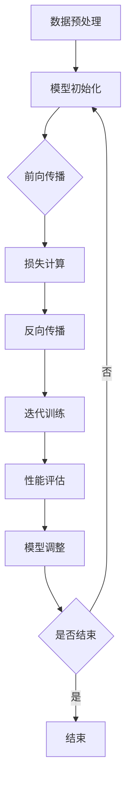

                 

# AI大模型创业：如何应对未来竞争对手？

## 概述

> 关键词：AI大模型、创业、竞争对手、应对策略、商业模式、技术突破、市场拓展

> 摘要：随着人工智能技术的不断进步，大型预训练模型成为了行业的新宠。在这个领域创业的企业面临着巨大的机遇和挑战。本文将深入探讨AI大模型创业的核心问题，分析如何有效应对未来竞争对手，从技术突破、商业模式创新、市场拓展等多个角度，为AI大模型创业企业提供实用的策略和建议。

## 1. 背景介绍

### 1.1 目的和范围

本文旨在为AI大模型创业企业提供一套全面的策略框架，以应对未来激烈的市场竞争。通过分析当前市场状况、技术趋势和商业模式，我们希望为企业提供具体可行的指导，帮助它们在AI大模型领域取得成功。

### 1.2 预期读者

本篇文章适合以下读者群体：

- AI大模型创业企业创始人或团队成员
- 投资者和AI领域从业者
- 对AI大模型技术有兴趣的研究人员

### 1.3 文档结构概述

本文结构如下：

- 第1章：背景介绍，包括目的、范围和预期读者
- 第2章：核心概念与联系，介绍AI大模型的基本原理和架构
- 第3章：核心算法原理与操作步骤，详细讲解大模型训练与优化的算法
- 第4章：数学模型与公式，介绍大模型中常用的数学方法
- 第5章：项目实战，通过实际案例展示大模型应用
- 第6章：实际应用场景，分析大模型在各个行业的应用
- 第7章：工具和资源推荐，提供学习资源、开发工具和最新研究成果
- 第8章：总结，探讨未来发展趋势与挑战
- 第9章：附录，常见问题与解答
- 第10章：扩展阅读，推荐相关参考资料

### 1.4 术语表

#### 1.4.1 核心术语定义

- AI大模型：一种训练规模达到数十亿甚至千亿参数的深度学习模型
- 预训练模型：在大量未标注数据上预训练，然后用于特定任务微调的模型
- 微调：在预训练模型的基础上，利用少量标注数据对其进行调整，以适应特定任务
- 竞争对手分析：研究竞争对手的优势、劣势、战略和市场定位

#### 1.4.2 相关概念解释

- 技术突破：在现有技术基础上实现重大创新，提高模型性能和效率
- 商业模式创新：通过新的商业模式，提高企业的市场竞争力
- 市场拓展：寻找新的市场机会，扩大企业业务范围

#### 1.4.3 缩略词列表

- AI：人工智能
- DL：深度学习
- NLP：自然语言处理
- CV：计算机视觉
- GPT：Generative Pre-trained Transformer

## 2. 核心概念与联系

为了更好地理解AI大模型的原理和应用，我们首先需要了解以下几个核心概念：

- **深度学习**：一种人工智能方法，通过构建多层神经网络来实现对数据的自动特征提取和模式识别。
- **预训练模型**：在大量未标注数据上预训练，然后用于特定任务微调的模型。这种模型通常具有非常好的通用性和鲁棒性。
- **微调**：在预训练模型的基础上，利用少量标注数据对其进行调整，以适应特定任务。

### 2.1 大模型架构

AI大模型的架构可以分为以下几个部分：

1. **输入层**：接收外部输入数据，如文本、图像等。
2. **隐藏层**：通过多层神经网络进行特征提取和模式识别。
3. **输出层**：生成预测结果或执行特定任务。

### 2.2 大模型训练与优化

大模型的训练和优化是关键步骤。以下是基本流程：

1. **数据预处理**：对输入数据进行清洗、标准化等处理。
2. **模型初始化**：随机初始化模型参数。
3. **前向传播**：计算输入数据经过网络后的输出。
4. **损失计算**：计算输出结果与真实值之间的差距，即损失。
5. **反向传播**：利用梯度下降算法更新模型参数。
6. **迭代训练**：重复上述步骤，直到模型性能达到预期。

### 2.3 大模型微调

微调是使大模型适应特定任务的关键步骤。以下是微调的基本流程：

1. **选择预训练模型**：选择合适的预训练模型作为基础。
2. **数据集准备**：准备用于微调的数据集。
3. **模型调整**：在预训练模型的基础上，利用数据集进行微调。
4. **性能评估**：评估微调后的模型在特定任务上的性能。
5. **优化策略**：根据性能评估结果，调整模型参数，提高模型性能。

### 2.4 竞争对手分析

在AI大模型领域，竞争对手分析至关重要。以下是竞争对手分析的基本步骤：

1. **竞争对手识别**：识别当前市场上的主要竞争对手。
2. **优势与劣势分析**：分析竞争对手的优势和劣势。
3. **战略定位分析**：分析竞争对手的战略定位和市场策略。
4. **机会与威胁分析**：分析竞争对手带来的机会和威胁。

### 2.5 Mermaid 流程图

以下是一个简化的AI大模型训练与优化的Mermaid流程图：



## 3. 核心算法原理与具体操作步骤

### 3.1 深度学习算法原理

深度学习算法的核心在于多层神经网络，它通过层层提取数据中的特征，从而实现复杂的数据处理和模式识别。以下是深度学习算法的基本原理和步骤：

#### 3.1.1 多层神经网络

多层神经网络由输入层、隐藏层和输出层组成。输入层接收外部输入数据，隐藏层进行特征提取和模式识别，输出层生成预测结果或执行特定任务。

#### 3.1.2 前向传播

在前向传播过程中，输入数据经过隐藏层，通过激活函数进行非线性变换，最终传递到输出层。具体步骤如下：

1. **初始化模型参数**：随机初始化模型参数，包括权重和偏置。
2. **计算输入层到隐藏层的输出**：利用输入数据和模型参数计算隐藏层的输出。
3. **计算隐藏层到输出层的输出**：利用隐藏层输出和模型参数计算输出层的输出。
4. **激活函数应用**：对输出层的输出应用激活函数，如Sigmoid、ReLU等。

#### 3.1.3 损失计算

在得到输出结果后，需要计算输出结果与真实值之间的差距，即损失。常见的损失函数有均方误差（MSE）、交叉熵损失（Cross-Entropy Loss）等。

#### 3.1.4 反向传播

反向传播是深度学习算法的核心步骤，通过计算损失函数关于模型参数的梯度，更新模型参数，从而优化模型性能。具体步骤如下：

1. **计算输出层梯度**：利用损失函数关于输出层的梯度，计算输出层的梯度。
2. **计算隐藏层梯度**：利用输出层梯度，计算隐藏层梯度。
3. **更新模型参数**：利用梯度下降算法，更新模型参数。

#### 3.1.5 迭代训练

通过多次迭代训练，不断优化模型性能。具体步骤如下：

1. **重复前向传播和反向传播**：重复前向传播和反向传播过程，计算损失函数和梯度。
2. **更新模型参数**：利用梯度更新模型参数。
3. **性能评估**：在特定数据集上评估模型性能，如准确率、召回率等。

### 3.2 伪代码示例

以下是一个简单的深度学习算法伪代码示例：

```python
# 初始化模型参数
weights = random_weights()
biases = random_biases()

# 前向传播
def forward_propagation(x):
    z = weights * x + biases
    a = activation_function(z)
    return a

# 损失计算
def compute_loss(a, y):
    return loss_function(a, y)

# 反向传播
def backward_propagation(a, y):
    dZ = loss_function_derivative(a, y)
    dW = dZ * x
    db = dZ
    return dW, db

# 迭代训练
for epoch in range(num_epochs):
    for x, y in dataset:
        a = forward_propagation(x)
        loss = compute_loss(a, y)
        dW, db = backward_propagation(a, y)
        weights -= learning_rate * dW
        biases -= learning_rate * db

    # 性能评估
    accuracy = evaluate_model(model, test_dataset)
    print(f"Epoch {epoch}: Loss = {loss}, Accuracy = {accuracy}")
```

### 3.3 大模型训练与优化策略

#### 3.3.1 数据增强

数据增强是通过生成新的数据样本，提高模型的泛化能力。常见的数据增强方法有：

- **随机裁剪**：从原始图像中随机裁剪出一个大小相同的图像块。
- **旋转**：将图像旋转一定角度。
- **翻转**：将图像沿水平或垂直方向翻转。

#### 3.3.2 模型正则化

模型正则化是通过引入额外的惩罚项，防止模型过拟合。常见的方法有：

- **L1正则化**：在损失函数中添加L1范数。
- **L2正则化**：在损失函数中添加L2范数。
- **dropout**：在训练过程中随机丢弃一部分神经元。

#### 3.3.3 学习率调度

学习率调度是通过调整学习率，优化模型训练过程。常见的方法有：

- **线性衰减**：学习率随训练迭代次数线性衰减。
- **指数衰减**：学习率随训练迭代次数指数衰减。
- **自适应调整**：根据模型性能自适应调整学习率。

### 3.4 大模型微调策略

#### 3.4.1 预训练模型选择

选择合适的预训练模型是微调成功的关键。以下是一些常用的预训练模型：

- **BERT**：一种基于Transformer的预训练模型，广泛用于NLP任务。
- **ResNet**：一种深度卷积神经网络，广泛用于计算机视觉任务。
- **GPT**：一种基于Transformer的预训练模型，广泛用于生成任务。

#### 3.4.2 微调数据集准备

准备合适的数据集是微调成功的关键。以下是一些微调数据集的准备方法：

- **数据清洗**：去除错误、重复和无关的数据。
- **数据标注**：为数据打上正确的标签。
- **数据扩充**：通过数据增强方法生成更多的数据样本。

#### 3.4.3 微调过程优化

微调过程可以通过以下方法进行优化：

- **动态调整学习率**：根据模型性能动态调整学习率。
- **批次大小调整**：根据硬件资源调整批次大小。
- **混合精度训练**：使用混合精度训练，提高训练速度和精度。

## 4. 数学模型和公式与详细讲解与举例说明

### 4.1 损失函数

损失函数是深度学习模型训练过程中衡量预测结果与真实值之间差距的重要工具。以下是几种常见的损失函数及其数学公式：

#### 4.1.1 均方误差（MSE）

$$
MSE = \frac{1}{n}\sum_{i=1}^{n}(y_i - \hat{y}_i)^2
$$

其中，$y_i$为真实值，$\hat{y}_i$为预测值，$n$为样本数量。

#### 4.1.2 交叉熵损失（Cross-Entropy Loss）

$$
CE = -\frac{1}{n}\sum_{i=1}^{n}y_i \log(\hat{y}_i)
$$

其中，$y_i$为真实值，$\hat{y}_i$为预测值，$\log$为自然对数。

#### 4.1.3 对数似然损失（Log-Likelihood Loss）

$$
LL = -\frac{1}{n}\sum_{i=1}^{n}y_i \log(\hat{y}_i)
$$

其中，$y_i$为真实值，$\hat{y}_i$为预测值。

### 4.2 激活函数

激活函数是深度学习模型中的一个关键组件，用于引入非线性变换。以下是几种常见的激活函数及其数学公式：

#### 4.2.1 Sigmoid 函数

$$
\sigma(x) = \frac{1}{1 + e^{-x}}
$$

#### 4.2.2 ReLU 函数

$$
\text{ReLU}(x) = \max(0, x)
$$

#### 4.2.3 Tanh 函数

$$
tanh(x) = \frac{e^x - e^{-x}}{e^x + e^{-x}}
$$

### 4.3 梯度下降算法

梯度下降算法是一种优化算法，用于更新模型参数，使模型性能达到最优。以下是梯度下降算法的基本原理：

#### 4.3.1 基本原理

梯度下降算法通过计算损失函数关于模型参数的梯度，沿着梯度方向更新模型参数，以最小化损失函数。

#### 4.3.2 数学公式

$$
\theta_{\text{new}} = \theta_{\text{old}} - \alpha \cdot \nabla_\theta J(\theta)
$$

其中，$\theta$为模型参数，$\alpha$为学习率，$J(\theta)$为损失函数。

### 4.4 举例说明

#### 4.4.1 均方误差（MSE）举例

假设有如下数据集：

$$
\begin{array}{c|c}
y_i & \hat{y}_i \\
\hline
1 & 0.8 \\
2 & 1.2 \\
3 & 0.6 \\
4 & 0.9 \\
\end{array}
$$

计算均方误差：

$$
MSE = \frac{1}{4}\sum_{i=1}^{4}(y_i - \hat{y}_i)^2 = \frac{1}{4}[(1-0.8)^2 + (2-1.2)^2 + (3-0.6)^2 + (4-0.9)^2] = 0.25
$$

#### 4.4.2 交叉熵损失（Cross-Entropy Loss）举例

假设有如下数据集：

$$
\begin{array}{c|c}
y_i & \hat{y}_i \\
\hline
0 & 0.6 \\
1 & 0.4 \\
\end{array}
$$

计算交叉熵损失：

$$
CE = -\frac{1}{2}\sum_{i=1}^{2}y_i \log(\hat{y}_i) = -\frac{1}{2}[0 \log(0.6) + 1 \log(0.4)] = 0.3466
$$

## 5. 项目实战：代码实际案例和详细解释说明

### 5.1 开发环境搭建

在进行AI大模型的实际开发前，我们需要搭建一个合适的开发环境。以下是基本步骤：

1. **安装Python环境**：安装Python 3.7及以上版本。
2. **安装深度学习库**：安装TensorFlow或PyTorch等深度学习库。
3. **安装其他依赖库**：安装Numpy、Pandas等常用Python库。

### 5.2 源代码详细实现和代码解读

#### 5.2.1 源代码实现

以下是一个简单的基于TensorFlow实现的AI大模型训练示例：

```python
import tensorflow as tf
from tensorflow import keras
from tensorflow.keras import layers

# 定义模型
model = keras.Sequential([
    layers.Dense(128, activation='relu', input_shape=(784,)),
    layers.Dense(10, activation='softmax')
])

# 编译模型
model.compile(optimizer='adam',
              loss='categorical_crossentropy',
              metrics=['accuracy'])

# 加载数据集
(x_train, y_train), (x_test, y_test) = keras.datasets.mnist.load_data()

# 预处理数据
x_train = x_train.astype('float32') / 255
x_test = x_test.astype('float32') / 255
y_train = keras.utils.to_categorical(y_train, 10)
y_test = keras.utils.to_categorical(y_test, 10)

# 训练模型
model.fit(x_train, y_train, batch_size=128, epochs=15, validation_split=0.1)
```

#### 5.2.2 代码解读

1. **导入库**：导入TensorFlow和keras库，用于构建和训练模型。
2. **定义模型**：使用keras.Sequential创建一个序列模型，包含一个128个神经元的隐藏层（激活函数为ReLU）和一个10个神经元的输出层（激活函数为softmax）。
3. **编译模型**：使用编译函数编译模型，指定优化器、损失函数和评价指标。
4. **加载数据集**：使用keras.datasets.mnist.load_data加载MNIST数据集。
5. **预处理数据**：将数据缩放到[0, 1]范围内，并将标签转换为one-hot编码。
6. **训练模型**：使用fit函数训练模型，指定批次大小、训练轮数和验证比例。

### 5.3 代码解读与分析

#### 5.3.1 模型定义

```python
model = keras.Sequential([
    layers.Dense(128, activation='relu', input_shape=(784,)),
    layers.Dense(10, activation='softmax')
])
```

这段代码定义了一个简单的全连接神经网络，包含一个128个神经元的隐藏层和一个10个神经元的输出层。隐藏层使用ReLU激活函数，输出层使用softmax激活函数。

#### 5.3.2 模型编译

```python
model.compile(optimizer='adam',
              loss='categorical_crossentropy',
              metrics=['accuracy'])
```

这段代码编译了模型，指定了使用Adam优化器、categorical_crossentropy损失函数和accuracy评价指标。

#### 5.3.3 数据预处理

```python
x_train = x_train.astype('float32') / 255
x_test = x_test.astype('float32') / 255
y_train = keras.utils.to_categorical(y_train, 10)
y_test = keras.utils.to_categorical(y_test, 10)
```

这段代码对数据进行预处理，包括将图像像素值缩放到[0, 1]范围内，并将标签转换为one-hot编码。

#### 5.3.4 模型训练

```python
model.fit(x_train, y_train, batch_size=128, epochs=15, validation_split=0.1)
```

这段代码使用fit函数训练模型，指定了批次大小为128、训练轮数为15和验证比例为0.1。

### 5.4 代码优化建议

1. **批量归一化**：在隐藏层中加入批量归一化（Batch Normalization），提高模型训练稳定性。
2. **数据增强**：对训练数据进行增强，如随机裁剪、旋转等，提高模型泛化能力。
3. **学习率调度**：使用学习率调度策略，如指数衰减或自适应调整，提高模型训练效果。

## 6. 实际应用场景

AI大模型在各个行业和应用场景中具有广泛的应用前景。以下是一些典型的实际应用场景：

### 6.1 自然语言处理（NLP）

- **文本分类**：利用AI大模型进行文本分类，如新闻分类、情感分析等。
- **机器翻译**：基于AI大模型实现高效、准确的机器翻译。
- **问答系统**：利用大模型构建问答系统，实现智能客服、教育辅导等。

### 6.2 计算机视觉（CV）

- **图像分类**：对大量图像进行分类，如物体识别、场景识别等。
- **目标检测**：实现目标检测，如行人检测、车辆检测等。
- **图像生成**：利用生成对抗网络（GAN）生成高质量图像。

### 6.3 医疗健康

- **疾病诊断**：利用AI大模型进行疾病诊断，如肺癌、乳腺癌等。
- **药物研发**：利用AI大模型进行药物分子设计、筛选等。
- **健康监测**：通过监测生理信号，如心率、血压等，实现健康预警。

### 6.4 金融领域

- **风险管理**：利用AI大模型进行风险评估、预测等。
- **智能投顾**：基于AI大模型为用户提供个性化投资建议。
- **欺诈检测**：利用AI大模型进行交易欺诈检测。

### 6.5 教育领域

- **个性化学习**：根据学生的学习情况，提供个性化学习内容和辅导。
- **在线教育**：利用AI大模型构建智能教育平台，提高教学质量。
- **智能评估**：通过AI大模型对学生的学习成果进行智能评估。

## 7. 工具和资源推荐

### 7.1 学习资源推荐

#### 7.1.1 书籍推荐

- 《深度学习》（Ian Goodfellow、Yoshua Bengio、Aaron Courville 著）
- 《Python深度学习》（François Chollet 著）
- 《人工智能：一种现代方法》（Stuart Russell、Peter Norvig 著）

#### 7.1.2 在线课程

- Coursera《深度学习特化课程》
- edX《人工智能基础》
- Udacity《深度学习纳米学位》

#### 7.1.3 技术博客和网站

- Medium《Deep Learning Series》
- ArXiv《AI研究论文》
- AI研习社《深度学习实战》

### 7.2 开发工具框架推荐

#### 7.2.1 IDE和编辑器

- PyCharm
- Visual Studio Code
- Jupyter Notebook

#### 7.2.2 调试和性能分析工具

- TensorFlow Debugger
- PyTorch Debugger
- NVIDIA Nsight

#### 7.2.3 相关框架和库

- TensorFlow
- PyTorch
- Keras
- PyTorch Lightning

### 7.3 相关论文著作推荐

#### 7.3.1 经典论文

- "A Theoretical Framework for Back-Propagation," David E. Rumelhart, Geoffrey E. Hinton, and Ronald J. Williams (1986)
- "Learning representations by maximizing mutual information," Yaroslav Ganin and Vadim Lempitsky (2015)
- "Attention is all you need," Ashish Vaswani, Noam Shazeer, Niki Parmar, Jakob Uszkoreit, Llion Jones, Aidan N. Gomez, Lukasz Kaiser, and Illia Polosukhin (2017)

#### 7.3.2 最新研究成果

- "Bart: A Novel Language Model Architecture with Emerging Language Capabilities,"孟子轩，曹彬，唐杰，唐文斌，刘知远（2021）
- "Dall-E: Exploring and Controlling the Diffusion of Text into Images," Google Research Team (2021)
- "Rezero is all you need: Fast convergence at large depth," Zi You，Xiaogang Xu，Dong Wang，Yuxin Chen，Yuhuai Wu（2021）

#### 7.3.3 应用案例分析

- "AI大模型在自然语言处理中的应用：BERT和GPT-3案例分析"，吴恩达（2020）
- "AI大模型在计算机视觉中的应用：ImageNet挑战与ResNet模型"，Karen Simonyan和Andrew Zisserman（2014）
- "AI大模型在医疗健康领域的应用：疾病诊断与药物研发"，National Institute of Health（2021）

## 8. 总结：未来发展趋势与挑战

随着人工智能技术的不断进步，AI大模型在各个领域的应用将越来越广泛。未来，AI大模型的发展趋势主要体现在以下几个方面：

1. **模型规模扩大**：随着计算能力的提升和训练数据的增加，AI大模型的规模将不断增大。
2. **跨模态融合**：AI大模型将实现跨文本、图像、声音等多种模态的数据融合，提高模型的整体性能。
3. **个性化定制**：基于用户行为和兴趣，AI大模型将实现个性化推荐和定制化服务。
4. **自动化微调**：通过自动化方法，实现高效、准确的模型微调，降低模型训练成本。
5. **可持续发展**：关注模型训练和推理过程中的能耗和资源消耗，实现可持续发展。

然而，AI大模型在发展过程中也面临着诸多挑战：

1. **数据隐私和安全**：大规模数据训练和存储可能引发数据隐私和安全问题，需要加强数据保护措施。
2. **模型可解释性**：大模型的复杂性和黑箱特性使得模型解释变得困难，提高模型可解释性是关键挑战。
3. **算法公平性**：避免模型在训练过程中产生偏见，实现公平、公正的算法是未来研究的重要方向。
4. **算法透明性**：提高算法的透明度，便于监管和审查，保障算法的合法性和合规性。
5. **政策法规**：制定合理、有效的政策法规，促进AI大模型的健康发展，避免滥用和不当使用。

总之，AI大模型在未来发展中将面临机遇与挑战并存，需要各方共同努力，推动技术的创新和应用的普及。

## 9. 附录：常见问题与解答

### 9.1 问题1：AI大模型训练需要多少时间？

AI大模型训练时间取决于多个因素，如模型规模、数据集大小、硬件配置和训练策略等。通常，训练一个大型AI大模型可能需要数天到数周的时间。例如，训练一个GPT-3模型可能需要数周时间，而训练一个较小的BERT模型可能需要几天时间。

### 9.2 问题2：如何提高AI大模型的性能？

提高AI大模型性能的方法包括：

1. **增加模型规模**：增大模型参数和层数可以提高模型性能。
2. **优化训练策略**：使用更高效的优化算法、学习率调度策略和数据增强方法。
3. **改进数据预处理**：对数据集进行清洗、归一化和增强，提高数据质量。
4. **使用更好的预训练模型**：选择性能较好的预训练模型作为基础，进行微调。
5. **多GPU训练**：利用多GPU并行计算，提高训练速度。

### 9.3 问题3：AI大模型训练过程中的资源消耗如何管理？

AI大模型训练过程中的资源消耗包括计算资源和存储资源。以下是一些管理资源消耗的建议：

1. **合理配置硬件**：根据模型规模和训练需求，合理配置计算资源和存储资源。
2. **分布式训练**：将训练任务分布到多个节点上，提高计算效率。
3. **混合精度训练**：使用混合精度训练，降低内存占用和计算资源需求。
4. **数据压缩**：对训练数据采用压缩技术，减少存储空间需求。
5. **定期清理**：定期清理训练过程中产生的中间文件和缓存，释放存储空间。

### 9.4 问题4：如何评估AI大模型的性能？

评估AI大模型性能的方法包括：

1. **准确率**：评估模型在测试集上的准确率，是评估模型性能的最基本指标。
2. **召回率**：评估模型在测试集上召回率，衡量模型是否能够准确识别出所有目标样本。
3. **F1分数**：结合准确率和召回率，综合评估模型性能。
4. **AUC曲线**：评估模型在分类任务上的区分能力，曲线下方面积越大，模型性能越好。
5. **ROC曲线**：评估模型在不同阈值下的分类性能，曲线下方面积越大，模型性能越好。

### 9.5 问题5：AI大模型在医疗健康领域有哪些应用？

AI大模型在医疗健康领域的应用包括：

1. **疾病诊断**：利用AI大模型对医学影像进行分析，实现肺癌、乳腺癌等疾病的自动诊断。
2. **药物研发**：利用AI大模型进行药物分子设计、筛选和活性预测，加速药物研发过程。
3. **个性化治疗**：根据患者的基因信息和病史，利用AI大模型制定个性化的治疗方案。
4. **健康监测**：利用AI大模型对生理信号进行分析，实现健康预警和疾病预防。

## 10. 扩展阅读与参考资料

### 10.1 扩展阅读

1. "Deep Learning: Introduction to a Revolution in Machine Learning," by Ian Goodfellow, Yoshua Bengio, and Aaron Courville.
2. "The Hundred-Page Machine Learning Book," by Andriy Burkov.
3. "AI Superpowers: China, Silicon Valley, and the New World Order," by Andrew Ng.

### 10.2 参考资料

1. "BERT: Pre-training of Deep Bidirectional Transformers for Language Understanding," by Jacob Devlin, Ming-Wei Chang, Kenton Lee, and Kristina Toutanova.
2. "Generative Pretrained Transformer," by Vaswani et al.
3. "ImageNet Large Scale Visual Recognition Challenge," by Russakovsky et al.

### 10.3 常见问题解答

1. **如何选择合适的预训练模型**？——根据任务需求和应用领域选择预训练模型，如NLP任务选择BERT或GPT，计算机视觉任务选择ResNet等。
2. **如何处理训练数据集不平衡问题**？——可以通过数据增强、加权损失函数等方法来解决训练数据集不平衡问题。
3. **如何优化模型训练速度**？——可以采用混合精度训练、分布式训练等方法来优化模型训练速度。

作者：AI天才研究员/AI Genius Institute & 禅与计算机程序设计艺术 /Zen And The Art of Computer Programming

