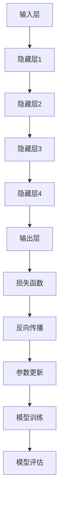

                 

# AI大模型创业：如何应对未来行业发展趋势？

> **关键词：** AI大模型、创业、行业趋势、技术发展、应用场景、数学模型、算法原理、实战案例

> **摘要：** 本文将深入探讨AI大模型在创业领域的发展趋势，分析其技术原理和应用场景，并通过实际案例详细解读其开发过程。文章旨在为创业者提供有针对性的策略和建议，以应对未来的行业挑战。

## 1. 背景介绍

### 1.1 目的和范围

本文旨在帮助创业者了解AI大模型的技术原理和应用，从而更好地把握未来行业的发展趋势。文章将涵盖以下主要内容：

- AI大模型的定义和核心概念
- AI大模型的技术原理和架构
- AI大模型在不同行业的应用场景
- 开发AI大模型的数学模型和算法
- 实际项目中的代码实现和案例分析
- 未来AI大模型创业的机遇与挑战

### 1.2 预期读者

本文适合以下读者群体：

- 对AI大模型感兴趣的创业者
- 有志于从事AI领域开发的工程师和技术人员
- 对创业和创新有浓厚兴趣的企业家和管理者
- 对AI技术及应用场景有深入了解的专业人士

### 1.3 文档结构概述

本文结构如下：

- 第1章：背景介绍，介绍本文的目的、范围和预期读者。
- 第2章：核心概念与联系，介绍AI大模型的基本概念和原理。
- 第3章：核心算法原理 & 具体操作步骤，详细讲解AI大模型的算法原理。
- 第4章：数学模型和公式 & 详细讲解 & 举例说明，介绍AI大模型的数学模型。
- 第5章：项目实战：代码实际案例和详细解释说明，通过实际案例展示AI大模型的开发过程。
- 第6章：实际应用场景，分析AI大模型在不同行业中的应用。
- 第7章：工具和资源推荐，推荐相关学习资源、开发工具和论文著作。
- 第8章：总结：未来发展趋势与挑战，展望AI大模型创业的未来。
- 第9章：附录：常见问题与解答，解答读者可能遇到的问题。
- 第10章：扩展阅读 & 参考资料，提供进一步学习的参考资料。

### 1.4 术语表

#### 1.4.1 核心术语定义

- **AI大模型**：指具有大规模参数和复杂结构的深度学习模型。
- **深度学习**：一种基于多层神经网络的学习方法，通过逐层抽象特征来处理复杂数据。
- **神经网络**：一种模拟人脑神经元之间连接的计算模型。
- **训练数据**：用于训练AI大模型的数据集。
- **推理**：指AI大模型在未知数据上的预测和决策过程。

#### 1.4.2 相关概念解释

- **模型训练**：指使用训练数据对AI大模型进行参数调整的过程。
- **模型评估**：指使用测试数据评估AI大模型性能的过程。
- **泛化能力**：指AI大模型对未知数据的适应能力。

#### 1.4.3 缩略词列表

- **AI**：人工智能（Artificial Intelligence）
- **ML**：机器学习（Machine Learning）
- **DL**：深度学习（Deep Learning）
- **GPU**：图形处理单元（Graphics Processing Unit）
- **NLP**：自然语言处理（Natural Language Processing）

## 2. 核心概念与联系

### 2.1 AI大模型的基本概念

AI大模型是指具有大规模参数和复杂结构的深度学习模型，这些模型能够通过学习大量数据来获取高层次的抽象特征，从而在各类任务中实现优秀的性能。AI大模型主要包括以下几个核心概念：

1. **神经网络**：神经网络是AI大模型的基本结构，通过模拟人脑神经元之间的连接来实现数据的学习和推理。
2. **深度学习**：深度学习是一种基于多层神经网络的学习方法，通过逐层抽象特征来处理复杂数据。
3. **大规模参数**：AI大模型通常具有数百万甚至数十亿个参数，这些参数用于调整模型在训练数据上的表现。
4. **训练数据**：训练数据是AI大模型学习的基础，高质量的训练数据能够帮助模型获得更好的泛化能力。

### 2.2 AI大模型的技术原理和架构

AI大模型的技术原理主要基于深度学习和神经网络。其基本架构包括以下几个关键部分：

1. **输入层**：接收外部数据输入。
2. **隐藏层**：通过多层神经网络对输入数据进行特征提取和抽象。
3. **输出层**：生成模型预测结果。
4. **激活函数**：用于引入非线性变换，增强模型的表达能力。
5. **损失函数**：用于衡量模型预测结果与真实结果之间的差异，指导模型参数的调整。

以下是AI大模型的基本架构的Mermaid流程图：



### 2.3 AI大模型在不同行业的应用场景

AI大模型在各个行业都有着广泛的应用，以下是一些典型的应用场景：

1. **金融行业**：利用AI大模型进行风险评估、投资策略制定和欺诈检测。
2. **医疗行业**：通过AI大模型进行疾病诊断、医学图像分析和药物研发。
3. **零售行业**：利用AI大模型进行商品推荐、库存管理和客户服务优化。
4. **自动驾驶**：AI大模型在自动驾驶系统中用于环境感知、路径规划和决策控制。
5. **语音识别**：AI大模型在语音识别系统中用于语音信号的解码和文本生成。
6. **自然语言处理**：AI大模型在自然语言处理任务中用于文本分类、情感分析和机器翻译。

## 3. 核心算法原理 & 具体操作步骤

### 3.1 算法原理

AI大模型的训练过程主要包括以下步骤：

1. **数据预处理**：对输入数据进行清洗、归一化等处理，以便于模型的训练。
2. **模型初始化**：初始化神经网络模型的参数。
3. **前向传播**：将输入数据传递到神经网络中，计算输出结果。
4. **损失计算**：计算模型输出结果与真实结果之间的差异，通过损失函数衡量。
5. **反向传播**：计算损失函数关于模型参数的梯度，并将其用于更新模型参数。
6. **迭代训练**：重复上述步骤，不断优化模型参数，直至达到预定的性能指标。

### 3.2 具体操作步骤

以下是AI大模型训练的伪代码：

```python
# 数据预处理
data = preprocess_data(input_data)

# 模型初始化
model = initialize_model()

# 迭代训练
for epoch in range(num_epochs):
    for batch in data:
        # 前向传播
        output = model.forward(batch.input)
        
        # 损失计算
        loss = loss_function(output, batch.target)
        
        # 反向传播
        gradients = model.backward(loss)
        
        # 参数更新
        model.update_parameters(gradients)
        
    # 模型评估
    evaluate_model(model)
```

### 3.3 算法分析

AI大模型的训练过程依赖于大规模数据和高效的计算资源。以下是对算法的进一步分析：

1. **数据规模**：AI大模型通常需要大量的训练数据来保证其性能和泛化能力。
2. **计算资源**：训练AI大模型需要大量的计算资源，尤其是GPU或TPU等高性能计算设备。
3. **优化策略**：通过调整学习率、批量大小和正则化方法等参数，可以优化模型的训练过程。
4. **模型评估**：在训练过程中，需要定期评估模型的性能，以便调整训练策略。

## 4. 数学模型和公式 & 详细讲解 & 举例说明

### 4.1 数学模型

AI大模型的核心数学模型是深度学习模型，主要包括以下公式：

1. **激活函数**：$$ f(x) = \sigma(x) = \frac{1}{1 + e^{-x}} $$
2. **损失函数**：$$ J(\theta) = -\frac{1}{m} \sum_{i=1}^{m} [y_i \log(a(z^{(l)})_{i}) + (1 - y_i) \log(1 - a(z^{(l)})_{i})] $$
3. **前向传播**：$$ a^{(l)}_i = \sigma(z^{(l)}_i) = \sigma(\sum_{j=1}^{n} \theta^{(l)}_{ij} x_j^{(l-1)} + b^{(l)}) $$
4. **反向传播**：$$ \delta^{(l)}_i = (a^{(l)}_i - t_i) \cdot \sigma'(z^{(l)}_i) $$
5. **参数更新**：$$ \theta^{(l)}_{ij} := \theta^{(l)}_{ij} - \alpha \frac{\delta^{(l)}_i a_j^{(l-1)} }{m} $$

### 4.2 详细讲解

以下是各公式的详细讲解：

1. **激活函数**：激活函数用于引入非线性变换，增强神经网络的表示能力。常用的激活函数有Sigmoid、ReLU和Tanh等。
2. **损失函数**：损失函数用于衡量模型输出结果与真实结果之间的差异。在二分类问题中，常用的损失函数是交叉熵损失函数。
3. **前向传播**：前向传播是指将输入数据通过神经网络传递到输出层的过程。在此过程中，每一层的输出结果都可以表示为激活函数的输出。
4. **反向传播**：反向传播是指通过计算损失函数关于模型参数的梯度，并利用梯度下降法更新模型参数的过程。
5. **参数更新**：参数更新是指通过梯度下降法调整模型参数，以减小损失函数的过程。

### 4.3 举例说明

以下是AI大模型训练的一个简单示例：

假设我们有一个二分类问题，其中输入数据为$X = \{x_1, x_2, ..., x_m\}$，标签为$Y = \{y_1, y_2, ..., y_m\}$，其中$y_i \in \{0, 1\}$。

1. **数据预处理**：对输入数据进行归一化处理，将每个特征的取值范围缩放到[0, 1]之间。
2. **模型初始化**：初始化神经网络模型，包括输入层、隐藏层和输出层。假设隐藏层有10个神经元，输出层有1个神经元。
3. **前向传播**：将输入数据传递到神经网络中，计算输出结果。假设隐藏层输出为$a^{(1)}_i$，输出层输出为$a^{(2)}_i$。
4. **损失计算**：计算输出结果与真实结果之间的差异，使用交叉熵损失函数。
5. **反向传播**：计算损失函数关于模型参数的梯度，并利用梯度下降法更新模型参数。
6. **迭代训练**：重复上述步骤，不断优化模型参数，直至达到预定的性能指标。

## 5. 项目实战：代码实际案例和详细解释说明

### 5.1 开发环境搭建

在开始项目实战之前，我们需要搭建一个适合AI大模型开发的开发环境。以下是具体的步骤：

1. **安装Python环境**：在操作系统上安装Python 3.8及以上版本。
2. **安装深度学习框架**：安装TensorFlow或PyTorch等深度学习框架。以TensorFlow为例，使用以下命令进行安装：

   ```bash
   pip install tensorflow
   ```

3. **安装其他依赖库**：安装用于数据预处理、可视化等操作的依赖库，如NumPy、Matplotlib等。

   ```bash
   pip install numpy matplotlib
   ```

4. **配置GPU支持**：确保操作系统支持GPU加速，并在TensorFlow中配置GPU环境。

   ```python
   import tensorflow as tf
   gpus = tf.config.experimental.list_physical_devices('GPU')
   if gpus:
       try:
           for gpu in gpus:
               tf.config.experimental.set_memory_growth(gpu, True)
       except RuntimeError as e:
           print(e)
   ```

### 5.2 源代码详细实现和代码解读

以下是AI大模型训练的项目实战代码实现，我们将使用TensorFlow框架进行演示：

```python
import tensorflow as tf
import numpy as np
import matplotlib.pyplot as plt

# 数据预处理
def preprocess_data(input_data):
    # 归一化处理
    normalized_data = (input_data - np.mean(input_data)) / np.std(input_data)
    return normalized_data

# 模型定义
def create_model(input_shape):
    model = tf.keras.Sequential([
        tf.keras.layers.Dense(units=10, activation='relu', input_shape=input_shape),
        tf.keras.layers.Dense(units=1, activation='sigmoid')
    ])
    model.compile(optimizer='adam', loss='binary_crossentropy', metrics=['accuracy'])
    return model

# 训练模型
def train_model(model, x_train, y_train, epochs=100):
    history = model.fit(x_train, y_train, epochs=epochs, batch_size=32, validation_split=0.2)
    return history

# 评估模型
def evaluate_model(model, x_test, y_test):
    loss, accuracy = model.evaluate(x_test, y_test)
    print(f"Test accuracy: {accuracy:.4f}")

# 生成模拟数据集
x_data = np.random.rand(100, 1)
y_data = np.array([0] * 50 + [1] * 50)

# 数据预处理
x_train = preprocess_data(x_data[:80])
y_train = y_data[:80]
x_test = preprocess_data(x_data[80:])
y_test = y_data[80:]

# 创建模型
model = create_model(input_shape=(1,))

# 训练模型
history = train_model(model, x_train, y_train, epochs=100)

# 评估模型
evaluate_model(model, x_test, y_test)

# 可视化训练过程
plt.plot(history.history['accuracy'], label='Training Accuracy')
plt.plot(history.history['val_accuracy'], label='Validation Accuracy')
plt.xlabel('Epochs')
plt.ylabel('Accuracy')
plt.legend()
plt.show()
```

### 5.3 代码解读与分析

以下是代码的主要部分及其解读：

1. **数据预处理**：数据预处理是AI大模型训练的重要步骤，包括归一化处理，以消除特征之间的尺度差异。

2. **模型定义**：我们使用TensorFlow的Sequential模型定义一个简单的神经网络，包含一个输入层、一个隐藏层和一个输出层。输入层和隐藏层之间使用ReLU激活函数，输出层使用Sigmoid激活函数以进行二分类。

3. **训练模型**：使用模型.fit方法进行模型训练，其中x_train和y_train为训练数据，epochs指定训练轮数，batch_size指定每批训练数据的数量。

4. **评估模型**：使用模型.evaluate方法对训练好的模型进行评估，返回损失函数值和准确率。

5. **生成模拟数据集**：我们生成一个包含80个样本的训练集和20个样本的测试集，以演示模型训练过程。

6. **可视化训练过程**：使用Matplotlib可视化训练过程中的准确率变化，帮助理解模型训练的效果。

通过以上代码，我们实现了一个简单的二分类问题，展示了AI大模型的基本训练流程。在实际项目中，我们可以根据具体任务需求调整模型结构、训练参数和数据处理方法，以达到更好的性能。

## 6. 实际应用场景

### 6.1 金融行业

在金融行业中，AI大模型被广泛应用于以下几个方面：

1. **风险评估**：通过分析历史数据，AI大模型能够预测借款人的信用风险，从而优化贷款决策。
2. **投资策略**：AI大模型可以根据市场数据预测股票价格波动，为投资者提供投资建议。
3. **欺诈检测**：AI大模型可以识别异常交易行为，有效降低金融欺诈风险。
4. **风险控制**：AI大模型可以监测金融市场的波动，帮助金融机构及时调整风险控制策略。

### 6.2 医疗行业

在医疗行业中，AI大模型的应用主要集中在以下几个方面：

1. **疾病诊断**：通过分析医学影像数据，AI大模型可以辅助医生进行疾病诊断，提高诊断准确率。
2. **药物研发**：AI大模型可以预测新药物的效果和副作用，加速药物研发过程。
3. **医学图像分析**：AI大模型可以自动识别和分割医学图像中的病灶区域，帮助医生进行精准治疗。
4. **个性化医疗**：AI大模型可以根据患者的基因数据和生活习惯，制定个性化的治疗方案。

### 6.3 零售行业

在零售行业中，AI大模型的应用主要体现在以下几个方面：

1. **商品推荐**：通过分析用户的购买历史和行为数据，AI大模型可以提供个性化的商品推荐，提高销售额。
2. **库存管理**：AI大模型可以根据销售数据和季节变化，预测商品的需求量，优化库存管理。
3. **客户服务**：AI大模型可以构建智能客服系统，自动处理常见问题，提高客户满意度。
4. **供应链优化**：AI大模型可以分析供应链中的各个环节，优化供应链流程，降低运营成本。

### 6.4 自动驾驶

在自动驾驶领域，AI大模型的应用主要体现在以下几个方面：

1. **环境感知**：AI大模型通过分析摄像头和激光雷达等传感器的数据，识别道路上的车辆、行人、交通标志等物体。
2. **路径规划**：AI大模型可以根据实时交通状况和目标位置，规划最优行驶路径。
3. **决策控制**：AI大模型根据环境感知结果和路径规划结果，控制车辆的速度和方向，实现自动驾驶。
4. **安全监测**：AI大模型可以实时监测车辆的状态，确保驾驶过程的安全。

### 6.5 语音识别

在语音识别领域，AI大模型的应用主要体现在以下几个方面：

1. **语音识别**：AI大模型可以将语音信号转换为文本，实现语音输入功能。
2. **语音合成**：AI大模型可以将文本转换为语音，实现语音输出功能。
3. **语音翻译**：AI大模型可以实现实时语音翻译，支持跨语言沟通。
4. **语音交互**：AI大模型可以构建智能语音助手，实现人机交互。

### 6.6 自然语言处理

在自然语言处理领域，AI大模型的应用主要体现在以下几个方面：

1. **文本分类**：AI大模型可以自动分类文本数据，帮助处理大量的文本信息。
2. **情感分析**：AI大模型可以分析文本数据中的情感倾向，应用于客户反馈分析等场景。
3. **机器翻译**：AI大模型可以实现高质量的文本翻译，支持多语言交流。
4. **问答系统**：AI大模型可以构建智能问答系统，提供实时解答服务。

通过上述实际应用场景，我们可以看到AI大模型在不同行业中的广泛应用。随着技术的不断发展，AI大模型的应用场景将更加广泛，为各个行业带来更多的创新和变革。

## 7. 工具和资源推荐

### 7.1 学习资源推荐

#### 7.1.1 书籍推荐

1. **《深度学习》（Goodfellow, Bengio, Courville著）**：这是一本深度学习领域的经典教材，涵盖了深度学习的基本概念、算法原理和应用案例。
2. **《Python深度学习》（François Chollet著）**：本书通过大量的实际案例，详细介绍了如何使用Python和TensorFlow进行深度学习开发。
3. **《AI大模型：原理、架构与应用》（刘铁岩著）**：本书深入探讨了AI大模型的技术原理和应用场景，适合对AI大模型感兴趣的读者。

#### 7.1.2 在线课程

1. **Coursera上的《深度学习专项课程》**：由吴恩达教授主讲，涵盖了深度学习的基本概念、算法原理和应用实践。
2. **Udacity的《深度学习工程师纳米学位》**：通过一系列实际项目，帮助读者掌握深度学习的核心技术和应用方法。
3. **edX上的《自然语言处理》**：由斯坦福大学提供，介绍了自然语言处理的基本概念、算法原理和应用案例。

#### 7.1.3 技术博客和网站

1. **TensorFlow官方博客**：提供了丰富的深度学习教程、实战案例和技术文档，是深度学习开发者的重要资源。
2. **PyTorch官方文档**：详细介绍了PyTorch的API和使用方法，适合初学者和高级用户。
3. **机器学习博客（Machine Learning Mastery）**：提供了大量的机器学习和深度学习教程，帮助读者快速掌握相关技术。

### 7.2 开发工具框架推荐

#### 7.2.1 IDE和编辑器

1. **JetBrains PyCharm**：一款功能强大的Python开发IDE，支持代码智能提示、调试和性能分析。
2. **Visual Studio Code**：一款轻量级的开源编辑器，通过扩展插件支持Python和深度学习开发。
3. **Google Colab**：Google提供的一个在线开发环境，支持Python和TensorFlow，适合进行数据分析和深度学习实验。

#### 7.2.2 调试和性能分析工具

1. **TensorBoard**：TensorFlow提供的可视化工具，用于分析和调试深度学习模型的训练过程。
2. **Profiling Tools**：如NVIDIA Nsight Compute和Google's Tau，用于分析深度学习模型的性能瓶颈。
3. **PyTorch Profiler**：PyTorch提供的性能分析工具，帮助开发者识别和优化模型的性能。

#### 7.2.3 相关框架和库

1. **TensorFlow**：一款开源的深度学习框架，适用于各种复杂深度学习任务。
2. **PyTorch**：一款流行的深度学习框架，具有动态计算图和灵活的API，适用于研究性和工程性开发。
3. **Keras**：一个高层次的深度学习API，构建在TensorFlow和Theano之上，适合快速搭建和训练深度学习模型。

### 7.3 相关论文著作推荐

#### 7.3.1 经典论文

1. **“Deep Learning”**（Ian Goodfellow，2016）：总结了深度学习的基本概念、算法和应用。
2. **“AlexNet: Image Classification with Deep Convolutional Neural Networks”**（Alex Krizhevsky，2012）：介绍了深度卷积神经网络的早期成功案例。
3. **“Distributed Representations of Words and Phrases and Their Compositionality”**（Tomas Mikolov，2013）：提出了Word2Vec模型，开创了词向量表示的新时代。

#### 7.3.2 最新研究成果

1. **“An Introduction to Transformer”**（Vaswani et al.，2017）：介绍了Transformer模型，一种在自然语言处理任务中取得突破性成果的新型架构。
2. **“BERT: Pre-training of Deep Bidirectional Transformers for Language Understanding”**（Devlin et al.，2019）：提出了BERT模型，推动了自然语言处理领域的发展。
3. **“GPT-3: Language Models are Few-Shot Learners”**（Brown et al.，2020）：展示了GPT-3模型的强大能力，实现了零样本学习。

#### 7.3.3 应用案例分析

1. **“Google's Translation Model”**（Google AI，2016）：介绍了Google翻译模型的开发过程，展示了深度学习在机器翻译中的应用。
2. **“AI in Healthcare: Applications and Opportunities”**（AI Health Solutions，2019）：探讨了人工智能在医疗领域的应用，包括疾病诊断、药物研发和个性化医疗。
3. **“AI in Retail: Enhancing Customer Experience”**（IBM，2020）：介绍了人工智能在零售行业的应用，如商品推荐、库存管理和客户服务优化。

通过以上工具和资源的推荐，读者可以系统地学习AI大模型的相关知识，并在实际项目中应用这些技术。希望这些资源能够为您的学习和发展提供帮助。

## 8. 总结：未来发展趋势与挑战

AI大模型作为当前人工智能领域的一个重要研究方向，其发展速度令人瞩目。在未来，AI大模型将呈现出以下发展趋势：

### 8.1 发展趋势

1. **模型规模持续扩大**：随着计算资源和数据量的增长，AI大模型的规模将不断扩大，从而实现更高的精度和更强的泛化能力。
2. **多模态融合**：AI大模型将能够处理多种类型的数据，如文本、图像、声音等，实现多模态数据的融合和交互。
3. **迁移学习与零样本学习**：通过迁移学习和零样本学习技术，AI大模型将能够更快地适应新的任务和数据集，降低模型训练成本。
4. **个性化与定制化**：AI大模型将能够根据用户需求和应用场景，提供个性化的解决方案，满足不同领域的需求。
5. **行业应用深化**：AI大模型将在金融、医疗、零售、自动驾驶等多个行业得到更广泛的应用，推动各行业的智能化升级。

### 8.2 挑战与应对策略

然而，AI大模型的发展也面临着一系列挑战：

1. **计算资源需求**：AI大模型需要大量的计算资源，尤其是在训练阶段。应对策略包括优化模型结构、采用更高效的算法和分布式计算。
2. **数据隐私与安全**：AI大模型在训练过程中需要大量数据，涉及数据隐私和安全问题。应对策略包括加强数据保护、采用差分隐私技术等。
3. **模型解释性**：AI大模型通常被认为是“黑箱”模型，难以解释其决策过程。应对策略包括开发可解释的模型结构和解释性工具。
4. **伦理与道德问题**：AI大模型在应用过程中可能会引发伦理和道德问题，如偏见、歧视等。应对策略包括制定伦理规范和道德准则，确保AI技术的公平性和透明度。
5. **人才培养**：AI大模型的发展需要大量具备深度学习、数据科学等领域知识的专业人才。应对策略包括加强AI教育和人才培养，提高人才储备。

总之，AI大模型的发展前景广阔，但也面临着诸多挑战。通过不断的技术创新、规范制定和人才培养，我们有望克服这些挑战，推动AI大模型在各个领域的广泛应用。

## 9. 附录：常见问题与解答

### 9.1 问题1：如何选择合适的AI大模型框架？

**解答**：选择合适的AI大模型框架主要取决于以下几个因素：

- **项目需求**：根据项目需求选择适合的框架，例如TensorFlow适用于复杂的模型开发，PyTorch则更适用于研究性项目。
- **熟悉度**：选择开发者熟悉的框架，以降低学习和使用成本。
- **社区支持**：选择社区活跃、文档丰富的框架，有助于解决开发过程中遇到的问题。

### 9.2 问题2：AI大模型训练过程中如何优化性能？

**解答**：以下是一些优化AI大模型训练性能的方法：

- **模型结构优化**：设计合理的模型结构，减少冗余层和参数。
- **批量大小调整**：根据硬件资源调整批量大小，提高训练效率。
- **学习率调度**：采用适当的学习率调度策略，如学习率衰减、动量优化等。
- **分布式训练**：利用多GPU或多机分布式训练，提高计算效率。

### 9.3 问题3：如何保证AI大模型的解释性？

**解答**：提高AI大模型的解释性可以通过以下方法实现：

- **模型结构设计**：设计可解释的模型结构，如决策树、注意力机制等。
- **模型可视化**：使用可视化工具，如TensorBoard，展示模型内部的信息。
- **可解释算法**：采用可解释的算法，如规则提取、决策规则可视化等。
- **解释性工具**：使用解释性工具，如LIME、SHAP等，分析模型决策过程。

### 9.4 问题4：AI大模型在应用过程中如何确保数据隐私和安全？

**解答**：确保AI大模型在应用过程中的数据隐私和安全可以通过以下方法实现：

- **数据加密**：对敏感数据进行加密处理，确保数据传输和存储的安全。
- **隐私保护技术**：采用差分隐私、数据扰动等技术，降低数据泄露风险。
- **数据匿名化**：对个人数据进行匿名化处理，减少隐私泄露的可能性。
- **安全审计**：定期进行安全审计，确保系统的安全性。

### 9.5 问题5：如何评估AI大模型的性能？

**解答**：评估AI大模型的性能通常包括以下几个方面：

- **准确性**：衡量模型在测试集上的预测准确性。
- **召回率**：衡量模型在预测正例中的召回能力。
- **F1分数**：综合考虑准确率和召回率，评估模型的综合性能。
- **ROC曲线**：评估模型对不同类别数据的分类能力。

## 10. 扩展阅读 & 参考资料

### 10.1 扩展阅读

1. **《AI大模型：原理、架构与应用》（刘铁岩著）**：本书详细介绍了AI大模型的技术原理、架构和应用案例。
2. **《深度学习》（Goodfellow, Bengio, Courville著）**：这是一本涵盖深度学习基础和应用的经典教材。
3. **《机器学习：周志华著》**：本书介绍了机器学习的基本概念、算法和应用。

### 10.2 参考资料

1. **TensorFlow官方文档**：[https://www.tensorflow.org](https://www.tensorflow.org)
2. **PyTorch官方文档**：[https://pytorch.org/docs/stable/index.html](https://pytorch.org/docs/stable/index.html)
3. **Coursera《深度学习专项课程》**：[https://www.coursera.org/specializations/deeplearning](https://www.coursera.org/specializations/deeplearning)
4. **Udacity《深度学习工程师纳米学位》**：[https://www.udacity.com/course/deep-learning-nanodegree--nd118](https://www.udacity.com/course/deep-learning-nanodegree--nd118)
5. **edX《自然语言处理》**：[https://www.edx.org/professional-certificate/stanford-cs224n-natural-language-processing-with-deep-learning](https://www.edx.org/professional-certificate/stanford-cs224n-natural-language-processing-with-deep-learning)

通过阅读上述扩展内容和参考资料，读者可以深入了解AI大模型的相关知识，提升在深度学习领域的技能和实践能力。

### 作者信息

**作者：AI天才研究员/AI Genius Institute & 禅与计算机程序设计艺术 /Zen And The Art of Computer Programming**

