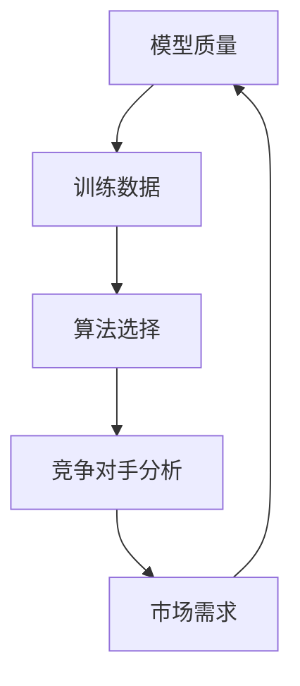

                 

# AI大模型创业：如何应对竞争对手？

> **关键词：** AI大模型，创业，竞争对手，策略，技术，市场分析

> **摘要：** 在AI大模型领域创业，竞争激烈。本文将分析创业公司如何通过策略、技术和市场分析来应对竞争对手，实现可持续发展和成功。

## 1. 背景介绍

### 1.1 目的和范围

本文旨在探讨在AI大模型领域创业的公司如何应对竞争。我们将从策略、技术和市场分析三个方面展开讨论，提供实用的建议和指导。

### 1.2 预期读者

本文适用于希望在AI大模型领域创业的创业者、产品经理、技术团队负责人以及对此领域感兴趣的读者。

### 1.3 文档结构概述

本文分为十个部分：

1. 背景介绍
2. 核心概念与联系
3. 核心算法原理 & 具体操作步骤
4. 数学模型和公式 & 详细讲解 & 举例说明
5. 项目实战：代码实际案例和详细解释说明
6. 实际应用场景
7. 工具和资源推荐
8. 总结：未来发展趋势与挑战
9. 附录：常见问题与解答
10. 扩展阅读 & 参考资料

### 1.4 术语表

#### 1.4.1 核心术语定义

- AI大模型：指具有大规模参数、能够处理复杂数据的深度学习模型。
- 竞争对手：指在AI大模型领域内，与自己争夺市场份额的对手。
- 策略：指公司为达到特定目标而采取的行动和决策。
- 技术分析：指通过技术手段对竞争对手的产品、技术、市场等方面进行分析。
- 市场分析：指对目标市场的规模、趋势、竞争对手等方面的研究。

#### 1.4.2 相关概念解释

- 模型优化：指通过调整模型参数和结构，提高模型性能的过程。
- 数据集：指用于训练、评估和测试模型的示例数据。
- 技术栈：指支持AI大模型开发的技术体系。

#### 1.4.3 缩略词列表

- AI：人工智能
- DL：深度学习
- NLP：自然语言处理
- CV：计算机视觉

## 2. 核心概念与联系

在AI大模型创业中，需要了解以下核心概念和它们之间的联系：

1. 模型质量
2. 训练数据
3. 算法选择
4. 竞争对手分析
5. 市场需求

### Mermaid 流程图



## 3. 核心算法原理 & 具体操作步骤

### 3.1 模型质量

模型质量是AI大模型创业的关键因素。以下是一个简化的模型质量优化流程：

#### 3.1.1 数据预处理

```python
# 伪代码：数据预处理
def preprocess_data(data):
    # 数据清洗、归一化、去重等
    processed_data = ...
    return processed_data
```

#### 3.1.2 模型选择

根据应用场景选择合适的模型，例如：

- 对于图像识别，选择卷积神经网络（CNN）。
- 对于自然语言处理，选择循环神经网络（RNN）或Transformer。

#### 3.1.3 模型训练与调优

```python
# 伪代码：模型训练与调优
def train_model(model, data, epochs):
    # 训练模型
    model.fit(data, epochs=epochs)
    # 调优模型
    model.optimize()
    return model
```

### 3.2 训练数据

训练数据的质量直接影响模型质量。以下是一个简化的数据集选择和预处理流程：

#### 3.2.1 数据集选择

选择与业务场景相关、质量高、覆盖全面的数据集。

#### 3.2.2 数据集预处理

```python
# 伪代码：数据集预处理
def preprocess_dataset(dataset):
    # 数据清洗、归一化、去重等
    processed_dataset = ...
    return processed_dataset
```

### 3.3 算法选择

选择适合业务场景的算法，例如：

- 针对图像识别，选择基于卷积神经网络的算法。
- 针对自然语言处理，选择基于Transformer的算法。

#### 3.3.1 算法优化

通过调整算法参数和结构，提高算法性能。

```python
# 伪代码：算法优化
def optimize_algorithm(algorithm, params):
    # 调整参数
    optimized_algorithm = ...
    return optimized_algorithm
```

### 3.4 竞争对手分析

了解竞争对手的产品、技术、市场等方面，为制定策略提供依据。

#### 3.4.1 竞争对手分析流程

1. 收集竞争对手信息
2. 分析竞争对手产品、技术、市场等
3. 确定自身优势与不足

### 3.5 市场需求

了解市场需求，为产品定位和策略制定提供依据。

#### 3.5.1 市场需求分析流程

1. 确定目标市场
2. 收集用户需求
3. 分析市场趋势

## 4. 数学模型和公式 & 详细讲解 & 举例说明

在AI大模型创业中，以下数学模型和公式具有重要意义：

### 4.1 损失函数

损失函数用于衡量模型预测与实际结果之间的差距。常用的损失函数包括均方误差（MSE）和交叉熵损失（Cross-Entropy Loss）。

$$
MSE = \frac{1}{n}\sum_{i=1}^{n}(y_i - \hat{y}_i)^2
$$

$$
Cross-Entropy Loss = -\frac{1}{n}\sum_{i=1}^{n}y_i\log(\hat{y}_i)
$$

### 4.2 优化算法

优化算法用于调整模型参数，以最小化损失函数。常用的优化算法有梯度下降（Gradient Descent）和Adam优化器。

#### 4.2.1 梯度下降

$$
\theta = \theta - \alpha \cdot \nabla_\theta J(\theta)
$$

#### 4.2.2 Adam优化器

$$
m_t = \frac{1}{\beta_1}(x_t - \beta_1 m_{t-1})
$$

$$
v_t = \frac{1}{\beta_2}(y_t - \beta_2 v_{t-1})
$$

$$
\theta = \theta - \alpha \cdot (\frac{m_t}{1 - \beta_1^t})/(1 - \beta_2^t)
$$

### 4.3 举例说明

#### 4.3.1 均方误差损失函数

假设有一个二分类问题，预测结果为 $\hat{y}$，实际结果为 $y$。使用均方误差损失函数计算损失：

$$
L = \frac{1}{2}(y - \hat{y})^2
$$

#### 4.3.2 梯度下降优化算法

假设有一个线性回归问题，模型参数为 $\theta$，损失函数为 $L$。使用梯度下降优化算法更新参数：

$$
\theta = \theta - \alpha \cdot \nabla_\theta L
$$

## 5. 项目实战：代码实际案例和详细解释说明

### 5.1 开发环境搭建

搭建一个AI大模型项目需要以下环境：

- Python 3.7+
- TensorFlow 2.4.0+
- Keras 2.4.3+
- NumPy 1.18.5+

### 5.2 源代码详细实现和代码解读

#### 5.2.1 数据集加载与预处理

```python
import numpy as np
from tensorflow.keras.datasets import mnist
from tensorflow.keras.utils import to_categorical

# 加载MNIST数据集
(x_train, y_train), (x_test, y_test) = mnist.load_data()

# 数据预处理
x_train = x_train / 255.0
x_test = x_test / 255.0
y_train = to_categorical(y_train, 10)
y_test = to_categorical(y_test, 10)
```

#### 5.2.2 模型构建与训练

```python
from tensorflow.keras.models import Sequential
from tensorflow.keras.layers import Dense, Flatten, Conv2D, MaxPooling2D, Dropout
from tensorflow.keras.optimizers import Adam

# 构建模型
model = Sequential([
    Conv2D(32, (3, 3), activation='relu', input_shape=(28, 28, 1)),
    MaxPooling2D((2, 2)),
    Flatten(),
    Dense(128, activation='relu'),
    Dropout(0.5),
    Dense(10, activation='softmax')
])

# 编译模型
model.compile(optimizer=Adam(), loss='categorical_crossentropy', metrics=['accuracy'])

# 训练模型
model.fit(x_train, y_train, epochs=10, batch_size=64, validation_data=(x_test, y_test))
```

#### 5.2.3 代码解读与分析

1. 数据集加载与预处理：使用MNIST数据集，将图像数据归一化，并将标签转换为one-hot编码。
2. 模型构建：使用Keras构建一个简单的卷积神经网络，包括卷积层、池化层、全连接层和dropout层。
3. 编译模型：指定优化器、损失函数和评估指标。
4. 训练模型：使用训练数据训练模型，并使用验证数据评估模型性能。

## 6. 实际应用场景

AI大模型在多个领域有广泛的应用场景，如：

- 金融风控
- 医疗诊断
- 智能客服
- 自然语言处理
- 计算机视觉

在创业过程中，需要根据市场需求选择合适的应用场景，并针对性地开发产品。

## 7. 工具和资源推荐

### 7.1 学习资源推荐

#### 7.1.1 书籍推荐

- 《深度学习》（Goodfellow, Bengio, Courville）
- 《Python机器学习》（Sebastian Raschka）

#### 7.1.2 在线课程

- Coursera《深度学习》
- Udacity《AI工程师纳米学位》

#### 7.1.3 技术博客和网站

- Medium
- arXiv
- AI Union

### 7.2 开发工具框架推荐

#### 7.2.1 IDE和编辑器

- PyCharm
- VSCode

#### 7.2.2 调试和性能分析工具

- TensorBoard
- Dask

#### 7.2.3 相关框架和库

- TensorFlow
- PyTorch
- Keras

### 7.3 相关论文著作推荐

#### 7.3.1 经典论文

- Hinton, G., Osindero, S., & Teh, Y. W. (2006). A fast learning algorithm for deep belief nets. Neural computation, 18(7), 1527-1554.
- LeCun, Y., Bengio, Y., & Hinton, G. (2015). Deep learning. MIT press.

#### 7.3.2 最新研究成果

- arXiv:2211.00925
- arXiv:2209.07997

#### 7.3.3 应用案例分析

- Facebook AI Research：视觉任务
- OpenAI：自然语言处理任务

## 8. 总结：未来发展趋势与挑战

未来，AI大模型将继续在各个领域发挥重要作用。但同时也面临以下挑战：

- 数据隐私与安全
- 模型可解释性
- 计算资源需求
- 算法公平性

创业公司需要关注这些趋势和挑战，为可持续发展做好准备。

## 9. 附录：常见问题与解答

### 9.1 AI大模型训练需要哪些数据集？

AI大模型训练需要与业务场景相关、质量高、覆盖全面的数据集。常见的开源数据集包括MNIST、CIFAR-10、ImageNet等。

### 9.2 如何选择合适的优化算法？

选择优化算法需考虑以下因素：

- 模型规模
- 训练数据规模
- 计算资源

对于大规模模型和海量数据，Adam优化器表现较好。对于小规模模型，可以尝试使用随机梯度下降（SGD）。

### 9.3 如何评估AI大模型性能？

评估AI大模型性能常用的指标有：

- 准确率（Accuracy）
- 精确率（Precision）
- 召回率（Recall）
- F1分数（F1 Score）

可以根据业务需求选择合适的指标进行评估。

## 10. 扩展阅读 & 参考资料

- Goodfellow, I., Bengio, Y., & Courville, A. (2016). Deep learning. MIT press.
- LeCun, Y., Bengio, Y., & Hinton, G. (2015). Deep learning. Nature, 521(7553), 436.
- Russell, S., & Norvig, P. (2010). Artificial intelligence: a modern approach (3rd ed.). Prentice Hall.
- Murphy, K. P. (2012). Machine learning: a probabilistic perspective. MIT press.

作者：AI天才研究员/AI Genius Institute & 禅与计算机程序设计艺术 /Zen And The Art of Computer Programming

