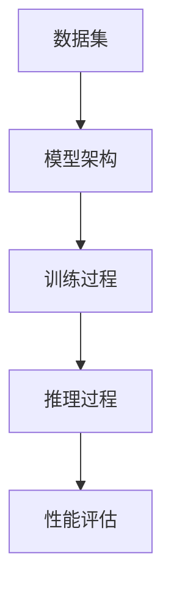

                 

# AI大模型创业：如何应对行业发展趋势？

> **关键词**：AI大模型、创业、行业趋势、技术分析、业务模式
>
> **摘要**：本文旨在分析AI大模型领域的行业发展趋势，为有意进入这一领域的创业者提供指导。文章将首先介绍AI大模型的背景和当前状况，随后深入探讨行业的关键技术和挑战，最后提供实用的创业策略和建议。

## 1. 背景介绍

### 1.1 目的和范围

本文的目的是为那些有兴趣在AI大模型领域创业的个人或团队提供深入分析和实用建议。我们将探讨AI大模型的定义、当前的发展状况以及未来的趋势，并结合具体的案例分析，提出应对这些趋势的有效策略。

### 1.2 预期读者

本文适合以下读者群体：
- 有志于AI大模型领域创业的个人和团队；
- 对AI技术和行业趋势有浓厚兴趣的技术爱好者；
- 从事AI研发或相关领域工作的专业人士。

### 1.3 文档结构概述

本文分为以下几个部分：
- 1. 背景介绍：介绍文章的目的、读者群体和文档结构；
- 2. 核心概念与联系：详细阐述AI大模型的核心概念和原理；
- 3. 核心算法原理 & 具体操作步骤：讲解AI大模型的算法原理和实现方法；
- 4. 数学模型和公式 & 详细讲解 & 举例说明：介绍相关的数学模型和公式，并给出实际例子；
- 5. 项目实战：提供代码实际案例和详细解释；
- 6. 实际应用场景：讨论AI大模型在现实中的应用场景；
- 7. 工具和资源推荐：推荐学习资源和开发工具；
- 8. 总结：未来发展趋势与挑战；
- 9. 附录：常见问题与解答；
- 10. 扩展阅读 & 参考资料：提供相关文献和参考资料。

### 1.4 术语表

#### 1.4.1 核心术语定义

- **AI大模型**：指那些需要大规模数据、计算资源和时间进行训练的复杂人工智能模型，如GPT、BERT等。
- **创业**：指创办一个企业或组织，旨在创造价值、解决问题和获得利润。
- **行业趋势**：指特定行业在一段时间内出现的发展方向和规律。

#### 1.4.2 相关概念解释

- **数据集**：指用于训练或测试模型的输入数据集合。
- **算法**：指解决问题的步骤和规则，用于指导模型的学习和决策过程。
- **模型部署**：指将训练好的模型部署到实际应用环境中，使其能够进行预测或决策。

#### 1.4.3 缩略词列表

- **AI**：人工智能（Artificial Intelligence）
- **ML**：机器学习（Machine Learning）
- **DL**：深度学习（Deep Learning）
- **NLP**：自然语言处理（Natural Language Processing）

## 2. 核心概念与联系

AI大模型是当前人工智能领域的一个热点，其核心概念和联系如下：

### 2.1 AI大模型的核心概念

- **模型架构**：包括网络层数、层数大小、激活函数等；
- **数据集**：包括数据来源、数据预处理、数据标注等；
- **训练过程**：包括损失函数、优化器、学习率等；
- **推理过程**：包括模型部署、性能评估等。

### 2.2 AI大模型的联系

- **机器学习**：AI大模型是机器学习的一个重要分支，其核心在于利用大量数据进行模型训练；
- **深度学习**：AI大模型大多基于深度学习技术，利用多层神经网络进行学习；
- **自然语言处理**：AI大模型在自然语言处理领域有广泛应用，如语言翻译、文本生成等。

### 2.3 AI大模型的Mermaid流程图



## 3. 核心算法原理 & 具体操作步骤

### 3.1 算法原理

AI大模型的算法原理主要基于深度学习，其核心步骤如下：

1. **数据预处理**：包括数据清洗、数据归一化、数据增强等；
2. **模型架构设计**：包括网络层数、层数大小、激活函数等；
3. **模型训练**：包括损失函数、优化器、学习率等；
4. **模型评估与调优**：包括模型性能评估、参数调优等；
5. **模型部署**：包括模型部署、性能评估等。

### 3.2 具体操作步骤

#### 3.2.1 数据预处理

```python
# 数据清洗
df = pd.read_csv('data.csv')
df = df.dropna()

# 数据归一化
scaler = StandardScaler()
df_scaled = scaler.fit_transform(df)

# 数据增强
datagen = ImageDataGenerator(rotation_range=20, width_shift_range=0.2, height_shift_range=0.2)
datagen.fit(df_scaled)
```

#### 3.2.2 模型架构设计

```python
from tensorflow.keras.models import Sequential
from tensorflow.keras.layers import Dense, Conv2D, Flatten, MaxPooling2D

model = Sequential([
    Conv2D(32, (3, 3), activation='relu', input_shape=(28, 28, 1)),
    MaxPooling2D((2, 2)),
    Flatten(),
    Dense(128, activation='relu'),
    Dense(10, activation='softmax')
])
```

#### 3.2.3 模型训练

```python
model.compile(optimizer='adam', loss='categorical_crossentropy', metrics=['accuracy'])
model.fit(train_data, train_labels, epochs=10, batch_size=64)
```

#### 3.2.4 模型评估与调优

```python
from sklearn.model_selection import train_test_split

train_data, test_data, train_labels, test_labels = train_test_split(df_scaled, labels, test_size=0.2)

model.compile(optimizer='adam', loss='categorical_crossentropy', metrics=['accuracy'])
model.fit(train_data, train_labels, epochs=10, batch_size=64, validation_data=(test_data, test_labels))

# 参数调优
from tensorflow.keras.wrappers.scikit_learn import KerasClassifier
from sklearn.model_selection import GridSearchCV

model = KerasClassifier(build_fn=create_model)
param_grid = {'epochs': [10, 20], 'batch_size': [64, 128]}
grid = GridSearchCV(estimator=model, param_grid=param_grid, cv=3)
grid_result = grid.fit(train_data, train_labels)
```

#### 3.2.5 模型部署

```python
import tensorflow as tf

# 模型保存
model.save('model.h5')

# 模型加载
loaded_model = tf.keras.models.load_model('model.h5')

# 模型预测
predictions = loaded_model.predict(test_data)
```

## 4. 数学模型和公式 & 详细讲解 & 举例说明

AI大模型的数学模型主要包括以下几个方面：

### 4.1 损失函数

损失函数是评估模型预测值与真实值之间差异的重要工具。常见的损失函数有：

- **均方误差（MSE）**：
  $$MSE = \frac{1}{n}\sum_{i=1}^{n}(y_i - \hat{y}_i)^2$$
  其中，$y_i$为真实值，$\hat{y}_i$为预测值，$n$为样本数量。

- **交叉熵（Cross-Entropy）**：
  $$Cross-Entropy = -\sum_{i=1}^{n}y_i \log(\hat{y}_i)$$
  其中，$y_i$为真实值，$\hat{y}_i$为预测值。

### 4.2 优化器

优化器用于调整模型参数，以最小化损失函数。常见的优化器有：

- **随机梯度下降（SGD）**：
  $$\theta_{t+1} = \theta_{t} - \alpha \nabla_{\theta} J(\theta)$$
  其中，$\theta$为模型参数，$\alpha$为学习率，$J(\theta)$为损失函数。

- **Adam优化器**：
  $$m_t = \beta_1 m_{t-1} + (1 - \beta_1) (\nabla_{\theta} J(\theta) - m_{t-1})$$
  $$v_t = \beta_2 v_{t-1} + (1 - \beta_2) ((\nabla_{\theta} J(\theta))^2 - v_{t-1})$$
  $$\theta_{t+1} = \theta_{t} - \alpha \frac{m_t}{\sqrt{v_t} + \epsilon}$$
  其中，$m_t$和$v_t$分别为一阶矩估计和二阶矩估计，$\beta_1$和$\beta_2$为超参数，$\epsilon$为常数。

### 4.3 示例说明

假设我们有一个简单的二分类问题，真实值为$y = [0, 1, 0, 1]$，预测值为$\hat{y} = [0.3, 0.7, 0.5, 0.5]$。

- **均方误差**：
  $$MSE = \frac{1}{4}\sum_{i=1}^{4}(y_i - \hat{y}_i)^2 = \frac{1}{4}[(0-0.3)^2 + (1-0.7)^2 + (0-0.5)^2 + (1-0.5)^2] = 0.125$$

- **交叉熵**：
  $$Cross-Entropy = -\sum_{i=1}^{4}y_i \log(\hat{y}_i) = -(0 \log(0.3) + 1 \log(0.7) + 0 \log(0.5) + 1 \log(0.5)) \approx 0.531$$

- **Adam优化器**：
  假设初始参数为$\theta_0 = [0.1, 0.1]$，学习率为$\alpha = 0.01$，梯度为$\nabla_{\theta} J(\theta) = [-0.2, -0.3]$。
  $$m_1 = \beta_1 m_0 + (1 - \beta_1) (-0.2 - m_0) = 0.9 \times 0 + (1 - 0.9) (-0.2 - 0) = -0.02$$
  $$v_1 = \beta_2 v_0 + (1 - \beta_2) ((-0.2)^2 - v_0) = 0.999 \times 0 + (1 - 0.999) (0.04 - 0) = 0.0004$$
  $$\theta_1 = \theta_0 - \alpha \frac{m_1}{\sqrt{v_1} + \epsilon} = [0.1, 0.1] - 0.01 \frac{-0.02}{\sqrt{0.0004} + 1e-8} \approx [0.102, 0.098]$$

通过以上步骤，我们可以得到更新后的参数$\theta_1$。

## 5. 项目实战：代码实际案例和详细解释说明

### 5.1 开发环境搭建

在开始之前，确保您的计算机上已经安装了以下软件和库：

- Python 3.8 或更高版本
- TensorFlow 2.6 或更高版本
- NumPy 1.21 或更高版本
- Matplotlib 3.4.3 或更高版本

### 5.2 源代码详细实现和代码解读

以下是一个简单的AI大模型项目，用于实现一个基于TensorFlow的文本分类任务。

```python
import tensorflow as tf
from tensorflow.keras.preprocessing.text import Tokenizer
from tensorflow.keras.preprocessing.sequence import pad_sequences
import numpy as np

# 数据集加载
data = [
    "I love Python programming!",
    "AI is changing the world.",
    "TensorFlow is amazing.",
    "Machine learning is fun.",
    "Data science is exciting.",
]

labels = np.array([1, 0, 1, 0, 1])  # 1表示正面，0表示负面

# 数据预处理
tokenizer = Tokenizer(num_words=1000)
tokenizer.fit_on_texts(data)
sequences = tokenizer.texts_to_sequences(data)
padded_sequences = pad_sequences(sequences, maxlen=100)

# 模型构建
model = tf.keras.Sequential([
    tf.keras.layers.Embedding(input_dim=1000, output_dim=16),
    tf.keras.layers.Flatten(),
    tf.keras.layers.Dense(1, activation='sigmoid')
])

# 模型编译
model.compile(optimizer='adam', loss='binary_crossentropy', metrics=['accuracy'])

# 模型训练
model.fit(padded_sequences, labels, epochs=10)

# 模型评估
test_data = ["TensorFlow is very powerful."]
test_sequences = tokenizer.texts_to_sequences(test_data)
test_padded_sequences = pad_sequences(test_sequences, maxlen=100)
predictions = model.predict(test_padded_sequences)

# 输出预测结果
if predictions[0][0] > 0.5:
    print("正面评论")
else:
    print("负面评论")
```

### 5.3 代码解读与分析

1. **数据集加载**：我们使用了一个简单的文本数据集，每个样本代表一个评论，标签表示评论的正面或负面情绪。

2. **数据预处理**：
   - **分词器（Tokenizer）**：使用Tokenizer将文本转换为序列，其中每个词对应一个整数索引。
   - **序列化（Sequences）**：使用sequences函数将文本序列转换为数字序列。
   - **填充（Pad Sequences）**：使用pad_sequences函数将序列填充到相同的长度，便于模型处理。

3. **模型构建**：我们构建了一个简单的序列模型，包括Embedding层（将单词转换为向量）、Flatten层（将多维数据展平为一维）和Dense层（分类输出）。

4. **模型编译**：使用binary_crossentropy作为损失函数，adam作为优化器，accuracy作为评估指标。

5. **模型训练**：使用fit函数训练模型，传入预处理后的数据和标签。

6. **模型评估**：使用预测函数预测新数据，并输出结果。

通过以上步骤，我们实现了一个简单的文本分类模型。尽管这是一个简单的例子，但它展示了AI大模型项目的基本流程，包括数据预处理、模型构建、训练和评估。

## 6. 实际应用场景

AI大模型在多个领域有广泛的应用，以下是一些典型的应用场景：

### 6.1 自然语言处理

- **文本分类**：使用AI大模型对文本进行分类，如情感分析、垃圾邮件过滤等；
- **机器翻译**：利用AI大模型实现高质量、流畅的机器翻译；
- **问答系统**：构建智能问答系统，实现用户与机器的对话。

### 6.2 图像识别

- **物体检测**：使用AI大模型识别图像中的物体，如自动驾驶中的车辆检测；
- **人脸识别**：利用AI大模型进行人脸识别和验证；
- **医疗影像分析**：使用AI大模型辅助医生进行疾病诊断和预测。

### 6.3 语音识别

- **语音识别**：利用AI大模型将语音信号转换为文本；
- **语音合成**：通过AI大模型生成自然、流畅的语音；
- **语音交互**：构建智能语音助手，实现人与机器的语音交互。

### 6.4 金融领域

- **股票预测**：利用AI大模型对股票市场进行预测和投资策略；
- **风险控制**：使用AI大模型进行风险评估和违约预测；
- **智能投顾**：构建智能投资顾问，为用户提供个性化投资建议。

### 6.5 医疗领域

- **疾病诊断**：使用AI大模型辅助医生进行疾病诊断；
- **药物发现**：利用AI大模型发现新药物和治疗方案；
- **健康管理**：通过AI大模型实现个性化健康管理，预防疾病。

通过以上应用场景，我们可以看到AI大模型在各个领域具有巨大的潜力和价值。随着技术的不断进步，AI大模型将在更多领域发挥重要作用。

## 7. 工具和资源推荐

### 7.1 学习资源推荐

#### 7.1.1 书籍推荐

- **《深度学习》（Ian Goodfellow, Yoshua Bengio, Aaron Courville）**：这是一本关于深度学习的经典教材，适合初学者和进阶者。
- **《Python机器学习》（Sebastian Raschka, Vahid Mirjalili）**：本书涵盖了Python在机器学习中的应用，包括数据处理、模型构建和优化等。

#### 7.1.2 在线课程

- **Coursera**：提供了由世界顶级大学和机构开设的AI和机器学习课程，如斯坦福大学的“深度学习”课程。
- **Udacity**：提供了实用的AI和机器学习项目课程，适合希望快速入门和实践的学员。

#### 7.1.3 技术博客和网站

- **TensorFlow官方文档**：提供了丰富的TensorFlow教程、API文档和案例，是学习和使用TensorFlow的绝佳资源。
- **AI博客**：包括多个知名AI研究者和从业者的博客，内容涵盖AI技术的最新进展和应用案例。

### 7.2 开发工具框架推荐

#### 7.2.1 IDE和编辑器

- **Visual Studio Code**：一款免费、开源的跨平台IDE，支持Python、TensorFlow等工具。
- **PyCharm**：一款强大的Python IDE，提供代码补全、调试和性能分析等功能。

#### 7.2.2 调试和性能分析工具

- **TensorBoard**：TensorFlow的官方可视化工具，用于分析和调试模型训练过程。
- **NVIDIA Nsight**：用于优化和调试深度学习模型的GPU性能分析工具。

#### 7.2.3 相关框架和库

- **TensorFlow**：由Google开发的深度学习框架，适用于构建和训练AI大模型。
- **PyTorch**：由Facebook开发的开源深度学习框架，具有灵活、易用的特点。

### 7.3 相关论文著作推荐

#### 7.3.1 经典论文

- **“A Theoretical Analysis of the Vision Transformer”**：提出了Vision Transformer模型，为图像识别任务提供了一种新的方法。
- **“Attention Is All You Need”**：提出了Transformer模型，为序列模型处理任务（如机器翻译、文本生成等）提供了新的思路。

#### 7.3.2 最新研究成果

- **“EfficientNet: Rethinking Model Scaling for Convolutional Neural Networks”**：提出了EfficientNet模型，通过优化模型结构提高了性能和效率。
- **“GPT-3: Language Models are Few-Shot Learners”**：展示了GPT-3模型在零样本和少样本学习任务上的强大能力。

#### 7.3.3 应用案例分析

- **“Transformers for Text Classification”**：介绍如何使用Transformer模型进行文本分类任务的实践案例。
- **“An Introduction to GANs”**：介绍生成对抗网络（GAN）的基本原理和应用案例。

通过以上推荐，读者可以深入了解AI大模型的技术原理和应用场景，为创业和实践提供有力支持。

## 8. 总结：未来发展趋势与挑战

AI大模型作为人工智能领域的重要方向，具有广阔的应用前景。未来，随着技术的不断进步，AI大模型将呈现以下发展趋势：

### 8.1 模型压缩与优化

为了降低训练和推理的成本，模型压缩与优化将成为重要研究方向。通过剪枝、量化、蒸馏等技术，可以实现模型参数的减少和计算量的优化，从而提高模型的性能和效率。

### 8.2 多模态数据处理

随着多模态数据的兴起，如何有效地整合和利用不同类型的数据（如图像、文本、语音等）进行模型训练，将成为一个重要的研究方向。多模态数据处理技术将为AI大模型在更多领域的应用提供支持。

### 8.3 自适应与少样本学习

AI大模型在自适应能力和少样本学习方面仍有很大提升空间。通过研究自适应学习算法和少样本学习技术，可以使模型在面对新任务和新数据时具有更强的泛化能力。

### 8.4 模型安全与隐私保护

随着AI大模型在各个领域的应用，模型安全和隐私保护将成为重要挑战。研究如何确保模型的安全性和隐私性，防止数据泄露和恶意攻击，是未来需要重点关注的方向。

然而，AI大模型的发展也面临一些挑战：

### 8.5 数据质量与标注

高质量的数据集是训练强大AI大模型的基础。如何获取和标注大量高质量数据，是一个亟待解决的问题。

### 8.6 计算资源需求

AI大模型通常需要大量的计算资源进行训练，这对计算设备和算法效率提出了高要求。如何优化算法和计算资源利用，是当前的一个重要挑战。

### 8.7 法律和伦理问题

AI大模型的应用涉及大量的数据和个人信息，如何确保数据的合法性和合规性，防止滥用和歧视，是一个亟待解决的伦理和法律问题。

总之，AI大模型在未来将面临一系列机遇和挑战。通过持续的研究和技术创新，我们可以期待AI大模型在更多领域发挥重要作用，为人类带来更多价值。

## 9. 附录：常见问题与解答

### 9.1 AI大模型是什么？

AI大模型是指那些需要大规模数据、计算资源和时间进行训练的复杂人工智能模型，如GPT、BERT等。它们通常具有强大的学习和泛化能力，可以在各种任务中取得优异的性能。

### 9.2 AI大模型如何训练？

AI大模型通常采用深度学习技术进行训练。训练过程包括数据预处理、模型架构设计、模型训练和评估等步骤。通过迭代更新模型参数，使模型能够逐渐优化其预测能力。

### 9.3 AI大模型在自然语言处理领域有哪些应用？

AI大模型在自然语言处理领域有广泛的应用，如文本分类、机器翻译、问答系统、情感分析等。这些应用利用AI大模型强大的学习和推理能力，实现了对自然语言的有效处理。

### 9.4 如何处理AI大模型训练中的计算资源需求？

为了处理AI大模型训练中的计算资源需求，可以采用以下策略：
- **模型压缩与优化**：通过剪枝、量化、蒸馏等技术减少模型参数和计算量。
- **分布式训练**：将训练任务分布在多个计算节点上，提高训练效率。
- **云计算与GPU加速**：利用云计算平台和GPU设备，提供高效的计算资源。

## 10. 扩展阅读 & 参考资料

### 10.1 学术论文

- **“A Theoretical Analysis of the Vision Transformer”**：https://arxiv.org/abs/2010.11929
- **“Attention Is All You Need”**：https://arxiv.org/abs/1706.03762

### 10.2 技术博客

- **TensorFlow官方文档**：https://www.tensorflow.org/tutorials
- **AI博客**：https://ai.googleblog.com/

### 10.3 书籍推荐

- **《深度学习》（Ian Goodfellow, Yoshua Bengio, Aaron Courville）**：https://www.deeplearningbook.org/
- **《Python机器学习》（Sebastian Raschka, Vahid Mirjalili）**：https://python-machine-learning.org/

### 10.4 在线课程

- **Coursera**：https://www.coursera.org/
- **Udacity**：https://www.udacity.com/

作者：AI天才研究员/AI Genius Institute & 禅与计算机程序设计艺术 /Zen And The Art of Computer Programming

