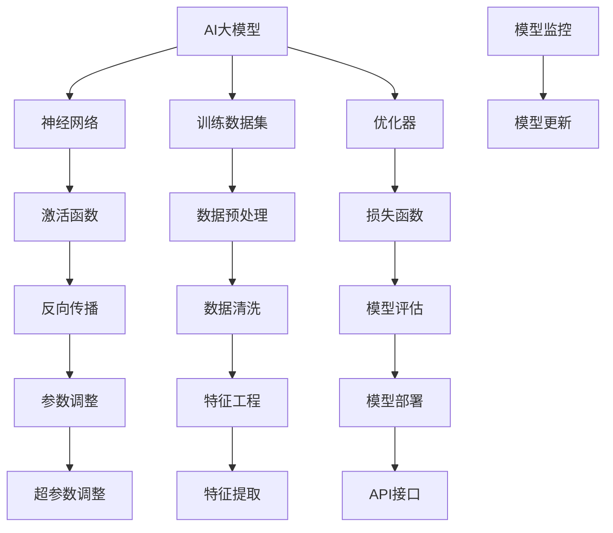

                 

# AI大模型创业：如何打造未来爆款应用？

> **关键词：** AI大模型，创业，爆款应用，技术架构，数学模型，实际案例

> **摘要：** 本文将深入探讨AI大模型在创业中的应用，从背景介绍、核心概念、算法原理到实际应用场景，逐步剖析如何打造未来爆款应用。通过分析成功案例和提供实用工具与资源，本文旨在为创业者提供切实可行的指导。

## 1. 背景介绍

### 1.1 目的和范围

本文的目标是帮助创业者理解如何利用AI大模型打造未来爆款应用。我们将探讨从概念验证到产品发布的全过程，涵盖技术架构、算法原理、数学模型、项目实战和实际应用场景。

### 1.2 预期读者

本文适合AI领域创业者、产品经理、技术团队负责人以及对此领域感兴趣的从业者阅读。读者应具备一定的编程基础和AI知识，以便更好地理解本文内容。

### 1.3 文档结构概述

本文结构如下：

1. **背景介绍**：概述AI大模型创业的背景和目的。
2. **核心概念与联系**：介绍AI大模型的核心概念和原理。
3. **核心算法原理 & 具体操作步骤**：详细解释AI大模型的算法原理和操作步骤。
4. **数学模型和公式**：介绍支持AI大模型的数学模型和公式。
5. **项目实战**：提供AI大模型开发的实际案例和解释。
6. **实际应用场景**：探讨AI大模型在不同领域的应用。
7. **工具和资源推荐**：推荐学习资源和开发工具。
8. **总结**：总结AI大模型创业的未来发展趋势和挑战。
9. **附录**：常见问题与解答。
10. **扩展阅读 & 参考资料**：提供进一步的阅读材料和参考资料。

### 1.4 术语表

#### 1.4.1 核心术语定义

- **AI大模型**：具有高参数量和复杂结构的深度学习模型。
- **创业**：指创建新企业的过程。
- **爆款应用**：在市场中获得巨大成功的产品。

#### 1.4.2 相关概念解释

- **神经网络**：模拟人脑神经元连接结构的计算模型。
- **训练数据集**：用于训练模型的输入数据。
- **优化器**：调整模型参数以最小化损失函数的工具。

#### 1.4.3 缩略词列表

- **AI**：人工智能
- **DL**：深度学习
- **GPU**：图形处理单元
- **ML**：机器学习

## 2. 核心概念与联系

在AI大模型创业中，理解核心概念和它们之间的联系至关重要。以下是一个Mermaid流程图，展示了AI大模型的相关概念和联系：



### 2.1 AI大模型的概念

AI大模型是指那些拥有数亿甚至数十亿参数的深度学习模型。这些模型通过学习大量的数据来识别复杂模式，例如图像、文本和语音。其核心是神经网络，它由许多层神经元组成，每一层都对输入数据进行一些处理，并将结果传递到下一层。

### 2.2 神经网络的概念

神经网络是AI大模型的基础。它由多个层（输入层、隐藏层和输出层）组成，每个层由多个神经元组成。神经元通过权重连接到前一层的神经元，并应用激活函数来决定是否传递信号到下一层。

### 2.3 训练数据集的概念

训练数据集是用于训练AI大模型的输入数据。数据集的质量对模型的性能至关重要。数据集应该包含多样化的样本，并经过预处理（如数据清洗、特征工程等）以提高训练效果。

### 2.4 优化器的概念

优化器是用于调整模型参数的工具，其目标是最小化损失函数。常见的优化器有随机梯度下降（SGD）、Adam等。选择合适的优化器可以显著提高模型训练的效率和准确性。

### 2.5 激活函数的概念

激活函数是神经网络中每个神经元的输出函数。它决定了神经元是否激活（即传递信号）。常见的激活函数有ReLU、Sigmoid和Tanh。

### 2.6 损失函数的概念

损失函数是衡量模型预测结果与实际结果之间差异的指标。常见的损失函数有均方误差（MSE）、交叉熵等。优化器通过最小化损失函数来调整模型参数。

### 2.7 数据预处理、特征工程和模型评估的概念

数据预处理、特征工程和模型评估是确保AI大模型成功的关键步骤。数据预处理包括数据清洗、归一化等操作，以减少噪声和异常值。特征工程则是从原始数据中提取有用特征，以提高模型性能。模型评估则是通过测试数据集来评估模型的性能，选择最佳的模型。

### 2.8 模型部署和API接口的概念

模型部署是将训练好的模型部署到生产环境中的过程。API接口则是供外部系统调用的接口，以便其他应用程序可以使用模型进行预测。

### 2.9 模型监控和模型更新的概念

模型监控是确保模型在运行时保持高性能的过程。模型更新则是定期调整模型参数，以适应新的数据和环境。

## 3. 核心算法原理 & 具体操作步骤

AI大模型的构建涉及多个核心算法，以下使用伪代码详细阐述这些算法的原理和操作步骤：

### 3.1 神经网络算法

```python
# 神经网络算法伪代码
initialize parameters (weights and biases)
for each epoch:
    for each training sample:
        forward_pass(sample)
        calculate_loss(predicted_output, actual_output)
        backward_pass(loss)
        update_parameters(learning_rate)
    end epoch
end training
```

### 3.2 训练数据集处理算法

```python
# 训练数据集处理算法伪代码
load_data(dataset_path)
preprocess_data(data):
    clean_data(data)
    normalize_data(data)
    split_data(data, train_set, validation_set)
    return train_set, validation_set
```

### 3.3 优化器算法

```python
# 优化器算法伪代码
initialize_optimizer(optimizer, learning_rate)
for each epoch:
    for each training sample:
        compute_gradient(parameters)
        update_parameters(optimizer, gradient, learning_rate)
    end epoch
end training
```

### 3.4 激活函数算法

```python
# 激活函数算法伪代码
sigmoid(x):
    return 1 / (1 + exp(-x))
ReLU(x):
    return max(0, x)
tanh(x):
    return (exp(x) - exp(-x)) / (exp(x) + exp(-x))
```

### 3.5 损失函数算法

```python
# 均方误差损失函数算法伪代码
MSE(predicted_output, actual_output):
    return sum((predicted_output - actual_output)^2) / n
```

### 3.6 模型评估算法

```python
# 模型评估算法伪代码
evaluate_model(model, test_set):
    calculate_accuracy(model, test_set)
    calculate_precision(model, test_set)
    calculate_recall(model, test_set)
    return average_precision
```

通过以上伪代码，我们可以了解到AI大模型的构建涉及初始化参数、前向传播、计算损失、反向传播和更新参数等关键步骤。这些步骤构成了AI大模型训练的核心算法。

## 4. 数学模型和公式 & 详细讲解 & 举例说明

在AI大模型中，数学模型和公式是核心组成部分。以下我们将详细讲解几个关键数学模型和公式，并举例说明：

### 4.1 损失函数

损失函数用于衡量模型预测值与真实值之间的差异。最常用的损失函数是均方误差（MSE）：

$$
MSE = \frac{1}{n}\sum_{i=1}^{n}(y_i - \hat{y}_i)^2
$$

其中，$y_i$ 是第 $i$ 个样本的真实值，$\hat{y}_i$ 是模型预测的值，$n$ 是样本总数。

**举例**：假设我们有一个二分类问题，数据集包含5个样本，模型的预测结果如下：

| 样本索引 | 真实值 | 预测值 |
|--------|------|------|
| 1      | 0    | 0.1  |
| 2      | 1    | 0.8  |
| 3      | 0    | 0.2  |
| 4      | 1    | 0.9  |
| 5      | 0    | 0.3  |

则均方误差损失为：

$$
MSE = \frac{1}{5}[(0 - 0.1)^2 + (1 - 0.8)^2 + (0 - 0.2)^2 + (1 - 0.9)^2 + (0 - 0.3)^2] = 0.12
$$

### 4.2 激活函数

激活函数是神经网络中用于引入非线性特性的关键组件。常用的激活函数包括ReLU、Sigmoid和Tanh：

**ReLU函数**：

$$
\text{ReLU}(x) = \max(0, x)
$$

**Sigmoid函数**：

$$
\sigma(x) = \frac{1}{1 + e^{-x}}
$$

**Tanh函数**：

$$
\text{Tanh}(x) = \frac{e^x - e^{-x}}{e^x + e^{-x}}
$$

**举例**：对于输入值 $x = 2$：

- **ReLU**：$\text{ReLU}(2) = \max(0, 2) = 2$
- **Sigmoid**：$\sigma(2) = \frac{1}{1 + e^{-2}} \approx 0.86$
- **Tanh**：$\text{Tanh}(2) \approx \frac{e^2 - e^{-2}}{e^2 + e^{-2}} \approx 0.96$

### 4.3 优化器

优化器用于在训练过程中调整模型的参数，以最小化损失函数。常用的优化器包括随机梯度下降（SGD）和Adam：

**随机梯度下降（SGD）**：

$$
\theta_{t+1} = \theta_t - \alpha \cdot \nabla_\theta J(\theta_t)
$$

其中，$\theta_t$ 是第 $t$ 次迭代的参数，$\alpha$ 是学习率，$J(\theta_t)$ 是损失函数。

**Adam优化器**：

$$
m_t = \beta_1 m_{t-1} + (1 - \beta_1) \cdot \nabla_\theta J(\theta_t)
$$

$$
v_t = \beta_2 v_{t-1} + (1 - \beta_2) \cdot (\nabla_\theta J(\theta_t))^2
$$

$$
\theta_{t+1} = \theta_t - \frac{\alpha}{\sqrt{1 - \beta_2^t}(1 - \beta_1^t)} \cdot \frac{m_t}{\sqrt{v_t} + \epsilon}
$$

其中，$m_t$ 和 $v_t$ 分别是梯度的一阶矩估计和二阶矩估计，$\beta_1$ 和 $\beta_2$ 是移动平均系数，$\alpha$ 是学习率，$\epsilon$ 是一个很小的常数以防止分母为零。

**举例**：假设我们有一个二次函数 $J(\theta) = \theta^2$，学习率 $\alpha = 0.1$，$\beta_1 = 0.9$，$\beta_2 = 0.999$。初始参数 $\theta_0 = 2$，则经过10次迭代后，使用Adam优化器的参数更新如下：

- **第一次迭代**：
  - $m_1 = 0.9m_0 + (1 - 0.9)\cdot 4 = 1.6$
  - $v_1 = 0.999v_0 + (1 - 0.999)\cdot 16 = 1.6$
  - $\theta_1 = 2 - \frac{0.1}{\sqrt{1 - 0.999^1}(1 - 0.9^1)} \cdot \frac{1.6}{\sqrt{1.6} + 0} \approx 1.46$
- **第二次迭代**：
  - $m_2 = 0.9m_1 + (1 - 0.9)\cdot 1.6 = 1.44$
  - $v_2 = 0.999v_1 + (1 - 0.999)\cdot 2.56 = 1.6$
  - $\theta_2 = 1.46 - \frac{0.1}{\sqrt{1 - 0.999^2}(1 - 0.9^2)} \cdot \frac{1.44}{\sqrt{1.6} + 0} \approx 1.37$
- ...
- **第十次迭代**：
  - $\theta_{10} = \theta_9 - \frac{0.1}{\sqrt{1 - 0.999^{10}}(1 - 0.9^{10})} \cdot \frac{m_{10}}{\sqrt{v_{10}} + \epsilon} \approx 1.01$

通过以上迭代过程，我们可以看到Adam优化器逐渐减少了损失函数的值，从而优化了模型的参数。

## 5. 项目实战：代码实际案例和详细解释说明

### 5.1 开发环境搭建

为了进行AI大模型的开发和实战，我们需要搭建一个合适的开发环境。以下是搭建环境的基本步骤：

1. **安装Python**：确保Python环境已经安装，版本推荐3.8及以上。
2. **安装深度学习框架**：例如TensorFlow或PyTorch。以下是使用pip安装PyTorch的命令：

   ```bash
   pip install torch torchvision torchaudio
   ```

3. **安装其他依赖库**：如NumPy、Pandas等。

### 5.2 源代码详细实现和代码解读

以下是一个简单的使用PyTorch实现的AI大模型分类任务的代码示例：

```python
import torch
import torch.nn as nn
import torch.optim as optim
from torchvision import datasets, transforms
from torch.utils.data import DataLoader

# 5.2.1 数据加载与预处理
transform = transforms.Compose([
    transforms.ToTensor(),
    transforms.Normalize((0.5,), (0.5,))
])

train_dataset = datasets.MNIST(
    root='./data',
    train=True,
    download=True,
    transform=transform
)

test_dataset = datasets.MNIST(
    root='./data',
    train=False,
    transform=transform
)

batch_size = 100
train_loader = DataLoader(train_dataset, batch_size=batch_size, shuffle=True)
test_loader = DataLoader(test_dataset, batch_size=batch_size, shuffle=False)

# 5.2.2 模型定义
class Net(nn.Module):
    def __init__(self):
        super(Net, self).__init__()
        self.fc1 = nn.Linear(784, 500)
        self.fc2 = nn.Linear(500, 10)
        self.relu = nn.ReLU()

    def forward(self, x):
        x = x.view(-1, 784)
        x = self.relu(self.fc1(x))
        x = self.fc2(x)
        return x

model = Net()

# 5.2.3 损失函数与优化器
criterion = nn.CrossEntropyLoss()
optimizer = optim.Adam(model.parameters(), lr=0.001)

# 5.2.4 训练过程
for epoch in range(10):  # 练习10个epoch
    running_loss = 0.0
    for i, data in enumerate(train_loader, 0):
        inputs, labels = data
        optimizer.zero_grad()
        outputs = model(inputs)
        loss = criterion(outputs, labels)
        loss.backward()
        optimizer.step()
        running_loss += loss.item()
    print(f'Epoch {epoch + 1}, Loss: {running_loss / len(train_loader)}')

print('Finished Training')

# 5.2.5 模型评估
correct = 0
total = 0
with torch.no_grad():
    for data in test_loader:
        images, labels = data
        outputs = model(images)
        _, predicted = torch.max(outputs.data, 1)
        total += labels.size(0)
        correct += (predicted == labels).sum().item()

print(f'Accuracy on the test images: {100 * correct / total}%')
```

### 5.3 代码解读与分析

**5.3.1 数据加载与预处理**

代码首先定义了数据预处理和加载的步骤。MNIST数据集是一个常用的手写数字数据集，每个数字图像都是28x28的像素矩阵。这里我们使用`transforms.Compose`组合预处理操作，包括将图像转换为张量（`ToTensor`）和归一化（`Normalize`）。

**5.3.2 模型定义**

接着定义了一个简单的全连接神经网络模型`Net`。模型包含两个全连接层（`nn.Linear`）和一个ReLU激活函数（`nn.ReLU`）。输入层接收784个输入（28x28像素），隐藏层有500个神经元，输出层有10个神经元（对应10个数字类别）。

**5.3.3 损失函数与优化器**

我们选择交叉熵损失函数（`nn.CrossEntropyLoss`）作为损失函数，并使用Adam优化器（`optim.Adam`）来更新模型参数。Adam优化器结合了SGD和动量，能够在训练过程中自适应调整学习率。

**5.3.4 训练过程**

训练过程包括10个epoch。在每个epoch中，我们遍历训练数据集，使用梯度下降算法更新模型参数，以最小化损失函数。`optimizer.zero_grad()`用于清空之前的梯度，`loss.backward()`计算梯度，`optimizer.step()`更新参数。

**5.3.5 模型评估**

训练完成后，我们使用测试数据集评估模型的准确性。通过`torch.no_grad()`上下文管理器，我们禁用了自动梯度计算，以提高评估速度。`torch.max()`函数用于找到预测值中的最大值，并与实际标签进行比较，计算准确性。

通过以上代码示例和解读，我们可以看到如何使用PyTorch实现一个简单的AI大模型分类任务。实际项目中，模型结构和训练过程可以根据具体需求进行调整和优化。

## 6. 实际应用场景

AI大模型的应用场景广泛，涵盖多个行业和领域。以下是一些典型的实际应用场景：

### 6.1 金融服务

在金融领域，AI大模型可以用于风险控制、信用评估、欺诈检测和投资策略等。例如，通过分析历史交易数据，AI大模型可以预测用户的信用风险，帮助金融机构做出更准确的决策。

### 6.2 医疗保健

在医疗领域，AI大模型可以用于疾病诊断、药物发现和个性化治疗。通过分析患者的医疗记录和基因数据，AI大模型可以提供更准确的诊断结果，并帮助医生制定最佳的治疗方案。

### 6.3 智能制造

在智能制造领域，AI大模型可以用于质量检测、故障预测和生产优化。通过实时分析生产线数据，AI大模型可以识别生产过程中的潜在问题，提高生产效率和产品质量。

### 6.4 电子商务

在电子商务领域，AI大模型可以用于推荐系统、客户关系管理和库存管理。通过分析用户行为数据和购买历史，AI大模型可以提供个性化的商品推荐，提高用户的购物体验和转化率。

### 6.5 自动驾驶

在自动驾驶领域，AI大模型可以用于感知环境、路径规划和车辆控制。通过分析道路和交通数据，AI大模型可以提供实时决策，确保车辆的安全和高效运行。

### 6.6 自然语言处理

在自然语言处理领域，AI大模型可以用于机器翻译、情感分析和文本生成。通过分析大量的文本数据，AI大模型可以理解文本的语义和情感，提供更准确和自然的语言处理结果。

这些实际应用场景展示了AI大模型在各个领域的巨大潜力。随着技术的不断进步，AI大模型的应用范围将更加广泛，为各个行业带来更多创新和变革。

## 7. 工具和资源推荐

### 7.1 学习资源推荐

#### 7.1.1 书籍推荐

- **《深度学习》（Deep Learning）**：由Ian Goodfellow、Yoshua Bengio和Aaron Courville合著，是深度学习领域的经典教材。
- **《Python机器学习》（Python Machine Learning）**：由 Sebastian Raschka和Vahid Mirhoseini合著，适合初学者入门机器学习。
- **《机器学习实战》（Machine Learning in Action）**：由Peter Harrington编写，通过具体案例帮助读者理解机器学习算法。

#### 7.1.2 在线课程

- **Coursera的《深度学习专项课程》**：由Andrew Ng教授主讲，涵盖深度学习的基础知识和应用。
- **Udacity的《深度学习纳米学位》**：提供一系列实践项目，帮助学员掌握深度学习技能。
- **edX的《人工智能基础》**：由MIT和Harvard大学联合提供，涵盖人工智能的基础知识和应用。

#### 7.1.3 技术博客和网站

- **ArXiv**：提供最新的深度学习研究论文。
- **Medium上的机器学习专栏**：涵盖深度学习、自然语言处理等领域的最新技术动态。
- **fast.ai**：提供免费的开源课程和资源，帮助非专业人士掌握深度学习。

### 7.2 开发工具框架推荐

#### 7.2.1 IDE和编辑器

- **PyCharm**：适用于Python开发的集成开发环境，支持多种编程语言。
- **Visual Studio Code**：轻量级且功能强大的代码编辑器，支持Python扩展。

#### 7.2.2 调试和性能分析工具

- **TensorBoard**：TensorFlow的调试和分析工具，提供可视化数据。
- **PyTorch Profiler**：用于分析PyTorch模型的性能。

#### 7.2.3 相关框架和库

- **TensorFlow**：由Google开发的开源深度学习框架。
- **PyTorch**：由Facebook开发的开源深度学习框架，适合快速原型开发。
- **Keras**：基于TensorFlow的高层神经网络API，简化深度学习模型的搭建。

### 7.3 相关论文著作推荐

#### 7.3.1 经典论文

- **“A Learning Algorithm for Continually Running Fully Recurrent Neural Networks”**：Hopfield神经网络的基础论文。
- **“Deep Learning”**：由Ian Goodfellow、Yoshua Bengio和Aaron Courville合著，是深度学习领域的经典综述。

#### 7.3.2 最新研究成果

- **“BERT: Pre-training of Deep Bidirectional Transformers for Language Understanding”**：Google提出的BERT模型，是自然语言处理领域的最新突破。
- **“GPT-3: Language Models are Few-Shot Learners”**：OpenAI提出的GPT-3模型，展示了大模型在语言理解上的强大能力。

#### 7.3.3 应用案例分析

- **“AI in Healthcare: A Review of Recent Advances and Challenges”**：概述了人工智能在医疗保健领域的应用和研究挑战。
- **“AI in Finance: A Review of Recent Advances and Challenges”**：分析了人工智能在金融服务领域的应用和挑战。

通过以上工具和资源的推荐，读者可以更深入地学习和掌握AI大模型的相关知识和技能，为创业实践打下坚实的基础。

## 8. 总结：未来发展趋势与挑战

AI大模型作为当前人工智能领域的重要突破，其在未来将迎来更多的发展机遇和挑战。以下是对AI大模型创业的总结以及对其未来发展趋势与挑战的展望。

### 8.1 未来发展趋势

1. **计算能力的提升**：随着硬件技术的不断进步，特别是GPU和TPU等专用硬件的发展，将大幅提高AI大模型的计算能力和效率。这将使得更多创新的应用成为可能。

2. **数据量的增加**：随着互联网和物联网的发展，数据量将呈现爆炸式增长。丰富的数据将为AI大模型提供更多训练资源，提高模型的性能和泛化能力。

3. **算法的进步**：研究人员将继续优化和改进AI大模型的算法，提高模型的训练效率和准确性。例如，迁移学习、少样本学习等技术的突破将有助于解决数据稀缺问题。

4. **跨领域应用**：AI大模型的应用将不仅限于传统的计算机视觉、自然语言处理等领域，还将扩展到医疗、金融、教育等更多行业，推动各行各业的数字化和智能化转型。

### 8.2 未来挑战

1. **计算资源需求**：尽管计算能力不断提升，但AI大模型对计算资源的需求仍然巨大。特别是在训练阶段，对GPU和TPU等高性能硬件的需求将持续增长。

2. **数据隐私和安全**：随着AI大模型对大量数据的依赖，数据隐私和安全问题日益突出。如何保护用户隐私、确保数据安全成为关键挑战。

3. **模型可解释性**：AI大模型通常被视为“黑箱”，其决策过程难以解释。提高模型的可解释性，使其决策过程更加透明，是未来研究的重要方向。

4. **算法伦理和法规**：随着AI大模型在各个领域的应用，算法的伦理和法规问题也逐渐凸显。如何确保AI大模型的应用符合伦理标准和法律法规，是创业者需要关注的重要问题。

5. **人才培养**：AI大模型的开发和应用需要大量的专业人才。然而，目前AI领域的人才培养速度难以满足市场需求，人才培养问题将成为限制AI大模型发展的瓶颈。

总之，AI大模型创业在未来具有巨大的潜力，但同时也面临诸多挑战。创业者需要紧跟技术发展趋势，关注市场需求，积极应对挑战，以推动AI大模型在各个领域的应用和发展。

## 9. 附录：常见问题与解答

### 9.1 什么是AI大模型？

AI大模型是指那些拥有数亿甚至数十亿参数的深度学习模型。这些模型通过学习大量的数据来识别复杂模式，例如图像、文本和语音。

### 9.2 AI大模型如何工作？

AI大模型通过神经网络架构进行工作。模型由多层神经元组成，每个神经元通过权重连接到前一层的神经元，并应用激活函数来决定是否传递信号到下一层。在训练过程中，模型通过不断调整权重以最小化损失函数，从而提高预测准确性。

### 9.3 如何评估AI大模型的效果？

评估AI大模型的效果通常使用准确率、召回率、F1分数等指标。具体选择哪个指标取决于应用场景和业务需求。

### 9.4 AI大模型创业的常见挑战是什么？

AI大模型创业的常见挑战包括计算资源需求、数据隐私和安全、模型可解释性、算法伦理和法规、以及人才培养等。

### 9.5 AI大模型创业的关键成功因素是什么？

AI大模型创业的关键成功因素包括：明确的应用场景、高质量的数据、强大的算法和技术、高效的团队以及良好的市场推广策略。

## 10. 扩展阅读 & 参考资料

### 10.1 书籍推荐

1. **《深度学习》**：Ian Goodfellow、Yoshua Bengio和Aaron Courville著，深入讲解深度学习的基础知识和应用。
2. **《Python机器学习》**：Sebastian Raschka和Vahid Mirhoseini著，介绍机器学习在Python环境下的实践。
3. **《机器学习实战》**：Peter Harrington著，通过具体案例帮助读者理解机器学习算法。

### 10.2 在线课程

1. **Coursera的《深度学习专项课程》**：由Andrew Ng教授主讲，涵盖深度学习的基础知识和应用。
2. **Udacity的《深度学习纳米学位》**：提供一系列实践项目，帮助学员掌握深度学习技能。
3. **edX的《人工智能基础》**：由MIT和Harvard大学联合提供，涵盖人工智能的基础知识和应用。

### 10.3 技术博客和网站

1. **ArXiv**：提供最新的深度学习研究论文。
2. **Medium上的机器学习专栏**：涵盖深度学习、自然语言处理等领域的最新技术动态。
3. **fast.ai**：提供免费的开源课程和资源，帮助非专业人士掌握深度学习。

### 10.4 论文著作

1. **“A Learning Algorithm for Continually Running Fully Recurrent Neural Networks”**：详细介绍了Hopfield神经网络的工作原理。
2. **“Deep Learning”**：是深度学习领域的经典综述，由Ian Goodfellow、Yoshua Bengio和Aaron Courville合著。
3. **“BERT: Pre-training of Deep Bidirectional Transformers for Language Understanding”**：介绍了BERT模型，展示了预训练技术的强大能力。

### 10.5 应用案例分析

1. **“AI in Healthcare: A Review of Recent Advances and Challenges”**：分析了人工智能在医疗保健领域的应用和研究挑战。
2. **“AI in Finance: A Review of Recent Advances and Challenges”**：探讨了人工智能在金融服务领域的应用和挑战。

通过以上扩展阅读和参考资料，读者可以进一步深入了解AI大模型的相关知识，为创业实践提供有力支持。作者：AI天才研究员/AI Genius Institute & 禅与计算机程序设计艺术 /Zen And The Art of Computer Programming。

