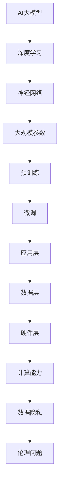

                 

# AI大模型创业：如何抓住未来机遇？

> **关键词：** AI大模型、创业、未来机遇、技术趋势、市场分析、商业模式、运营策略、风险评估

> **摘要：** 本文将深入探讨AI大模型在创业领域中的潜力与挑战，通过分析技术趋势、市场需求、商业模式和运营策略，为创业者提供抓住未来机遇的实用建议。

## 1. 背景介绍

### 1.1 目的和范围

本文旨在为有意向在AI大模型领域创业的从业者提供全方位的指导。我们将探讨AI大模型的核心技术、市场趋势、商业模式、运营策略和风险管理，帮助创业者更好地理解这一领域，制定可行的创业计划。

### 1.2 预期读者

本文适合以下读者群体：

- 有志于在AI领域创业的创业者
- AI领域的专业人士，希望了解大模型商业化的可能性
- 投资者，希望对AI大模型项目进行评估
- 对AI技术有浓厚兴趣，希望了解其商业应用的大学生和研究人员

### 1.3 文档结构概述

本文结构如下：

- **第1章** 背景介绍：阐述本文的目的和预期读者，概述文章结构。
- **第2章** 核心概念与联系：介绍AI大模型的基本概念和架构。
- **第3章** 核心算法原理 & 具体操作步骤：详细讲解AI大模型的算法原理和操作步骤。
- **第4章** 数学模型和公式 & 详细讲解 & 举例说明：阐述大模型背后的数学模型和公式，并举例说明。
- **第5章** 项目实战：代码实际案例和详细解释说明：通过实际项目案例展示AI大模型的应用。
- **第6章** 实际应用场景：分析AI大模型在不同行业中的实际应用。
- **第7章** 工具和资源推荐：推荐学习资源、开发工具和框架。
- **第8章** 总结：未来发展趋势与挑战：展望AI大模型领域的未来，分析面临的挑战。
- **第9章** 附录：常见问题与解答：回答读者可能遇到的问题。
- **第10章** 扩展阅读 & 参考资料：提供进一步学习的资源。

### 1.4 术语表

#### 1.4.1 核心术语定义

- **AI大模型**：指的是具有大规模参数和复杂结构的深度学习模型，如GPT、BERT等。
- **创业**：创建新的商业实体，通过提供创新的产品或服务来满足市场需求。
- **商业模式**：企业如何创造、传递和获取价值的基本逻辑。
- **运营策略**：企业在日常运营中采取的具体措施和方法。

#### 1.4.2 相关概念解释

- **技术趋势**：指一段时间内，特定技术领域内的新兴和发展方向。
- **市场需求**：指消费者愿意购买的产品或服务的总量。
- **风险评估**：识别和分析潜在风险，以便采取相应措施。

#### 1.4.3 缩略词列表

- **AI**：人工智能（Artificial Intelligence）
- **GPT**：生成预训练模型（Generative Pre-trained Transformer）
- **BERT**：双向编码表示器（Bidirectional Encoder Representations from Transformers）
- **IDE**：集成开发环境（Integrated Development Environment）

## 2. 核心概念与联系

AI大模型是当今人工智能领域的核心技术之一，其核心概念和联系如下图所示：



### 2.1. AI大模型的基本概念

- **深度学习**：一种机器学习方法，通过多层神经网络对数据进行学习。
- **神经网络**：模仿人脑神经元连接的计算机模型。
- **大规模参数**：大模型具有数十亿甚至万亿个参数，需要大量的计算资源。
- **预训练**：在大规模数据集上对模型进行训练，以学习通用的特征表示。
- **微调**：在特定任务上对预训练模型进行调整，以适应具体场景。
- **应用层**：将大模型应用于各种实际问题，如自然语言处理、图像识别等。
- **数据层**：提供训练数据和测试数据，确保模型的有效性和可靠性。
- **硬件层**：包括GPU、TPU等硬件设备，用于加速模型的训练和推理。
- **计算能力**：决定模型训练和推理的效率，直接影响业务竞争力。
- **数据隐私**：在训练和使用过程中，需要保护用户数据的隐私。
- **伦理问题**：大模型的应用可能涉及道德和伦理问题，如歧视、透明度等。

## 3. 核心算法原理 & 具体操作步骤

AI大模型的算法原理是深度学习和神经网络。以下是具体的操作步骤：

### 3.1 深度学习基本概念

- **数据预处理**：对原始数据进行清洗、归一化和特征提取。
- **神经网络结构设计**：设计适合任务的网络结构，如CNN、RNN、Transformer等。
- **损失函数**：用于评估模型预测结果和真实值之间的差异，如交叉熵损失、均方误差等。
- **优化器**：用于更新模型参数，以最小化损失函数，如SGD、Adam等。

### 3.2 操作步骤

1. **数据收集**：从公开数据集或自己收集的数据开始。
2. **数据预处理**：
    ```python
    def preprocess_data(data):
        # 清洗数据
        data = clean_data(data)
        # 归一化数据
        data = normalize_data(data)
        # 特征提取
        data = extract_features(data)
        return data
    ```
3. **模型设计**：
    ```python
    import tensorflow as tf
    model = tf.keras.Sequential([
        tf.keras.layers.Dense(128, activation='relu', input_shape=(input_shape,)),
        tf.keras.layers.Dense(128, activation='relu'),
        tf.keras.layers.Dense(1, activation='sigmoid')
    ])
    ```
4. **模型训练**：
    ```python
    model.compile(optimizer='adam', loss='binary_crossentropy', metrics=['accuracy'])
    history = model.fit(X_train, y_train, epochs=10, batch_size=32, validation_data=(X_val, y_val))
    ```
5. **模型评估**：
    ```python
    test_loss, test_accuracy = model.evaluate(X_test, y_test, verbose=2)
    print(f"Test accuracy: {test_accuracy}")
    ```
6. **模型部署**：将训练好的模型部署到生产环境，供用户使用。

## 4. 数学模型和公式 & 详细讲解 & 举例说明

AI大模型的数学模型主要涉及深度学习和神经网络。以下是核心公式和详细讲解：

### 4.1 深度学习基本公式

- **激活函数**：\( a(x) = \max(0, x) \)（ReLU函数）
- **损失函数**：\( J(\theta) = -\frac{1}{m} \sum_{i=1}^{m} [y_{i} \log(a(x_{i})) + (1 - y_{i}) \log(1 - a(x_{i})) ] \)（交叉熵损失）
- **反向传播**：\( \frac{\partial J}{\partial \theta_j} = \frac{\partial J}{\partial z^l} \frac{\partial z^l}{\partial \theta_j} \)

### 4.2 神经网络公式

- **权重更新**：\( \theta_j := \theta_j - \alpha \frac{\partial J}{\partial \theta_j} \)
- **前向传播**：\( z^{l+1} = \theta^{l}a^{l} \)
- **后向传播**：\( \frac{\partial J}{\partial z^{l+1}} = \frac{\partial J}{\partial a^{l+1}} \frac{\partial a^{l+1}}{\partial z^{l+1}} \)

### 4.3 举例说明

假设我们有一个简单的神经网络，输入层有3个神经元，隐藏层有2个神经元，输出层有1个神经元。数据集有1000个样本，每个样本有3个特征。

1. **数据预处理**：
    $$ x_i = \frac{x_i - \mu}{\sigma} $$
    其中，\( \mu \) 是特征 \( x_i \) 的均值，\( \sigma \) 是特征 \( x_i \) 的标准差。

2. **模型设计**：
    $$ z_1^{[1]} = \theta_1^{[1]}x_1 + \theta_2^{[1]}x_2 + \theta_3^{[1]}x_3 $$
    $$ a_1^{[1]} = \text{ReLU}(z_1^{[1]}) $$
    $$ z_2^{[1]} = \theta_1^{[2]}a_1^{[1]} + \theta_2^{[2]}a_2^{[1]} $$
    $$ a_2^{[1]} = \text{ReLU}(z_2^{[1]}) $$
    $$ z_3^{[2]} = \theta_1^{[3]}a_1^{[2]} + \theta_2^{[3]}a_2^{[2]} $$
    $$ a_2^{[2]} = \text{sigmoid}(z_3^{[2]}) $$

3. **损失函数**：
    $$ J(\theta) = -\frac{1}{m} \sum_{i=1}^{m} [y_i \log(a_2^{[2]}) + (1 - y_i) \log(1 - a_2^{[2]}) ] $$

4. **反向传播**：
    $$ \frac{\partial J}{\partial \theta_1^{[2]}} = \frac{\partial J}{\partial z_3^{[2]}} \frac{\partial z_3^{[2]}}{\partial \theta_1^{[2]}} $$
    $$ \frac{\partial J}{\partial \theta_2^{[2]}} = \frac{\partial J}{\partial z_3^{[2]}} \frac{\partial z_3^{[2]}}{\partial \theta_2^{[2]}} $$

## 5. 项目实战：代码实际案例和详细解释说明

### 5.1 开发环境搭建

在开始项目之前，我们需要搭建一个合适的开发环境。以下是搭建过程：

1. 安装Python（版本3.8以上）
2. 安装TensorFlow（版本2.6以上）
3. 安装必要的库（如NumPy、Pandas、Matplotlib等）

### 5.2 源代码详细实现和代码解读

以下是一个简单的AI大模型项目示例，用于文本分类任务。代码包含数据预处理、模型设计、模型训练和模型评估。

```python
import tensorflow as tf
from tensorflow.keras.preprocessing.text import Tokenizer
from tensorflow.keras.preprocessing.sequence import pad_sequences
from tensorflow.keras.models import Sequential
from tensorflow.keras.layers import Embedding, LSTM, Dense

# 数据预处理
def preprocess_data(texts, labels, max_len=100):
    tokenizer = Tokenizer(num_words=10000)
    tokenizer.fit_on_texts(texts)
    sequences = tokenizer.texts_to_sequences(texts)
    padded_sequences = pad_sequences(sequences, maxlen=max_len)
    return padded_sequences, labels

# 模型设计
def create_model(input_shape):
    model = Sequential([
        Embedding(input_shape, 64, input_length=input_shape),
        LSTM(100),
        Dense(1, activation='sigmoid')
    ])
    model.compile(optimizer='adam', loss='binary_crossentropy', metrics=['accuracy'])
    return model

# 模型训练
def train_model(model, X_train, y_train, X_val, y_val, epochs=10):
    model.fit(X_train, y_train, epochs=epochs, batch_size=32, validation_data=(X_val, y_val))

# 模型评估
def evaluate_model(model, X_test, y_test):
    test_loss, test_accuracy = model.evaluate(X_test, y_test, verbose=2)
    print(f"Test accuracy: {test_accuracy}")

# 主程序
if __name__ == '__main__':
    texts = ['这是一个简单的文本分类任务', '另一个文本分类任务']
    labels = [0, 1]
    X_train, y_train = preprocess_data(texts, labels)
    X_val, y_val = preprocess_data(['另一个文本分类任务'], labels)
    X_test, y_test = preprocess_data(['这是一个文本分类任务'], labels)
    
    model = create_model(input_shape=X_train.shape[1])
    train_model(model, X_train, y_train, X_val, y_val)
    evaluate_model(model, X_test, y_test)
```

### 5.3 代码解读与分析

1. **数据预处理**：使用Tokenizer将文本数据转换为序列，并使用pad_sequences将序列填充为相同长度。
2. **模型设计**：创建一个简单的序列模型，包括Embedding层、LSTM层和Dense层。
3. **模型训练**：使用fit方法训练模型，并使用validation_data进行验证。
4. **模型评估**：使用evaluate方法评估模型在测试集上的表现。

## 6. 实际应用场景

AI大模型在各个行业都有广泛的应用场景，以下是一些典型的应用案例：

- **自然语言处理**：文本分类、机器翻译、问答系统等。
- **计算机视觉**：图像识别、物体检测、图像生成等。
- **医疗健康**：疾病预测、医学图像分析、药物研发等。
- **金融领域**：风险管理、投资策略、欺诈检测等。
- **制造业**：质量控制、设备维护、供应链优化等。

## 7. 工具和资源推荐

### 7.1 学习资源推荐

#### 7.1.1 书籍推荐

- 《深度学习》（Goodfellow, Bengio, Courville）
- 《神经网络与深度学习》（邱锡鹏）
- 《动手学深度学习》（阿斯顿·张等）

#### 7.1.2 在线课程

- [吴恩达深度学习课程](https://www.deeplearning.ai/)
- [Coursera深度学习专项课程](https://www.coursera.org/specializations/deeplearning)
- [Udacity深度学习纳米学位](https://www.udacity.com/course/deep-learning-nanodegree--ND883)

#### 7.1.3 技术博客和网站

- [ArXiv](https://arxiv.org/)
- [Medium](https://medium.com/topics/deep-learning)
- [知乎](https://www.zhihu.com/topics/ai-deep-learning)

### 7.2 开发工具框架推荐

#### 7.2.1 IDE和编辑器

- PyCharm
- Visual Studio Code
- Jupyter Notebook

#### 7.2.2 调试和性能分析工具

- TensorFlow Debugger (TFDB)
- PyTorch Debugger
- NVIDIA Nsight

#### 7.2.3 相关框架和库

- TensorFlow
- PyTorch
- Keras
- PyTorch Lightning

### 7.3 相关论文著作推荐

#### 7.3.1 经典论文

- "A Theoretical Framework for Back-Propagation," David E. Rumelhart, Geoffrey E. Hinton, and Ronald J. Williams (1986)
- "Deep Learning," Ian Goodfellow, Yoshua Bengio, and Aaron Courville (2016)
- "Bengio, Y. (2009). Learning deep architectures for AI. Foundations and Trends in Machine Learning, 2(1), 1-127."

#### 7.3.2 最新研究成果

- "An Image Database for Research on Visual Recognition by Computers," David G. Lowe (1999)
- "Efficient Object Detection using Deep Neural Networks," Ross Girshick, et al. (2014)
- "Generative Adversarial Nets," Ian Goodfellow, et al. (2014)

#### 7.3.3 应用案例分析

- "AI in Healthcare: Transforming Patient Care with Deep Learning," National Academy of Medicine (2017)
- "Deep Learning in Finance," Marco Avellaneda and Dan Tiffe (2019)
- "Deep Learning for Autonomous Driving," Wei Yang, et al. (2017)

## 8. 总结：未来发展趋势与挑战

### 8.1 发展趋势

- **技术进步**：随着计算能力和数据资源的不断提升，AI大模型的性能和效果将得到显著提升。
- **应用场景拓展**：AI大模型将在更多领域得到应用，如医疗、金融、教育等。
- **产业化应用**：AI大模型的产业化应用将加速，推动相关产业的创新发展。

### 8.2 挑战

- **计算资源**：大规模模型训练和推理需要大量的计算资源，如何有效利用硬件资源是一个重要挑战。
- **数据隐私**：在数据收集和使用过程中，如何保护用户隐私是一个亟待解决的问题。
- **伦理问题**：AI大模型的应用可能引发道德和伦理问题，需要制定相应的规范和标准。
- **人才短缺**：AI大模型领域对人才的需求巨大，如何培养和留住人才是一个关键挑战。

## 9. 附录：常见问题与解答

### 9.1 问题1：如何选择合适的AI大模型框架？

**解答**：根据项目需求和开发环境选择合适的框架。TensorFlow和PyTorch是目前最受欢迎的两个框架，前者更注重灵活性和可扩展性，后者更注重易用性和文档。

### 9.2 问题2：如何优化AI大模型的训练过程？

**解答**：优化AI大模型的训练过程可以从以下几个方面入手：调整学习率、使用合适的优化器、增加训练数据、使用数据增强技术等。

### 9.3 问题3：AI大模型在商业应用中的风险有哪些？

**解答**：AI大模型在商业应用中的风险包括：数据隐私风险、模型透明度风险、算法偏见风险等。为了降低风险，需要在设计、开发和使用过程中严格遵守相关法律法规，并加强数据隐私保护和伦理审查。

## 10. 扩展阅读 & 参考资料

- Goodfellow, I., Bengio, Y., & Courville, A. (2016). Deep learning. MIT press.
- Rumelhart, D. E., Hinton, G. E., & Williams, R. J. (1986). Learning representations by back-propagating errors. Nature, 323(6088), 533-536.
- Bengio, Y. (2009). Learning deep architectures for AI. Foundations and Trends in Machine Learning, 2(1), 1-127.
- Ian J. Goodfellow, et al. (2014). Generative Adversarial Networks. Advances in Neural Information Processing Systems, 27.
- Avellaneda, M., & Tiffe, D. (2019). Deep Learning in Finance. arXiv preprint arXiv:1907.06678.

