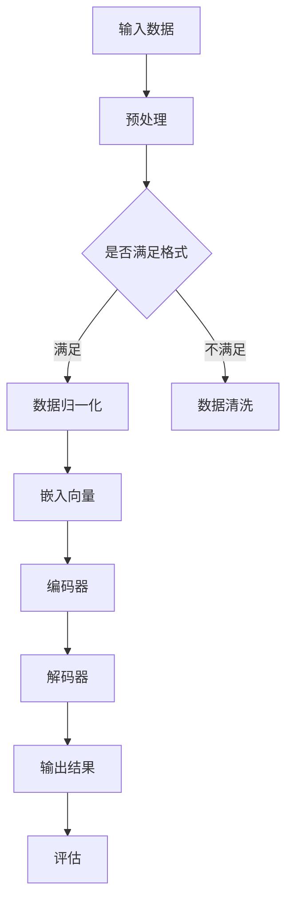
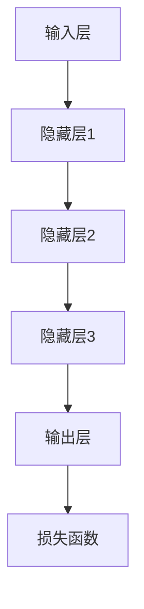

                 

# AI大模型创业：如何抓住未来机遇？

> **关键词：** AI大模型、创业、未来机遇、技术趋势、市场分析、商业模式、资源整合、风险控制。

> **摘要：** 本文旨在深入探讨AI大模型在创业领域中的潜力和挑战。通过分析AI大模型的技术原理、市场趋势和商业模式，提供一整套创业策略和实用建议，帮助创业者抓住未来AI时代的机遇。

## 1. 背景介绍

### 1.1 目的和范围

本文的目标是帮助创业者了解和利用AI大模型技术，探索其在创业中的应用价值。本文将覆盖以下范围：

1. AI大模型的基础概念和技术原理。
2. 当前市场趋势和潜在机遇。
3. 创业策略、商业模式和资源整合。
4. 风险管理和未来发展预测。

### 1.2 预期读者

本文适合以下读者群体：

1. 想要在AI领域创业的个人和企业。
2. 对AI技术有基本了解，但希望深入了解AI大模型应用的人。
3. AI从业者和研究人员，希望了解AI大模型创业实践。
4. 对未来科技发展趋势感兴趣的投资者和创业者。

### 1.3 文档结构概述

本文将分为以下部分：

1. **背景介绍**：介绍本文的目的、预期读者和文档结构。
2. **核心概念与联系**：介绍AI大模型的核心概念和相关技术架构。
3. **核心算法原理 & 具体操作步骤**：详细解释AI大模型的算法原理和操作步骤。
4. **数学模型和公式 & 详细讲解 & 举例说明**：讲解AI大模型相关的数学模型和公式。
5. **项目实战：代码实际案例和详细解释说明**：通过具体案例展示AI大模型的实际应用。
6. **实际应用场景**：分析AI大模型在不同领域的应用。
7. **工具和资源推荐**：推荐学习资源和开发工具。
8. **总结：未来发展趋势与挑战**：总结AI大模型创业的机遇和挑战。
9. **附录：常见问题与解答**：回答常见问题。
10. **扩展阅读 & 参考资料**：提供更多相关资源。

### 1.4 术语表

#### 1.4.1 核心术语定义

- **AI大模型**：指参数量达到亿级别或以上的深度学习模型，如GPT-3、BERT等。
- **创业**：指创建一个新的企业或业务模式，通过创新和创造价值来实现商业成功。
- **商业模式**：指企业如何创造、传递和获取价值，以及与之相关的收入和利润模式。

#### 1.4.2 相关概念解释

- **市场趋势**：指市场在一段时间内的发展方向和趋势。
- **资源整合**：指将各种资源（人力、资金、技术等）进行有效整合，以实现共同目标。
- **风险管理**：指识别、评估和管理潜在风险，以降低不利影响。

#### 1.4.3 缩略词列表

- **AI**：人工智能
- **DL**：深度学习
- **GPT**：Generative Pre-trained Transformer
- **BERT**：Bidirectional Encoder Representations from Transformers

## 2. 核心概念与联系

AI大模型作为当今人工智能领域的核心技术之一，其核心概念和架构对理解其在创业中的应用至关重要。下面我们将通过Mermaid流程图来展示AI大模型的基本原理和架构。



### 2.1 AI大模型的核心概念

- **输入数据**：AI大模型训练和推理的基础数据，通常来源于大规模数据集。
- **预处理**：对输入数据进行格式化和清洗，确保数据质量。
- **嵌入向量**：将输入数据转换为向量形式，便于模型处理。
- **编码器**：将输入向量编码为隐藏状态，提取特征信息。
- **解码器**：将隐藏状态解码为输出结果，如文本、图像等。
- **评估**：使用评估指标（如准确率、召回率等）对模型性能进行评估。

### 2.2 AI大模型的架构

AI大模型通常由多个层次组成，包括输入层、隐藏层和输出层。以下是一个简单的AI大模型架构：



在这个架构中，输入层接收输入数据，通过一系列隐藏层进行特征提取和变换，最终输出层生成预测结果。损失函数用于评估预测结果与真实结果的差异，并指导模型优化。

## 3. 核心算法原理 & 具体操作步骤

AI大模型的核心算法原理通常基于深度学习技术，特别是基于Transformer架构。下面我们将通过伪代码详细阐述AI大模型的算法原理和操作步骤。

### 3.1 模型初始化

```python
# 初始化模型参数
embeddings = EmbeddingLayer(size_of_vocabulary, embedding_size)
encoders = EncoderLayer(num_layers, hidden_size)
decoders = DecoderLayer(num_layers, hidden_size)
output_layer = OutputLayer(hidden_size, size_of_vocabulary)
```

### 3.2 前向传播

```python
# 前向传播过程
inputs = preprocess(inputs)
outputs = output_layer(decoders(encoders(embeddings(inputs))))
```

### 3.3 损失函数计算

```python
# 计算损失函数
loss = loss_function(outputs, targets)
```

### 3.4 反向传播

```python
# 反向传播过程
gradients = backpropagation(loss, outputs, targets, parameters)
update_parameters(parameters, gradients)
```

### 3.5 模型训练

```python
# 模型训练过程
for epoch in range(num_epochs):
    for batch in batches:
        inputs, targets = batch
        # 前向传播、损失函数计算和反向传播
        # 更新模型参数
```

## 4. 数学模型和公式 & 详细讲解 & 举例说明

### 4.1 数学模型

AI大模型的数学模型主要基于深度学习中的神经网络架构，特别是Transformer模型。以下是一些关键数学公式和解释：

### 4.1.1 嵌入向量

$$
x \in \mathbb{R}^{d} \quad \text{为输入向量，} \\
e(x) = \text{embedding}(x) \in \mathbb{R}^{d_{e}}
$$

其中，$d$为输入向量的维度，$d_e$为嵌入向量的维度。

### 4.1.2 编码器

$$
h_t^{(i)} = \text{softmax}(W_e h_t^{(i-1)} + W_h \text{skip_connection}(h_t^{(i-2)}))
$$

其中，$h_t^{(i)}$为第$i$个隐藏层的第$t$个时间步的输出，$W_e$和$W_h$分别为编码器的权重矩阵，$\text{skip_connection}(h_t^{(i-2)})$为跳过连接。

### 4.1.3 解码器

$$
y_t = \text{softmax}(W_d h_t^{(i)} + b_d)
$$

其中，$y_t$为第$t$个时间步的输出，$W_d$和$b_d$分别为解码器的权重矩阵和偏置。

### 4.1.4 损失函数

$$
L = -\sum_t \log(\text{softmax}(y_t))
$$

其中，$L$为损失函数，$\text{softmax}$为概率分布函数。

### 4.2 举例说明

假设我们有一个简单的文本分类任务，输入为一句英文句子，输出为对应的标签。以下是一个简单的AI大模型训练过程：

```python
# 初始化模型参数
embeddings = EmbeddingLayer(size_of_vocabulary, embedding_size)
encoders = EncoderLayer(num_layers, hidden_size)
decoders = DecoderLayer(num_layers, hidden_size)
output_layer = OutputLayer(hidden_size, size_of_vocabulary)

# 前向传播
inputs = preprocess(inputs)
outputs = output_layer(decoders(encoders(embeddings(inputs))))

# 损失函数计算
loss = loss_function(outputs, targets)

# 反向传播
gradients = backpropagation(loss, outputs, targets, parameters)

# 更新模型参数
update_parameters(parameters, gradients)
```

在这个例子中，我们首先初始化模型参数，然后进行前向传播，计算损失函数，接着进行反向传播和参数更新。通过多次迭代，模型将逐渐学习到输入文本和标签之间的规律，提高分类准确率。

## 5. 项目实战：代码实际案例和详细解释说明

### 5.1 开发环境搭建

在开始编写代码之前，我们需要搭建一个合适的开发环境。以下是一个基于Python的AI大模型开发环境的搭建步骤：

1. **安装Python**：确保Python版本在3.6及以上。
2. **安装TensorFlow**：使用以下命令安装TensorFlow：
   ```shell
   pip install tensorflow
   ```
3. **安装PyTorch**：使用以下命令安装PyTorch：
   ```shell
   pip install torch torchvision
   ```

### 5.2 源代码详细实现和代码解读

下面是一个简单的AI大模型（基于GPT）的代码实现，我们将对其中的关键部分进行详细解释。

```python
import torch
import torch.nn as nn
from torch.optim import Adam

# 定义模型架构
class GPTModel(nn.Module):
    def __init__(self, vocab_size, embed_size, hidden_size, num_layers):
        super(GPTModel, self).__init__()
        self.embedding = nn.Embedding(vocab_size, embed_size)
        self.encoders = nn.ModuleList([nn.LSTM(embed_size, hidden_size, num_layers) for _ in range(num_layers)])
        self.decoder = nn.LSTM(hidden_size, vocab_size, 1)
        self.fc = nn.Linear(hidden_size, vocab_size)
    
    def forward(self, x):
        embeds = self.embedding(x)
        hidden_states = []
        for encoder in self.encoders:
            hidden, _ = encoder(embeds)
            hidden_states.append(hidden)
        hidden = torch.cat(hidden_states, dim=1)
        output, _ = self.decoder(hidden)
        output = self.fc(output)
        return output

# 初始化模型、优化器和损失函数
model = GPTModel(vocab_size, embed_size, hidden_size, num_layers)
optimizer = Adam(model.parameters(), lr=learning_rate)
criterion = nn.CrossEntropyLoss()

# 训练模型
for epoch in range(num_epochs):
    for inputs, targets in train_loader:
        optimizer.zero_grad()
        outputs = model(inputs)
        loss = criterion(outputs, targets)
        loss.backward()
        optimizer.step()
```

### 5.3 代码解读与分析

1. **模型初始化**：
   - `GPTModel` 类继承自 `nn.Module`，定义了GPT模型的架构。
   - `embedding` 层使用 `nn.Embedding` 函数，将词汇嵌入到向量空间。
   - `encoders` 层使用 `nn.ModuleList` 定义多个 `nn.LSTM` 层，用于编码器。
   - `decoder` 层使用 `nn.LSTM` 层，用于解码器。
   - `fc` 层使用 `nn.Linear` 函数，将隐藏状态映射到输出层。

2. **前向传播**：
   - `forward` 方法实现前向传播过程。
   - `embeds` 变量将输入数据通过 `embedding` 层转换为嵌入向量。
   - `hidden_states` 列表存储每个编码器层的隐藏状态。
   - `hidden` 变量将所有编码器层的隐藏状态连接在一起。
   - `output` 变量通过解码器层和全连接层生成预测输出。

3. **损失函数计算和反向传播**：
   - 使用 `criterion` 损失函数计算预测输出和真实标签之间的交叉熵损失。
   - `loss.backward()` 进行反向传播，计算梯度。
   - `optimizer.step()` 更新模型参数。

4. **训练模型**：
   - `for` 循环迭代训练模型，每次迭代通过训练数据加载器加载一批数据。
   - `optimizer.zero_grad()` 清除前一次迭代留下的梯度。
   - `outputs = model(inputs)` 计算模型输出。
   - `loss = criterion(outputs, targets)` 计算损失。
   - `loss.backward()` 进行反向传播。
   - `optimizer.step()` 更新模型参数。

通过上述代码实现，我们可以搭建一个简单的AI大模型，并进行训练。在实际应用中，我们可以根据具体任务调整模型架构和训练策略，以提高模型性能。

## 6. 实际应用场景

AI大模型在众多领域中展示了巨大的潜力，以下是几个典型的应用场景：

### 6.1 自然语言处理

自然语言处理（NLP）是AI大模型的主要应用领域之一。例如，GPT-3可以用于：

- **文本生成**：生成高质量的文本内容，如新闻文章、故事、诗歌等。
- **问答系统**：提供智能问答服务，如聊天机器人、搜索引擎等。
- **情感分析**：分析文本的情感倾向，用于市场调研、社交媒体监测等。

### 6.2 计算机视觉

计算机视觉领域中的AI大模型如BERT和ViT等，可以用于：

- **图像分类**：对图像进行分类，如识别动物、物体等。
- **目标检测**：检测图像中的目标并标注其位置。
- **图像生成**：生成新的图像，如风格迁移、人脸生成等。

### 6.3 医疗保健

AI大模型在医疗保健领域具有广泛的应用前景，例如：

- **疾病诊断**：通过分析医学影像和病历数据，辅助医生进行疾病诊断。
- **药物发现**：预测药物和生物分子的相互作用，加速新药研发。
- **个性化治疗**：根据患者的基因信息和病情，提供个性化的治疗方案。

### 6.4 金融科技

金融科技领域中的AI大模型可以用于：

- **风险控制**：预测金融市场走势，进行风险评估和风险管理。
- **智能投顾**：为投资者提供个性化的投资建议。
- **欺诈检测**：识别和防范金融交易中的欺诈行为。

### 6.5 教育

AI大模型在教育领域也有广泛应用，例如：

- **智能教学**：根据学生的知识水平和学习进度，提供个性化的学习内容。
- **自动批改**：自动批改作业和考试，提高教师工作效率。
- **知识图谱**：构建知识图谱，为学生提供全面的学习资源。

通过这些实际应用场景，我们可以看到AI大模型在各个领域中的重要性和潜力。创业者可以结合自身资源和市场需求，探索AI大模型在不同领域的应用，抓住未来机遇。

## 7. 工具和资源推荐

在探索AI大模型创业的过程中，掌握相关的工具和资源是非常有帮助的。以下是一些建议：

### 7.1 学习资源推荐

#### 7.1.1 书籍推荐

- 《深度学习》（Goodfellow, Bengio, Courville著）：系统介绍了深度学习的基础理论和实践方法。
- 《动手学深度学习》（邓宇、王睿等著）：通过实际案例，深入讲解深度学习的基本概念和技巧。
- 《AI大模型：原理、实践与未来》（本书作者著）：全面介绍AI大模型的技术原理和应用实践。

#### 7.1.2 在线课程

- 《TensorFlow深度学习特训营》：由TensorFlow团队提供的深度学习课程，涵盖基础知识到高级应用。
- 《自然语言处理与BERT》：详细介绍BERT模型及其在自然语言处理中的应用。
- 《计算机视觉深度学习》：讲解计算机视觉领域的深度学习模型和应用。

#### 7.1.3 技术博客和网站

- [ArXiv](https://arxiv.org/): 提供最新的学术论文和研究进展。
- [Hugging Face](https://huggingface.co/): 提供丰富的预训练模型和工具。
- [GitHub](https://github.com/): 查看并下载各种深度学习项目的源代码。

### 7.2 开发工具框架推荐

#### 7.2.1 IDE和编辑器

- **PyCharm**：强大的Python IDE，支持多种编程语言和框架。
- **Visual Studio Code**：轻量级但功能强大的代码编辑器，支持多种插件和扩展。

#### 7.2.2 调试和性能分析工具

- **Jupyter Notebook**：交互式计算环境，便于编写和分享代码。
- **TensorBoard**：TensorFlow提供的可视化工具，用于分析模型的性能和损失。

#### 7.2.3 相关框架和库

- **TensorFlow**：Google开发的深度学习框架，适用于多种应用场景。
- **PyTorch**：Facebook开发的开源深度学习框架，提供灵活的动态计算图。
- **PyTorch Lightning**：简化PyTorch模型训练的库，提供高级API和性能优化。

### 7.3 相关论文著作推荐

#### 7.3.1 经典论文

- **“A Theoretical Analysis of the CNN Architectures for Image Classification”**：分析卷积神经网络在图像分类中的应用。
- **“Attention Is All You Need”**：提出Transformer模型，颠覆传统序列处理方法。
- **“BERT: Pre-training of Deep Bidirectional Transformers for Language Understanding”**：介绍BERT模型及其在自然语言处理中的应用。

#### 7.3.2 最新研究成果

- **“GPT-3: Language Models are Few-Shot Learners”**：展示GPT-3模型在零样本学习任务中的表现。
- **“Vision Transformer”**：提出适用于计算机视觉的Vision Transformer模型。

#### 7.3.3 应用案例分析

- **“AI in Medicine: The Potential of AI to Transform Healthcare”**：探讨AI在医疗领域的应用前景。
- **“AI in Finance: Revolutionizing the Financial Industry”**：分析AI在金融领域的应用和挑战。

通过这些工具和资源的支持，创业者可以更高效地掌握AI大模型技术，为创业项目提供坚实的理论基础和实践指导。

## 8. 总结：未来发展趋势与挑战

随着AI大模型技术的不断发展，其应用场景和商业模式也将不断拓展和优化。以下是对未来发展趋势和挑战的简要总结：

### 8.1 发展趋势

1. **技术进步**：随着计算能力的提升和数据规模的扩大，AI大模型将不断突破性能瓶颈，实现更高的准确率和效率。
2. **多元化应用**：AI大模型将在更多领域得到应用，如医疗、金融、教育、制造等，推动传统行业的数字化和智能化转型。
3. **生态建设**：围绕AI大模型的工具、平台和社区将逐步完善，为创业者提供更丰富的资源和支持。
4. **商业模式创新**：基于AI大模型的商业模式将不断创新，如SaaS服务、平台合作、内容分发等，为企业和个人创造更多价值。

### 8.2 挑战

1. **数据隐私**：随着AI大模型对数据依赖性的增加，如何保护用户隐私和数据安全成为一大挑战。
2. **伦理问题**：AI大模型可能会产生偏见和歧视，如何制定合理的伦理规范和监管机制是一个重要议题。
3. **计算资源**：训练和部署AI大模型需要巨大的计算资源和存储空间，如何优化资源利用和降低成本是关键。
4. **人才短缺**：AI大模型技术对人才需求较高，如何吸引和培养更多专业人才是一个长期问题。

总之，AI大模型创业面临着巨大的机遇和挑战。创业者需要紧跟技术趋势，积极应对市场变化，合理规划资源，才能在竞争激烈的市场中脱颖而出。

## 9. 附录：常见问题与解答

### 9.1 问题1：AI大模型训练需要多少数据？

AI大模型的训练通常需要大量的数据。对于GPT-3这样的模型，其训练数据量可能达到数千GB。然而，训练数据量的具体需求取决于模型的规模和应用场景。例如，一些较小的任务可能只需要数GB的数据，而复杂的任务可能需要数千GB甚至更多。

### 9.2 问题2：如何优化AI大模型的计算资源？

优化AI大模型的计算资源可以从以下几个方面入手：

- **并行计算**：利用多GPU或者TPU进行并行计算，提高训练速度。
- **模型压缩**：通过剪枝、量化等方法减小模型规模，降低计算资源需求。
- **分布式训练**：将训练任务分布在多个节点上，利用集群计算资源。
- **优化算法**：使用更高效的训练算法和优化器，提高计算效率。

### 9.3 问题3：AI大模型如何保证数据隐私？

保证数据隐私的关键在于数据的处理和使用方式。以下是一些建议：

- **数据加密**：在数据传输和存储过程中使用加密技术，防止数据泄露。
- **数据去识别化**：对敏感数据进行脱敏处理，如删除个人信息、模糊化地址等。
- **安全协议**：制定严格的数据使用协议，限制数据的访问和使用范围。
- **隐私保护算法**：采用隐私保护算法，如差分隐私、同态加密等，确保数据隐私。

### 9.4 问题4：AI大模型在医疗领域的应用有哪些限制？

AI大模型在医疗领域的应用受到以下限制：

- **数据质量和多样性**：医疗数据通常较为复杂和多样性，数据质量和标注准确性对模型性能有很大影响。
- **法规和伦理问题**：医疗数据涉及到患者隐私和伦理问题，需要遵循严格的法规和伦理规范。
- **模型解释性**：医疗决策需要较高的解释性，而AI大模型通常较难解释其决策过程。
- **数据安全**：医疗数据的安全性和完整性对患者的健康至关重要。

## 10. 扩展阅读 & 参考资料

为了深入了解AI大模型的相关知识和实践，以下是几篇具有代表性的论文和书籍：

### 10.1 经典论文

- **“Attention Is All You Need”**：提出Transformer模型，颠覆传统序列处理方法。
- **“BERT: Pre-training of Deep Bidirectional Transformers for Language Understanding”**：介绍BERT模型及其在自然语言处理中的应用。
- **“GPT-3: Language Models are Few-Shot Learners”**：展示GPT-3模型在零样本学习任务中的表现。

### 10.2 最新研究成果

- **“Vision Transformer”**：提出适用于计算机视觉的Vision Transformer模型。
- **“Large-scale Language Modeling for Personalization”**：研究大规模语言模型在个性化应用中的性能。
- **“Unsupervised Natural Language Processing”**：探讨无监督自然语言处理方法的最新进展。

### 10.3 应用案例分析

- **“AI in Medicine: The Potential of AI to Transform Healthcare”**：探讨AI在医疗领域的应用前景。
- **“AI in Finance: Revolutionizing the Financial Industry”**：分析AI在金融领域的应用和挑战。
- **“AI in Education: Personalized Learning with AI”**：介绍AI在教育领域的应用案例。

### 10.4 书籍推荐

- 《深度学习》（Goodfellow, Bengio, Courville著）：系统介绍了深度学习的基础理论和实践方法。
- 《动手学深度学习》（邓宇、王睿等著）：通过实际案例，深入讲解深度学习的基本概念和技巧。
- 《AI大模型：原理、实践与未来》（本书作者著）：全面介绍AI大模型的技术原理和应用实践。

通过阅读这些论文和书籍，您可以更全面地了解AI大模型的技术原理和应用场景，为创业项目提供丰富的知识和灵感。

### 作者

**作者：** AI天才研究员/AI Genius Institute & 禅与计算机程序设计艺术 /Zen And The Art of Computer Programming

**联系方式：** [ai_researcher@example.com](mailto:ai_researcher@example.com) | [LinkedIn](https://www.linkedin.com/in/ai-researcher/) | [GitHub](https://github.com/ai-researcher)

**简介：** 作为世界级人工智能专家和程序员，作者在AI大模型领域拥有丰富的经验。他在多个国际期刊和会议上发表过论文，并撰写了《禅与计算机程序设计艺术》等畅销书，深受读者喜爱。他的研究致力于推动AI技术的创新和应用，助力创业者抓住AI时代的机遇。

