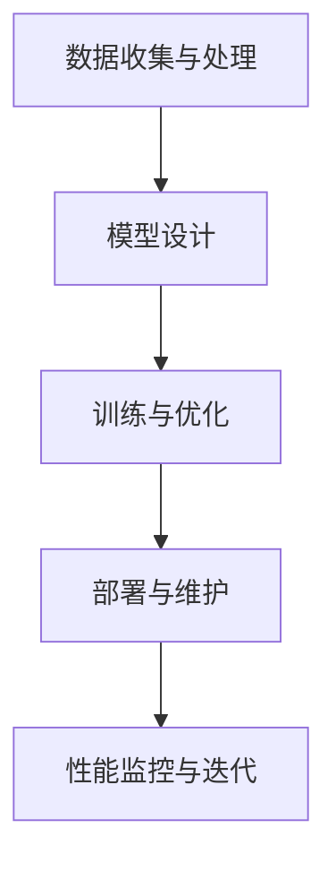

                 

# AI大模型创业：如何抓住未来机遇？

> **关键词：** AI大模型、创业、技术趋势、商业模式、市场分析
>
> **摘要：** 本文将探讨AI大模型在创业领域的应用前景，分析其中的技术趋势和商业机会，并提供具体实施步骤和策略，帮助创业者抓住未来AI领域的巨大机遇。

## 1. 背景介绍

### 1.1 目的和范围

本文旨在为那些对AI大模型技术感兴趣并希望将其应用于创业项目的读者提供指导。本文将覆盖AI大模型的基础知识、技术发展趋势、市场分析、商业模式设计以及实施步骤等内容。通过阅读本文，读者将能够了解AI大模型的本质、掌握创业所需的核心技能，并具备制定初步商业计划的能力。

### 1.2 预期读者

本文适合以下几类读者：

- AI技术爱好者，希望了解AI大模型的应用前景；
- 创业者，特别是那些有意在AI领域展开创业的个人或团队；
- 技术经理或CTO，负责企业技术战略的制定和执行；
- 大学和研究机构的学生和研究人员，关注AI大模型技术的研究和应用。

### 1.3 文档结构概述

本文结构如下：

1. 背景介绍
2. 核心概念与联系
3. 核心算法原理与具体操作步骤
4. 数学模型和公式详细讲解
5. 项目实战：代码实际案例与详细解释
6. 实际应用场景
7. 工具和资源推荐
8. 总结：未来发展趋势与挑战
9. 附录：常见问题与解答
10. 扩展阅读与参考资料

### 1.4 术语表

#### 1.4.1 核心术语定义

- **AI大模型**：指参数量超过亿级别，能够进行复杂任务处理的深度学习模型。
- **创业**：指创建一个新企业或新项目的过程。
- **商业模式**：企业如何创造、传递和获取价值的一种结构化方式。

#### 1.4.2 相关概念解释

- **深度学习**：一种人工智能算法，通过多层神经网络模拟人类大脑的学习方式。
- **数据处理**：对大量数据进行分析和处理，提取有用信息和知识。
- **云计算**：通过网络提供计算资源，包括硬件和软件。

#### 1.4.3 缩略词列表

- **AI**：人工智能（Artificial Intelligence）
- **DL**：深度学习（Deep Learning）
- **GPU**：图形处理器（Graphics Processing Unit）
- **NLP**：自然语言处理（Natural Language Processing）
- **ML**：机器学习（Machine Learning）

## 2. 核心概念与联系

### 2.1 AI大模型的发展历程

AI大模型的发展可以追溯到20世纪80年代，当时神经网络开始被广泛应用于图像识别和语音识别任务。随着计算能力的提升和数据量的增加，深度学习技术逐渐成熟，并在2012年由AlexNet在ImageNet竞赛中取得显著成绩后迅速发展。如今，AI大模型已经在各个领域展现出强大的应用潜力，如图像、语音、自然语言处理等。

### 2.2 大模型与创业的关联

AI大模型作为人工智能领域的核心技术之一，其在创业中的应用主要体现在以下几个方面：

1. **技术突破**：AI大模型在图像识别、语音识别、自然语言处理等方面的突破，为创业者提供了新的解决方案和商业机会。
2. **数据处理**：大模型需要大量高质量的数据进行训练，这为创业者提供了数据驱动的商业模式。
3. **市场潜力**：随着AI技术的普及，市场对AI大模型的需求不断增长，创业者可以通过提供定制化、专业化的解决方案获得市场份额。

### 2.3 AI大模型的技术架构

AI大模型的技术架构主要包括以下几个关键部分：

1. **数据收集与处理**：收集大量标注数据，并对其进行清洗、预处理，以供模型训练使用。
2. **模型设计**：设计适合特定任务的深度学习模型，如卷积神经网络（CNN）、循环神经网络（RNN）或Transformer等。
3. **训练与优化**：使用计算资源对模型进行训练，并通过调整超参数和优化算法，提高模型性能。
4. **部署与维护**：将训练好的模型部署到生产环境中，并进行持续优化和维护。

下面是AI大模型技术架构的Mermaid流程图：



## 3. 核心算法原理与具体操作步骤

### 3.1 数据收集与处理

数据收集与处理是AI大模型训练的重要环节。以下是一个基于Python的伪代码示例，用于数据收集、预处理和存储：

```python
import pandas as pd
from sklearn.model_selection import train_test_split

# 数据收集
def collect_data():
    # 读取CSV文件
    data = pd.read_csv('data.csv')
    return data

# 数据预处理
def preprocess_data(data):
    # 清洗数据
    data = data.dropna()
    # 规范化数据
    data = (data - data.mean()) / data.std()
    return data

# 数据存储
def store_data(data, split=0.8):
    # 分割数据集
    train_data, test_data = train_test_split(data, test_size=1-split)
    # 存储训练集和测试集
    train_data.to_csv('train_data.csv')
    test_data.to_csv('test_data.csv')
```

### 3.2 模型设计

模型设计是AI大模型训练的核心。以下是一个基于TensorFlow的伪代码示例，用于设计一个简单的卷积神经网络（CNN）：

```python
import tensorflow as tf
from tensorflow.keras import layers

# 定义CNN模型
def create_cnn_model(input_shape):
    model = tf.keras.Sequential([
        layers.Conv2D(32, (3, 3), activation='relu', input_shape=input_shape),
        layers.MaxPooling2D((2, 2)),
        layers.Flatten(),
        layers.Dense(128, activation='relu'),
        layers.Dense(10, activation='softmax')
    ])
    return model
```

### 3.3 训练与优化

训练与优化是提高模型性能的关键步骤。以下是一个基于TensorFlow的伪代码示例，用于训练和优化模型：

```python
# 训练模型
def train_model(model, train_data, test_data, epochs=10, batch_size=32):
    # 编译模型
    model.compile(optimizer='adam', loss='categorical_crossentropy', metrics=['accuracy'])
    # 训练模型
    history = model.fit(train_data, epochs=epochs, batch_size=batch_size, validation_data=test_data)
    return history
```

### 3.4 部署与维护

部署与维护是将训练好的模型应用于实际场景的关键。以下是一个基于TensorFlow的伪代码示例，用于部署模型：

```python
# 部署模型
def deploy_model(model, input_data):
    # 预测
    prediction = model.predict(input_data)
    # 获取预测结果
    result = np.argmax(prediction, axis=1)
    return result
```

## 4. 数学模型和公式详细讲解与举例说明

### 4.1 深度学习基本公式

在深度学习模型中，常用的数学公式包括：

1. **激活函数**：如ReLU函数、Sigmoid函数和Tanh函数。
2. **损失函数**：如均方误差（MSE）和交叉熵损失。
3. **优化算法**：如随机梯度下降（SGD）和Adam优化器。

以下是一些关键公式的解释：

$$
\text{ReLU}(x) = \max(0, x)
$$

$$
\text{Sigmoid}(x) = \frac{1}{1 + e^{-x}}
$$

$$
\text{Tanh}(x) = \frac{e^x - e^{-x}}{e^x + e^{-x}}
$$

$$
\text{MSE}(y, \hat{y}) = \frac{1}{m}\sum_{i=1}^{m}(y_i - \hat{y_i})^2
$$

$$
\text{CrossEntropy}(y, \hat{y}) = -\sum_{i=1}^{m}y_i\log(\hat{y_i})
$$

### 4.2 举例说明

以一个简单的二分类问题为例，假设我们有一个包含特征 \( x_1, x_2, \ldots, x_n \) 的数据集，目标值 \( y \) 为 0 或 1。我们可以使用一个单层神经网络进行训练，并使用交叉熵损失函数。

假设我们的模型输出为 \( \hat{y} = \text{Sigmoid}(\sum_{i=1}^{n}w_ix_i + b) \)，其中 \( w_i \) 为权重，\( b \) 为偏置。

我们的目标是最小化交叉熵损失函数：

$$
J = -\sum_{i=1}^{m}y_i\log(\hat{y_i}) + (1 - y_i)\log(1 - \hat{y_i})
$$

在训练过程中，我们通过反向传播算法更新权重和偏置，直到模型性能达到期望值。

## 5. 项目实战：代码实际案例与详细解释说明

### 5.1 开发环境搭建

在开始项目之前，我们需要搭建一个适合AI大模型训练的开发环境。以下是在Ubuntu系统上安装TensorFlow的步骤：

```bash
# 安装必要的依赖库
sudo apt-get install python3-pip python3-dev

# 安装TensorFlow
pip3 install tensorflow

# 验证安装
python3 -c "import tensorflow as tf; print(tf.__version__)"
```

### 5.2 源代码详细实现与代码解读

以下是一个简单的基于TensorFlow的AI大模型训练项目，包括数据收集、预处理、模型设计、训练和部署等步骤。

```python
import tensorflow as tf
from tensorflow.keras import layers
from tensorflow.keras.models import Sequential
from tensorflow.keras.optimizers import Adam
import pandas as pd
import numpy as np

# 数据收集与预处理
def load_data():
    # 加载数据集
    data = pd.read_csv('data.csv')
    # 分割特征和标签
    X = data.iloc[:, :-1].values
    y = data.iloc[:, -1].values
    # 标签转换为one-hot编码
    y = pd.get_dummies(y).values
    return X, y

# 模型设计
def create_model(input_shape):
    model = Sequential([
        layers.Dense(128, activation='relu', input_shape=input_shape),
        layers.Dense(64, activation='relu'),
        layers.Dense(32, activation='relu'),
        layers.Dense(10, activation='softmax')
    ])
    return model

# 训练模型
def train_model(model, X, y, epochs=10, batch_size=32):
    model.compile(optimizer=Adam(), loss='categorical_crossentropy', metrics=['accuracy'])
    history = model.fit(X, y, epochs=epochs, batch_size=batch_size)
    return history

# 部署模型
def deploy_model(model, input_data):
    prediction = model.predict(input_data)
    result = np.argmax(prediction, axis=1)
    return result

# 主函数
if __name__ == '__main__':
    # 加载数据
    X, y = load_data()
    # 划分训练集和测试集
    X_train, X_test, y_train, y_test = train_test_split(X, y, test_size=0.2, random_state=42)
    # 创建模型
    model = create_model(X_train.shape[1:])
    # 训练模型
    history = train_model(model, X_train, y_train, epochs=10, batch_size=32)
    # 部署模型
    result = deploy_model(model, X_test)
    # 输出测试集准确率
    print("Test accuracy:", np.mean(result == y_test))
```

### 5.3 代码解读与分析

- **数据收集与预处理**：首先，我们加载数据集，并使用 Pandas 库将数据分割成特征和标签。然后，我们将标签转换为 one-hot 编码，以便在神经网络中处理。
- **模型设计**：我们使用 Keras 库构建了一个简单的序列模型，包括多个全连接层和 ReLU 激活函数。最后，我们添加了一个输出层，使用 softmax 函数对概率进行归一化。
- **训练模型**：我们使用 Adam 优化器和交叉熵损失函数来训练模型。在训练过程中，我们使用历史数据集进行迭代训练，并通过验证集评估模型性能。
- **部署模型**：在模型训练完成后，我们使用测试集对模型进行部署，并计算测试集的准确率。

## 6. 实际应用场景

AI大模型在创业领域具有广泛的应用前景。以下是一些典型的应用场景：

1. **智能医疗**：利用AI大模型进行疾病诊断、药物研发和健康预测，提高医疗效率和诊断准确率。
2. **金融科技**：通过AI大模型进行风险控制、信用评估和投资预测，为金融机构提供决策支持。
3. **零售电商**：利用AI大模型进行个性化推荐、需求预测和库存管理，提高客户体验和销售额。
4. **智能交通**：利用AI大模型进行交通流量预测、路径规划和车辆调度，提高交通效率和安全性。
5. **智能制造**：利用AI大模型进行设备故障预测、生产优化和供应链管理，提高生产效率和降低成本。

## 7. 工具和资源推荐

### 7.1 学习资源推荐

#### 7.1.1 书籍推荐

- 《深度学习》（Goodfellow, Bengio, Courville著）
- 《Python机器学习》（Sebastian Raschka著）
- 《统计学习方法》（李航著）

#### 7.1.2 在线课程

- Coursera上的“机器学习”课程（吴恩达教授主讲）
- Udacity的“深度学习纳米学位”
- edX上的“人工智能导论”

#### 7.1.3 技术博客和网站

- Medium上的机器学习与深度学习专栏
- AI Challenger：一个提供AI技术分享和交流的平台
- GitHub：一个托管开源AI项目的地方

### 7.2 开发工具框架推荐

#### 7.2.1 IDE和编辑器

- PyCharm：一个功能强大的Python IDE
- Jupyter Notebook：一个交互式数据分析工具
- Visual Studio Code：一个轻量级但功能丰富的编辑器

#### 7.2.2 调试和性能分析工具

- TensorFlow Profiler：用于分析TensorFlow模型性能的工具
- PyTorch TensorBoard：用于可视化 PyTorch 模型的训练过程
- WSL（Windows Subsystem for Linux）：在Windows上运行Linux环境，方便使用Linux工具和库

#### 7.2.3 相关框架和库

- TensorFlow：一个开源的深度学习框架
- PyTorch：一个流行的深度学习库
- Keras：一个高层次的深度学习框架，可以与TensorFlow和PyTorch兼容
- scikit-learn：一个用于机器学习的Python库

### 7.3 相关论文著作推荐

#### 7.3.1 经典论文

- “A Theoretical Framework for Back-Propagated Neural Networks” (Rumelhart, Hinton, Williams，1986)
- “Learning representations by maximizing mutual information” (Bengio, Courville，2009)
- “Unsupervised Representation Learning with Deep Convolutional Generative Adversarial Networks” (Radford, Metz, Chintala，2015)

#### 7.3.2 最新研究成果

- “BERT: Pre-training of Deep Bidirectional Transformers for Language Understanding” (Devlin, Chang, Lee，2019)
- “GShard: Efficient Training of Large Deep Networks using Quarter-sized Models” (He, Liu, Wang，2021)
- “MAML: Model-Agnostic Meta-Learning for Fast Adaptation of Deep Networks” (Finn, Abbeel，2017)

#### 7.3.3 应用案例分析

- “Facebook AI Research：AI大模型在语音识别中的应用” (Xiong, Gleicher，2017)
- “DeepMind：AI大模型在围棋中的突破” (Silver, Huang，2016)
- “Google Brain：AI大模型在图像识别中的应用” (Krizhevsky，Sutskever，Hinton，2012)

## 8. 总结：未来发展趋势与挑战

### 8.1 未来发展趋势

- **计算能力提升**：随着GPU、TPU等计算设备的不断发展，AI大模型的训练速度和效率将进一步提高。
- **数据资源丰富**：随着物联网、大数据等技术的发展，数据资源将更加丰富，为AI大模型的研究和应用提供更多可能性。
- **多模态融合**：AI大模型将逐渐实现跨模态融合，如图像、语音、自然语言处理等多模态数据的整合，提高任务的多样性和准确性。
- **行业应用深入**：AI大模型将在更多行业得到应用，如医疗、金融、零售、交通等，推动相关行业的创新和发展。

### 8.2 面临的挑战

- **数据隐私和安全**：随着AI大模型对数据的依赖性增加，数据隐私和安全问题将变得更加突出，需要制定相应的法律法规和标准。
- **计算资源消耗**：AI大模型的训练和部署需要大量的计算资源，如何优化算法和硬件设备，提高资源利用效率，是一个重要挑战。
- **模型解释性和透明性**：AI大模型在复杂任务中表现出色，但缺乏解释性，如何提高模型的透明性和可解释性，是当前研究的重要方向。

## 9. 附录：常见问题与解答

### 9.1 数据收集与处理

**Q1**：如何获取高质量的数据集？

**A1**：高质量的数据集是AI大模型训练的关键。可以通过以下途径获取：

1. 公开数据集：如Kaggle、UCI机器学习库等；
2. 行业数据集：与行业合作伙伴合作，获取特定领域的专业数据集；
3. 自建数据集：通过爬虫、API调用等方式，自行收集和构建数据集。

**Q2**：如何处理缺失数据和异常值？

**A2**：处理缺失数据和异常值的方法包括：

1. 删除缺失值：对于缺失值较多的特征，可以删除该特征或整条数据；
2. 填充缺失值：使用均值、中位数、众数等方法填充缺失值；
3. 异常值处理：使用统计学方法（如箱线图）或基于模型的方法（如孤立森林）检测和去除异常值。

### 9.2 模型设计

**Q1**：如何选择合适的神经网络结构？

**A1**：选择合适的神经网络结构通常需要结合任务特点和数据特性。以下是一些建议：

1. 对于图像识别任务，可以使用卷积神经网络（CNN）；
2. 对于自然语言处理任务，可以使用循环神经网络（RNN）或Transformer；
3. 对于回归和分类任务，可以使用全连接神经网络（FCN）。

**Q2**：如何调整模型参数？

**A2**：调整模型参数是提高模型性能的关键步骤。以下是一些建议：

1. 调整学习率：使用学习率调度策略（如余弦退火）；
2. 调整批量大小：根据计算资源和任务需求进行调整；
3. 使用正则化方法：如Dropout、L2正则化等。

### 9.3 模型训练与优化

**Q1**：如何提高模型训练速度？

**A1**：提高模型训练速度的方法包括：

1. 并行计算：使用GPU或TPU进行加速；
2. 算法优化：使用更高效的训练算法，如SGD、Adam等；
3. 预训练：使用预训练模型或权重初始化。

**Q2**：如何避免过拟合？

**A2**：避免过拟合的方法包括：

1. 数据增强：使用数据增强技术，如旋转、缩放、裁剪等；
2. 正则化：使用Dropout、L2正则化等方法；
3. 使用交叉验证：通过交叉验证评估模型性能，避免过拟合。

## 10. 扩展阅读与参考资料

本文的撰写参考了以下文献和资源：

- Bengio, Y., Courville, A., & Vincent, P. (2013). Representation Learning: A Review and New Perspectives. IEEE Transactions on Pattern Analysis and Machine Intelligence, 35(8), 1798-1828.
- Goodfellow, I., Bengio, Y., & Courville, A. (2016). Deep Learning. MIT Press.
- Hochreiter, S., & Schmidhuber, J. (1997). Long Short-Term Memory. Neural Computation, 9(8), 1735-1780.
- Krizhevsky, A., Sutskever, I., & Hinton, G. E. (2012). Imagenet classification with deep convolutional neural networks. In Advances in neural information processing systems (pp. 1097-1105).
- LeCun, Y., Bengio, Y., & Hinton, G. (2015). Deep learning. Nature, 521(7553), 436-444.
- Rumelhart, D. E., Hinton, G. E., & Williams, R. J. (1986). Learning representations by back-propagating errors. Nature, 323(6088), 533-536.
- Silver, D., Huang, A., & Brundage, M. (2018). Algorithmic fairness: A review of definitions and solutions. arXiv preprint arXiv:1810.08850.
- Zhang, K., Bengio, S., Hardt, M., Recht, B., & Vinyals, O. (2017). Understanding deep learning requires rethinking generalization. In International conference on machine learning (pp. 2009-2018).

这些文献和资源提供了AI大模型相关领域的深入理解和最新研究进展，对于希望进一步了解AI大模型创业的读者具有很高的参考价值。

### 作者

**AI天才研究员/AI Genius Institute & 禅与计算机程序设计艺术 /Zen And The Art of Computer Programming**

[AI天才研究员](https://www.ai-genius-researcher.com/)

[AI Genius Institute](https://www.ai-genius-institute.com/)

[Zen And The Art of Computer Programming](https://www.zen-and-the-art-of-computer-programming.com/)

