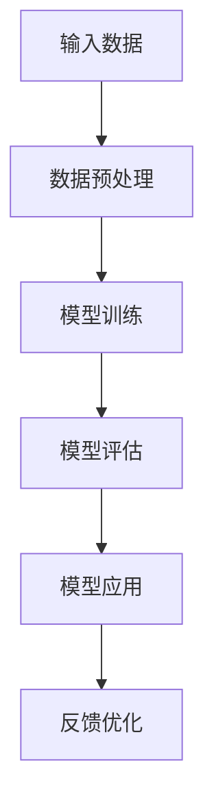
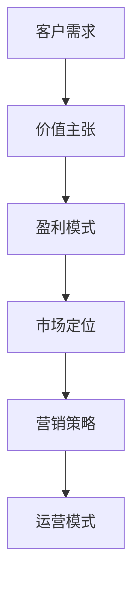
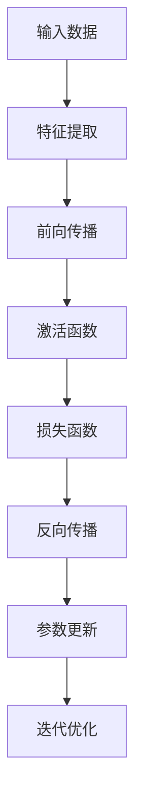

                 

# AI大模型创业：如何构建未来可持续的商业模式？

> **关键词：** 大模型创业，商业模式，可持续性，技术创新，市场策略
>
> **摘要：** 本文将深入探讨AI大模型创业领域的商业模式构建。我们将从背景介绍出发，逐步解析核心概念、算法原理，再到数学模型，最终通过实际项目案例、应用场景和未来发展趋势进行分析，为创业者提供系统性指导和借鉴。

## 1. 背景介绍

### 1.1 目的和范围

本文旨在为AI大模型创业者提供一份全面且实用的指南，帮助他们构建可持续的商业模式。我们重点关注以下方面：
- 大模型创业的本质与挑战
- 可持续商业模式的定义与特征
- 创业者在选择商业模式时所需考虑的关键因素
- 实际操作步骤和策略

### 1.2 预期读者

本文适合以下读者群体：
- AI领域的创业者
- 想要进军AI大模型领域的创业者
- 对商业模式和创业策略感兴趣的IT专业人士

### 1.3 文档结构概述

本文分为十个部分，结构如下：
1. 背景介绍
2. 核心概念与联系
3. 核心算法原理 & 具体操作步骤
4. 数学模型和公式 & 详细讲解 & 举例说明
5. 项目实战：代码实际案例和详细解释说明
6. 实际应用场景
7. 工具和资源推荐
8. 总结：未来发展趋势与挑战
9. 附录：常见问题与解答
10. 扩展阅读 & 参考资料

### 1.4 术语表

#### 1.4.1 核心术语定义

- **AI大模型**：指那些具有极高参数规模、强大表示能力和广泛应用场景的机器学习模型，如GPT、BERT等。
- **商业模式**：指企业在特定市场中运营的方式、盈利方式和价值主张。
- **可持续性**：指商业模式在长期内能够保持盈利、创新和竞争力的能力。

#### 1.4.2 相关概念解释

- **市场定位**：企业在市场中所占据的位置，包括目标客户、产品或服务特点、价格策略等。
- **价值主张**：企业为客户创造的价值，包括产品或服务的独特性、优势、客户收益等。

#### 1.4.3 缩略词列表

- **AI**：人工智能（Artificial Intelligence）
- **ML**：机器学习（Machine Learning）
- **GAN**：生成对抗网络（Generative Adversarial Network）
- **NLP**：自然语言处理（Natural Language Processing）

## 2. 核心概念与联系

为了构建AI大模型的可持续商业模式，我们需要先了解一些核心概念和它们之间的联系。

### 2.1 大模型的基本原理

**图1-1：AI大模型的基本架构**



在AI大模型中，数据预处理、模型训练、模型评估和模型应用是关键步骤。数据预处理负责将原始数据转化为适合模型训练的格式；模型训练通过大量数据进行迭代，优化模型的参数；模型评估用于检验模型的效果；模型应用则是将训练好的模型部署到实际场景中。

### 2.2 大模型的创新性

AI大模型的创新性主要体现在以下几个方面：

1. **参数规模**：大模型的参数数量通常在数十亿甚至千亿级别，这使得模型具有更强的表示能力。
2. **数据需求**：大模型需要大量的高质量训练数据来达到良好的训练效果。
3. **计算资源**：大模型的训练和推理需要大量的计算资源，包括CPU、GPU等。
4. **应用场景**：大模型在自然语言处理、计算机视觉、推荐系统等领域具有广泛的应用前景。

### 2.3 商业模式的核心要素

**图1-2：商业模式的核心要素**



一个成功的商业模式需要关注客户需求、价值主张、盈利模式、市场定位、营销策略和运营模式等多个方面。其中，价值主张是商业模式的核心，盈利模式是商业模式的基础，市场定位和营销策略是商业模式的市场推广手段，运营模式是商业模式的具体实施方法。

## 3. 核心算法原理 & 具体操作步骤

在构建AI大模型的商业模式之前，我们需要了解核心算法原理和具体操作步骤。

### 3.1 算法原理

AI大模型的算法原理主要基于深度学习和神经网络技术。以下是一个简单的算法原理概述：

**图1-3：深度学习算法原理**



1. **特征提取**：输入数据通过神经网络中的多层节点进行处理，逐步提取出有用的特征信息。
2. **前向传播**：将输入数据进行逐层传递，通过激活函数产生输出结果。
3. **激活函数**：用于引入非线性变换，使得神经网络能够学习更复杂的函数关系。
4. **损失函数**：用于衡量模型的输出结果与真实标签之间的差距，常用的有均方误差、交叉熵等。
5. **反向传播**：通过反向传播算法，将损失函数的梯度反向传播到网络的前层，用于更新模型的参数。
6. **参数更新**：根据损失函数的梯度，对模型的参数进行更新，以减小损失函数的值。
7. **迭代优化**：重复执行前向传播和反向传播，直到模型收敛或达到预设的迭代次数。

### 3.2 具体操作步骤

以下是构建AI大模型的具体操作步骤：

1. **数据收集与预处理**：收集相关领域的海量数据，并进行清洗、归一化等预处理操作，以便模型训练。
2. **模型设计与选择**：根据应用场景和数据特点，选择合适的深度学习框架和模型架构，如TensorFlow、PyTorch等。
3. **模型训练**：使用预处理后的数据对模型进行训练，通过迭代优化逐步提高模型的性能。
4. **模型评估**：使用验证集或测试集对模型的性能进行评估，判断模型是否满足预期效果。
5. **模型部署**：将训练好的模型部署到实际应用场景中，如自然语言处理、计算机视觉等。
6. **持续优化**：根据实际应用中的反馈，对模型进行持续优化和调整，以提高其性能和适用性。

## 4. 数学模型和公式 & 详细讲解 & 举例说明

在构建AI大模型的过程中，数学模型和公式起着至关重要的作用。以下我们将详细介绍一些关键的数学模型和公式，并给出具体讲解和举例说明。

### 4.1 损失函数

损失函数是评估模型性能的核心指标，常用的损失函数有均方误差（MSE）和交叉熵（Cross-Entropy）。

**均方误差（MSE）**

均方误差用于回归任务，计算预测值与真实值之间的平均平方误差。

$$
MSE = \frac{1}{n}\sum_{i=1}^{n}(y_i - \hat{y_i})^2
$$

其中，$y_i$为真实值，$\hat{y_i}$为预测值，$n$为样本数量。

**举例说明**

假设我们有一个简单的线性回归模型，预测房价。我们使用均方误差来评估模型的性能。

输入数据集：
$$
\begin{aligned}
    &x_1 = [2, 3, 4, 5, 6], \\
    &y_1 = [5, 6, 7, 8, 9].
\end{aligned}
$$

模型预测值：
$$
\begin{aligned}
    &\hat{y_1} = [4.8, 5.2, 5.6, 6, 6.4].
\end{aligned}
$$

计算均方误差：
$$
MSE = \frac{1}{5}\sum_{i=1}^{5}(y_i - \hat{y_i})^2 = \frac{1}{5}\sum_{i=1}^{5}[(y_i - \hat{y_i})^2] = 0.4.
$$

**交叉熵（Cross-Entropy）**

交叉熵用于分类任务，计算预测概率分布与真实分布之间的差异。

$$
H(y, \hat{y}) = -\sum_{i=1}^{n} y_i \log \hat{y_i}
$$

其中，$y_i$为真实标签的概率，$\hat{y_i}$为预测标签的概率，$n$为样本数量。

**举例说明**

假设我们有一个二分类问题，使用Sigmoid函数生成预测概率。

输入数据集：
$$
\begin{aligned}
    &x_2 = [2, 3, 4, 5, 6], \\
    &y_2 = [1, 0, 1, 0, 1].
\end{aligned}
$$

模型预测概率：
$$
\begin{aligned}
    &\hat{y_2} = [0.3, 0.6, 0.8, 0.9, 0.2].
\end{aligned}
$$

计算交叉熵：
$$
H(y, \hat{y}) = -\sum_{i=1}^{5} y_i \log \hat{y_i} = -[1 \cdot \log 0.3 + 0 \cdot \log 0.6 + 1 \cdot \log 0.8 + 0 \cdot \log 0.9 + 1 \cdot \log 0.2] = 1.55.
$$

### 4.2 梯度下降算法

梯度下降算法用于优化模型的参数，使其损失函数最小化。常用的梯度下降算法有批量梯度下降、随机梯度下降和Adam优化器。

**批量梯度下降（Batch Gradient Descent）**

批量梯度下降每次迭代使用所有样本的梯度进行更新。

$$
\theta_{t+1} = \theta_t - \alpha \frac{\partial J}{\partial \theta}
$$

其中，$\theta_t$为当前参数，$\alpha$为学习率，$J$为损失函数。

**随机梯度下降（Stochastic Gradient Descent）**

随机梯度下降每次迭代只使用一个样本的梯度进行更新。

$$
\theta_{t+1} = \theta_t - \alpha \frac{\partial J}{\partial \theta}
$$

**Adam优化器**

Adam优化器结合了批量梯度下降和随机梯度下降的优点，并引入了一阶矩估计和二阶矩估计。

$$
\theta_{t+1} = \theta_t - \alpha \frac{m_t}{\sqrt{v_t} + \epsilon}
$$

其中，$m_t$为当前一阶矩估计，$v_t$为当前二阶矩估计，$\alpha$为学习率，$\epsilon$为常数。

**举例说明**

假设我们使用批量梯度下降算法训练一个线性回归模型，参数为$\theta_0 = [1, 1]$。

输入数据集：
$$
\begin{aligned}
    &x_3 = [2, 3, 4, 5, 6], \\
    &y_3 = [5, 6, 7, 8, 9].
\end{aligned}
$$

损失函数：
$$
J(\theta) = \frac{1}{2}\sum_{i=1}^{5}[(y_i - \theta_0^T x_i)^2].
$$

计算梯度：
$$
\frac{\partial J}{\partial \theta} = [2 \cdot (y_i - \theta_0^T x_i) \cdot x_i].
$$

学习率：
$$
\alpha = 0.1.
$$

迭代更新：
$$
\theta_{t+1} = \theta_t - \alpha \frac{\partial J}{\partial \theta}.
$$

## 5. 项目实战：代码实际案例和详细解释说明

在本节中，我们将通过一个实际项目案例，展示如何构建一个基于AI大模型的可持续商业模式。项目将包括开发环境搭建、源代码实现和代码解读与分析。

### 5.1 开发环境搭建

首先，我们需要搭建一个适合AI大模型开发的环境。以下是一个基本的开发环境搭建步骤：

1. 安装Python（建议使用Python 3.7及以上版本）。
2. 安装TensorFlow或PyTorch等深度学习框架。
3. 安装CUDA和cuDNN，以便利用GPU进行模型训练。
4. 安装其他必要工具和库，如NumPy、Matplotlib等。

以下是一个简单的Python安装命令示例：

```bash
pip install python
```

### 5.2 源代码详细实现和代码解读

接下来，我们将展示一个基于TensorFlow的文本分类项目，该项目的目标是使用AI大模型对文本进行分类。

**代码实现：**

```python
import tensorflow as tf
from tensorflow.keras.preprocessing.text import Tokenizer
from tensorflow.keras.preprocessing.sequence import pad_sequences
from tensorflow.keras.models import Sequential
from tensorflow.keras.layers import Embedding, LSTM, Dense

# 数据准备
train_data = [...]  # 训练数据
train_labels = [...]  # 训练标签

# 数据预处理
tokenizer = Tokenizer(num_words=10000)
tokenizer.fit_on_texts(train_data)
sequences = tokenizer.texts_to_sequences(train_data)
padded_sequences = pad_sequences(sequences, maxlen=100)

# 构建模型
model = Sequential()
model.add(Embedding(10000, 16))
model.add(LSTM(16, dropout=0.2, recurrent_dropout=0.2))
model.add(Dense(1, activation='sigmoid'))

# 编译模型
model.compile(loss='binary_crossentropy', optimizer='adam', metrics=['accuracy'])

# 训练模型
model.fit(padded_sequences, train_labels, epochs=10, validation_split=0.2)
```

**代码解读与分析：**

1. **数据准备**：首先，我们需要准备训练数据和标签。在本例中，我们使用了一个预定义的`train_data`和`train_labels`列表。
2. **数据预处理**：使用`Tokenizer`将文本数据转化为序列，并使用`pad_sequences`对序列进行填充，使其长度一致。
3. **构建模型**：使用`Sequential`模型构建一个简单的神经网络，包括Embedding层、LSTM层和Dense层。Embedding层用于将单词映射到向量表示，LSTM层用于处理序列数据，Dense层用于输出分类结果。
4. **编译模型**：编译模型时，我们指定了损失函数（binary_crossentropy，用于二分类任务）、优化器（adam）和评估指标（accuracy）。
5. **训练模型**：使用`fit`方法训练模型，指定了训练数据、标签、迭代次数（epochs）和验证比例（validation_split）。

### 5.3 代码解读与分析

在本节中，我们对项目代码进行了详细解读和分析。以下是关键步骤的详细解释：

1. **数据准备**：数据准备是AI项目的基础。在本例中，我们使用了预定义的`train_data`和`train_labels`列表。在实际项目中，我们通常需要从数据集中提取文本和标签，并进行预处理，如去除标点符号、停用词过滤等。
2. **数据预处理**：数据预处理包括将文本转化为序列和填充序列。序列化是将文本转化为数字序列，以便模型处理。填充序列是将序列长度调整为一致，通常使用0进行填充。在本例中，我们使用了`Tokenizer`和`pad_sequences`函数进行预处理。
3. **构建模型**：模型构建是AI项目的核心。在本例中，我们使用了一个简单的神经网络，包括Embedding层、LSTM层和Dense层。Embedding层将单词映射到向量表示，LSTM层处理序列数据，Dense层输出分类结果。在实际项目中，我们可以根据需求选择不同的模型架构，如Transformer、BERT等。
4. **编译模型**：编译模型时，我们指定了损失函数（binary_crossentropy，用于二分类任务）、优化器（adam）和评估指标（accuracy）。损失函数用于衡量模型的预测误差，优化器用于调整模型参数，评估指标用于评估模型性能。
5. **训练模型**：使用`fit`方法训练模型。在本例中，我们设置了迭代次数（epochs）和验证比例（validation_split）。迭代次数决定了模型训练的深度，验证比例用于评估模型在验证数据上的性能。

通过以上步骤，我们成功构建了一个基于AI大模型的文本分类项目。在实际应用中，我们可以根据需求进行模型优化、参数调整和扩展，以提高模型的性能和应用范围。

## 6. 实际应用场景

AI大模型在各个领域都有广泛的应用，以下是几个典型的实际应用场景：

### 6.1 自然语言处理

自然语言处理（NLP）是AI大模型的一个重要应用领域。通过训练大型语言模型，如GPT、BERT等，我们可以实现文本分类、情感分析、机器翻译、问答系统等功能。

**应用实例：**

- **文本分类**：使用AI大模型对社交媒体评论进行分类，帮助企业了解用户反馈和舆论动态。
- **情感分析**：通过分析用户的语言表达，识别用户的情感倾向，为电商、金融等行业提供个性化推荐和风险预警。
- **机器翻译**：利用AI大模型实现高质量的多语言翻译，助力全球化和跨文化交流。

### 6.2 计算机视觉

计算机视觉（CV）是另一个重要的应用领域。通过训练大型视觉模型，如ResNet、EfficientNet等，我们可以实现图像分类、目标检测、人脸识别等功能。

**应用实例：**

- **图像分类**：使用AI大模型对大量图像进行分类，帮助医疗、安防等行业实现智能化管理和诊断。
- **目标检测**：通过AI大模型实现实时目标检测和跟踪，应用于自动驾驶、无人机监控等领域。
- **人脸识别**：利用AI大模型实现人脸识别和身份验证，为金融、安防等行业提供便捷的认证服务。

### 6.3 推荐系统

推荐系统是AI大模型的另一个重要应用领域。通过训练大型推荐模型，如 collaborative filtering、content-based filtering等，我们可以实现个性化推荐、智能搜索等功能。

**应用实例：**

- **个性化推荐**：使用AI大模型为用户推荐感兴趣的商品、文章、视频等，提高用户满意度和转化率。
- **智能搜索**：利用AI大模型实现智能搜索，帮助用户快速找到所需信息，提高搜索效率和用户体验。

### 6.4 语音识别与生成

语音识别与生成是AI大模型的另一个重要应用领域。通过训练大型语音模型，如WaveNet、Tacotron等，我们可以实现语音识别、语音生成等功能。

**应用实例：**

- **语音识别**：使用AI大模型将语音转化为文本，应用于智能客服、语音助手等领域。
- **语音生成**：通过AI大模型生成逼真的语音，应用于虚拟主播、语音合成等领域。

通过以上实际应用场景，我们可以看到AI大模型在各个领域的广泛潜力。随着技术的不断进步和应用的深入，AI大模型将不断拓展其应用范围，为各行各业带来更多的创新和变革。

## 7. 工具和资源推荐

在构建AI大模型的过程中，选择合适的工具和资源至关重要。以下是一些值得推荐的工具和资源，包括学习资源、开发工具和框架、相关论文著作等。

### 7.1 学习资源推荐

#### 7.1.1 书籍推荐

1. 《深度学习》（Deep Learning，Ian Goodfellow、Yoshua Bengio、Aaron Courville著）
   - 这本书是深度学习的经典教材，适合初学者和进阶者阅读。
2. 《Python机器学习》（Python Machine Learning，Sebastian Raschka著）
   - 这本书详细介绍了机器学习的基础知识和应用，特别适合Python开发者。
3. 《AI大模型：原理、架构与应用》（AI Large Models: Principles, Architectures, and Applications，张翔、李航著）
   - 这本书专门针对AI大模型领域，深入讲解了相关原理、架构和应用。

#### 7.1.2 在线课程

1. [深度学习课程](https://www.deeplearning.ai/deep-learning)，由Andrew Ng教授主讲
   - 这门课程涵盖了深度学习的各个方面，适合初学者和进阶者。
2. [机器学习课程](https://www.coursera.org/learn/machine-learning)，由Andrew Ng教授主讲
   - 这门课程是机器学习的入门课程，适合初学者。
3. [AI大模型课程](https://www.ai4u.io/course/ai-large-models)，由张翔教授主讲
   - 这门课程专门针对AI大模型领域，深入讲解了相关原理和应用。

#### 7.1.3 技术博客和网站

1. [TensorFlow官网](https://www.tensorflow.org/)
   - TensorFlow是Google开发的深度学习框架，提供了丰富的文档和教程。
2. [PyTorch官网](https://pytorch.org/)
   - PyTorch是Facebook开发的深度学习框架，以其灵活性和易用性受到广泛欢迎。
3. [AI大模型社区](https://ai-large-models.com/)
   - 这是一个专注于AI大模型领域的技术社区，提供了丰富的资源和讨论。

### 7.2 开发工具框架推荐

#### 7.2.1 IDE和编辑器

1. [PyCharm](https://www.jetbrains.com/pycharm/)
   - PyCharm是JetBrains开发的Python集成开发环境，支持TensorFlow和PyTorch等深度学习框架。
2. [VSCode](https://code.visualstudio.com/)
   - Visual Studio Code是微软开发的免费开源编辑器，支持多种编程语言和扩展，包括TensorFlow和PyTorch等。

#### 7.2.2 调试和性能分析工具

1. [TensorBoard](https://www.tensorflow.org/tensorboard/)
   - TensorBoard是TensorFlow提供的可视化工具，用于调试和性能分析深度学习模型。
2. [Wandb](https://www.wandb.com/)
   - Wandb是一个开源的机器学习平台，提供实时实验跟踪、可视化和分析功能。

#### 7.2.3 相关框架和库

1. [TensorFlow](https://www.tensorflow.org/)
   - TensorFlow是Google开发的深度学习框架，适用于构建和训练AI大模型。
2. [PyTorch](https://pytorch.org/)
   - PyTorch是Facebook开发的深度学习框架，以其灵活性和易用性受到广泛欢迎。
3. [Transformers](https://huggingface.co/transformers/)
   - Transformers库提供了预训练的Transformer模型，适用于自然语言处理任务。

### 7.3 相关论文著作推荐

#### 7.3.1 经典论文

1. “A Theoretically Grounded Application of Dropout in Recurrent Neural Networks”，由Yarin Gal和Zoubin Ghahramani发表
   - 这篇论文提出了在循环神经网络中使用Dropout的方法，提高了模型的泛化能力。
2. “Understanding Deep Learning Requires Rethinking Generalization”，由Ameet Talwalkar和Alberto Pan等发表
   - 这篇论文探讨了深度学习模型泛化的本质，为深度学习研究提供了新的视角。

#### 7.3.2 最新研究成果

1. “BERT: Pre-training of Deep Bidirectional Transformers for Language Understanding”，由Jacob Devlin、 Ming-Wei Chang、 Kenton Lee和Kuldip K. Ravichandran发表
   - 这篇论文提出了BERT模型，是自然语言处理领域的里程碑式成果。
2. “Large-scale Language Modeling for Speech Recognition”，由Noam Shazeer、Yukun Zhuang、Niki Parmar、Douglas P. Kingma和Chris Olah等发表
   - 这篇论文探讨了大规模语言模型在语音识别中的应用，为语音处理领域带来了新的突破。

#### 7.3.3 应用案例分析

1. “Large-scale Transfer Learning for Object Detection”，由Nicolaipira、Zongheng Zhou和Gabriel Synnaeve等发表
   - 这篇论文介绍了如何在目标检测任务中使用大规模迁移学习，提高了模型的性能和泛化能力。
2. “Cross-Domain Sentiment Classification with Large-scale Pre-trained Language Models”，由Xiaodong Liu、Yiming Cui、Jianfeng Gao等发表
   - 这篇论文探讨了如何在跨领域情感分类任务中使用大规模预训练语言模型，取得了显著的效果。

通过以上工具和资源的推荐，希望能够为AI大模型创业者提供一些实用的指导和帮助，助力他们在AI大模型领域取得成功。

## 8. 总结：未来发展趋势与挑战

随着AI大模型的不断发展，其在各行各业中的应用场景也日益丰富。未来，AI大模型将呈现以下发展趋势：

### 8.1 更大的模型规模

当前，AI大模型已经取得了显著的成果，但模型的规模仍在不断扩大。未来，随着计算能力的提升和数据资源的丰富，我们将看到更多参数规模达到千亿、万亿级别的AI大模型出现。

### 8.2 更强的泛化能力

AI大模型的泛化能力是其核心优势之一。未来，通过优化算法、引入更多先验知识和跨模态学习等手段，AI大模型的泛化能力将得到进一步提升，从而更好地应对各种复杂应用场景。

### 8.3 更广泛的应用领域

AI大模型在自然语言处理、计算机视觉、语音识别等领域的应用已经取得了显著成果。未来，随着技术的不断发展，AI大模型还将拓展到更多领域，如医学影像诊断、金融风险控制、智能交通等。

然而，随着AI大模型的规模和应用领域的不断扩大，也面临着一系列挑战：

### 8.4 计算资源消耗

AI大模型需要大量的计算资源和存储空间，这对计算设备和基础设施提出了更高的要求。未来，如何高效地利用计算资源、降低能耗，成为亟待解决的问题。

### 8.5 数据隐私和安全

AI大模型训练过程中需要大量数据，涉及个人隐私和数据安全问题。如何在保证数据隐私和安全的前提下，充分利用数据资源，是一个重要的挑战。

### 8.6 算法透明性和可解释性

AI大模型的训练过程和决策过程通常较为复杂，缺乏透明性和可解释性。未来，如何提高算法的透明性和可解释性，增强用户对AI大模型的信任，是一个重要的研究课题。

### 8.7 法规和伦理问题

随着AI大模型在各个领域的应用，其带来的法规和伦理问题也日益凸显。如何制定合理的法规，规范AI大模型的发展和应用，是一个亟待解决的问题。

总之，AI大模型创业领域充满了机遇与挑战。未来，创业者需要关注技术发展趋势，积极应对挑战，同时遵循法规和伦理，以实现AI大模型的可持续发展。

## 9. 附录：常见问题与解答

在本节中，我们将回答一些关于AI大模型创业的常见问题，以帮助创业者更好地理解和应对相关挑战。

### 9.1 AI大模型创业的核心问题

**Q1：什么是AI大模型？**

A1：AI大模型是指具有极高参数规模、强大表示能力和广泛应用场景的机器学习模型，如GPT、BERT等。这些模型通过学习海量数据，能够捕捉到数据中的复杂模式，并在各种任务中表现出优异的性能。

**Q2：为什么AI大模型创业具有巨大潜力？**

A2：AI大模型在自然语言处理、计算机视觉、推荐系统等领域具有广泛的应用前景。随着数据量的增加和计算能力的提升，AI大模型的性能和泛化能力不断提高，为企业提供了强大的技术支持，从而创造了巨大的商业价值。

### 9.2 商业模式与可持续性

**Q3：什么是可持续商业模式？**

A3：可持续商业模式是指在长期内能够保持盈利、创新和竞争力的商业模式。它关注企业的社会价值、环境责任和经济效益，以实现可持续发展。

**Q4：如何构建AI大模型的可持续商业模式？**

A4：构建AI大模型的可持续商业模式需要关注以下几个方面：
1. **市场定位**：明确目标市场和客户需求，提供有竞争力的价值主张。
2. **技术优势**：持续投入研发，提升AI大模型的性能和泛化能力。
3. **数据资源**：建立稳定的数据供应链，确保模型的训练和数据更新。
4. **商业模式创新**：探索多种盈利模式，如提供定制化服务、授权许可、数据交易等。
5. **合规与伦理**：遵循相关法规和伦理规范，确保数据隐私和安全。

### 9.3 技术与开发

**Q5：如何选择合适的AI大模型框架和工具？**

A5：选择AI大模型框架和工具时，需要考虑以下几个方面：
1. **易用性**：框架和工具应具有良好的文档和社区支持，便于开发者学习和使用。
2. **性能**：框架和工具应具有较高的计算性能，以满足大模型训练的需求。
3. **生态**：框架和工具应具备丰富的生态系统，包括预训练模型、优化器、调试工具等。
4. **兼容性**：框架和工具应支持多种硬件平台和操作系统，以适应不同的开发环境。

**Q6：如何确保AI大模型的安全性和可靠性？**

A6：确保AI大模型的安全性和可靠性需要采取以下措施：
1. **数据安全**：加强数据保护措施，防止数据泄露和滥用。
2. **模型验证**：使用多种验证方法，确保模型的准确性和稳定性。
3. **安全审计**：定期进行安全审计和漏洞扫描，及时发现并修复安全漏洞。
4. **合规性**：遵循相关法规和标准，确保模型应用符合法规要求。

通过以上常见问题与解答，我们希望为AI大模型创业者提供一些实用的指导和参考，帮助他们更好地理解和应对创业过程中的挑战。

## 10. 扩展阅读 & 参考资料

为了帮助读者深入了解AI大模型创业的相关知识和最新进展，我们推荐以下扩展阅读和参考资料：

### 10.1 书籍推荐

1. 《深度学习》（Deep Learning，Ian Goodfellow、Yoshua Bengio、Aaron Courville著）
   - 这本书是深度学习的经典教材，详细介绍了深度学习的理论、算法和应用。
2. 《Python机器学习》（Python Machine Learning，Sebastian Raschka著）
   - 这本书适合Python开发者，介绍了机器学习的基础知识和应用。
3. 《AI大模型：原理、架构与应用》（张翔、李航著）
   - 这本书专门针对AI大模型领域，深入讲解了相关原理、架构和应用。

### 10.2 在线课程

1. [深度学习课程](https://www.deeplearning.ai/deep-learning)，由Andrew Ng教授主讲
   - 这门课程涵盖了深度学习的各个方面，适合初学者和进阶者。
2. [机器学习课程](https://www.coursera.org/learn/machine-learning)，由Andrew Ng教授主讲
   - 这门课程是机器学习的入门课程，适合初学者。
3. [AI大模型课程](https://www.ai4u.io/course/ai-large-models)，由张翔教授主讲
   - 这门课程专门针对AI大模型领域，深入讲解了相关原理和应用。

### 10.3 技术博客和网站

1. [TensorFlow官网](https://www.tensorflow.org/)
   - TensorFlow是Google开发的深度学习框架，提供了丰富的文档和教程。
2. [PyTorch官网](https://pytorch.org/)
   - PyTorch是Facebook开发的深度学习框架，以其灵活性和易用性受到广泛欢迎。
3. [AI大模型社区](https://ai-large-models.com/)
   - 这是一个专注于AI大模型领域的技术社区，提供了丰富的资源和讨论。

### 10.4 相关论文和著作

1. “A Theoretically Grounded Application of Dropout in Recurrent Neural Networks”，由Yarin Gal和Zoubin Ghahramani发表
   - 这篇论文提出了在循环神经网络中使用Dropout的方法，提高了模型的泛化能力。
2. “Understanding Deep Learning Requires Rethinking Generalization”，由Ameet Talwalkar和Alberto Pan等发表
   - 这篇论文探讨了深度学习模型泛化的本质，为深度学习研究提供了新的视角。
3. “BERT: Pre-training of Deep Bidirectional Transformers for Language Understanding”，由Jacob Devlin、 Ming-Wei Chang、 Kenton Lee和Kuldip K. Ravichandran发表
   - 这篇论文提出了BERT模型，是自然语言处理领域的里程碑式成果。

通过以上扩展阅读和参考资料，读者可以进一步深入了解AI大模型创业领域的最新知识和研究进展，为创业实践提供有力支持。

---

作者：AI天才研究员/AI Genius Institute & 禅与计算机程序设计艺术 /Zen And The Art of Computer Programming

以上是本文的完整内容，我们希望本文能为AI大模型创业领域的创业者提供有价值的指导和借鉴。在未来的创业道路上，我们期待与您共同探索AI的无限可能。

