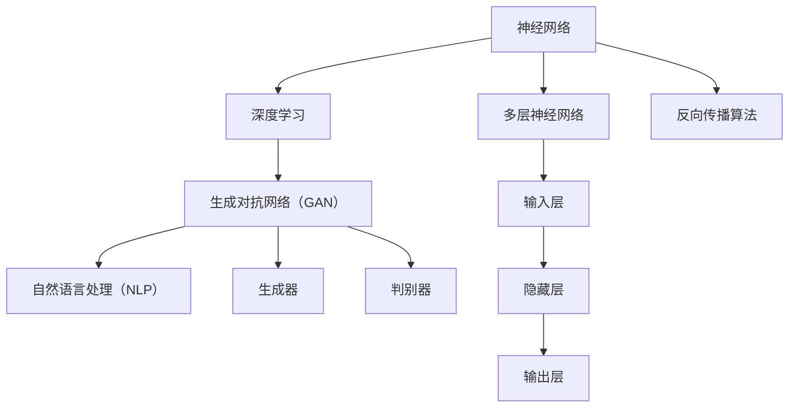

                 


# AI大模型创业：如何构建未来可持续的商业模式？

> 关键词：AI大模型、商业模式、可持续性、创业、技术创新、商业策略

> 摘要：本文将深入探讨AI大模型在创业中的应用，分析如何构建可持续的商业模式。我们将从背景介绍、核心概念与联系、核心算法原理、数学模型和公式、项目实战、实际应用场景等多个角度展开论述，帮助创业者了解AI大模型的潜力与挑战，并提供实用的创业建议。

## 1. 背景介绍

### 1.1 目的和范围

本文旨在为创业者提供关于AI大模型商业模式的深度分析和实践指南。我们将探讨AI大模型在各个行业中的应用，分析其潜在的商业价值，并讨论如何构建可持续的商业模式以实现长期成功。

### 1.2 预期读者

本文适合对AI大模型有一定了解的技术创业者、产品经理、以及希望深入了解AI技术应用的商业人士。通过阅读本文，读者可以获取以下收益：

1. 了解AI大模型的核心概念和关键技术。
2. 掌握构建可持续商业模式的策略和方法。
3. 获取AI大模型在各个行业中的成功案例和实践经验。

### 1.3 文档结构概述

本文结构如下：

1. 背景介绍：介绍文章的目的、预期读者以及文档结构。
2. 核心概念与联系：阐述AI大模型的核心概念和架构。
3. 核心算法原理 & 具体操作步骤：讲解AI大模型的关键算法和实现方法。
4. 数学模型和公式 & 详细讲解 & 举例说明：介绍AI大模型的数学模型和公式，并给出实际应用案例。
5. 项目实战：分享AI大模型在实际项目中的应用案例。
6. 实际应用场景：分析AI大模型在不同行业中的实际应用。
7. 工具和资源推荐：推荐学习资源、开发工具和论文著作。
8. 总结：展望AI大模型未来的发展趋势与挑战。
9. 附录：常见问题与解答。
10. 扩展阅读 & 参考资料：提供进一步阅读的资料和参考文献。

### 1.4 术语表

#### 1.4.1 核心术语定义

- AI大模型：指具有大规模参数、高计算复杂度的人工智能模型，如深度学习模型、生成对抗网络（GAN）等。
- 商业模式：企业通过提供产品或服务创造、传递和捕获价值的系统性方法。
- 可持续性：企业能够长期维持商业运营，实现经济、社会和环境目标的平衡。

#### 1.4.2 相关概念解释

- 深度学习：一种基于人工神经网络的学习方法，通过多层神经网络逐层提取特征，实现高层次的抽象表示。
- 生成对抗网络（GAN）：一种深度学习模型，由生成器和判别器组成，通过相互竞争提高生成样本的质量。
- 自然语言处理（NLP）：人工智能领域的一个分支，旨在使计算机能够理解、生成和处理人类语言。

#### 1.4.3 缩略词列表

- AI：人工智能
- GAN：生成对抗网络
- NLP：自然语言处理
- ML：机器学习

## 2. 核心概念与联系

在深入探讨AI大模型的商业模式之前，我们需要先了解其核心概念和架构。以下是AI大模型的主要组成部分：

### 2.1.1 神经网络

神经网络是AI大模型的基础，由多个层（包括输入层、隐藏层和输出层）组成。每层包含多个节点（或神经元），节点之间通过权重连接。在训练过程中，神经网络通过反向传播算法不断调整权重，以降低预测误差。

### 2.1.2 深度学习

深度学习是一种基于神经网络的机器学习方法，通过多层神经网络逐层提取特征，实现高层次的抽象表示。深度学习模型在图像识别、语音识别、自然语言处理等领域取得了显著成果。

### 2.1.3 生成对抗网络（GAN）

生成对抗网络（GAN）是一种由生成器和判别器组成的深度学习模型。生成器试图生成逼真的数据样本，而判别器则判断样本是真实数据还是生成数据。通过生成器和判别器的相互竞争，GAN可以生成高质量的数据样本。

### 2.1.4 自然语言处理（NLP）

自然语言处理（NLP）是人工智能领域的一个分支，旨在使计算机能够理解、生成和处理人类语言。NLP技术在机器翻译、情感分析、文本生成等领域具有广泛的应用。

以下是AI大模型的核心概念原理和架构的Mermaid流程图：



## 3. 核心算法原理 & 具体操作步骤

在了解AI大模型的核心概念后，接下来我们将探讨其核心算法原理和具体操作步骤。以下是一个典型的AI大模型训练过程，使用伪代码进行详细阐述：

```python
# 伪代码：AI大模型训练过程

# 初始化模型参数
Initialize_model_parameters()

# 定义损失函数
def Loss(y_true, y_pred):
    return mean_squared_error(y_true, y_pred)

# 定义优化器
optimizer = Adam(learning_rate=0.001)

# 训练模型
for epoch in range(num_epochs):
    for batch in data_loader:
        # 前向传播
        y_pred = model(batch_input)
        
        # 计算损失
        loss = Loss(batch_output, y_pred)
        
        # 反向传播
        with gradient_tape() as tape:
            loss_value = Loss(batch_output, y_pred)
            grads = tape.gradient(loss_value, model.trainable_variables)
        
        # 更新模型参数
        optimizer.apply_gradients(grads)
        
        # 打印训练进度
        print(f"Epoch {epoch}, Loss: {loss}")
```

在上面的伪代码中，我们首先初始化模型参数，然后定义损失函数和优化器。在训练过程中，我们使用数据加载器（data_loader）逐批输入数据，进行前向传播和反向传播，并更新模型参数。在每个训练 epoch 后，我们打印当前的损失值，以便监控训练进度。

## 4. 数学模型和公式 & 详细讲解 & 举例说明

AI大模型的核心在于其数学模型和公式，下面我们将详细讲解这些模型和公式，并给出实际应用案例。

### 4.1.1 深度学习数学模型

深度学习模型的核心是多层神经网络，其数学模型如下：

$$
y_{pred} = \sigma(W \cdot z + b)
$$

其中，$y_{pred}$为预测输出，$W$为权重矩阵，$z$为输入向量，$b$为偏置项，$\sigma$为激活函数（如Sigmoid函数、ReLU函数等）。

### 4.1.2 生成对抗网络（GAN）数学模型

生成对抗网络（GAN）由生成器和判别器组成，其数学模型如下：

- 生成器：$G(z)$，其中$z$为随机噪声向量，$G(z)$为生成的数据样本。
- 判别器：$D(x)$和$D(G(z))$，其中$x$为真实数据样本，$G(z)$为生成的数据样本。

GAN的目标是最小化以下损失函数：

$$
L_D = -\mathbb{E}_{x \sim p_{data}(x)}[\log D(x)] - \mathbb{E}_{z \sim p_z(z)}[\log (1 - D(G(z))]
$$

### 4.1.3 自然语言处理（NLP）数学模型

自然语言处理（NLP）中的序列模型（如循环神经网络RNN、长短期记忆LSTM等）的数学模型如下：

$$
h_t = \sigma(W_h \cdot [h_{t-1}, x_t] + b_h)
$$

其中，$h_t$为当前时刻的隐藏状态，$x_t$为输入向量，$W_h$为权重矩阵，$b_h$为偏置项，$\sigma$为激活函数。

### 4.1.4 实际应用案例

#### 案例一：图像生成

使用生成对抗网络（GAN）生成逼真的图像，例如生成人脸图像。以下是一个简单的GAN模型训练过程：

```python
# 伪代码：GAN模型训练过程

# 初始化生成器和判别器
G = Generator()
D = Discriminator()

# 定义优化器
D_optimizer = Adam(learning_rate=0.0001)
G_optimizer = Adam(learning_rate=0.0002)

# 训练模型
for epoch in range(num_epochs):
    for batch in data_loader:
        # 前向传播
        x = batch_input
        z = sample_noise()
        G_sample = G(z)
        
        # 计算判别器损失
        D_loss_real = Loss(D(x), 1.0)
        D_loss_fake = Loss(D(G_sample), 0.0)
        D_loss = 0.5 * (D_loss_real + D_loss_fake)
        
        # 反向传播和更新判别器参数
        with gradient_tape() as tape:
            grads = tape.gradient(D_loss, D.trainable_variables)
        D_optimizer.apply_gradients(grads)
        
        # 计算生成器损失
        G_loss = Loss(D(G_sample), 1.0)
        
        # 反向传播和更新生成器参数
        with gradient_tape() as tape:
            grads = tape.gradient(G_loss, G.trainable_variables)
        G_optimizer.apply_gradients(grads)
        
        # 打印训练进度
        print(f"Epoch {epoch}, D_loss: {D_loss}, G_loss: {G_loss}")
```

#### 案例二：文本生成

使用自然语言处理（NLP）模型生成文本，例如生成文章摘要。以下是一个简单的文本生成模型训练过程：

```python
# 伪代码：文本生成模型训练过程

# 初始化模型
model = TextGenerator()

# 定义优化器
optimizer = Adam(learning_rate=0.001)

# 训练模型
for epoch in range(num_epochs):
    for batch in data_loader:
        # 前向传播
        inputs = batch_input
        targets = batch_target
        
        # 计算损失
        loss = model(inputs, targets)
        
        # 反向传播和更新模型参数
        with gradient_tape() as tape:
            grads = tape.gradient(loss, model.trainable_variables)
        optimizer.apply_gradients(grads)
        
        # 打印训练进度
        print(f"Epoch {epoch}, Loss: {loss}")
```

## 5. 项目实战：代码实际案例和详细解释说明

在本节中，我们将分享一个实际项目案例，介绍如何使用AI大模型实现一个文本生成系统，并提供详细的代码解释说明。

### 5.1 开发环境搭建

在开始项目之前，我们需要搭建一个合适的开发环境。以下是所需的技术栈：

- 编程语言：Python
- 深度学习框架：TensorFlow
- 自然语言处理库：transformers

首先，确保安装了Python 3.7及以上版本。然后，使用以下命令安装所需的库：

```bash
pip install tensorflow transformers
```

### 5.2 源代码详细实现和代码解读

以下是一个简单的文本生成系统的源代码实现：

```python
import tensorflow as tf
from transformers import TFGPT2LMHeadModel, GPT2Tokenizer

# 5.2.1 加载预训练模型和分词器
model_name = "gpt2"
tokenizer = GPT2Tokenizer.from_pretrained(model_name)
model = TFGPT2LMHeadModel.from_pretrained(model_name)

# 5.2.2 定义文本生成函数
def generate_text(input_text, max_length=50):
    input_ids = tokenizer.encode(input_text, return_tensors="tf")
    output_sequence = model.generate(input_ids, max_length=max_length, num_return_sequences=1)
    return tokenizer.decode(output_sequence[0], skip_special_tokens=True)

# 5.2.3 测试文本生成函数
input_text = "人工智能是未来的趋势。"
generated_text = generate_text(input_text)
print("输入文本：", input_text)
print("生成文本：", generated_text)
```

### 5.3 代码解读与分析

下面我们对代码进行逐行解读和分析：

- 第1行：导入所需的TensorFlow库。
- 第2行：导入transformers库，用于加载预训练的GPT2模型和分词器。
- 第3行：定义模型名称（gpt2）。
- 第4行：使用GPT2Tokenizer.from_pretrained()方法加载预训练的分词器。
- 第5行：使用TFGPT2LMHeadModel.from_pretrained()方法加载预训练的GPT2模型。
- 第6行：定义文本生成函数，输入文本经过分词器编码后输入模型，通过generate()方法生成文本。
- 第7行：解码生成文本，去除特殊 tokens。
- 第8行：测试文本生成函数，输入一句示例文本，输出一句生成文本。

通过这个简单的示例，我们可以看到如何使用预训练的GPT2模型实现文本生成。在实际应用中，可以根据需求调整模型和生成策略，实现更丰富的文本生成功能。

## 6. 实际应用场景

AI大模型在各个行业具有广泛的应用，以下是几个典型应用场景：

### 6.1 金融行业

AI大模型在金融行业中的应用包括股票市场预测、风险管理和个性化金融服务。通过分析历史数据和市场趋势，AI大模型可以预测股票价格走势，为投资者提供决策支持。同时，AI大模型还可以用于风险评估，识别潜在风险并制定相应的风险管理策略。在个性化金融服务方面，AI大模型可以根据用户的消费习惯和偏好，提供个性化的金融产品推荐和服务。

### 6.2 医疗健康

AI大模型在医疗健康领域的应用包括疾病预测、药物研发和个性化治疗。通过分析大量的医疗数据，AI大模型可以预测疾病的发生和发展趋势，为医生提供诊断和治疗方案。此外，AI大模型还可以用于药物研发，通过预测药物与生物体的相互作用，加速新药的研发进程。在个性化治疗方面，AI大模型可以根据患者的病情和基因信息，制定个性化的治疗方案。

### 6.3 教育行业

AI大模型在教育行业的应用包括智能教育、学习行为分析和个性化教学。通过分析学生的学习行为和成绩数据，AI大模型可以识别学生的学习难点和薄弱环节，提供个性化的学习建议和辅导。同时，AI大模型还可以生成智能题库和习题解析，帮助学生更好地掌握知识点。在教育领域，AI大模型还可以应用于虚拟课堂和在线教育平台，提高教学效果和学生的参与度。

### 6.4 娱乐行业

AI大模型在娱乐行业的应用包括内容生成、推荐系统和虚拟现实。通过分析用户的历史行为和偏好，AI大模型可以生成个性化的内容推荐，为用户提供更加精准的娱乐体验。此外，AI大模型还可以用于生成音乐、绘画和视频等创意内容，为娱乐行业提供创新的素材和灵感。在虚拟现实领域，AI大模型可以生成逼真的虚拟场景和角色，为用户提供沉浸式的娱乐体验。

## 7. 工具和资源推荐

在AI大模型创业过程中，我们需要掌握相关的工具和资源，以支持我们的研究和开发工作。以下是几个推荐的学习资源、开发工具和论文著作：

### 7.1 学习资源推荐

#### 7.1.1 书籍推荐

- 《深度学习》（Goodfellow, Bengio, Courville著）：系统介绍了深度学习的基础理论、技术和应用。
- 《生成对抗网络：原理、算法与应用》（刘铁岩著）：详细讲解了GAN的原理、算法和应用。
- 《自然语言处理综论》（Jurafsky, Martin著）：全面介绍了自然语言处理的理论、技术和应用。

#### 7.1.2 在线课程

- Coursera上的“深度学习”课程（吴恩达教授授课）：介绍了深度学习的基础知识和实践技巧。
- edX上的“生成对抗网络”（DeepLearningAI课程）：深入讲解了GAN的理论、算法和应用。
- Coursera上的“自然语言处理与深度学习”（吴恩达教授授课）：介绍了自然语言处理的基本概念和技术。

#### 7.1.3 技术博客和网站

- AI科技大本营：提供了丰富的AI技术文章和行业动态。
- ArXiv：提供了最新的AI研究论文和成果。
- 知乎上的AI话题：汇聚了众多AI领域的专家和从业者的经验和见解。

### 7.2 开发工具框架推荐

#### 7.2.1 IDE和编辑器

- PyCharm：一款功能强大的Python集成开发环境。
- Visual Studio Code：一款轻量级的跨平台代码编辑器，支持多种编程语言。
- Jupyter Notebook：一款基于Web的交互式计算环境，适用于数据分析和机器学习。

#### 7.2.2 调试和性能分析工具

- TensorFlow Debugger：一款用于调试TensorFlow模型的工具。
- TensorBoard：一款可视化TensorFlow训练过程的工具。
- Py-Spy：一款Python性能分析工具，用于识别性能瓶颈。

#### 7.2.3 相关框架和库

- TensorFlow：一款开源的深度学习框架，支持多种深度学习模型的训练和推理。
- PyTorch：一款开源的深度学习框架，提供了灵活的动态计算图和强大的GPU支持。
- Transformers：一款基于PyTorch的NLP模型库，提供了多种预训练的Transformer模型。

### 7.3 相关论文著作推荐

#### 7.3.1 经典论文

- “A Theoretical Analysis of the Cramér-Rao Lower Bound for Estimation of Parameters in Hidden Markov Models”（Liang et al.，1994）：介绍了HMM参数估计的理论分析。
- “Generative Adversarial Nets”（Goodfellow et al.，2014）：提出了GAN模型及其训练算法。
- “Attention Is All You Need”（Vaswani et al.，2017）：提出了Transformer模型及其在序列模型中的应用。

#### 7.3.2 最新研究成果

- “Unsupervised Representation Learning for Audio-Visual Language Understanding”（Parks et al.，2021）：研究了跨模态融合的听觉-视觉语言理解模型。
- “An Empirical Evaluation of Generic Visual Question Answering Tasks”（Beinarte et al.，2017）：评估了视觉问答任务的通用性。
- “Self-Instruct: Learning to Teach BERT”（Ling et al.，2021）：提出了通过自我教学优化BERT模型的方法。

#### 7.3.3 应用案例分析

- “AI and Machine Learning in Healthcare”（NHS Digital，2020）：介绍了英国国家医疗服务系统（NHS）在医疗领域的AI应用。
- “Artificial Intelligence for Environmental Protection”（European Environment Agency，2020）：探讨了AI在环保领域的应用。
- “Artificial Intelligence in Finance”（World Economic Forum，2018）：分析了AI在金融行业的应用和挑战。

## 8. 总结：未来发展趋势与挑战

AI大模型作为一种强大的技术工具，正逐步改变各个行业的面貌。未来，随着计算能力的提升和数据规模的扩大，AI大模型的应用范围将更加广泛，从图像识别、语音识别到自然语言处理、知识图谱等，都将实现更高的准确性和效率。

然而，AI大模型的发展也面临着一系列挑战：

1. **计算资源需求**：AI大模型通常需要大量的计算资源和存储空间，这对硬件设施和基础设施提出了更高的要求。
2. **数据隐私和安全**：AI大模型的训练和推理过程中涉及到大量的敏感数据，如何确保数据隐私和安全是一个亟待解决的问题。
3. **模型可解释性**：随着模型规模的扩大，其内部机制变得更加复杂，如何提高模型的可解释性，使其对人类用户更加友好，是一个重要课题。
4. **算法公平性和道德性**：AI大模型在决策过程中可能引入偏见，如何确保算法的公平性和道德性，避免对某些群体造成歧视，是当前研究的重点。

面对这些挑战，创业者需要密切关注技术发展趋势，积极寻求创新解决方案，同时关注伦理和社会责任，确保AI大模型的发展能够为人类社会带来积极的影响。

## 9. 附录：常见问题与解答

### 9.1 什么是AI大模型？

AI大模型是指具有大规模参数、高计算复杂度的人工智能模型，如深度学习模型、生成对抗网络（GAN）等。这些模型通常需要大量的数据和计算资源进行训练和推理。

### 9.2 AI大模型有哪些应用场景？

AI大模型在金融、医疗、教育、娱乐等多个领域具有广泛的应用。例如，在金融领域，AI大模型可以用于股票市场预测、风险管理等；在医疗领域，AI大模型可以用于疾病预测、药物研发等；在教育领域，AI大模型可以用于个性化教学、学习行为分析等。

### 9.3 如何构建可持续的商业模式？

构建可持续的商业模式需要关注以下几个方面：

1. **明确目标客户**：了解目标客户的需求，提供有针对性的产品或服务。
2. **优化产品或服务**：通过技术创新和优化，提升产品或服务的质量和用户体验。
3. **建立合作关系**：与上下游合作伙伴建立紧密的合作关系，共同推动产业发展。
4. **持续迭代和升级**：根据市场反馈和技术发展，不断优化和升级产品或服务。

## 10. 扩展阅读 & 参考资料

### 10.1 书籍推荐

- 《深度学习》（Goodfellow, Bengio, Courville著）
- 《生成对抗网络：原理、算法与应用》（刘铁岩著）
- 《自然语言处理综论》（Jurafsky, Martin著）

### 10.2 在线课程

- Coursera上的“深度学习”课程（吴恩达教授授课）
- edX上的“生成对抗网络”（DeepLearningAI课程）
- Coursera上的“自然语言处理与深度学习”（吴恩达教授授课）

### 10.3 技术博客和网站

- AI科技大本营
- ArXiv
- 知乎上的AI话题

### 10.4 论文著作

- “A Theoretical Analysis of the Cramér-Rao Lower Bound for Estimation of Parameters in Hidden Markov Models”（Liang et al.，1994）
- “Generative Adversarial Nets”（Goodfellow et al.，2014）
- “Attention Is All You Need”（Vaswani et al.，2017）
- “Unsupervised Representation Learning for Audio-Visual Language Understanding”（Parks et al.，2021）
- “An Empirical Evaluation of Generic Visual Question Answering Tasks”（Beinarte et al.，2017）
- “Self-Instruct: Learning to Teach BERT”（Ling et al.，2021）

### 10.5 实际项目案例

- “AI and Machine Learning in Healthcare”（NHS Digital，2020）
- “Artificial Intelligence for Environmental Protection”（European Environment Agency，2020）
- “Artificial Intelligence in Finance”（World Economic Forum，2018）

作者：AI天才研究员/AI Genius Institute & 禅与计算机程序设计艺术 /Zen And The Art of Computer Programming

