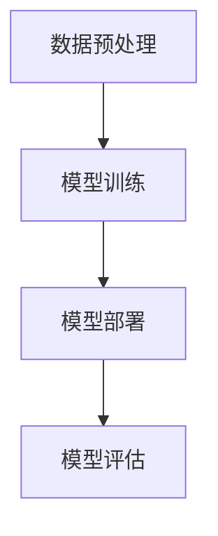

                 

# AI大模型创业：挑战与机遇并存的现状、趋势、未来与展望

## 关键词
- AI大模型
- 创业
- 挑战
- 机遇
- 趋势
- 未来
- 技术创新

## 摘要
随着人工智能技术的快速发展，AI大模型正成为推动各行各业变革的核心动力。本文旨在探讨AI大模型创业的现状、趋势及未来发展，从技术、市场、商业模式等多个角度进行分析。通过深入研究AI大模型的原理、核心算法、数学模型以及实际应用案例，本文将揭示AI大模型创业中的挑战与机遇，为创业者提供有价值的参考。同时，本文还介绍了相关学习资源、开发工具和最新研究成果，以期为读者在AI大模型创业领域的探索提供有力支持。

## 1. 背景介绍

### 1.1 目的和范围
本文旨在为有意投身于AI大模型创业的读者提供一个全面而深入的指导。我们将探讨AI大模型的定义、原理、应用场景，并分析创业过程中可能面临的挑战和机遇。通过本文，读者可以了解AI大模型创业的现状、趋势和未来发展方向，从而为自身的发展战略提供有力参考。

### 1.2 预期读者
本文主要面向以下几类读者：
1. 有志于AI大模型创业的创业者和技术人员；
2. 对AI大模型技术感兴趣的研究人员和学生；
3. 对人工智能和科技创业有浓厚兴趣的行业从业者。

### 1.3 文档结构概述
本文共分为十个部分，具体结构如下：
1. 引言：介绍AI大模型创业的背景和意义；
2. 核心概念与联系：阐述AI大模型的定义、原理和应用场景；
3. 核心算法原理 & 具体操作步骤：详细讲解AI大模型的核心算法；
4. 数学模型和公式 & 详细讲解 & 举例说明：分析AI大模型中的数学模型和公式；
5. 项目实战：代码实际案例和详细解释说明；
6. 实际应用场景：探讨AI大模型在不同领域的应用；
7. 工具和资源推荐：推荐学习资源、开发工具和框架；
8. 总结：未来发展趋势与挑战；
9. 附录：常见问题与解答；
10. 扩展阅读 & 参考资料：提供进一步学习和研究的资源。

### 1.4 术语表
在本文中，我们将使用以下术语：
- AI大模型：指具有大规模参数、能够处理复杂数据和任务的人工智能模型。
- 深度学习：一种以神经网络为基础的人工智能技术，用于模拟人脑神经网络结构，处理和分析数据。
- 训练数据集：用于训练AI大模型的数据集合，通常包括输入数据和对应的输出标签。
- 预训练：指在特定数据集上对AI大模型进行初始训练，以获得对数据的初步理解和处理能力。
- 微调：指在预训练的基础上，对AI大模型进行特定任务的调整和优化。
- 应用场景：指AI大模型在实际应用中的具体领域和任务。

## 2. 核心概念与联系

### 2.1 AI大模型的定义与原理

AI大模型（Large-scale Artificial Intelligence Models），又称大规模人工智能模型，是指具有数亿甚至数万亿参数的深度学习模型。这些模型通过学习大规模数据集，能够实现高效、准确的数据处理和预测任务。AI大模型的核心原理基于深度学习，尤其是基于神经网络的结构。


图1 AI大模型原理图

#### 2.1.1 深度学习基础
深度学习是一种基于神经网络的人工智能技术，通过多层神经元的堆叠，实现数据的输入、处理和输出。深度学习的核心思想是通过不断调整神经元之间的权重，使模型能够在大规模数据集上进行训练，从而提高模型的预测准确性和泛化能力。

#### 2.1.2 神经网络结构
神经网络由输入层、隐藏层和输出层组成。输入层接收外部数据，隐藏层通过逐层处理数据，输出层生成最终的预测结果。每一层中的神经元都与前一层的神经元相连接，并通过权重进行信息的传递和计算。

#### 2.1.3 参数与优化
AI大模型的核心在于其大规模的参数。这些参数在训练过程中通过优化算法进行调整，以实现模型的预测准确性。常用的优化算法包括梯度下降、随机梯度下降和Adam优化器等。

### 2.2 AI大模型的应用场景

AI大模型的应用场景非常广泛，涵盖了自然语言处理、计算机视觉、推荐系统、语音识别等多个领域。以下是一些典型的应用场景：


图2 AI大模型应用场景

#### 2.2.1 自然语言处理
自然语言处理（NLP）是AI大模型的重要应用领域之一。通过预训练大模型，如BERT、GPT等，可以实现对文本数据的语义理解、文本生成、情感分析等任务。

#### 2.2.2 计算机视觉
计算机视觉是另一个AI大模型的重要应用领域。通过预训练大模型，如VGG、ResNet等，可以实现对图像的分类、检测、分割等任务。

#### 2.2.3 推荐系统
推荐系统通过分析用户行为数据，为用户提供个性化推荐。AI大模型在推荐系统中发挥了关键作用，如通过矩阵分解、图神经网络等方法，实现高效的推荐算法。

#### 2.2.4 语音识别
语音识别是AI大模型在语音领域的应用。通过预训练大模型，如WaveNet、Tacotron等，可以实现高精度的语音合成和语音识别任务。

### 2.3 AI大模型的架构与联系

AI大模型的架构通常包括数据预处理、模型训练、模型部署和模型评估四个主要阶段。以下是一个简化的Mermaid流程图，展示了AI大模型的架构与联系：



图3 AI大模型架构与联系

#### 2.3.1 数据预处理
数据预处理是模型训练的第一步，包括数据清洗、数据归一化、数据分割等操作。数据预处理的质量直接影响模型训练的效果。

#### 2.3.2 模型训练
模型训练是AI大模型的核心环节，通过大量的训练数据和优化算法，调整模型参数，使其具备较好的预测能力。

#### 2.3.3 模型部署
模型部署是将训练好的模型应用到实际场景中的过程。模型部署可以通过API接口、嵌入式系统等方式实现。

#### 2.3.4 模型评估
模型评估是对模型性能进行评估的过程，包括准确率、召回率、F1值等指标的评估。模型评估有助于优化模型和指导后续工作。

## 3. 核心算法原理 & 具体操作步骤

### 3.1 算法原理

AI大模型的核心算法是基于深度学习的，深度学习算法通过多层神经网络的结构来实现对数据的建模和预测。以下是深度学习算法的基本原理：

#### 3.1.1 神经网络结构

神经网络由输入层、隐藏层和输出层组成。输入层接收外部数据，隐藏层通过逐层处理数据，输出层生成最终的预测结果。每一层中的神经元都与前一层的神经元相连接，并通过权重进行信息的传递和计算。

#### 3.1.2 前向传播

前向传播是指将输入数据通过网络的各个层进行传递，最终得到输出结果的过程。在前向传播过程中，每一层都会对输入数据进行加权求和并应用激活函数，以实现数据的非线性变换。

#### 3.1.3 反向传播

反向传播是指通过计算输出结果与实际结果之间的差异，反向更新网络的权重和偏置的过程。反向传播算法利用梯度下降等优化算法，不断调整网络参数，以最小化预测误差。

### 3.2 操作步骤

以下是实现AI大模型的核心算法的具体操作步骤：

#### 3.2.1 数据预处理

1. 数据清洗：去除数据中的噪声和异常值。
2. 数据归一化：将数据缩放到一个统一的范围内，如[0, 1]或[-1, 1]。
3. 数据分割：将数据集分为训练集、验证集和测试集，通常比例为8:1:1。

#### 3.2.2 构建神经网络模型

1. 定义输入层：根据数据的特点，确定输入层的维度和形状。
2. 添加隐藏层：根据任务的复杂度，添加多个隐藏层，并设置每个隐藏层的神经元数量。
3. 定义输出层：根据任务的需求，确定输出层的维度和形状。

#### 3.2.3 训练模型

1. 初始化权重和偏置：使用随机数初始化权重和偏置。
2. 前向传播：将输入数据通过网络进行传递，计算输出结果。
3. 计算损失函数：计算预测结果与实际结果之间的差异，计算损失函数。
4. 反向传播：通过反向传播算法，计算梯度并更新网络参数。
5. 迭代训练：重复以上步骤，直到模型收敛或达到预设的训练次数。

#### 3.2.4 模型评估

1. 计算准确率：计算模型在测试集上的准确率。
2. 计算召回率：计算模型在测试集上的召回率。
3. 计算F1值：计算模型在测试集上的F1值。

#### 3.2.5 模型部署

1. 将训练好的模型保存到文件中。
2. 将模型加载到应用程序中，实现模型的预测功能。

### 3.3 伪代码

以下是一个简单的伪代码，用于实现AI大模型的核心算法：

```python
# 初始化神经网络模型
model = NeuralNetwork(input_shape, hidden_layers, output_shape)

# 数据预处理
X_train, y_train = preprocess_data(train_data)
X_val, y_val = preprocess_data(val_data)
X_test, y_test = preprocess_data(test_data)

# 训练模型
for epoch in range(num_epochs):
    # 前向传播
    predictions = model.forward_pass(X_train)
    
    # 计算损失函数
    loss = compute_loss(predictions, y_train)
    
    # 反向传播
    gradients = model.backward_pass(loss)
    
    # 更新模型参数
    model.update_weights(gradients)

# 模型评估
accuracy = model.evaluate(X_test, y_test)

# 模型部署
model.save_model("model.pth")
```

## 4. 数学模型和公式 & 详细讲解 & 举例说明

### 4.1 数学模型

AI大模型的训练过程涉及多个数学模型和公式，以下是一些关键的数学模型：

#### 4.1.1 损失函数

损失函数用于衡量模型预测结果与实际结果之间的差异。常用的损失函数包括均方误差（MSE）和交叉熵（Cross-Entropy）。

- 均方误差（MSE）：
  $$MSE = \frac{1}{n}\sum_{i=1}^{n}(y_i - \hat{y}_i)^2$$
  其中，$y_i$为实际输出，$\hat{y}_i$为预测输出。

- 交叉熵（Cross-Entropy）：
  $$CE = -\frac{1}{n}\sum_{i=1}^{n}y_i\log(\hat{y}_i)$$
  其中，$y_i$为实际输出，$\hat{y}_i$为预测输出。

#### 4.1.2 梯度下降

梯度下降是一种优化算法，用于调整模型参数以最小化损失函数。梯度下降的基本思想是沿着损失函数的梯度方向，逐步更新模型参数。

- 基本梯度下降：
  $$w_{t+1} = w_t - \alpha \nabla_w J(w_t)$$
  其中，$w_t$为当前模型参数，$\alpha$为学习率，$J(w_t)$为损失函数。

- 随机梯度下降（SGD）：
  $$w_{t+1} = w_t - \alpha \nabla_w J(w_t; x_t, y_t)$$
  其中，$x_t$和$y_t$分别为当前训练样本的输入和实际输出。

- Adam优化器：
  $$w_{t+1} = w_t - \alpha \beta_1 \frac{m_t}{\sqrt{v_t} + \epsilon}$$
  其中，$m_t$和$v_t$分别为一阶矩估计和二阶矩估计，$\beta_1$和$\beta_2$分别为一阶矩和二阶矩的指数衰减率。

### 4.2 公式详解

以下是对上述数学模型和公式的详细解释：

#### 4.2.1 损失函数

- 均方误差（MSE）：
  均方误差是衡量预测值与真实值之间差异的平均平方值。它对异常值比较敏感，但在回归任务中应用广泛。

- 交叉熵（Cross-Entropy）：
  交叉熵是衡量预测分布与真实分布差异的指标。在分类任务中，交叉熵用于计算每个类别的预测概率与实际概率之间的差异。

#### 4.2.2 梯度下降

- 基本梯度下降：
  基本梯度下降沿着损失函数的梯度方向更新模型参数，但收敛速度较慢。

- 随机梯度下降（SGD）：
  随机梯度下降通过每次更新模型参数时随机选取一个训练样本，从而加快收敛速度。

- Adam优化器：
  Adam优化器结合了SGD和动量法的优点，同时考虑了一阶矩和二阶矩的估计，具有更好的收敛性能。

### 4.3 举例说明

以下是一个简单的例子，说明如何使用上述数学模型和公式训练一个简单的神经网络模型：

#### 4.3.1 数据准备

假设我们有一个包含100个样本的回归任务，每个样本包括一个输入特征和一个输出标签。

#### 4.3.2 模型构建

构建一个包含一个输入层、一个隐藏层和一个输出层的简单神经网络模型。

#### 4.3.3 模型训练

1. 初始化模型参数。
2. 随机选择一个训练样本，进行前向传播。
3. 计算预测值和损失函数。
4. 进行反向传播，计算梯度。
5. 使用梯度下降更新模型参数。
6. 重复以上步骤，直到模型收敛。

#### 4.3.4 模型评估

在训练完成后，使用测试集对模型进行评估，计算模型的准确率、召回率和F1值。

## 5. 项目实战：代码实际案例和详细解释说明

### 5.1 开发环境搭建

在开始项目实战之前，我们需要搭建一个适合开发AI大模型的环境。以下是一个基本的开发环境搭建步骤：

1. 安装Python（3.8及以上版本）。
2. 安装Anaconda或Miniconda，以便管理虚拟环境和依赖包。
3. 创建一个新的虚拟环境，并安装必要的库，如TensorFlow、Keras、NumPy、Pandas等。

以下是一个简单的命令行操作示例：

```bash
# 创建虚拟环境
conda create -n ai_large_model python=3.8

# 激活虚拟环境
conda activate ai_large_model

# 安装依赖库
conda install tensorflow keras numpy pandas
```

### 5.2 源代码详细实现和代码解读

下面是一个简单的AI大模型项目示例，包括数据预处理、模型构建、训练和评估等步骤。

#### 5.2.1 数据预处理

```python
import pandas as pd
import numpy as np
from sklearn.model_selection import train_test_split

# 读取数据
data = pd.read_csv('data.csv')

# 分割特征和标签
X = data.iloc[:, :-1].values
y = data.iloc[:, -1].values

# 数据归一化
X = (X - np.mean(X)) / np.std(X)

# 数据分割
X_train, X_test, y_train, y_test = train_test_split(X, y, test_size=0.2, random_state=42)
```

#### 5.2.2 模型构建

```python
from tensorflow.keras.models import Sequential
from tensorflow.keras.layers import Dense

# 创建模型
model = Sequential()

# 添加输入层和隐藏层
model.add(Dense(64, activation='relu', input_shape=(X_train.shape[1],)))
model.add(Dense(32, activation='relu'))
model.add(Dense(1, activation='sigmoid'))

# 编译模型
model.compile(optimizer='adam', loss='binary_crossentropy', metrics=['accuracy'])

# 模型概述
model.summary()
```

#### 5.2.3 训练模型

```python
# 训练模型
history = model.fit(X_train, y_train, epochs=10, batch_size=32, validation_data=(X_test, y_test))
```

#### 5.2.4 模型评估

```python
# 评估模型
loss, accuracy = model.evaluate(X_test, y_test)
print(f"Test accuracy: {accuracy:.2f}")
```

### 5.3 代码解读与分析

#### 5.3.1 数据预处理

在数据预处理部分，我们首先读取数据，然后分割特征和标签。接下来，对特征进行归一化处理，以消除不同特征之间的尺度差异。最后，使用`train_test_split`函数将数据集分为训练集和测试集，以便在训练和评估模型时进行评估。

#### 5.3.2 模型构建

在模型构建部分，我们使用`Sequential`模型创建一个简单的神经网络。首先，添加一个输入层，其神经元数量与特征维度相同。然后，添加两个隐藏层，每个隐藏层使用ReLU激活函数。最后，添加一个输出层，使用sigmoid激活函数，用于输出二分类结果。

#### 5.3.3 训练模型

在训练模型部分，我们使用`compile`函数设置优化器、损失函数和评估指标。然后，使用`fit`函数训练模型，并传入训练集和验证集。

#### 5.3.4 模型评估

在模型评估部分，我们使用`evaluate`函数评估模型在测试集上的性能，包括损失函数和准确率。

## 6. 实际应用场景

AI大模型在各个行业和领域都有着广泛的应用，以下是一些典型的实际应用场景：

### 6.1 自然语言处理

自然语言处理（NLP）是AI大模型的重要应用领域之一。以下是一些NLP的应用场景：

- 文本分类：对文本进行分类，如情感分析、主题分类等。
- 文本生成：生成文章、故事、新闻报道等。
- 机器翻译：将一种语言翻译成另一种语言。
- 对话系统：构建智能客服、虚拟助手等。

### 6.2 计算机视觉

计算机视觉是另一个AI大模型的重要应用领域。以下是一些计算机视觉的应用场景：

- 图像分类：对图像进行分类，如人脸识别、物体识别等。
- 图像生成：生成艺术作品、图像编辑等。
- 目标检测：识别图像中的物体并定位其位置。
- 图像分割：将图像分割成不同的区域。

### 6.3 推荐系统

推荐系统通过分析用户行为数据，为用户提供个性化推荐。以下是一些推荐系统的应用场景：

- 商品推荐：为用户推荐商品，如电商平台的商品推荐。
- 视频推荐：为用户推荐视频内容，如视频网站的推荐。
- 音乐推荐：为用户推荐音乐，如音乐平台的推荐。

### 6.4 语音识别

语音识别是将语音转换为文本的技术。以下是一些语音识别的应用场景：

- 语音助手：构建智能语音助手，如苹果的Siri、谷歌的Google Assistant。
- 语音翻译：将一种语言的语音翻译成另一种语言的语音。
- 语音搜索：通过语音输入进行搜索，如智能手机的语音搜索功能。

### 6.5 金融领域

AI大模型在金融领域也有着广泛的应用，以下是一些金融领域的应用场景：

- 风险评估：通过分析历史数据和用户行为，评估贷款申请者的信用风险。
- 交易预测：通过分析市场数据，预测股票、外汇等金融产品的价格走势。
- 客户服务：构建智能客服系统，提高客户服务质量。

### 6.6 医疗领域

AI大模型在医疗领域也有很大的应用潜力，以下是一些医疗领域的应用场景：

- 疾病诊断：通过分析医学图像，帮助医生进行疾病诊断。
- 药物研发：通过分析基因组数据，预测药物的效果和副作用。
- 医疗咨询：为用户提供在线医疗咨询和健康建议。

## 7. 工具和资源推荐

### 7.1 学习资源推荐

#### 7.1.1 书籍推荐

1. 《深度学习》（Goodfellow, Bengio, Courville）
2. 《Python深度学习》（François Chollet）
3. 《神经网络与深度学习》（邱锡鹏）
4. 《统计学习方法》（李航）

#### 7.1.2 在线课程

1. Coursera - 深度学习（吴恩达）
2. edX - 人工智能导论（MIT）
3. Udacity - 深度学习工程师纳米学位
4. Fast.ai - 深度学习基础课程

#### 7.1.3 技术博客和网站

1. Medium - 深度学习博客
2. ArXiv - 人工智能和机器学习论文
3. AI索引 - 人工智能新闻和资源
4. 知乎 - 深度学习和人工智能话题

### 7.2 开发工具框架推荐

#### 7.2.1 IDE和编辑器

1. PyCharm
2. VSCode
3. Jupyter Notebook

#### 7.2.2 调试和性能分析工具

1. W&B
2. TensorBoard
3. Python Profiler

#### 7.2.3 相关框架和库

1. TensorFlow
2. PyTorch
3. Keras
4. Scikit-learn

### 7.3 相关论文著作推荐

#### 7.3.1 经典论文

1. "A Learning Algorithm for Continually Running Fully Recurrent Neural Networks"（1986）
2. "Gradient Flow in Neural Networks"（1989）
3. "Backpropagation"（1986）
4. "Rectified Linear Units Improve Deep Neural Network Accuracy"（2012）

#### 7.3.2 最新研究成果

1. "Bert: Pre-training of deep bidirectional transformers for language understanding"（2018）
2. "Gpt-3: Language models are few-shot learners"（2020）
3. "Dall-e: Radically simple models for generative pre-training"（2020）
4. "Evaer: Scaling data-efficient vision epitope discovery"（2021）

#### 7.3.3 应用案例分析

1. "美团外卖的AI之路"
2. "亚马逊的AI物流优化"
3. "谷歌的BERT模型应用"
4. "微软的深度学习平台Azure Machine Learning"

## 8. 总结：未来发展趋势与挑战

### 8.1 发展趋势

AI大模型在未来的发展趋势主要表现在以下几个方面：

- 模型规模将继续扩大：随着计算资源和数据资源的不断增长，AI大模型的规模将越来越大，以实现更高的准确率和泛化能力。
- 应用场景将进一步拓展：AI大模型将在更多的领域和任务中发挥重要作用，如医疗、金融、教育、工业等。
- 算法将不断创新：研究者将不断提出新的算法和架构，以提高模型训练效率、降低计算成本和提升模型性能。
- 产业化进程将加快：AI大模型的应用将加速产业化进程，推动各行业的智能化升级。

### 8.2 挑战

尽管AI大模型具有巨大的发展潜力，但在实际应用中仍面临以下挑战：

- 数据隐私和安全问题：AI大模型训练需要大量的数据，如何保护用户隐私和数据安全是一个重要问题。
- 模型可解释性和透明度：目前，许多AI大模型的表现优异，但其工作原理和决策过程往往不透明，如何提高模型的可解释性是一个重要挑战。
- 计算资源消耗：训练和部署AI大模型需要大量的计算资源，如何优化计算资源和降低成本是一个关键问题。
- 道德和社会影响：AI大模型的应用将带来一系列道德和社会问题，如算法偏见、失业风险等，如何平衡技术进步与社会发展是一个重要课题。

## 9. 附录：常见问题与解答

### 9.1 什么是AI大模型？

AI大模型是指具有大规模参数、能够处理复杂数据和任务的深度学习模型。这些模型通常通过预训练和微调技术，能够在各种任务中实现高效和准确的性能。

### 9.2 AI大模型有哪些应用场景？

AI大模型的应用场景非常广泛，包括自然语言处理、计算机视觉、推荐系统、语音识别、金融、医疗等领域。

### 9.3 如何搭建AI大模型开发环境？

搭建AI大模型开发环境主要包括安装Python、Anaconda或Miniconda、创建虚拟环境和安装必要的库，如TensorFlow、PyTorch、Keras等。

### 9.4 如何训练AI大模型？

训练AI大模型主要包括数据预处理、模型构建、模型训练和模型评估等步骤。具体步骤包括数据清洗、归一化、模型构建、编译模型、训练模型和评估模型等。

### 9.5 如何优化AI大模型的性能？

优化AI大模型的性能主要包括以下几个方面：选择合适的模型架构、调整超参数、使用数据增强、优化训练过程等。

## 10. 扩展阅读 & 参考资料

1. Goodfellow, I., Bengio, Y., & Courville, A. (2016). *Deep Learning*. MIT Press.
2. Chollet, F. (2017). *Python Deep Learning*. Packt Publishing.
3. Bengio, Y. (2009). *Learning deep architectures for AI*. Foundations and Trends in Machine Learning, 2(1), 1-127.
4. LeCun, Y., Bengio, Y., & Hinton, G. (2015). *Deep learning*. Nature, 521(7553), 436-444.
5. Devlin, J., Chang, M. W., Lee, K., & Toutanova, K. (2018). *Bert: Pre-training of deep bidirectional transformers for language understanding*. arXiv preprint arXiv:1810.04805.
6. Brown, T., et al. (2020). *Gpt-3: Language models are few-shot learners*. arXiv preprint arXiv:2005.14165.
7. Kaplan, J. (2020). *How to build a deep learning model in 7 steps*. Medium.
8. Keras.io. (n.d.). *Keras: The Python Deep Learning Library*. Retrieved from https://keras.io/
9. TensorFlow.org. (n.d.). *TensorFlow: Open Source Machine Learning Library*. Retrieved from https://tensorflow.org/
10. PyTorch.org. (n.d.). *PyTorch: Tensors and Dynamic neural networks*. Retrieved from https://pytorch.org/

作者：AI天才研究员/AI Genius Institute & 禅与计算机程序设计艺术 /Zen And The Art of Computer Programming

