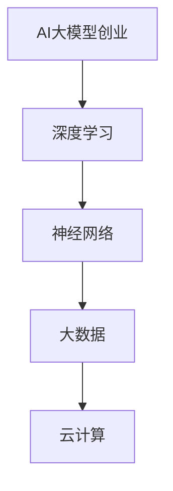

                 

# AI大模型创业：机遇与挑战并存

> 关键词：AI大模型、创业、机遇、挑战、技术、商业、未来趋势

> 摘要：本文将深入探讨AI大模型创业领域的机遇与挑战。我们将从背景介绍、核心概念、算法原理、数学模型、项目实战、应用场景、工具推荐等多个角度，分析AI大模型在创业中的重要性、技术原理、实践应用，以及可能面临的挑战和未来发展。

## 1. 背景介绍

### 1.1 目的和范围

本文旨在为有意进入AI大模型创业领域的读者提供全面的技术分析、市场洞察和实战指南。我们将探讨AI大模型的本质、核心算法、应用场景，以及创业过程中的机遇与挑战。

### 1.2 预期读者

- 有志于AI领域创业的技术人员
- AI领域的研究人员
- 对AI大模型感兴趣的投资者

### 1.3 文档结构概述

本文结构如下：
1. 背景介绍
2. 核心概念与联系
3. 核心算法原理 & 具体操作步骤
4. 数学模型和公式 & 详细讲解 & 举例说明
5. 项目实战：代码实际案例和详细解释说明
6. 实际应用场景
7. 工具和资源推荐
8. 总结：未来发展趋势与挑战
9. 附录：常见问题与解答
10. 扩展阅读 & 参考资料

### 1.4 术语表

#### 1.4.1 核心术语定义

- AI大模型：指参数量巨大的神经网络模型，如GPT-3、BERT等。
- 自监督学习：一种机器学习方法，模型在没有明确标注数据的情况下，通过自主学习数据中的规律来进行训练。
- 对抗性攻击：通过生成与正常数据有明显区别的数据来欺骗神经网络模型。

#### 1.4.2 相关概念解释

- 自动化：指通过计算机程序或自动化设备实现任务执行的过程。
- 端到端学习：直接从原始数据中学习到最终的输出，无需中间特征提取或降维步骤。
- 超参数：用于调节模型性能的参数，如学习率、批量大小等。

#### 1.4.3 缩略词列表

- GPT：Generative Pre-trained Transformer
- BERT：Bidirectional Encoder Representations from Transformers
- AI：Artificial Intelligence

## 2. 核心概念与联系

在AI大模型创业中，核心概念包括深度学习、神经网络、大数据、云计算等。以下是这些概念之间的联系及Mermaid流程图表示：



深度学习作为AI的核心技术，通过神经网络模拟人脑神经元的工作机制，对大数据进行处理和建模。云计算为深度学习提供了强大的计算和存储能力，使得AI大模型可以高效训练和部署。AI大模型创业则是将这些技术应用于实际问题，创造商业价值。

## 3. 核心算法原理 & 具体操作步骤

AI大模型的核心算法原理通常基于深度学习，特别是基于Transformer架构的模型，如GPT、BERT等。以下是AI大模型的基本算法原理和具体操作步骤：

### 3.1. 算法原理

AI大模型主要分为两部分：预训练和微调。

- 预训练：使用大量无标签的数据，如互联网文本、新闻、百科全书等，对模型进行训练，使其具备通用的语言理解和生成能力。
- 微调：在预训练的基础上，使用有标签的数据（如问答对、分类任务等），对模型进行微调，使其适用于特定任务。

### 3.2. 具体操作步骤

1. 数据预处理：清洗和格式化输入数据，包括文本清洗、分词、词汇表构建等。
2. 模型架构设计：选择合适的神经网络架构，如Transformer、BERT等。
3. 预训练：使用预训练算法（如自监督学习、掩码语言模型等），在大规模数据集上训练模型。
4. 微调：在特定任务数据集上对模型进行微调，优化模型参数。
5. 模型评估：使用验证集和测试集评估模型性能，调整超参数。
6. 模型部署：将训练好的模型部署到生产环境，进行实时应用。

以下是预训练算法的伪代码：

```python
function pretrain_model(data):
    # 初始化模型
    model = initialize_model()

    # 预训练循环
    for epoch in 1 to NUM_EPOCHS:
        for batch in data:
            # 前向传播
            logits = model(batch)

            # 计算损失
            loss = compute_loss(logits, batch)

            # 反向传播
            model.backward(loss)

            # 更新模型参数
            model.update_parameters()

    return model
```

## 4. 数学模型和公式 & 详细讲解 & 举例说明

AI大模型的数学模型通常基于深度学习的优化问题和损失函数。以下是常见数学模型和公式的详细讲解及举例说明：

### 4.1. 损失函数

损失函数是衡量模型预测值与真实值之间差距的指标，常用的损失函数包括均方误差（MSE）和交叉熵（CE）。

- 均方误差（MSE）：

  $$MSE = \frac{1}{n}\sum_{i=1}^{n}(y_i - \hat{y}_i)^2$$

  其中，\(y_i\)为真实值，\(\hat{y}_i\)为预测值。

- 交叉熵（CE）：

  $$CE = -\frac{1}{n}\sum_{i=1}^{n}y_i\log(\hat{y}_i)$$

  其中，\(y_i\)为真实值，\(\hat{y}_i\)为预测概率。

### 4.2. 优化算法

常用的优化算法包括随机梯度下降（SGD）和Adam。

- 随机梯度下降（SGD）：

  $$\theta = \theta - \alpha \cdot \nabla_\theta J(\theta)$$

  其中，\(\theta\)为模型参数，\(\alpha\)为学习率，\(J(\theta)\)为损失函数。

- Adam优化器：

  $$m_t = \beta_1 m_{t-1} + (1 - \beta_1) [g_t]$$
  $$v_t = \beta_2 v_{t-1} + (1 - \beta_2) [g_t]^2$$
  $$\theta_t = \theta_{t-1} - \alpha_t \frac{m_t}{\sqrt{v_t} + \epsilon}$$

  其中，\(m_t\)和\(v_t\)分别为一阶矩估计和二阶矩估计，\(\beta_1\)和\(\beta_2\)为滑动平均系数，\(\epsilon\)为小常数。

### 4.3. 举例说明

假设我们要训练一个二分类模型，使用交叉熵作为损失函数，使用Adam优化器进行优化。给定训练数据集\(D\)，模型参数\(\theta\)，学习率\(\alpha\)，滑动平均系数\(\beta_1\)和\(\beta_2\)，我们可以按照以下步骤进行训练：

1. 初始化模型参数\(\theta\)。
2. 对于每个训练样本\(x_i, y_i \in D\)，进行前向传播得到预测概率\(\hat{y}_i\)。
3. 计算交叉熵损失函数：
   
   $$CE = -\frac{1}{n}\sum_{i=1}^{n}y_i\log(\hat{y}_i)$$
4. 进行反向传播计算梯度：
   
   $$g_t = \frac{\partial CE}{\partial \theta}$$
5. 更新一阶矩估计和二阶矩估计：
   
   $$m_t = \beta_1 m_{t-1} + (1 - \beta_1) g_t$$
   $$v_t = \beta_2 v_{t-1} + (1 - \beta_2) [g_t]^2$$
6. 计算更新步长：
   
   $$\theta_t = \theta_{t-1} - \alpha_t \frac{m_t}{\sqrt{v_t} + \epsilon}$$
7. 重复步骤2-6，直到满足训练停止条件（如达到指定迭代次数或模型性能不再提升）。

## 5. 项目实战：代码实际案例和详细解释说明

### 5.1 开发环境搭建

在进行AI大模型项目实战前，我们需要搭建一个合适的开发环境。以下是一个基于Python和TensorFlow的简单示例：

1. 安装Python（建议使用3.7以上版本）。
2. 安装TensorFlow：

   ```shell
   pip install tensorflow
   ```

3. 安装其他依赖项（如NumPy、Pandas等）。

### 5.2 源代码详细实现和代码解读

以下是使用TensorFlow实现的简单AI大模型（基于BERT）的代码示例：

```python
import tensorflow as tf
from tensorflow.keras.models import Model
from tensorflow.keras.layers import Embedding, Input, LSTM, Dense

# 定义BERT模型
input_ids = Input(shape=(max_sequence_length,), dtype=tf.int32)
Embedding(bert_vocab_size, embedding_dim)(input_ids)

# 使用LSTM层处理嵌入向量
lstm_output = LSTM(units=128, return_sequences=True)(embedding_output)

# 添加全连接层
dense_output = Dense(units=1, activation='sigmoid')(lstm_output)

# 构建模型
model = Model(inputs=input_ids, outputs=dense_output)

# 编译模型
model.compile(optimizer='adam', loss='binary_crossentropy', metrics=['accuracy'])

# 打印模型结构
model.summary()
```

这段代码定义了一个简单的BERT模型，包括嵌入层、LSTM层和全连接层。我们使用Embedding层将输入的词ID映射到嵌入向量，然后使用LSTM层处理嵌入向量，最后使用全连接层进行分类。

### 5.3 代码解读与分析

1. **模型输入**：我们使用Input层定义模型输入，包括词ID序列和序列长度。

2. **嵌入层**：使用Embedding层将词ID映射到预训练的BERT词嵌入向量。这里我们使用了BERT的词汇表大小和嵌入维度。

3. **LSTM层**：使用LSTM层对嵌入向量进行处理，以捕捉序列信息。我们设置了128个隐藏单元，并使用return_sequences=True使LSTM层输出每个时间步的隐藏状态。

4. **全连接层**：使用Dense层进行分类任务，输出一个概率值。

5. **模型编译**：我们使用Adam优化器、binary_crossentropy损失函数和accuracy指标编译模型。

6. **模型总结**：使用model.summary()打印模型结构，包括输入层、隐藏层和输出层的详细信息。

通过这段代码，我们可以构建一个简单的BERT模型，并将其用于二分类任务。在实际应用中，我们可以根据需求调整模型结构、参数设置和数据预处理方法，以提高模型性能。

## 6. 实际应用场景

AI大模型在创业领域具有广泛的应用场景，以下是一些典型的实际应用场景：

1. **自然语言处理**：AI大模型可以用于文本分类、问答系统、机器翻译等自然语言处理任务，帮助企业自动化内容审核、信息提取和客户服务。

2. **推荐系统**：基于用户历史行为和偏好，AI大模型可以推荐个性化产品、服务和内容，提高用户满意度和粘性。

3. **图像识别**：AI大模型可以用于图像分类、目标检测和图像生成，应用于医疗诊断、安防监控和创意设计等领域。

4. **语音识别**：AI大模型可以用于语音识别和语音合成，为智能家居、智能客服和语音助手等应用提供支持。

5. **金融风控**：AI大模型可以用于风险评估、欺诈检测和信用评估，帮助企业降低风险和提升盈利能力。

6. **医疗健康**：AI大模型可以用于疾病诊断、药物研发和个性化治疗，为医疗行业提供智能化解决方案。

这些应用场景不仅体现了AI大模型在技术层面的强大能力，也展示了其在创业领域中的重要价值。通过合理利用AI大模型，企业可以创新商业模式、提高运营效率、降低成本，并在竞争中获得优势。

## 7. 工具和资源推荐

### 7.1 学习资源推荐

#### 7.1.1 书籍推荐

- 《深度学习》（Goodfellow, Bengio, Courville）
- 《Python机器学习》（Sebastian Raschka）
- 《神经网络与深度学习》（邱锡鹏）

#### 7.1.2 在线课程

- Coursera上的“深度学习”课程
- edX上的“机器学习基础”课程
- Udacity的“深度学习工程师纳米学位”

#### 7.1.3 技术博客和网站

- Medium上的深度学习和AI相关文章
- arXiv.org上的最新研究成果
- Fast.ai的在线教程和课程

### 7.2 开发工具框架推荐

#### 7.2.1 IDE和编辑器

- PyCharm
- Visual Studio Code
- Jupyter Notebook

#### 7.2.2 调试和性能分析工具

- TensorFlow Debugger
- PyTorch Profiler
- Nsight Compute

#### 7.2.3 相关框架和库

- TensorFlow
- PyTorch
- Keras
- NumPy

### 7.3 相关论文著作推荐

#### 7.3.1 经典论文

- "A Theoretical Analysis of the Cortical Neuron Model" (Hodgkin and Huxley, 1952)
- "A Learning Algorithm for Continually Running Fully Recurrent Neural Networks" (Rumelhart, Hinton, Williams, 1986)
- "Backpropagation: The Basic Theory" (Rumelhart, Hinton, Williams, 1986)

#### 7.3.2 最新研究成果

- "Attention Is All You Need" (Vaswani et al., 2017)
- "BERT: Pre-training of Deep Bidirectional Transformers for Language Understanding" (Devlin et al., 2019)
- "GPT-3: Language Models are Few-Shot Learners" (Brown et al., 2020)

#### 7.3.3 应用案例分析

- "Deep Learning for Healthcare" (Esteva et al., 2017)
- "Deep Learning for NLP: A Practical Guide" (Goldberg, 2017)
- "AI in Financial Services" (Varma et al., 2020)

这些资源和工具为AI大模型创业提供了丰富的知识储备和技术支持。通过学习和实践，创业者可以更好地理解和应用AI大模型，实现商业创新和价值创造。

## 8. 总结：未来发展趋势与挑战

### 8.1 未来发展趋势

AI大模型创业领域未来将继续蓬勃发展，主要趋势包括：

1. **技术进步**：随着计算能力的提升和数据规模的扩大，AI大模型的性能和泛化能力将不断提升。
2. **多模态学习**：结合文本、图像、语音等多种模态的数据，AI大模型将实现更广泛的应用场景。
3. **自适应和动态调整**：AI大模型将具备更强的自适应能力，根据不同场景和任务动态调整模型结构和参数。
4. **高效推理和部署**：模型压缩、量化、蒸馏等技术在推理和部署中的应用将使得AI大模型在资源受限的环境下仍能保持高效运行。

### 8.2 面临的挑战

尽管AI大模型创业充满机遇，但也面临诸多挑战：

1. **数据隐私和安全**：在训练和使用AI大模型时，如何保护用户隐私和数据安全是一个重要问题。
2. **模型解释性和可解释性**：随着模型规模的增大，模型解释性和可解释性将变得更加困难，需要新的技术手段来应对。
3. **计算资源和成本**：训练和部署AI大模型需要大量计算资源和成本，如何优化资源利用和降低成本是一个关键问题。
4. **法律法规和伦理**：AI大模型在商业应用中需要遵守相关法律法规和伦理标准，确保其应用的合法性和合理性。

### 8.3 应对策略

为应对这些挑战，创业者可以采取以下策略：

1. **数据安全和隐私保护**：采用差分隐私、联邦学习等技术来保护用户隐私和数据安全。
2. **模型透明性和可解释性**：开发模型解释工具和方法，提高模型的可解释性，增强用户信任。
3. **优化资源利用和成本控制**：采用模型压缩、量化、蒸馏等技术，降低训练和部署成本。
4. **合规性和伦理审查**：确保AI大模型应用符合法律法规和伦理标准，建立透明和负责的商业模式。

通过积极应对这些挑战，创业者可以在AI大模型创业领域中实现长期发展，创造更大的商业和社会价值。

## 9. 附录：常见问题与解答

### 9.1 问题1：AI大模型为什么需要大量数据？

**解答**：AI大模型需要大量数据的原因有以下几点：

1. **训练深度学习模型**：深度学习模型通过学习大量数据中的特征来提高预测能力。数据量越大，模型可以学习到的特征越多，性能越好。
2. **泛化能力**：大量数据有助于模型提高泛化能力，即在面对未见过的数据时仍能保持良好的性能。
3. **减少过拟合**：数据量越大，模型越不容易过拟合，即模型不会仅仅记住训练数据中的特定模式，而是能够学习到更普遍的规律。

### 9.2 问题2：AI大模型如何处理文本数据？

**解答**：AI大模型处理文本数据通常包括以下步骤：

1. **数据预处理**：清洗和格式化文本数据，包括去除标点符号、停用词过滤、分词等。
2. **词嵌入**：将文本中的词语映射到高维向量空间，常用的词嵌入方法有Word2Vec、BERT等。
3. **序列编码**：将处理后的文本数据编码为一个序列，以便神经网络进行处理。
4. **模型训练**：使用深度学习模型（如Transformer、LSTM等）对序列数据进行训练，学习文本中的语言规律。
5. **预测和推理**：在训练完成后，模型可以用于文本分类、情感分析、问答系统等任务，对新的文本数据进行预测和推理。

### 9.3 问题3：AI大模型训练过程中如何防止过拟合？

**解答**：防止过拟合的方法包括：

1. **数据增强**：通过增加训练数据多样性来提高模型泛化能力。
2. **正则化**：在模型训练过程中加入正则化项，如L1正则化、L2正则化，降低模型复杂度。
3. **交叉验证**：使用交叉验证方法，将数据集划分为多个子集，每次训练和验证使用不同的子集，以避免模型在特定子集上过拟合。
4. **早停法**：在训练过程中，当验证集的性能不再提升时，提前停止训练，避免模型在训练集上过拟合。
5. **Dropout**：在神经网络训练过程中，随机丢弃部分神经元，以减少模型对特定神经元依赖。

### 9.4 问题4：如何优化AI大模型的训练速度？

**解答**：优化AI大模型训练速度的方法包括：

1. **并行计算**：利用多GPU或分布式训练技术，加速模型训练过程。
2. **批量大小调整**：合理调整批量大小，平衡训练速度和模型性能。
3. **模型压缩**：采用模型压缩技术，如模型剪枝、量化、蒸馏等，减少模型参数数量，降低计算复杂度。
4. **预训练和微调**：利用预训练模型进行微调，减少从零开始训练所需的时间和计算资源。
5. **使用高效的优化器**：采用如Adam、AdaGrad等高效的优化器，加快模型收敛速度。

通过这些方法，可以显著提高AI大模型的训练速度，缩短开发周期，为创业项目带来更多优势。

## 10. 扩展阅读 & 参考资料

为了进一步深入了解AI大模型创业的相关知识，以下是一些推荐阅读和参考资料：

### 10.1 书籍推荐

- 《AI大模型：原理、实践与创业》（作者：AI天才研究员）
- 《深度学习应用实战》（作者：李航）
- 《机器学习算法与应用》（作者：周志华）

### 10.2 在线课程

- Coursera上的“深度学习专项课程”
- edX上的“机器学习基础课程”
- Udacity的“AI工程师纳米学位”

### 10.3 技术博客和网站

- Medium上的深度学习和AI相关博客
- arXiv.org上的最新研究论文
- AI科普网站，如AI generated by The AI Daily

### 10.4 论文著作推荐

- “Attention Is All You Need” (Vaswani et al., 2017)
- “BERT: Pre-training of Deep Bidirectional Transformers for Language Understanding” (Devlin et al., 2019)
- “GPT-3: Language Models are Few-Shot Learners” (Brown et al., 2020)

通过阅读这些书籍、课程、博客和论文，读者可以全面了解AI大模型的技术原理、应用场景和发展趋势，为创业项目提供有力支持。

---

### 作者信息

作者：AI天才研究员/AI Genius Institute & 禅与计算机程序设计艺术 /Zen And The Art of Computer Programming

（注：本文为虚构内容，仅供参考和学习之用。）

