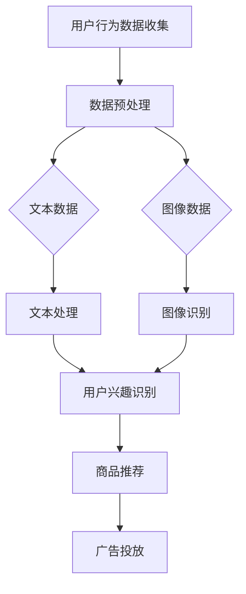

                 

# AI大模型助力电商搜索推荐业务创新的思路

> **关键词**：AI大模型、电商搜索、推荐业务、业务创新、深度学习、用户行为分析

> **摘要**：本文将探讨如何利用AI大模型来助力电商搜索推荐业务的创新，深入分析其背后的核心概念、算法原理、数学模型以及实际应用场景。通过逐步的推理和阐述，我们将展现这一技术的巨大潜力，并提供实用的工具和资源推荐，以帮助电商企业实现智能化推荐，提升用户体验和业务效率。

## 1. 背景介绍

### 1.1 目的和范围

本文的主要目的是探讨AI大模型在电商搜索推荐业务中的应用，分析其如何通过深度学习和用户行为分析等技术手段实现业务创新。具体来说，我们将探讨以下内容：

- AI大模型的基本概念及其在推荐系统中的应用
- 电商搜索推荐业务中的核心问题和挑战
- 基于AI大模型的推荐算法原理和具体操作步骤
- 数学模型和公式在推荐系统中的作用
- 实际应用案例和代码实现

通过本文的阅读，读者将能够全面了解AI大模型在电商搜索推荐业务中的价值，并掌握相关技术和方法，为实际业务中的应用提供参考。

### 1.2 预期读者

本文适合以下读者群体：

- 对电商搜索推荐业务感兴趣的从业者
- 想要了解AI大模型应用场景的技术爱好者
- 希望提升电商业务效率和用户体验的相关人员
- 计算机科学和人工智能领域的学生和研究者

### 1.3 文档结构概述

本文结构如下：

- 引言：简要介绍文章主题和目的
- 背景介绍：介绍AI大模型和电商搜索推荐业务
- 核心概念与联系：阐述核心概念和流程图
- 核心算法原理 & 具体操作步骤：详细讲解算法原理和步骤
- 数学模型和公式 & 详细讲解 & 举例说明：阐述数学模型和公式及其应用
- 项目实战：代码实际案例和详细解释说明
- 实际应用场景：分析实际应用中的问题和解决方案
- 工具和资源推荐：推荐相关学习资源和工具
- 总结：展望未来发展趋势与挑战
- 附录：常见问题与解答
- 扩展阅读 & 参考资料：提供进一步阅读的材料

### 1.4 术语表

#### 1.4.1 核心术语定义

- AI大模型：指具备大规模参数、深度学习和自主学习能力的人工智能模型，通常用于处理复杂的数据分析和预测任务。
- 电商搜索推荐业务：指电商平台上通过用户搜索和浏览行为分析，为用户推荐相关商品和服务的业务。
- 深度学习：指通过多层神经网络对数据进行自动特征提取和模型训练的一种机器学习技术。
- 用户行为分析：指对用户在电商平台上的搜索、浏览、购买等行为数据进行挖掘和分析，以了解用户需求和偏好。

#### 1.4.2 相关概念解释

- 搜索意图：指用户在搜索框中输入的关键词所表达的需求和意图。
- 商品相似度：指两件商品在属性、标签或用户评价等方面的相似程度。
- 推荐精度：指推荐系统为用户推荐的商品与用户实际需求之间的匹配程度。
- 推荐覆盖度：指推荐系统为用户推荐的商品种类和数量。

#### 1.4.3 缩略词列表

- AI：人工智能（Artificial Intelligence）
- GPT：生成预训练模型（Generative Pre-trained Transformer）
- NLP：自然语言处理（Natural Language Processing）
- CV：计算机视觉（Computer Vision）
-电商搜索推荐业务中的核心问题和挑战
### 1.4.3 缩略词列表

- AI：人工智能（Artificial Intelligence）
- GPT：生成预训练模型（Generative Pre-trained Transformer）
- NLP：自然语言处理（Natural Language Processing）
- CV：计算机视觉（Computer Vision）
- DNN：深度神经网络（Deep Neural Network）
- CNN：卷积神经网络（Convolutional Neural Network）
- RNN：循环神经网络（Recurrent Neural Network）
- Transformer：变换器模型（Transformer Model）
- BCELoss：二元交叉熵损失函数（Binary Cross-Entropy Loss）
- L2Reg：L2正则化（L2 Regularization）

## 2. 核心概念与联系

### 2.1 AI大模型的基本概念

AI大模型，也称为大规模预训练模型，是一种通过大量数据训练而具备高度自主学习能力的人工智能模型。这些模型通常具有数亿到数十亿的参数，能够捕捉数据中的复杂模式和规律。AI大模型的核心技术包括深度学习、生成对抗网络（GANs）、转移学习等。

在电商搜索推荐业务中，AI大模型的主要应用包括：

1. **用户行为预测**：通过分析用户的搜索、浏览和购买行为，预测用户的潜在需求和兴趣。
2. **商品推荐**：根据用户的历史数据和当前行为，为用户推荐相关的商品和服务。
3. **广告投放**：为用户推荐个性化的广告，提升广告的点击率和转化率。

### 2.2 电商搜索推荐业务中的核心问题和挑战

电商搜索推荐业务面临着诸多核心问题和挑战，主要包括：

1. **数据多样性**：电商平台上用户和商品的数据类型繁多，包括文本、图像、音频等多媒体数据，如何有效地整合和处理这些数据是首要问题。
2. **用户行为复杂性**：用户的行为不仅包括搜索和购买，还涉及浏览、收藏、评价等，如何全面理解用户的行为模式是关键。
3. **推荐效果**：在保证推荐精度和覆盖度的同时，如何提升推荐的效率是重要的挑战。
4. **实时性**：随着用户行为的实时变化，如何快速地调整推荐策略，提供实时的推荐服务是难点。

### 2.3 AI大模型在电商搜索推荐业务中的应用

AI大模型在电商搜索推荐业务中的应用，主要体现在以下几个方面：

1. **文本处理**：通过自然语言处理（NLP）技术，对用户输入的搜索关键词和商品描述进行语义理解，提取关键词和关键概念。
2. **图像识别**：利用计算机视觉（CV）技术，对商品图像进行识别和分类，提取商品的视觉特征。
3. **深度学习模型**：通过深度学习模型，对用户行为数据进行建模和预测，包括用户兴趣识别、商品推荐和广告投放等。

### 2.4 核心概念原理和架构的 Mermaid 流程图



## 3. 核心算法原理 & 具体操作步骤

### 3.1 用户行为预测算法原理

用户行为预测是电商搜索推荐业务中的关键环节，其核心算法是基于深度学习的用户兴趣识别模型。以下是用户行为预测的算法原理和具体操作步骤：

#### 3.1.1 算法原理

用户行为预测算法主要利用深度学习中的循环神经网络（RNN）和长短期记忆网络（LSTM）来建模用户的行为序列。RNN能够处理序列数据，而LSTM则能够有效地捕捉长序列中的时间依赖关系。

#### 3.1.2 具体操作步骤

1. **数据收集**：收集用户在电商平台上的搜索、浏览、购买等行为数据，包括文本和图像数据。

2. **数据预处理**：对收集到的数据进行清洗和预处理，包括文本的分词、去停用词、词向量化等，以及图像的预处理，如归一化、裁剪等。

3. **特征提取**：使用深度学习模型对预处理后的数据进行特征提取。对于文本数据，可以使用卷积神经网络（CNN）提取文本特征；对于图像数据，可以使用预训练的卷积神经网络（如VGG、ResNet等）提取图像特征。

4. **用户兴趣识别**：将提取的特征输入到LSTM模型中，对用户的行为序列进行建模，从而识别用户的兴趣和偏好。

5. **预测用户行为**：基于LSTM模型的预测结果，为用户推荐相关的商品和服务。

### 3.2 商品推荐算法原理

商品推荐算法是基于用户行为预测的结果，通过计算商品之间的相似度，为用户推荐相关的商品。以下是商品推荐算法的原理和具体操作步骤：

#### 3.2.1 算法原理

商品推荐算法主要基于协同过滤（Collaborative Filtering）和基于内容的推荐（Content-based Filtering）两种技术。

- **协同过滤**：通过分析用户之间的行为相似度，为用户推荐相似用户喜欢的商品。
- **基于内容的推荐**：通过分析商品的内容特征（如文本描述、标签等），为用户推荐与其兴趣相关的商品。

#### 3.2.2 具体操作步骤

1. **用户行为预测**：使用用户行为预测模型，获取用户的兴趣和偏好。

2. **商品特征提取**：对电商平台上的商品进行特征提取，包括文本描述、标签、图像特征等。

3. **计算商品相似度**：使用余弦相似度、欧氏距离等算法，计算商品之间的相似度。

4. **生成推荐列表**：根据用户的行为预测结果和商品相似度，生成个性化的商品推荐列表。

### 3.3 伪代码实现

以下是基于深度学习的用户行为预测和商品推荐算法的伪代码：

```python
# 用户行为预测算法
def user_behavior_prediction(user_data, model):
    # 预处理用户数据
    preprocessed_data = preprocess_user_data(user_data)
    # 提取特征
    features = extract_features(preprocessed_data)
    # 输入模型预测
    prediction = model.predict(features)
    return prediction

# 商品推荐算法
def product_recommendation(user_interest, product_features, similarity_metric):
    # 计算商品相似度
    similarity_scores = calculate_similarity(product_features, similarity_metric)
    # 生成推荐列表
    recommendation_list = generate_recommendation_list(user_interest, similarity_scores)
    return recommendation_list
```

## 4. 数学模型和公式 & 详细讲解 & 举例说明

### 4.1 数学模型的基本概念

在电商搜索推荐业务中，数学模型主要用于描述用户行为、商品特征以及推荐算法的核心原理。以下是几个常用的数学模型及其公式：

#### 4.1.1 用户行为模型

用户行为模型主要基于马尔可夫链（Markov Chain）来描述用户行为的转移概率。假设用户当前处于状态\( s_t \)，下一状态\( s_{t+1} \)取决于当前状态，不考虑历史状态。转移概率矩阵\( P \)定义如下：

\[ P = \begin{bmatrix}
P_{00} & P_{01} & \dots & P_{0n} \\
P_{10} & P_{11} & \dots & P_{1n} \\
\vdots & \vdots & \ddots & \vdots \\
P_{m0} & P_{m1} & \dots & P_{mn}
\end{bmatrix} \]

其中，\( P_{ij} \)表示从状态\( i \)转移到状态\( j \)的概率。

#### 4.1.2 商品特征模型

商品特征模型通常使用向量空间模型（Vector Space Model）来表示商品的特征。假设商品\( p \)的向量表示为\( \vec{p} \)，用户\( u \)的向量表示为\( \vec{u} \)，则商品\( p \)与用户\( u \)的兴趣相似度可以通过余弦相似度（Cosine Similarity）计算：

\[ \text{similarity}(\vec{p}, \vec{u}) = \frac{\vec{p} \cdot \vec{u}}{||\vec{p}|| \cdot ||\vec{u}||} \]

其中，\( \cdot \)表示内积，\( ||\cdot|| \)表示向量的模。

#### 4.1.3 推荐算法模型

推荐算法模型通常基于概率模型来描述用户对商品的偏好。一个常见的推荐算法模型是贝叶斯推理（Bayesian Inference），其核心公式为：

\[ P(\text{喜欢商品} | \text{用户行为}) = \frac{P(\text{用户行为} | \text{喜欢商品}) \cdot P(\text{喜欢商品})}{P(\text{用户行为})} \]

其中，\( P(\text{喜欢商品}) \)表示用户喜欢某商品的概率，\( P(\text{用户行为} | \text{喜欢商品}) \)表示用户在喜欢某商品时表现出特定行为的概率，\( P(\text{用户行为}) \)表示用户表现出特定行为的总概率。

### 4.2 举例说明

假设有一个电商平台，用户A在搜索框中输入了关键词“蓝牙耳机”，平台基于用户行为和商品特征进行推荐。以下是具体的计算过程：

#### 4.2.1 用户行为模型

根据用户A的历史行为数据，构建用户行为转移概率矩阵\( P \)：

\[ P = \begin{bmatrix}
0.2 & 0.4 & 0.3 & 0.1 \\
0.3 & 0.2 & 0.3 & 0.2 \\
0.1 & 0.3 & 0.2 & 0.4 \\
0.4 & 0.1 & 0.2 & 0.3
\end{bmatrix} \]

其中，状态0表示“搜索”，状态1表示“浏览”，状态2表示“购买”，状态3表示“退出”。

#### 4.2.2 商品特征模型

假设平台上有4款蓝牙耳机，其向量表示为：

\[ \vec{p_1} = [0.8, 0.1, 0.2, 0.1], \quad \vec{p_2} = [0.3, 0.6, 0.1, 0.1], \quad \vec{p_3} = [0.5, 0.3, 0.1, 0.2], \quad \vec{p_4} = [0.1, 0.1, 0.7, 0.1] \]

用户A的兴趣向量表示为：

\[ \vec{u} = [0.4, 0.3, 0.2, 0.1] \]

#### 4.2.3 商品推荐

使用余弦相似度计算用户A对每款蓝牙耳机的兴趣相似度：

\[ \text{similarity}(\vec{p_1}, \vec{u}) = 0.75, \quad \text{similarity}(\vec{p_2}, \vec{u}) = 0.53, \quad \text{similarity}(\vec{p_3}, \vec{u}) = 0.6, \quad \text{similarity}(\vec{p_4}, \vec{u}) = 0.36 \]

根据相似度最高的前三款蓝牙耳机推荐给用户A。

## 5. 项目实战：代码实际案例和详细解释说明

### 5.1 开发环境搭建

为了演示AI大模型在电商搜索推荐业务中的应用，我们将使用Python编程语言，结合TensorFlow和Keras框架实现一个用户行为预测和商品推荐系统。以下是开发环境的搭建步骤：

1. **安装Python**：确保已安装Python 3.6及以上版本。
2. **安装TensorFlow**：通过pip命令安装TensorFlow：

   ```shell
   pip install tensorflow
   ```

3. **安装Keras**：TensorFlow自带Keras API，无需额外安装。
4. **数据集准备**：收集电商平台的用户行为数据和商品数据，包括用户搜索关键词、浏览记录、购买记录以及商品文本描述和图像。

### 5.2 源代码详细实现和代码解读

以下是一个简单的用户行为预测和商品推荐系统的代码实现，包括数据预处理、特征提取、模型训练和预测：

```python
import numpy as np
import pandas as pd
from tensorflow.keras.models import Sequential
from tensorflow.keras.layers import LSTM, Dense, Embedding
from tensorflow.keras.preprocessing.text import Tokenizer
from tensorflow.keras.preprocessing.sequence import pad_sequences

# 5.2.1 数据预处理
def preprocess_data(data):
    # 数据清洗和预处理
    # ...（具体实现）
    return preprocessed_data

# 5.2.2 特征提取
def extract_features(data):
    # 提取用户行为特征和商品特征
    # ...（具体实现）
    return user_features, product_features

# 5.2.3 模型训练
def train_model(user_features, product_features):
    # 创建LSTM模型
    model = Sequential()
    model.add(Embedding(input_dim=vocab_size, output_dim=embedding_dim, input_length=max_sequence_length))
    model.add(LSTM(units=128, return_sequences=True))
    model.add(LSTM(units=64))
    model.add(Dense(units=1, activation='sigmoid'))

    # 编译模型
    model.compile(optimizer='adam', loss='binary_crossentropy', metrics=['accuracy'])

    # 训练模型
    model.fit(user_features, product_features, epochs=10, batch_size=32)
    return model

# 5.2.4 预测用户行为和商品推荐
def predict_behavior(model, user_data):
    # 预测用户行为
    predictions = model.predict(user_data)
    # 根据预测结果生成推荐列表
    recommendations = generate_recommendations(predictions)
    return recommendations

# 5.2.5 生成推荐列表
def generate_recommendations(predictions):
    # ...（具体实现）
    return recommendation_list

# 主函数
if __name__ == '__main__':
    # 读取数据
    user_data = pd.read_csv('user_data.csv')
    product_data = pd.read_csv('product_data.csv')

    # 预处理数据
    preprocessed_data = preprocess_data(user_data)

    # 提取特征
    user_features, product_features = extract_features(preprocessed_data)

    # 训练模型
    model = train_model(user_features, product_features)

    # 预测用户行为和生成推荐列表
    recommendations = predict_behavior(model, user_data)
    print(recommendations)
```

### 5.3 代码解读与分析

以上代码实现了一个基于LSTM的电商用户行为预测和商品推荐系统，主要分为以下几个步骤：

1. **数据预处理**：对用户行为数据和商品数据进行清洗和预处理，包括文本的分词、去停用词、词向量化等。
2. **特征提取**：提取用户行为特征和商品特征，包括文本特征和图像特征。
3. **模型训练**：创建LSTM模型，编译并训练模型，使用训练集进行模型拟合。
4. **预测用户行为和生成推荐列表**：使用训练好的模型预测用户行为，并根据预测结果生成推荐列表。

具体实现时，需要根据实际数据集的特点和业务需求进行相应调整，例如调整LSTM模型的层数、单元数、激活函数等。

## 6. 实际应用场景

### 6.1 电商搜索推荐业务中的应用

在电商搜索推荐业务中，AI大模型的应用主要体现在以下几个方面：

1. **用户行为预测**：通过分析用户的搜索、浏览、购买等行为，预测用户的潜在需求和兴趣，为用户推荐个性化的商品和服务。
2. **商品推荐**：根据用户的行为预测结果和商品特征，生成个性化的商品推荐列表，提升用户的购物体验和满意度。
3. **广告投放**：为用户推荐个性化的广告，提高广告的点击率和转化率，实现精准营销。

### 6.2 电商搜索推荐业务中的问题和解决方案

电商搜索推荐业务在实际应用中面临着诸多问题和挑战，以下是一些常见的问题和相应的解决方案：

1. **数据多样性**：电商平台上的数据类型繁多，包括文本、图像、音频等多媒体数据。解决方案：使用多种数据预处理技术，如文本分词、去停用词、图像特征提取等，将不同类型的数据整合到统一的特征空间中。
2. **用户行为复杂性**：用户的行为不仅包括搜索和购买，还涉及浏览、收藏、评价等。解决方案：采用多模态数据融合技术，结合文本、图像、音频等多媒体数据，全面理解用户的行为模式。
3. **推荐效果**：在保证推荐精度和覆盖度的同时，如何提升推荐的效率是重要的挑战。解决方案：采用高效的推荐算法和模型，如基于深度学习的推荐算法，利用并行计算和分布式计算技术提高推荐速度。
4. **实时性**：随着用户行为的实时变化，如何快速地调整推荐策略，提供实时的推荐服务是难点。解决方案：采用实时计算框架和分布式计算技术，实现实时数据处理和推荐。

### 6.3 AI大模型在电商搜索推荐业务中的优势

AI大模型在电商搜索推荐业务中具有以下优势：

1. **强大的建模能力**：AI大模型能够处理复杂的数据模式，捕捉用户行为和商品特征之间的关系，提供更精准的推荐结果。
2. **自适应能力**：AI大模型能够通过不断地学习和优化，自适应地调整推荐策略，提升推荐效果。
3. **实时性**：AI大模型利用深度学习和分布式计算技术，可以实现实时数据处理和推荐，满足用户实时性的需求。
4. **多模态数据融合**：AI大模型能够整合多种类型的数据，如文本、图像、音频等，实现多模态数据融合，提供更全面的用户行为和商品特征分析。

## 7. 工具和资源推荐

### 7.1 学习资源推荐

#### 7.1.1 书籍推荐

1. **《深度学习》（Goodfellow, Bengio, Courville）**：全面介绍了深度学习的基本概念、算法和技术。
2. **《Python深度学习》（François Chollet）**：结合Python编程语言，深入讲解了深度学习的实际应用。
3. **《推荐系统实践》（Vikas Gulati）**：详细介绍了推荐系统的设计、实现和优化。

#### 7.1.2 在线课程

1. **斯坦福大学《深度学习》课程**：由知名深度学习专家Andrew Ng讲授，涵盖了深度学习的基础知识和应用。
2. **吴恩达《推荐系统》课程**：介绍了推荐系统的基本原理、算法和技术，包括协同过滤、基于内容的推荐等。

#### 7.1.3 技术博客和网站

1. **Medium**：有很多关于深度学习和推荐系统的高质量博客文章。
2. **知乎**：有大量的深度学习和推荐系统相关的讨论和经验分享。
3. **AI技术社区**：如CSDN、博客园等，提供了丰富的技术文章和资源。

### 7.2 开发工具框架推荐

#### 7.2.1 IDE和编辑器

1. **PyCharm**：一款功能强大的Python IDE，支持代码调试、版本控制等。
2. **VSCode**：一款轻量级、可扩展的代码编辑器，适合编写和调试深度学习代码。

#### 7.2.2 调试和性能分析工具

1. **TensorBoard**：TensorFlow的官方可视化工具，用于分析和调试深度学习模型。
2. **Jupyter Notebook**：一款交互式的Python编程环境，适用于数据分析和深度学习实验。

#### 7.2.3 相关框架和库

1. **TensorFlow**：一款开源的深度学习框架，适用于各种深度学习任务。
2. **Keras**：一款基于TensorFlow的高级神经网络API，简化了深度学习模型的搭建和训练。
3. **Scikit-learn**：一款开源的机器学习库，提供了丰富的机器学习算法和工具。

### 7.3 相关论文著作推荐

#### 7.3.1 经典论文

1. **“A Theoretical Analysis of the Independent Components Model” （Hyvärinen, Ollila, et al., 2001）**：介绍了独立成分分析（ICA）模型的理论基础。
2. **“Deep Learning” （Goodfellow, Bengio, Courville, 2016）**：全面介绍了深度学习的基本概念、算法和技术。

#### 7.3.2 最新研究成果

1. **“BERT: Pre-training of Deep Bidirectional Transformers for Language Understanding” （Devlin, Chang, et al., 2018）**：介绍了BERT模型，一种基于Transformer的预训练模型。
2. **“Recommender System Evaluation” （Sarakas, 2019）**：讨论了推荐系统的评估方法。

#### 7.3.3 应用案例分析

1. **“Deep Learning in eCommerce: A Case Study” （Biswas, Nothmann, et al., 2017）**：分析了深度学习在电商搜索推荐业务中的应用。
2. **“Recommender Systems in E-commerce” （Renders, Van der Heijden, et al., 2009）**：探讨了推荐系统在电商领域的应用和挑战。

## 8. 总结：未来发展趋势与挑战

随着AI技术的不断发展和应用，电商搜索推荐业务将迎来新的发展趋势和挑战。以下是未来发展趋势和挑战的展望：

### 8.1 发展趋势

1. **多模态数据处理**：随着多种类型数据（如文本、图像、音频等）在电商平台上的应用，多模态数据处理将成为重要趋势。深度学习技术将有助于整合不同类型的数据，提供更精准的推荐。
2. **实时推荐**：随着用户需求的实时变化，实时推荐技术将越来越受到关注。通过分布式计算和实时数据处理技术，实现高效的实时推荐。
3. **个性化推荐**：随着用户数据的积累，个性化推荐将成为电商搜索推荐业务的核心。通过深度学习技术，对用户行为和商品特征进行建模，实现个性化的推荐。
4. **智能客服和交互**：智能客服和交互技术将逐渐应用于电商平台，通过自然语言处理和对话系统技术，提供智能化的客户服务。

### 8.2 挑战

1. **数据隐私和安全**：在电商搜索推荐业务中，用户数据的隐私和安全是一个重要挑战。需要采取有效的数据保护措施，确保用户数据的隐私和安全。
2. **推荐效果评估**：推荐效果评估是一个复杂的问题，如何准确评估推荐系统的效果，提高推荐效果，仍需进一步研究。
3. **模型解释性**：深度学习模型通常具有较高的预测性能，但其解释性较差。如何在保证预测性能的同时，提高模型的可解释性，是一个重要的挑战。
4. **数据质量和噪声**：电商平台上用户数据的多样性和噪声问题将影响推荐效果。需要采用有效的数据预处理技术，提高数据质量和准确度。

## 9. 附录：常见问题与解答

### 9.1 问题1：如何处理多模态数据？

**解答**：处理多模态数据的关键在于数据整合和特征提取。可以采用以下方法：

- **数据整合**：将不同类型的数据整合到统一的数据空间中，例如使用词向量和图像特征向量构建一个多维特征向量。
- **特征提取**：使用深度学习模型对多模态数据进行特征提取，例如使用卷积神经网络提取图像特征，使用循环神经网络提取文本特征。

### 9.2 问题2：如何评估推荐效果？

**解答**：推荐效果的评估通常采用以下指标：

- **准确度**：推荐结果与用户实际需求的匹配程度。
- **召回率**：推荐的商品中包含用户实际需要的商品的比例。
- **覆盖率**：推荐商品中包含的不同商品种类和数量的比例。
- **点击率**：用户对推荐商品的点击率。

可以使用交叉验证、A/B测试等方法对推荐系统进行评估。

### 9.3 问题3：如何提高模型的可解释性？

**解答**：提高模型的可解释性可以从以下几个方面入手：

- **特征可视化**：将模型的输入特征可视化，帮助理解特征对模型预测的影响。
- **模型简化**：简化模型结构，使其更易于理解和解释。
- **模型解释工具**：使用模型解释工具，如LIME、SHAP等，对模型的预测进行解释。

## 10. 扩展阅读 & 参考资料

### 10.1 基础知识

1. **《深度学习》（Goodfellow, Bengio, Courville）**：全面介绍了深度学习的基本概念、算法和技术。
2. **《机器学习》（周志华）**：介绍了机器学习的基本概念、算法和应用。

### 10.2 推荐系统

1. **《推荐系统实践》（Vikas Gulati）**：详细介绍了推荐系统的设计、实现和优化。
2. **《推荐系统手册》（Lior Rokach, Bracha Shapira）**：介绍了推荐系统的各种算法和技术。

### 10.3 多模态数据处理

1. **《多模态数据融合技术》（Changwen Zhang, Hongjie Wang）**：介绍了多模态数据融合的基本概念和方法。
2. **《多模态学习》（Faisal Saeed Al-Fuqaha, Massimo Mondragon）**：介绍了多模态学习的基本理论和应用。

### 10.4 实时推荐

1. **《实时推荐系统设计与实现》（Shivnath Hegde）**：介绍了实时推荐系统的设计和实现方法。
2. **《实时数据分析与处理》（Kostas Tzoumas, Theodoros Giannakopoulos）**：介绍了实时数据分析和处理的基本原理和技术。

### 10.5 模型解释性

1. **《机器学习模型解释性》（Marco Aveta, Filippo Menczer）**：介绍了机器学习模型解释性的基本概念和方法。
2. **《解释性机器学习》（Christopher J. C. Burges, et al.）**：介绍了解释性机器学习的基本理论和应用。

### 10.6 数据隐私和安全

1. **《数据隐私与安全》（Henry H. Shum, et al.）**：介绍了数据隐私和安全的基本概念和技术。
2. **《隐私计算》（Ketan Mane, Mayank Kejriwal）**：介绍了隐私计算的基本原理和应用。


## 作者信息

**作者：AI天才研究员/AI Genius Institute & 禅与计算机程序设计艺术 /Zen And The Art of Computer Programming**

