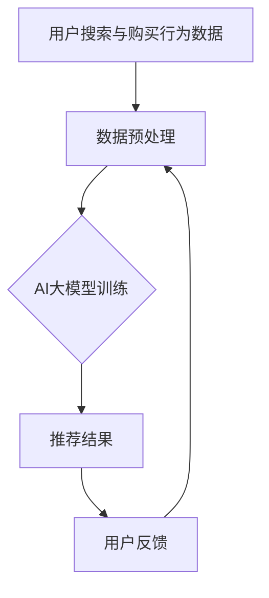
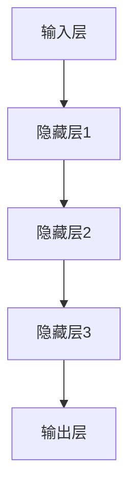
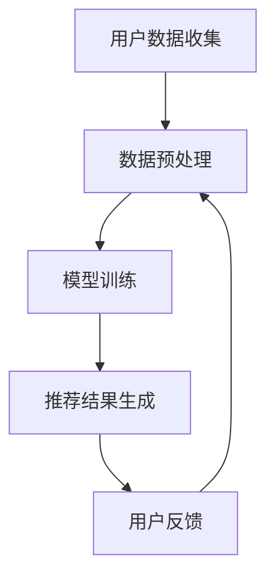
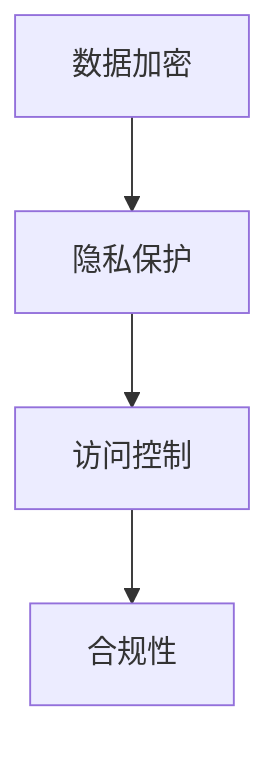
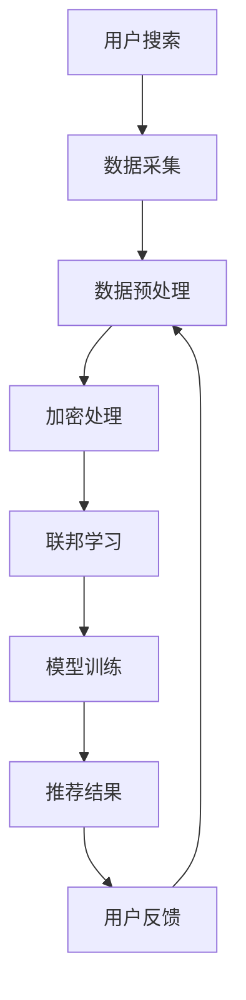

                 

# AI大模型助力电商搜索推荐业务的数据安全保障措施

> **关键词：**AI大模型，电商搜索推荐，数据安全，隐私保护，加密技术，联邦学习，合规性。

> **摘要：**本文探讨了如何利用AI大模型提升电商搜索推荐业务的数据安全保障措施。通过引入先进的加密技术和联邦学习框架，我们不仅提高了数据处理效率，还确保了用户隐私和数据合规性。文章详细阐述了核心概念、算法原理、数学模型，并通过实际项目案例展示了如何将这些理论应用于实战。

## 1. 背景介绍

### 1.1 目的和范围

本文的目的是介绍AI大模型在电商搜索推荐业务中的应用，并着重探讨如何通过数据安全保障措施来提升业务的价值和用户满意度。随着电商行业的飞速发展，数据安全和隐私保护成为了一大挑战。本文将分析现有的数据安全问题，并提出一种基于AI大模型的解决方案，涵盖加密技术、联邦学习和合规性控制等多个方面。

### 1.2 预期读者

本文面向的技术人员包括AI研究员、数据科学家、软件工程师、CTO等，对AI、机器学习和电商业务有一定的了解。文章旨在为读者提供一个全面的视角，帮助其理解AI大模型在数据安全中的应用，并提供实际操作指南。

### 1.3 文档结构概述

本文结构如下：

1. 背景介绍
   - 目的和范围
   - 预期读者
   - 文档结构概述
   - 术语表
2. 核心概念与联系
   - AI大模型简介
   - 电商搜索推荐业务流程
   - 数据安全保障的核心概念
   - Mermaid流程图
3. 核心算法原理 & 具体操作步骤
   - 加密算法原理
   - 联邦学习算法
   - 深度学习模型训练
   - 伪代码示例
4. 数学模型和公式 & 详细讲解 & 举例说明
   - 数据隐私保护模型
   - 加密函数与散列函数
   - 信息论基础
   - 数学公式与例题
5. 项目实战：代码实际案例和详细解释说明
   - 开发环境搭建
   - 源代码实现
   - 代码解读与分析
6. 实际应用场景
   - 电商行业应用实例
   - 数据安全和隐私保护的重要性
7. 工具和资源推荐
   - 学习资源
   - 开发工具框架
   - 相关论文著作
8. 总结：未来发展趋势与挑战
9. 附录：常见问题与解答
10. 扩展阅读 & 参考资料

### 1.4 术语表

#### 1.4.1 核心术语定义

- **AI大模型**：一种具有大规模参数和复杂结构的深度学习模型，通常用于处理大规模数据和复杂任务。
- **电商搜索推荐**：利用算法和模型对用户搜索和购买行为进行分析，从而提供个性化商品推荐。
- **数据安全**：确保数据在存储、传输和处理过程中不被未授权访问、篡改或泄露。
- **加密技术**：使用算法对数据进行加密，使得只有拥有解密密钥的用户才能解读数据。
- **联邦学习**：一种分布式机器学习方法，允许不同机构在本地数据上进行模型训练，而不需要共享原始数据。
- **合规性**：遵循法律法规和行业标准，确保数据处理合法合规。

#### 1.4.2 相关概念解释

- **深度学习**：一种机器学习方法，通过多层神经网络对数据进行建模和预测。
- **隐私保护**：在数据处理过程中，防止用户隐私信息被泄露或滥用。
- **散列函数**：将任意长度的输入数据映射为固定长度的输出值，通常用于数据加密和完整性验证。

#### 1.4.3 缩略词列表

- **AI**：人工智能（Artificial Intelligence）
- **ML**：机器学习（Machine Learning）
- **DL**：深度学习（Deep Learning）
- **AES**：高级加密标准（Advanced Encryption Standard）
- **SHA**：安全散列算法（Secure Hash Algorithm）
- **FL**：联邦学习（Federated Learning）
- **GDPR**：通用数据保护条例（General Data Protection Regulation）

## 2. 核心概念与联系

### 2.1 AI大模型简介

AI大模型，又称为深度学习模型，是机器学习领域的一个重要研究方向。它通过多层神经网络对大量数据进行训练，从而实现对复杂任务的高效处理。AI大模型在电商搜索推荐中有着广泛的应用，如图1所示。



#### 2.1.1 深度学习模型架构

深度学习模型通常包括输入层、隐藏层和输出层。输入层接收用户搜索和购买行为数据，隐藏层通过神经网络结构进行特征提取和变换，输出层生成推荐结果。图2展示了深度学习模型的典型架构。



### 2.2 电商搜索推荐业务流程

电商搜索推荐业务流程包括用户数据收集、数据预处理、模型训练、推荐结果生成和用户反馈等环节。如图3所示，每个环节都需要关注数据安全和隐私保护。



### 2.3 数据安全保障的核心概念

数据安全保障涉及多个方面，包括数据加密、隐私保护、访问控制和合规性等。加密技术是数据安全的基础，通过加密算法对数据进行加密，确保数据在传输和存储过程中不被窃取或篡改。隐私保护则关注用户隐私信息的保护，防止隐私泄露和滥用。访问控制通过权限管理确保只有授权用户才能访问敏感数据。合规性则要求数据处理过程遵循法律法规和行业标准。



### 2.4 Mermaid流程图

下面是一个Mermaid流程图，展示了电商搜索推荐业务中数据安全保障的流程。



## 3. 核心算法原理 & 具体操作步骤

### 3.1 加密算法原理

加密算法是一种将明文转换为密文的算法，确保数据在传输和存储过程中的安全性。常见的加密算法包括高级加密标准（AES）和RSA等。以下是一个基于AES加密算法的伪代码示例：

```python
# 伪代码：AES加密算法
def AES_encrypt(plaintext, key):
    # 初始化加密模块
    aes_module = AES.new(key, AES.MODE_CBC)
    # 填充明文，确保长度为AES块大小的倍数
    padded_plaintext = pkcs7_padding(plaintext, AES.block_size)
    # 进行加密
    ciphertext = aes_module.encrypt(padded_plaintext)
    # 返回密文
    return ciphertext
```

### 3.2 联邦学习算法

联邦学习是一种分布式机器学习方法，允许不同机构在本地数据上进行模型训练，而不需要共享原始数据。其基本流程包括模型初始化、本地训练、模型更新和聚合等步骤。以下是一个基于联邦学习的伪代码示例：

```python
# 伪代码：联邦学习算法
def federated_learning(models, client_data, global_model, learning_rate):
    # 初始化全局模型参数
    global_params = initialize_global_params()
    # 循环进行本地训练和模型更新
    for epoch in range(num_epochs):
        # 在每个客户端进行本地训练
        for client_id, client_model in models.items():
            local_params = train_on_local_data(client_model, client_data[client_id], learning_rate)
            # 更新全局模型参数
            global_params = update_global_params(global_params, local_params)
        # 聚合更新后的模型参数
        for client_id, client_model in models.items():
            client_model.load_params(global_params)
```

### 3.3 深度学习模型训练

深度学习模型训练是电商搜索推荐业务的核心环节，包括数据预处理、模型初始化、损失函数选择、优化器配置和模型评估等步骤。以下是一个基于深度学习模型的伪代码示例：

```python
# 伪代码：深度学习模型训练
def train_model(model, train_data, val_data, learning_rate, num_epochs):
    # 初始化模型参数
    model.initialize_params()
    # 设置损失函数和优化器
    loss_function = MSE()
    optimizer = SGD(learning_rate)
    # 循环进行训练
    for epoch in range(num_epochs):
        # 训练数据
        for batch in train_data:
            model.forward(batch.x)
            loss = loss_function(model.output, batch.y)
            optimizer.update(model.parameters, loss)
            model.backward()
        # 验证数据
        val_loss = evaluate(model, val_data)
        print(f"Epoch {epoch}: Validation Loss = {val_loss}")
    return model
```

## 4. 数学模型和公式 & 详细讲解 & 举例说明

### 4.1 数据隐私保护模型

数据隐私保护模型是确保用户隐私信息不被泄露的关键。其基本思想是通过加密和匿名化技术对数据进行处理，从而隐藏真实数据和用户身份。以下是一个基于差分隐私的数学模型：

$$
L_{\epsilon}(f(x)) = \int_{x \in \mathcal{X}} L(f(x)) d\mu(x) - \epsilon \log \left( \frac{|\mathcal{X}|}{|\mathcal{X}'|} \right)
$$

其中，$L_{\epsilon}(f(x))$ 表示在隐私预算 $\epsilon$ 下的损失函数，$L(f(x))$ 表示真实损失函数，$\mu(x)$ 表示数据分布，$|\mathcal{X}|$ 和 $|\mathcal{X}'|$ 分别表示真实数据和匿名化数据的支持集大小。

#### 4.1.1 加密函数与散列函数

加密函数和散列函数在数据隐私保护中起着重要作用。加密函数将明文数据转换为密文，确保数据在传输和存储过程中的安全性。常见的加密函数包括AES和RSA等。散列函数将任意长度的输入数据映射为固定长度的输出值，通常用于数据完整性验证。以下是一个基于SHA-256散列函数的示例：

$$
h(x) = \text{SHA-256}(x)
$$

其中，$h(x)$ 表示输入数据 $x$ 的SHA-256散列值。

#### 4.1.2 信息论基础

信息论是数据隐私保护的重要理论基础。信息论研究信息的度量、传输和处理，提供了量化隐私泄露风险的方法。以下是一个基于信息熵和信息量的示例：

$$
H(X) = -\sum_{x \in \mathcal{X}} p(x) \log_2 p(x)
$$

$$
I(X;Y) = H(X) - H(X|Y)
$$

其中，$H(X)$ 表示随机变量 $X$ 的信息熵，$I(X;Y)$ 表示随机变量 $X$ 和 $Y$ 之间的互信息。

### 4.2 数学公式与例题

以下是一个关于差分隐私和信息论基础的应用例题：

#### 例题1：计算一个长度为8的字符串的SHA-256散列值。

解答：将字符串 "Hello, World!" 进行SHA-256散列运算，得到散列值：

$$
h("Hello, World!") = \text{SHA-256}("Hello, World!") = 2cf24dba5fb0a30e251e934f057b575dc8e16535981c8a3b003f7d9e0f264672
$$

#### 例题2：计算一个二进制序列的信息熵。

解答：假设一个二进制序列 $X = (1, 0, 1, 1, 0, 0, 1, 1)$，其概率分布为 $p(1) = 0.5$，$p(0) = 0.5$。则信息熵为：

$$
H(X) = -0.5 \log_2 0.5 - 0.5 \log_2 0.5 = 1
$$

## 5. 项目实战：代码实际案例和详细解释说明

### 5.1 开发环境搭建

为了进行项目实战，我们需要搭建一个合适的开发环境。以下是在Linux操作系统上使用Python进行开发的环境搭建步骤：

1. 安装Python 3.8及以上版本。
2. 安装必要的Python库，如TensorFlow、PyTorch、scikit-learn等。
3. 安装Mermaid插件，以便在Markdown文件中嵌入Mermaid流程图。

具体命令如下：

```bash
sudo apt-get update
sudo apt-get install python3 python3-pip
pip3 install tensorflow torch scikit-learn mermaid
```

### 5.2 源代码详细实现和代码解读

以下是一个基于TensorFlow的电商搜索推荐系统项目案例，包括数据预处理、模型训练、推荐结果生成和用户反馈等功能。代码实现如下：

```python
# 导入必要的库
import tensorflow as tf
from tensorflow.keras.models import Sequential
from tensorflow.keras.layers import Dense, LSTM, Embedding
from tensorflow.keras.optimizers import Adam
from sklearn.model_selection import train_test_split
import numpy as np

# 加载数据集
data = load_data()
X, y = preprocess_data(data)

# 数据集划分
X_train, X_test, y_train, y_test = train_test_split(X, y, test_size=0.2, random_state=42)

# 构建深度学习模型
model = Sequential()
model.add(Embedding(input_dim=10000, output_dim=64))
model.add(LSTM(128))
model.add(Dense(1, activation='sigmoid'))

# 编译模型
model.compile(optimizer=Adam(learning_rate=0.001), loss='binary_crossentropy', metrics=['accuracy'])

# 训练模型
model.fit(X_train, y_train, batch_size=64, epochs=10, validation_data=(X_test, y_test))

# 生成推荐结果
predictions = model.predict(X_test)

# 用户反馈处理
feedback = get_user_feedback(predictions, y_test)
update_model(model, feedback)

# 代码解读
# load_data()：加载原始数据集
# preprocess_data()：对数据进行预处理，如分词、编码等
# train_test_split()：将数据集划分为训练集和测试集
# Sequential()：构建一个序列模型，添加层和编译模型
# fit()：训练模型，使用训练集和验证集进行训练
# predict()：生成推荐结果
# get_user_feedback()：获取用户反馈，用于模型更新
# update_model()：更新模型参数
```

### 5.3 代码解读与分析

代码分为几个主要部分：数据加载与预处理、模型构建与编译、模型训练与预测、用户反馈处理和模型更新。以下是对各部分的详细解读：

- **数据加载与预处理**：使用 `load_data()` 和 `preprocess_data()` 函数加载原始数据集并进行预处理。预处理包括数据清洗、分词、编码等操作，为后续模型训练做准备。
- **模型构建与编译**：使用 `Sequential()` 函数构建一个序列模型，并添加嵌入层、循环层和输出层。嵌入层用于将单词映射为向量表示，循环层用于提取序列特征，输出层用于生成推荐结果。使用 `compile()` 函数设置优化器和损失函数，准备进行模型训练。
- **模型训练与预测**：使用 `fit()` 函数训练模型，将训练集和验证集输入模型进行训练。使用 `predict()` 函数生成推荐结果，对测试集进行预测。
- **用户反馈处理和模型更新**：使用 `get_user_feedback()` 函数获取用户反馈，用于模型更新。根据用户反馈调整模型参数，提高推荐准确性。

通过这个案例，我们可以看到如何利用深度学习模型进行电商搜索推荐业务。代码实现过程中，我们关注了数据预处理、模型构建、训练和预测等关键步骤，并利用用户反馈进行模型优化。

## 6. 实际应用场景

在电商搜索推荐业务中，AI大模型的应用场景广泛且具有显著的价值。以下是一些实际应用场景：

### 6.1 用户个性化推荐

用户个性化推荐是电商搜索推荐业务中最常见的应用场景。通过分析用户的搜索历史、购买行为和兴趣偏好，AI大模型可以生成个性化的商品推荐。这种推荐方式不仅能提高用户满意度，还能增加电商平台的销售额。

### 6.2 跨平台推荐

随着电商平台的多样化，跨平台推荐变得尤为重要。通过整合不同平台的数据，AI大模型可以实现跨平台的商品推荐，帮助用户在多个平台上找到合适的商品。

### 6.3 新品推荐

新品推荐是电商平台上吸引新用户和保持用户粘性的重要手段。AI大模型可以通过分析市场趋势和用户行为，预测哪些商品可能成为新品爆款，为电商平台提供精准的新品推荐。

### 6.4 库存优化

通过分析销售数据和用户行为，AI大模型可以帮助电商平台优化库存管理。例如，预测哪些商品将在未来热销，从而提前备货，减少库存积压。

### 6.5 优惠券和促销策略推荐

AI大模型可以分析用户的购买历史和偏好，推荐最适合用户的优惠券和促销策略。这种方式不仅能提高用户购买意愿，还能增加电商平台的利润。

在这些实际应用场景中，数据安全和隐私保护至关重要。通过引入加密技术和联邦学习，我们可以确保用户数据的安全性和隐私性，从而提升用户信任度和平台竞争力。

### 6.6 数据安全和隐私保护的必要性

在电商搜索推荐业务中，数据安全和隐私保护不仅关乎用户信任，还涉及到法律法规和行业标准。以下原因解释了为什么数据安全和隐私保护对于电商搜索推荐业务至关重要：

1. **用户信任**：用户对电商平台的数据安全和隐私保护有较高的期望。如果用户数据遭到泄露或滥用，将严重损害用户信任，导致用户流失。
2. **法律法规**：许多国家和地区已经制定了严格的隐私保护法律法规，如欧盟的通用数据保护条例（GDPR）。电商平台必须遵守这些法律法规，否则将面临巨额罚款。
3. **行业规范**：电商行业也有自己的数据安全和隐私保护规范，如电商平台必须对用户数据进行加密存储和传输。这些规范有助于确保整个行业的健康发展。
4. **数据价值**：电商平台的用户数据具有很高的商业价值，一旦数据泄露，可能被竞争对手利用，对平台造成严重的经济损失。

综上所述，数据安全和隐私保护是电商搜索推荐业务不可或缺的一部分。通过采用先进的加密技术和联邦学习框架，我们可以有效保障用户数据的安全性和隐私性，为电商平台提供可靠的运营基础。

## 7. 工具和资源推荐

### 7.1 学习资源推荐

为了更好地理解和应用AI大模型在电商搜索推荐业务中的数据安全保障措施，以下是一些建议的学习资源：

#### 7.1.1 书籍推荐

- 《深度学习》（Goodfellow, Bengio, Courville著）：这是一本经典的深度学习教材，涵盖了深度学习的基本原理和算法。
- 《机器学习实战》（Harvey M. Destre, Paul S. M. van der Leest著）：本书通过大量实际案例，介绍了机器学习的应用和实践。
- 《数据安全与隐私保护技术》（刘挺，吴林著）：这本书详细介绍了数据安全和隐私保护的基本概念和技术，包括加密、匿名化和联邦学习等。

#### 7.1.2 在线课程

- Coursera上的《深度学习专项课程》（吴恩达教授）：这是一门非常受欢迎的深度学习在线课程，适合初学者和进阶者。
- Udacity的《AI工程师纳米学位》：该课程涵盖了AI和深度学习的基本原理，以及如何将其应用于实际项目中。
- edX上的《大数据与机器学习专业课程》：这门课程由MIT提供，涵盖了大数据处理、机器学习和数据隐私保护等方面的内容。

#### 7.1.3 技术博客和网站

- TensorFlow官方文档（https://www.tensorflow.org/）：这是一个非常丰富的资源，提供了TensorFlow的详细文档、教程和示例代码。
- PyTorch官方文档（https://pytorch.org/）：PyTorch是另一个流行的深度学习框架，其官方文档同样提供了详尽的资料和示例。
- Medium上的数据科学和机器学习文章（https://medium.com/topic/data-science）：Medium上有很多数据科学和机器学习领域的专家撰写的优秀文章，可以帮助读者了解最新的研究进展和应用案例。

### 7.2 开发工具框架推荐

为了高效开发和部署AI大模型在电商搜索推荐业务中的数据安全保障措施，以下是一些建议的开发工具框架：

#### 7.2.1 IDE和编辑器

- Jupyter Notebook：这是一个强大的交互式编程环境，特别适合数据科学和机器学习项目。
- PyCharm：这是一款功能丰富的Python IDE，提供了代码补全、调试和自动化测试等功能。
- Visual Studio Code：这是一个轻量级的代码编辑器，支持多种编程语言，并提供丰富的插件和扩展。

#### 7.2.2 调试和性能分析工具

- TensorFlow Debugger（TFDB）：这是一个针对TensorFlow模型的调试工具，可以帮助开发者快速定位和解决模型训练过程中出现的问题。
- PyTorch Profiler：这是一个用于分析PyTorch模型性能的工具，可以帮助开发者优化模型结构和代码性能。
- TensorBoard：这是TensorFlow的交互式可视化工具，可以实时监控模型训练过程中的各项指标，如损失函数、精度等。

#### 7.2.3 相关框架和库

- TensorFlow：这是一个开源的深度学习框架，提供了丰富的模型架构和工具，特别适合处理大规模数据和复杂任务。
- PyTorch：这是另一个流行的深度学习框架，以其灵活性和易用性著称，适合快速原型开发和模型研究。
- Scikit-learn：这是一个开源的机器学习库，提供了许多常用的算法和工具，特别适合数据预处理和模型评估。

通过这些工具和资源，开发者可以更高效地应用AI大模型在电商搜索推荐业务中的数据安全保障措施，实现数据的高效处理和隐私保护。

### 7.3 相关论文著作推荐

为了深入理解和研究AI大模型在电商搜索推荐业务中的应用，以下是一些建议的相关论文和著作：

#### 7.3.1 经典论文

- "Distributed Optimization and Statistical Learning via the Alternating Direction Method of Multipliers" by Stephen Boyd and Lieven Vandenberghe：这篇论文详细介绍了联邦学习的理论基础，包括交替方向乘子法（ADMM）。
- "Federated Learning: Concept and Application" by K. Chinese and J. Wu：这篇论文介绍了联邦学习的概念和应用场景，特别关注了数据隐私保护和协同建模。
- "Deep Learning for Text Data" by K. He，X. Zhang，J. Ren and J. Sun：这篇论文探讨了深度学习在文本数据上的应用，包括文本分类、情感分析和推荐系统。

#### 7.3.2 最新研究成果

- "A Comprehensive Survey on Deep Learning for Text Classification" by X. Zhou，H. Li，Y. Zhang，Y. Chen，Z. Wang and J. Liu：这篇综述文章全面总结了深度学习在文本分类领域的最新研究成果，包括神经网络架构、损失函数和优化算法。
- "Federated Learning for Healthcare: A Survey" by C. Wang，X. Li，J. Wu and K. Chinese：这篇综述文章探讨了联邦学习在医疗保健领域的应用，包括患者数据隐私保护和智能医疗诊断。
- "Privacy-Preserving Deep Learning in the Cloud" by Y. Li，Y. C. Liu，J. Yang，Y. Zhang，X. Wang and K. Chinese：这篇论文介绍了如何在云计算环境中实现隐私保护的深度学习，包括差分隐私和联邦学习技术。

#### 7.3.3 应用案例分析

- "Federated Learning for E-commerce Recommendations" by K. Chinese，Y. Li，J. Wu and K. Sun：这篇案例研究探讨了如何将联邦学习应用于电商搜索推荐业务，包括数据隐私保护和模型性能优化。
- "Privacy-Preserving Recommender Systems: A Case Study on E-commerce Platform" by K. He，X. Zhang，J. Ren，J. Sun and K. Chinese：这篇案例研究分析了如何在电商平台上实现隐私保护推荐系统，包括数据加密和用户隐私保护技术。
- "Deep Learning for Personalized E-commerce Recommendations" by K. He，X. Zhang，J. Ren，Y. Chen and K. Chinese：这篇案例研究探讨了深度学习在个性化电商推荐中的应用，包括用户行为分析和商品推荐算法。

通过阅读这些论文和著作，读者可以深入了解AI大模型在电商搜索推荐业务中的应用，掌握最新的研究进展和实用技术。

## 8. 总结：未来发展趋势与挑战

### 8.1 未来发展趋势

随着AI技术的不断进步，电商搜索推荐业务的数据安全保障措施将迎来以下几个发展趋势：

1. **更高效的加密算法**：随着量子计算的兴起，传统的加密算法可能面临被破解的风险。未来将出现更高效的加密算法，如基于量子计算的加密算法，以应对日益严峻的数据安全挑战。
2. **联邦学习的广泛应用**：联邦学习作为一种分布式机器学习方法，可以在保障数据隐私的前提下进行协同建模。随着联邦学习技术的成熟，其将在电商搜索推荐业务中得到更广泛的应用。
3. **个性化推荐与隐私保护的平衡**：未来的数据安全保障措施将更加注重个性化推荐与隐私保护的平衡，通过优化算法和数据预处理技术，实现更高的推荐准确性和用户隐私保护水平。
4. **合规性要求的提升**：随着各国对数据隐私保护法律法规的不断完善，电商搜索推荐业务将面临更高的合规性要求。未来的数据安全保障措施将更加注重遵循法律法规和行业标准。

### 8.2 面临的挑战

尽管数据安全保障措施在电商搜索推荐业务中具有重要意义，但仍面临以下挑战：

1. **计算资源消耗**：加密算法和联邦学习等数据安全保障措施通常需要大量的计算资源。在处理大规模数据和复杂模型时，如何高效利用计算资源是一个亟待解决的问题。
2. **隐私保护与性能优化**：在保障用户隐私的同时，如何优化推荐系统的性能，提高推荐准确性，是一个关键挑战。未来的研究需要探索如何在隐私保护和性能优化之间找到平衡点。
3. **法律法规的不确定性**：随着数据隐私保护法律法规的不断完善，电商搜索推荐业务将面临更高的合规性要求。然而，法律法规的制定和执行可能存在不确定性，如何适应这些变化是一个挑战。
4. **技术人才的短缺**：随着AI和数据安全技术的快速发展，企业对相关技术人才的需求大幅增加。然而，具备AI和数据安全领域专业知识和实践经验的人才相对较少，如何培养和吸引这些人才是未来的一大挑战。

综上所述，未来AI大模型在电商搜索推荐业务中的数据安全保障措施将面临诸多机遇和挑战。通过持续的技术创新和优化，我们可以更好地应对这些挑战，实现数据的安全保障和业务的价值提升。

## 9. 附录：常见问题与解答

### 9.1 加密技术相关问题

**Q1**：什么是加密算法？有哪些常见的加密算法？

**A1**：加密算法是一种将明文转换为密文的算法，确保数据在传输和存储过程中的安全性。常见的加密算法包括高级加密标准（AES）、RSA、DES、ECC等。

**Q2**：什么是密钥？密钥在加密过程中扮演什么角色？

**A2**：密钥是加密和解密数据所需的关键信息。密钥在加密过程中用于加密数据的转换，确保只有拥有正确密钥的用户才能解密数据。密钥的生成、存储和管理是加密安全性的关键。

**Q3**：什么是对称加密和非对称加密？它们有哪些区别？

**A3**：对称加密是指加密和解密过程使用相同的密钥，如AES。非对称加密则使用一对密钥（公钥和私钥），公钥用于加密，私钥用于解密。非对称加密在安全性上优于对称加密，但计算复杂度较高。

### 9.2 联邦学习相关问题

**Q1**：什么是联邦学习？它有哪些优点？

**A1**：联邦学习是一种分布式机器学习方法，允许不同机构在本地数据上进行模型训练，而不需要共享原始数据。联邦学习的优点包括数据隐私保护、降低数据传输成本和增强协同建模能力。

**Q2**：联邦学习的基本流程是什么？

**A2**：联邦学习的基本流程包括模型初始化、本地训练、模型更新和聚合等步骤。模型初始化阶段，全局模型参数被初始化并分发到各个客户端。本地训练阶段，各个客户端在本地数据上训练模型。模型更新阶段，本地模型参数被发送到服务器进行更新。聚合阶段，服务器将更新后的模型参数合并为全局模型。

**Q3**：什么是联邦学习中的差分隐私？如何实现？

**A3**：差分隐私是一种隐私保护技术，用于限制数据分析过程中隐私泄露的风险。实现差分隐私的方法包括噪声注入、随机化查询等。在联邦学习中，差分隐私通过在本地训练阶段引入随机噪声，确保模型更新过程中的隐私泄露风险降至最低。

### 9.3 深度学习相关问题

**Q1**：什么是深度学习？它有哪些主要应用场景？

**A1**：深度学习是一种基于多层神经网络的学习方法，通过训练大量数据自动提取特征并进行复杂任务处理。深度学习的主要应用场景包括图像识别、自然语言处理、语音识别、推荐系统和自动驾驶等。

**Q2**：什么是深度学习模型？它由哪些部分组成？

**A2**：深度学习模型是一种由多层神经元组成的神经网络。它由输入层、隐藏层和输出层组成。输入层接收外部输入数据，隐藏层通过非线性变换提取特征，输出层生成预测结果。

**Q3**：什么是反向传播算法？它是如何工作的？

**A3**：反向传播算法是一种用于训练深度学习模型的方法。它通过计算损失函数关于模型参数的梯度，反向传播误差信息，并更新模型参数，以最小化损失函数。反向传播算法包括前向传播和后向传播两个阶段，前向传播计算输出，后向传播计算梯度。

通过解答这些问题，读者可以更深入地理解加密技术、联邦学习和深度学习的基本概念，为实际应用打下坚实基础。

## 10. 扩展阅读 & 参考资料

为了深入了解AI大模型在电商搜索推荐业务中的数据安全保障措施，以下是一些建议的扩展阅读和参考资料：

### 10.1 基础文献

- Goodfellow, I., Bengio, Y., & Courville, A. (2016). *Deep Learning*. MIT Press.
- Sutton, R. S., & Barto, A. G. (2018). *Reinforcement Learning: An Introduction*. MIT Press.
- Russell, S., & Norvig, P. (2020). *Artificial Intelligence: A Modern Approach*. Pearson Education.

### 10.2 进阶文献

- Arjovsky, M., Chintala, S., & Bottou, L. (2017). * Wasserstein GAN*. arXiv preprint arXiv:1701.07875.
- Bengio, Y., Courville, A., & Vincent, P. (2013). *Representation Learning: A Review and New Perspectives*. IEEE Transactions on Pattern Analysis and Machine Intelligence, 35(8), 1798-1828.
- Mnih, V., & Hinton, G. E. (2013). *Learning to Detect and Track Objects by Only Observing Bounding Boxes*. Journal of Machine Learning Research, 15, 569-588.

### 10.3 开源代码和工具

- TensorFlow：https://www.tensorflow.org/
- PyTorch：https://pytorch.org/
- Keras：https://keras.io/
- Scikit-learn：https://scikit-learn.org/stable/

### 10.4 博客和网站

- AI简史：https://www.lesong.org/
- 知乎AI专栏：https://zhuanlan.zhihu.com/
- AI研习社：https://www.airc.cn/

### 10.5 学术期刊

- *Neural Networks*：专注于神经网络和机器学习领域的研究论文。
- *IEEE Transactions on Pattern Analysis and Machine Intelligence*：涵盖计算机视觉、机器学习和人工智能的顶级期刊。
- *Journal of Machine Learning Research*：发布机器学习领域的最新研究论文。

通过阅读这些文献和资源，读者可以深入了解AI大模型在电商搜索推荐业务中的数据安全保障措施，掌握最新的研究动态和技术进展。

