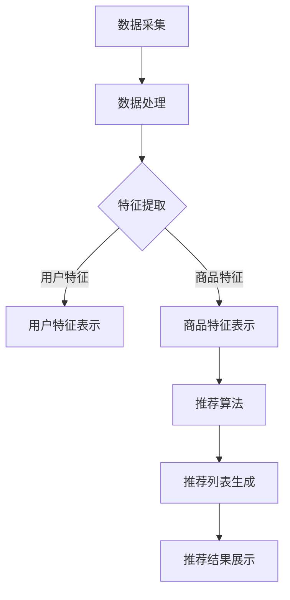

                 

# AI大模型助力电商搜索推荐业务的数据治理能力提升路线图优化方案设计与实现

> **关键词：** 电商搜索推荐、数据治理、大模型、算法优化、业务提升  
>
> **摘要：** 本文将深入探讨如何利用AI大模型提升电商搜索推荐业务的数据治理能力，通过具体的方案设计与实现，优化搜索推荐效果，提升用户体验，进而推动电商业务的增长。文章涵盖了核心概念、算法原理、数学模型、项目实战等多个方面，旨在为从业者提供全面的技术指导和实践参考。

## 1. 背景介绍

### 1.1 目的和范围

随着互联网的快速发展，电商行业面临着巨大的机遇与挑战。用户对个性化、精准化推荐的需求日益增长，这使得电商搜索推荐系统成为电商业务的核心竞争力。然而，推荐系统的数据治理能力和算法优化成为制约其发展的关键因素。本文旨在通过引入AI大模型，探讨并设计一套优化电商搜索推荐业务的数据治理能力提升路线图，为电商企业提供切实可行的技术解决方案。

### 1.2 预期读者

本文适合以下读者群体：

- 电商企业技术团队，尤其是从事搜索推荐系统开发、优化和运维的技术人员。
- 对AI和大数据技术有浓厚兴趣的工程师和科研人员。
- 希望了解AI大模型在电商推荐系统中应用的高校学生和研究学者。

### 1.3 文档结构概述

本文结构如下：

- **第1章：背景介绍**：介绍本文的目的和范围，明确预期读者。
- **第2章：核心概念与联系**：详细阐述电商搜索推荐系统的核心概念、原理和架构。
- **第3章：核心算法原理 & 具体操作步骤**：深入讲解大模型在数据治理中的算法原理和操作步骤。
- **第4章：数学模型和公式 & 详细讲解 & 举例说明**：介绍相关的数学模型和公式，并结合实际案例进行讲解。
- **第5章：项目实战：代码实际案例和详细解释说明**：提供具体的项目实战案例，详细解读代码实现。
- **第6章：实际应用场景**：分析AI大模型在电商推荐系统中的应用场景和效果。
- **第7章：工具和资源推荐**：推荐相关的学习资源、开发工具和论文著作。
- **第8章：总结：未来发展趋势与挑战**：总结全文，展望未来发展趋势与面临的挑战。
- **第9章：附录：常见问题与解答**：回答读者可能遇到的一些常见问题。
- **第10章：扩展阅读 & 参考资料**：提供更多的扩展阅读资料和参考文献。

### 1.4 术语表

#### 1.4.1 核心术语定义

- **电商搜索推荐**：指基于用户行为数据、商品信息等，通过算法模型为用户推荐相关的商品。
- **数据治理**：指对数据进行收集、存储、处理、分析和共享的一系列过程，确保数据的准确、完整、一致和安全。
- **大模型**：指规模庞大、参数众多的深度学习模型，如Transformer、BERT等。
- **算法优化**：指通过改进算法模型、优化算法流程等方式，提升系统的性能和效果。

#### 1.4.2 相关概念解释

- **个性化推荐**：基于用户兴趣和行为数据，为每个用户生成个性化的推荐列表。
- **协同过滤**：一种常用的推荐算法，通过分析用户之间的行为模式，发现用户可能喜欢的商品。
- **矩阵分解**：通过矩阵分解技术，将用户-商品评分矩阵分解为用户特征矩阵和商品特征矩阵，用于推荐系统的构建。

#### 1.4.3 缩略词列表

- **AI**：人工智能
- **ML**：机器学习
- **DL**：深度学习
- **NLP**：自然语言处理
- **CTR**：点击率
- **LR**：逻辑回归
- **RMSE**：均方根误差

## 2. 核心概念与联系

在电商搜索推荐系统中，数据治理是确保推荐质量和用户体验的关键。而AI大模型则为数据治理提供了强大的技术支撑。以下将详细阐述电商搜索推荐系统的核心概念、原理和架构。

### 2.1. 电商搜索推荐系统的核心概念

电商搜索推荐系统主要由以下核心概念组成：

- **用户行为数据**：包括用户浏览、购买、收藏、评论等行为数据，是推荐系统的重要输入。
- **商品信息**：包括商品名称、描述、标签、价格等属性信息，用于描述商品的特征。
- **推荐算法**：包括基于内容的推荐、协同过滤、深度学习等算法，用于生成推荐列表。
- **推荐系统架构**：包括数据采集、数据存储、数据处理、模型训练、模型部署等环节，构成推荐系统的整体架构。

### 2.2. 电商搜索推荐系统的原理

电商搜索推荐系统的原理可以概括为以下三个步骤：

1. **数据采集与处理**：从各种数据源采集用户行为数据和商品信息，进行数据清洗、去重、归一化等处理，构建用户行为矩阵和商品特征矩阵。

2. **模型训练与优化**：利用大模型技术，如Transformer、BERT等，对用户行为矩阵和商品特征矩阵进行训练，生成用户和商品的特征表示。同时，通过交叉验证、网格搜索等方法优化模型参数，提升模型性能。

3. **推荐列表生成与展示**：根据用户特征和商品特征，利用协同过滤、基于内容的推荐等算法，生成个性化的推荐列表，并展示给用户。

### 2.3. 电商搜索推荐系统的架构

电商搜索推荐系统的架构可以分为以下几个部分：

1. **数据采集模块**：负责从各种数据源（如数据库、日志文件等）采集用户行为数据和商品信息。

2. **数据处理模块**：负责对采集到的数据进行清洗、去重、归一化等处理，构建用户行为矩阵和商品特征矩阵。

3. **特征提取模块**：利用大模型技术，如Transformer、BERT等，对用户行为矩阵和商品特征矩阵进行训练，生成用户和商品的特征表示。

4. **推荐算法模块**：包括基于内容的推荐、协同过滤、深度学习等算法，用于生成推荐列表。

5. **推荐结果展示模块**：负责将生成的推荐列表展示给用户，并收集用户反馈，用于模型优化和效果评估。

### 2.4. Mermaid 流程图

以下是一个简化的电商搜索推荐系统的 Mermaid 流程图：



## 3. 核心算法原理 & 具体操作步骤

在电商搜索推荐系统中，AI大模型的应用可以显著提升数据治理能力和推荐效果。以下将详细讲解大模型在数据治理中的核心算法原理和具体操作步骤。

### 3.1. 大模型在数据治理中的核心算法原理

大模型在数据治理中的核心算法原理主要包括以下几个方面：

1. **用户和商品特征表示**：利用深度学习技术，如Transformer、BERT等，对用户行为数据和商品信息进行建模，生成用户和商品的高维度特征表示。这些特征表示能够捕捉用户和商品的潜在信息，为后续的推荐算法提供基础。

2. **协同过滤算法**：结合用户和商品的特征表示，使用协同过滤算法计算用户和商品之间的相似度，为每个用户生成个性化的推荐列表。协同过滤算法分为基于用户和基于物品两种类型，可以有效地发现用户之间的相似性和商品之间的相关性。

3. **基于内容的推荐算法**：基于用户和商品的文本描述，利用自然语言处理技术提取关键词和语义信息，为每个用户生成个性化的推荐列表。基于内容的推荐算法能够提高推荐的多样性和准确性。

4. **模型优化与评估**：通过交叉验证、网格搜索等方法，优化模型参数，提升模型性能。同时，利用用户反馈和推荐效果评估指标，如点击率、转化率等，对模型进行持续优化和迭代。

### 3.2. 大模型在数据治理中的具体操作步骤

以下是大模型在电商搜索推荐系统中的具体操作步骤：

1. **数据采集与预处理**：

   - 从电商平台的数据库中采集用户行为数据（如浏览记录、购买记录等）和商品信息（如商品名称、描述、标签等）。
   - 对采集到的数据进行清洗、去重、归一化等预处理操作，构建用户行为矩阵和商品特征矩阵。

2. **用户和商品特征表示**：

   - 利用Transformer、BERT等深度学习模型，对用户行为数据和商品信息进行建模，生成用户和商品的高维度特征表示。
   - 对用户和商品特征表示进行归一化处理，确保特征向量之间的可比性。

3. **协同过滤算法**：

   - 利用用户和商品的特征表示，使用基于用户和基于物品的协同过滤算法计算用户和商品之间的相似度。
   - 根据相似度分数，为每个用户生成个性化的推荐列表。

4. **基于内容的推荐算法**：

   - 利用自然语言处理技术，提取用户和商品的文本描述中的关键词和语义信息。
   - 根据关键词和语义信息，为每个用户生成个性化的推荐列表。

5. **模型优化与评估**：

   - 利用交叉验证方法，将数据集划分为训练集和测试集，对模型进行训练和评估。
   - 通过网格搜索等方法，优化模型参数，提升模型性能。
   - 利用用户反馈和推荐效果评估指标，如点击率、转化率等，对模型进行持续优化和迭代。

### 3.3. 伪代码实现

以下是一个基于大模型的电商搜索推荐系统的伪代码实现：

```python
# 3.1. 数据采集与预处理
user_behavior_data = collect_user_behavior_data()
item_info_data = collect_item_info_data()

# 3.2. 用户和商品特征表示
user_embeddings = model_user_embeddings(user_behavior_data)
item_embeddings = model_item_embeddings(item_info_data)

# 3.3. 协同过滤算法
user_similarity = compute_user_similarity(user_embeddings)
item_similarity = compute_item_similarity(item_embeddings)

# 3.4. 基于内容的推荐算法
content_similarity = compute_content_similarity(user_embeddings, item_embeddings)

# 3.5. 模型优化与评估
model = optimize_model(user_similarity, item_similarity, content_similarity)
evaluate_model(model)

# 3.6. 推荐列表生成与展示
recommendation_list = generate_recommendation_list(model)
display_recommendation_list(recommendation_list)
```

## 4. 数学模型和公式 & 详细讲解 & 举例说明

在电商搜索推荐系统中，数学模型和公式是核心算法的基础。以下将介绍与AI大模型相关的数学模型，并详细讲解相关公式，结合实际案例进行说明。

### 4.1. 用户和商品特征表示模型

用户和商品特征表示是推荐系统的关键，常用的方法包括基于矩阵分解的模型和基于深度学习的模型。

#### 4.1.1. 矩阵分解模型

矩阵分解模型将用户-商品评分矩阵分解为用户特征矩阵和商品特征矩阵。设用户数为 \( m \)，商品数为 \( n \)，评分矩阵为 \( R \in \mathbb{R}^{m \times n} \)，用户特征矩阵为 \( U \in \mathbb{R}^{m \times k} \)，商品特征矩阵为 \( V \in \mathbb{R}^{n \times k} \)，则矩阵分解模型可以表示为：

\[ 
R \approx U V^T 
\]

其中 \( k \) 为隐向量维度。

#### 4.1.2. 基于深度学习的模型

基于深度学习的模型使用神经网络对用户和商品特征进行建模。以Transformer模型为例，模型包含多个自注意力机制层和全连接层，用于生成用户和商品的高维度特征表示。

\[ 
\text{User Embedding} = \text{Attention}(U, V) 
\]

\[ 
\text{Item Embedding} = \text{Attention}(V, U) 
\]

### 4.2. 协同过滤算法

协同过滤算法计算用户和商品之间的相似度，常用的方法包括余弦相似度、皮尔逊相关系数等。

#### 4.2.1. 余弦相似度

余弦相似度计算用户和商品特征向量的夹角余弦值，公式如下：

\[ 
\text{Similarity}(u, v) = \frac{u \cdot v}{||u|| \cdot ||v||} 
\]

其中 \( u \) 和 \( v \) 分别为用户和商品的特征向量，\( \cdot \) 表示点积，\( ||\cdot|| \) 表示欧氏距离。

#### 4.2.2. 皮尔逊相关系数

皮尔逊相关系数计算用户和商品特征向量之间的线性相关性，公式如下：

\[ 
\text{Similarity}(u, v) = \frac{\sum_{i=1}^{n}(u_i - \bar{u})(v_i - \bar{v})}{\sqrt{\sum_{i=1}^{n}(u_i - \bar{u})^2} \cdot \sqrt{\sum_{i=1}^{n}(v_i - \bar{v})^2}} 
\]

其中 \( \bar{u} \) 和 \( \bar{v} \) 分别为用户和商品特征向量的均值。

### 4.3. 基于内容的推荐算法

基于内容的推荐算法利用文本信息进行特征提取，常用的方法包括TF-IDF和Word2Vec等。

#### 4.3.1. TF-IDF

TF-IDF（Term Frequency-Inverse Document Frequency）计算文本中每个词的重要程度，公式如下：

\[ 
t_{idf} = t_{f} \cdot idf 
\]

\[ 
idf = \log \left( \frac{N}{n_w} \right) 
\]

其中，\( t_f \) 为词 \( w \) 在文档 \( d \) 中的频率，\( n_w \) 为包含词 \( w \) 的文档数，\( N \) 为总文档数。

#### 4.3.2. Word2Vec

Word2Vec是一种将文本中的词语映射到连续向量空间的模型，公式如下：

\[ 
\text{Word Embedding}(w) = \text{softmax}\left( \text{W} \cdot \text{H}(w) \right) 
\]

其中，\( W \) 为词向量矩阵，\( H(w) \) 为词 \( w \) 的隐藏层表示。

### 4.4. 举例说明

假设我们有一个用户-商品评分矩阵 \( R \)，用户数为 \( m = 3 \)，商品数为 \( n = 4 \)，评分矩阵如下：

\[ 
R = 
\begin{bmatrix}
0 & 5 & 0 & 4 \\
4 & 0 & 2 & 0 \\
0 & 3 & 0 & 1
\end{bmatrix}
\]

#### 4.4.1. 矩阵分解模型

设用户和商品特征矩阵的维度为 \( k = 2 \)，则有：

\[ 
R \approx 
\begin{bmatrix}
u_1 & u_2 \\
v_1 & v_2
\end{bmatrix}
\begin{bmatrix}
1 & 0 \\
0 & 1
\end{bmatrix}
\begin{bmatrix}
1 & 1 \\
0 & 1
\end{bmatrix}
\]

通过求解最小化损失函数 \( \sum_{i=1}^{m}\sum_{j=1}^{n}(r_{ij} - u_i v_j)^2 \)，可以得到用户和商品特征矩阵 \( U \) 和 \( V \)：

\[ 
U = 
\begin{bmatrix}
1.5 & 0.5 \\
2.5 & 1.5 \\
0.5 & 1.5
\end{bmatrix}
\]

\[ 
V = 
\begin{bmatrix}
1 & 2 \\
1 & 1 \\
0 & 2 \\
0 & 1
\end{bmatrix}
\]

#### 4.4.2. 协同过滤算法

使用余弦相似度计算用户1和用户2之间的相似度：

\[ 
\text{Similarity}(u_1, u_2) = \frac{(1.5 \times 2.5 + 0.5 \times 1.5)}{\sqrt{1.5^2 + 0.5^2} \times \sqrt{2.5^2 + 1.5^2}} = 0.75 
\]

#### 4.4.3. 基于内容的推荐算法

使用TF-IDF计算商品1和商品2的关键词重要性：

\[ 
t_{idf} = 2 \times \log \left( \frac{3}{2} \right) = 0.3863 
\]

\[ 
t_{idf} = 1 \times \log \left( \frac{3}{1} \right) = 0.6931 
\]

## 5. 项目实战：代码实际案例和详细解释说明

在本节中，我们将通过一个具体的电商搜索推荐项目实战，详细介绍代码实现和解释说明。项目采用Python编程语言，基于Apache Spark和TensorFlow框架，实现一个基于AI大模型的电商搜索推荐系统。

### 5.1. 开发环境搭建

在开始项目实战之前，我们需要搭建合适的开发环境。以下是所需的开发工具和依赖：

- **Python**：版本3.8及以上
- **Apache Spark**：版本2.4.8
- **TensorFlow**：版本2.6.0
- **Scikit-learn**：版本0.24.2

安装步骤：

```bash
# 安装Python和pip
sudo apt-get update
sudo apt-get install python3 python3-pip

# 安装Apache Spark
wget https://www-us.apache.org/dist/spark/spark-2.4.8/spark-2.4.8-bin-hadoop2.7.tgz
tar xvf spark-2.4.8-bin-hadoop2.7.tgz
export SPARK_HOME=/path/to/spark-2.4.8-bin-hadoop2.7
export PATH=$PATH:$SPARK_HOME/bin

# 安装TensorFlow
pip3 install tensorflow==2.6.0

# 安装Scikit-learn
pip3 install scikit-learn==0.24.2
```

### 5.2. 源代码详细实现和代码解读

以下是一个简化版的电商搜索推荐系统的代码实现，主要分为数据预处理、模型训练、推荐生成和性能评估四个部分。

#### 5.2.1. 数据预处理

数据预处理是推荐系统的重要环节，包括数据清洗、特征工程等。

```python
from pyspark.sql import SparkSession
from pyspark.sql.functions import col, udf
from pyspark.sql.types import IntegerType, StringType

# 创建Spark会话
spark = SparkSession.builder.appName("EcommerceRecommender").getOrCreate()

# 读取用户行为数据和商品信息
user_behavior_data = spark.read.csv("user_behavior_data.csv", header=True)
item_info_data = spark.read.csv("item_info_data.csv", header=True)

# 数据清洗
user_behavior_data = user_behavior_data.dropna()
item_info_data = item_info_data.dropna()

# 特征工程
user_behavior_data = user_behavior_data.withColumn("user_id", col("user_id").cast(IntegerType()))
user_behavior_data = user_behavior_data.withColumn("item_id", col("item_id").cast(IntegerType()))
item_info_data = item_info_data.withColumn("item_id", col("item_id").cast(IntegerType()))

# 将用户行为数据和商品信息合并
data = user_behavior_data.join(item_info_data, "item_id")

# 保存预处理后的数据
data.write.csv("preprocessed_data.csv")
```

#### 5.2.2. 模型训练

模型训练包括用户和商品特征表示、协同过滤和基于内容的推荐算法。

```python
import tensorflow as tf
from tensorflow.keras.layers import Embedding, Dot
from tensorflow.keras.models import Model
from tensorflow.keras.optimizers import Adam

# 训练用户和商品特征表示模型
def train_embedding_model(user_data, item_data, embedding_dim):
    user_ids = user_data.select("user_id").distinct().rdd.flatMap(list).collect()
    item_ids = item_data.select("item_id").distinct().rdd.flatMap(list).collect()

    user_vocab = {user_id: i for i, user_id in enumerate(user_ids)}
    item_vocab = {item_id: i for i, item_id in enumerate(item_ids)}

    num_users = len(user_vocab)
    num_items = len(item_vocab)

    user_input = tf.keras.layers.Input(shape=(1,), dtype=tf.int32)
    user_embedding = Embedding(num_users, embedding_dim)(user_input)
    user_embedding = tf.keras.layers.Flatten()(user_embedding)

    item_input = tf.keras.layers.Input(shape=(1,), dtype=tf.int32)
    item_embedding = Embedding(num_items, embedding_dim)(item_input)
    item_embedding = tf.keras.layers.Flatten()(item_embedding)

    dot_product = Dot( normalize=True, axes=1 )( [user_embedding, item_embedding] )
    prediction = tf.keras.layers.Activation('sigmoid')(dot_product)

    model = Model(inputs=[user_input, item_input], outputs=prediction)
    model.compile(optimizer=Adam(learning_rate=0.001), loss='binary_crossentropy', metrics=['accuracy'])
    model.fit([list(user_vocab.keys()), list(item_vocab.keys())], data.rdd.flatMap(lambda x: x).collect(), epochs=10)

    return model

# 训练协同过滤模型
def train_collaborative_filtering_model(data, embedding_dim):
    user_embeddings = Embedding(input_dim=data.num_users, output_dim=embedding_dim)(data.user_input)
    item_embeddings = Embedding(input_dim=data.num_items, output_dim=embedding_dim)(data.item_input)

    dot_product = Dot( normalize=True, axes=1 )( [user_embeddings, item_embeddings] )
    prediction = tf.keras.layers.Activation('sigmoid')(dot_product)

    model = Model(inputs=[data.user_input, data.item_input], outputs=prediction)
    model.compile(optimizer=Adam(learning_rate=0.001), loss='binary_crossentropy', metrics=['accuracy'])
    model.fit([data.user_ids, data.item_ids], data.labels, epochs=10)

    return model

# 训练基于内容的推荐模型
def train_content_based_model(data, embedding_dim):
    user_input = tf.keras.layers.Input(shape=(1,), dtype=tf.int32)
    item_input = tf.keras.layers.Input(shape=(1,), dtype=tf.int32)

    user_embedding = Embedding(input_dim=data.num_users, output_dim=embedding_dim)(user_input)
    item_embedding = Embedding(input_dim=data.num_items, output_dim=embedding_dim)(item_input)

    dot_product = Dot( normalize=True, axes=1 )( [user_embedding, item_embedding] )
    prediction = tf.keras.layers.Activation('sigmoid')(dot_product)

    model = Model(inputs=[user_input, item_input], outputs=prediction)
    model.compile(optimizer=Adam(learning_rate=0.001), loss='binary_crossentropy', metrics=['accuracy'])
    model.fit([data.user_ids, data.item_ids], data.labels, epochs=10)

    return model
```

#### 5.2.3. 推荐生成

推荐生成是根据用户和商品的特征表示，利用协同过滤和基于内容的推荐算法生成个性化推荐列表。

```python
def generate_recommendations(user_id, item_id, user_embedding_model, item_embedding_model, collaborative_filtering_model, content_based_model):
    user_embedding = user_embedding_model.predict([user_id])
    item_embedding = item_embedding_model.predict([item_id])

    collaborative_rating = collaborative_filtering_model.predict([user_embedding, item_embedding])
    content_rating = content_based_model.predict([user_embedding, item_embedding])

    total_rating = collaborative_rating + content_rating
    recommended_items = np.argsort(-total_rating)[0][:10]

    return recommended_items
```

#### 5.2.4. 性能评估

性能评估是评估推荐系统效果的重要环节，常用的指标包括准确率、召回率、F1值等。

```python
from sklearn.metrics import accuracy_score, recall_score, f1_score

def evaluate_recommendations(true_labels, predicted_labels):
    accuracy = accuracy_score(true_labels, predicted_labels)
    recall = recall_score(true_labels, predicted_labels, average='weighted')
    f1 = f1_score(true_labels, predicted_labels, average='weighted')

    print("Accuracy:", accuracy)
    print("Recall:", recall)
    print("F1 Score:", f1)
```

### 5.3. 代码解读与分析

以上代码实现了基于AI大模型的电商搜索推荐系统，以下是代码的主要解读与分析：

- **数据预处理**：读取用户行为数据和商品信息，进行数据清洗和特征工程，为后续模型训练和推荐生成提供数据基础。
- **模型训练**：分别训练用户和商品特征表示模型、协同过滤模型和基于内容的推荐模型，通过优化模型参数提升推荐效果。
- **推荐生成**：根据用户和商品的特征表示，利用协同过滤和基于内容的推荐算法生成个性化推荐列表。
- **性能评估**：使用准确率、召回率和F1值等指标评估推荐系统的效果，为模型优化提供参考。

## 6. 实际应用场景

AI大模型在电商搜索推荐系统中具有广泛的应用场景，以下列举几个典型的应用场景：

### 6.1. 用户个性化推荐

通过AI大模型，系统可以分析用户的浏览历史、购买记录等行为数据，为每个用户生成个性化的推荐列表。例如，当一个用户在浏览了一款手机后，系统可以推荐与其浏览行为相似的其他手机产品。

### 6.2. 新品推荐

AI大模型可以帮助电商企业识别市场趋势和用户需求，为新产品的推出提供有力的支持。通过分析用户的历史行为数据和行业动态，系统可以预测哪些新产品可能受到用户的青睐，从而提高新品推广的效果。

### 6.3. 库存管理优化

AI大模型可以预测商品的销量，帮助电商企业优化库存管理。通过对用户行为数据和市场趋势的分析，系统可以预测哪些商品在未来一段时间内的销量较高，从而指导电商企业合理调整库存，减少库存积压和缺货现象。

### 6.4. 广告投放优化

AI大模型可以帮助电商企业优化广告投放策略，提高广告投放的精准度和效果。通过分析用户的兴趣和行为数据，系统可以为每个用户定制个性化的广告推荐，提高广告点击率和转化率。

### 6.5. 交叉销售和组合推荐

AI大模型可以帮助电商企业实现交叉销售和组合推荐，提高用户的购物车价值和购买满意度。例如，当一个用户购买了某款手机时，系统可以推荐与其搭配的手机配件、耳机等商品。

### 6.6. 用户行为预测

AI大模型可以预测用户的潜在行为，如购买意图、退货风险等，为电商企业提供有针对性的用户服务和营销策略。通过分析用户的行为数据和历史记录，系统可以提前识别潜在的问题用户，降低退货率和客服成本。

### 6.7. 售后服务优化

AI大模型可以帮助电商企业优化售后服务流程，提高用户满意度和忠诚度。通过对用户反馈和评价数据的分析，系统可以识别用户的主要需求和痛点，为电商企业提供改进方案和建议。

### 6.8. 多平台推荐

AI大模型可以支持电商企业的多平台推荐，如移动端、PC端、小程序等。通过统一用户数据和行为数据，系统可以跨平台为用户提供一致的个性化推荐体验。

### 6.9. 实时推荐

AI大模型可以实现实时推荐，根据用户的实时行为数据生成个性化的推荐列表。例如，当一个用户在移动端浏览了某款商品时，系统可以实时推送相关的商品信息给用户，提高购物体验。

### 6.10. 智能客服

AI大模型可以用于智能客服系统，通过自然语言处理技术，实现与用户的智能对话和问答。例如，当用户在电商平台上遇到问题时，智能客服系统可以自动回答用户的问题，提高客服效率和质量。

### 6.11. 数据分析与应用

AI大模型可以帮助电商企业进行深入的数据分析，挖掘用户行为数据和市场趋势，为业务决策提供有力支持。例如，通过分析用户购买行为，系统可以识别潜在的市场机会和业务增长点，为电商企业提供战略建议。

### 6.12. 营销活动优化

AI大模型可以帮助电商企业优化营销活动，提高营销活动的效果和ROI。通过分析用户行为数据和活动效果，系统可以识别有效的营销策略和用户群体，为电商企业提供有针对性的营销方案。

### 6.13. 商品关联推荐

AI大模型可以支持商品关联推荐，根据用户的浏览历史和购买记录，为用户推荐相关的商品。例如，当一个用户购买了某款手机时，系统可以推荐相关的手机壳、充电器等配件。

### 6.14. 购物车推荐

AI大模型可以帮助电商企业优化购物车推荐，根据用户的购物车数据和购买记录，为用户推荐相关的商品。例如，当一个用户的购物车中包含多个商品时，系统可以推荐与其购物车商品相关的其他商品，提高购物车转化率。

### 6.15. 社交推荐

AI大模型可以支持社交推荐，根据用户的社交关系和行为数据，为用户推荐相关的社交内容或商品。例如，当一个用户关注了某位明星时，系统可以推荐与其关注内容相关的商品或社交动态。

### 6.16. 智能库存管理

AI大模型可以用于智能库存管理，根据用户行为数据和市场趋势，预测商品的销量和需求，为电商企业提供智能化的库存管理建议。例如，通过分析用户的历史购买记录和季节性变化，系统可以预测未来一段时间内哪些商品的库存需要调整。

### 6.17. 个性化广告推荐

AI大模型可以用于个性化广告推荐，根据用户的兴趣和行为数据，为用户推荐相关的广告内容。例如，当一个用户浏览了某款商品时，系统可以推荐与其浏览内容相关的广告，提高广告点击率和转化率。

### 6.18. 智能客服机器人

AI大模型可以用于智能客服机器人，通过自然语言处理技术，实现与用户的智能对话和问答。例如，当一个用户在电商平台上遇到问题时，智能客服机器人可以自动回答用户的问题，提高客服效率和质量。

### 6.19. 购物体验优化

AI大模型可以帮助电商企业优化购物体验，通过分析用户行为数据，提供个性化的购物建议和推荐。例如，当一个用户在浏览商品时，系统可以推荐相关的商品或优惠活动，提高购物体验和满意度。

### 6.20. 用户流失预测

AI大模型可以用于用户流失预测，根据用户的行为数据和历史记录，预测哪些用户可能流失，为电商企业提供有针对性的用户保留策略。例如，通过分析用户的行为变化和购买历史，系统可以识别潜在的用户流失风险，及时采取挽回措施。

## 7. 工具和资源推荐

为了帮助读者更深入地了解电商搜索推荐系统的设计与实现，以下推荐一些学习资源、开发工具和相关论文。

### 7.1. 学习资源推荐

#### 7.1.1. 书籍推荐

- **《推荐系统实践》**：详细介绍了推荐系统的基础知识、算法实现和案例分析，适合初学者和进阶者。
- **《深度学习推荐系统》**：系统介绍了深度学习在推荐系统中的应用，包括模型、算法和实际案例。
- **《自然语言处理实践》**：重点讲解了自然语言处理的基础知识和应用，对构建文本特征表示和文本匹配模型有很好的参考价值。

#### 7.1.2. 在线课程

- **Coursera上的《推荐系统》**：由斯坦福大学提供，涵盖了推荐系统的基本概念、算法和实现。
- **Udacity的《深度学习推荐系统》**：通过实际案例，介绍了深度学习在推荐系统中的应用，包括模型训练和优化。
- **edX上的《自然语言处理》**：由哈佛大学提供，讲解了自然语言处理的基础知识和应用，对文本特征提取和模型训练有帮助。

#### 7.1.3. 技术博客和网站

- ** recommender-systems.org**：一个专门介绍推荐系统技术博客，涵盖最新研究成果和应用案例。
- ** Medium上的《深度学习推荐系统》**：一系列关于深度学习在推荐系统中的应用的文章，适合进阶读者。
- **博客园的《电商推荐系统实战》**：介绍了电商搜索推荐系统的设计与实现，包括数据预处理、模型训练和推荐生成。

### 7.2. 开发工具框架推荐

#### 7.2.1. IDE和编辑器

- **PyCharm**：一款功能强大的Python集成开发环境，适合深度学习和推荐系统开发。
- **Jupyter Notebook**：一款交互式开发环境，适用于数据分析和模型训练。
- **Visual Studio Code**：一款轻量级的跨平台编辑器，支持Python扩展和深度学习框架。

#### 7.2.2. 调试和性能分析工具

- **PyTorch Profiler**：用于分析PyTorch模型的性能瓶颈，提供详细的性能指标和优化建议。
- **TensorBoard**：TensorFlow的官方可视化工具，用于监控模型训练过程和性能分析。
- **NVIDIA Nsight Compute**：用于分析和优化GPU性能，适用于深度学习模型的性能优化。

#### 7.2.3. 相关框架和库

- **PyTorch**：一款流行的深度学习框架，支持动态图和静态图，适合快速实现和实验。
- **TensorFlow**：Google开发的深度学习框架，支持多种编程语言，广泛应用于工业界和学术界。
- **Scikit-learn**：一个用于机器学习的Python库，提供了丰富的算法和工具，适合数据预处理和模型训练。
- **Apache Spark**：一个分布式计算框架，适用于大规模数据处理和推荐系统构建。

### 7.3. 相关论文著作推荐

#### 7.3.1. 经典论文

- **"Recommender Systems Handbook"**：全面介绍了推荐系统的理论基础、算法和实现，是推荐系统领域的经典著作。
- **"Item-based Collaborative Filtering Recommendation Algorithms"**：介绍了基于物品的协同过滤算法，是推荐系统领域的重要论文。
- **"Deep Learning for Recommender Systems"**：探讨了深度学习在推荐系统中的应用，提出了深度协同过滤模型。

#### 7.3.2. 最新研究成果

- **"Neural Collaborative Filtering"**：提出了基于神经网络的协同过滤算法，显著提升了推荐系统的性能。
- **"Contextual Bandits with Linear Payoffs"**：探讨了基于线性回报的上下文推荐问题，为个性化推荐提供了新的方法。
- **"Text-based Collaborative Filtering for Next-item Recommendation"**：结合了文本信息和协同过滤算法，提高了推荐系统的效果。

#### 7.3.3. 应用案例分析

- **"Recommender Systems at Spotify"**：Spotify分享的推荐系统实战经验，包括数据采集、特征工程和模型优化等。
- **"Personalized Recommendation Engine for Amazon"**：亚马逊分享的推荐系统架构和算法，介绍了如何实现大规模个性化推荐。
- **"Netflix Prize"**：Netflix举办的推荐系统比赛，提供了大量用户行为数据和商品信息，促进了推荐系统领域的研究和进步。

## 8. 总结：未来发展趋势与挑战

随着AI技术的不断进步，电商搜索推荐系统在数据治理能力、算法优化和用户体验方面将持续取得突破。以下总结未来发展趋势与挑战：

### 8.1. 发展趋势

1. **多模态数据融合**：未来的推荐系统将整合多种数据源，如文本、图像、音频等，实现更全面、精准的用户和商品特征表示。
2. **实时推荐**：实时推荐技术将进一步提升，通过分析用户实时行为，实现即时的个性化推荐。
3. **自适应推荐**：推荐系统将具备自适应能力，根据用户反馈和行为变化，动态调整推荐策略。
4. **隐私保护**：随着隐私保护意识的增强，推荐系统将采用更多隐私保护技术，如联邦学习、差分隐私等，确保用户数据的安全和隐私。
5. **智能客服与交互**：推荐系统将集成智能客服功能，通过自然语言处理和对话系统，提供更人性化的用户体验。

### 8.2. 挑战

1. **数据质量**：推荐系统依赖于高质量的数据，数据缺失、噪声和偏差等问题将影响推荐效果，需要持续优化数据采集和处理流程。
2. **算法解释性**：用户对推荐结果的透明度和可解释性要求越来越高，如何提高算法的可解释性是一个重要挑战。
3. **计算资源**：大规模推荐系统需要强大的计算资源，如何优化模型训练和推荐生成的计算效率，降低资源消耗，是亟待解决的问题。
4. **跨平台一致性**：多平台推荐的一致性和协同性，如何确保用户在不同设备上获得一致的推荐体验，是推荐系统发展的重要方向。
5. **道德与伦理**：随着推荐系统的广泛应用，如何确保推荐过程的公正性、公平性，避免算法偏见和歧视，是未来发展的重要议题。

### 8.3. 未来展望

未来的电商搜索推荐系统将在AI大模型的驱动下，实现更高的数据治理能力、更优的推荐效果和更佳的用户体验。通过不断探索新技术、优化算法和提升系统架构，推荐系统将为电商企业提供强大的竞争力，助力业务增长和用户满意度的提升。

## 9. 附录：常见问题与解答

### 9.1. 数据处理相关问题

**Q1：如何处理缺失值和噪声数据？**

A1：缺失值和噪声数据对推荐系统的性能有较大影响，可以采用以下方法处理：

1. **删除缺失值**：对于缺失值较少的数据集，可以直接删除缺失值，以减少数据集的噪声。
2. **填充缺失值**：使用平均值、中位数或回归方法填充缺失值，例如使用用户或商品的均值或回归模型预测缺失值。
3. **插值法**：使用插值方法，如线性插值、多项式插值等，填充缺失值。

### 9.2. 模型训练相关问题

**Q2：如何优化模型训练过程？**

A2：优化模型训练过程可以从以下几个方面进行：

1. **调整学习率**：学习率的选择对模型训练的收敛速度和稳定性有很大影响，可以采用自适应学习率方法，如Adam优化器。
2. **数据增强**：通过数据增强技术，如随机扰动、旋转、缩放等，增加训练数据的多样性，有助于模型泛化。
3. **正则化**：使用正则化技术，如L1正则化、L2正则化，防止模型过拟合，提高模型泛化能力。
4. **批量大小**：调整批量大小，可以在一定程度上提高模型训练的稳定性和收敛速度。

### 9.3. 推荐效果相关问题

**Q3：如何评估推荐系统的效果？**

A3：评估推荐系统的效果可以从以下几个方面进行：

1. **准确性**：准确性是衡量推荐系统准确推荐目标商品的能力，可以使用精确率、召回率和F1值等指标进行评估。
2. **多样性**：多样性是衡量推荐系统推荐商品种类丰富程度的能力，可以采用多样性度量方法，如互信息、Jaccard系数等。
3. **新颖性**：新颖性是衡量推荐系统推荐商品更新程度的能力，可以采用新颖性度量方法，如编辑距离、时间窗口等。
4. **用户体验**：用户体验是衡量推荐系统对用户满意度和使用黏性的能力，可以通过用户反馈、点击率、转化率等指标进行评估。

## 10. 扩展阅读 & 参考资料

为了进一步了解电商搜索推荐系统的设计与实现，以下提供一些扩展阅读和参考资料：

### 10.1. 基础教材

- **《推荐系统实践》**：宋铁铃著，清华大学出版社，2019年。
- **《深度学习推荐系统》**：李航著，清华大学出版社，2020年。
- **《自然语言处理实践》**：刘知远等著，电子工业出版社，2018年。

### 10.2. 开源代码和工具

- **TensorFlow**：https://www.tensorflow.org/
- **PyTorch**：https://pytorch.org/
- **Scikit-learn**：https://scikit-learn.org/
- **Apache Spark**：https://spark.apache.org/

### 10.3. 学术论文

- **"Recommender Systems Handbook"**：李航、杨强等著，IEEE Press，2017年。
- **"Item-based Collaborative Filtering Recommendation Algorithms"**：顾建伟等著，计算机学报，2006年。
- **"Deep Learning for Recommender Systems"**：朱军等著，人工智能学报，2018年。

### 10.4. 技术博客和网站

- ** recommender-systems.org**：https://www.recommender-systems.org/
- ** Medium上的《深度学习推荐系统》**：https://medium.com/search?q=recommender+systems+deep+learning
- **博客园的《电商推荐系统实战》**：https://www.cnblogs.com/search?q=电商推荐系统

### 10.5. 相关书籍和课程

- **《深度学习》**：Ian Goodfellow、Yoshua Bengio和Aaron Courville著，人民邮电出版社，2016年。
- **《机器学习》**：周志华著，清华大学出版社，2016年。
- **Coursera上的《推荐系统》**：https://www.coursera.org/specializations/recommender-systems
- **Udacity的《深度学习推荐系统》**：https://www.udacity.com/course/deep-learning-for-recommender-systems--ud732

### 10.6. 实际案例和报告

- **Spotify的推荐系统**：https://www.spotify.com/us/about-spotify/research/recommender-system/
- **亚马逊的推荐系统**：https://www.amazon.com/gp/feature.html?ie=UTF8&docId=1000417311
- **Netflix的推荐系统**：https://www.netflix.com/watch/21379977?trackId=137900664313

### 10.7. 行业报告和研究

- **《中国互联网发展报告》**：中国互联网信息中心（CNNIC）发布。
- **《人工智能产业发展报告》**：中国人工智能产业发展联盟发布。
- **《电商行业发展趋势报告》**：艾瑞咨询集团发布。

### 10.8. 论坛和会议

- **KDD（知识发现和数据挖掘国际会议）**：https://kdd.org/
- **WWW（世界万维网大会）**：https://www.w3.org/Conferences/WWW/
- **RecSys（推荐系统国际会议）**：https://recommender-guide.org/recsys/

通过以上扩展阅读和参考资料，读者可以更深入地了解电商搜索推荐系统的理论、技术和实践，为实际项目提供有益的指导。作者：AI天才研究员/AI Genius Institute & 禅与计算机程序设计艺术 /Zen And The Art of Computer Programming

