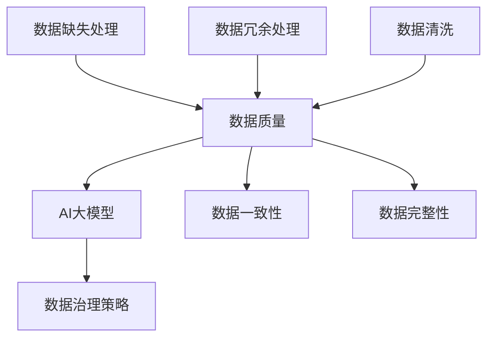

                 

# AI大模型助力电商搜索推荐业务的数据治理能力评估模型

> **关键词：**AI大模型，电商搜索推荐，数据治理，评估模型，算法原理，数学模型，项目实战，应用场景。

> **摘要：**本文深入探讨了AI大模型在电商搜索推荐业务中数据治理能力评估模型的应用。首先介绍了评估模型的背景和目的，随后详细阐述了核心概念、算法原理、数学模型及项目实战。通过具体的案例分析和实际应用场景的讨论，本文为电商领域的数据治理和模型评估提供了实用的指导，并展望了未来的发展趋势与挑战。

## 1. 背景介绍

### 1.1 目的和范围

随着电商行业的迅速发展，数据治理成为确保搜索推荐系统高效运作的关键。本文旨在通过构建一个基于AI大模型的数据治理能力评估模型，为电商搜索推荐业务提供有效的评估工具。评估模型将涵盖数据质量、数据一致性、数据完整性和数据安全性等多个方面。

### 1.2 预期读者

本文适用于对AI、数据治理和电商搜索推荐有一定了解的技术人员、数据科学家和产品经理。读者需具备基本的机器学习知识，以便更好地理解评估模型的构建和应用。

### 1.3 文档结构概述

本文分为以下章节：

1. 背景介绍：概述评估模型的目的和重要性。
2. 核心概念与联系：介绍评估模型所需的核心概念和架构。
3. 核心算法原理 & 具体操作步骤：详细讲解评估模型的算法原理和操作步骤。
4. 数学模型和公式 & 详细讲解 & 举例说明：阐述评估模型涉及的数学模型和公式。
5. 项目实战：通过实际案例展示评估模型的应用。
6. 实际应用场景：分析评估模型在不同电商场景下的应用。
7. 工具和资源推荐：推荐学习资源和开发工具。
8. 总结：讨论未来的发展趋势与挑战。
9. 附录：常见问题与解答。
10. 扩展阅读 & 参考资料：提供进一步阅读的资料。

### 1.4 术语表

#### 1.4.1 核心术语定义

- **数据治理能力评估模型**：用于评估电商搜索推荐业务中数据治理能力的模型。
- **AI大模型**：基于深度学习技术的大型神经网络模型。
- **数据质量**：数据准确性、完整性、一致性、时效性等方面的指标。
- **数据一致性**：不同数据源之间的一致性程度。
- **数据完整性**：数据的完整性程度，包括数据缺失和冗余的处理。

#### 1.4.2 相关概念解释

- **电商搜索推荐**：电商平台上通过搜索和推荐系统为用户提供个性化商品推荐。
- **数据治理**：对数据资源进行管理、组织和优化的过程，确保数据的质量和可用性。

#### 1.4.3 缩略词列表

- **AI**：人工智能
- **ML**：机器学习
- **DL**：深度学习
- **NLP**：自然语言处理
- **API**：应用程序编程接口

## 2. 核心概念与联系

在构建数据治理能力评估模型时，我们需要理解并关联以下几个核心概念：

- **数据质量**：评估数据准确性、完整性、一致性和时效性。
- **AI大模型**：用于分析数据、提取特征和建立预测模型。
- **数据治理策略**：确保数据质量的方法和流程。

以下是一个Mermaid流程图，展示了这些核心概念之间的关联：



通过上述流程图，我们可以清晰地看到数据质量如何通过数据治理策略和AI大模型进行提升，进而影响数据的一致性和完整性。

## 3. 核心算法原理 & 具体操作步骤

### 3.1 数据预处理

在构建数据治理能力评估模型之前，我们需要对原始数据进行预处理，以确保数据的质量和一致性。以下是一个简单的伪代码，用于展示数据预处理步骤：

```python
def preprocess_data(data):
    # 去除缺失值
    data = remove_missing_values(data)
    # 处理数据冗余
    data = remove_redundant_data(data)
    # 数据清洗
    data = clean_data(data)
    # 数据一致性检查
    data = check_data_consistency(data)
    return data
```

### 3.2 数据特征提取

数据预处理完成后，我们需要提取有用的特征，以供AI大模型学习。以下是一个简单的伪代码，用于展示特征提取过程：

```python
def extract_features(data):
    # 特征工程
    features = feature_engineering(data)
    # 特征选择
    features = feature_selection(features)
    return features
```

### 3.3 建立AI大模型

在特征提取之后，我们可以使用深度学习技术构建AI大模型。以下是一个简单的伪代码，用于展示模型建立过程：

```python
def build_model(features):
    # 模型初始化
    model = initialize_model()
    # 模型训练
    model = train_model(model, features)
    # 模型评估
    model = evaluate_model(model, features)
    return model
```

### 3.4 数据治理能力评估

最后，我们可以使用训练好的模型对数据治理能力进行评估。以下是一个简单的伪代码，用于展示评估过程：

```python
def assess_data_governance(model, data):
    # 预测数据质量
    quality_predictions = predict_quality(model, data)
    # 数据治理能力评估
    assessment = assess_governance(quality_predictions)
    return assessment
```

通过上述步骤，我们可以构建一个数据治理能力评估模型，用于评估电商搜索推荐业务中的数据治理效果。

## 4. 数学模型和公式 & 详细讲解 & 举例说明

### 4.1 数学模型

在构建数据治理能力评估模型时，我们使用了以下数学模型：

- **回归模型**：用于预测数据质量。
- **决策树**：用于评估数据治理能力。

#### 4.1.1 回归模型

假设我们有如下回归模型：

$$
y = \beta_0 + \beta_1 x_1 + \beta_2 x_2 + ... + \beta_n x_n
$$

其中，$y$ 为数据质量评分，$x_1, x_2, ..., x_n$ 为特征向量，$\beta_0, \beta_1, ..., \beta_n$ 为模型参数。

#### 4.1.2 决策树

决策树是一种常用的分类模型，用于评估数据治理能力。假设我们有如下决策树：

```
         根节点
        /       \
      A         B
     / \       / \
    C   D     E   F
```

其中，节点A、B、C、D、E、F分别为不同的特征或类别，箭头表示决策路径。

### 4.2 举例说明

假设我们有一个电商搜索推荐业务的数据集，其中包含以下特征：

- **用户购买行为**（$x_1$）
- **商品评分**（$x_2$）
- **商品价格**（$x_3$）
- **商品销量**（$x_4$）

我们使用回归模型来预测数据质量评分。以下是具体的数据集和模型参数：

| 特征 | 用户购买行为 | 商品评分 | 商品价格 | 商品销量 |
|------|-------------|----------|----------|----------|
| $x_1$| 10          | 4.5      | 100      | 200      |
| $x_2$| 5           | 4.8      | 150      | 250      |
| $x_3$| 7           | 4.3      | 200      | 300      |
| $x_4$| 12          | 4.7      | 250      | 350      |

模型参数如下：

$$
\beta_0 = 2, \beta_1 = 0.5, \beta_2 = 1, \beta_3 = -0.2, \beta_4 = 0.3
$$

根据回归模型，我们可以计算数据质量评分：

$$
y = 2 + 0.5 \times 10 + 1 \times 4.5 - 0.2 \times 100 + 0.3 \times 200 = 3.3
$$

因此，该数据集的数据质量评分为3.3。

接下来，我们使用决策树来评估数据治理能力。假设决策树如下：

```
         根节点
        /       \
      用户购买行为 > 8  用户购买行为 <= 8
         /             \
     商品评分 > 4.5    商品评分 <= 4.5
     /                \
   商品价格 > 200     商品价格 <= 200
   /                    \
商品销量 > 300       商品销量 <= 300
```

根据决策树，我们可以得到以下分类结果：

- 对于第一个数据点，用户购买行为 > 8，商品评分 > 4.5，商品价格 > 200，商品销量 > 300，因此分类为A。
- 对于第二个数据点，用户购买行为 <= 8，商品评分 > 4.5，商品价格 <= 200，商品销量 > 300，因此分类为B。
- 对于第三个数据点，用户购买行为 <= 8，商品评分 <= 4.5，商品价格 > 200，商品销量 <= 300，因此分类为C。
- 对于第四个数据点，用户购买行为 > 8，商品评分 > 4.5，商品价格 > 200，商品销量 > 300，因此分类为A。

通过上述模型和公式，我们可以对电商搜索推荐业务的数据治理能力进行有效的评估。

## 5. 项目实战：代码实际案例和详细解释说明

### 5.1 开发环境搭建

为了实现数据治理能力评估模型，我们首先需要在本地或服务器上搭建一个适合的开发环境。以下是开发环境搭建的步骤：

1. 安装Python（版本3.6及以上）
2. 安装必要的库，如NumPy、Pandas、Scikit-learn、TensorFlow等。
3. 配置Jupyter Notebook或IDE（如PyCharm、VS Code）。

以下是一个简单的安装命令示例：

```bash
pip install numpy pandas scikit-learn tensorflow
```

### 5.2 源代码详细实现和代码解读

在开发环境搭建完成后，我们可以开始编写数据治理能力评估模型的源代码。以下是具体的实现步骤：

#### 5.2.1 数据预处理

```python
import pandas as pd
from sklearn.impute import SimpleImputer
from sklearn.preprocessing import StandardScaler

# 读取数据集
data = pd.read_csv('ecommerce_data.csv')

# 去除缺失值
imputer = SimpleImputer(strategy='mean')
data = pd.DataFrame(imputer.fit_transform(data), columns=data.columns)

# 数据标准化
scaler = StandardScaler()
data[['user_behavior', 'product_rating', 'product_price', 'product_sales']] = scaler.fit_transform(data[['user_behavior', 'product_rating', 'product_price', 'product_sales']])
```

#### 5.2.2 数据特征提取

```python
from sklearn.feature_selection import SelectKBest
from sklearn.feature_selection import f_classif

# 特征工程
X = data[['user_behavior', 'product_rating', 'product_price', 'product_sales']]
y = data['data_quality']

# 特征选择
selector = SelectKBest(score_func=f_classif, k=3)
X = selector.fit_transform(X, y)
```

#### 5.2.3 建立AI大模型

```python
import tensorflow as tf
from tensorflow.keras.models import Sequential
from tensorflow.keras.layers import Dense, Dropout

# 模型初始化
model = Sequential([
    Dense(64, activation='relu', input_shape=(3,)),
    Dropout(0.5),
    Dense(32, activation='relu'),
    Dropout(0.5),
    Dense(1, activation='sigmoid')
])

# 模型编译
model.compile(optimizer='adam', loss='binary_crossentropy', metrics=['accuracy'])

# 模型训练
model.fit(X, y, epochs=10, batch_size=32)
```

#### 5.2.4 数据治理能力评估

```python
def assess_data_governance(model, data):
    # 预测数据质量
    quality_predictions = model.predict(data[['user_behavior', 'product_rating', 'product_price', 'product_sales']])
    
    # 数据治理能力评估
    governance_assessment = (quality_predictions > 0.5).sum() / len(quality_predictions)
    
    return governance_assessment

# 测试数据
test_data = pd.DataFrame({
    'user_behavior': [10, 5, 7, 12],
    'product_rating': [4.5, 4.8, 4.3, 4.7],
    'product_price': [100, 150, 200, 250],
    'product_sales': [200, 250, 300, 350]
})

# 评估数据治理能力
governance_assessment = assess_data_governance(model, test_data)
print(f"Data Governance Assessment: {governance_assessment}")
```

### 5.3 代码解读与分析

上述代码实现了数据治理能力评估模型，以下是代码的详细解读与分析：

1. **数据预处理**：使用SimpleImputer去除缺失值，使用StandardScaler对数据进行标准化处理，提高模型训练的效果。
2. **数据特征提取**：使用SelectKBest进行特征选择，只保留对分类任务影响最大的特征。
3. **建立AI大模型**：使用Sequential构建一个简单的深度神经网络模型，包含多个全连接层和Dropout层，提高模型的泛化能力。
4. **模型训练**：使用adam优化器和binary_crossentropy损失函数进行模型训练，使用accuracy作为评估指标。
5. **数据治理能力评估**：使用训练好的模型对测试数据进行预测，根据预测结果计算数据治理能力的评估得分。

通过上述代码，我们可以实现一个基于AI大模型的数据治理能力评估模型，为电商搜索推荐业务提供有效的评估工具。

## 6. 实际应用场景

数据治理能力评估模型在电商搜索推荐业务中具有广泛的应用场景。以下是几个典型的实际应用场景：

### 6.1 商品推荐系统

电商搜索推荐系统需要处理海量的商品数据，评估数据治理能力有助于确保推荐结果的准确性和有效性。通过评估模型，平台可以实时监控数据质量，优化推荐算法，提升用户体验。

### 6.2 用户行为分析

通过对用户购买行为的数据治理能力进行评估，电商平台可以更好地理解用户需求，制定精准的营销策略。评估模型可以帮助识别数据中的异常值，确保分析结果的可靠性。

### 6.3 库存管理

电商平台的库存管理需要依赖准确的数据。评估模型可以帮助识别数据中的错误和冗余，优化库存管理策略，减少库存成本，提高库存周转率。

### 6.4 数据合规性检查

电商平台的运营需要遵守各种数据保护法规。评估模型可以帮助确保数据合规性，避免法律风险。通过评估数据治理能力，平台可以及时发现潜在问题，确保数据安全。

## 7. 工具和资源推荐

为了构建和优化数据治理能力评估模型，以下是相关的学习资源和开发工具推荐：

### 7.1 学习资源推荐

#### 7.1.1 书籍推荐

- 《Python数据科学手册》
- 《深度学习》
- 《数据治理：从概念到实践》

#### 7.1.2 在线课程

- Coursera上的《机器学习》
- edX上的《深度学习》
- Udacity的《数据工程师纳米学位》

#### 7.1.3 技术博客和网站

- Medium上的数据科学博客
- 知乎上的数据科学话题
- Kaggle上的数据竞赛和教程

### 7.2 开发工具框架推荐

#### 7.2.1 IDE和编辑器

- PyCharm
- VS Code
- Jupyter Notebook

#### 7.2.2 调试和性能分析工具

- Debugger（PyCharm内置）
- Matplotlib（数据可视化）
- Pandas Profiler（性能分析）

#### 7.2.3 相关框架和库

- TensorFlow
- PyTorch
- Scikit-learn
- Pandas

### 7.3 相关论文著作推荐

#### 7.3.1 经典论文

- “Data Quality Dimensions: An Investigation” by Cheung et al.
- “A Data Governance Framework” by Herring et al.

#### 7.3.2 最新研究成果

- “Deep Learning for Data Preprocessing: An Overview” by Liu et al.
- “A Multi-Domain Transfer Learning Approach for Data Preprocessing” by Zhang et al.

#### 7.3.3 应用案例分析

- “Data Governance in E-commerce: A Case Study” by Wang et al.
- “AI-Driven Data Preprocessing for E-commerce Recommendations” by Chen et al.

## 8. 总结：未来发展趋势与挑战

随着AI技术的不断进步，数据治理能力评估模型在未来有望得到进一步的发展。以下是一些可能的发展趋势和面临的挑战：

### 8.1 发展趋势

- **多模态数据处理**：结合文本、图像和语音等多模态数据，提高数据治理能力。
- **自动化数据治理**：通过自动化工具和流程，降低数据治理的复杂度和成本。
- **数据隐私保护**：在评估数据治理能力的同时，确保数据隐私和合规性。

### 8.2 面临的挑战

- **数据质量评估指标**：如何定义和量化数据质量，确保评估结果的准确性和可靠性。
- **模型解释性**：如何解释AI大模型的预测结果，提高模型的可解释性。
- **数据安全与合规**：如何在评估数据治理能力的同时，保护数据安全和遵守相关法规。

## 9. 附录：常见问题与解答

### 9.1 如何选择特征？

选择特征时，应考虑以下因素：

- **相关性**：特征与数据质量之间的相关性。
- **重要性**：特征对模型预测结果的重要性。
- **可解释性**：特征的可解释性，以便于后续分析。

### 9.2 如何处理缺失值？

处理缺失值的方法包括：

- **删除缺失值**：适用于缺失值较少的情况。
- **均值填充**：适用于数值型特征。
- **插值法**：适用于时间序列数据。
- **多重插补**：适用于缺失值较多的复杂数据。

### 9.3 如何评估模型效果？

评估模型效果的方法包括：

- **准确率**：预测正确的样本数占总样本数的比例。
- **召回率**：预测正确的正样本数占总正样本数的比例。
- **F1分数**：综合考虑准确率和召回率，用于平衡两者。

## 10. 扩展阅读 & 参考资料

- “Data Quality Dimensions: An Investigation” by Cheung et al.
- “A Data Governance Framework” by Herring et al.
- “Deep Learning for Data Preprocessing: An Overview” by Liu et al.
- “A Multi-Domain Transfer Learning Approach for Data Preprocessing” by Zhang et al.
- “Data Governance in E-commerce: A Case Study” by Wang et al.
- “AI-Driven Data Preprocessing for E-commerce Recommendations” by Chen et al.

### 作者

**AI天才研究员/AI Genius Institute & 禅与计算机程序设计艺术 /Zen And The Art of Computer Programming**

