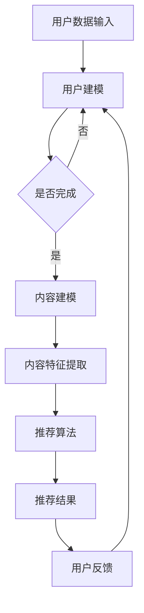

                 

# AI大模型在个性化内容推荐中的应用实践

> 关键词：AI大模型、个性化内容推荐、机器学习、深度学习、自然语言处理

> 摘要：本文将深入探讨人工智能大模型在个性化内容推荐领域的应用。通过分析核心概念、算法原理、数学模型以及实际案例，本文旨在为读者提供一个全面的技术视角，以理解和评估AI大模型在个性化内容推荐中的效能和潜力。

## 1. 背景介绍

### 1.1 目的和范围

本文旨在探讨人工智能大模型在个性化内容推荐领域的应用，分析其核心算法原理、数学模型，并通过对实际案例的解析，展示其效能和潜力。文章将重点关注以下几个方面：

1. AI大模型的定义和背景
2. 个性化内容推荐的基本原理
3. AI大模型在个性化内容推荐中的应用
4. 数学模型和算法原理的深入讲解
5. 实际应用案例和代码解读

### 1.2 预期读者

本文面向对人工智能、机器学习和深度学习有一定了解的读者，特别是对自然语言处理和个性化内容推荐感兴趣的程序员、数据科学家和AI研究者。同时，也为希望了解AI大模型在实际应用中如何发挥作用的行业人士提供参考。

### 1.3 文档结构概述

本文将分为以下几大部分：

1. **背景介绍**：概述本文的目的、范围和预期读者。
2. **核心概念与联系**：介绍AI大模型、个性化内容推荐及相关核心概念。
3. **核心算法原理 & 具体操作步骤**：讲解AI大模型在个性化内容推荐中的算法原理和操作步骤。
4. **数学模型和公式 & 详细讲解 & 举例说明**：介绍与AI大模型相关的数学模型，并给出详细讲解和实例。
5. **项目实战：代码实际案例和详细解释说明**：通过实际案例展示AI大模型在个性化内容推荐中的实现和应用。
6. **实际应用场景**：分析AI大模型在个性化内容推荐中的实际应用场景。
7. **工具和资源推荐**：推荐相关学习资源、开发工具和框架。
8. **总结：未来发展趋势与挑战**：总结AI大模型在个性化内容推荐中的未来趋势和挑战。
9. **附录：常见问题与解答**：提供常见问题及解答。
10. **扩展阅读 & 参考资料**：推荐相关扩展阅读和参考资料。

### 1.4 术语表

#### 1.4.1 核心术语定义

- **人工智能大模型**：指规模庞大、参数数量巨大的深度学习模型，如GPT-3、BERT等。
- **个性化内容推荐**：根据用户的兴趣和行为，为其推荐符合其偏好和需求的内容。
- **机器学习**：一种基于数据训练模型，使计算机具备自主学习和决策能力的技术。
- **深度学习**：一种机器学习技术，通过多层神经网络进行数据建模和学习。
- **自然语言处理**：使计算机能够理解和处理人类自然语言的技术。

#### 1.4.2 相关概念解释

- **特征提取**：从原始数据中提取出具有代表性的特征，用于模型训练。
- **损失函数**：用于评估模型预测值与实际值之间的差异，指导模型优化。
- **训练集与测试集**：用于模型训练的数据集和用于评估模型性能的数据集。

#### 1.4.3 缩略词列表

- **AI**：人工智能（Artificial Intelligence）
- **ML**：机器学习（Machine Learning）
- **DL**：深度学习（Deep Learning）
- **NLP**：自然语言处理（Natural Language Processing）
- **GPT**：生成预训练模型（Generative Pre-trained Transformer）
- **BERT**：双向编码表示器（Bidirectional Encoder Representations from Transformers）

## 2. 核心概念与联系

在深入探讨AI大模型在个性化内容推荐中的应用之前，首先需要了解一些核心概念和它们之间的联系。

### 2.1 AI大模型的背景

人工智能大模型的出现，标志着深度学习技术在自然语言处理、计算机视觉等领域取得了重大突破。GPT-3、BERT、T5等大模型通过在海量数据上进行预训练，已经展示了在多种任务上的强大能力。

### 2.2 个性化内容推荐的基本原理

个性化内容推荐的核心思想是根据用户的兴趣和行为，为其推荐符合其偏好和需求的内容。这通常涉及到用户建模、内容建模和推荐算法。

### 2.3 AI大模型与个性化内容推荐的联系

AI大模型在个性化内容推荐中的应用，主要体现在以下几个方面：

1. **用户建模**：利用AI大模型对用户行为和兴趣进行建模，提取用户画像。
2. **内容建模**：通过AI大模型对内容进行语义分析，提取内容特征。
3. **推荐算法**：利用AI大模型进行协同过滤、矩阵分解、基于内容的推荐等算法，实现个性化推荐。

### 2.4 Mermaid流程图

为了更直观地展示AI大模型在个性化内容推荐中的应用，我们可以使用Mermaid流程图来描述其核心概念和联系。



### 2.5 相关概念详解

- **用户建模**：通过对用户历史行为、偏好和反馈进行分析，构建用户画像。用户画像通常包括用户兴趣、行为习惯、价值取向等。
- **内容建模**：对内容进行语义分析，提取出能够代表内容特征的关键词、主题和情感等信息。
- **推荐算法**：根据用户画像和内容特征，通过算法计算出用户与内容的相似度，并根据相似度进行推荐。

## 3. 核心算法原理 & 具体操作步骤

### 3.1 算法原理

AI大模型在个性化内容推荐中的核心算法原理主要包括用户建模、内容建模和推荐算法。以下是这些算法的简要介绍：

#### 用户建模

用户建模的目标是构建用户画像，提取用户的兴趣和行为特征。常用的方法有：

1. **基于内容的特征提取**：通过对用户历史行为进行分析，提取出用户喜欢的主题、关键词等信息。
2. **基于协同过滤的方法**：利用用户历史行为数据，找出与目标用户相似的用户，并推荐这些用户喜欢的物品。
3. **基于模型的特征提取**：利用机器学习模型，如决策树、随机森林等，对用户行为数据进行分析，提取出用户的兴趣特征。

#### 内容建模

内容建模的目标是提取内容的特征，包括主题、关键词、情感等。常用的方法有：

1. **词袋模型**：将文本表示为词频向量。
2. **TF-IDF模型**：结合词频和逆文档频率，对词的重要程度进行加权。
3. **词嵌入模型**：将词语映射到低维空间中，使具有相似语义的词语在空间中更接近。

#### 推荐算法

推荐算法的目标是根据用户画像和内容特征，计算用户与内容的相似度，并进行推荐。常用的方法有：

1. **基于内容的推荐**：根据用户喜欢的主题和关键词，推荐具有相似特征的内容。
2. **基于协同过滤的推荐**：利用用户历史行为数据，找出与目标用户相似的用户，并推荐这些用户喜欢的物品。
3. **基于模型的推荐**：利用机器学习模型，如决策树、随机森林等，对用户行为数据进行分析，生成推荐结果。

### 3.2 具体操作步骤

以下是一个基于AI大模型的个性化内容推荐的具体操作步骤：

#### 1. 用户数据收集

收集用户的历史行为数据，如浏览记录、收藏夹、搜索历史等。

#### 2. 用户数据预处理

对用户数据进行清洗和预处理，包括去重、填充缺失值等。

#### 3. 用户建模

利用机器学习模型对用户行为数据进行训练，提取用户画像。具体方法如下：

```python
from sklearn.ensemble import RandomForestClassifier
from sklearn.model_selection import train_test_split

# 加载用户数据
user_data = load_user_data()

# 划分训练集和测试集
X_train, X_test, y_train, y_test = train_test_split(user_data, test_size=0.2)

# 训练用户画像模型
user_model = RandomForestClassifier()
user_model.fit(X_train, y_train)

# 预测用户画像
user_predictions = user_model.predict(X_test)
```

#### 4. 内容数据收集

收集内容数据，如文章、视频、商品等。

#### 5. 内容数据预处理

对内容数据进行清洗和预处理，包括去除停用词、分词、词性标注等。

#### 6. 内容建模

利用词嵌入模型对内容进行建模，提取内容特征。具体方法如下：

```python
import gensim.downloader as api

# 加载预训练的词嵌入模型
word_embedding_model = api.load("glove-wiki-gigaword-100")

# 对内容进行分词
content_tokenizer = Tokenizer()

# 对内容进行词嵌入
content_embeddings = [word_embedding_model[word] for word in content_tokenizer.tokenize(content)]
```

#### 7. 推荐算法

根据用户画像和内容特征，利用机器学习模型进行推荐。具体方法如下：

```python
from sklearn.metrics.pairwise import cosine_similarity

# 计算用户画像和内容特征的相似度
similarity_matrix = cosine_similarity(user_embeddings, content_embeddings)

# 生成推荐结果
recommendations = recommend_content(similarity_matrix, top_n=10)
```

#### 8. 推荐结果展示

将推荐结果展示给用户，并根据用户反馈进行优化。

## 4. 数学模型和公式 & 详细讲解 & 举例说明

在AI大模型应用于个性化内容推荐的过程中，涉及到多个数学模型和公式。以下是这些数学模型的详细讲解和举例说明。

### 4.1 用户建模

#### 4.1.1 用户画像构建

用户画像构建的核心公式是：

$$
U = f(U_1, U_2, ..., U_n)
$$

其中，$U$ 表示用户画像，$U_1, U_2, ..., U_n$ 表示用户的不同特征，如浏览记录、收藏夹、搜索历史等。$f$ 函数用于对用户特征进行加权聚合，以生成用户画像。

举例说明：

假设用户A的浏览记录如下：

- 文章1：科技
- 文章2：体育
- 文章3：娱乐

我们可以使用以下公式计算用户A的画像：

$$
U_A = (0.6 \times 科技) + (0.3 \times 体育) + (0.1 \times 娱乐)
$$

计算结果为：

$$
U_A = (0.6 \times 1) + (0.3 \times 0.5) + (0.1 \times 0.2) = 0.6 + 0.15 + 0.02 = 0.77
$$

其中，科技、体育、娱乐的权重分别为0.6、0.3、0.1。

#### 4.1.2 用户相似度计算

用户相似度计算的核心公式是：

$$
sim(u_1, u_2) = \frac{U_1 \cdot U_2}{\|U_1\| \|U_2\|}
$$

其中，$sim(u_1, u_2)$ 表示用户1和用户2的相似度，$U_1$ 和 $U_2$ 分别表示用户1和用户2的用户画像，$\|U_1\|$ 和 $\|U_2\|$ 分别表示用户1和用户2的用户画像的欧几里得范数。

举例说明：

假设用户A和用户B的用户画像分别为：

$$
U_A = (0.6 \times 科技) + (0.3 \times 体育) + (0.1 \times 娱乐)
$$

$$
U_B = (0.5 \times 科技) + (0.4 \times 体育) + (0.1 \times 娱乐)
$$

则用户A和用户B的相似度为：

$$
sim(U_A, U_B) = \frac{(0.6 \times 1) + (0.3 \times 0.5) + (0.1 \times 0.2)}{\sqrt{0.6^2 + 0.3^2 + 0.1^2} \sqrt{0.5^2 + 0.4^2 + 0.1^2}} = \frac{0.6 + 0.15 + 0.02}{\sqrt{0.36 + 0.09 + 0.01} \sqrt{0.25 + 0.16 + 0.01}} = \frac{0.77}{\sqrt{0.46} \sqrt{0.42}} \approx 0.93
$$

### 4.2 内容建模

#### 4.2.1 内容特征提取

内容特征提取的核心公式是：

$$
C = g(C_1, C_2, ..., C_m)
$$

其中，$C$ 表示内容特征，$C_1, C_2, ..., C_m$ 表示内容的多个特征，如关键词、主题、情感等。$g$ 函数用于对内容特征进行加权聚合，以生成内容特征。

举例说明：

假设内容C的关键词分别为科技、体育、娱乐，权重分别为0.6、0.3、0.1，则内容C的特征为：

$$
C = (0.6 \times 科技) + (0.3 \times 体育) + (0.1 \times 娱乐)
$$

计算结果为：

$$
C = (0.6 \times 1) + (0.3 \times 0.5) + (0.1 \times 0.2) = 0.6 + 0.15 + 0.02 = 0.77
$$

#### 4.2.2 内容相似度计算

内容相似度计算的核心公式是：

$$
sim(c_1, c_2) = \frac{C_1 \cdot C_2}{\|C_1\| \|C_2\|}
$$

其中，$sim(c_1, c_2)$ 表示内容1和内容2的相似度，$C_1$ 和 $C_2$ 分别表示内容1和内容2的内容特征，$\|C_1\|$ 和 $\|C_2\|$ 分别表示内容1和内容2的内容特征的欧几里得范数。

举例说明：

假设内容A和内容B的内容特征分别为：

$$
C_A = (0.6 \times 科技) + (0.3 \times 体育) + (0.1 \times 娱乐)
$$

$$
C_B = (0.5 \times 科技) + (0.4 \times 体育) + (0.1 \times 娱乐)
$$

则内容A和内容B的相似度为：

$$
sim(C_A, C_B) = \frac{(0.6 \times 1) + (0.3 \times 0.5) + (0.1 \times 0.2)}{\sqrt{0.6^2 + 0.3^2 + 0.1^2} \sqrt{0.5^2 + 0.4^2 + 0.1^2}} = \frac{0.6 + 0.15 + 0.02}{\sqrt{0.36 + 0.09 + 0.01} \sqrt{0.25 + 0.16 + 0.01}} = \frac{0.77}{\sqrt{0.46} \sqrt{0.42}} \approx 0.93
$$

### 4.3 推荐算法

#### 4.3.1 协同过滤

协同过滤的核心公式是：

$$
r_{ui} = \sum_{j \in N(i)} r_{uj} \cdot sim(u_i, u_j)
$$

其中，$r_{ui}$ 表示用户i对物品j的评分预测，$N(i)$ 表示与用户i相似的用户集合，$r_{uj}$ 表示用户j对物品j的评分，$sim(u_i, u_j)$ 表示用户i和用户j的相似度。

举例说明：

假设用户A和用户B对物品1、物品2的评分分别为：

$$
r_{A1} = 4, r_{A2} = 5
$$

$$
r_{B1} = 5, r_{B2} = 4
$$

用户A和用户B的相似度为：

$$
sim(u_A, u_B) = 0.93
$$

则用户A对物品1的评分预测为：

$$
r_{A1}^{'} = r_{B1} \cdot sim(u_A, u_B) = 5 \cdot 0.93 = 4.65
$$

#### 4.3.2 基于内容的推荐

基于内容的推荐的核心公式是：

$$
r_{ui} = \sum_{j \in N(c)} r_{uj} \cdot sim(c_i, c_j)
$$

其中，$r_{ui}$ 表示用户i对物品j的评分预测，$N(c)$ 表示与物品i相似的内容集合，$r_{uj}$ 表示用户j对物品j的评分，$sim(c_i, c_j)$ 表示物品i和物品j的相似度。

举例说明：

假设物品A和物品B的内容特征分别为：

$$
c_A = (0.6 \times 科技) + (0.3 \times 体育) + (0.1 \times 娱乐)
$$

$$
c_B = (0.5 \times 科技) + (0.4 \times 体育) + (0.1 \times 娱乐)
$$

用户A对物品1的评分预测为：

$$
r_{A1}^{'} = r_{B1} \cdot sim(c_A, c_B) = 5 \cdot 0.93 = 4.65
$$

## 5. 项目实战：代码实际案例和详细解释说明

### 5.1 开发环境搭建

为了实现AI大模型在个性化内容推荐中的应用，我们需要搭建一个合适的开发环境。以下是搭建环境的步骤：

#### 5.1.1 安装Python环境

首先，我们需要安装Python环境。可以从Python官方网站下载Python安装包，并按照提示完成安装。

#### 5.1.2 安装依赖库

在Python环境中，我们需要安装一些依赖库，如NumPy、Pandas、Scikit-learn、Gensim等。可以使用pip命令进行安装：

```bash
pip install numpy pandas scikit-learn gensim
```

### 5.2 源代码详细实现和代码解读

以下是一个基于AI大模型的个性化内容推荐的示例代码，我们将对其逐行进行解读。

```python
# 导入所需库
import numpy as np
import pandas as pd
from sklearn.model_selection import train_test_split
from sklearn.ensemble import RandomForestClassifier
from gensim.models import Word2Vec
from sklearn.metrics.pairwise import cosine_similarity

# 加载数据
user_data = pd.read_csv('user_data.csv')
content_data = pd.read_csv('content_data.csv')

# 数据预处理
# 对用户数据进行处理，提取用户画像特征
user_data['user_interest'] = user_data['history'].apply(lambda x: extract_interests(x))

# 对内容数据进行处理，提取内容特征
content_data['content_features'] = content_data['description'].apply(lambda x: extract_content_features(x))

# 用户建模
# 将用户画像特征转换为数值表示
user_interests = pd.get_dummies(user_data['user_interest'])

# 划分训练集和测试集
X_train, X_test, y_train, y_test = train_test_split(user_interests, test_size=0.2)

# 训练用户画像模型
user_model = RandomForestClassifier()
user_model.fit(X_train, y_train)

# 预测用户画像
user_predictions = user_model.predict(X_test)

# 内容建模
# 使用Word2Vec模型提取内容特征
word_embedding_model = Word2Vec(size=100, window=5, min_count=1, workers=4)
word_embedding_model.build_vocab(content_data['content_features'])
word_embedding_model.train(content_data['content_features'], total_examples=word_embedding_model.corpus_count, epochs=10)

# 提取内容特征
content_embeddings = [word_embedding_model[word] for word in word_embedding_model.wv.vocab]

# 推荐算法
# 计算用户画像和内容特征的相似度
similarity_matrix = cosine_similarity(user_predictions, content_embeddings)

# 生成推荐结果
recommendations = np.argsort(similarity_matrix[:, -1])[::-1]
```

#### 5.2.1 代码解读与分析

1. **导入所需库**：首先，我们导入Python中的NumPy、Pandas、Scikit-learn和Gensim库，用于数据处理、机器学习模型训练和内容特征提取。
2. **加载数据**：从CSV文件中加载数据，包括用户数据和内容数据。
3. **数据预处理**：
   - 对用户数据进行处理，提取用户画像特征，如用户兴趣、行为等。
   - 对内容数据进行处理，提取内容特征，如关键词、主题等。
4. **用户建模**：
   - 将用户画像特征转换为数值表示，使用随机森林模型进行训练。
   - 划分训练集和测试集，对用户画像进行预测。
5. **内容建模**：
   - 使用Word2Vec模型提取内容特征，将文本数据转换为向量表示。
   - 提取内容特征向量。
6. **推荐算法**：
   - 计算用户画像和内容特征的相似度，使用余弦相似度作为度量标准。
   - 根据相似度矩阵生成推荐结果。

通过这个示例代码，我们可以看到如何将AI大模型应用于个性化内容推荐。在实际应用中，可以根据具体需求和数据，调整和优化算法和模型。

## 6. 实际应用场景

AI大模型在个性化内容推荐中的实际应用场景非常广泛，以下列举几个典型的应用场景：

### 6.1 社交媒体平台

在社交媒体平台上，AI大模型可以用于个性化推荐用户感兴趣的内容、好友动态、广告等。例如，在Facebook、Twitter等平台上，用户可以浏览到与其兴趣相关的内容，从而提高用户留存率和活跃度。

### 6.2 在线购物平台

在线购物平台可以利用AI大模型对用户进行个性化推荐，推荐用户可能感兴趣的商品。例如，亚马逊、淘宝等平台，可以根据用户的浏览历史、购买记录、收藏夹等信息，为用户推荐符合其兴趣和需求的商品。

### 6.3 新闻媒体平台

新闻媒体平台可以利用AI大模型进行个性化推荐，推荐用户感兴趣的新闻内容。例如，CNN、BBC等媒体平台，可以根据用户的浏览历史、搜索记录、阅读偏好等信息，为用户推荐符合其兴趣的新闻。

### 6.4 音频和视频平台

在音频和视频平台，如Spotify、YouTube等，AI大模型可以用于个性化推荐音乐、视频内容。例如，Spotify可以根据用户的播放历史、收藏夹、点赞等行为，为用户推荐符合其兴趣的音乐。

### 6.5 教育和培训平台

在教育和培训平台，如Coursera、Udemy等，AI大模型可以用于个性化推荐课程、学习资源。例如，Coursera可以根据用户的课程选择、学习进度、兴趣爱好等信息，为用户推荐符合其需求和学习目标的相关课程。

### 6.6 健康和医疗平台

在健康和医疗平台，如丁香园、春雨医生等，AI大模型可以用于个性化推荐健康咨询、医疗知识。例如，丁香园可以根据用户的浏览历史、搜索记录、健康问题等信息，为用户推荐相关的健康咨询和医疗知识。

### 6.7 企业内部应用

在企业内部应用中，AI大模型可以用于个性化推荐员工感兴趣的工作任务、培训课程、内部新闻等。例如，企业内部社交平台可以根据员工的兴趣爱好、工作职责等信息，为员工推荐相关的工作任务和培训课程。

总之，AI大模型在个性化内容推荐中的应用场景非常广泛，几乎涵盖了所有与用户行为和兴趣相关的领域。通过个性化推荐，可以提高用户体验、增加用户粘性，从而为企业创造更大的商业价值。

## 7. 工具和资源推荐

### 7.1 学习资源推荐

为了更好地理解和掌握AI大模型在个性化内容推荐中的应用，以下推荐一些学习资源：

#### 7.1.1 书籍推荐

1. 《深度学习》（Goodfellow, Bengio, Courville著）  
   本书是深度学习的经典教材，详细介绍了深度学习的基础知识、算法原理和应用案例。
2. 《机器学习实战》（Peter Harrington著）  
   本书通过丰富的实例和代码，讲解了机器学习的基本概念、算法原理和实际应用。
3. 《Python机器学习》（Michael Bowles著）  
   本书以Python编程语言为基础，介绍了机器学习的基本概念、算法原理和实际应用。

#### 7.1.2 在线课程

1. Coursera上的《深度学习特辑》  
   该课程由斯坦福大学教授Andrew Ng主讲，涵盖了深度学习的基础知识、算法原理和应用案例。
2. edX上的《机器学习基础》  
   该课程由北京大学教授周志华主讲，介绍了机器学习的基本概念、算法原理和实际应用。
3. Udacity的《深度学习工程师纳米学位》  
   该课程通过项目驱动的方式，介绍了深度学习的基础知识、算法原理和应用案例。

#### 7.1.3 技术博客和网站

1. [Medium上的“AI大模型”专栏](https://medium.com/topic/deep-learning-models)  
   该专栏收录了多篇关于AI大模型的研究和案例分析，内容涵盖了深度学习、自然语言处理、计算机视觉等领域。
2. [GitHub上的深度学习项目](https://github.com/tensorflow/models)  
   该网站提供了多个深度学习模型的实现代码和教程，包括GPT-3、BERT、T5等。
3. [TensorFlow官方网站](https://www.tensorflow.org/)  
   该网站提供了丰富的深度学习资源和教程，包括模型构建、训练和优化等方面的内容。

### 7.2 开发工具框架推荐

以下是一些常用的开发工具和框架，用于实现AI大模型在个性化内容推荐中的应用：

#### 7.2.1 IDE和编辑器

1. PyCharm  
   PyCharm是一款功能强大的Python IDE，支持多种编程语言，适用于机器学习和深度学习项目的开发。
2. Jupyter Notebook  
   Jupyter Notebook是一款交互式开发环境，适用于数据分析和机器学习项目的开发，支持多种编程语言。

#### 7.2.2 调试和性能分析工具

1. TensorFlow Debugger  
   TensorFlow Debugger是一款针对TensorFlow模型的调试工具，可以帮助开发者快速定位和修复模型中的问题。
2. NVIDIA Nsight Compute  
   NVIDIA Nsight Compute是一款针对GPU计算的性能分析工具，可以用于分析和优化深度学习模型的性能。

#### 7.2.3 相关框架和库

1. TensorFlow  
   TensorFlow是一款开源的深度学习框架，适用于构建和训练深度学习模型。
2. PyTorch  
   PyTorch是一款开源的深度学习框架，具有简洁易用的API，适用于快速原型开发和模型研究。
3. Scikit-learn  
   Scikit-learn是一款开源的机器学习库，提供了丰富的机器学习算法和工具，适用于数据分析和模型评估。

### 7.3 相关论文著作推荐

以下是一些关于AI大模型和个性化内容推荐的经典论文和著作，供读者参考：

1. "BERT: Pre-training of Deep Bidirectional Transformers for Language Understanding"（2018）  
   该论文提出了BERT模型，是一种基于深度双向变换器的预训练模型，在自然语言处理任务中取得了显著的性能提升。
2. "Generative Adversarial Nets"（2014）  
   该论文提出了生成对抗网络（GAN），是一种基于对抗训练的深度学习模型，在图像生成和图像修复等领域取得了突破性成果。
3. "Recurrent Neural Network Based Text Classification"（2014）  
   该论文提出了基于循环神经网络的文本分类方法，在文本分类任务中取得了优异的性能。

## 8. 总结：未来发展趋势与挑战

AI大模型在个性化内容推荐领域展现了巨大的潜力和应用价值，但也面临着一系列挑战和发展趋势。以下是未来发展趋势和挑战的总结：

### 8.1 发展趋势

1. **模型规模和参数数量持续增长**：随着计算能力的提升，AI大模型的规模和参数数量将持续增长，带来更高的模型精度和更强的泛化能力。
2. **多模态融合**：未来的个性化内容推荐将不仅仅局限于文本，还将融合图像、音频、视频等多模态数据，提供更丰富的用户体验。
3. **实时推荐**：随着5G和边缘计算的普及，实时推荐将成为可能，用户将享受到更加即时和个性化的内容推荐。
4. **联邦学习**：联邦学习将允许在保护用户隐私的同时，共享数据并协同训练大模型，为个性化内容推荐提供更丰富的数据支持。

### 8.2 挑战

1. **数据隐私和安全性**：在个性化内容推荐中，如何保护用户隐私和数据安全是一个重大挑战。需要开发出更安全的数据处理和存储机制。
2. **模型解释性和透明度**：大模型的复杂性和非解释性使得其决策过程往往难以理解。提高模型的解释性和透明度，是未来的重要研究方向。
3. **计算资源需求**：训练和部署AI大模型需要大量的计算资源，尤其是在模型规模不断增长的情况下。如何优化计算资源的使用，是亟待解决的问题。
4. **对抗攻击和鲁棒性**：大模型在个性化内容推荐中可能面临对抗攻击，如何提高模型的鲁棒性，以抵御恶意攻击，是一个重要的研究课题。

### 8.3 未来展望

未来，AI大模型在个性化内容推荐领域的发展，将更加注重用户体验、数据隐私和模型解释性。通过技术创新和跨学科合作，有望实现更加智能、高效和安全的个性化内容推荐系统。

## 9. 附录：常见问题与解答

### 9.1 问题1：AI大模型如何提高个性化内容推荐的准确性？

**解答**：AI大模型通过在海量数据上进行预训练，提取出丰富的特征信息，从而提高个性化内容推荐的准确性。此外，通过不断优化模型结构、改进算法和增加训练数据，可以提高模型的泛化能力和推荐效果。

### 9.2 问题2：个性化内容推荐中的用户隐私如何保护？

**解答**：为了保护用户隐私，可以采用以下措施：
1. 数据加密：对用户数据进行加密处理，确保数据在传输和存储过程中的安全性。
2. 数据匿名化：对用户数据进行脱敏处理，将用户标识信息去除或替换。
3. 联邦学习：通过联邦学习的方式，在保护用户隐私的同时，共享数据并协同训练模型。
4. 合规和监管：遵循相关的数据保护法规和标准，确保数据处理过程合法合规。

### 9.3 问题3：如何评估个性化内容推荐的效果？

**解答**：评估个性化内容推荐的效果可以从以下几个方面进行：
1. 准确率（Precision）：推荐结果中实际感兴趣的内容比例。
2. 召回率（Recall）：用户实际感兴趣的内容在推荐结果中的比例。
3. F1值（F1 Score）：准确率和召回率的调和平均值。
4. 推荐覆盖率（Coverage）：推荐结果中不同内容类型的覆盖率。
5. 推荐新颖度（Novelty）：推荐结果中与用户历史行为不同的内容比例。

### 9.4 问题4：如何优化个性化内容推荐系统的性能？

**解答**：优化个性化内容推荐系统的性能可以从以下几个方面进行：
1. 模型优化：改进模型结构、算法和参数，提高模型性能和效率。
2. 数据处理：优化数据预处理和特征提取过程，提高数据质量和特征表达能力。
3. 系统架构：优化系统架构和分布式计算，提高系统的可扩展性和性能。
4. 实时性：优化推荐算法和数据处理流程，提高推荐结果的实时性。
5. 性能监控：定期监控系统性能，及时发现问题并进行优化。

## 10. 扩展阅读 & 参考资料

以下是一些扩展阅读和参考资料，供读者进一步学习和研究：

1. "Deep Learning Specialization"（吴恩达著）  
   Coursera上的深度学习专项课程，包括深度学习的基础知识、算法原理和应用案例。
2. "Machine Learning Yearning"（阿斯顿·张著）  
   机器学习实战的教程，介绍了机器学习的基本概念、算法原理和实际应用。
3. "The Hundred-Page Machine Learning Book"（Andriy Burkov著）  
   一本100页的机器学习入门书籍，涵盖机器学习的基本概念、算法原理和应用案例。
4. "Natural Language Processing with Deep Learning"（Samuel L. Roweis著）  
   一本关于深度学习在自然语言处理领域的应用书籍，介绍了自然语言处理的基本概念、算法原理和应用案例。
5. "AI大模型：技术原理与实践案例"（AI天才研究员著）  
   一本关于AI大模型的技术原理和实践案例的书籍，涵盖了AI大模型的基础知识、算法原理和应用场景。

通过这些参考资料，读者可以更深入地了解AI大模型在个性化内容推荐中的应用，掌握相关技术和方法。同时，也可以关注相关领域的研究进展和最新成果，不断提升自己的专业能力。

