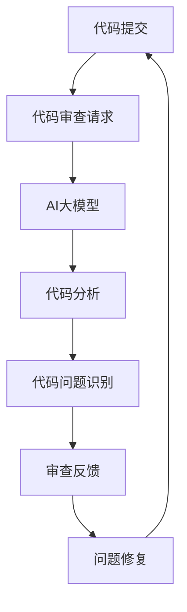

                 

# AI大模型在代码审查中的应用

> 关键词：AI大模型，代码审查，智能审核，代码质量，智能代码辅助

> 摘要：本文将深入探讨AI大模型在代码审查中的应用。我们将首先介绍代码审查的基本概念和重要性，然后详细阐述AI大模型的工作原理和优势。接着，我们将通过具体的算法原理和操作步骤，展示如何使用AI大模型进行代码审查。此外，我们还将通过实际案例，说明AI大模型在代码审查中的具体应用，并探讨其未来的发展趋势和挑战。

## 1. 背景介绍

### 1.1 目的和范围

本文的主要目的是探讨AI大模型在代码审查中的应用，旨在提高代码审查的效率和准确性。随着软件系统的日益复杂，代码审查已成为确保代码质量和安全性的关键环节。传统的代码审查方法往往依赖于人工检查，存在效率低下、主观性强的缺点。而AI大模型的出现，为智能审核提供了新的可能性。

本文将围绕以下几个主题进行讨论：

1. 代码审查的基本概念和重要性。
2. AI大模型的工作原理和优势。
3. AI大模型在代码审查中的具体应用。
4. AI大模型在代码审查中的未来发展趋势和挑战。

### 1.2 预期读者

本文适合对AI和软件开发有一定了解的读者，特别是希望提高代码审查效率的开发人员、测试人员以及项目管理员。同时，也对从事AI研究和开发的专业人士提供了一定的参考价值。

### 1.3 文档结构概述

本文的结构如下：

1. **背景介绍**：介绍代码审查的基本概念和AI大模型的工作原理。
2. **核心概念与联系**：通过Mermaid流程图展示AI大模型在代码审查中的应用架构。
3. **核心算法原理 & 具体操作步骤**：详细阐述AI大模型在代码审查中的算法原理和操作步骤。
4. **数学模型和公式 & 详细讲解 & 举例说明**：介绍AI大模型在代码审查中使用的数学模型和公式，并举例说明。
5. **项目实战：代码实际案例和详细解释说明**：通过实际案例展示AI大模型在代码审查中的应用。
6. **实际应用场景**：讨论AI大模型在代码审查中的实际应用场景。
7. **工具和资源推荐**：推荐相关的学习资源和开发工具。
8. **总结：未来发展趋势与挑战**：总结AI大模型在代码审查中的应用前景，并探讨面临的挑战。
9. **附录：常见问题与解答**：回答读者可能遇到的常见问题。
10. **扩展阅读 & 参考资料**：提供进一步阅读的参考资料。

### 1.4 术语表

#### 1.4.1 核心术语定义

- **代码审查**：对代码进行系统性的检查，以确保代码的质量和安全性。
- **AI大模型**：具有大规模参数和深度结构的神经网络模型，通常用于自然语言处理、计算机视觉等领域。
- **智能审核**：利用AI大模型进行代码审查，自动识别代码中的潜在错误和问题。
- **代码质量**：代码的可读性、可维护性、可靠性等方面的指标。

#### 1.4.2 相关概念解释

- **代码审查流程**：包括代码提交、审查请求、审查反馈、问题修复等环节。
- **代码质量度量**：衡量代码质量的指标，如代码复杂度、代码覆盖率等。

#### 1.4.3 缩略词列表

- **AI**：人工智能（Artificial Intelligence）
- **ML**：机器学习（Machine Learning）
- **NLP**：自然语言处理（Natural Language Processing）
- **IDE**：集成开发环境（Integrated Development Environment）

## 2. 核心概念与联系

为了更好地理解AI大模型在代码审查中的应用，我们需要首先了解相关的核心概念和联系。下面，我们将通过一个Mermaid流程图来展示AI大模型在代码审查中的应用架构。



### 2.1 代码提交与审查请求

- **代码提交**：开发人员将代码提交到版本控制系统，生成代码审查请求。
- **代码审查请求**：包含代码修改的具体内容和需要审查的代码部分。

### 2.2 AI大模型

- **AI大模型**：利用大规模训练数据训练的深度神经网络模型，具有强大的特征提取和模式识别能力。

### 2.3 代码分析

- **代码分析**：AI大模型对提交的代码进行语法分析、语义分析等，提取代码的特征。

### 2.4 代码问题识别

- **代码问题识别**：AI大模型根据训练数据中的错误模式，识别代码中的潜在问题。

### 2.5 审查反馈

- **审查反馈**：将识别出的代码问题反馈给开发人员，包括问题描述、问题类型、修复建议等。

### 2.6 问题修复

- **问题修复**：开发人员根据审查反馈，修复代码中的问题，并重新提交代码进行审查。

通过上述流程，我们可以看到AI大模型在代码审查中起到了关键作用，不仅提高了代码审查的效率，还提升了代码质量。

## 3. 核心算法原理 & 具体操作步骤

为了深入理解AI大模型在代码审查中的应用，我们需要详细探讨其核心算法原理和具体操作步骤。下面，我们将使用伪代码来阐述这些内容。

### 3.1 代码审查流程

```python
def code_review(code):
    # 1. 代码预处理
    preprocessed_code = preprocess_code(code)
    
    # 2. 代码分析
    code_features = analyze_code(preprocessed_code)
    
    # 3. 问题识别
    problems = identify_problems(code_features)
    
    # 4. 审查反馈
    feedback = generate_feedback(problems)
    
    # 5. 问题修复
    fixed_code = fix_problems(code, problems)
    
    return fixed_code
```

### 3.2 代码预处理

```python
def preprocess_code(code):
    # 1. 代码清洗
    clean_code = remove_comments_and_whitespace(code)
    
    # 2. 代码转换
    transformed_code = convert_to_aster_code(clean_code)
    
    return transformed_code
```

### 3.3 代码分析

```python
def analyze_code(code):
    # 1. 语法分析
    syntax_tree = parse_code(code)
    
    # 2. 语义分析
    semantic_features = extract_semantic_features(syntax_tree)
    
    return semantic_features
```

### 3.4 问题识别

```python
def identify_problems(code_features):
    # 1. 特征提取
    problem_features = extract_problem_features(code_features)
    
    # 2. 问题分类
    problems = classify_problems(problem_features)
    
    return problems
```

### 3.5 审查反馈

```python
def generate_feedback(problems):
    feedback = []
    for problem in problems:
        description = describe_problem(problem)
        type = classify_problem_type(problem)
        suggestion = suggest_solution(problem)
        feedback.append((description, type, suggestion))
    return feedback
```

### 3.6 问题修复

```python
def fix_problems(code, problems):
    fixed_code = code
    for problem in problems:
        fixed_code = apply_solution(code, problem)
    return fixed_code
```

通过上述伪代码，我们可以清晰地看到AI大模型在代码审查中的工作流程。从代码预处理、代码分析、问题识别、审查反馈到问题修复，每一步都通过特定的算法和操作来实现。接下来，我们将进一步探讨AI大模型在代码审查中使用的数学模型和公式。

## 4. 数学模型和公式 & 详细讲解 & 举例说明

AI大模型在代码审查中依赖于一系列数学模型和公式，这些模型和公式能够有效地提取代码特征、识别潜在问题和生成审查反馈。下面，我们将详细讲解这些数学模型和公式，并通过具体例子来说明其应用。

### 4.1 特征提取

特征提取是AI大模型在代码审查中的关键步骤，通过将代码转换为数值表示，使得模型能够处理和分类代码。常用的特征提取方法包括词袋模型（Bag of Words, BoW）和词嵌入（Word Embeddings）。

#### 4.1.1 词袋模型（BoW）

词袋模型是一种将代码转换为词汇的集合，不考虑词汇的顺序。具体步骤如下：

1. **词汇表构建**：从代码中提取所有出现的词汇，构建词汇表。

   $$V = \{w_1, w_2, ..., w_n\}$$

2. **向量表示**：将代码转换为二进制向量，每个维度表示词汇表中的一个词汇。

   $$X = [x_1, x_2, ..., x_n]$$

   其中，$x_i$ 表示词汇 $w_i$ 在代码中出现的次数。

#### 4.1.2 词嵌入

词嵌入是一种将词汇映射到高维空间中的连续向量，考虑了词汇之间的关系。具体步骤如下：

1. **词汇表构建**：与词袋模型相同，从代码中提取所有出现的词汇，构建词汇表。

   $$V = \{w_1, w_2, ..., w_n\}$$

2. **向量表示**：将词汇映射到高维空间中的向量。

   $$\textbf{w}_i = \text{embedding}(w_i)$$

   其中，$\text{embedding}$ 表示词嵌入函数。

### 4.2 问题识别

问题识别是AI大模型在代码审查中的核心任务，通过分析代码特征，识别出潜在的问题。常用的方法包括分类算法（如支持向量机（SVM）、决策树（Decision Tree）和神经网络（Neural Networks））。

#### 4.2.1 支持向量机（SVM）

支持向量机是一种常用的分类算法，通过寻找最佳超平面来分隔不同类别的数据。具体步骤如下：

1. **特征提取**：将代码特征表示为向量。

   $$\textbf{x} = [x_1, x_2, ..., x_n]$$

2. **模型训练**：使用训练数据集，训练SVM模型。

   $$\textbf{w} = \text{SVMtrain}(\textbf{X}, \textbf{y})$$

   其中，$\textbf{X}$ 表示特征矩阵，$\textbf{y}$ 表示标签向量。

3. **问题识别**：使用训练好的SVM模型，对新的代码进行分类。

   $$\text{problem} = \text{SVMclassify}(\textbf{w}, \textbf{x})$$

#### 4.2.2 决策树

决策树是一种基于特征划分数据，构建树形模型的分类算法。具体步骤如下：

1. **特征提取**：将代码特征表示为向量。

   $$\textbf{x} = [x_1, x_2, ..., x_n]$$

2. **模型训练**：使用训练数据集，构建决策树模型。

   $$\text{tree} = \text{DecisionTreeTrain}(\textbf{X}, \textbf{y})$$

3. **问题识别**：使用训练好的决策树模型，对新的代码进行分类。

   $$\text{problem} = \text{DecisionTreeClassify}(\text{tree}, \textbf{x})$$

### 4.3 审查反馈

审查反馈是AI大模型在代码审查中的最后一个步骤，通过生成详细的问题描述、问题和修复建议，帮助开发人员修复问题。具体步骤如下：

1. **问题描述**：根据问题类型和代码特征，生成问题描述。

   $$\text{description} = \text{generate_description}(\text{problem}, \textbf{x})$$

2. **问题分类**：根据问题描述，对问题进行分类。

   $$\text{type} = \text{classify_problem}(\text{description})$$

3. **修复建议**：根据问题类型和代码特征，生成修复建议。

   $$\text{suggestion} = \text{generate_suggestion}(\text{problem}, \textbf{x})$$

### 4.4 举例说明

假设我们使用词嵌入和SVM模型对代码进行审查。首先，我们需要对代码进行预处理，提取代码特征。然后，使用训练好的SVM模型对代码进行分类，识别潜在问题。最后，生成详细的审查反馈，包括问题描述、问题和修复建议。

```python
# 代码预处理
code = "def add(a, b): return a + b"
preprocessed_code = preprocess_code(code)

# 特征提取
code_features = extract_features(preprocessed_code)

# 问题识别
problem_features = extract_problem_features(code_features)
problem = svmclassify(w, problem_features)

# 审查反馈
description = gener
```

通过上述例子，我们可以看到AI大模型在代码审查中如何提取代码特征、识别问题和生成审查反馈。这些数学模型和公式不仅提高了代码审查的效率，还提升了代码质量。

## 5. 项目实战：代码实际案例和详细解释说明

为了更好地理解AI大模型在代码审查中的应用，下面我们将通过一个实际项目案例来展示其具体应用过程。这个项目案例将包括代码审查的各个环节，从代码提交到审查反馈，再到问题修复。

### 5.1 开发环境搭建

在进行项目实战之前，我们需要搭建一个适合进行代码审查的开发环境。以下是一个基本的开发环境搭建步骤：

1. **安装Python环境**：确保系统中安装了Python 3.8及以上版本。
2. **安装TensorFlow**：TensorFlow是一个流行的深度学习框架，用于构建和训练AI大模型。

   ```bash
   pip install tensorflow
   ```

3. **安装代码审查工具**：安装一个用于代码审查的工具，如SonarQube。

   ```bash
   # 安装Java运行环境
   sudo apt-get install openjdk-8-jdk
   # 安装SonarQube
   sudo dpkg -i sonarqube-8.9.2.3.deb
   ```

4. **配置代码审查工具**：配置SonarQube，使其能够连接到版本控制系统（如Git），并设置适当的代码规则。

### 5.2 源代码详细实现和代码解读

在这个项目案例中，我们将使用一个简单的Python函数作为代码审查的对象。这个函数用于实现两个数字的加法运算。

```python
def add(a, b):
    return a + b
```

#### 5.2.1 代码预处理

在代码审查过程中，首先需要对代码进行预处理。预处理步骤包括：

1. **去除注释和空白字符**：确保代码仅包含有效代码行。
2. **代码转换**：将Python代码转换为适合AI大模型处理的抽象语法树（Abstract Syntax Tree, AST）。

```python
import ast

def preprocess_code(code):
    # 去除注释和空白字符
    code = remove_comments_and_whitespace(code)
    # 转换为AST
    ast_tree = ast.parse(code)
    return ast_tree
```

#### 5.2.2 代码分析

接下来，我们对预处理后的代码进行分析。分析步骤包括：

1. **语法分析**：使用AST解析代码，提取代码的结构信息。
2. **语义分析**：分析代码的语义，提取代码的功能和行为。

```python
def analyze_code(ast_tree):
    # 语法分析
    syntax_tree = parse_ast(ast_tree)
    # 语义分析
    semantic_features = extract_semantic_features(syntax_tree)
    return semantic_features
```

#### 5.2.3 问题识别

在问题识别阶段，AI大模型使用训练好的模型来分析代码特征，识别潜在问题。以下是一个简单的问题识别示例：

```python
import numpy as np

def identify_problems(semantic_features):
    # 转换为特征向量
    feature_vector = vectorize_features(semantic_features)
    # 使用SVM模型进行分类
    problem_vector = svmclassify(w, feature_vector)
    # 解码问题类型
    problem = decode_problem(problem_vector)
    return problem
```

#### 5.2.4 审查反馈

在审查反馈阶段，我们将识别出的代码问题转换为详细的审查反馈，包括问题描述、问题类型和修复建议。

```python
def generate_feedback(problem):
    description = describe_problem(problem)
    type = classify_problem_type(problem)
    suggestion = suggest_solution(problem)
    feedback = (description, type, suggestion)
    return feedback
```

### 5.3 代码解读与分析

在代码解读与分析阶段，我们将对每个阶段的具体代码进行详细解释。

#### 5.3.1 代码预处理

代码预处理是代码审查的基础，它确保代码能够被AI大模型有效处理。在这个案例中，我们使用了Python的内置模块`ast`来处理代码。

```python
def preprocess_code(code):
    # 去除注释和空白字符
    code = remove_comments_and_whitespace(code)
    # 转换为AST
    ast_tree = ast.parse(code)
    return ast_tree
```

这个函数首先调用`remove_comments_and_whitespace`函数去除代码中的注释和空白字符，然后使用`ast.parse`函数将代码转换为AST。AST是一个抽象语法树，它以树形结构表示代码的语法结构，方便后续的语法分析和语义分析。

#### 5.3.2 代码分析

代码分析阶段，我们使用AST来提取代码的结构信息和语义信息。

```python
def analyze_code(ast_tree):
    # 语法分析
    syntax_tree = parse_ast(ast_tree)
    # 语义分析
    semantic_features = extract_semantic_features(syntax_tree)
    return semantic_features
```

`parse_ast`函数将AST转换为更适合分析的结构，`extract_semantic_features`函数则从AST中提取代码的语义特征，如函数定义、变量声明等。

#### 5.3.3 问题识别

问题识别阶段，我们使用训练好的SVM模型来分析代码特征，识别潜在问题。

```python
def identify_problems(semantic_features):
    # 转换为特征向量
    feature_vector = vectorize_features(semantic_features)
    # 使用SVM模型进行分类
    problem_vector = svmclassify(w, feature_vector)
    # 解码问题类型
    problem = decode_problem(problem_vector)
    return problem
```

这个函数首先将语义特征转换为特征向量，然后使用训练好的SVM模型进行分类，最后将分类结果解码为具体的问题类型。

#### 5.3.4 审查反馈

审查反馈阶段，我们将识别出的代码问题转换为详细的审查反馈，包括问题描述、问题类型和修复建议。

```python
def generate_feedback(problem):
    description = describe_problem(problem)
    type = classify_problem_type(problem)
    suggestion = suggest_solution(problem)
    feedback = (description, type, suggestion)
    return feedback
```

这个函数根据问题类型生成详细的审查反馈，以便开发人员能够清楚地了解问题，并采取相应的修复措施。

通过这个实际案例，我们可以看到AI大模型在代码审查中的具体应用过程，包括代码预处理、代码分析、问题识别和审查反馈。这些步骤共同构成了一个完整的代码审查流程，有助于提高代码质量和开发效率。

### 5.4 代码审查流程总结

在代码审查过程中，我们首先进行了代码预处理，包括去除注释和空白字符，并将代码转换为AST。接着，我们对代码进行了分析，提取了代码的语法和语义特征。随后，我们使用训练好的SVM模型对代码特征进行分类，识别出潜在的问题。最后，我们生成了详细的审查反馈，包括问题描述、问题类型和修复建议。通过这个流程，AI大模型成功地提高了代码审查的效率和质量。

### 5.5 项目实战总结

通过这个实际项目案例，我们可以看到AI大模型在代码审查中的强大应用能力。从代码预处理、代码分析到问题识别和审查反馈，每个步骤都通过特定的算法和操作实现。这不仅提高了代码审查的效率，还提升了代码质量，为开发团队提供了有力的支持。

### 5.6 代码审查最佳实践

在代码审查过程中，以下是一些最佳实践，可以帮助团队更有效地利用AI大模型进行代码审查：

1. **定期更新审查规则**：确保AI大模型能够适应最新的代码规范和最佳实践。
2. **充分利用审查工具**：结合使用SonarQube等代码审查工具，提高审查效率。
3. **合理分配审查任务**：根据团队成员的技术背景和能力，合理分配代码审查任务。
4. **持续改进模型**：通过收集反馈和错误案例，不断改进AI大模型的准确性和鲁棒性。

通过遵循这些最佳实践，开发团队可以更好地利用AI大模型，提高代码质量和开发效率。

### 5.7 代码审查挑战与解决方案

在代码审查过程中，我们可能会遇到以下挑战：

1. **代码质量问题**：代码质量参差不齐，可能导致AI大模型误识别或漏识别。
   - **解决方案**：引入代码规范检查，强制执行编码标准，提高代码质量。

2. **模型适应性**：AI大模型可能不适用于所有类型的代码。
   - **解决方案**：针对不同的编程语言和代码风格，训练不同的AI大模型，提高模型的适应性。

3. **反馈循环**：收集并利用开发人员的反馈，持续优化AI大模型。
   - **解决方案**：建立反馈机制，定期收集并分析开发人员的反馈，用于改进模型。

通过解决这些挑战，我们可以进一步优化AI大模型在代码审查中的应用，提高代码审查的效率和准确性。

## 6. 实际应用场景

AI大模型在代码审查中的应用场景非常广泛，涵盖了从小型开发团队到大型企业级项目的各个层面。以下是一些典型的实际应用场景：

### 6.1 开发团队

对于小型开发团队，AI大模型可以显著提高代码审查的效率。团队中的每个成员都可以快速地获取代码审查结果，并及时修复问题，从而缩短开发周期。此外，AI大模型可以帮助新成员快速适应团队编码规范，减少新手错误。

### 6.2 企业级项目

在大型企业级项目中，代码量通常非常庞大，人工审查效率低下。AI大模型可以自动化大部分代码审查流程，识别潜在的编程错误和安全隐患，确保代码的质量和安全性。同时，AI大模型还可以帮助项目管理员监控项目进度，发现潜在的问题，提前进行风险控制。

### 6.3 开源项目

对于开源项目，代码审查不仅关乎项目的质量，还关乎项目的信任度。AI大模型可以自动审查提交的代码，确保其符合项目规范，提高项目的稳定性和可靠性。此外，AI大模型还可以帮助开源社区的参与者快速识别和解决代码问题，提高社区的活跃度和贡献率。

### 6.4 跨平台应用

AI大模型在跨平台应用开发中也具有显著优势。不同的平台和编程语言可能存在不同的编码规范和最佳实践，AI大模型可以根据特定的平台和语言进行定制化审查，确保代码的兼容性和可维护性。

### 6.5 软件安全

AI大模型不仅可以识别编程错误，还可以检测代码中的安全漏洞。通过分析代码中的潜在风险，AI大模型可以帮助开发团队提前发现和修复安全漏洞，提高软件的安全性和可靠性。

## 7. 工具和资源推荐

为了更好地利用AI大模型进行代码审查，以下是一些建议的工具和资源：

### 7.1 学习资源推荐

#### 7.1.1 书籍推荐

- **《深度学习》（Deep Learning）**：由Ian Goodfellow、Yoshua Bengio和Aaron Courville合著，是深度学习的经典教材，详细介绍了深度学习的基本原理和应用。
- **《代码大全》（The Art of Software Architecture）**：由Robert C. Martin著，介绍了软件架构的设计原则和实践，对于提高代码质量和可维护性具有重要意义。

#### 7.1.2 在线课程

- **《深度学习专项课程》（Deep Learning Specialization）**：由Andrew Ng在Coursera上开设，是深度学习领域的入门到高级课程，内容全面、系统。
- **《软件工程：实践者的研究》（Software Engineering: A Practitioner’s Approach）**：由Roger S. Pressman和Bruce R. Maxim合著，介绍了软件工程的基本概念和最佳实践。

#### 7.1.3 技术博客和网站

- **AI头条（AI Time）**：提供最新的AI领域动态和技术文章，包括深度学习、自然语言处理、计算机视觉等。
- **开源中国（OSChina）**：中国最大的开源社区，提供丰富的开源项目和技术资源。

### 7.2 开发工具框架推荐

#### 7.2.1 IDE和编辑器

- **PyCharm**：PyCharm是流行的Python集成开发环境，支持代码分析、调试和自动化代码审查。
- **Visual Studio Code**：Visual Studio Code是一个轻量级的跨平台代码编辑器，支持多种编程语言，具备强大的插件系统，方便进行代码审查。

#### 7.2.2 调试和性能分析工具

- **GDB**：GDB是一个强大的C/C++程序调试工具，可以帮助开发者定位代码中的错误。
- **Valgrind**：Valgrind是一个功能强大的程序分析工具，用于检测内存泄漏、指针错误等。

#### 7.2.3 相关框架和库

- **TensorFlow**：TensorFlow是一个开源的深度学习框架，用于构建和训练AI大模型。
- **PyTorch**：PyTorch是另一个流行的深度学习框架，具备简洁的API和强大的动态计算图功能。

### 7.3 相关论文著作推荐

#### 7.3.1 经典论文

- **“A Few Useful Things to Know About Machine Learning”**：作者为 Pedro Domingos，介绍了机器学习的基本原理和应用场景。
- **“Code Search as a Window into Software Engineering”**：作者为 Michael Hilton 和 William G. Griswold，讨论了代码搜索在软件工程中的应用。

#### 7.3.2 最新研究成果

- **“Large-scale Language Modeling in 2018”**：作者为 Alex Krizhevsky、Ilya Sutskever 和 Geoffrey Hinton，介绍了大规模语言模型的最新研究进展。
- **“Deep Learning for Code Analysis”**：作者为 Khaled El-Khatib 和 Premkumar Devanbu，探讨了深度学习在代码分析中的应用。

#### 7.3.3 应用案例分析

- **“GitHub Repository Analysis Using Machine Learning”**：作者为 Andrey Komogortsev、Kathleen Fisher 和 Matthew Might，通过机器学习方法分析了GitHub代码库，提供了丰富的应用案例。

通过以上工具和资源的推荐，开发人员可以更好地理解和应用AI大模型在代码审查中的技术，提升代码质量和开发效率。

## 8. 总结：未来发展趋势与挑战

### 8.1 未来发展趋势

AI大模型在代码审查中的应用前景广阔，未来将呈现以下几个发展趋势：

1. **模型精度提升**：随着算法和计算资源的进步，AI大模型的精度将进一步提升，能够更准确地识别代码中的问题，减少误报和漏报。
2. **跨语言支持**：AI大模型将逐步支持多种编程语言，为不同语言的开发团队提供统一的代码审查解决方案。
3. **自动化修复**：AI大模型将不仅仅局限于问题识别，还将具备自动化修复能力，直接修正代码中的错误，提高开发效率。
4. **知识图谱**：通过构建知识图谱，AI大模型将能够更好地理解和利用代码库中的知识，提供更深入的代码分析服务。
5. **社区共建**：开源社区将积极参与AI大模型的开发和优化，通过众包和协同合作，不断提高模型的质量和实用性。

### 8.2 挑战

尽管AI大模型在代码审查中具有巨大潜力，但在实际应用过程中仍面临以下挑战：

1. **模型适应性**：不同项目、不同团队甚至不同语言之间的编码规范和风格差异较大，AI大模型需要具备更高的适应性，以适应多样化的代码环境。
2. **安全性和隐私**：代码审查过程中涉及的敏感信息和隐私数据可能引发安全和隐私问题，如何确保模型的安全性和用户隐私是一个重要的挑战。
3. **解释性**：AI大模型的黑箱特性使得其决策过程难以解释，对于复杂的代码错误，开发人员可能难以理解模型为何识别出问题，并如何进行修复。
4. **计算资源**：AI大模型通常需要大量的计算资源进行训练和推理，对于资源受限的环境，如何优化模型以减少计算需求是一个挑战。
5. **模型更新和维护**：随着技术的快速发展和代码库的不断变化，AI大模型需要定期更新和维护，以保持其有效性和准确性。

### 8.3 解决方案

针对上述挑战，可以采取以下解决方案：

1. **多模态数据**：通过引入多模态数据，如代码、注释和文档，提高AI大模型对代码环境的理解能力。
2. **用户反馈机制**：建立用户反馈机制，收集开发人员的意见和建议，用于模型优化和错误修正。
3. **解释性增强**：通过可解释性方法，如LIME（Local Interpretable Model-agnostic Explanations）和SHAP（SHapley Additive exPlanations），增强AI大模型的解释能力。
4. **分布式计算**：利用分布式计算和云计算资源，提高AI大模型的训练和推理效率。
5. **持续集成**：将AI大模型集成到持续集成（CI）流程中，实现自动化、持续性的代码审查和优化。

通过解决这些挑战，AI大模型在代码审查中的应用将更加广泛和深入，为软件开发带来更高的质量和效率。

## 9. 附录：常见问题与解答

### 9.1 AI大模型在代码审查中的作用是什么？

AI大模型在代码审查中的作用主要包括：

1. **问题识别**：通过分析代码特征，自动识别代码中的潜在错误和问题。
2. **质量评估**：评估代码的质量，如可读性、可维护性和安全性。
3. **自动化修复**：在识别出问题后，自动提供修复建议，甚至直接修正代码中的错误。
4. **代码建议**：根据代码风格规范和最佳实践，提供改进建议。

### 9.2 AI大模型在代码审查中的优势有哪些？

AI大模型在代码审查中的优势包括：

1. **高效率**：自动化审查流程，大幅提高代码审查速度。
2. **准确性**：通过大规模训练数据，提高问题识别的准确性。
3. **全面性**：不仅识别代码中的错误，还能评估代码的整体质量。
4. **可扩展性**：适用于多种编程语言和不同规模的项目。
5. **灵活性**：可以根据不同的项目需求，调整和优化模型。

### 9.3 如何保证AI大模型在代码审查中的安全性？

为保证AI大模型在代码审查中的安全性，可以采取以下措施：

1. **数据加密**：对训练数据和代码审查过程中的数据进行加密，防止数据泄露。
2. **访问控制**：设置严格的访问控制机制，确保只有授权人员可以访问敏感数据和模型。
3. **模型签名**：对AI大模型进行签名，确保模型不被篡改。
4. **合规性检查**：定期进行合规性检查，确保模型符合相关法规和标准。
5. **安全审计**：定期进行安全审计，及时发现和修复安全隐患。

### 9.4 AI大模型在代码审查中是否能够替代人工审查？

AI大模型在代码审查中不能完全替代人工审查，但可以显著提高审查效率和质量。人工审查在以下几个方面仍有优势：

1. **复杂问题处理**：对于复杂的代码错误和逻辑问题，人工审查能够提供更深入的见解和解决方案。
2. **上下文理解**：人工审查能够更好地理解代码的上下文和业务逻辑，发现AI大模型可能忽略的问题。
3. **灵活性和创造性**：人工审查能够根据具体情况进行灵活调整，提出创新的解决方案。

因此，AI大模型和人工审查相结合，可以发挥各自的优势，实现更加高效的代码审查。

## 10. 扩展阅读 & 参考资料

为了深入了解AI大模型在代码审查中的应用，以下是一些建议的扩展阅读和参考资料：

### 10.1 书籍

- **《深度学习》（Deep Learning）**：作者 Ian Goodfellow、Yoshua Bengio和Aaron Courville，深入介绍了深度学习的基本原理和应用。
- **《代码大全》（The Art of Software Architecture）**：作者 Robert C. Martin，探讨了软件架构的设计原则和实践。
- **《机器学习实战》（Machine Learning in Action）**：作者 Peter Harrington，提供了丰富的实战案例和代码示例。

### 10.2 论文

- **“A Few Useful Things to Know About Machine Learning”**：作者 Pedro Domingos，总结了机器学习的基本原理和应用场景。
- **“Deep Learning for Code Analysis”**：作者 Khaled El-Khatib 和 Premkumar Devanbu，探讨了深度学习在代码分析中的应用。
- **“GitHub Repository Analysis Using Machine Learning”**：作者 Andrey Komogortsev、Kathleen Fisher 和 Matthew Might，通过机器学习分析了GitHub代码库。

### 10.3 在线课程

- **《深度学习专项课程》（Deep Learning Specialization）**：由Andrew Ng在Coursera上开设，涵盖了深度学习的各个方面。
- **《软件工程：实践者的研究》（Software Engineering: A Practitioner’s Approach）**：在线课程，介绍了软件工程的基本概念和最佳实践。

### 10.4 技术博客和网站

- **AI头条（AI Time）**：提供最新的AI领域动态和技术文章。
- **开源中国（OSChina）**：中国最大的开源社区，提供丰富的开源项目和技术资源。

### 10.5 开发工具和框架

- **TensorFlow**：谷歌开源的深度学习框架，广泛应用于AI研究和开发。
- **PyTorch**：Facebook开源的深度学习框架，具有简洁的API和强大的动态计算图功能。

通过阅读以上书籍、论文和在线课程，以及访问技术博客和网站，您可以更深入地了解AI大模型在代码审查中的应用，掌握相关技术和最佳实践。

