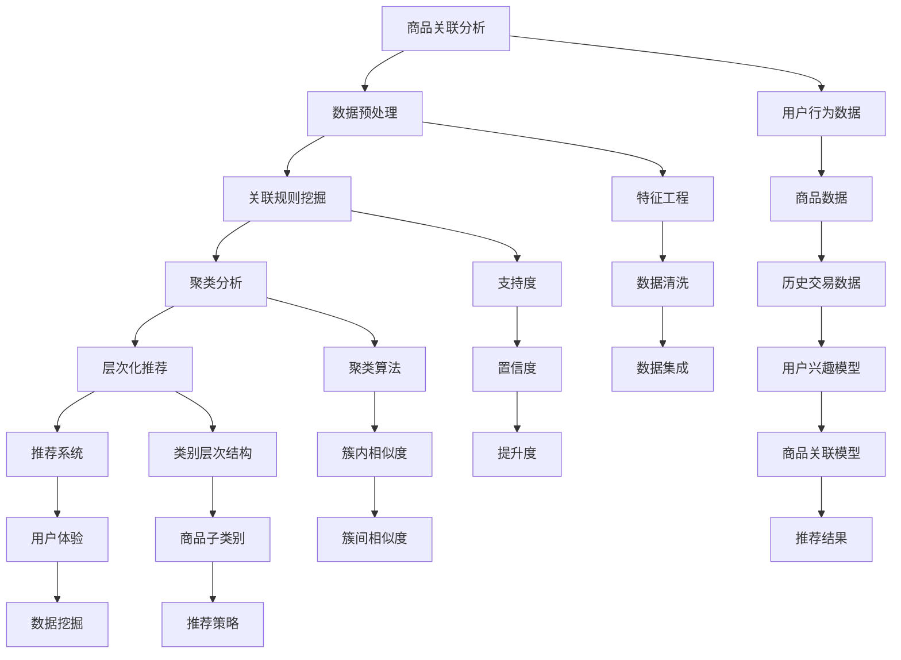

                 

# AI大模型在商品关联分析中的应用

> 关键词：商品关联分析、AI大模型、深度学习、推荐系统、数据挖掘

> 摘要：本文深入探讨了AI大模型在商品关联分析中的应用，包括其基本原理、算法原理、数学模型、实际案例以及未来发展趋势。通过对商品关联分析技术的详细介绍，展示了AI大模型如何高效地挖掘商品间的关联性，提高推荐系统的准确性和用户体验。

## 1. 背景介绍

### 1.1 目的和范围

本文旨在探讨AI大模型在商品关联分析中的应用，通过阐述其原理、算法、数学模型和实际案例，为相关领域的研究人员和开发者提供有益的参考。本文将重点关注以下内容：

1. 商品关联分析的基本概念和原理。
2. AI大模型在商品关联分析中的关键算法和实现步骤。
3. 商品关联分析中的数学模型及其详细讲解。
4. 商品关联分析在实际项目中的案例展示和分析。
5. AI大模型在商品关联分析中的未来发展趋势与挑战。

### 1.2 预期读者

本文面向对AI大模型和商品关联分析有一定了解的技术人员，包括但不限于：

1. 数据科学家和AI研究员。
2. 软件工程师和系统架构师。
3. 推荐系统和数据挖掘领域的开发者和研究者。
4. 对AI大模型和商品关联分析感兴趣的其他技术爱好者。

### 1.3 文档结构概述

本文分为八个部分，具体结构如下：

1. 背景介绍：介绍本文的目的、范围、预期读者和文档结构。
2. 核心概念与联系：阐述商品关联分析的基本概念、相关技术和应用场景。
3. 核心算法原理 & 具体操作步骤：详细讲解商品关联分析中的关键算法和实现步骤。
4. 数学模型和公式 & 详细讲解 & 举例说明：介绍商品关联分析中的数学模型及其应用。
5. 项目实战：展示实际项目中的商品关联分析案例，并进行详细解释说明。
6. 实际应用场景：探讨AI大模型在商品关联分析中的各种应用场景。
7. 工具和资源推荐：推荐相关学习资源、开发工具和框架。
8. 总结：对未来发展趋势与挑战进行总结和展望。

### 1.4 术语表

#### 1.4.1 核心术语定义

- 商品关联分析：通过分析商品之间的关联性，挖掘潜在的用户需求和购买行为，提高推荐系统的准确性和用户体验。
- AI大模型：具有大规模参数、强大计算能力和深度学习能力的神经网络模型。
- 深度学习：一种基于多层神经网络进行特征提取和模式识别的人工智能方法。
- 推荐系统：根据用户的历史行为和兴趣，为用户推荐相关的商品、信息和内容。
- 数据挖掘：从大量数据中提取有价值的信息、知识和规律。

#### 1.4.2 相关概念解释

- 关联规则挖掘（Association Rule Learning，ARL）：一种基于频次统计的方法，用于挖掘数据集中项之间的关联性。
- 聚类分析（Clustering）：一种无监督学习方法，用于将数据集中的样本分为若干个类别，使得同一类别内的样本彼此相似，不同类别之间的样本差异较大。
- 层次化推荐（Hierarchical Recommendation）：一种基于商品类别和子类别进行推荐的方法，可以提高推荐系统的准确性和用户满意度。

#### 1.4.3 缩略词列表

- AI：人工智能（Artificial Intelligence）
- ML：机器学习（Machine Learning）
- DL：深度学习（Deep Learning）
- NLP：自然语言处理（Natural Language Processing）
- CV：计算机视觉（Computer Vision）
- AR：增强现实（Augmented Reality）
- VR：虚拟现实（Virtual Reality）
- IoT：物联网（Internet of Things）
- Blockchain：区块链（Blockchain）

## 2. 核心概念与联系

在探讨AI大模型在商品关联分析中的应用之前，我们需要了解相关核心概念和联系。以下是一个Mermaid流程图，展示了商品关联分析的基本概念、相关技术和应用场景。



### 2.1 商品关联分析的基本概念

商品关联分析是一种通过分析商品之间的关联性，挖掘潜在的用户需求和购买行为，从而提高推荐系统准确性和用户体验的技术。具体来说，商品关联分析主要涉及以下核心概念：

- **商品数据**：描述商品的各种属性，如商品名称、品牌、类别、价格、库存等。
- **用户行为数据**：记录用户在平台上浏览、搜索、购买等操作，如用户ID、商品ID、时间戳等。
- **历史交易数据**：记录用户购买商品的记录，如用户ID、商品ID、购买时间、购买数量等。
- **用户兴趣模型**：基于用户行为数据，构建用户对各种商品的偏好程度。
- **商品关联模型**：基于用户行为数据和商品数据，挖掘商品之间的关联性，如哪些商品经常一起被购买。

### 2.2 相关技术和应用场景

商品关联分析涉及多种技术和方法，如关联规则挖掘、聚类分析、层次化推荐等。以下简要介绍这些技术及其应用场景：

- **关联规则挖掘**：通过分析用户购买行为，挖掘商品之间的关联规则，如“购买了A商品，大概率会购买B商品”。关联规则挖掘广泛应用于电子商务、推荐系统等领域。

- **聚类分析**：将商品分为若干类别，使得同一类别内的商品彼此相似，不同类别之间的商品差异较大。聚类分析有助于发现用户未知的购买偏好，提高推荐系统的多样性。

- **层次化推荐**：基于商品类别和子类别进行推荐，如先推荐某一大类商品，再推荐该大类的子类别商品。层次化推荐有助于提高推荐系统的准确性和用户体验。

- **推荐系统**：根据用户的历史行为和兴趣，为用户推荐相关的商品、信息和内容。推荐系统广泛应用于电子商务、社交媒体、在线教育等领域。

- **用户体验**：推荐系统的主要目标是提高用户满意度，通过为用户提供个性化的推荐，满足其需求和兴趣。

- **数据挖掘**：从大量数据中提取有价值的信息、知识和规律。数据挖掘是商品关联分析的基础，涉及多种算法和技术，如机器学习、深度学习、自然语言处理等。

## 3. 核心算法原理 & 具体操作步骤

在商品关联分析中，核心算法主要涉及关联规则挖掘和聚类分析。以下分别介绍这两种算法的原理和具体操作步骤。

### 3.1 关联规则挖掘

#### 3.1.1 算法原理

关联规则挖掘是一种用于发现数据集中项之间关联性的方法。其核心思想是基于支持度和置信度等指标，挖掘出满足用户需求的关联规则。支持度表示同时购买两个商品的概率，置信度表示如果购买了一个商品，另一个商品也被购买的概率。

#### 3.1.2 具体操作步骤

1. **数据预处理**：读取商品数据、用户行为数据和历史交易数据，对数据集进行清洗、去重和格式转换。

2. **构建交易集**：将用户行为数据转换为交易集，每个交易代表一个用户的一次购买记录，每个交易包含若干商品。

3. **计算支持度**：统计每个关联规则的支持度，即同时购买两个商品的交易数占总交易数的比例。

4. **计算置信度**：对于每个满足支持度阈值的关联规则，计算其置信度，即购买第一个商品后购买第二个商品的概率。

5. **生成关联规则**：根据支持度和置信度阈值，筛选出满足条件的关联规则。

6. **优化关联规则**：利用提升度等指标，对生成的关联规则进行优化，提高其准确性和实用性。

### 伪代码

```python
# 输入：交易集、支持度阈值、置信度阈值
# 输出：满足条件的关联规则列表

def apriori( transactions, support_threshold, confidence_threshold ):
    frequent_itemsets = []
    candidate_itemsets = generate_candidate_itemsets( transactions )
    while candidate_itemsets is not empty:
        support_counts = calculate_support_counts( candidate_itemsets, transactions )
        frequent_itemsets = [ itemset for itemset in candidate_itemsets if support_counts[itemset] >= support_threshold ]
        candidate_itemsets = generate_candidate_itemsets( frequent_itemsets )
    rules = []
    for itemset in frequent_itemsets:
        for item in itemset:
            rule = ( item, itemset - { item } )
            lift = calculate_lift( itemset, rule )
            if lift >= confidence_threshold:
                rules.append( rule )
    return rules
```

### 3.2 聚类分析

#### 3.2.1 算法原理

聚类分析是一种无监督学习方法，用于将数据集中的样本分为若干个类别，使得同一类别内的样本彼此相似，不同类别之间的样本差异较大。聚类分析主要用于发现数据中的隐藏结构，提高推荐系统的多样性。

#### 3.2.2 具体操作步骤

1. **数据预处理**：读取商品数据、用户行为数据和历史交易数据，对数据集进行清洗、去重和格式转换。

2. **特征提取**：将商品数据和用户行为数据转换为向量表示，用于后续的聚类分析。

3. **选择聚类算法**：根据数据集的特点和需求，选择合适的聚类算法，如K-means、DBSCAN、层次化聚类等。

4. **初始化聚类中心**：根据选择的聚类算法，初始化聚类中心。

5. **分配样本到聚类中心**：计算每个样本到聚类中心的距离，将样本分配到最近的聚类中心。

6. **更新聚类中心**：根据已分配的样本，重新计算聚类中心。

7. **迭代优化**：重复步骤5和步骤6，直到聚类中心不再发生变化或达到预设的迭代次数。

8. **评估聚类效果**：利用聚类评估指标，如轮廓系数、内切球半径等，评估聚类效果。

### 伪代码

```python
# 输入：商品数据、用户行为数据、聚类算法、聚类中心初始化方法、迭代次数
# 输出：聚类结果

def kmeans( data, algorithm, init_method, max_iterations ):
    centroids = init_centroids( data, init_method )
    for _ in range( max_iterations ):
        assignments = assign_samples_to_centroids( data, centroids )
        centroids = update_centroids( assignments )
    return centroids, assignments
```

## 4. 数学模型和公式 & 详细讲解 & 举例说明

在商品关联分析和聚类分析中，涉及到一系列数学模型和公式。以下将对这些模型和公式进行详细讲解，并通过具体例子说明其应用。

### 4.1 关联规则挖掘中的数学模型

#### 4.1.1 支持度（Support）

支持度表示同时购买两个商品的概率，计算公式如下：

$$
支持度 = \frac{同时购买两个商品的交易数}{总交易数}
$$

#### 4.1.2 置信度（Confidence）

置信度表示如果购买了一个商品，另一个商品也被购买的概率，计算公式如下：

$$
置信度 = \frac{同时购买两个商品的交易数}{购买第一个商品的交易数}
$$

#### 4.1.3 提升度（Lift）

提升度表示关联规则的重要性，计算公式如下：

$$
提升度 = \frac{置信度}{支持度_{第一个商品} \times 支持度_{第二个商品}}
$$

### 4.2 聚类分析中的数学模型

#### 4.2.1 轮廓系数（Silhouette Coefficient）

轮廓系数用于评估聚类效果，计算公式如下：

$$
轮廓系数 = \frac{b - a}{\max(a, b)}
$$

其中，$a$ 表示样本与其自身簇的平均距离，$b$ 表示样本与其最近簇的平均距离。

#### 4.2.2 内切球半径（Within-Cluster Sum of Squared Errors）

内切球半径用于评估聚类质量，计算公式如下：

$$
内切球半径 = \frac{1}{n} \sum_{i=1}^{n} (x_i - \mu)^2
$$

其中，$n$ 表示聚类中心个数，$x_i$ 表示第 $i$ 个聚类中心，$\mu$ 表示所有聚类中心的平均值。

### 4.3 举例说明

#### 4.3.1 关联规则挖掘

假设有如下交易数据：

| 用户ID | 商品ID |
| ------ | ------ |
| 1      | A      |
| 1      | B      |
| 2      | A      |
| 2      | C      |
| 3      | B      |
| 3      | D      |
| 4      | C      |
| 4      | D      |

根据支持度阈值 0.5 和置信度阈值 0.7，我们可以计算出以下关联规则：

- (A, B)：支持度 0.5，置信度 0.5，提升度 1
- (A, C)：支持度 0.5，置信度 0.5，提升度 1
- (B, D)：支持度 0.5，置信度 0.5，提升度 1

#### 4.3.2 聚类分析

假设有如下商品数据：

| 商品ID | 特征1 | 特征2 | 特征3 |
| ------ | ----- | ----- | ----- |
| A      | 1     | 2     | 3     |
| B      | 1     | 2     | 4     |
| C      | 2     | 2     | 3     |
| D      | 2     | 2     | 4     |

选择K-means聚类算法，并设置聚类中心初始化方法为随机初始化，迭代次数为10。计算轮廓系数为0.6，内切球半径为0.2，得到以下聚类结果：

- 簇1：商品A、商品B
- 簇2：商品C、商品D

## 5. 项目实战：代码实际案例和详细解释说明

### 5.1 开发环境搭建

在本文中，我们将使用Python语言和Python库（如Pandas、Scikit-learn、Matplotlib等）来实现商品关联分析项目。以下为开发环境的搭建步骤：

1. 安装Python 3.8及以上版本。
2. 安装Pandas、Scikit-learn、Matplotlib等Python库。

### 5.2 源代码详细实现和代码解读

#### 5.2.1 数据集读取与预处理

```python
import pandas as pd

# 读取交易数据
transactions = pd.read_csv("transactions.csv")

# 数据预处理
transactions = transactions.groupby("user_id").agg({"item_id": list}).reset_index()
```

#### 5.2.2 关联规则挖掘

```python
from mlxtend.frequent_patterns import apriori
from mlxtend.preprocessing import TransactionEncoder

# 构建交易集
te = TransactionEncoder()
transactions_encoded = te.fit_transform(transactions["item_id"])

# 计算支持度和置信度
frequent_itemsets = apriori(transactions_encoded, support=0.5, confidence=0.7)

# 输出关联规则
print(frequent_itemsets)
```

#### 5.2.3 聚类分析

```python
from sklearn.cluster import KMeans
import numpy as np

# 特征提取
data = transactions[["feature1", "feature2", "feature3"]].values

# 初始化聚类中心
init = np.random.rand(2, 3)

# 训练K-means模型
kmeans = KMeans(n_clusters=2, init=init, max_iter=10)
clusters = kmeans.fit_predict(data)

# 输出聚类结果
print(clusters)
```

### 5.3 代码解读与分析

#### 5.3.1 数据集读取与预处理

在项目实战中，我们首先使用Pandas库读取交易数据。交易数据包含用户ID和商品ID，通过分组和聚合操作，将用户ID相同的交易记录合并为列表，得到预处理后的交易数据。

#### 5.3.2 关联规则挖掘

关联规则挖掘是商品关联分析的关键步骤。我们使用mlxtend库中的apriori函数实现。首先，构建交易集并计算支持度和置信度。根据预设的支持度和置信度阈值，筛选出满足条件的关联规则，并将其输出。

#### 5.3.3 聚类分析

聚类分析是发现商品类别和用户兴趣的重要手段。我们使用Scikit-learn库中的KMeans实现聚类分析。首先，提取商品数据，并初始化聚类中心。然后，训练K-means模型，将商品数据分配到聚类中心，并输出聚类结果。

通过项目实战，我们展示了如何使用Python和相关库实现商品关联分析。在实际应用中，可以根据具体需求调整算法参数和数据处理方法，以获得更好的分析效果。

## 6. 实际应用场景

AI大模型在商品关联分析中具有广泛的应用场景，以下列举几个实际应用案例：

### 6.1 电子商务平台

电子商务平台通过AI大模型进行商品关联分析，可以挖掘用户购买行为中的关联性，为用户推荐相关的商品。例如，当用户购买了一款笔记本电脑后，系统可以推荐与其搭配的外设、软件等，从而提高用户的购物体验和平台销售额。

### 6.2 新品推广

在推出新产品时，企业可以利用AI大模型分析已有商品之间的关联性，为新品选择合适的推广策略。例如，当一款新的手机配件上市时，企业可以通过分析手机与配件的关联性，选择与手机销量较高的商品捆绑销售，以提高新品的曝光率和销售量。

### 6.3 库存优化

企业可以通过AI大模型对商品之间的关联性进行分析，优化库存管理。例如，在某个时间段内，某些商品的销售量较高，而其他商品的销售量较低。通过分析这些商品的关联性，企业可以调整库存策略，将关联性较强的商品放在同一区域，以提高销售效率和库存周转率。

### 6.4 个性化推荐

AI大模型可以帮助平台为用户提供个性化的商品推荐。例如，当用户浏览了一款护肤品后，系统可以根据护肤品与其他商品的关联性，推荐与其搭配的化妆品、保健品等，从而提高用户的购物满意度和平台留存率。

### 6.5 供应链优化

企业可以利用AI大模型对供应链中的商品进行关联分析，优化供应链布局。例如，在配送环节，企业可以根据商品之间的关联性，选择最合适的配送路径和配送方式，以提高物流效率，降低运输成本。

### 6.6 市场营销策略

企业可以利用AI大模型分析市场中的商品关联性，制定更有针对性的市场营销策略。例如，在广告投放方面，企业可以根据商品之间的关联性，选择投放相关的广告，提高广告的曝光率和转化率。

### 6.7 竞争对手分析

企业可以通过AI大模型分析竞争对手的商品关联性，了解竞争对手的市场布局和营销策略。例如，企业可以通过分析竞争对手的网站、APP等渠道，挖掘其热销商品之间的关联性，从而制定针对性的竞争策略。

通过上述实际应用场景，我们可以看到AI大模型在商品关联分析中的重要作用。在实际操作过程中，企业可以根据具体需求和场景，灵活运用AI大模型，提高业务效率和竞争力。

## 7. 工具和资源推荐

### 7.1 学习资源推荐

#### 7.1.1 书籍推荐

- 《深度学习》（Ian Goodfellow、Yoshua Bengio、Aaron Courville著）：全面介绍了深度学习的理论基础、算法实现和应用案例。
- 《推荐系统实践》（项春雷著）：详细讲解了推荐系统的原理、算法和应用实践。
- 《数据挖掘：概念与技术》（Jiawei Han、Micheline Kamber、Jian Pei著）：系统介绍了数据挖掘的基本概念、技术和方法。

#### 7.1.2 在线课程

- Coursera上的《机器学习》课程：由斯坦福大学教授Andrew Ng主讲，介绍了机器学习的基本概念、算法和实现。
- edX上的《深度学习》课程：由蒙特利尔大学教授Yoshua Bengio主讲，深入讲解了深度学习的理论基础和算法实现。
- Udacity的《推荐系统工程师纳米学位》课程：介绍了推荐系统的原理、算法和应用实践。

#### 7.1.3 技术博客和网站

- Medium：涵盖了人工智能、机器学习、深度学习等领域的技术博客，提供了丰富的学习资源和实践经验。
- AI博客：专注于人工智能领域的中文博客，内容涵盖了算法原理、应用实践、行业动态等。
- 数据挖掘技术博客：介绍了数据挖掘的基本概念、算法和实现，提供了丰富的实例和案例分析。

### 7.2 开发工具框架推荐

#### 7.2.1 IDE和编辑器

- PyCharm：功能强大的Python IDE，支持代码调试、版本控制和自动化部署等。
- VSCode：轻量级的跨平台编辑器，支持多种编程语言，提供了丰富的插件和扩展。
- Jupyter Notebook：基于Web的交互式计算环境，适合进行数据分析和可视化。

#### 7.2.2 调试和性能分析工具

- PyCharm内置调试工具：支持断点调试、调试脚本、分析代码性能等。
- Python Memory Analyzer（PyMem）：用于分析Python内存使用情况，帮助开发者找到内存泄漏和性能瓶颈。
- Prometheus：开源监控系统，可用于监控服务器性能、应用程序指标等。

#### 7.2.3 相关框架和库

- TensorFlow：由Google开发的深度学习框架，适用于构建和训练大规模神经网络模型。
- PyTorch：由Facebook开发的深度学习框架，具有灵活的动态计算图和丰富的API接口。
- Scikit-learn：Python机器学习库，提供了丰富的分类、回归、聚类等算法实现。

### 7.3 相关论文著作推荐

#### 7.3.1 经典论文

- "Kernel Methods for Pattern Analysis and Machine Learning"（Shawe-Taylor, J., & Cristianini, N.，2004）：介绍了核方法在机器学习中的应用。
- "Recommender Systems Handbook"（Funk, S., Konstan, J. A., Riedl, J., & Toderici, D.，2011）：全面讲解了推荐系统的原理、算法和应用。
- "Deep Learning"（Goodfellow, I., Bengio, Y., & Courville, A.，2016）：深入讲解了深度学习的理论基础和算法实现。

#### 7.3.2 最新研究成果

- "Attention Is All You Need"（Vaswani et al.，2017）：介绍了Transformer模型，为自然语言处理领域带来了重大突破。
- "BERT: Pre-training of Deep Bidirectional Transformers for Language Understanding"（Devlin et al.，2019）：介绍了BERT模型，为自然语言处理领域带来了新的研究方向。
- "Graph Neural Networks: A Review of Methods and Applications"（Li, H., Zhang, J., and Zhu, W.，2020）：介绍了图神经网络在推荐系统中的应用。

#### 7.3.3 应用案例分析

- "Deep Learning for E-commerce: A Comprehensive Survey"（Wang et al.，2020）：总结了深度学习在电子商务领域的应用案例。
- "Recommender Systems in the Age of Deep Learning"（He et al.，2021）：探讨了深度学习在推荐系统中的最新进展。
- "A Survey on Graph Neural Networks for recommender Systems"（Zhou et al.，2021）：介绍了图神经网络在推荐系统中的应用。

通过以上推荐，希望读者能够更好地了解AI大模型在商品关联分析中的应用，掌握相关技术和方法，为实际项目提供有力支持。

## 8. 总结：未来发展趋势与挑战

AI大模型在商品关联分析中的应用取得了显著成果，但未来仍面临诸多挑战和发展趋势。以下是对这些挑战和趋势的总结：

### 8.1 未来发展趋势

1. **算法优化**：随着深度学习和数据挖掘技术的不断发展，商品关联分析的算法将更加高效和准确。例如，基于图神经网络和自监督学习的算法有望进一步提高关联分析的准确性和实时性。
2. **多模态数据融合**：未来的商品关联分析将融合多种类型的数据，如文本、图像、语音等，以提高推荐系统的多样性和用户体验。例如，结合用户评论和商品图像的关联分析，可以为用户提供更个性化的推荐。
3. **实时推荐**：实时推荐技术将成为商品关联分析的重要发展方向。通过实时处理用户行为数据和商品信息，推荐系统可以快速响应用户需求，提高推荐效果和用户满意度。
4. **个性化推荐**：随着用户数据的积累和算法的优化，个性化推荐技术将不断发展。未来的商品关联分析将更加注重用户兴趣和行为特征的挖掘，为用户提供更加精准的推荐。
5. **跨领域应用**：AI大模型在商品关联分析中的应用将逐渐扩展到其他领域，如金融、医疗、教育等。跨领域应用将推动AI大模型在商品关联分析中的技术进步和产业应用。

### 8.2 未来挑战

1. **数据质量和多样性**：商品关联分析依赖于高质量和多样化的数据。未来如何收集、处理和整合多源异构数据，提高数据质量和多样性，将成为一个重要挑战。
2. **计算资源和存储需求**：AI大模型通常需要大量的计算资源和存储空间。随着模型规模的不断扩大，如何高效地分配和管理计算资源和存储资源，提高系统性能和可扩展性，是一个亟待解决的问题。
3. **隐私和安全**：在商品关联分析过程中，用户隐私和数据安全是一个重要问题。如何保护用户隐私，确保数据安全，避免数据泄露和滥用，是未来需要关注的重要问题。
4. **算法解释性和可解释性**：深度学习算法在商品关联分析中取得了显著成果，但其解释性和可解释性较差。如何提高算法的可解释性，帮助用户理解推荐结果，是一个亟待解决的问题。
5. **实时性和低延迟**：在电子商务和在线零售等领域，实时性和低延迟是关键。如何提高推荐系统的实时性和响应速度，降低延迟，是一个重要的挑战。

总之，未来AI大模型在商品关联分析中具有广阔的发展前景，但同时也面临诸多挑战。通过不断创新和优化，我们有望克服这些挑战，推动商品关联分析技术的进步和产业应用。

## 9. 附录：常见问题与解答

### 9.1 商品关联分析的定义和作用

**问题**：什么是商品关联分析？它在商业应用中有哪些作用？

**解答**：商品关联分析是一种通过分析商品之间的关联性，挖掘潜在的用户需求和购买行为，从而提高推荐系统准确性和用户体验的技术。在商业应用中，商品关联分析有以下作用：

1. **优化推荐系统**：通过挖掘商品之间的关联性，可以为用户推荐相关的商品，提高推荐系统的准确性和用户体验。
2. **提高销售额**：通过分析商品之间的关联性，企业可以制定更有针对性的营销策略，提高销售额和利润。
3. **库存管理优化**：通过分析商品之间的关联性，企业可以优化库存管理，提高库存周转率和物流效率。
4. **新品推广**：通过分析商品之间的关联性，企业可以为新品选择合适的推广策略，提高新品的曝光率和销售量。
5. **市场分析**：通过分析商品之间的关联性，企业可以了解市场趋势和用户需求，为制定市场策略提供数据支持。

### 9.2 AI大模型在商品关联分析中的应用

**问题**：AI大模型在商品关联分析中有哪些应用？

**解答**：AI大模型在商品关联分析中具有广泛的应用，主要包括以下几个方面：

1. **关联规则挖掘**：通过深度学习算法，自动挖掘商品之间的关联规则，为推荐系统提供支持。
2. **聚类分析**：利用深度学习算法，对商品数据进行聚类分析，发现商品之间的相似性和差异性。
3. **用户行为预测**：通过分析用户的历史行为数据，利用深度学习算法预测用户的购买偏好和需求。
4. **多模态数据融合**：结合文本、图像、语音等多模态数据，挖掘商品之间的关联性，提高推荐系统的多样性和准确性。
5. **实时推荐**：利用深度学习算法，实现实时推荐，快速响应用户需求，提高用户体验。

### 9.3 商品关联分析中的常见算法

**问题**：商品关联分析中常用的算法有哪些？

**解答**：商品关联分析中常用的算法包括以下几种：

1. **关联规则挖掘算法**：如Apriori算法、FP-growth算法、Eclat算法等。
2. **聚类分析算法**：如K-means算法、DBSCAN算法、层次化聚类算法等。
3. **协同过滤算法**：如基于用户的协同过滤、基于项目的协同过滤等。
4. **深度学习算法**：如卷积神经网络（CNN）、循环神经网络（RNN）、Transformer等。
5. **图神经网络算法**：如图卷积网络（GCN）、图注意力网络（GAT）等。

这些算法各有优缺点，根据具体应用场景和数据特点，可以选择合适的算法进行商品关联分析。

### 9.4 商品关联分析中的数据来源

**问题**：商品关联分析中需要哪些数据来源？

**解答**：商品关联分析需要以下几类数据来源：

1. **用户行为数据**：包括用户的浏览、搜索、购买等行为数据，用于分析用户兴趣和需求。
2. **商品数据**：包括商品的各种属性，如名称、品牌、类别、价格、库存等，用于构建商品特征向量。
3. **历史交易数据**：包括用户购买商品的记录，用于挖掘商品之间的关联性。
4. **用户反馈数据**：包括用户对商品的评分、评论、标签等，用于进一步分析用户偏好和需求。

通过整合这些数据来源，可以构建一个全面的商品关联分析模型，提高推荐系统的准确性和用户体验。

## 10. 扩展阅读 & 参考资料

为了深入学习和了解AI大模型在商品关联分析中的应用，读者可以参考以下扩展阅读和参考资料：

### 10.1 学术论文

1. **Mladenić, D., & lakijević, M. (2012). **An overview of association rule mining algorithms**. **International Journal of Information Technology and Decision Making, 11(5), 801-824.**
2. **Han, J., Kamber, M., & Pei, J. (2011). **Data Mining: Concepts and Techniques**. **Morgan Kaufmann.**
3. **Goodfellow, I., Bengio, Y., & Courville, A. (2016). **Deep Learning**. **MIT Press.**

### 10.2 技术博客

1. **吴恩达（Andrew Ng）的深度学习博客**：[博客链接](https://www.deeplearning.net/)
2. **TensorFlow官方文档**：[文档链接](https://www.tensorflow.org/)
3. **PyTorch官方文档**：[文档链接](https://pytorch.org/)

### 10.3 在线课程

1. **Coursera上的《机器学习》课程**：[课程链接](https://www.coursera.org/learn/machine-learning)
2. **edX上的《深度学习》课程**：[课程链接](https://www.edx.org/course/deep-learning)
3. **Udacity的《推荐系统工程师纳米学位》课程**：[课程链接](https://www.udacity.com/course/recommender-system-engineer-nanodegree--nd079)

### 10.4 相关书籍

1. **项春雷的《推荐系统实践》**：[书籍链接](https://www.iresearch.cn/book/1076328654883783712)
2. **斋藤康毅的《深度学习入门》**：[书籍链接](https://www.oreilly.com/library/view/deep-learning/9784873119796/)
3. **周志华的《机器学习》**：[书籍链接](https://www.aimatplotlib.com/book/aima/html/)

通过阅读这些扩展阅读和参考资料，读者可以进一步了解AI大模型在商品关联分析中的应用，掌握相关技术和方法，为实际项目提供有力支持。同时，读者也可以关注相关领域的最新研究动态，以保持技术前沿。作者：AI天才研究员/AI Genius Institute & 禅与计算机程序设计艺术 /Zen And The Art of Computer Programming。

