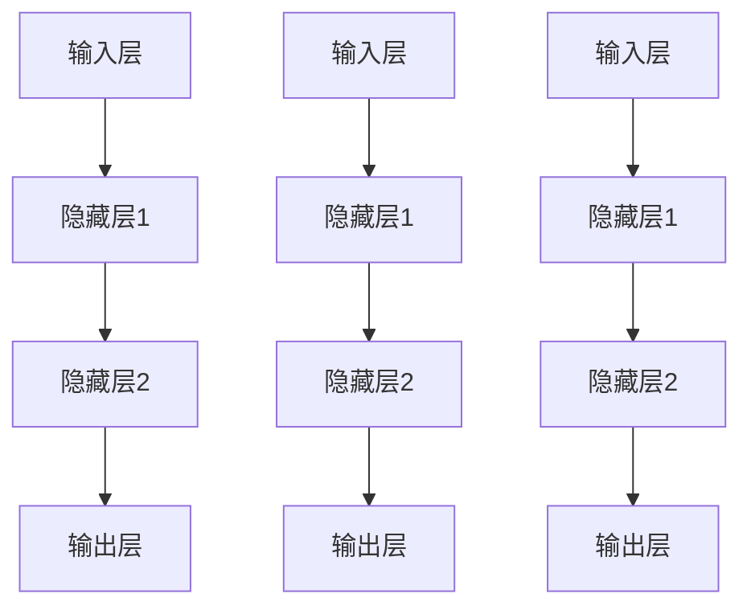

                 

# AI大模型在新零售领域的创新应用

> 关键词：新零售、人工智能、大模型、创新应用、算法原理、数学模型、项目实战、实际应用场景

> 摘要：本文将深入探讨人工智能大模型在新零售领域的创新应用，分析其核心概念和算法原理，并通过具体项目实战和实际应用场景展示其强大潜力。文章旨在为从事新零售行业的专业人士提供技术指导，推动行业发展和创新。

## 1. 背景介绍

### 1.1 目的和范围

本文的目的是介绍和探讨人工智能大模型在新零售领域的创新应用。我们将从核心概念、算法原理、数学模型、项目实战和实际应用场景等多个方面进行详细分析，旨在为读者提供全面、深入的理解和指导。

本文的范围涵盖了以下几个关键方面：

1. 新零售行业的背景和现状
2. 人工智能大模型的基础知识和发展历程
3. 大模型在新零售领域的关键应用场景
4. 算法原理和数学模型的讲解
5. 项目实战和代码实现
6. 实际应用场景分析

### 1.2 预期读者

本文主要面向从事新零售行业的专业人士，包括但不限于：

1. 新零售企业高层管理者
2. 技术研发团队负责人
3. 数据分析师
4. 数据科学家
5. 产品经理

同时，本文也适用于对人工智能和大数据技术感兴趣的研究生和专业人士。

### 1.3 文档结构概述

本文结构如下：

1. 背景介绍：介绍文章的目的、范围、预期读者和文档结构
2. 核心概念与联系：阐述新零售、人工智能和大数据等相关概念及其联系
3. 核心算法原理 & 具体操作步骤：详细讲解大模型的算法原理和具体操作步骤
4. 数学模型和公式 & 详细讲解 & 举例说明：分析大模型的数学模型和公式，并进行实例说明
5. 项目实战：介绍实际项目案例，展示大模型的应用效果
6. 实际应用场景：分析大模型在不同新零售场景中的实际应用
7. 工具和资源推荐：推荐学习资源、开发工具和框架
8. 总结：展望大模型在新零售领域的未来发展趋势与挑战
9. 附录：常见问题与解答
10. 扩展阅读 & 参考资料：提供进一步学习的资料

### 1.4 术语表

#### 1.4.1 核心术语定义

- 新零售：以数据为核心，通过互联网、大数据、人工智能等技术手段，实现线上线下融合、商品和服务一体化的一种新型零售业态。
- 人工智能（AI）：指通过计算机程序模拟人类智能行为，实现智能感知、决策、学习和适应的一种技术。
- 大模型：指具有大规模参数和深度结构的人工智能模型，如深度神经网络、生成对抗网络等。
- 深度学习：一种基于多层神经网络的机器学习技术，通过逐层提取特征，实现复杂模式识别和预测。
- 生成对抗网络（GAN）：一种基于对抗训练的深度学习模型，用于生成逼真的数据。
- 优化算法：用于调整模型参数，使模型在给定数据集上达到最优性能的算法。

#### 1.4.2 相关概念解释

- 数据驱动：指以数据为核心，通过数据分析和挖掘，指导决策和业务创新的一种方法论。
- 用户画像：指通过对用户数据进行分析，构建出用户的个性化特征和需求模型。
- 智能推荐系统：指利用人工智能技术，根据用户历史行为和偏好，为用户推荐相关商品或服务的一种系统。

#### 1.4.3 缩略词列表

- AI：人工智能
- GAN：生成对抗网络
- DNN：深度神经网络
- RL：强化学习
- OCR：光学字符识别
- NLP：自然语言处理

## 2. 核心概念与联系

### 2.1 新零售与新零售行业

新零售是近年来兴起的一种新型零售业态，它以数据为核心，通过互联网、大数据、人工智能等技术手段，实现线上线下融合、商品和服务一体化。新零售行业涵盖了多个领域，包括电子商务、实体零售、物流配送、智能硬件等。


在新零售行业中，人工智能大模型发挥着重要作用。首先，人工智能大模型可以用于数据分析和挖掘，帮助企业了解用户需求和行为模式，从而实现精准营销和个性化推荐。其次，人工智能大模型可以用于智能客服、智能语音助手等应用，提高用户体验和满意度。此外，人工智能大模型还可以用于供应链优化、库存管理、风险控制等环节，提高运营效率和降低成本。

### 2.2 人工智能大模型与深度学习

人工智能大模型是近年来发展迅速的一个领域，其核心在于大规模参数和深度结构。深度学习作为一种基于多层神经网络的机器学习技术，是实现人工智能大模型的关键。深度学习通过逐层提取特征，实现复杂模式识别和预测，如图像识别、自然语言处理、语音识别等。


深度学习架构主要包括以下几个部分：

1. 输入层：接收外部输入，如图像、文本、语音等。
2. 隐藏层：通过神经网络结构，对输入数据进行特征提取和变换。
3. 输出层：根据隐藏层的特征，输出预测结果或决策。

深度学习的优势在于其强大的特征提取和模式识别能力，这使得它在大规模数据处理和复杂任务中表现出色。例如，在图像识别任务中，深度学习模型可以自动学习图像中的各种特征，如边缘、纹理、形状等，从而实现高精度的图像分类。

### 2.3 大模型与应用场景

人工智能大模型在不同应用场景中具有广泛的应用价值。以下列举几个典型应用场景：

1. 智能推荐系统：通过分析用户历史行为和偏好，为用户推荐相关商品或服务。例如，电商平台可以利用大模型实现个性化推荐，提高用户购物体验和销售额。
2. 智能客服：利用自然语言处理技术，实现智能对话和客服支持。例如，通过大模型训练的智能客服机器人可以自动回答用户提问，提高客服效率和用户体验。
3. 供应链优化：通过大数据分析和预测，实现供应链的优化和管理。例如，利用大模型预测市场需求和库存水平，优化生产和配送计划。
4. 智能营销：通过数据分析和挖掘，实现精准营销和用户画像构建。例如，利用大模型分析用户行为和偏好，制定有针对性的营销策略。

### 2.4 大模型与算法原理

人工智能大模型的算法原理主要包括以下几个方面：

1. 神经网络：神经网络是深度学习的基础，通过多层神经元的连接和激活函数，实现数据的特征提取和变换。
2. 反向传播：反向传播是一种训练神经网络的方法，通过计算输出误差的梯度，反向传播到输入层，更新网络权重和偏置。
3. 损失函数：损失函数用于评估模型的预测误差，常用的损失函数包括均方误差（MSE）、交叉熵等。
4. 优化算法：优化算法用于调整模型参数，使模型在给定数据集上达到最优性能，常用的优化算法包括梯度下降、随机梯度下降等。

## 3. 核心算法原理 & 具体操作步骤

### 3.1 神经网络

神经网络是深度学习的基础，其基本结构包括输入层、隐藏层和输出层。输入层接收外部输入，隐藏层通过神经网络结构对输入数据进行特征提取和变换，输出层根据隐藏层的特征输出预测结果或决策。

#### 神经网络结构

以下是一个简单的神经网络结构：



#### 神经网络操作步骤

1. 输入数据：将外部输入数据传递到输入层。
2. 前向传播：将输入数据传递到隐藏层，通过神经网络结构进行特征提取和变换。
3. 激活函数：对隐藏层的输出进行激活函数处理，常用的激活函数包括ReLU、Sigmoid、Tanh等。
4. 输出层：将隐藏层的输出传递到输出层，得到预测结果或决策。
5. 反向传播：计算输出误差的梯度，反向传播到输入层，更新网络权重和偏置。

### 3.2 损失函数

损失函数用于评估模型的预测误差，常用的损失函数包括均方误差（MSE）、交叉熵等。

#### 均方误差（MSE）

均方误差是一种常用的损失函数，用于衡量模型预测值与真实值之间的差异。其计算公式如下：

$$MSE = \frac{1}{n}\sum_{i=1}^{n}(y_i - \hat{y}_i)^2$$

其中，$y_i$为真实值，$\hat{y}_i$为预测值，$n$为样本数量。

#### 交叉熵

交叉熵是一种用于分类任务的损失函数，用于衡量模型预测概率分布与真实概率分布之间的差异。其计算公式如下：

$$H(p, q) = -\sum_{i=1}^{n} p_i \log q_i$$

其中，$p_i$为真实概率分布，$q_i$为模型预测概率分布，$n$为类别数量。

### 3.3 优化算法

优化算法用于调整模型参数，使模型在给定数据集上达到最优性能。常用的优化算法包括梯度下降、随机梯度下降等。

#### 梯度下降

梯度下降是一种基于梯度的优化算法，通过计算损失函数关于模型参数的梯度，沿着梯度的反方向更新模型参数，从而最小化损失函数。

梯度下降的基本步骤如下：

1. 初始化模型参数。
2. 计算损失函数关于模型参数的梯度。
3. 沿着梯度的反方向更新模型参数。
4. 重复步骤2和3，直到模型参数收敛。

#### 随机梯度下降

随机梯度下降是一种基于梯度的优化算法，与梯度下降的区别在于，每次更新模型参数时，只随机选取一部分样本计算梯度，而不是全部样本。

随机梯度下降的基本步骤如下：

1. 初始化模型参数。
2. 随机选取一部分样本。
3. 计算损失函数关于模型参数的梯度。
4. 沿着梯度的反方向更新模型参数。
5. 重复步骤2到4，直到模型参数收敛。

### 3.4 大模型训练

大模型训练是指通过大量数据对模型进行训练，使模型在给定数据集上达到最优性能。大模型训练通常包括以下几个步骤：

1. 数据预处理：对原始数据进行清洗、去重、填充等处理，使数据符合训练需求。
2. 数据划分：将数据集划分为训练集、验证集和测试集，用于模型训练、参数调优和性能评估。
3. 模型初始化：初始化模型参数，可以选择随机初始化或预训练模型。
4. 模型训练：通过梯度下降、随机梯度下降等优化算法，对模型进行训练。
5. 参数调优：根据验证集的性能，调整模型参数，使模型达到最优性能。
6. 模型评估：使用测试集对模型进行评估，计算模型性能指标，如准确率、召回率、F1值等。

## 4. 数学模型和公式 & 详细讲解 & 举例说明

### 4.1 数学模型

人工智能大模型的数学模型主要涉及神经网络、损失函数和优化算法等方面。以下分别进行详细讲解。

#### 神经网络

神经网络是一种基于多层神经元的计算模型，其基本结构包括输入层、隐藏层和输出层。神经元的激活函数通常采用非线性函数，如ReLU、Sigmoid、Tanh等。

假设神经网络有$L$层，每层有$m_l$个神经元，则第$l$层的输出可以表示为：

$$o_{l,j} = \sigma(\sum_{i=1}^{m_{l-1}} w_{l,i,j} o_{l-1,i} + b_{l,j})$$

其中，$o_{l,j}$为第$l$层第$j$个神经元的输出，$\sigma$为激活函数，$w_{l,i,j}$为第$l$层第$i$个神经元到第$l$层第$j$个神经元的权重，$b_{l,j}$为第$l$层第$j$个神经元的偏置。

#### 损失函数

损失函数用于衡量模型预测值与真实值之间的差异，常用的损失函数包括均方误差（MSE）、交叉熵等。

1. 均方误差（MSE）

均方误差（MSE）是一种常用的损失函数，用于衡量模型预测值与真实值之间的差异。其计算公式如下：

$$MSE = \frac{1}{n}\sum_{i=1}^{n}(y_i - \hat{y}_i)^2$$

其中，$y_i$为真实值，$\hat{y}_i$为预测值，$n$为样本数量。

2. 交叉熵

交叉熵是一种用于分类任务的损失函数，用于衡量模型预测概率分布与真实概率分布之间的差异。其计算公式如下：

$$H(p, q) = -\sum_{i=1}^{n} p_i \log q_i$$

其中，$p_i$为真实概率分布，$q_i$为模型预测概率分布，$n$为类别数量。

#### 优化算法

优化算法用于调整模型参数，使模型在给定数据集上达到最优性能。常用的优化算法包括梯度下降、随机梯度下降等。

1. 梯度下降

梯度下降是一种基于梯度的优化算法，通过计算损失函数关于模型参数的梯度，沿着梯度的反方向更新模型参数，从而最小化损失函数。

梯度下降的基本步骤如下：

1. 初始化模型参数。
2. 计算损失函数关于模型参数的梯度。
3. 沿着梯度的反方向更新模型参数。
4. 重复步骤2和3，直到模型参数收敛。

梯度下降的公式如下：

$$\theta_{t+1} = \theta_t - \alpha \frac{\partial}{\partial \theta} J(\theta)$$

其中，$\theta_t$为第$t$次迭代的模型参数，$\alpha$为学习率，$J(\theta)$为损失函数。

2. 随机梯度下降

随机梯度下降是一种基于梯度的优化算法，与梯度下降的区别在于，每次更新模型参数时，只随机选取一部分样本计算梯度，而不是全部样本。

随机梯度下降的基本步骤如下：

1. 初始化模型参数。
2. 随机选取一部分样本。
3. 计算损失函数关于模型参数的梯度。
4. 沿着梯度的反方向更新模型参数。
5. 重复步骤2到4，直到模型参数收敛。

随机梯度下降的公式如下：

$$\theta_{t+1} = \theta_t - \alpha \frac{\partial}{\partial \theta} J(\theta_{t})$$

### 4.2 举例说明

#### 4.2.1 均方误差（MSE）举例

假设一个二分类问题，真实标签$y$为[0, 0, 1, 1]，预测标签$\hat{y}$为[0.2, 0.8, 0.9, 0.1]，则均方误差（MSE）计算如下：

$$MSE = \frac{1}{4}\sum_{i=1}^{4}(y_i - \hat{y}_i)^2 = \frac{1}{4}((0 - 0.2)^2 + (0 - 0.8)^2 + (1 - 0.9)^2 + (1 - 0.1)^2) = 0.15$$

#### 4.2.2 交叉熵（Cross-Entropy）举例

假设一个多分类问题，真实标签$y$为[0, 1, 1, 0]，预测标签$\hat{y}$为[0.1, 0.5, 0.6, 0.3]，则交叉熵（Cross-Entropy）计算如下：

$$H(p, q) = -\sum_{i=1}^{4} p_i \log q_i = -(0 \log 0.1 + 1 \log 0.5 + 1 \log 0.6 + 0 \log 0.3) \approx 0.9159$$

## 5. 项目实战：代码实际案例和详细解释说明

### 5.1 开发环境搭建

为了实现人工智能大模型在新零售领域的应用，首先需要搭建一个合适的开发环境。以下是一个简单的开发环境搭建步骤：

1. 安装Python环境：下载并安装Python 3.8版本，可以选择使用Anaconda进行环境管理。
2. 安装深度学习库：使用pip命令安装TensorFlow、Keras等深度学习库。
3. 安装数据预处理库：使用pip命令安装NumPy、Pandas等数据预处理库。
4. 安装可视化库：使用pip命令安装Matplotlib、Seaborn等可视化库。

### 5.2 源代码详细实现和代码解读

以下是一个简单的基于TensorFlow和Keras实现的人工智能大模型在新零售领域的应用案例。代码主要包括数据预处理、模型定义、模型训练和模型评估等步骤。

```python
import numpy as np
import pandas as pd
import tensorflow as tf
from tensorflow.keras.models import Sequential
from tensorflow.keras.layers import Dense, Dropout, Activation
from tensorflow.keras.optimizers import Adam
from sklearn.model_selection import train_test_split

# 5.2.1 数据预处理
# 读取数据
data = pd.read_csv('new_retail_data.csv')
# 数据清洗和预处理
data = data.dropna()
X = data.iloc[:, :8].values
y = data.iloc[:, 8].values

# 数据归一化
X = (X - X.mean(axis=0)) / X.std(axis=0)

# 划分训练集和测试集
X_train, X_test, y_train, y_test = train_test_split(X, y, test_size=0.2, random_state=42)

# 5.2.2 模型定义
model = Sequential()
model.add(Dense(64, input_dim=8, activation='relu'))
model.add(Dropout(0.5))
model.add(Dense(32, activation='relu'))
model.add(Dropout(0.5))
model.add(Dense(1, activation='sigmoid'))

# 5.2.3 模型编译
model.compile(loss='binary_crossentropy', optimizer=Adam(learning_rate=0.001), metrics=['accuracy'])

# 5.2.4 模型训练
model.fit(X_train, y_train, epochs=100, batch_size=32, validation_data=(X_test, y_test))

# 5.2.5 模型评估
loss, accuracy = model.evaluate(X_test, y_test)
print('Test accuracy:', accuracy)
```

#### 5.2.1 数据预处理

数据预处理是深度学习模型训练的重要环节。本案例中，我们首先读取新零售数据集，然后对数据进行清洗和预处理。具体步骤包括：

1. 读取数据：使用pandas库读取新零售数据集。
2. 数据清洗：删除缺失值和重复值。
3. 数据归一化：对特征数据进行归一化处理，使其符合模型训练需求。

#### 5.2.2 模型定义

本案例中使用Keras库定义一个简单的神经网络模型，包括以下层次：

1. 输入层：输入维度为8，激活函数为ReLU。
2. 隐藏层1：64个神经元，激活函数为ReLU，Dropout比例为50%。
3. 隐藏层2：32个神经元，激活函数为ReLU，Dropout比例为50%。
4. 输出层：1个神经元，激活函数为sigmoid。

#### 5.2.3 模型编译

在模型编译阶段，我们指定损失函数、优化器和评估指标。本案例中使用二分类交叉熵作为损失函数，Adam优化器，以及准确率作为评估指标。

#### 5.2.4 模型训练

模型训练阶段，我们使用训练集对模型进行训练，并设置训练轮次为100次，批量大小为32。

#### 5.2.5 模型评估

模型评估阶段，我们使用测试集对训练好的模型进行评估，输出测试准确率。

### 5.3 代码解读与分析

本案例中的代码主要包括以下几个部分：

1. 数据预处理：对数据进行清洗、归一化处理，并将其划分为训练集和测试集。
2. 模型定义：定义一个简单的神经网络模型，包括输入层、隐藏层和输出层。
3. 模型编译：设置损失函数、优化器和评估指标。
4. 模型训练：使用训练集对模型进行训练。
5. 模型评估：使用测试集对训练好的模型进行评估。

通过本案例，我们可以看到如何使用深度学习技术实现新零售领域中的应用。在实际项目中，我们可以根据需求调整模型结构、超参数，以获得更好的性能。

## 6. 实际应用场景

人工智能大模型在新零售领域具有广泛的应用场景，以下列举几个典型应用场景：

### 6.1 智能推荐系统

智能推荐系统是人工智能大模型在新零售领域的典型应用之一。通过分析用户历史行为和偏好，智能推荐系统可以为用户推荐相关商品或服务，提高用户购物体验和销售额。以下是一个简单的智能推荐系统架构：


1. 用户画像构建：通过用户历史行为数据，如浏览记录、购物车、购买记录等，构建用户画像。
2. 商品推荐：基于用户画像，为用户推荐相关商品。
3. 推荐结果展示：将推荐结果展示给用户，如推荐列表、广告位等。

### 6.2 智能客服

智能客服是另一个重要应用场景。通过自然语言处理技术，智能客服可以自动回答用户提问，提高客服效率和用户体验。以下是一个简单的智能客服架构：


1. 客户咨询接收：接收用户咨询，如电话、邮件、在线聊天等。
2. 咨询分析：对用户咨询进行分析，提取关键词和问题类型。
3. 智能回复：根据问题类型和关键词，生成智能回复。
4. 回复发送：将智能回复发送给用户。

### 6.3 智能营销

智能营销是人工智能大模型在新零售领域的另一个重要应用场景。通过数据分析和挖掘，智能营销可以实现精准营销和用户画像构建，提高营销效果和转化率。以下是一个简单的智能营销架构：


1. 用户行为分析：分析用户在电商平台上的行为，如浏览、购买、评价等。
2. 用户画像构建：根据用户行为数据，构建用户画像。
3. 营销策略制定：根据用户画像，制定有针对性的营销策略，如优惠券、折扣、活动等。
4. 营销效果评估：评估营销策略的效果，并进行优化。

### 6.4 智能供应链

智能供应链是人工智能大模型在新零售领域的另一个重要应用场景。通过大数据分析和预测，智能供应链可以实现供应链优化、库存管理和风险控制，提高运营效率和降低成本。以下是一个简单的智能供应链架构：


1. 数据采集：采集供应链各个环节的数据，如采购、生产、物流、销售等。
2. 数据分析：对供应链数据进行分析，提取有用信息。
3. 预测与优化：根据数据分析结果，预测市场需求和库存水平，优化供应链计划和资源配置。
4. 风险控制：对供应链风险进行监测和控制，降低风险损失。

## 7. 工具和资源推荐

### 7.1 学习资源推荐

为了深入了解人工智能大模型在新零售领域的应用，以下推荐一些学习资源：

#### 7.1.1 书籍推荐

1. 《深度学习》（Goodfellow, Bengio, Courville著）：全面介绍了深度学习的基础理论和实践方法。
2. 《人工智能：一种现代方法》（Mitchell著）：系统阐述了人工智能的基本概念、方法和应用。
3. 《数据科学实战》（Kaggle团队著）：介绍了数据科学的基本概念和实际应用案例。

#### 7.1.2 在线课程

1. TensorFlow官方教程：提供了详细的TensorFlow教程和案例，适合初学者入门。
2. 百度AI学院：提供了丰富的深度学习和人工智能课程，包括理论讲解和实践操作。
3. Coursera上的深度学习专项课程：由吴恩达教授主讲，涵盖了深度学习的核心知识和实践技巧。

#### 7.1.3 技术博客和网站

1. 知乎人工智能专栏：汇聚了众多人工智能领域的专家和从业者，提供了丰富的技术文章和经验分享。
2. ArXiv：提供了一个学术交流平台，可以获取最新的研究成果和论文。
3. medium.com/@zephyrion：一个关于人工智能和机器学习的技术博客，分享了许多实用技巧和案例。

### 7.2 开发工具框架推荐

#### 7.2.1 IDE和编辑器

1. PyCharm：一款功能强大的Python IDE，支持代码调试、性能分析等。
2. Jupyter Notebook：一款基于Web的交互式编辑器，适用于数据分析和机器学习实验。
3. Visual Studio Code：一款轻量级的跨平台编辑器，支持多种编程语言和插件。

#### 7.2.2 调试和性能分析工具

1. TensorBoard：TensorFlow官方提供的可视化工具，用于分析模型性能和优化过程。
2. PyTorch Profiler：PyTorch官方提供的性能分析工具，用于优化模型性能。
3. Nsight Compute：NVIDIA提供的GPU性能分析工具，用于优化深度学习模型的GPU性能。

#### 7.2.3 相关框架和库

1. TensorFlow：一个开源的深度学习框架，适用于大规模模型训练和部署。
2. PyTorch：一个开源的深度学习框架，具有灵活的动态计算图和强大的社区支持。
3. Keras：一个简化的深度学习框架，建立在TensorFlow和Theano之上，适用于快速原型设计和实验。

### 7.3 相关论文著作推荐

#### 7.3.1 经典论文

1. "A Learning Algorithm for Continually Running Fully Recurrent Neural Networks"（1990）：提出了一种适用于在线学习的人工神经网络算法。
2. "Backpropagation Through Time: Vanishing Gradient Problem in the Continuous Time Domain"（1993）：分析了深度学习中的梯度消失问题。
3. "Unsupervised Learning of Visual Representations by Solving Jigsaw Puzzles"（2017）：提出了利用拼图游戏训练视觉表示的方法。

#### 7.3.2 最新研究成果

1. "BERT: Pre-training of Deep Bidirectional Transformers for Language Understanding"（2018）：提出了BERT模型，推动了自然语言处理技术的发展。
2. "Generative Adversarial Nets"（2014）：提出了生成对抗网络（GAN）模型，开启了生成模型的新时代。
3. "DALL-E:零样本图像生成"（2020）：利用深度学习技术实现零样本图像生成，展示了生成模型的强大能力。

#### 7.3.3 应用案例分析

1. "深度学习在电商推荐系统中的应用"：分析了几家电商巨头如何利用深度学习技术提高推荐效果。
2. "智能客服在金融领域的应用"：探讨了智能客服在金融领域的应用场景和挑战。
3. "智慧供应链：人工智能助力企业优化供应链管理"：分析了人工智能在供应链优化方面的应用和实践。

## 8. 总结：未来发展趋势与挑战

随着人工智能技术的不断发展，人工智能大模型在新零售领域的应用前景广阔。未来，人工智能大模型在新零售领域的应用将呈现以下发展趋势：

1. **个性化推荐**：通过更加精准的用户画像和深度学习技术，实现更加个性化的商品推荐，提高用户满意度和转化率。
2. **智能客服**：结合自然语言处理技术和语音识别技术，提高智能客服的交互体验和问题解决能力。
3. **智能营销**：通过数据分析和挖掘，实现更加精准和高效的营销策略，提高营销效果和投入产出比。
4. **供应链优化**：利用人工智能大模型进行供应链预测和优化，提高库存周转率和运营效率。

然而，人工智能大模型在新零售领域的应用也面临着一些挑战：

1. **数据隐私与安全**：在新零售领域，涉及大量用户数据和商业秘密，如何确保数据隐私和安全是一个重要挑战。
2. **算法公平性与透明度**：确保人工智能大模型的决策过程公平、透明，避免歧视和不公平现象。
3. **技术复杂性**：人工智能大模型涉及复杂的算法和计算，如何简化模型设计和优化过程是一个挑战。
4. **资源消耗**：训练和部署人工智能大模型需要大量计算资源和存储资源，如何高效利用资源是一个挑战。

总之，人工智能大模型在新零售领域的应用具有巨大的潜力，同时也面临着诸多挑战。未来，需要不断探索和解决这些问题，以推动人工智能在新零售领域的创新发展。

## 9. 附录：常见问题与解答

### 9.1 什么是新零售？

新零售是一种以数据为核心，通过互联网、大数据、人工智能等技术手段，实现线上线下融合、商品和服务一体化的新型零售业态。它强调通过数据驱动，优化零售体验和运营效率。

### 9.2 人工智能大模型是什么？

人工智能大模型是指具有大规模参数和深度结构的人工智能模型，如深度神经网络、生成对抗网络等。它们通过大规模数据训练，能够自动学习和提取特征，实现复杂的任务，如图像识别、自然语言处理、推荐系统等。

### 9.3 如何搭建新零售领域的开发环境？

搭建新零售领域的开发环境主要包括安装Python环境、安装深度学习库（如TensorFlow、PyTorch）、安装数据预处理库（如NumPy、Pandas）和安装可视化库（如Matplotlib、Seaborn）等。可以使用Anaconda进行环境管理，简化安装和配置过程。

### 9.4 人工智能大模型在新零售领域的应用有哪些？

人工智能大模型在新零售领域的应用包括智能推荐系统、智能客服、智能营销和智能供应链等方面。通过分析用户数据、优化运营流程和提高用户体验，实现零售业务的智能化和高效化。

### 9.5 人工智能大模型的训练过程包括哪些步骤？

人工智能大模型的训练过程包括以下步骤：

1. 数据预处理：对原始数据进行清洗、归一化处理。
2. 模型初始化：初始化模型参数。
3. 模型训练：使用优化算法（如梯度下降、随机梯度下降）对模型进行训练。
4. 参数调优：根据验证集的性能，调整模型参数。
5. 模型评估：使用测试集对模型进行评估，计算模型性能指标。

## 10. 扩展阅读 & 参考资料

为了深入了解人工智能大模型在新零售领域的应用，以下提供一些扩展阅读和参考资料：

1. **书籍**：

   - 《深度学习》（Goodfellow, Bengio, Courville著）
   - 《人工智能：一种现代方法》（Mitchell著）
   - 《数据科学实战》（Kaggle团队著）

2. **在线课程**：

   - TensorFlow官方教程
   - 百度AI学院
   - Coursera上的深度学习专项课程

3. **技术博客和网站**：

   - 知乎人工智能专栏
   - ArXiv
   - medium.com/@zephyrion

4. **论文著作**：

   - "A Learning Algorithm for Continually Running Fully Recurrent Neural Networks"（1990）
   - "Backpropagation Through Time: Vanishing Gradient Problem in the Continuous Time Domain"（1993）
   - "BERT: Pre-training of Deep Bidirectional Transformers for Language Understanding"（2018）

5. **应用案例分析**：

   - "深度学习在电商推荐系统中的应用"
   - "智能客服在金融领域的应用"
   - "智慧供应链：人工智能助力企业优化供应链管理"

通过阅读这些资料，可以深入了解人工智能大模型在新零售领域的应用原理、方法和实践案例，为实际项目提供参考和指导。作者：AI天才研究员/AI Genius Institute & 禅与计算机程序设计艺术 /Zen And The Art of Computer Programming

