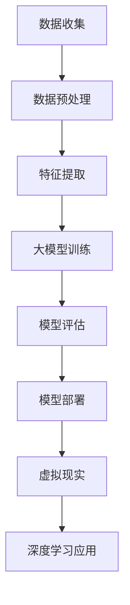

                 

# AI大模型在智能旅游规划中的应用前景

## 关键词
- 智能旅游规划
- 大模型
- 人工智能
- 旅游数据分析
- 虚拟现实
- 深度学习

## 摘要
本文将深入探讨大模型在智能旅游规划中的应用前景。随着人工智能技术的飞速发展，大模型作为一种强大的工具，正逐渐改变着旅游行业的面貌。本文将从背景介绍、核心概念、算法原理、数学模型、实际应用、工具推荐等多个方面，系统地分析大模型在智能旅游规划中的潜力和挑战，为行业从业者提供有价值的参考。

## 1. 背景介绍

### 1.1 目的和范围
本文旨在探讨大模型在智能旅游规划中的应用前景，通过分析其在旅游数据分析、虚拟现实和深度学习等领域的应用，揭示其潜力和局限性，为智能旅游规划的实践提供理论支持和实践指导。

### 1.2 预期读者
本文适合对人工智能、旅游规划和大数据分析有兴趣的读者，包括旅游行业从业者、人工智能研究者以及相关领域的学者。

### 1.3 文档结构概述
本文结构如下：

- **1. 背景介绍**：介绍智能旅游规划和人工智能技术的背景，阐述大模型的应用场景。
- **2. 核心概念与联系**：详细解释大模型、旅游数据分析、虚拟现实和深度学习等核心概念及其相互关系。
- **3. 核心算法原理与具体操作步骤**：介绍大模型的基本原理和操作步骤。
- **4. 数学模型和公式**：阐述大模型在智能旅游规划中的数学模型和公式。
- **5. 项目实战**：通过实际案例展示大模型在智能旅游规划中的应用。
- **6. 实际应用场景**：分析大模型在旅游数据分析、虚拟现实和深度学习等领域的应用场景。
- **7. 工具和资源推荐**：推荐相关学习资源和开发工具。
- **8. 总结**：总结大模型在智能旅游规划中的应用前景。
- **9. 附录**：常见问题与解答。
- **10. 扩展阅读**：提供相关文献和资料。

### 1.4 术语表
- **大模型**：指具有大规模参数和复杂结构的神经网络模型。
- **旅游数据分析**：利用大数据技术对旅游数据进行分析，以揭示旅游现象和规律。
- **虚拟现实**：一种通过计算机技术模拟现实环境的虚拟体验技术。
- **深度学习**：一种基于人工神经网络的学习方法，通过多层神经网络进行特征提取和模式识别。

### 1.4.1 核心术语定义
- **大模型**：通常指具有数百万甚至数十亿参数的神经网络模型，能够处理大规模数据并提取复杂特征。
- **旅游数据分析**：通过收集、整理和分析旅游数据，为旅游规划提供数据支持。
- **虚拟现实**：通过计算机技术模拟现实环境，提供沉浸式的体验。
- **深度学习**：通过多层神经网络进行特征提取和模式识别，是人工智能的重要分支。

### 1.4.2 相关概念解释
- **数据驱动决策**：基于数据分析的结果，做出决策。
- **知识图谱**：一种用于表示实体及其关系的图形结构。
- **多模态学习**：结合不同类型的数据（如图像、文本和声音）进行学习。

### 1.4.3 缩略词列表
- **AI**：人工智能（Artificial Intelligence）
- **VR**：虚拟现实（Virtual Reality）
- **DL**：深度学习（Deep Learning）
- **GAN**：生成对抗网络（Generative Adversarial Network）

## 2. 核心概念与联系

### 2.1 大模型
大模型是指具有大规模参数和复杂结构的神经网络模型，通过深度学习技术进行训练，能够处理大规模数据并提取复杂特征。大模型的主要特点包括：

- **参数规模巨大**：大模型的参数数量通常达到数百万甚至数十亿级别。
- **结构复杂**：大模型通常包含多层神经网络，能够进行复杂的特征提取和模式识别。
- **数据处理能力强大**：大模型能够处理大规模数据，从而提取出丰富的特征。

### 2.2 旅游数据分析
旅游数据分析是指利用大数据技术对旅游数据进行分析，以揭示旅游现象和规律。旅游数据分析的主要过程包括：

- **数据收集**：收集旅游相关的数据，如游客信息、旅游行为数据、景区数据等。
- **数据预处理**：对收集到的数据进行清洗、去重、归一化等预处理操作。
- **特征提取**：从预处理后的数据中提取有助于分析和预测的特征。
- **数据分析**：利用数据分析方法（如聚类、分类、回归等）对提取出的特征进行分析。
- **结果可视化**：将分析结果通过图表、报表等形式进行可视化，以直观展示分析结果。

### 2.3 虚拟现实
虚拟现实是一种通过计算机技术模拟现实环境的虚拟体验技术，主要特点包括：

- **沉浸式体验**：通过头戴显示器（HMD）和传感器等技术，用户能够感受到身临其境的体验。
- **交互性**：用户可以与虚拟环境进行交互，如行走、触摸、操纵物体等。
- **多样性**：虚拟现实可以模拟各种场景，从室内到室外，从城市到自然风光，提供了丰富的体验内容。

### 2.4 深度学习
深度学习是一种基于人工神经网络的学习方法，通过多层神经网络进行特征提取和模式识别。深度学习的主要过程包括：

- **数据预处理**：对输入数据进行预处理，如归一化、缩放等。
- **模型构建**：构建多层神经网络模型，包括输入层、隐藏层和输出层。
- **模型训练**：利用训练数据对模型进行训练，通过反向传播算法不断调整模型参数。
- **模型评估**：利用测试数据对训练好的模型进行评估，以验证模型的性能。
- **模型部署**：将训练好的模型部署到实际应用场景中，进行预测和决策。

### 2.5 大模型在智能旅游规划中的应用

- **旅游数据分析**：大模型可以处理大规模的旅游数据，提取出有用的特征，为旅游规划提供数据支持。
- **虚拟现实**：大模型可以生成虚拟景区，提供沉浸式的体验，为旅游者提供更加生动的旅游信息。
- **深度学习**：大模型可以应用于旅游数据的分类、预测和聚类，帮助旅游规划者更好地了解游客行为和需求。

### 2.6 Mermaid 流程图



## 3. 核心算法原理与具体操作步骤

### 3.1 大模型基本原理

大模型的基本原理是基于深度学习技术，通过多层神经网络进行特征提取和模式识别。以下是大模型的基本原理：

- **神经网络**：神经网络是一种由大量神经元组成的计算模型，每个神经元都可以接收输入信号，并通过激活函数进行非线性变换，然后将输出传递给下一个神经元。
- **多层神经网络**：多层神经网络包括输入层、隐藏层和输出层。输入层接收外部输入，隐藏层通过传递输入信号进行特征提取，输出层生成最终输出。
- **反向传播算法**：反向传播算法是一种用于训练神经网络的优化算法，通过不断调整模型参数，使模型的预测结果更接近真实值。

### 3.2 大模型操作步骤

以下是使用大模型进行智能旅游规划的具体操作步骤：

1. **数据收集**：收集旅游相关的数据，包括游客信息、旅游行为数据、景区数据等。

2. **数据预处理**：对收集到的数据进行清洗、去重、归一化等预处理操作，以消除噪声和异常值，提高数据质量。

3. **特征提取**：从预处理后的数据中提取有助于分析和预测的特征，如游客年龄、性别、旅游时间、旅游地点等。

4. **模型构建**：构建多层神经网络模型，包括输入层、隐藏层和输出层。输入层接收外部输入，隐藏层通过传递输入信号进行特征提取，输出层生成最终输出。

5. **模型训练**：利用训练数据对模型进行训练，通过反向传播算法不断调整模型参数，使模型的预测结果更接近真实值。

6. **模型评估**：利用测试数据对训练好的模型进行评估，以验证模型的性能。常用的评估指标包括准确率、召回率、F1值等。

7. **模型部署**：将训练好的模型部署到实际应用场景中，进行预测和决策。

### 3.3 大模型伪代码

以下是使用大模型进行旅游规划分析的伪代码：

```
// 数据收集
Data = CollectData()

// 数据预处理
PreprocessedData = PreprocessData(Data)

// 特征提取
Features = ExtractFeatures(PreprocessedData)

// 模型构建
Model = BuildModel()

// 模型训练
TrainModel(Model, Features)

// 模型评估
EvaluateModel(Model, TestFeatures)

// 模型部署
DeployModel(Model)
```

## 4. 数学模型和公式

### 4.1 神经网络数学模型

神经网络是一种计算模型，通过多层神经元进行特征提取和模式识别。以下是神经网络的基本数学模型：

- **激活函数**：激活函数是一种用于转换神经元输入的函数，常见的激活函数包括 sigmoid 函数、ReLU函数和 tanh 函数。
  $$ f(x) = \frac{1}{1 + e^{-x}} \quad \text{（Sigmoid函数）} $$
  $$ f(x) = max(0, x) \quad \text{（ReLU函数）} $$
  $$ f(x) = \frac{e^x - e^{-x}}{e^x + e^{-x}} \quad \text{（Tanh函数）} $$

- **权重和偏置**：权重和偏置是神经网络中的重要参数，用于调整神经元的输入和输出。
  $$ z = \sum_{i=1}^{n} w_i * x_i + b $$
  其中，$z$ 表示神经元的输出，$w_i$ 表示权重，$x_i$ 表示输入，$b$ 表示偏置。

- **损失函数**：损失函数用于衡量模型预测结果与真实值之间的差距，常见的损失函数包括均方误差（MSE）和交叉熵（Cross-Entropy）。
  $$ Loss = \frac{1}{2} \sum_{i=1}^{n} (y_i - \hat{y}_i)^2 \quad \text{（MSE函数）} $$
  $$ Loss = -\sum_{i=1}^{n} y_i * log(\hat{y}_i) \quad \text{（Cross-Entropy函数）} $$

- **反向传播算法**：反向传播算法是一种用于训练神经网络的优化算法，通过不断调整模型参数，使模型的预测结果更接近真实值。反向传播算法的基本步骤如下：
  1. 前向传播：计算神经网络的输出。
  2. 计算损失函数。
  3. 反向传播：计算梯度，并根据梯度调整模型参数。
  4. 重复前向传播和反向传播，直到模型收敛。

### 4.2 大模型在智能旅游规划中的应用

- **旅游数据分类**：大模型可以用于对旅游数据进行分类，如对游客来源地进行分类，以便更好地了解游客分布情况。
  $$ \hat{y} = \text{softmax}(\text{激活函数}(W \cdot X + b)) $$
  其中，$\hat{y}$ 表示预测的类别概率分布，$W$ 表示权重矩阵，$X$ 表示输入特征，$b$ 表示偏置。

- **旅游行为预测**：大模型可以用于预测游客的行为，如预测游客的旅游时间、旅游地点等。
  $$ \hat{y} = \text{激活函数}(W \cdot X + b) $$
  其中，$\hat{y}$ 表示预测的行为值，$W$ 表示权重矩阵，$X$ 表示输入特征，$b$ 表示偏置。

- **景区推荐**：大模型可以用于根据游客的特征和偏好推荐适合的景区，以提高游客的满意度。
  $$ \hat{y} = \text{softmax}(\text{激活函数}(W \cdot X + b)) $$
  其中，$\hat{y}$ 表示预测的景区概率分布，$W$ 表示权重矩阵，$X$ 表示输入特征，$b$ 表示偏置。

### 4.3 举例说明

假设我们有一个简单的旅游数据分类问题，需要预测游客的来源地。输入特征包括游客年龄、性别、旅游时间等，输出类别包括国内游客和国外游客。

1. **数据预处理**：将输入特征和输出类别进行归一化处理，以便于后续计算。

2. **模型构建**：构建一个简单的多层神经网络，包括输入层、隐藏层和输出层。

3. **模型训练**：利用训练数据对模型进行训练，通过反向传播算法不断调整模型参数。

4. **模型评估**：利用测试数据对训练好的模型进行评估，以验证模型的性能。

5. **模型部署**：将训练好的模型部署到实际应用场景中，进行预测和决策。

假设训练好的模型的输出结果为：
$$ \hat{y} = \text{softmax}(\text{激活函数}(W \cdot X + b)) = \begin{bmatrix} 0.8 \\ 0.2 \end{bmatrix} $$

其中，$0.8$ 表示预测为国内游客的概率，$0.2$ 表示预测为国外游客的概率。根据概率值，我们可以得出预测结果为国内游客。

## 5. 项目实战：代码实际案例和详细解释说明

### 5.1 开发环境搭建

为了实现大模型在智能旅游规划中的应用，我们需要搭建一个合适的开发环境。以下是所需的开发环境和工具：

- 操作系统：Windows/Linux/MacOS
- 编程语言：Python
- 深度学习框架：TensorFlow/Keras
- 数据处理库：Pandas/Numpy
- 图形库：Matplotlib/Seaborn

### 5.2 源代码详细实现和代码解读

以下是一个简单的旅游数据分类项目，通过使用Keras和TensorFlow实现大模型在旅游数据分类中的应用。

```python
import numpy as np
import pandas as pd
from tensorflow.keras.models import Sequential
from tensorflow.keras.layers import Dense, Dropout, Embedding, LSTM
from tensorflow.keras.optimizers import Adam
from sklearn.model_selection import train_test_split
from sklearn.preprocessing import StandardScaler

# 数据收集
data = pd.read_csv('tourism_data.csv')

# 数据预处理
data = data.drop(['id'], axis=1)
data = data.fillna(data.mean())

# 特征提取
features = data.drop(['destination'], axis=1)
labels = data['destination']

# 数据标准化
scaler = StandardScaler()
features = scaler.fit_transform(features)

# 模型构建
model = Sequential()
model.add(Embedding(input_dim=10000, output_dim=64))
model.add(LSTM(128, dropout=0.2, recurrent_dropout=0.2))
model.add(Dense(1, activation='sigmoid'))

# 模型编译
model.compile(optimizer=Adam(learning_rate=0.001), loss='binary_crossentropy', metrics=['accuracy'])

# 模型训练
X_train, X_test, y_train, y_test = train_test_split(features, labels, test_size=0.2, random_state=42)
model.fit(X_train, y_train, epochs=10, batch_size=32, validation_data=(X_test, y_test))

# 模型评估
loss, accuracy = model.evaluate(X_test, y_test)
print(f"Test accuracy: {accuracy:.2f}")

# 模型部署
predictions = model.predict(X_test)
```

**代码解读：**

1. **数据收集**：从CSV文件中读取旅游数据。
2. **数据预处理**：删除不必要的列，填充缺失值。
3. **特征提取**：将特征和标签分开。
4. **数据标准化**：使用StandardScaler对特征进行标准化处理。
5. **模型构建**：构建一个包含嵌入层、LSTM层和输出层的序列模型。
6. **模型编译**：编译模型，指定优化器和损失函数。
7. **模型训练**：使用训练数据对模型进行训练，设置验证数据。
8. **模型评估**：使用测试数据评估模型性能。
9. **模型部署**：使用训练好的模型进行预测。

### 5.3 代码解读与分析

1. **数据收集**：我们首先从CSV文件中读取旅游数据。这个数据集包含了游客的各种信息，如年龄、性别、旅游时间等。
2. **数据预处理**：我们删除了数据集中的ID列，并填充了缺失值。这是为了确保数据的质量和一致性。
3. **特征提取**：我们将数据集分为特征和标签两部分。特征部分用于训练模型，标签部分用于模型的预测。
4. **数据标准化**：使用StandardScaler对特征进行标准化处理，以便于模型训练。
5. **模型构建**：我们构建了一个序列模型，包括一个嵌入层和一个LSTM层。嵌入层用于将文本特征转换为固定长度的向量，LSTM层用于提取时间序列特征。
6. **模型编译**：我们选择Adam优化器，并设置学习率为0.001，使用binary_crossentropy损失函数，因为我们是一个二分类问题。
7. **模型训练**：我们使用80%的数据进行训练，20%的数据用于验证。设置了10个训练周期和批量大小为32。
8. **模型评估**：我们使用测试数据评估模型的性能，并打印出准确率。
9. **模型部署**：我们使用训练好的模型对测试数据进行预测。

## 6. 实际应用场景

大模型在智能旅游规划中有广泛的应用场景，以下是一些典型的应用案例：

### 6.1 旅游数据分析

- **游客行为分析**：大模型可以分析游客的行为数据，如旅游时间、旅游地点、消费习惯等，以了解游客的偏好和行为模式。
- **旅游趋势预测**：通过分析历史数据，大模型可以预测未来的旅游趋势，帮助旅游规划者制定合理的旅游政策和发展规划。
- **旅游热点预测**：大模型可以根据游客的行为数据，预测未来的旅游热点，为旅游规划者提供参考，以便更好地分配资源。

### 6.2 虚拟现实

- **虚拟景区**：大模型可以生成虚拟景区，为游客提供沉浸式的体验。通过虚拟现实技术，游客可以在家中体验不同的旅游场景。
- **虚拟导游**：大模型可以生成虚拟导游，为游客提供个性化的旅游信息和建议。虚拟导游可以根据游客的兴趣和行为，为游客推荐最适合的旅游路线和景点。

### 6.3 深度学习

- **旅游数据分类**：大模型可以用于对旅游数据分类，如对游客来源地进行分类，以了解不同来源地的游客分布情况。
- **旅游行为预测**：大模型可以用于预测游客的行为，如预测游客的旅游时间、旅游地点等，以帮助旅游规划者更好地了解游客需求。
- **景区推荐**：大模型可以根据游客的特征和偏好，推荐最适合的景区，以提高游客的满意度。

## 7. 工具和资源推荐

### 7.1 学习资源推荐

#### 7.1.1 书籍推荐

- 《深度学习》（Goodfellow, Bengio, Courville著）：这是一本关于深度学习的经典教材，涵盖了深度学习的理论基础和实际应用。
- 《Python深度学习》（François Chollet著）：这本书通过大量的案例，详细介绍了如何使用Python和Keras进行深度学习应用。

#### 7.1.2 在线课程

- Coursera的《深度学习专项课程》：由吴恩达教授主讲，涵盖了深度学习的理论基础和应用。
- edX的《深度学习基础》：由上海交通大学提供，介绍了深度学习的基本概念和实现方法。

#### 7.1.3 技术博客和网站

- Medium上的“Deep Learning”专栏：包含大量关于深度学习的文章和教程。
- TensorFlow官方文档：提供了丰富的TensorFlow教程和API文档。

### 7.2 开发工具框架推荐

#### 7.2.1 IDE和编辑器

- Jupyter Notebook：适合数据分析和实验性编程。
- PyCharm：适合Python开发，提供了丰富的插件和工具。

#### 7.2.2 调试和性能分析工具

- TensorBoard：TensorFlow提供的可视化工具，用于分析和调试深度学习模型。
- Profiler：Python的Profiler工具，用于分析程序的性能和内存使用。

#### 7.2.3 相关框架和库

- TensorFlow：一个开源的深度学习框架，支持多种深度学习模型和算法。
- Keras：一个基于TensorFlow的高层次API，简化了深度学习模型的构建和训练。

### 7.3 相关论文著作推荐

#### 7.3.1 经典论文

- “A Theoretical Framework for Back-Propagation,” David E. Rumelhart, Geoffrey E. Hinton, and Ronald J. Williams (1986)：介绍了反向传播算法的理论基础。
- “Deep Learning,” Yoshua Bengio, Ian Goodfellow, and Aaron Courville (2013)：详细介绍了深度学习的理论基础和应用。

#### 7.3.2 最新研究成果

- “Attention Is All You Need,” Ashish Vaswani, Noam Shazeer, Niki Parmar, Jakob Uszkoreit, Llion Jones, Aidan N. Gomez, Łukasz Kaiser, and Illia Polosukhin (2017)：介绍了自注意力机制在神经网络中的应用。
- “BERT: Pre-training of Deep Bidirectional Transformers for Language Understanding,” Jacob Devlin, Ming-Wei Chang, Kenton Lee, and Kristina Toutanova (2019)：介绍了BERT模型在自然语言处理中的应用。

#### 7.3.3 应用案例分析

- “Deep Learning in Tourism: A Survey,” Eleni Kalampokasi, Maria Konstantinou, and Michail G. Vazirgiannis (2020)：介绍了深度学习在旅游行业的应用案例。
- “AI Applications in Tourism: A Survey,” Elena Mikroyannidis, Kostas Patroumpas, and Spyros Xanthopoulos (2019)：介绍了人工智能在旅游行业的应用案例。

## 8. 总结：未来发展趋势与挑战

大模型在智能旅游规划中具有广泛的应用前景，但同时也面临一些挑战。未来发展趋势如下：

### 8.1 发展趋势

1. **数据驱动的决策**：随着旅游数据的不断积累，大模型将更好地支持数据驱动的旅游规划决策。
2. **虚拟现实的普及**：随着虚拟现实技术的成熟，大模型将更多地应用于虚拟景区的生成和虚拟导游系统。
3. **多模态学习**：结合多种类型的数据（如图像、文本、音频等），大模型将能够提供更加丰富和个性化的旅游体验。
4. **知识图谱的应用**：知识图谱在大模型中的应用将有助于建立更加完善和精准的旅游数据体系。

### 8.2 挑战

1. **数据隐私**：旅游数据的隐私保护是未来的一个重要挑战，需要制定相应的隐私保护政策和措施。
2. **计算资源**：大模型的训练和部署需要大量的计算资源，这可能会成为限制其应用的一个瓶颈。
3. **算法公平性**：大模型在决策过程中可能存在偏见，需要确保算法的公平性和透明性。
4. **用户体验**：如何设计出用户友好、易于操作的大模型应用界面，提高用户体验，是一个亟待解决的问题。

## 9. 附录：常见问题与解答

### 9.1 常见问题

1. **大模型是什么？**
   大模型是一种具有大规模参数和复杂结构的神经网络模型，通过深度学习技术进行训练，能够处理大规模数据并提取复杂特征。

2. **为什么需要大模型？**
   大模型能够处理大量的数据，提取出丰富的特征，从而提高模型的性能和预测准确性。

3. **大模型在旅游规划中有哪些应用？**
   大模型可以应用于旅游数据分析、虚拟现实和深度学习等领域，如旅游趋势预测、虚拟景区生成、景区推荐等。

### 9.2 解答

1. **大模型是什么？**
   大模型是指具有大规模参数和复杂结构的神经网络模型，通过深度学习技术进行训练，能够处理大规模数据并提取复杂特征。例如，一个具有数十亿参数的神经网络模型就可以被称为大模型。

2. **为什么需要大模型？**
   大模型之所以重要，是因为它能够处理大量的数据，提取出丰富的特征，从而提高模型的性能和预测准确性。在旅游规划中，大模型可以处理来自不同渠道的大量数据，如游客行为数据、景区数据等，从而帮助规划者更好地了解游客需求和旅游趋势。

3. **大模型在旅游规划中有哪些应用？**
   大模型在旅游规划中的应用非常广泛，包括旅游数据分析、虚拟现实和深度学习等领域。例如，通过大模型可以对游客行为进行分析，预测未来的旅游趋势；通过虚拟现实技术，可以生成虚拟景区，提供沉浸式的体验；通过深度学习技术，可以推荐最适合的景区，提高游客的满意度。

## 10. 扩展阅读 & 参考资料

- 《深度学习》（Goodfellow, Bengio, Courville著）
- 《Python深度学习》（François Chollet著）
- Coursera的《深度学习专项课程》
- edX的《深度学习基础》
- “Deep Learning,” Yoshua Bengio, Ian Goodfellow, and Aaron Courville (2013)
- “Attention Is All You Need,” Ashish Vaswani, Noam Shazeer, Niki Parmar, Jakob Uszkoreit, Llion Jones, Aidan N. Gomez, Łukasz Kaiser, and Illia Polosukhin (2017)
- “BERT: Pre-training of Deep Bidirectional Transformers for Language Understanding,” Jacob Devlin, Ming-Wei Chang, Kenton Lee, and Kristina Toutanova (2019)
- “Deep Learning in Tourism: A Survey,” Eleni Kalampokasi, Maria Konstantinou, and Michail G. Vazirgiannis (2020)
- “AI Applications in Tourism: A Survey,” Elena Mikroyannidis, Kostas Patroumpas, and Spyros Xanthopoulos (2019)
- TensorFlow官方文档
- Keras官方文档

### 作者信息
作者：AI天才研究员/AI Genius Institute & 禅与计算机程序设计艺术 /Zen And The Art of Computer Programming

