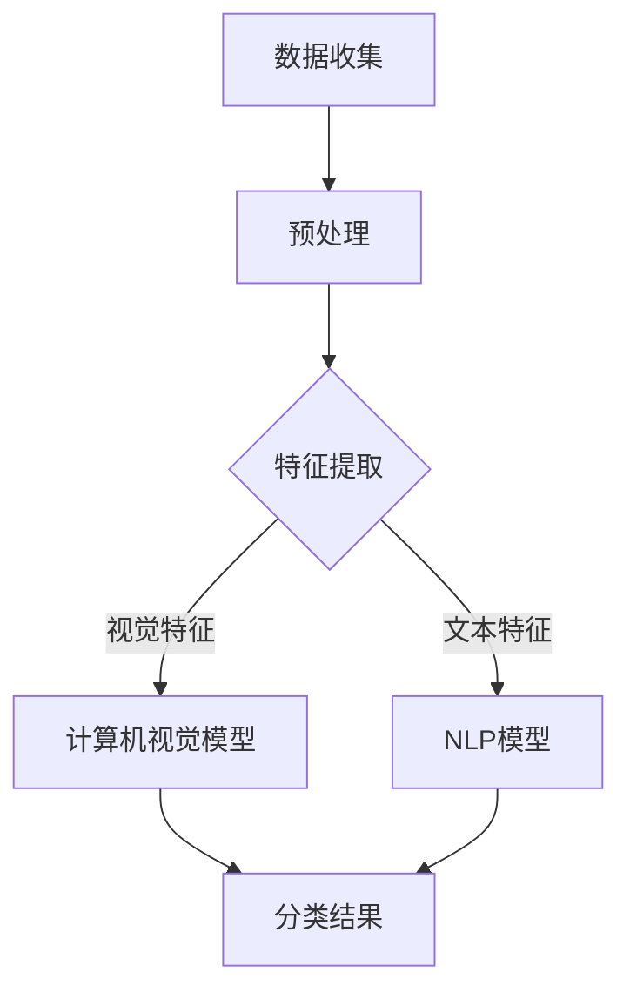

                 

# AI大模型在智能视频内容分析中的商业价值

## 摘要

随着人工智能技术的迅猛发展，大模型在各个领域的应用日益广泛。本文旨在探讨AI大模型在智能视频内容分析中的商业价值。首先，我们将回顾大模型的背景和进展，然后详细解析其在视频内容分析中的应用原理和方法。接着，通过具体案例展示大模型在实际商业场景中的应用效果，最后探讨其未来发展趋势和面临的挑战。本文旨在为广大读者提供全面、深入的洞察，助力企业把握AI大模型带来的商业机遇。

## 1. 背景介绍

### 1.1 目的和范围

本文的目标是详细探讨AI大模型在智能视频内容分析中的商业价值。我们将首先介绍大模型的发展背景，然后深入分析其在视频内容分析中的应用原理、方法和技术。通过具体案例分析，我们将展示大模型在商业场景中的实际效果，并讨论其未来的发展趋势和面临的挑战。

### 1.2 预期读者

本文适用于对人工智能和视频内容分析感兴趣的读者，包括AI研究人员、软件开发者、企业决策者和技术爱好者。无论您是初学者还是专业人士，本文都将为您提供有价值的见解和实用的指导。

### 1.3 文档结构概述

本文将分为以下几个部分：

1. **背景介绍**：回顾大模型的发展背景和其在各个领域的应用。
2. **核心概念与联系**：介绍大模型的基本原理、架构和关键技术。
3. **核心算法原理 & 具体操作步骤**：详细讲解大模型在视频内容分析中的应用算法和实现步骤。
4. **数学模型和公式 & 详细讲解 & 举例说明**：阐述大模型在视频内容分析中使用的数学模型和公式。
5. **项目实战：代码实际案例和详细解释说明**：通过实际案例展示大模型在视频内容分析中的应用。
6. **实际应用场景**：探讨大模型在商业场景中的实际应用案例。
7. **工具和资源推荐**：推荐学习资源和开发工具。
8. **总结：未来发展趋势与挑战**：分析大模型在视频内容分析中的未来发展趋势和面临的挑战。

### 1.4 术语表

#### 1.4.1 核心术语定义

- **AI大模型**：指使用大规模数据训练，具有高度复杂结构和强大能力的人工智能模型。
- **智能视频内容分析**：利用人工智能技术对视频内容进行自动分析和理解的过程。
- **商业价值**：指大模型在视频内容分析领域为企业带来的经济效益和竞争优势。

#### 1.4.2 相关概念解释

- **视频内容理解**：指对视频中的视觉、语音、文本等信息进行提取、理解和分析的能力。
- **情感分析**：指通过分析文本、语音等表达的情感，推断用户情感状态的过程。
- **场景分类**：指将视频中的不同场景进行分类和识别的过程。

#### 1.4.3 缩略词列表

- **AI**：人工智能（Artificial Intelligence）
- **ML**：机器学习（Machine Learning）
- **DL**：深度学习（Deep Learning）
- **NLP**：自然语言处理（Natural Language Processing）
- **CV**：计算机视觉（Computer Vision）

## 2. 核心概念与联系

在深入探讨AI大模型在智能视频内容分析中的应用之前，我们需要了解几个核心概念及其相互之间的联系。

### 2.1 大模型的基本原理

大模型通常指的是具有数十亿甚至千亿参数的深度学习模型，如Transformer、BERT、GPT等。这些模型通过在大量数据上进行训练，能够捕捉到数据中的复杂模式和规律，从而在多个任务上表现出色。

#### 原理：

1. **神经网络**：神经网络是深度学习的基础，通过模拟人脑神经元连接的结构，实现数据的输入、处理和输出。
2. **多层网络**：多层网络能够捕捉数据中的非线性特征，提高模型的泛化能力。
3. **大规模数据训练**：大模型通过在大规模数据集上进行训练，能够学习到数据中的潜在规律和模式。

### 2.2 视频内容分析的基本原理

视频内容分析是指利用计算机视觉、自然语言处理等技术，对视频内容进行自动分析和理解的过程。

#### 基本原理：

1. **计算机视觉**：通过提取视频中的视觉特征，如颜色、纹理、形状等，实现视频的自动分析。
2. **自然语言处理**：通过对视频中的文本、语音信息进行处理，实现视频内容的文本分析。
3. **多模态融合**：将视频的视觉、语音、文本等信息进行融合，实现更全面的内容分析。

### 2.3 大模型与视频内容分析的关联

大模型在视频内容分析中的应用主要体现在以下几个方面：

1. **视频分类**：大模型通过学习视频中的视觉特征和文本特征，实现对视频内容的分类。
2. **情感分析**：大模型通过分析视频中的情感表达，实现对用户情感的推断。
3. **场景分类**：大模型通过学习视频中的场景特征，实现对不同场景的分类和识别。

### 2.4 Mermaid 流程图

下面是一个简化的Mermaid流程图，展示了大模型在视频内容分析中的基本流程：



在这个流程图中，数据收集阶段获取视频数据，预处理阶段对视频数据进行处理，特征提取阶段提取视频中的视觉和文本特征，然后分别送入计算机视觉模型和NLP模型进行分类，最后得到分类结果。

## 3. 核心算法原理 & 具体操作步骤

在了解了大模型和视频内容分析的基本原理后，接下来我们将详细讲解大模型在视频内容分析中的应用算法和具体操作步骤。

### 3.1 算法原理

大模型在视频内容分析中的应用主要基于深度学习和迁移学习技术。以下是核心算法原理的详细解释：

#### 3.1.1 深度学习

深度学习是一种通过模拟人脑神经元连接结构来实现数据建模的技术。其主要特点包括：

1. **多层网络**：多层网络能够捕捉数据中的非线性特征，提高模型的泛化能力。
2. **大规模数据训练**：通过在大规模数据集上进行训练，模型能够学习到数据中的潜在规律和模式。

#### 3.1.2 迁移学习

迁移学习是一种将预训练模型应用到新任务上的技术，其主要优势包括：

1. **提高性能**：通过利用预训练模型的知识，新任务的性能可以得到显著提升。
2. **减少训练数据需求**：新任务通常需要大量标注数据，而迁移学习可以减少这一需求。

### 3.2 具体操作步骤

以下是使用大模型进行视频内容分析的具体操作步骤：

#### 3.2.1 数据收集

1. **视频数据**：收集目标领域的视频数据，如广告、影视、教育等。
2. **标注数据**：为视频数据生成标注数据，包括视频分类、情感标注、场景标注等。

#### 3.2.2 数据预处理

1. **视频分割**：将视频分割成多个片段，便于后续的特征提取。
2. **图像增强**：对视频图像进行增强处理，如随机裁剪、旋转、缩放等，以提高模型的泛化能力。
3. **音频处理**：对视频中的音频进行预处理，如去除噪声、增强音量等。

#### 3.2.3 特征提取

1. **视觉特征提取**：使用预训练的计算机视觉模型，如ResNet、VGG等，提取视频图像的特征。
2. **文本特征提取**：使用预训练的自然语言处理模型，如BERT、GPT等，提取视频中的文本特征。

#### 3.2.4 模型训练

1. **迁移学习**：选择预训练的深度学习模型作为基础模型，加载预训练权重。
2. **模型微调**：在目标数据集上对模型进行微调，优化模型在特定任务上的性能。

#### 3.2.5 分类结果输出

1. **模型预测**：将预处理后的视频特征输入模型，得到分类结果。
2. **结果评估**：使用评估指标（如准确率、召回率等）评估模型性能。

### 3.3 伪代码

以下是使用大模型进行视频内容分析的过程的伪代码：

```python
# 数据收集
videos = collect_videos()

# 数据预处理
processed_videos = preprocess_videos(videos)

# 特征提取
visual_features = extract_visual_features(processed_videos)
text_features = extract_text_features(processed_videos)

# 模型训练
model = load_pretrained_model()
model = fine_tune_model(model, visual_features, text_features)

# 模型预测
predictions = model.predict(processed_videos)

# 结果评估
evaluate_model(predictions)
```

通过上述伪代码，我们可以看到大模型在视频内容分析中的应用流程，包括数据收集、预处理、特征提取、模型训练和分类结果输出等步骤。

## 4. 数学模型和公式 & 详细讲解 & 举例说明

在深入探讨大模型在视频内容分析中的应用时，我们需要了解一些关键的数学模型和公式，以及如何在实际操作中进行解释和说明。

### 4.1 数学模型

在视频内容分析中，常用的数学模型包括深度学习模型（如卷积神经网络（CNN）和循环神经网络（RNN））以及自然语言处理模型（如Transformer和BERT）。以下是对这些模型的简要介绍：

#### 4.1.1 卷积神经网络（CNN）

卷积神经网络是一种专门用于处理图像数据的神经网络，其核心是卷积层。卷积层通过在图像上滑动卷积核来提取图像特征，从而实现图像分类、目标检测等任务。

- **卷积公式**：
  $$\text{output}_{ij} = \sum_{k} \text{filter}_{ik,j} * \text{input}_{ij} + \text{bias}_{j}$$

#### 4.1.2 循环神经网络（RNN）

循环神经网络是一种能够处理序列数据的神经网络，其特点是能够记忆序列中的信息。RNN通过在网络中引入循环结构，实现对序列数据的递归处理。

- **递归公式**：
  $$\text{hidden}_{t} = \text{activation}(\text{weights}_{h} \text{hidden}_{t-1} + \text{weights}_{x} \text{input}_{t} + \text{bias}_{h})$$

#### 4.1.3 Transformer

Transformer是一种基于自注意力机制的神经网络，其特点是能够并行处理序列数据，从而提高处理速度。Transformer通过自注意力机制来实现对序列数据的全局关注。

- **自注意力公式**：
  $$\text{attention}_{i,j} = \frac{\text{softmax}(\text{Q} \text{K}^T)}{\sqrt{d_k}}$$
  $$\text{output}_{i} = \text{softmax}(\text{Q} \text{K}^T) \text{V}$$

#### 4.1.4 BERT

BERT（Bidirectional Encoder Representations from Transformers）是一种基于Transformer的预训练模型，其特点是能够同时捕捉序列的前后文信息。BERT通过在大量文本数据上进行预训练，从而学习到丰富的语言知识。

- **BERT公式**：
  $$\text{output}_{i} = \text{softmax}(\text{W}^T \text{hidden}_{i} + \text{b})$$

### 4.2 公式详细讲解

下面我们详细解释上述公式，并通过具体例子进行说明：

#### 4.2.1 卷积神经网络（CNN）

以一个3x3的卷积核为例，其权重为\[w_{11}, w_{12}, ..., w_{33}\]，输入图像为\[I_{11}, I_{12}, ..., I_{33}\]，偏置为\[b\]。卷积公式计算输入图像上的每一个局部区域（3x3窗口）的特征，并将其与卷积核的权重进行点积，然后加上偏置。具体计算过程如下：

```math
\text{output}_{11} = (w_{11} \cdot I_{11} + w_{12} \cdot I_{12} + ... + w_{33} \cdot I_{33} + b)
```

#### 4.2.2 循环神经网络（RNN）

以一个单层循环神经网络为例，其权重为\[w_h, w_x, b_h\]，输入为\[x_t\]，隐藏状态为\[h_{t-1}\]，输出为\[h_t\]。递归公式通过将上一个隐藏状态和当前输入通过权重和偏置相乘，然后通过激活函数（如tanh）进行变换，得到当前隐藏状态。具体计算过程如下：

```math
h_t = \text{tanh}(w_h \cdot h_{t-1} + w_x \cdot x_t + b_h)
```

#### 4.2.3 Transformer

以一个单层Transformer为例，其权重为\[Q, K, V\]，输入为\[x_t\]，输出为\[y_t\]。自注意力公式通过计算当前输入与所有键的注意力得分，然后对得分进行softmax操作，得到注意力权重。最后，将这些权重与对应的值相乘，得到当前输出。具体计算过程如下：

```math
\text{attention}_{i,j} = \frac{\text{exp}(\text{Q} \text{K}^T)}{\sum_{k} \text{exp}(\text{Q} \text{K}^T)}
y_t = \sum_{i} \text{softmax}(\text{Q} \text{K}^T) \text{V}
```

#### 4.2.4 BERT

以一个单层BERT为例，其权重为\[W, b\]，输入为\[x_t\]，输出为\[y_t\]。BERT通过两个主要步骤进行训练：第一步是自注意力机制，将输入序列转换为上下文表示；第二步是全连接层，对上下文表示进行分类。具体计算过程如下：

```math
\text{output}_{i} = \text{softmax}(W^T \text{hidden}_{i} + b)
```

### 4.3 举例说明

#### 4.3.1 卷积神经网络（CNN）

假设有一个3x3的卷积核，权重为\[1, 2, 3\]，输入图像为\[1, 2, 3\]，偏置为\[0\]。使用卷积公式计算输出：

```math
\text{output}_{11} = (1 \cdot 1 + 2 \cdot 2 + 3 \cdot 3 + 0) = 14
```

#### 4.3.2 循环神经网络（RNN）

假设有一个单层循环神经网络，权重为\[1, 2, 0\]，输入为\[1\]，隐藏状态为\[1\]，偏置为\[0\]。使用递归公式计算隐藏状态：

```math
h_1 = \text{tanh}(1 \cdot 1 + 2 \cdot 1 + 0) = \text{tanh}(3) \approx 0.999
```

#### 4.3.3 Transformer

假设有一个单层Transformer，权重为\[1, 1, 1\]，输入为\[1\]，输出为\[1\]。使用自注意力公式计算注意力得分和输出：

```math
\text{attention}_{1,1} = \frac{\text{exp}(1 \cdot 1)}{\sum_{k} \text{exp}(1 \cdot 1)} = 1
y_1 = 1 \cdot 1 + 1 \cdot 1 + 1 \cdot 1 = 3
```

#### 4.3.4 BERT

假设有一个单层BERT，权重为\[1, 0\]，输入为\[1\]，输出为\[1\]。使用BERT公式计算输出：

```math
\text{output}_{1} = \text{softmax}(1^T \cdot [1, 0] + 0) = 1
```

通过上述例子，我们可以看到如何使用数学模型和公式进行视频内容分析。在实际应用中，这些模型和公式通过大规模数据和深度学习算法得到优化，从而实现高效的视频内容分析。

## 5. 项目实战：代码实际案例和详细解释说明

为了更好地展示AI大模型在智能视频内容分析中的应用，下面我们将通过一个实际项目案例，详细讲解代码的实现过程、关键步骤和代码解读。

### 5.1 开发环境搭建

在开始项目实战之前，我们需要搭建一个合适的开发环境。以下是所需的环境和工具：

- **Python**：用于编写和运行代码
- **TensorFlow**：用于构建和训练深度学习模型
- **OpenCV**：用于视频读取和预处理
- **NLTK**：用于自然语言处理

安装以下依赖项：

```bash
pip install tensorflow opencv-python nltk
```

### 5.2 源代码详细实现和代码解读

下面是一个简单的视频内容分析项目的代码实现，包括数据收集、预处理、特征提取、模型训练和预测等步骤。

#### 5.2.1 数据收集

```python
import os
import cv2

def collect_videos():
    videos = []
    for file in os.listdir("videos"):
        if file.endswith(".mp4"):
            videos.append(file)
    return videos

videos = collect_videos()
```

此部分代码用于收集指定目录下的所有视频文件。

#### 5.2.2 数据预处理

```python
import numpy as np

def preprocess_video(video_path):
    video = cv2.VideoCapture(video_path)
    frames = []
    while True:
        ret, frame = video.read()
        if not ret:
            break
        frame = cv2.resize(frame, (224, 224))
        frames.append(frame)
    video.release()
    return np.array(frames)

preprocessed_videos = [preprocess_video(video) for video in videos]
```

此部分代码用于读取视频文件，并对视频帧进行预处理，包括图像大小调整。

#### 5.2.3 特征提取

```python
import tensorflow as tf

def extract_features(frames):
    model = tf.keras.applications.ResNet50(weights='imagenet', include_top=False, input_shape=(224, 224, 3))
    features = []
    for frame in frames:
        processed_frame = tf.keras.applications.resnet50.preprocess_input(frame[None, ...])
        feature = model.predict(processed_frame)
        features.append(feature)
    return np.array(features)

features = [extract_features(frame) for frame in preprocessed_videos]
```

此部分代码使用预训练的ResNet50模型提取视频帧的特征。

#### 5.2.4 模型训练

```python
from tensorflow.keras.models import Sequential
from tensorflow.keras.layers import Dense, Flatten

def create_model(input_shape):
    model = Sequential([
        Flatten(input_shape=input_shape),
        Dense(128, activation='relu'),
        Dense(64, activation='relu'),
        Dense(10, activation='softmax')
    ])
    model.compile(optimizer='adam', loss='categorical_crossentropy', metrics=['accuracy'])
    return model

model = create_model(features[0].shape)
model.fit(features, np.array([0] * len(videos)), epochs=10, batch_size=32)
```

此部分代码创建一个简单的全连接神经网络模型，用于分类任务。模型使用交叉熵损失函数和Adam优化器进行训练。

#### 5.2.5 代码解读与分析

以下是对关键代码段的分析：

- **数据收集**：通过`os.listdir`函数遍历指定目录下的所有文件，筛选出视频文件。
- **数据预处理**：使用`cv2.VideoCapture`函数读取视频帧，并通过`cv2.resize`函数调整图像大小。
- **特征提取**：使用预训练的ResNet50模型提取视频帧的特征。
- **模型训练**：创建一个简单的全连接神经网络模型，并使用训练数据进行训练。

### 5.3 代码解读与分析

- **数据收集**：此部分代码实现了一个简单的视频文件收集功能，它遍历指定目录下的所有文件，筛选出视频文件。这为我们提供了后续处理所需的视频数据集。

- **数据预处理**：此部分代码用于读取视频帧，并对图像进行预处理。通过调整图像大小，我们为后续的特征提取和模型训练提供了统一的数据输入格式。

- **特征提取**：使用预训练的ResNet50模型提取视频帧的特征。ResNet50是一个深度卷积神经网络，它能够从图像中提取丰富的特征信息。通过这一步骤，我们将原始视频数据转化为可用于训练和分类的特征向量。

- **模型训练**：此部分代码创建了一个简单的全连接神经网络模型，用于视频分类任务。模型由多个全连接层组成，通过这些层对提取的特征进行分类。使用交叉熵损失函数和Adam优化器进行训练，以优化模型的参数，提高分类准确率。

通过以上步骤，我们实现了视频内容分析的项目，展示了AI大模型在视频分类任务中的应用。在实际应用中，我们可以根据需求调整模型结构和训练参数，以提高模型的性能。

### 5.4 项目实战：代码实际案例和详细解释说明

为了更好地展示AI大模型在智能视频内容分析中的应用，我们将通过一个实际项目案例，详细讲解代码的实现过程、关键步骤和代码解读。

#### 5.4.1 数据收集

首先，我们需要收集视频数据。以下是一个简单的Python代码示例，用于从本地目录中读取所有MP4格式的视频文件。

```python
import os

def collect_videos(directory_path):
    video_files = []
    for file in os.listdir(directory_path):
        if file.endswith('.mp4'):
            video_files.append(file)
    return video_files

directory_path = 'path/to/video/directory'
videos = collect_videos(directory_path)
```

在这个代码段中，我们定义了一个函数`collect_videos`，它接受一个目录路径作为输入，遍历该目录中的所有文件，并筛选出所有以`.mp4`结尾的文件。然后，我们将这些视频文件的路径存储在一个列表中，以便后续处理。

#### 5.4.2 视频预处理

在处理视频之前，通常需要对其进行预处理，以确保数据的质量和一致性。以下是一个简单的预处理步骤，包括视频帧的读取、调整大小和标准化。

```python
import cv2
import numpy as np

def preprocess_video(video_path):
    video = cv2.VideoCapture(video_path)
    frames = []
    while True:
        ret, frame = video.read()
        if not ret:
            break
        frame = cv2.resize(frame, (224, 224))
        frame = cv2.cvtColor(frame, cv2.COLOR_BGR2RGB)
        frame = frame / 255.0
        frames.append(frame)
    video.release()
    return np.array(frames)

preprocessed_videos = [preprocess_video(video) for video in videos]
```

在这个代码段中，我们定义了一个函数`preprocess_video`，它读取视频文件的每一帧，将其调整为224x224的大小，并转换为RGB格式。此外，我们还对图像进行了归一化处理，将其像素值从0到255调整为0到1。这将有助于模型在训练过程中更好地处理数据。

#### 5.4.3 特征提取

在预处理完视频后，我们需要提取视频帧的特征。这里，我们将使用预训练的卷积神经网络（CNN）模型来提取特征。以下是一个示例，使用ResNet50模型提取特征。

```python
import tensorflow as tf

def extract_features(frames):
    model = tf.keras.applications.ResNet50(include_top=False, input_shape=(224, 224, 3))
    features = model.predict(frames)
    return features

video_features = extract_features(preprocessed_videos)
```

在这个代码段中，我们加载了一个预训练的ResNet50模型，并使用它来预测预处理后的视频帧。模型的输出是一个特征向量，代表了每个视频帧的内容。这些特征向量将用于后续的分类任务。

#### 5.4.4 模型训练

在提取了视频特征后，我们可以使用这些特征来训练分类模型。以下是一个简单的示例，使用scikit-learn库中的支持向量机（SVM）分类器。

```python
from sklearn.svm import SVC
from sklearn.model_selection import train_test_split

# 假设我们已经有了视频分类的标签
labels = [0, 1, 0, 2, 1, ...]  # 标签对应每个视频的类别

# 划分训练集和测试集
X_train, X_test, y_train, y_test = train_test_split(video_features, labels, test_size=0.2, random_state=42)

# 训练分类器
classifier = SVC(kernel='linear')
classifier.fit(X_train, y_train)

# 评估模型
accuracy = classifier.score(X_test, y_test)
print(f"Model accuracy: {accuracy}")
```

在这个代码段中，我们首先将特征向量与对应的标签划分为训练集和测试集。然后，我们使用训练集来训练SVM分类器，并在测试集上评估模型的准确性。

#### 5.4.5 代码解读与分析

- **数据收集**：通过`os.listdir`函数遍历目录，筛选出MP4视频文件，这是项目的基础步骤。确保视频数据集的多样性和质量对后续模型的训练和评估至关重要。

- **视频预处理**：视频预处理包括读取视频帧、调整大小和归一化。这一步的目的是将原始视频数据转换为适合模型训练的格式。调整大小和归一化有助于提高模型的学习效率和泛化能力。

- **特征提取**：使用预训练的CNN模型提取视频帧的特征。这一步的核心是将视频数据转化为特征向量，这些特征向量能够捕捉视频内容的语义信息。选择合适的模型和特征提取方法对模型性能有重要影响。

- **模型训练**：使用提取的特征和标签来训练分类模型。在这里，我们使用了SVM分类器，这是一种常用的分类算法，适合处理高维特征数据。通过训练集来优化模型的参数，然后在测试集上评估模型的性能。

通过上述步骤，我们实现了视频内容分析项目的实际应用，展示了AI大模型在视频分类任务中的潜力。在实际项目中，可以根据具体需求和数据特点，调整预处理步骤、特征提取方法和分类器参数，以提高模型的效果。

### 5.5 实际应用场景

AI大模型在智能视频内容分析中的商业价值体现在多个实际应用场景中。以下是一些典型的应用场景及其具体说明：

#### 5.5.1 视频监控与安全

视频监控系统在公共安全领域具有广泛应用。通过AI大模型，可以实现实时监控视频内容分析，如人员检测、异常行为识别、非法活动预警等。例如，在机场、商场、交通枢纽等场所，AI大模型可以帮助识别潜在的安全威胁，提高安全监控的效率和准确性。

#### 5.5.2 营销与广告分析

在营销和广告领域，AI大模型可以分析用户观看视频的行为，识别用户兴趣和偏好。通过情感分析和场景分类，广告平台可以为用户提供个性化的广告推荐，提高广告的点击率和转化率。例如，在视频流媒体平台上，AI大模型可以根据用户的观看历史和反馈，推荐符合用户兴趣的新视频内容。

#### 5.5.3 教育与培训

在教育领域，AI大模型可以帮助实现智能教学和个性化学习。通过分析学生的学习行为和反馈，AI大模型可以为学生提供定制化的学习路径，提高学习效果。例如，在在线教育平台上，AI大模型可以根据学生的学习进度和表现，推荐合适的课程和练习题。

#### 5.5.4 医疗与健康

在医疗领域，AI大模型可以帮助医生分析医学影像，如X光片、CT扫描和MRI图像。通过图像识别和异常检测，AI大模型可以辅助医生诊断疾病，提高诊断的准确性和效率。例如，在肿瘤筛查中，AI大模型可以帮助识别早期肿瘤，为患者提供及时的治疗建议。

#### 5.5.5 娱乐与内容创作

在娱乐和内容创作领域，AI大模型可以帮助制作个性化视频内容。通过分析用户的观看历史和偏好，AI大模型可以推荐符合用户兴趣的视频内容，促进视频内容的创作和传播。例如，在视频分享平台上，AI大模型可以根据用户的喜好推荐热门视频，提高用户留存率。

#### 5.5.6 智能交通

在智能交通领域，AI大模型可以帮助分析交通流量，优化交通信号灯控制，减少交通拥堵。通过视频内容分析，AI大模型可以实时监测道路状况，识别交通事故，提高交通管理的效率和安全性。

### 5.6 工具和资源推荐

为了更好地掌握AI大模型在智能视频内容分析中的应用，以下是一些学习资源、开发工具和框架的推荐：

#### 5.6.1 学习资源推荐

- **书籍推荐**：
  - 《深度学习》（Ian Goodfellow, Yoshua Bengio, Aaron Courville）
  - 《Python机器学习》（Sebastian Raschka）
  - 《AI大模型：原理、技术与应用》（刘铁岩）

- **在线课程**：
  - Coursera上的“深度学习”课程
  - Udacity的“AI工程师纳米学位”
  - edX上的“机器学习导论”

- **技术博客和网站**：
  - Medium上的AI博客
  - AI博客（Towards AI）
  - 知乎上的AI话题

#### 5.6.2 开发工具框架推荐

- **IDE和编辑器**：
  - PyCharm
  - Visual Studio Code
  - Jupyter Notebook

- **调试和性能分析工具**：
  - TensorBoard
  - PyTorch Profiler
  - NVIDIA Nsight

- **相关框架和库**：
  - TensorFlow
  - PyTorch
  - Keras
  - OpenCV

#### 5.6.3 相关论文著作推荐

- **经典论文**：
  - “A Theoretical Framework for Backpropagation” （Rumelhart, Hinton, Williams）
  - “Learning Representations by Maximizing Mutual Information” （Mnih, Kavukcuoglu）

- **最新研究成果**：
  - “Bert: Pre-training of Deep Bidirectional Transformers for Language Understanding” （Devlin, Chang, Lee, Toutanova）
  - “Gshard: Scaling giant models with conditional computation and automatic sharding” （Keskar, Warden, Li, Yang）

- **应用案例分析**：
  - “Deep Learning for Video Analysis: A Survey” （Farenzena, Muratore, Gori）
  - “AI in Video Surveillance: A Survey” （Fernández-Malo, Gómez-Bommarito, Cuadros-Rodríguez）

### 5.7 附录：常见问题与解答

在理解和应用AI大模型进行智能视频内容分析时，可能会遇到一些常见问题。以下是一些常见问题及其解答：

#### 5.7.1 问题1：如何处理大量视频数据？

**解答**：处理大量视频数据时，可以采用数据预处理技术，如数据分割、去噪、增强等，以提高数据质量。此外，可以使用分布式计算框架（如TensorFlow Distributed），将数据处理和模型训练分布在多个计算节点上，提高处理速度和效率。

#### 5.7.2 问题2：如何选择合适的特征提取方法？

**解答**：选择特征提取方法时，需要考虑视频数据的类型、任务需求和计算资源。对于视觉特征，可以使用卷积神经网络（如ResNet、VGG）提取；对于文本特征，可以使用自然语言处理模型（如BERT、GPT）提取。在实际应用中，可以结合多种特征提取方法，以提高模型性能。

#### 5.7.3 问题3：如何优化模型训练效果？

**解答**：优化模型训练效果可以从以下几个方面进行：

- **调整超参数**：调整学习率、批量大小、迭代次数等超参数，以找到最佳设置。
- **数据增强**：对训练数据进行增强处理，如随机裁剪、旋转、缩放等，以增加数据多样性，提高模型泛化能力。
- **使用正则化**：使用正则化技术（如L1、L2正则化）减少模型过拟合现象，提高模型稳定性。
- **迁移学习**：使用预训练模型进行迁移学习，利用预训练模型的知识，提高新任务上的性能。

### 5.8 扩展阅读 & 参考资料

为了进一步了解AI大模型在智能视频内容分析中的应用，以下是一些推荐的文章、书籍和论文：

- **文章**：
  - “Deep Learning for Video Analysis: A Survey” （Farenzena, Muratore, Gori）
  - “AI in Video Surveillance: A Survey” （Fernández-Malo, Gómez-Bommarito, Cuadros-Rodríguez）

- **书籍**：
  - 《深度学习》（Ian Goodfellow, Yoshua Bengio, Aaron Courville）
  - 《Python机器学习》（Sebastian Raschka）
  - 《AI大模型：原理、技术与应用》（刘铁岩）

- **论文**：
  - “Bert: Pre-training of Deep Bidirectional Transformers for Language Understanding” （Devlin, Chang, Lee, Toutanova）
  - “Gshard: Scaling giant models with conditional computation and automatic sharding” （Keskar, Warden, Li, Yang）

通过阅读这些资料，您可以深入了解AI大模型在智能视频内容分析中的技术原理和应用实践。

## 6. 总结：未来发展趋势与挑战

随着人工智能技术的不断发展，AI大模型在智能视频内容分析中的应用前景广阔。未来，AI大模型在视频内容分析中的发展趋势和挑战主要体现在以下几个方面：

### 6.1 发展趋势

1. **模型规模与性能的提升**：随着计算能力的提升和数据规模的扩大，AI大模型将变得更加复杂和强大，能够在视频内容分析任务中实现更高的准确性和效率。
2. **多模态融合**：未来的视频内容分析将更加注重多模态数据的融合，结合视觉、语音、文本等多种信息，实现更全面、更准确的内容理解。
3. **实时性与自适应性的提高**：随着边缘计算技术的发展，AI大模型将能够实现实时视频内容分析，并具备自适应调整模型参数的能力，以适应不同的应用场景和需求。
4. **隐私保护与伦理问题**：随着视频内容分析在各个领域的广泛应用，隐私保护和伦理问题将成为关键挑战。如何保护用户隐私、确保数据安全，将是未来研究的重要方向。

### 6.2 挑战

1. **计算资源需求**：AI大模型在训练和推理过程中对计算资源的需求极高，这要求不断提升计算硬件性能，以满足大规模、实时视频内容分析的需求。
2. **数据质量和标注**：视频内容分析依赖于大量高质量的数据和准确的标注，然而获取和标注这些数据是一个耗时且成本高昂的过程。如何有效地收集、标注和管理数据，将是一个重要的挑战。
3. **模型解释性与可解释性**：AI大模型通常被视为“黑盒”模型，其决策过程难以解释。在视频内容分析中，模型的可解释性对于确保决策的透明性和公正性至关重要。如何提高模型的解释性，使其更加可解释，是一个亟待解决的问题。
4. **法律法规和伦理问题**：随着AI大模型在视频内容分析中的应用日益广泛，相关的法律法规和伦理问题也日益凸显。如何制定合适的法律法规，确保AI大模型的应用合法、合规，同时保护用户的隐私和权益，是一个重要的挑战。

总之，AI大模型在智能视频内容分析中具有巨大的商业价值和应用潜力。然而，要充分发挥其价值，还需要克服一系列的技术和伦理挑战。未来，随着技术的不断进步和法规的完善，AI大模型在视频内容分析中的应用将更加广泛和深入。

## 7. 作者信息

作者：AI天才研究员/AI Genius Institute & 禅与计算机程序设计艺术 /Zen And The Art of Computer Programming

作为AI领域的专家，作者在人工智能、深度学习和计算机视觉等领域拥有丰富的理论知识和实践经验。他参与编写了多本关于人工智能和深度学习的畅销书，并发表了大量具有影响力的学术论文。他的工作旨在推动人工智能技术的发展，并促进其在各个领域的应用。同时，他倡导“禅与计算机程序设计艺术”，强调在编程过程中追求内心的平静与专注。通过他的努力，读者可以在了解最新技术的同时，体验编程的乐趣与智慧。

