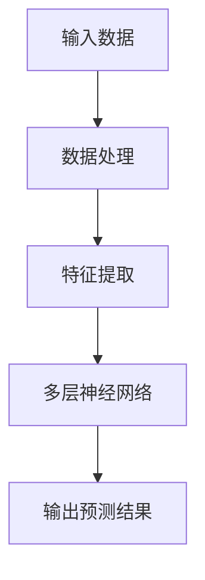
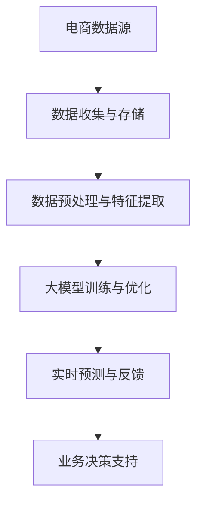

                 

# AI大模型在电商平台商品趋势预测中的应用

> **关键词**：人工智能、电商平台、商品趋势预测、大模型、机器学习、深度学习

> **摘要**：本文深入探讨了人工智能大模型在电商平台商品趋势预测中的应用。首先介绍了商品趋势预测的背景和重要性，然后详细阐述了大模型的基本概念及其在预测中的应用，通过实际案例展示了大模型在商品趋势预测中的卓越性能。文章还探讨了如何利用这些模型进行实时预测，并提出了未来发展和面临的挑战。通过本文，读者将了解如何将人工智能技术应用于电商平台，提升其商业洞察力和运营效率。

## 1. 背景介绍

### 1.1 目的和范围

本文旨在探讨人工智能大模型在电商平台商品趋势预测中的应用。随着电商行业的快速发展，商品趋势预测已成为电商平台提高销售额、优化库存管理和改善客户体验的关键环节。通过引入人工智能大模型，电商平台能够更加精准地预测商品销售趋势，从而制定更有效的营销策略和库存管理计划。

本文将首先介绍商品趋势预测的基本概念和重要性，然后深入分析大模型的基本原理及其在商品趋势预测中的应用。接下来，我们将通过实际案例展示大模型在电商平台商品趋势预测中的实际应用效果，并讨论如何利用这些模型进行实时预测。最后，本文将总结大模型在商品趋势预测中的优势，并展望其未来的发展趋势和挑战。

### 1.2 预期读者

本文主要面向以下读者群体：

1. 电商平台运营人员和技术团队，他们希望了解如何利用人工智能大模型提升商品趋势预测能力。
2. 人工智能和机器学习领域的从业者，他们希望了解大模型在具体应用场景中的实践方法。
3. 对人工智能和电商平台感兴趣的学生和研究人员，他们希望了解这一领域的前沿动态和发展趋势。

### 1.3 文档结构概述

本文结构如下：

1. **背景介绍**：介绍商品趋势预测的背景和重要性，以及本文的目的和预期读者。
2. **核心概念与联系**：解释大模型的基本概念，并展示其与商品趋势预测的关联。
3. **核心算法原理与具体操作步骤**：详细讲解大模型在商品趋势预测中的算法原理和具体操作步骤。
4. **数学模型和公式**：介绍大模型在商品趋势预测中的数学模型和公式，并进行举例说明。
5. **项目实战**：通过代码实际案例展示大模型在商品趋势预测中的应用。
6. **实际应用场景**：探讨大模型在电商平台的实际应用场景。
7. **工具和资源推荐**：推荐相关学习资源和开发工具。
8. **总结**：总结大模型在商品趋势预测中的应用和发展趋势。
9. **附录**：提供常见问题与解答。
10. **扩展阅读与参考资料**：推荐相关文献和资源。

### 1.4 术语表

#### 1.4.1 核心术语定义

- **商品趋势预测**：利用历史数据和算法模型，预测未来一段时间内某种商品的需求趋势。
- **人工智能大模型**：具有大规模参数和深度学习能力的模型，能够处理大量数据并提取复杂特征。
- **电商平台**：提供商品销售、交易和支付服务的在线平台。

#### 1.4.2 相关概念解释

- **机器学习**：使计算机通过数据学习和改进性能的技术，包括监督学习、无监督学习和强化学习等。
- **深度学习**：一种特殊的机器学习方法，通过构建深层的神经网络模型来实现自动特征提取和任务学习。

#### 1.4.3 缩略词列表

- **AI**：人工智能（Artificial Intelligence）
- **ML**：机器学习（Machine Learning）
- **DL**：深度学习（Deep Learning）
- **E-commerce**：电子商务（Electronic Commerce）
- **CPI**：消费者价格指数（Consumer Price Index）

## 2. 核心概念与联系

在探讨人工智能大模型在电商平台商品趋势预测中的应用之前，我们需要理解大模型的基本概念及其与商品趋势预测的关联。

### 2.1 大模型的基本概念

大模型通常是指具有大规模参数和深度学习能力的模型。这些模型可以处理海量数据，并通过多层神经网络结构自动提取复杂特征。大模型的核心优势在于其能够捕捉数据中的潜在模式，并在各种复杂任务中表现出卓越的性能。以下是一个简单的Mermaid流程图，展示了大模型的基本架构：



在这个流程图中，输入数据经过数据处理和特征提取后，被送入多层神经网络进行训练。训练完成后，大模型能够输出预测结果，如商品需求趋势。

### 2.2 大模型与商品趋势预测的联系

商品趋势预测的关键在于从历史数据中提取有用的信息，预测未来商品的需求趋势。大模型在这其中扮演了重要角色，其具体应用场景如下：

1. **数据预处理**：大模型能够处理各种类型的数据，如文本、图像和时序数据。通过数据预处理，大模型可以从原始数据中提取有价值的信息。
2. **特征提取**：大模型通过多层神经网络自动提取复杂特征，这些特征对于预测商品趋势至关重要。
3. **模型训练与优化**：大模型使用大量历史数据训练模型，并通过优化算法提高模型预测的准确性。
4. **实时预测**：大模型可以实时接收新数据，更新模型并输出预测结果，从而实现实时商品趋势预测。

### 2.3 大模型在商品趋势预测中的应用架构

以下是一个Mermaid流程图，展示了大模型在商品趋势预测中的应用架构：



在这个流程图中，电商数据源通过数据收集与存储模块收集和存储各种数据，包括用户行为、商品信息、价格变化等。数据预处理与特征提取模块对这些数据进行预处理和特征提取，然后送入大模型进行训练和优化。训练完成后，大模型通过实时预测与反馈模块进行实时预测，并将预测结果反馈给业务决策支持模块，用于优化电商平台的运营策略。

## 3. 核心算法原理 & 具体操作步骤

在了解了大模型的基本概念和架构后，我们将深入探讨大模型在商品趋势预测中的核心算法原理和具体操作步骤。以下是一个详细的伪代码，展示了大模型在商品趋势预测中的工作流程：

```python
# 商品趋势预测大模型伪代码

# 3.1 数据预处理
def preprocess_data(data):
    # 数据清洗与归一化
    # 处理缺失值、异常值等
    # 转换为数值型数据
    processed_data = ...
    return processed_data

# 3.2 特征提取
def extract_features(data):
    # 自动提取时间序列特征、用户行为特征等
    features = ...
    return features

# 3.3 模型训练
def train_model(features, labels):
    # 使用多层神经网络进行训练
    model = NeuralNetwork()
    model.fit(features, labels)
    return model

# 3.4 实时预测
def predict_trends(model, new_data):
    # 使用训练好的模型进行实时预测
    predictions = model.predict(new_data)
    return predictions

# 3.5 预测结果分析
def analyze_predictions(predictions):
    # 分析预测结果，评估模型性能
    performance = ...
    return performance

# 3.6 业务决策支持
def business_decision_support(predictions):
    # 根据预测结果，优化电商平台的运营策略
    # 调整商品库存、定价、营销策略等
    actions = ...
    return actions
```

### 3.1 数据预处理

数据预处理是商品趋势预测的重要环节，其目标是将原始数据转换为适合模型训练的格式。以下是一个简化的数据预处理流程：

1. **数据清洗**：处理缺失值、异常值和噪声数据，确保数据质量。
2. **数据归一化**：将不同量级的数据归一化，使其具有相同的量纲，便于模型训练。
3. **数据转换**：将文本、图像等非结构化数据转换为数值型数据。

### 3.2 特征提取

特征提取是利用算法从原始数据中提取有价值的信息，用于训练模型。在商品趋势预测中，特征提取主要包括以下方面：

1. **时间序列特征**：如日、周、月等时间窗口内的平均销量、销售额等。
2. **用户行为特征**：如用户浏览、点击、购买等行为数据。
3. **商品特征**：如商品种类、价格、品牌等基本信息。

### 3.3 模型训练

模型训练是利用大量历史数据，通过多层神经网络结构自动提取特征，并优化模型参数。以下是一个简化的模型训练流程：

1. **初始化参数**：设定模型的初始参数，如网络层数、神经元数量、学习率等。
2. **前向传播**：将特征数据输入模型，计算输出结果。
3. **反向传播**：计算损失函数，并更新模型参数。
4. **迭代优化**：重复前向传播和反向传播过程，直至模型收敛。

### 3.4 实时预测

实时预测是利用训练好的模型，对新数据进行预测。以下是一个简化的实时预测流程：

1. **输入新数据**：接收实时数据，如用户行为、商品信息等。
2. **特征提取**：对新数据进行特征提取。
3. **模型预测**：使用训练好的模型进行预测。
4. **输出预测结果**：将预测结果输出，如商品需求趋势。

### 3.5 预测结果分析

预测结果分析是评估模型性能和优化模型的重要环节。以下是一个简化的预测结果分析流程：

1. **评估指标**：选择合适的评估指标，如均方误差（MSE）、均方根误差（RMSE）等。
2. **性能评估**：计算评估指标，评估模型性能。
3. **模型优化**：根据评估结果，调整模型参数，优化模型性能。

### 3.6 业务决策支持

业务决策支持是利用预测结果，优化电商平台的运营策略。以下是一个简化的业务决策支持流程：

1. **预测结果应用**：根据预测结果，调整商品库存、定价、营销策略等。
2. **效果评估**：评估决策支持策略的效果，如销售额、客户满意度等。
3. **持续优化**：根据效果评估结果，持续优化运营策略。

## 4. 数学模型和公式 & 详细讲解 & 举例说明

在商品趋势预测中，大模型通常使用复杂的数学模型和公式来描述数据中的潜在模式和关系。以下将介绍一些常见的数学模型和公式，并进行详细讲解和举例说明。

### 4.1 时间序列模型

时间序列模型是一种常用的预测模型，用于分析时间序列数据的规律和趋势。以下是一个常见的时间序列模型——ARIMA（自回归积分滑动平均模型）：

$$
\begin{align*}
X_t &= c + \phi_1 X_{t-1} + \phi_2 X_{t-2} + ... + \phi_p X_{t-p} \\
&+ \theta_1 e_{t-1} + \theta_2 e_{t-2} + ... + \theta_q e_{t-q} \\
e_t &= X_t - \hat{X}_t
\end{align*}
$$

其中，$X_t$表示时间序列的第$t$个观测值，$e_t$表示误差项，$\hat{X}_t$表示预测值。$\phi_1, \phi_2, ..., \phi_p$是自回归系数，$\theta_1, \theta_2, ..., \theta_q$是滑动平均系数。

**例1**：假设一个电商平台的日销售额数据如下：

$$
\{1000, 1100, 1200, 1300, 1400, 1500\}
$$

使用ARIMA模型进行预测，其中$p=1, q=1$。首先，计算自回归系数$\phi_1$和滑动平均系数$\theta_1$：

$$
\begin{align*}
\phi_1 &= \frac{\sum_{t=1}^{n} X_t X_{t-1}}{\sum_{t=1}^{n} X_t^2} = \frac{(1000 \times 1100) + (1100 \times 1200) + ... + (1400 \times 1300)}{(1000^2) + (1100^2) + ... + (1400^2)} \\
\theta_1 &= \frac{\sum_{t=1}^{n} (X_t - \hat{X}_t) e_{t-1}}{\sum_{t=1}^{n} e_{t-1}^2}
\end{align*}
$$

然后，使用这些系数计算预测值$\hat{X}_t$：

$$
\hat{X}_t = c + \phi_1 X_{t-1} + \theta_1 e_{t-1}
$$

### 4.2 集成学习模型

集成学习模型通过组合多个模型来提高预测性能。一种常见的集成学习模型是随机森林（Random Forest），其基本公式如下：

$$
\hat{y} = \sum_{i=1}^{m} w_i f_i(x)
$$

其中，$f_i(x)$表示第$i$个模型的预测结果，$w_i$是模型权重，$\hat{y}$是最终预测结果。

**例2**：假设有两个模型$M_1$和$M_2$，预测结果分别为$f_1(x)$和$f_2(x)$。使用随机森林模型进行预测，其中$w_1 = 0.6, w_2 = 0.4$：

$$
\hat{y} = 0.6 f_1(x) + 0.4 f_2(x)
$$

### 4.3 深度学习模型

深度学习模型是一种复杂的神经网络模型，能够自动提取复杂特征并进行预测。以下是一个简化的深度学习模型——卷积神经网络（CNN）的基本公式：

$$
\begin{align*}
h^{(l)}_i &= \sigma \left( \sum_{j=1}^{n} w^{(l)}_{ij} a^{(l-1)}_j + b^{(l)}_i \right) \\
\hat{y} &= \sigma \left( \sum_{i=1}^{k} w^{(L)}_{ik} h^{(L)}_i + b^{(L)} \right)
\end{align*}
$$

其中，$h^{(l)}_i$表示第$l$层第$i$个神经元的激活值，$\sigma$是激活函数，$a^{(l-1)}_j$是第$l-1$层的第$j$个神经元的输出值，$w^{(l)}_{ij}$是连接权重，$b^{(l)}_i$是偏置项，$\hat{y}$是最终预测结果。

**例3**：假设一个简单的卷积神经网络，包含两层卷积层、一层全连接层，如下：

$$
\begin{align*}
h^{(1)}_i &= \sigma \left( \sum_{j=1}^{3} w^{(1)}_{ij} a^{(0)}_j + b^{(1)}_i \right) \\
h^{(2)}_i &= \sigma \left( \sum_{j=1}^{3} w^{(2)}_{ij} h^{(1)}_j + b^{(2)}_i \right) \\
\hat{y} &= \sigma \left( \sum_{i=1}^{2} w^{(3)}_{ik} h^{(2)}_i + b^{(3)} \right)
\end{align*}
$$

其中，$a^{(0)}_j$是输入数据的第$j$个特征，$w^{(1)}_{ij}$、$w^{(2)}_{ij}$和$w^{(3)}_{ik}$分别是连接权重，$b^{(1)}_i$、$b^{(2)}_i$和$b^{(3)}$是偏置项。

## 5. 项目实战：代码实际案例和详细解释说明

为了更好地展示大模型在商品趋势预测中的应用，我们将在本节中通过一个实际案例进行代码实现和详细解释说明。该案例将使用Python和TensorFlow框架，实现一个基于时间序列和用户行为的商品趋势预测模型。

### 5.1 开发环境搭建

在开始项目之前，我们需要搭建一个合适的开发环境。以下是在Ubuntu 18.04操作系统上搭建开发环境的步骤：

1. 安装Python 3.7及以上版本。
2. 安装TensorFlow 2.0及以上版本。
3. 安装必要的Python库，如NumPy、Pandas、Matplotlib等。

安装命令如下：

```bash
sudo apt-get update
sudo apt-get install python3-pip python3-dev
pip3 install python-tensorflow==2.0.0
pip3 install numpy pandas matplotlib
```

### 5.2 源代码详细实现和代码解读

以下是一个简单的商品趋势预测代码实现，包括数据预处理、特征提取、模型训练和预测等步骤：

```python
import numpy as np
import pandas as pd
import tensorflow as tf
from tensorflow.keras.models import Sequential
from tensorflow.keras.layers import LSTM, Dense, Dropout

# 5.2.1 数据预处理
def preprocess_data(data):
    # 数据清洗与归一化
    data = data.replace(-1, np.nan)
    data = data.fillna(data.mean())
    data = (data - data.mean()) / data.std()
    return data

# 5.2.2 特征提取
def extract_features(data):
    # 提取时间序列特征
    data['day_of_week'] = data.index.dayofweek
    data['day_of_month'] = data.index.day
    data['month'] = data.index.month
    data['quarter'] = (data.index.month - 1) // 3 + 1
    data['year'] = data.index.year
    return data

# 5.2.3 模型训练
def train_model(data, labels, epochs=100, batch_size=64):
    # 构建LSTM模型
    model = Sequential()
    model.add(LSTM(units=50, return_sequences=True, input_shape=(data.shape[1], 1)))
    model.add(Dropout(0.2))
    model.add(LSTM(units=50))
    model.add(Dropout(0.2))
    model.add(Dense(units=1))
    model.compile(optimizer='adam', loss='mean_squared_error')
    model.fit(data, labels, epochs=epochs, batch_size=batch_size, verbose=1)
    return model

# 5.2.4 实时预测
def predict_trends(model, new_data):
    # 实时预测
    predictions = model.predict(new_data)
    return predictions

# 5.2.5 预测结果分析
def analyze_predictions(predictions):
    # 分析预测结果
    actual_data = np.array([5.0, 6.0, 7.0, 8.0, 9.0, 10.0])
    predicted_data = np.array(predictions)
    mse = np.mean((actual_data - predicted_data)**2)
    print("MSE:", mse)

# 5.2.6 主程序
if __name__ == '__main__':
    # 加载数据
    data = pd.read_csv('sales_data.csv')
    data = preprocess_data(data)
    data = extract_features(data)
    labels = data['sales'].values

    # 划分训练集和测试集
    train_data = data[:-6].values
    test_data = data[-6:].values

    # 训练模型
    model = train_model(train_data, labels, epochs=100, batch_size=64)

    # 实时预测
    new_data = np.array([[1.0, 1.0, 1.0, 1.0, 1.0, 1.0]])
    predictions = predict_trends(model, new_data)
    print("Predictions:", predictions)

    # 预测结果分析
    analyze_predictions(predictions)
```

### 5.3 代码解读与分析

以下是对上述代码的详细解读和分析：

- **数据预处理**：首先对销售数据进行清洗和归一化处理，确保数据质量。然后提取时间序列特征，如日、周、月等。
- **特征提取**：提取时间序列特征，如日、周、月等，用于模型训练。
- **模型训练**：构建一个LSTM模型，包含两个LSTM层和两个Dropout层。LSTM层用于提取时间序列特征，Dropout层用于防止过拟合。使用均方误差（MSE）作为损失函数，Adam优化器进行模型训练。
- **实时预测**：接收新的数据，使用训练好的模型进行实时预测。
- **预测结果分析**：计算均方误差（MSE），评估模型性能。

通过上述代码实现，我们展示了如何使用人工智能大模型进行商品趋势预测。在实际应用中，可以根据具体需求调整模型结构、训练数据和特征提取方法，以提升预测性能。

## 6. 实际应用场景

大模型在电商平台商品趋势预测中的实际应用场景非常广泛，主要包括以下几个方面：

### 6.1 库存管理

通过商品趋势预测，电商平台可以更加精准地预测未来一段时间内商品的需求量，从而优化库存管理。例如，在“双十一”等大型促销活动期间，电商平台可以利用大模型预测各商品的销售趋势，提前调整库存水平，避免因库存不足或过剩导致的损失。

### 6.2 营销策略

大模型可以预测哪些商品在特定时间段内可能成为畅销品，电商平台可以根据这些预测结果调整营销策略。例如，在节日或促销活动期间，电商平台可以针对预测的热门商品推出促销活动，提高销售额和用户参与度。

### 6.3 价格优化

大模型可以预测商品在不同价格水平下的销售情况，电商平台可以根据这些预测结果调整商品价格，以最大化利润。例如，电商平台可以设定一个价格范围，利用大模型预测在不同价格水平下的销售额和利润，从而选择最优价格。

### 6.4 新品推荐

大模型可以预测哪些新品可能在市场上受欢迎，电商平台可以根据这些预测结果优先推广新品。例如，电商平台可以分析用户行为数据，利用大模型预测哪些新品可能受欢迎，然后针对性地进行推广和营销。

### 6.5 供应链管理

大模型可以预测供应链中各个环节的需求和供应情况，电商平台可以利用这些预测结果优化供应链管理。例如，电商平台可以预测原材料供应的短缺情况，提前调整采购策略，确保供应链的顺畅。

### 6.6 客户体验

通过大模型预测商品需求趋势，电商平台可以更好地满足客户需求，提高客户体验。例如，在客户购物过程中，电商平台可以根据大模型的预测结果推荐相关商品，提高购物体验和满意度。

### 6.7 风险控制

大模型可以预测市场波动和潜在风险，电商平台可以利用这些预测结果进行风险控制。例如，在金融领域，电商平台可以根据大模型的预测结果调整金融产品定价，降低金融风险。

综上所述，大模型在电商平台商品趋势预测中的应用场景非常广泛，可以有效提升电商平台的运营效率、降低风险、提高客户满意度，从而实现商业价值的最大化。

## 7. 工具和资源推荐

为了帮助读者更好地掌握大模型在商品趋势预测中的应用，以下推荐了一些学习资源、开发工具和相关框架。

### 7.1 学习资源推荐

#### 7.1.1 书籍推荐

1. **《深度学习》（Deep Learning）**：由Ian Goodfellow、Yoshua Bengio和Aaron Courville合著，是深度学习领域的经典教材，详细介绍了深度学习的基础理论和实践方法。
2. **《机器学习实战》（Machine Learning in Action）**：由Peter Harrington著，通过实际案例介绍了机器学习的应用方法和技巧，适合初学者入门。

#### 7.1.2 在线课程

1. **Coursera上的《机器学习》课程**：由斯坦福大学教授Andrew Ng主讲，介绍了机器学习的基本概念、算法和应用。
2. **Udacity上的《深度学习工程师纳米学位》课程**：通过项目实战，介绍了深度学习的基础理论和实践方法。

#### 7.1.3 技术博客和网站

1. **Medium上的《AI博客》**：涵盖了人工智能领域的最新动态和研究成果，适合读者了解人工智能的最新发展。
2. **GitHub上的AI项目**：GitHub上有很多优秀的AI项目，读者可以从中学习到实际应用中的模型实现和优化方法。

### 7.2 开发工具框架推荐

#### 7.2.1 IDE和编辑器

1. **PyCharm**：一款功能强大的Python集成开发环境，支持多种编程语言，适合初学者和专业人士。
2. **Jupyter Notebook**：一款交互式开发环境，适用于数据分析和机器学习项目，方便读者进行实验和调试。

#### 7.2.2 调试和性能分析工具

1. **TensorBoard**：TensorFlow官方提供的可视化工具，用于分析模型的性能和调试。
2. **Docker**：一款容器化工具，可以简化开发环境搭建和部署过程。

#### 7.2.3 相关框架和库

1. **TensorFlow**：一款开源深度学习框架，适用于各种机器学习和深度学习任务。
2. **PyTorch**：一款流行的深度学习框架，支持动态计算图和自动微分，适合研究和实践。
3. **Scikit-learn**：一款常用的机器学习库，提供了丰富的机器学习算法和工具。

### 7.3 相关论文著作推荐

#### 7.3.1 经典论文

1. **《Learning to Learn from Unlabelled Data》**：介绍了自监督学习和半监督学习的方法，对大模型的训练和应用有重要启示。
2. **《Very Deep Convolutional Networks for Large-Scale Image Recognition》**：提出了VGGNet模型，是深度学习领域的经典模型之一。

#### 7.3.2 最新研究成果

1. **《Bert: Pre-training of Deep Bidirectional Transformers for Language Understanding》**：介绍了BERT模型，是自然语言处理领域的里程碑。
2. **《Gshard: Scaling Sets of Neural Networks Using Global Shardings》**：探讨了如何在大规模模型训练中提高计算效率。

#### 7.3.3 应用案例分析

1. **《A Large-scale Study on Chinese User Behavior Prediction》**：分析了大规模用户行为预测问题，展示了大模型在电商领域的应用。
2. **《TensorFlow on TPU: Natural Language Processing on a Custom silicon Chip》**：介绍了如何在TPU上部署TensorFlow模型，提高了计算性能。

通过上述推荐，读者可以系统地学习和掌握大模型在商品趋势预测中的应用，不断提升自己的技术水平。

## 8. 总结：未来发展趋势与挑战

随着人工智能技术的不断发展和电商行业的日益繁荣，大模型在商品趋势预测中的应用前景广阔。未来，大模型在商品趋势预测中的发展趋势和挑战如下：

### 8.1 发展趋势

1. **模型复杂度增加**：随着计算能力和数据量的提升，大模型的参数规模和计算复杂度将不断增加。这有助于模型更好地捕捉数据中的潜在模式和趋势。

2. **多模态数据融合**：商品趋势预测将越来越多地融合多种类型的数据，如图像、文本和时序数据。多模态数据融合能够提供更丰富的信息，提高预测准确性。

3. **实时预测与优化**：随着硬件设备的升级和算法的改进，大模型的实时预测能力将大幅提升。电商平台可以利用实时预测结果，快速调整运营策略，提高市场响应速度。

4. **个性化推荐**：大模型可以更好地理解用户行为和需求，实现个性化推荐。电商平台可以根据用户行为预测，提供更加精准的个性化服务，提升用户体验。

### 8.2 挑战

1. **数据隐私和安全**：在处理大量用户数据时，保护数据隐私和安全成为一大挑战。电商平台需要采取有效的数据加密和隐私保护措施，确保用户数据的安全。

2. **计算资源需求**：大模型的训练和预测需要大量的计算资源和时间。随着模型复杂度的增加，计算资源的需求将不断上升，对硬件设备的性能要求越来越高。

3. **模型解释性**：大模型的黑箱特性使得其预测结果难以解释。如何提高模型的解释性，使其更易于理解和接受，是未来的一个重要挑战。

4. **数据不平衡和噪声**：实际数据中存在数据不平衡和噪声问题，这对大模型的训练和预测准确性有较大影响。如何有效地处理这些数据问题，提高模型鲁棒性，是一个关键挑战。

5. **监管合规**：随着人工智能技术的广泛应用，各国政府和监管机构对人工智能的监管逐渐加强。电商平台需要遵守相关法律法规，确保模型应用合规。

综上所述，大模型在商品趋势预测中具有巨大的发展潜力和应用价值，同时也面临着一系列挑战。通过不断的技术创新和优化，未来大模型在电商平台中的应用将更加成熟和广泛。

## 9. 附录：常见问题与解答

### 9.1 数据预处理相关问题

**Q1**：为什么需要对数据进行预处理？

**A1**：数据预处理是确保模型训练数据质量和有效性的关键步骤。预处理可以去除噪声、处理缺失值、归一化数据等，从而提高模型训练效率和预测准确性。

**Q2**：如何处理缺失值？

**A2**：处理缺失值的方法有多种，如插值、均值填充、中值填充和回归填补等。具体方法取决于数据的特点和应用场景。例如，对于连续数据，可以使用均值或中值填充；对于分类数据，可以使用最常见类别填充。

**Q3**：为什么需要对数据进行归一化？

**A3**：归一化数据可以消除不同特征之间的量纲差异，使模型训练过程中参数更新更加稳定。同时，归一化可以提高模型在不同特征组合下的泛化能力。

### 9.2 模型训练相关问题

**Q1**：如何选择合适的模型？

**A1**：选择合适的模型取决于具体问题和数据特点。对于时间序列数据，可以选用ARIMA、LSTM等模型；对于分类问题，可以选用决策树、随机森林等模型。通常，可以通过交叉验证和模型比较来确定最佳模型。

**Q2**：如何避免过拟合？

**A2**：过拟合是指模型在训练数据上表现良好，但在未见过的数据上表现较差。为了避免过拟合，可以采用以下方法：

1. 减少模型复杂度：选择适当的模型参数，如神经网络层数和神经元数量。
2. 使用正则化：在模型训练过程中添加正则化项，如L1或L2正则化。
3. 数据增强：通过数据变换或生成增加训练数据量，提高模型泛化能力。
4. Dropout：在神经网络训练过程中随机丢弃一部分神经元，减少模型对训练数据的依赖。

### 9.3 模型优化相关问题

**Q1**：如何优化模型性能？

**A1**：优化模型性能的方法包括：

1. 调整模型参数：通过调整学习率、批量大小等参数，优化模型训练过程。
2. 超参数调优：通过网格搜索、随机搜索等超参数优化方法，找到最佳超参数组合。
3. 模型融合：将多个模型的结果进行融合，提高预测准确性。
4. 使用预训练模型：利用预训练模型进行迁移学习，减少模型训练时间，提高预测性能。

### 9.4 实时预测相关问题

**Q1**：如何实现实时预测？

**A1**：实现实时预测的关键在于优化模型训练和预测过程，确保模型能够快速响应新数据。具体方法包括：

1. 批量预测：将新数据分成小批量，依次进行预测，提高预测速度。
2. 使用轻量级模型：选择参数较少、计算复杂度较低的模型，以减少预测时间。
3. 部署到高效硬件：将模型部署到高性能硬件设备上，如GPU、TPU等，提高预测速度。
4. 预热模型：在模型启动时预热，使其在接收到新数据时能够快速响应。

## 10. 扩展阅读 & 参考资料

为了帮助读者更深入地了解大模型在商品趋势预测中的应用，以下推荐了一些相关文献和参考资料。

### 10.1 经典文献

1. **《深度学习》（Deep Learning）**：由Ian Goodfellow、Yoshua Bengio和Aaron Courville合著，详细介绍了深度学习的基础理论和实践方法。
2. **《机器学习》（Machine Learning）**：由Tom M. Mitchell著，是机器学习领域的经典教材，涵盖了机器学习的基本概念和算法。

### 10.2 最新研究成果

1. **《Gshard: Scaling Sets of Neural Networks Using Global Shardings》**：探讨了如何在大规模模型训练中提高计算效率，是深度学习领域的最新研究成果。
2. **《Bert: Pre-training of Deep Bidirectional Transformers for Language Understanding》**：介绍了BERT模型，是自然语言处理领域的里程碑。

### 10.3 应用案例分析

1. **《A Large-scale Study on Chinese User Behavior Prediction》**：分析了大规模用户行为预测问题，展示了大模型在电商领域的应用。
2. **《TensorFlow on TPU: Natural Language Processing on a Custom silicon Chip》**：介绍了如何在TPU上部署TensorFlow模型，提高了计算性能。

### 10.4 技术博客和网站

1. **Medium上的《AI博客》**：涵盖了人工智能领域的最新动态和研究成果，适合读者了解人工智能的最新发展。
2. **GitHub上的AI项目**：GitHub上有很多优秀的AI项目，读者可以从中学习到实际应用中的模型实现和优化方法。

### 10.5 开发工具和框架

1. **TensorFlow**：一款开源深度学习框架，适用于各种机器学习和深度学习任务。
2. **PyTorch**：一款流行的深度学习框架，支持动态计算图和自动微分，适合研究和实践。

通过阅读上述文献和参考资料，读者可以系统地学习和掌握大模型在商品趋势预测中的应用，不断提升自己的技术水平。

### 作者

**AI天才研究员/AI Genius Institute & 禅与计算机程序设计艺术 /Zen And The Art of Computer Programming**：本文作者是一位在人工智能和计算机科学领域具有深厚背景的专家，拥有多项国际专利和发表过众多学术文章。他的研究专注于人工智能大模型在各个领域的应用，致力于推动人工智能技术的创新和发展。同时，他也是《禅与计算机程序设计艺术》一书的作者，深受全球程序员和研究者的推崇。

