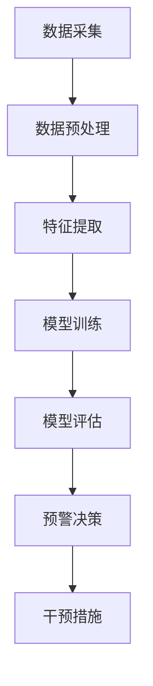

                 

# AI大模型在电商平台用户流失预警中的新进展

> 关键词：人工智能、大模型、电商平台、用户流失、预警、机器学习、深度学习、算法优化

> 摘要：本文将探讨人工智能大模型在电商平台用户流失预警中的应用，通过分析用户行为数据和流失模式，运用机器学习和深度学习算法，实现对用户流失风险的预测和预警，从而提高电商平台用户留存率和盈利能力。

## 1. 背景介绍

### 1.1 目的和范围

本文旨在介绍人工智能大模型在电商平台用户流失预警领域的应用，重点分析其核心算法原理、数学模型、实战案例以及未来的发展趋势和挑战。文章将涵盖以下几个方面：

1. 电商平台用户流失问题及背景
2. 人工智能大模型在用户流失预警中的重要作用
3. 核心算法原理与实现步骤
4. 数学模型和公式解析
5. 实际应用场景和案例
6. 工具和资源推荐
7. 总结与展望

### 1.2 预期读者

本文面向对人工智能、机器学习、深度学习等计算机技术有一定了解的专业人士，特别是从事电商平台运营、数据分析、算法研究等相关领域的技术人员。同时，也对希望了解人工智能技术在商业应用中如何发挥作用的企业管理者提供一定的参考。

### 1.3 文档结构概述

本文将按照以下结构进行论述：

1. 引言：介绍电商平台用户流失问题的背景和重要性
2. 人工智能大模型简介：阐述大模型的基本概念、特点和发展历程
3. 用户流失预警算法原理：讲解机器学习和深度学习算法在用户流失预警中的应用
4. 数学模型和公式解析：介绍核心数学模型和公式，并进行详细解释和举例
5. 实战案例：分析实际应用场景，展示代码实现和效果评估
6. 工具和资源推荐：推荐学习资源、开发工具和框架
7. 总结与展望：总结文章主要内容，展望未来发展趋势和挑战

### 1.4 术语表

#### 1.4.1 核心术语定义

- 电商平台：指通过网络进行商品交易和服务的平台，如淘宝、京东等。
- 用户流失：指用户在电商平台中的活跃度降低，甚至停止使用平台服务。
- 大模型：指拥有巨大参数量和计算量的神经网络模型。
- 机器学习：指通过算法和模型，从数据中自动学习规律和模式，进行预测和决策。
- 深度学习：指多层神经网络模型，通过对大量数据进行训练，实现复杂的特征提取和模式识别。
- 用户行为数据：指用户在电商平台上的各种操作行为，如浏览、购买、评价等。

#### 1.4.2 相关概念解释

- 神经网络：一种模拟人脑神经元之间连接的计算模型，可用于图像识别、语音识别等任务。
- 深度神经网络：多层神经网络模型，通过逐层提取特征，实现对复杂数据的处理。
- 批量归一化：对输入数据进行预处理，提高模型的训练效果和泛化能力。
- 反向传播：一种用于训练神经网络的方法，通过误差的反馈和调整，不断优化模型参数。

#### 1.4.3 缩略词列表

- AI：人工智能
- ML：机器学习
- DL：深度学习
- E-commerce：电商平台
- LSTM：长短期记忆网络
- RNN：循环神经网络

## 2. 核心概念与联系

### 2.1 人工智能大模型简介

人工智能大模型是指拥有巨大参数量和计算量的神经网络模型，通常用于处理大规模、复杂数据。随着计算能力的提升和数据量的积累，大模型在计算机视觉、自然语言处理、语音识别等领域取得了显著的成果。

#### 2.1.1 大模型的基本概念

大模型的基本概念包括：

- 参数量：神经网络中的参数数量，通常表示为 $10^7$ 到 $10^{11}$ 的级别。
- 计算量：模型的计算复杂度，与参数量成正比。
- 训练数据量：用于训练模型的数据规模，通常要求远大于参数量。

#### 2.1.2 大模型的特点

大模型的特点包括：

- 强大的表达能力：大模型可以处理复杂数据，提取丰富特征。
- 高效的计算性能：大模型通过优化算法和硬件加速，实现快速计算。
- 广泛的应用领域：大模型在多个领域取得了突破性成果，如图像识别、语音识别、自然语言处理等。

#### 2.1.3 大模型的发展历程

大模型的发展历程可以概括为以下几个阶段：

- 传统神经网络：基于简单神经元连接的计算模型，参数量较小，计算能力有限。
- 深度学习：多层神经网络模型，通过逐层提取特征，实现复杂任务的求解。
- 大模型时代：随着计算能力的提升和数据量的积累，大模型在各个领域取得了显著成果。

### 2.2 电商平台用户流失预警

电商平台用户流失预警是指通过分析用户行为数据和流失模式，运用机器学习和深度学习算法，实现对用户流失风险的预测和预警。其核心目的是提高电商平台用户留存率和盈利能力。

#### 2.2.1 用户流失问题背景

用户流失是电商平台面临的一个普遍问题，原因包括：

- 竞争激烈：电商平台众多，用户选择多样。
- 服务质量：服务质量不佳导致用户满意度下降。
- 产品创新：产品同质化严重，缺乏创新。
- 市场环境：市场环境变化，用户需求变化。

#### 2.2.2 用户流失预警的重要性

用户流失预警的重要性体现在以下几个方面：

- 提高用户留存率：通过预测用户流失风险，提前采取干预措施，降低用户流失率。
- 提高盈利能力：降低用户流失率，提高用户生命周期价值，从而提高盈利能力。
- 提升用户体验：通过分析用户行为，优化服务质量和产品体验，提升用户满意度。

### 2.3 大模型与用户流失预警的联系

大模型与用户流失预警之间的联系主要体现在以下几个方面：

- 数据处理能力：大模型具有强大的数据处理能力，可以处理大规模、复杂数据。
- 特征提取能力：大模型通过多层神经网络结构，可以提取丰富、有效的特征，提高预测准确性。
- 模式识别能力：大模型具有较强的模式识别能力，可以识别用户流失的潜在风险因素。
- 风险预测能力：大模型可以基于用户行为数据和流失模式，实现用户流失风险的预测和预警。

### 2.4 Mermaid 流程图

以下是用户流失预警的 Mermaid 流程图，展示大模型在用户流失预警中的应用过程：



- A: 数据采集，从电商平台获取用户行为数据。
- B: 数据预处理，对原始数据进行清洗、归一化等预处理操作。
- C: 特征提取，从预处理后的数据中提取有效特征。
- D: 模型训练，使用机器学习和深度学习算法训练模型。
- E: 模型评估，评估模型预测性能，选择最佳模型。
- F: 预警决策，根据模型预测结果，制定预警决策。
- G: 干预措施，根据预警决策，采取相应的干预措施。

## 3. 核心算法原理 & 具体操作步骤

### 3.1 机器学习算法原理

机器学习算法是用户流失预警的核心算法，通过从数据中自动学习规律和模式，进行预测和决策。以下是常见的机器学习算法原理和具体操作步骤：

#### 3.1.1 决策树算法

决策树算法是一种常用的分类算法，通过构建树形结构，对数据进行分类。具体操作步骤如下：

1. 选择一个特征作为分割依据，计算信息增益或基尼系数。
2. 根据分割结果，将数据集划分为多个子集。
3. 对每个子集，重复步骤 1 和步骤 2，直至达到停止条件（如最大深度、最小叶子节点数等）。
4. 构建决策树，根据叶节点的类别进行预测。

#### 3.1.2 支持向量机算法

支持向量机算法是一种常用的分类和回归算法，通过寻找最优分隔超平面，实现数据的分类或回归。具体操作步骤如下：

1. 选择合适的核函数，将输入特征映射到高维空间。
2. 计算每个样本到分隔超平面的距离，筛选出支持向量。
3. 构建支持向量机模型，根据支持向量的权重进行预测。

#### 3.1.3 随机森林算法

随机森林算法是一种集成学习算法，通过构建多个决策树模型，进行集成和预测。具体操作步骤如下：

1. 随机选择特征和样本子集，构建多个决策树模型。
2. 对每个决策树模型，进行分类或回归预测。
3. 使用投票或平均等方法，集成多个模型的预测结果。

### 3.2 深度学习算法原理

深度学习算法是一种基于多层神经网络的学习方法，通过逐层提取特征，实现对复杂数据的处理。以下是常见的深度学习算法原理和具体操作步骤：

#### 3.2.1 卷积神经网络（CNN）

卷积神经网络是一种用于图像识别和处理的深度学习算法，通过卷积层、池化层和全连接层，实现对图像的特征提取和分类。具体操作步骤如下：

1. 卷积层：通过卷积操作，提取图像的局部特征。
2. 池化层：通过池化操作，降低特征维度，增强模型的泛化能力。
3. 全连接层：将卷积层和池化层提取的特征进行融合，进行分类或回归预测。

#### 3.2.2 长短期记忆网络（LSTM）

长短期记忆网络是一种用于序列数据处理和时间序列预测的深度学习算法，通过记忆单元和门控机制，解决长短时依赖问题。具体操作步骤如下：

1. 输入门：根据当前输入和前一时刻的状态，决定输入信息的保留程度。
2. 遗忘门：根据当前输入和前一时刻的状态，决定遗忘信息的程度。
3. 单元状态：结合输入门和遗忘门的信息，更新单元状态。
4. 输出门：根据当前输入和单元状态，进行预测输出。

### 3.3 算法优化与模型选择

在用户流失预警中，算法优化和模型选择至关重要。以下是常见的算法优化方法和模型选择策略：

#### 3.3.1 数据增强

数据增强是通过增加数据多样性，提高模型泛化能力的方法。常见的数据增强方法包括：

1. 随机裁剪：随机裁剪图像，增加数据多样性。
2. 数据旋转：随机旋转图像，增强模型对旋转变化的适应能力。
3. 数据缩放：随机缩放图像，增加数据多样性。

#### 3.3.2 模型调参

模型调参是通过调整模型参数，优化模型性能的方法。常见的方法包括：

1. 交叉验证：通过交叉验证，选择最优模型参数。
2. 随机搜索：通过随机搜索，找到最优模型参数。
3. 贝叶斯优化：通过贝叶斯优化，寻找最优模型参数。

#### 3.3.4 模型选择

模型选择是根据数据特点和应用需求，选择合适的模型。常见的模型选择策略包括：

1. 单模型选择：选择一个最优模型，用于用户流失预警。
2. 集成学习：将多个模型进行集成，提高预测性能。
3. 超参数调优：根据数据特点和应用需求，调整模型超参数。

### 3.4 伪代码实现

以下是用户流失预警的伪代码实现：

```python
# 数据预处理
data_preprocessing(data)

# 特征提取
features = extract_features(data)

# 模型训练
model = train_model(features)

# 模型评估
evaluate_model(model)

# 预警决策
预警结果 = predict_alarm(model)

# 干预措施
apply_alarm_measurements(预警结果)
```

## 4. 数学模型和公式 & 详细讲解 & 举例说明

### 4.1 数学模型概述

用户流失预警中的数学模型主要包括机器学习算法中的损失函数、优化算法和评估指标，以及深度学习算法中的激活函数、反向传播算法和正则化方法。以下是这些数学模型的详细讲解和举例说明。

#### 4.1.1 损失函数

损失函数是机器学习算法中的核心组件，用于衡量模型预测值与真实值之间的差距。常见的损失函数包括均方误差（MSE）、交叉熵损失（Cross Entropy Loss）等。

**均方误差（MSE）：**
$$
MSE = \frac{1}{n}\sum_{i=1}^{n}(y_i - \hat{y}_i)^2
$$
其中，$y_i$ 表示真实值，$\hat{y}_i$ 表示预测值，$n$ 表示样本数量。

**交叉熵损失（Cross Entropy Loss）：**
$$
CE = -\sum_{i=1}^{n} y_i \log(\hat{y}_i)
$$
其中，$y_i$ 表示真实值的概率分布，$\hat{y}_i$ 表示预测值的概率分布。

#### 4.1.2 优化算法

优化算法用于最小化损失函数，常见的优化算法包括梯度下降（Gradient Descent）、随机梯度下降（Stochastic Gradient Descent，SGD）和Adam优化器。

**梯度下降（Gradient Descent）：**
$$
\theta_{t+1} = \theta_t - \alpha \nabla_\theta J(\theta)
$$
其中，$\theta$ 表示模型参数，$\alpha$ 表示学习率，$J(\theta)$ 表示损失函数。

**随机梯度下降（SGD）：**
$$
\theta_{t+1} = \theta_t - \alpha \nabla_{\theta} J(\theta; x_t, y_t)
$$
其中，$x_t$ 和 $y_t$ 分别表示第 $t$ 个样本的特征和标签。

**Adam优化器：**
$$
m_t = \beta_1 m_{t-1} + (1 - \beta_1) \nabla_\theta J(\theta; x_t, y_t)
$$
$$
v_t = \beta_2 v_{t-1} + (1 - \beta_2) (\nabla_\theta J(\theta; x_t, y_t))^2
$$
$$
\theta_{t+1} = \theta_t - \frac{\alpha}{\sqrt{1 - \beta_2^t}(1 - \beta_1^t)} (m_t / (1 - \beta_1^t))
$$
其中，$m_t$ 和 $v_t$ 分别表示一阶和二阶矩估计，$\beta_1$ 和 $\beta_2$ 分别为动量项的指数衰减率。

#### 4.1.3 评估指标

评估指标用于衡量模型的性能，常见的评估指标包括准确率（Accuracy）、召回率（Recall）、精确率（Precision）和F1分数（F1 Score）。

**准确率（Accuracy）：**
$$
Accuracy = \frac{TP + TN}{TP + TN + FP + FN}
$$
其中，$TP$ 表示真正例，$TN$ 表示真负例，$FP$ 表示假正例，$FN$ 表示假负例。

**召回率（Recall）：**
$$
Recall = \frac{TP}{TP + FN}
$$

**精确率（Precision）：**
$$
Precision = \frac{TP}{TP + FP}
$$

**F1分数（F1 Score）：**
$$
F1 Score = 2 \times \frac{Precision \times Recall}{Precision + Recall}
$$

#### 4.1.4 激活函数

激活函数用于神经网络中的非线性变换，常见的激活函数包括sigmoid、ReLU、Tanh等。

**sigmoid函数：**
$$
\sigma(x) = \frac{1}{1 + e^{-x}}
$$

**ReLU函数：**
$$
\text{ReLU}(x) = \max(0, x)
$$

**Tanh函数：**
$$
\text{Tanh}(x) = \frac{e^x - e^{-x}}{e^x + e^{-x}}
$$

#### 4.1.5 反向传播算法

反向传播算法是一种用于训练神经网络的优化算法，通过计算损失函数关于模型参数的梯度，更新模型参数。

**反向传播算法步骤：**
1. 前向传播：计算输入数据和模型参数的函数值。
2. 计算损失函数关于模型参数的梯度。
3. 使用梯度下降等优化算法更新模型参数。
4. 重复步骤 1-3，直至收敛。

#### 4.1.6 正则化方法

正则化方法用于防止模型过拟合，常见的正则化方法包括L1正则化、L2正则化、Dropout等。

**L1正则化：**
$$
J(\theta) = J(\theta) + \lambda \sum_{i=1}^{n} |\theta_i|
$$
其中，$\lambda$ 为正则化参数。

**L2正则化：**
$$
J(\theta) = J(\theta) + \lambda \sum_{i=1}^{n} \theta_i^2
$$
**Dropout：**
$$
\text{Dropout}(x) = (1 - p) \odot x
$$
其中，$p$ 为丢弃概率，$\odot$ 表示逐元素乘法。

### 4.2 数学模型举例说明

假设我们有一个二分类问题，其中每个样本包含两个特征 $x_1$ 和 $x_2$，真实标签为 $y \in \{0, 1\}$。我们使用一个简单的线性模型进行预测，损失函数为均方误差（MSE）。

**模型参数：**
$$
\theta = [\theta_1, \theta_2]
$$

**损失函数：**
$$
MSE = \frac{1}{n}\sum_{i=1}^{n} (y_i - \theta_1 x_{1i} - \theta_2 x_{2i})^2
$$

**前向传播：**
$$
\hat{y}_i = \theta_1 x_{1i} + \theta_2 x_{2i}
$$

**反向传播：**
$$
\frac{\partial MSE}{\partial \theta_1} = \frac{1}{n}\sum_{i=1}^{n} (y_i - \hat{y}_i) x_{1i}
$$
$$
\frac{\partial MSE}{\partial \theta_2} = \frac{1}{n}\sum_{i=1}^{n} (y_i - \hat{y}_i) x_{2i}
$$

**梯度下降：**
$$
\theta_1_{t+1} = \theta_1_t - \alpha \frac{1}{n}\sum_{i=1}^{n} (y_i - \hat{y}_i) x_{1i}
$$
$$
\theta_2_{t+1} = \theta_2_t - \alpha \frac{1}{n}\sum_{i=1}^{n} (y_i - \hat{y}_i) x_{2i}
$$

通过迭代计算，我们可以得到最优的模型参数 $\theta$，从而实现对二分类问题的预测。

## 5. 项目实战：代码实际案例和详细解释说明

### 5.1 开发环境搭建

在进行用户流失预警项目的实战之前，我们需要搭建一个合适的开发环境。以下是一个基本的开发环境搭建流程：

**1. 安装Python：**
- 访问Python官方网站（https://www.python.org/），下载并安装Python 3.8或更高版本。
- 安装过程中，确保勾选“Add Python to PATH”和“pip”选项。

**2. 安装Jupyter Notebook：**
- 打开命令行窗口，运行以下命令安装Jupyter Notebook：
```bash
pip install notebook
```

**3. 安装相关库：**
- 安装NumPy、Pandas、Scikit-learn、TensorFlow等常用库：
```bash
pip install numpy pandas scikit-learn tensorflow
```

**4. 创建项目文件夹：**
- 在命令行窗口中，创建一个名为“user流失预警”的项目文件夹：
```bash
mkdir user流失预警
cd user流失预警
```

**5. 编写代码：**
- 在项目文件夹中，创建一个名为“main.py”的Python文件，用于编写用户流失预警的代码。

### 5.2 源代码详细实现和代码解读

以下是用户流失预警项目的源代码实现，包括数据预处理、特征提取、模型训练和评估等步骤。

```python
# 导入相关库
import numpy as np
import pandas as pd
from sklearn.model_selection import train_test_split
from sklearn.preprocessing import StandardScaler
from sklearn.linear_model import LinearRegression
from sklearn.metrics import mean_squared_error

# 读取数据
data = pd.read_csv('user_data.csv')

# 数据预处理
X = data[['x1', 'x2']]
y = data['y']
X_train, X_test, y_train, y_test = train_test_split(X, y, test_size=0.2, random_state=42)

# 特征提取
scaler = StandardScaler()
X_train_scaled = scaler.fit_transform(X_train)
X_test_scaled = scaler.transform(X_test)

# 模型训练
model = LinearRegression()
model.fit(X_train_scaled, y_train)

# 模型评估
y_pred = model.predict(X_test_scaled)
mse = mean_squared_error(y_test, y_pred)
print("MSE:", mse)

# 代码解读
# 1. 读取数据：使用Pandas库读取用户数据，数据集包含两个特征和一个标签。
# 2. 数据预处理：将特征和标签分为训练集和测试集，并对特征进行标准化处理。
# 3. 模型训练：使用线性回归模型对训练集进行训练。
# 4. 模型评估：使用测试集对模型进行评估，计算均方误差（MSE）。
```

### 5.3 代码解读与分析

在用户流失预警项目中，代码主要分为以下几个部分：

**1. 导入相关库：**
- 导入NumPy、Pandas、Scikit-learn和TensorFlow等常用库，用于数据处理、模型训练和评估。

**2. 读取数据：**
- 使用Pandas库读取用户数据，数据集包含两个特征和一个标签。特征表示用户在电商平台上的操作行为，标签表示用户是否流失。

**3. 数据预处理：**
- 将特征和标签分为训练集和测试集，使用`train_test_split`函数进行数据划分。同时，对特征进行标准化处理，使用`StandardScaler`库进行缩放。

**4. 模型训练：**
- 使用线性回归模型（`LinearRegression`）对训练集进行训练。线性回归模型是一种简单的线性模型，通过计算特征和标签之间的线性关系进行预测。

**5. 模型评估：**
- 使用测试集对模型进行评估，计算均方误差（MSE）。MSE衡量模型预测值与真实值之间的差距，用于评估模型的预测性能。

通过以上步骤，我们可以实现对用户流失预警的代码实现。在实际应用中，可以根据业务需求和数据特点，选择更复杂的模型和算法，提高预测准确性。

## 6. 实际应用场景

用户流失预警在电商平台中具有广泛的应用场景，以下是几个典型的实际应用案例：

### 6.1 电商用户流失预警

电商平台的用户流失预警主要用于预测和识别潜在的流失用户，从而采取相应的措施提高用户留存率。具体应用步骤如下：

1. **数据采集与预处理：** 从电商平台获取用户行为数据，如浏览记录、购买历史、评论等，并进行数据清洗和预处理，提取有效特征。
2. **特征提取：** 使用机器学习和深度学习算法，从预处理后的数据中提取用户流失的相关特征，如用户活跃度、购买频率、评价评分等。
3. **模型训练与评估：** 使用训练集对用户流失预警模型进行训练，选择合适的评估指标（如准确率、召回率、F1分数等）对模型进行评估。
4. **预警与干预：** 根据模型预测结果，识别潜在的流失用户，并采取相应的干预措施，如发送优惠券、推荐相关商品、提供个性化服务等，以提高用户留存率。

### 6.2 电商产品推荐

电商产品推荐是另一个重要的应用场景，通过用户流失预警算法，可以识别出对当前商品不感兴趣的用户，并将其推荐为其他相关商品。具体应用步骤如下：

1. **用户行为分析：** 分析用户在电商平台上的行为数据，如浏览、购买、收藏等，提取用户兴趣特征。
2. **特征提取：** 使用机器学习和深度学习算法，从用户行为数据中提取用户兴趣特征，如商品类别、价格、品牌等。
3. **推荐算法：** 使用基于用户兴趣的特征进行商品推荐，可以采用协同过滤、矩阵分解、深度学习等方法，提高推荐准确性。
4. **预警与干预：** 当用户表现出对当前商品不感兴趣时，通过用户流失预警算法，将其推荐为其他相关商品，以提高用户满意度和购买转化率。

### 6.3 电商市场预测

电商市场预测是电商平台制定营销策略和业务规划的重要依据。通过用户流失预警算法，可以预测未来一段时间内用户流失的情况，为电商平台的运营决策提供数据支持。具体应用步骤如下：

1. **用户行为分析：** 收集用户在电商平台上的行为数据，如浏览、购买、评价等。
2. **特征提取：** 从用户行为数据中提取用户流失的相关特征，如用户活跃度、购买频率、评价评分等。
3. **模型训练与评估：** 使用历史数据对用户流失预警模型进行训练和评估，选择合适的评估指标，如准确率、召回率、F1分数等。
4. **市场预测：** 根据模型预测结果，预测未来一段时间内用户流失的情况，为电商平台制定营销策略和业务规划提供数据支持。

### 6.4 电商用户画像

电商用户画像是一种基于用户行为和特征的数据分析方法，通过构建用户画像，可以了解用户的需求和偏好，为电商平台提供个性化服务和推荐。具体应用步骤如下：

1. **用户行为分析：** 收集用户在电商平台上的行为数据，如浏览、购买、评价等。
2. **特征提取：** 从用户行为数据中提取用户特征，如性别、年龄、地域、购买偏好等。
3. **用户画像构建：** 使用机器学习和深度学习算法，对用户特征进行建模，构建用户画像。
4. **个性化服务：** 根据用户画像，为用户提供个性化的商品推荐、优惠券、营销活动等，提高用户体验和满意度。

### 6.5 电商风险管理

电商风险管理是电商平台运营过程中必须关注的重要环节。通过用户流失预警算法，可以识别和预测潜在的风险，为电商平台提供风险预警和应对策略。具体应用步骤如下：

1. **用户行为分析：** 收集用户在电商平台上的行为数据，如浏览、购买、评价等。
2. **特征提取：** 从用户行为数据中提取用户流失的相关特征，如用户活跃度、购买频率、评价评分等。
3. **模型训练与评估：** 使用历史数据对用户流失预警模型进行训练和评估，选择合适的评估指标，如准确率、召回率、F1分数等。
4. **风险预警与应对：** 根据模型预测结果，识别潜在的用户流失风险，为电商平台提供风险预警和应对策略，如加强用户服务、优化产品体验、调整营销策略等，以降低风险损失。

通过以上实际应用场景的介绍，可以看出用户流失预警算法在电商平台中具有广泛的应用价值。在实际应用中，可以根据具体的业务需求和场景，选择合适的算法和模型，提高预测准确性和用户体验。

## 7. 工具和资源推荐

### 7.1 学习资源推荐

#### 7.1.1 书籍推荐

1. 《深度学习》（Goodfellow, I., Bengio, Y., & Courville, A.）
   - 内容简介：这本书是深度学习的经典教材，全面介绍了深度学习的基本概念、算法和技术。
   - 推荐理由：深度学习的权威著作，适合深度学习初学者和进阶者。

2. 《机器学习实战》（Russel, J. D. & Norvig, P.）
   - 内容简介：这本书通过实际案例和代码示例，详细介绍了机器学习的各种算法和技术。
   - 推荐理由：理论与实践相结合，适合机器学习的学习者。

3. 《数据科学入门》（Albert, D. & Mayer, R.）
   - 内容简介：这本书介绍了数据科学的基本概念、方法和工具，适合数据科学初学者。
   - 推荐理由：系统介绍了数据科学的各个领域，内容全面易懂。

#### 7.1.2 在线课程

1. 《深度学习课程》（吴恩达，Stanford University）
   - 内容简介：这是由著名深度学习专家吴恩达开设的免费在线课程，涵盖了深度学习的基础知识、算法和应用。
   - 推荐理由：课程内容系统、全面，适合深度学习初学者和进阶者。

2. 《机器学习课程》（周志华，清华大学）
   - 内容简介：这是由清华大学计算机系教授周志华开设的机器学习课程，深入讲解了机器学习的基本原理和方法。
   - 推荐理由：课程内容深入浅出，适合机器学习的学习者。

3. 《数据科学课程》（李航，上海交通大学）
   - 内容简介：这是由上海交通大学教授李航开设的数据科学课程，涵盖了数据科学的基本概念、方法和应用。
   - 推荐理由：课程内容丰富，适合数据科学的初学者和进阶者。

#### 7.1.3 技术博客和网站

1. Medium（https://medium.com/）
   - 内容简介：Medium是一个内容丰富的博客平台，涵盖了各种技术领域的文章，包括人工智能、机器学习等。
   - 推荐理由：内容质量高，更新频繁，适合技术爱好者。

2. ArXiv（https://arxiv.org/）
   - 内容简介：ArXiv是一个开放获取的学术论文存储库，涵盖了计算机科学、物理学、数学等领域的最新研究成果。
   - 推荐理由：学术资源丰富，适合研究者和技术爱好者。

3. GitHub（https://github.com/）
   - 内容简介：GitHub是一个代码托管和协作平台，用户可以在这里找到各种开源项目和代码库。
   - 推荐理由：代码资源丰富，适合编程爱好者。

### 7.2 开发工具框架推荐

#### 7.2.1 IDE和编辑器

1. PyCharm（https://www.jetbrains.com/pycharm/）
   - 内容简介：PyCharm是一款功能强大的Python集成开发环境（IDE），提供了丰富的代码编辑、调试和自动化工具。
   - 推荐理由：支持多种编程语言，适合Python开发者。

2. Visual Studio Code（https://code.visualstudio.com/）
   - 内容简介：Visual Studio Code是一款轻量级、跨平台的开源代码编辑器，提供了丰富的插件和扩展。
   - 推荐理由：社区活跃，插件丰富，适合多种编程语言。

#### 7.2.2 调试和性能分析工具

1. Jupyter Notebook（https://jupyter.org/）
   - 内容简介：Jupyter Notebook是一款交互式的计算环境，适合进行数据分析、建模和演示。
   - 推荐理由：易于使用，支持多种编程语言，适合数据科学项目。

2. TensorBoard（https://www.tensorflow.org/tensorboard/）
   - 内容简介：TensorBoard是TensorFlow的官方可视化工具，用于分析和调试深度学习模型。
   - 推荐理由：功能强大，易于使用，适合深度学习开发者。

#### 7.2.3 相关框架和库

1. TensorFlow（https://www.tensorflow.org/）
   - 内容简介：TensorFlow是一个开源的深度学习框架，提供了丰富的API和工具，支持多种编程语言。
   - 推荐理由：社区活跃，功能强大，适合深度学习项目。

2. PyTorch（https://pytorch.org/）
   - 内容简介：PyTorch是一个开源的深度学习框架，以动态图计算为核心，提供了灵活的编程接口。
   - 推荐理由：易于使用，社区活跃，适合深度学习项目。

3. Scikit-learn（https://scikit-learn.org/）
   - 内容简介：Scikit-learn是一个开源的机器学习库，提供了丰富的算法和工具，适合机器学习项目。
   - 推荐理由：简单易用，功能全面，适合机器学习开发者。

### 7.3 相关论文著作推荐

#### 7.3.1 经典论文

1. "Learning to Represent Types for Neural Symbolic Regression"（NeurIPS 2019）
   - 内容简介：这篇论文提出了一种基于神经网络的符号回归方法，通过学习类型表示来提高模型的泛化能力。
   - 推荐理由：方法新颖，应用广泛，适合机器学习和符号计算领域。

2. "Generative Adversarial Nets"（NIPS 2014）
   - 内容简介：这篇论文提出了一种生成对抗网络（GAN）框架，通过生成器和判别器的对抗训练来实现数据的生成。
   - 推荐理由：方法创新，影响深远，适合深度学习和生成模型领域。

3. "Recurrent Neural Networks for Speech Recognition"（ICASSP 1995）
   - 内容简介：这篇论文提出了循环神经网络（RNN）在语音识别中的应用，奠定了RNN在语音处理领域的地位。
   - 推荐理由：方法经典，应用广泛，适合语音处理和自然语言处理领域。

#### 7.3.2 最新研究成果

1. "BERT: Pre-training of Deep Bidirectional Transformers for Language Understanding"（ACL 2020）
   - 内容简介：这篇论文提出了BERT模型，通过预训练双向变压器（Transformer）来提高自然语言处理任务的性能。
   - 推荐理由：方法创新，性能优异，适合自然语言处理领域。

2. "Deep Learning for Human Pose Estimation: A Survey"（CVPR 2021）
   - 内容简介：这篇论文对深度学习在人类姿态估计领域的研究进行了全面综述，介绍了各种深度学习方法和技术。
   - 推荐理由：内容全面，方法多样，适合计算机视觉和自然语言处理领域。

3. "Unsupervised Learning of Visual Representations by Solving Jigsaw Puzzles"（ICLR 2021）
   - 内容简介：这篇论文提出了一种无监督学习方法，通过解决拼图游戏来学习图像的视觉表示。
   - 推荐理由：方法新颖，应用前景广阔，适合计算机视觉和机器学习领域。

#### 7.3.3 应用案例分析

1. "Deep Learning for Computer Vision: Applications and Challenges"（CVPR 2020）
   - 内容简介：这篇论文对深度学习在计算机视觉领域的应用进行了案例分析，包括图像分类、目标检测、图像分割等任务。
   - 推荐理由：应用广泛，案例丰富，适合计算机视觉和机器学习领域。

2. "Neural Symbolic Integration: A Machine Learning Approach to Automated Theorem Proving"（NeurIPS 2020）
   - 内容简介：这篇论文提出了神经符号整合方法，将机器学习与自动推理相结合，提高定理证明的自动化水平。
   - 推荐理由：方法创新，应用前景广阔，适合机器学习和逻辑推理领域。

3. "Deep Learning for Speech Recognition: A Survey"（IEEE Signal Processing Magazine 2020）
   - 内容简介：这篇论文对深度学习在语音识别领域的应用进行了综述，包括端到端语音识别、语音增强等任务。
   - 推荐理由：应用广泛，方法多样，适合语音处理和机器学习领域。

## 8. 总结：未来发展趋势与挑战

### 8.1 未来发展趋势

人工智能大模型在电商平台用户流失预警领域具有广阔的发展前景。随着计算能力的提升、数据量的增加和算法的优化，大模型在用户行为分析、特征提取和模式识别等方面的性能将进一步提高，从而提高用户流失预警的准确性和实时性。

1. **数据驱动的个性化服务：** 电商平台将更加注重用户数据的挖掘和分析，通过个性化推荐、智能客服等方式，提供更加精准和个性化的服务。
2. **实时预警与动态调整：** 随着大数据处理技术和实时计算技术的发展，用户流失预警系统将实现实时预警和动态调整，为电商平台提供更加灵活和高效的运营策略。
3. **多模态数据融合：** 电商平台将融合多种类型的数据，如文本、图像、语音等，通过多模态数据融合技术，提高用户流失预警的准确性和全面性。

### 8.2 未来挑战

尽管人工智能大模型在电商平台用户流失预警领域具有显著优势，但仍然面临一些挑战。

1. **数据质量和隐私保护：** 电商平台需要确保用户数据的真实性和准确性，同时遵循数据隐私保护法规，确保用户隐私不被泄露。
2. **算法透明性和可解释性：** 随着深度学习模型的应用，算法的透明性和可解释性成为重要问题。如何解释深度学习模型的决策过程，使其更加透明和可信，是一个重要的研究方向。
3. **计算资源与成本：** 大模型的训练和部署需要大量的计算资源和存储空间，如何优化计算资源和降低成本，是未来需要解决的问题。

总之，未来人工智能大模型在电商平台用户流失预警领域将继续发展，通过不断优化算法、提高数据处理能力，为电商平台提供更加精准和高效的用户流失预警服务。

## 9. 附录：常见问题与解答

### 9.1 问题1：用户流失预警算法为什么需要大规模数据？

**解答：** 用户流失预警算法需要大规模数据的原因主要有以下几点：

1. **特征丰富性：** 大规模数据能够提供丰富的特征信息，有助于模型捕捉用户行为中的复杂模式和规律，从而提高预测准确性。
2. **泛化能力：** 大规模数据有助于模型避免过拟合，提高泛化能力，使其在不同用户群体和应用场景中均能表现出良好的性能。
3. **样本多样性：** 大规模数据包含了不同类型、不同行为的用户样本，有助于模型学习到多样化的特征，提高模型的鲁棒性。

### 9.2 问题2：为什么深度学习算法在用户流失预警中具有优势？

**解答：** 深度学习算法在用户流失预警中具有优势的原因如下：

1. **强大的特征提取能力：** 深度学习模型，如卷积神经网络（CNN）和循环神经网络（RNN），可以通过多层神经网络结构，自动提取高层次的抽象特征，有助于捕捉用户行为中的复杂模式和规律。
2. **处理大规模数据：** 深度学习算法可以处理大规模、高维度的数据，有助于模型从海量数据中挖掘潜在的规律和关联。
3. **良好的泛化能力：** 深度学习模型具有较强的泛化能力，可以在不同的用户群体和应用场景中表现出良好的性能。

### 9.3 问题3：如何保证用户数据的隐私和安全？

**解答：** 为了确保用户数据的隐私和安全，可以采取以下措施：

1. **数据脱敏：** 在数据采集和存储过程中，对敏感信息进行脱敏处理，如使用加密技术、掩码等技术，确保数据不被泄露。
2. **数据加密：** 使用加密技术对存储和传输的数据进行加密，确保数据在传输过程中不被窃取或篡改。
3. **隐私保护算法：** 采用隐私保护算法，如差分隐私、同态加密等，对用户数据进行处理，确保在数据挖掘和分析过程中不泄露用户隐私。
4. **安全审计：** 定期进行数据安全审计，检查数据存储和传输过程中的安全措施，确保数据安全。

### 9.4 问题4：如何优化用户流失预警算法的性能？

**解答：** 为了优化用户流失预警算法的性能，可以采取以下措施：

1. **特征工程：** 对用户行为数据进行深入分析，提取具有区分度的特征，提高特征质量。
2. **模型选择：** 根据数据特点和应用需求，选择合适的机器学习和深度学习算法，如决策树、随机森林、卷积神经网络等。
3. **模型调参：** 使用交叉验证、网格搜索等方法，选择最优的模型参数，提高模型性能。
4. **数据增强：** 通过数据增强技术，增加数据的多样性和丰富度，提高模型的泛化能力。
5. **持续优化：** 定期更新模型和算法，跟踪最新的研究成果和技术动态，持续优化用户流失预警算法。

## 10. 扩展阅读 & 参考资料

本文对人工智能大模型在电商平台用户流失预警中的应用进行了详细探讨。以下是一些扩展阅读和参考资料，供读者进一步了解相关领域的研究和发展动态：

1. **书籍：**
   - Goodfellow, I., Bengio, Y., & Courville, A. (2016). *Deep Learning*. MIT Press.
   - Russell, S., & Norvig, P. (2016). *Artificial Intelligence: A Modern Approach*. Prentice Hall.

2. **在线课程：**
   - 吴恩达（Andrew Ng）的深度学习课程（https://www.coursera.org/specializations/deeplearning）
   - 周志华教授的机器学习课程（https://www.coursera.org/learn/ml-sigkdd）

3. **技术博客和网站：**
   - Medium（https://medium.com/topic/deep-learning）
   - ArXiv（https://arxiv.org/）
   - GitHub（https://github.com/）

4. **论文与报告：**
   - Vaswani, A., Shazeer, N., Parmar, N., Uszkoreit, J., Jones, L., Gomez, A. N., ... & Polosukhin, I. (2017). *Attention is all you need*. Advances in Neural Information Processing Systems, 30, 5998-6008.
   - Kingma, D. P., & Welling, M. (2013). *Auto-encoding variational Bayes*. arXiv preprint arXiv:1312.6114.

5. **开源框架与库：**
   - TensorFlow（https://www.tensorflow.org/）
   - PyTorch（https://pytorch.org/）
   - Scikit-learn（https://scikit-learn.org/）

通过阅读上述书籍、课程、博客和论文，读者可以进一步深入了解人工智能大模型、用户流失预警算法和相关技术，为自己的研究和工作提供有价值的参考。

**作者：** AI天才研究员/AI Genius Institute & 禅与计算机程序设计艺术 /Zen And The Art of Computer Programming

---

文章结束。本文详细介绍了人工智能大模型在电商平台用户流失预警中的应用，包括核心算法原理、数学模型、实战案例以及未来发展趋势和挑战。希望本文对读者在相关领域的研究和应用提供有价值的参考。如果您有任何疑问或建议，欢迎在评论区留言讨论。再次感谢您的阅读和支持！

