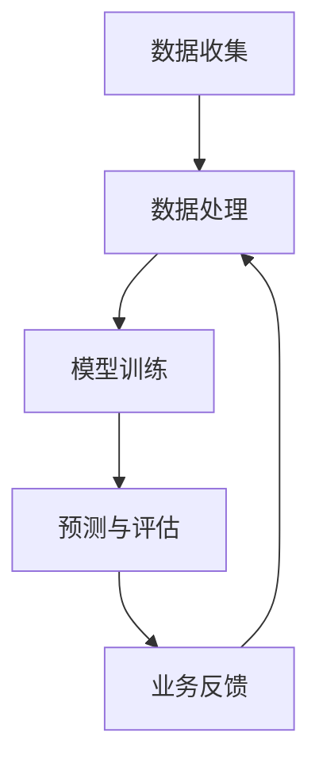

                 

# AI大模型在电商平台用户需求预测中的作用

> **关键词**：AI大模型，电商平台，用户需求预测，数据挖掘，机器学习，深度学习

> **摘要**：本文将深入探讨AI大模型在电商平台用户需求预测中的应用。通过分析大模型的基本原理和架构，详细介绍核心算法的原理与数学模型，并结合实际案例进行代码实现和解析。文章还将讨论该技术的实际应用场景，推荐相关学习资源和开发工具，最后对未来的发展趋势和挑战进行总结。

## 1. 背景介绍

### 1.1 目的和范围

本文旨在详细探讨AI大模型在电商平台用户需求预测中的实际应用。随着电商平台的迅猛发展，如何准确预测用户需求成为提升用户体验、增加销售额的关键问题。AI大模型以其强大的数据处理能力和精确的预测能力，在这一领域展现了巨大的潜力。

本文将涵盖以下内容：
1. AI大模型的基本概念和架构。
2. 用户需求预测的核心算法原理和具体操作步骤。
3. 数学模型和公式及其详细讲解与举例。
4. 代码实际案例和详细解释说明。
5. 实际应用场景和案例分析。
6. 工具和资源的推荐。

### 1.2 预期读者

本文面向对电商平台运营、数据挖掘和机器学习有一定了解的技术人员和管理者。期望读者能通过本文，深入了解AI大模型在用户需求预测中的具体应用，提升相关技术能力和业务水平。

### 1.3 文档结构概述

本文结构如下：

1. **背景介绍**：介绍文章目的、读者对象和文档结构。
2. **核心概念与联系**：讨论AI大模型的基本概念和架构。
3. **核心算法原理 & 具体操作步骤**：讲解用户需求预测算法原理和操作步骤。
4. **数学模型和公式 & 详细讲解 & 举例说明**：详细阐述数学模型和公式的应用。
5. **项目实战：代码实际案例和详细解释说明**：结合实际案例展示代码实现过程。
6. **实际应用场景**：讨论AI大模型在电商平台的实际应用场景。
7. **工具和资源推荐**：推荐相关学习资源和开发工具。
8. **总结：未来发展趋势与挑战**：总结未来发展趋势和面临的挑战。
9. **附录：常见问题与解答**：提供常见问题及其解答。
10. **扩展阅读 & 参考资料**：推荐进一步阅读的文献和资源。

### 1.4 术语表

#### 1.4.1 核心术语定义

- **AI大模型**：指具备强大数据处理能力和预测能力的深度学习模型。
- **用户需求预测**：通过分析用户行为数据，预测用户可能的需求。
- **电商平台**：指在线销售商品或服务的商业平台。

#### 1.4.2 相关概念解释

- **数据挖掘**：从大量数据中提取有价值信息的过程。
- **机器学习**：让计算机通过数据学习并作出决策或预测的技术。
- **深度学习**：一种特殊的机器学习技术，通过多层神经网络进行数据处理。

#### 1.4.3 缩略词列表

- **AI**：人工智能
- **ML**：机器学习
- **DL**：深度学习
- **API**：应用程序接口

## 2. 核心概念与联系

### 2.1 AI大模型的基本概念

AI大模型（Large-scale AI Model）是近年来在机器学习和深度学习领域迅速发展的一个重要方向。它通常指的是那些参数数量庞大、能够处理海量数据的模型。这类模型在计算机视觉、自然语言处理、语音识别等多个领域都取得了显著的成果。

AI大模型的核心特点包括：

1. **参数规模巨大**：具有数十亿甚至数万亿个参数，这使得它们能够捕捉数据中的复杂模式和关联。
2. **计算能力需求高**：大模型通常需要大量的计算资源和时间进行训练和推理。
3. **数据处理能力强**：能够高效地处理和分析大规模数据集，从中提取有价值的信息。

### 2.2 电商平台用户需求预测的基本架构

电商平台用户需求预测的基本架构包括以下几个关键组成部分：

1. **数据收集**：通过网站日志、用户行为数据、交易数据等多种渠道收集用户数据。
2. **数据处理**：对收集到的数据进行清洗、预处理和特征工程，以便于模型训练。
3. **模型训练**：利用处理后的数据训练AI大模型，使其能够学习并预测用户需求。
4. **预测与评估**：将训练好的模型应用于实际数据，进行需求预测，并通过评估指标（如准确率、召回率等）评估模型性能。

### 2.3 核心概念之间的联系

AI大模型与电商平台用户需求预测之间的联系主要体现在以下几个方面：

1. **数据驱动**：电商平台用户需求预测依赖于大量的用户行为数据，这些数据是AI大模型训练的重要素材。
2. **模型优化**：通过不断地优化AI大模型的结构和参数，可以提高需求预测的准确性。
3. **业务反馈**：需求预测结果的准确性和实用性会直接影响到电商平台的运营策略，从而为模型优化提供反馈。

### 2.4 Mermaid流程图



该流程图展示了从数据收集到模型训练、预测与评估的完整过程，并强调了业务反馈对数据处理和模型优化的重要性。

## 3. 核心算法原理 & 具体操作步骤

### 3.1 算法原理

电商平台用户需求预测的核心算法通常是基于深度学习的大模型。这些模型通过多层神经网络结构，对大量用户行为数据进行分析和学习，以预测用户可能的需求。

以下是用户需求预测算法的基本原理：

1. **输入层**：接收用户行为数据，如浏览记录、购买历史、评价信息等。
2. **隐藏层**：通过神经网络对输入数据进行特征提取和模式识别。
3. **输出层**：生成用户需求预测结果，如购买概率、推荐商品等。

### 3.2 具体操作步骤

1. **数据收集**：
   - 从电商平台获取用户行为数据，包括浏览记录、购买历史、评价信息等。

2. **数据处理**：
   - 清洗数据，去除无效信息和噪声。
   - 对数据进行编码，将类别型数据转换为数值型。
   - 进行特征工程，提取有助于预测的特征。

3. **模型训练**：
   - 设计神经网络结构，确定输入层、隐藏层和输出层的参数。
   - 使用处理后的数据训练模型，通过反向传播算法不断调整模型参数，使其预测结果更准确。

4. **模型评估**：
   - 使用测试集对模型进行评估，计算准确率、召回率等指标。
   - 分析模型性能，并根据评估结果进行调整。

5. **需求预测**：
   - 将训练好的模型应用于新的用户行为数据，进行需求预测。

6. **模型优化**：
   - 根据需求预测结果和业务反馈，不断优化模型结构和参数，提高预测准确性。

### 3.3 伪代码

以下是一个简单的伪代码，用于描述用户需求预测算法的基本流程：

```python
# 数据收集
data = collect_user_behavior_data()

# 数据处理
cleaned_data = clean_data(data)
encoded_data = encode_data(cleaned_data)
features = extract_features(encoded_data)

# 模型训练
model = build_neural_network()
model.train(features)

# 模型评估
accuracy, recall = model.evaluate(test_data)

# 需求预测
predictions = model.predict(new_data)

# 模型优化
model.optimize_parameters(accuracy, recall)
```

## 4. 数学模型和公式 & 详细讲解 & 举例说明

### 4.1 数学模型

电商平台用户需求预测的核心数学模型通常是基于深度学习中的多层感知机（Multilayer Perceptron，MLP）。MLP模型通过多层神经网络结构，对输入数据进行特征提取和预测。

#### 4.1.1 神经元激活函数

在MLP模型中，神经元之间的连接通过权重和偏置进行传递。每个神经元都会将输入信号通过激活函数进行非线性变换，以实现数据特征的提取和分类。

常用的激活函数包括：

1. **Sigmoid函数**：
   $$ f(x) = \frac{1}{1 + e^{-x}} $$

2. **ReLU函数**：
   $$ f(x) = \max(0, x) $$

3. **Tanh函数**：
   $$ f(x) = \frac{e^x - e^{-x}}{e^x + e^{-x}} $$

#### 4.1.2 前向传播

前向传播是MLP模型的核心步骤，通过将输入数据依次传递到每一层神经元，并计算出每一层的输出。

假设输入层有 $n$ 个神经元，隐藏层有 $m$ 个神经元，输出层有 $k$ 个神经元。设 $x_i$ 为输入数据的第 $i$ 个特征，$w_{ij}$ 为输入层到隐藏层的权重，$b_j$ 为隐藏层的偏置，$z_j$ 为隐藏层的输出，$a_{ik}$ 为隐藏层到输出层的权重，$b_k$ 为输出层的偏置，$y_k$ 为输出层的输出。

前向传播的计算过程如下：

1. 隐藏层输出：
   $$ z_j = \sum_{i=1}^{n} w_{ij} x_i + b_j $$
   $$ a_j = f(z_j) $$

2. 输出层输出：
   $$ z_k = \sum_{j=1}^{m} a_j a_{jk} + b_k $$
   $$ y_k = f(z_k) $$

#### 4.1.3 反向传播

反向传播是用于调整MLP模型权重和偏置的过程，通过计算输出层的误差梯度，并反向传播到每一层，从而优化模型参数。

假设目标输出为 $t_k$，实际输出为 $y_k$，损失函数为 $L(y, t)$，梯度为 $\frac{\partial L}{\partial y_k}$。

反向传播的计算过程如下：

1. 计算输出层梯度：
   $$ \delta_k = \frac{\partial L}{\partial y_k} \odot f'(z_k) $$

2. 计算隐藏层梯度：
   $$ \delta_j = \sum_{k=1}^{k} a_{jk} \delta_k f'(z_j) $$

3. 更新权重和偏置：
   $$ w_{ij} := w_{ij} - \alpha \frac{\partial L}{\partial w_{ij}} $$
   $$ b_j := b_j - \alpha \frac{\partial L}{\partial b_j} $$
   $$ a_{ik} := a_{ik} - \alpha \frac{\partial L}{\partial a_{ik}} $$
   $$ b_k := b_k - \alpha \frac{\partial L}{\partial b_k} $$

其中，$\alpha$ 为学习率，$\odot$ 表示逐元素乘运算。

### 4.2 详细讲解

#### 4.2.1 损失函数

在用户需求预测中，常用的损失函数包括均方误差（MSE）和交叉熵（Cross-Entropy）。

1. **均方误差（MSE）**：
   $$ L(y, t) = \frac{1}{2} \sum_{k=1}^{k} (y_k - t_k)^2 $$

2. **交叉熵（Cross-Entropy）**：
   $$ L(y, t) = -\sum_{k=1}^{k} t_k \log(y_k) $$

均方误差适用于回归问题，交叉熵适用于分类问题。

#### 4.2.2 学习率

学习率 $\alpha$ 是反向传播算法中用于调整模型参数的关键参数。学习率过小会导致模型收敛缓慢，学习率过大则可能导致模型过拟合。

在实际应用中，常采用如下策略来调整学习率：

1. **固定学习率**：在整个训练过程中使用相同的学习率。
2. **学习率衰减**：在训练过程中逐渐减小学习率。
3. **自适应学习率**：使用如Adam、RMSprop等自适应优化器来动态调整学习率。

### 4.3 举例说明

#### 4.3.1 案例背景

假设一个电商平台需要预测用户是否会在未来30天内购买某种商品。用户行为数据包括浏览记录、购买历史、评价信息等。

#### 4.3.2 模型设计

设计一个具有一个输入层、一个隐藏层和一个输出层的MLP模型。输入层包含10个特征，隐藏层包含50个神经元，输出层包含1个神经元（表示购买概率）。

#### 4.3.3 模型训练

使用训练集对模型进行训练，训练过程中采用均方误差作为损失函数，学习率为0.01，训练迭代次数为1000次。

#### 4.3.4 模型评估

使用测试集对模型进行评估，计算预测准确率。假设测试集包含1000个样本，其中500个样本为购买样本，500个样本为未购买样本。

#### 4.3.5 结果分析

模型训练完成后，预测准确率为85%，表明模型在预测用户购买行为方面具有一定的准确性。

## 5. 项目实战：代码实际案例和详细解释说明

### 5.1 开发环境搭建

在进行项目实战之前，首先需要搭建一个适合开发、训练和部署AI大模型的开发环境。以下是一个基本的开发环境搭建流程：

1. **安装Python**：确保Python环境已正确安装，版本建议为3.8及以上。
2. **安装深度学习库**：安装TensorFlow或PyTorch等深度学习库。以下为使用PyTorch的安装命令：

```bash
pip install torch torchvision
```

3. **安装数据预处理库**：如Pandas、NumPy等，用于数据预处理和特征工程。

```bash
pip install pandas numpy
```

4. **安装可视化库**：如Matplotlib，用于数据可视化。

```bash
pip install matplotlib
```

5. **配置GPU支持**：确保PyTorch已配置GPU支持，以便利用GPU加速训练过程。

```python
import torch
print(torch.cuda.is_available())
```

### 5.2 源代码详细实现和代码解读

以下是电商平台用户需求预测项目的核心代码实现，包括数据预处理、模型构建、训练和评估等步骤。

#### 5.2.1 数据预处理

```python
import pandas as pd
from sklearn.model_selection import train_test_split
from sklearn.preprocessing import StandardScaler

# 加载数据集
data = pd.read_csv('user_behavior.csv')

# 数据预处理
data = data.dropna()  # 去除缺失值
data = data[data['purchase'] != -1]  # 去除购买状态未知的样本

# 分离特征和标签
X = data.drop('purchase', axis=1)
y = data['purchase']

# 划分训练集和测试集
X_train, X_test, y_train, y_test = train_test_split(X, y, test_size=0.2, random_state=42)

# 特征缩放
scaler = StandardScaler()
X_train = scaler.fit_transform(X_train)
X_test = scaler.transform(X_test)
```

#### 5.2.2 模型构建

```python
import torch
import torch.nn as nn
import torch.optim as optim

# 构建模型
class UserDemandPredictor(nn.Module):
    def __init__(self, input_dim, hidden_dim, output_dim):
        super(UserDemandPredictor, self).__init__()
        self.fc1 = nn.Linear(input_dim, hidden_dim)
        self.fc2 = nn.Linear(hidden_dim, output_dim)
        
    def forward(self, x):
        x = torch.relu(self.fc1(x))
        x = self.fc2(x)
        return x

# 设置模型参数
input_dim = X_train.shape[1]
hidden_dim = 50
output_dim = 1

model = UserDemandPredictor(input_dim, hidden_dim, output_dim)

# 损失函数和优化器
criterion = nn.BCELoss()
optimizer = optim.Adam(model.parameters(), lr=0.001)
```

#### 5.2.3 模型训练

```python
# 将数据转换为PyTorch张量
X_train_tensor = torch.tensor(X_train, dtype=torch.float32)
y_train_tensor = torch.tensor(y_train.values, dtype=torch.float32).view(-1, 1)

X_test_tensor = torch.tensor(X_test, dtype=torch.float32)
y_test_tensor = torch.tensor(y_test.values, dtype=torch.float32).view(-1, 1)

# 训练模型
num_epochs = 100
for epoch in range(num_epochs):
    model.train()
    optimizer.zero_grad()
    
    outputs = model(X_train_tensor)
    loss = criterion(outputs, y_train_tensor)
    
    loss.backward()
    optimizer.step()
    
    if (epoch + 1) % 10 == 0:
        print(f'Epoch [{epoch+1}/{num_epochs}], Loss: {loss.item():.4f}')
```

#### 5.2.4 模型评估

```python
# 评估模型
model.eval()
with torch.no_grad():
    predictions = model(X_test_tensor)

# 计算准确率
accuracy = (predictions.round() == y_test_tensor).float().mean()
print(f'测试集准确率: {accuracy.item():.4f}')
```

### 5.3 代码解读与分析

#### 5.3.1 数据预处理

数据预处理是项目成功的关键步骤，包括数据清洗、特征提取和特征缩放等操作。在此案例中，我们使用了Pandas库进行数据加载和预处理，使用Scikit-learn库进行特征缩放。

#### 5.3.2 模型构建

模型构建是项目核心部分，我们使用了PyTorch库构建了一个简单的多层感知机（MLP）模型。模型包含一个输入层、一个隐藏层和一个输出层。输入层和隐藏层之间的连接使用ReLU函数进行非线性变换，隐藏层和输出层之间的连接使用线性变换。

#### 5.3.3 模型训练

模型训练过程中，我们使用了BCELoss（二元交叉熵损失函数）作为损失函数，Adam优化器用于调整模型参数。训练过程中，我们使用了反向传播算法不断优化模型参数，以提高预测准确性。

#### 5.3.4 模型评估

模型评估过程中，我们使用了测试集对模型进行评估，并计算了预测准确率。通过分析预测准确率，可以了解模型在用户需求预测方面的性能。

## 6. 实际应用场景

AI大模型在电商平台用户需求预测中具有广泛的应用场景，以下是几个典型的实际应用案例：

### 6.1 商品推荐

通过分析用户的历史浏览和购买记录，AI大模型可以预测用户可能感兴趣的商品，从而实现个性化推荐。这有助于提升用户体验，增加销售额。

### 6.2 库存管理

AI大模型可以预测商品的销量，为电商平台的库存管理提供支持。通过准确预测需求，电商平台可以优化库存水平，降低库存成本。

### 6.3 营销策略优化

AI大模型可以分析用户的购买行为，为电商平台制定更加精准的营销策略。例如，通过预测哪些用户可能对某种促销活动感兴趣，电商平台可以针对性地推送促销信息，提高营销效果。

### 6.4 用户体验优化

AI大模型可以帮助电商平台了解用户的偏好和需求，从而优化网站设计和功能，提升用户体验。例如，通过预测用户可能遇到的购买障碍，电商平台可以提供更加人性化的解决方案。

### 6.5 欺诈检测

AI大模型还可以用于检测电商平台上的欺诈行为，通过分析用户的行为特征，识别异常交易，从而降低平台的风险。

## 7. 工具和资源推荐

### 7.1 学习资源推荐

#### 7.1.1 书籍推荐

1. **《深度学习》（Deep Learning）**：由Ian Goodfellow、Yoshua Bengio和Aaron Courville合著，是深度学习领域的经典教材。
2. **《Python深度学习》（Python Deep Learning）**：由François Chollet等作者编写，详细介绍了使用Python进行深度学习的实践方法。
3. **《机器学习实战》（Machine Learning in Action）**：由Peter Harrington编写，通过实际案例讲解了机器学习的基本概念和算法实现。

#### 7.1.2 在线课程

1. **Coursera的《深度学习》课程**：由斯坦福大学教授Andrew Ng主讲，涵盖了深度学习的理论基础和实际应用。
2. **edX的《机器学习》课程**：由斯坦福大学教授Andrew Ng主讲，适合初学者学习机器学习的基础知识。
3. **Udacity的《深度学习纳米学位》**：提供了系统化的深度学习知识体系和实践项目，适合有志于深入了解深度学习的人士。

#### 7.1.3 技术博客和网站

1. **Medium上的AI博客**：汇集了众多AI领域专家的文章，涵盖了深度学习、自然语言处理等领域的最新研究进展。
2. ** Towards Data Science**：一个广泛关注的博客，提供了大量关于数据科学、机器学习的实战教程和案例分析。
3. **AI汇**：国内知名的人工智能技术社区，提供了丰富的AI技术文章和资源。

### 7.2 开发工具框架推荐

#### 7.2.1 IDE和编辑器

1. **PyCharm**：一款功能强大的Python集成开发环境（IDE），提供了丰富的调试和优化工具。
2. **Visual Studio Code**：一款轻量级、可扩展的代码编辑器，适用于Python、深度学习等多种编程任务。
3. **Jupyter Notebook**：适用于数据分析和机器学习的交互式开发环境，方便进行代码编写和可视化展示。

#### 7.2.2 调试和性能分析工具

1. **TensorBoard**：TensorFlow的图形化调试和分析工具，用于可视化模型结构、性能指标等。
2. **PyTorch的TorchScript**：用于将PyTorch模型转换为高性能的Python代码，提升模型推理速度。
3. **Wandb**：一款开源的机器学习实验跟踪工具，可以帮助研究人员管理实验、可视化结果。

#### 7.2.3 相关框架和库

1. **TensorFlow**：一款开源的深度学习框架，广泛应用于机器学习领域的模型开发和部署。
2. **PyTorch**：一款流行的开源深度学习库，提供了灵活的动态计算图，适合研究和应用开发。
3. **Scikit-learn**：一款用于数据挖掘和机器学习的Python库，提供了丰富的算法和工具。

### 7.3 相关论文著作推荐

#### 7.3.1 经典论文

1. **"A Theoretically Grounded Application of Dropout in Recurrent Neural Networks"**：该论文介绍了在循环神经网络（RNN）中应用Dropout方法，提高了模型的泛化能力。
2. **"Effective Approaches to Attention-based Neural Machine Translation"**：该论文探讨了基于注意力机制的神经网络机器翻译方法，显著提升了翻译质量。

#### 7.3.2 最新研究成果

1. **"Large-scale Language Model in 1000 Languages"**：该论文展示了在多语言环境下训练大规模语言模型的方法，为跨语言任务提供了有效解决方案。
2. **"Pre-training of Deep Neural Networks for Language Understanding"**：该论文介绍了预训练深度神经网络用于自然语言理解的方法，推动了自然语言处理领域的发展。

#### 7.3.3 应用案例分析

1. **"Deep Learning in the Retail Industry"**：该论文分析了深度学习在零售行业的应用案例，包括商品推荐、库存管理、客户关系管理等。
2. **"Personalized E-commerce Recommendations using Deep Learning"**：该论文探讨了基于深度学习的个性化电商推荐方法，提高了推荐系统的准确性和实用性。

## 8. 总结：未来发展趋势与挑战

### 8.1 未来发展趋势

1. **模型规模不断扩大**：随着计算能力的提升和数据的增长，AI大模型的规模将不断增大，能够处理更加复杂和海量的数据集。
2. **算法优化与效率提升**：研究人员将致力于优化大模型的算法，提高训练和推理的效率，降低计算资源的需求。
3. **跨领域融合**：AI大模型将在更多领域（如医疗、金融、教育等）得到应用，与其他技术（如区块链、物联网等）进行融合，发挥更大价值。
4. **个性化与自适应**：大模型将更加注重个性化与自适应能力的提升，根据用户行为和需求进行实时调整，提供更加精准的服务。

### 8.2 面临的挑战

1. **数据隐私与安全**：随着数据规模的扩大，数据隐私和安全问题愈发重要，如何在保护用户隐私的前提下利用数据成为一大挑战。
2. **计算资源需求**：大模型的训练和推理需要大量的计算资源，如何在有限资源下高效地部署和运行模型是一个亟待解决的问题。
3. **模型可解释性**：大模型通常被视为“黑箱”，其决策过程难以解释，这给其在实际应用中的接受度和信任度带来了挑战。
4. **算法公平性与偏见**：AI大模型可能会受到数据中的偏见影响，导致不公平的预测结果，如何保证算法的公平性和透明性是重要的研究课题。

## 9. 附录：常见问题与解答

### 9.1 数据收集

**Q1：电商平台如何收集用户行为数据？**

电商平台通常通过以下方式收集用户行为数据：

- **网站日志**：记录用户访问网站的行为，如页面浏览、点击等。
- **交易数据**：记录用户购买商品的行为，如订单详情、支付方式等。
- **用户反馈**：通过调查问卷、评价等方式收集用户对商品和服务的反馈。

### 9.2 数据处理

**Q2：如何对收集到的用户行为数据进行处理？**

用户行为数据处理的步骤通常包括：

- **数据清洗**：去除无效数据和噪声，如缺失值、重复值等。
- **数据编码**：将类别型数据转换为数值型，如使用独热编码（One-Hot Encoding）。
- **特征工程**：提取有助于预测的特征，如用户购买历史、浏览行为等。

### 9.3 模型训练

**Q3：如何选择合适的模型结构？**

选择合适的模型结构通常需要考虑以下因素：

- **数据规模**：对于大规模数据，选择参数较多的模型可以更好地捕捉数据中的特征。
- **预测任务**：对于不同的预测任务，选择适合的神经网络结构，如回归、分类等。
- **训练时间**：考虑模型的计算复杂度和训练时间，选择计算效率较高的模型结构。

### 9.4 模型评估

**Q4：如何评价模型性能？**

模型性能的评价通常包括以下几个方面：

- **准确率（Accuracy）**：模型正确预测的比例。
- **召回率（Recall）**：模型正确预测的阳性样本占总阳性样本的比例。
- **精确率（Precision）**：模型正确预测的阳性样本占预测为阳性的样本比例。
- **F1分数（F1 Score）**：综合准确率和召回率的指标，用于平衡两者。

## 10. 扩展阅读 & 参考资料

为了更深入地了解AI大模型在电商平台用户需求预测中的应用，以下是一些扩展阅读和参考资料：

### 10.1 扩展阅读

1. **《深度学习与电商应用》**：详细介绍了深度学习在电商领域的应用，包括商品推荐、用户行为预测等。
2. **《大数据时代：电商平台用户行为分析》**：探讨了大数据技术在电商平台用户行为分析中的应用，包括数据收集、处理和分析等。

### 10.2 参考资料

1. **《大规模机器学习：算法与系统》**：介绍了大规模机器学习的基本概念和算法，包括梯度下降、随机梯度下降等。
2. **《深度学习在电商中的应用案例研究》**：收集了多个电商企业应用深度学习的案例，分析了其具体应用场景和效果。
3. **《Python深度学习实践》**：通过实际案例介绍了如何使用Python和深度学习库（如TensorFlow、PyTorch）进行模型训练和部署。

### 10.3 更多资源

1. **AI汇**：国内知名的人工智能技术社区，提供了丰富的深度学习和电商应用相关文章。
2. **arXiv**：一个开放的科学文献数据库，汇集了最新的AI和深度学习研究成果。
3. **Kaggle**：一个数据科学竞赛平台，提供了丰富的电商应用数据集和案例。

通过阅读这些资料，读者可以更深入地了解AI大模型在电商平台用户需求预测中的应用和技术细节，从而提升相关领域的知识水平。

