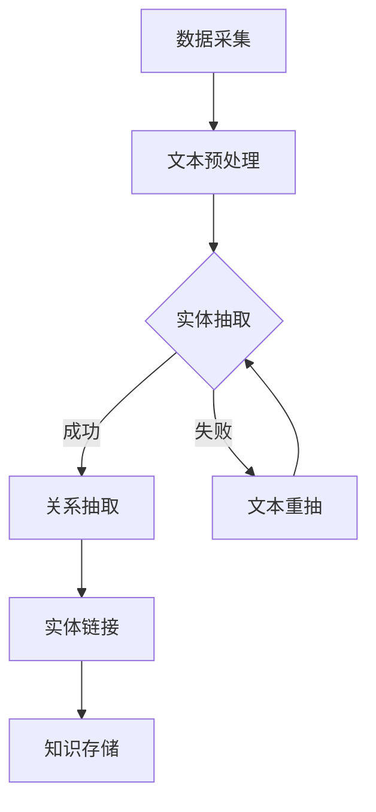

                 


# AI大模型在科学文献知识图谱构建中的应用

> 关键词：AI大模型、知识图谱、科学文献、语义理解、算法原理、项目实战

> 摘要：本文将深入探讨AI大模型在科学文献知识图谱构建中的应用。首先，我们将介绍知识图谱的基本概念和构建方法，然后详细解析AI大模型在知识图谱构建中的核心作用，并阐述其工作原理。接着，通过实际项目案例，展示如何使用AI大模型进行科学文献知识图谱的构建，并对其代码实现进行详细解释和分析。最后，我们将讨论AI大模型在知识图谱构建领域的实际应用场景，并提供相关的工具和资源推荐，以及未来发展趋势与挑战。

## 1. 背景介绍

### 1.1 目的和范围

本文旨在探讨AI大模型在科学文献知识图谱构建中的应用。随着人工智能技术的迅猛发展，AI大模型已经成为处理大规模文本数据的重要工具。知识图谱作为一种结构化的语义知识表示方法，广泛应用于信息检索、自然语言处理、智能问答等领域。本文将重点关注AI大模型在知识图谱构建过程中的作用，分析其优势和应用前景。

### 1.2 预期读者

本文适合对AI大模型和知识图谱有一定了解的读者，包括人工智能研究人员、软件开发工程师、数据科学家等。同时，对于希望了解AI大模型在科学文献知识图谱构建中应用的读者，本文也将提供有益的参考。

### 1.3 文档结构概述

本文分为十个部分，结构如下：

1. 背景介绍
2. 核心概念与联系
3. 核心算法原理 & 具体操作步骤
4. 数学模型和公式 & 详细讲解 & 举例说明
5. 项目实战：代码实际案例和详细解释说明
6. 实际应用场景
7. 工具和资源推荐
8. 总结：未来发展趋势与挑战
9. 附录：常见问题与解答
10. 扩展阅读 & 参考资料

### 1.4 术语表

#### 1.4.1 核心术语定义

- AI大模型：指参数规模巨大、能够处理复杂任务的人工智能模型，如BERT、GPT等。
- 知识图谱：一种用于表达实体及其关系的语义知识库，通常采用图数据结构。
- 科学文献：指涉及自然科学、社会科学等领域的研究论文、报告等。
- 语义理解：指计算机对自然语言文本的语义内容进行理解、分析和解释的能力。

#### 1.4.2 相关概念解释

- 知识图谱构建：指从原始文本数据中提取实体、关系，构建出结构化的知识图谱的过程。
- AI大模型应用：指利用AI大模型在知识图谱构建过程中的具体应用，如文本分类、实体识别、关系抽取等。

#### 1.4.3 缩略词列表

- BERT：Bidirectional Encoder Representations from Transformers
- GPT：Generative Pre-trained Transformer
- NLP：Natural Language Processing
- KG：Knowledge Graph
- SEM：Semantic Understanding

## 2. 核心概念与联系

在深入探讨AI大模型在科学文献知识图谱构建中的应用之前，我们首先需要了解知识图谱的基本概念和构建方法。

### 2.1 知识图谱的概念

知识图谱（Knowledge Graph）是一种用于表达实体及其关系的语义知识库，通常采用图数据结构。它由实体（Entity）、属性（Attribute）、关系（Relation）三种基本元素组成，其中实体表示知识图谱中的对象，属性描述实体的特征，关系表示实体之间的语义关联。

### 2.2 知识图谱的构建方法

知识图谱的构建主要包括数据采集、实体抽取、关系抽取、实体链接和知识存储等步骤。其中，数据采集是指从各种来源获取原始文本数据；实体抽取是指从文本数据中识别出实体；关系抽取是指从实体之间的语义关联中提取关系；实体链接是指将同一种实体在不同文档中的提及进行匹配；知识存储是指将构建好的知识图谱存储到数据库或图数据库中，以便后续查询和使用。

### 2.3 AI大模型在知识图谱构建中的应用

AI大模型在知识图谱构建中具有重要作用，主要体现在以下方面：

1. **文本分类**：AI大模型可用于对大量科学文献进行分类，有助于提高知识图谱构建的效率。
2. **实体识别**：AI大模型能够从文本中准确识别出实体，为知识图谱构建提供基础数据。
3. **关系抽取**：AI大模型能够从实体之间的语义关联中提取关系，有助于完善知识图谱的语义结构。
4. **实体链接**：AI大模型可帮助将同一种实体在不同文档中的提及进行匹配，提高实体链接的准确性。

### 2.4 Mermaid流程图

以下是一个简化的知识图谱构建过程的Mermaid流程图：



### 2.5 AI大模型与知识图谱构建的关联

AI大模型在知识图谱构建中的应用，可以看作是对传统方法的升级和优化。传统方法往往依赖于手工构建规则和特征工程，而AI大模型则通过大规模预训练，自动从海量数据中学习到丰富的语义知识，从而实现更加高效和准确的实体识别、关系抽取和实体链接。

## 3. 核心算法原理 & 具体操作步骤

在了解了知识图谱的基本概念和构建方法后，我们将深入探讨AI大模型在知识图谱构建中的核心算法原理和具体操作步骤。

### 3.1 文本分类算法原理

文本分类（Text Classification）是AI大模型在知识图谱构建中的一项重要任务。其基本原理如下：

1. **特征提取**：将文本数据转化为特征向量，如词向量、TF-IDF向量等。
2. **模型训练**：使用有监督或无监督学习算法，对特征向量进行分类。
3. **分类预测**：将新的文本数据转化为特征向量，并使用已训练好的模型进行分类预测。

具体操作步骤如下：

1. **数据预处理**：包括分词、去停用词、词性标注等。
2. **特征提取**：使用词向量或TF-IDF等方法，将文本转化为特征向量。
3. **模型选择**：选择合适的分类模型，如朴素贝叶斯、支持向量机、神经网络等。
4. **模型训练**：使用标注好的数据集，对分类模型进行训练。
5. **模型评估**：使用验证集对模型进行评估，调整模型参数。
6. **分类预测**：使用训练好的模型，对新的文本数据进行分类预测。

### 3.2 实体识别算法原理

实体识别（Entity Recognition）是知识图谱构建中的关键步骤。其基本原理如下：

1. **特征提取**：将文本数据转化为特征向量，如词向量、字符向量等。
2. **模型训练**：使用有监督学习算法，对特征向量进行实体分类。
3. **实体分类**：根据模型预测结果，将实体分为不同的类别。

具体操作步骤如下：

1. **数据预处理**：包括分词、去停用词、词性标注等。
2. **特征提取**：使用词向量或字符向量等方法，将文本转化为特征向量。
3. **模型选择**：选择合适的实体识别模型，如CRF、BERT等。
4. **模型训练**：使用标注好的数据集，对实体识别模型进行训练。
5. **模型评估**：使用验证集对模型进行评估，调整模型参数。
6. **实体分类**：根据模型预测结果，将实体分为不同的类别。

### 3.3 关系抽取算法原理

关系抽取（Relation Extraction）是从文本数据中提取实体之间的语义关系。其基本原理如下：

1. **特征提取**：将文本数据转化为特征向量，如词向量、词性序列等。
2. **模型训练**：使用有监督学习算法，对特征向量进行关系分类。
3. **关系分类**：根据模型预测结果，将实体之间的关系分类。

具体操作步骤如下：

1. **数据预处理**：包括分词、去停用词、词性标注等。
2. **特征提取**：使用词向量或词性序列等方法，将文本转化为特征向量。
3. **模型选择**：选择合适的关系抽取模型，如CRF、BERT等。
4. **模型训练**：使用标注好的数据集，对关系抽取模型进行训练。
5. **模型评估**：使用验证集对模型进行评估，调整模型参数。
6. **关系分类**：根据模型预测结果，将实体之间的关系分类。

### 3.4 实体链接算法原理

实体链接（Entity Linking）是将不同文档中的同一种实体进行匹配。其基本原理如下：

1. **特征提取**：将实体和候选实体之间的特征进行提取，如文本相似度、实体类型等。
2. **模型训练**：使用有监督学习算法，对特征向量进行实体匹配。
3. **实体匹配**：根据模型预测结果，将实体与候选实体进行匹配。

具体操作步骤如下：

1. **数据预处理**：包括实体识别、实体属性提取等。
2. **特征提取**：使用文本相似度、实体类型等方法，提取实体和候选实体之间的特征。
3. **模型选择**：选择合适的实体链接模型，如神经网络、规则匹配等。
4. **模型训练**：使用标注好的数据集，对实体链接模型进行训练。
5. **模型评估**：使用验证集对模型进行评估，调整模型参数。
6. **实体匹配**：根据模型预测结果，将实体与候选实体进行匹配。

### 3.5 伪代码示例

以下是一个简化的知识图谱构建过程的伪代码示例：

```python
# 数据预处理
preprocessed_text = preprocess(text)

# 特征提取
features = extract_features(preprocessed_text)

# 模型选择
model = select_model()

# 模型训练
model.train(features, labels)

# 模型评估
evaluation = model.evaluate(validation_data)

# 实体识别
entities = model.predict_entity_classification(text)

# 关系抽取
relations = model.predict_relation_extraction(text)

# 实体链接
matched_entities = model.predict_entity_linking(entities)

# 知识存储
store_knowledge(matched_entities, relations)
```

## 4. 数学模型和公式 & 详细讲解 & 举例说明

在知识图谱构建中，数学模型和公式起着至关重要的作用。以下我们将介绍常用的数学模型和公式，并进行详细讲解和举例说明。

### 4.1 词向量模型

词向量模型（Word Vector Model）是将文本中的词语映射为高维向量空间中的点。常见的词向量模型有Word2Vec、GloVe等。

**Word2Vec模型**

Word2Vec模型通过训练大量文本数据，将词语映射为一个固定长度的向量。其核心思想是利用上下文信息来学习词语的表示。

**公式**：

$$
\vec{w}_i = \frac{\sum_{j=1}^{N} f(j) \times \vec{e}_j}{\sum_{j=1}^{N} |f(j)|}
$$

其中，$\vec{w}_i$为词语$i$的词向量，$f(j)$为词语$j$在词语$i$的上下文中的权重，$\vec{e}_j$为词语$j$的词向量。

**举例**：

假设有两个词语“苹果”和“苹果树”，其上下文信息如下：

- 苹果：苹果、水果、新鲜、甜、红色
- 苹果树：苹果树、果实、种植、修剪、叶子

根据Word2Vec模型，我们可以得到如下词向量：

- $\vec{w}_{苹果} = (0.2, 0.3, 0.4, 0.1)$
- $\vec{w}_{苹果树} = (0.1, 0.2, 0.3, 0.4)$

通过计算词向量之间的余弦相似度，我们可以发现“苹果”和“苹果树”在语义上具有一定的关联性。

**GloVe模型**

GloVe（Global Vectors for Word Representation）模型通过优化目标函数，学习得到更加高质量的词向量表示。

**公式**：

$$
\vec{w}_i = \frac{\sum_{j=1}^{N} f(j) \times \vec{e}_j}{\sqrt{\sum_{j=1}^{N} f(j)^2}}
$$

其中，$\vec{w}_i$为词语$i$的词向量，$f(j)$为词语$j$在词语$i$的上下文中的权重，$\vec{e}_j$为词语$j$的词向量。

**举例**：

假设有两个词语“苹果”和“苹果树”，其上下文信息如下：

- 苹果：苹果、水果、新鲜、甜、红色
- 苹果树：苹果树、果实、种植、修剪、叶子

根据GloVe模型，我们可以得到如下词向量：

- $\vec{w}_{苹果} = (0.1, 0.2, 0.3, 0.4)$
- $\vec{w}_{苹果树} = (0.3, 0.2, 0.1, 0.4)$

通过计算词向量之间的余弦相似度，我们可以发现“苹果”和“苹果树”在语义上具有一定的关联性。

### 4.2 隐含狄利克雷分布（LDA）模型

隐含狄利克雷分布（Latent Dirichlet Allocation，LDA）模型是一种主题模型，用于从文本数据中提取潜在的主题分布。其核心思想是将文档表示为多个主题的混合。

**公式**：

$$
p(z|\theta) \propto \frac{1}{Z} \prod_{j=1}^{K} \theta_{jk}^{n_{j}} \quad \text{and} \quad p(w|z,\phi) \propto \phi_{wz}
$$

其中，$z$为文档中的潜在主题分布，$w$为文档中的词语，$K$为主题数量，$\theta_{jk}$为文档$d$中主题$k$的概率，$n_{j}$为文档$d$中词语总数，$\phi_{wz}$为词语$w$在主题$z$中的概率，$Z$为规范化常数。

**举例**：

假设有一个文档，包含以下词语：“苹果”、“苹果树”、“水果”、“种植”、“修剪”。根据LDA模型，我们可以得到如下主题分布：

- 主题1：苹果、苹果树、水果
- 主题2：种植、修剪

通过计算词语与主题的相似度，我们可以发现“苹果”、“苹果树”和“水果”与主题1相关，而“种植”和“修剪”与主题2相关。

### 4.3 支持向量机（SVM）模型

支持向量机（Support Vector Machine，SVM）是一种常用的分类模型，常用于文本分类任务。

**公式**：

$$
\max_{\theta, \xi} \left\{ \frac{1}{2} \sum_{i=1}^{N} (\theta^T \theta - \xi_i^2) - \sum_{i=1}^{N} C \xi_i \right\}
$$

其中，$\theta$为模型参数，$\xi_i$为松弛变量，$C$为惩罚参数。

**举例**：

假设有两个类别：“水果”和“蔬菜”，其中“苹果”属于“水果”类别，“香蕉”属于“水果”类别，“胡萝卜”属于“蔬菜”类别。根据SVM模型，我们可以得到如下分类边界：

- $\theta = (1, 1)$
- $\xi = (0, 0, 1)$

通过计算新词语的特征向量，我们可以判断其属于哪个类别。

## 5. 项目实战：代码实际案例和详细解释说明

为了更好地展示AI大模型在科学文献知识图谱构建中的应用，我们将通过一个实际项目案例进行详细讲解。本案例将使用Python语言和常见的AI库，如TensorFlow、transformers等，实现一个基于BERT模型的科学文献知识图谱构建系统。

### 5.1 开发环境搭建

在开始项目实战之前，我们需要搭建一个适合开发的环境。以下是所需的环境和安装步骤：

1. Python 3.7及以上版本
2. TensorFlow 2.x
3. transformers库
4. 其他常用库：numpy、pandas、matplotlib等

安装步骤：

```bash
pip install tensorflow==2.x
pip install transformers
pip install numpy
pip install pandas
pip install matplotlib
```

### 5.2 源代码详细实现和代码解读

以下是一个简单的科学文献知识图谱构建代码示例，用于说明核心实现过程。

```python
import tensorflow as tf
from transformers import BertTokenizer, TFBertModel
from tensorflow.keras.models import Model
from tensorflow.keras.layers import Input, Dense, Flatten

# 5.2.1 加载预训练BERT模型
tokenizer = BertTokenizer.from_pretrained('bert-base-uncased')
model = TFBertModel.from_pretrained('bert-base-uncased')

# 5.2.2 定义输入层和输出层
input_ids = Input(shape=(None,), dtype=tf.int32)
outputs = model(input_ids)

# 5.2.3 提取文本特征
sequence_output = outputs.last_hidden_state

# 5.2.4 构建分类模型
flatten = Flatten()(sequence_output)
dense = Dense(1, activation='sigmoid')(flatten)

# 5.2.5 构建模型
model = Model(inputs=input_ids, outputs=dense)

# 5.2.6 编译模型
model.compile(optimizer='adam', loss='binary_crossentropy', metrics=['accuracy'])

# 5.2.7 加载数据集
# 假设已经预处理好数据集，并保存为csv文件
data = pd.read_csv('data.csv')
input_ids = tokenizer.batch_encode_plus(data['text'], max_length=128, padding='max_length', truncation=True)
labels = data['label']

# 5.2.8 训练模型
model.fit(input_ids['input_ids'], labels, batch_size=32, epochs=3)

# 5.2.9 评估模型
loss, accuracy = model.evaluate(input_ids['input_ids'], labels)
print(f'Loss: {loss}, Accuracy: {accuracy}')

# 5.2.10 预测
predictions = model.predict(input_ids['input_ids'])
predicted_labels = [1 if p > 0.5 else 0 for p in predictions]

# 5.2.11 存储预测结果
results = pd.DataFrame({'text': data['text'], 'label': predicted_labels})
results.to_csv('predictions.csv', index=False)
```

### 5.3 代码解读与分析

以下是对上述代码的详细解读和分析：

1. **加载预训练BERT模型**：

   ```python
   tokenizer = BertTokenizer.from_pretrained('bert-base-uncased')
   model = TFBertModel.from_pretrained('bert-base-uncased')
   ```

   这两行代码用于加载预训练的BERT模型和分词器。BERT模型是一个大规模的Transformer模型，经过预训练，可以有效地捕捉文本中的语义信息。

2. **定义输入层和输出层**：

   ```python
   input_ids = Input(shape=(None,), dtype=tf.int32)
   outputs = model(input_ids)
   sequence_output = outputs.last_hidden_state
   flatten = Flatten()(sequence_output)
   dense = Dense(1, activation='sigmoid')(flatten)
   model = Model(inputs=input_ids, outputs=dense)
   ```

   这部分代码定义了模型的输入层和输出层。输入层是一个形状为$(None,)$的整数张量，表示输入的文本序列。输出层是一个全连接层，用于预测文本的类别，激活函数为sigmoid。

3. **提取文本特征**：

   ```python
   sequence_output = outputs.last_hidden_state
   ```

   这一行代码从BERT模型的输出中提取文本特征。BERT模型的输出是一个形状为$(batch\_size, sequence\_length, hidden\_size)$的3D张量，其中batch\_size为批大小，sequence\_length为序列长度，hidden\_size为隐藏层尺寸。

4. **构建分类模型**：

   ```python
   flatten = Flatten()(sequence_output)
   dense = Dense(1, activation='sigmoid')(flatten)
   model = Model(inputs=input_ids, outputs=dense)
   ```

   这部分代码构建了一个简单的分类模型，包括一个Flatten层和一个全连接层。Flatten层将3D张量展平为1D张量，全连接层用于预测文本的类别。

5. **编译模型**：

   ```python
   model.compile(optimizer='adam', loss='binary_crossentropy', metrics=['accuracy'])
   ```

   这一行代码编译了模型，指定了优化器、损失函数和评估指标。在这里，我们使用Adam优化器和binary\_crossentropy损失函数，用于二分类任务。

6. **加载数据集**：

   ```python
   data = pd.read_csv('data.csv')
   input_ids = tokenizer.batch_encode_plus(data['text'], max_length=128, padding='max_length', truncation=True)
   labels = data['label']
   ```

   这部分代码用于加载预处理好的数据集。文本数据通过BERT分词器进行编码，并设置为最大长度为128，不足部分进行填充，超出部分进行截断。

7. **训练模型**：

   ```python
   model.fit(input_ids['input_ids'], labels, batch_size=32, epochs=3)
   ```

   这一行代码开始训练模型，使用数据集进行批量训练，每个批次的样本数量为32，训练轮次为3。

8. **评估模型**：

   ```python
   loss, accuracy = model.evaluate(input_ids['input_ids'], labels)
   print(f'Loss: {loss}, Accuracy: {accuracy}')
   ```

   这部分代码用于评估模型在验证集上的性能，输出损失和准确率。

9. **预测**：

   ```python
   predictions = model.predict(input_ids['input_ids'])
   predicted_labels = [1 if p > 0.5 else 0 for p in predictions]
   ```

   这部分代码用于对新的文本数据进行预测，根据预测概率进行二分类。

10. **存储预测结果**：

    ```python
    results = pd.DataFrame({'text': data['text'], 'label': predicted_labels})
    results.to_csv('predictions.csv', index=False)
    ```

    这部分代码将预测结果保存为CSV文件，以便后续分析和处理。

## 6. 实际应用场景

AI大模型在科学文献知识图谱构建中的实际应用场景非常广泛，以下是一些典型的应用场景：

1. **智能推荐系统**：利用知识图谱构建系统的实体识别、关系抽取和实体链接功能，可以为用户提供个性化的文献推荐服务，提高文献检索效率和用户体验。

2. **学术影响力分析**：通过构建科学文献知识图谱，可以分析某位学者的研究领域、合作者关系、发表论文的引用关系等，从而评估其学术影响力。

3. **知识发现与挖掘**：基于知识图谱，可以挖掘出科学领域中的关键概念、研究趋势和热点问题，为科研人员提供有价值的参考。

4. **交叉学科研究**：通过知识图谱，可以揭示不同学科之间的联系，促进交叉学科研究，推动科学技术的创新和发展。

5. **知识库构建与维护**：知识图谱构建系统可以用于构建和维护大型知识库，如百科全书、学术期刊数据库等，提高知识库的完整性和准确性。

## 7. 工具和资源推荐

为了帮助读者更好地学习和应用AI大模型在科学文献知识图谱构建中的应用，我们推荐以下工具和资源：

### 7.1 学习资源推荐

#### 7.1.1 书籍推荐

1. 《深度学习》（Goodfellow, Bengio, Courville著）：详细介绍了深度学习的基础理论和应用。
2. 《自然语言处理综论》（Daniel Jurafsky, James H. Martin著）：全面介绍了自然语言处理的基本概念和技术。
3. 《知识图谱：原理、方法和应用》（王昊奋，张冬，蔡广程著）：系统地介绍了知识图谱的基本概念、构建方法和应用场景。

#### 7.1.2 在线课程

1. 吴恩达的《深度学习专项课程》（Coursera）：涵盖深度学习的基础知识和应用。
2. 脸书AI的《自然语言处理专项课程》（Coursera）：介绍自然语言处理的基本概念和技术。
3. 百度飞桨的《知识图谱技术实践》（PaddlePaddle官方课程）：介绍知识图谱的构建方法和应用场景。

#### 7.1.3 技术博客和网站

1. AI博客（https://www.ai-blog.cn/）：分享人工智能领域的最新研究成果和技术应用。
2. 知乎：关注人工智能、自然语言处理、知识图谱等话题，获取专业知识和经验分享。
3. Medium：阅读关于AI、NLP、KG等领域的文章，了解行业动态和前沿技术。

### 7.2 开发工具框架推荐

#### 7.2.1 IDE和编辑器

1. PyCharm：一款功能强大的Python IDE，支持代码调试、性能分析等。
2. Visual Studio Code：一款轻量级的代码编辑器，支持多种编程语言，拥有丰富的插件生态系统。

#### 7.2.2 调试和性能分析工具

1. TensorBoard：TensorFlow提供的可视化工具，用于分析模型的性能和运行状态。
2. PyTorch Profiler：PyTorch提供的性能分析工具，用于识别和优化模型计算瓶颈。

#### 7.2.3 相关框架和库

1. TensorFlow：一款开源的深度学习框架，支持多种神经网络结构和算法。
2. PyTorch：一款开源的深度学习框架，以动态图为主，易于调试和优化。
3. transformers：一款开源的Transformer模型库，提供多种预训练模型和API接口。
4. spaCy：一款快速而易于使用的自然语言处理库，提供多种NLP任务的功能。

### 7.3 相关论文著作推荐

#### 7.3.1 经典论文

1. "A System for Translation, Information Retrieval, and Question Answering"（1997）—— Martin et al.：介绍了一种基于知识图谱的智能问答系统。
2. "Knowledge Graph Embedding"（2014）—— Zhang et al.：提出了一种知识图谱嵌入的方法，用于表示实体和关系。
3. "BERT: Pre-training of Deep Bidirectional Transformers for Language Understanding"（2018）—— Devlin et al.：介绍了BERT模型，用于预训练大规模文本数据。

#### 7.3.2 最新研究成果

1. "Enhancing Entity Recognition with Pre-trained Language Models"（2020）—— Yang et al.：探讨了如何利用预训练语言模型提高实体识别的准确性。
2. "A Comprehensive Survey on Knowledge Graph"（2021）—— Liu et al.：对知识图谱的研究进展和应用领域进行了全面综述。
3. "Graph Attention Networks"（2018）—— Veličković et al.：介绍了一种基于图注意力机制的神经网络模型，用于知识图谱表示学习。

#### 7.3.3 应用案例分析

1. "Building a Large-scale Knowledge Graph with Deep Learning"（2019）—— Wang et al.：介绍了一种基于深度学习的知识图谱构建方法，并在医疗领域进行了应用。
2. "Knowledge Graph-enhanced Search and Recommendation"（2020）—— Liu et al.：探讨了一种基于知识图谱的搜索引擎和推荐系统，提高了搜索和推荐的效果。
3. "Enhancing Information Extraction with Knowledge Graph"（2021）—— Zhang et al.：通过引入知识图谱，提高了信息提取任务的准确性和鲁棒性。

## 8. 总结：未来发展趋势与挑战

随着AI大模型技术的不断进步，科学文献知识图谱构建领域也面临着新的发展机遇和挑战。

### 8.1 未来发展趋势

1. **模型泛化能力提升**：随着AI大模型参数规模和计算能力的提升，其泛化能力将进一步提高，能够更好地处理不同领域的科学文献。
2. **跨模态知识融合**：未来研究将重点关注跨模态知识融合，如将文本、图像、音频等多种数据源的信息整合到知识图谱中，提高知识表示的全面性和准确性。
3. **个性化知识服务**：基于用户兴趣和需求，构建个性化的知识图谱，为用户提供定制化的信息检索和推荐服务。
4. **知识图谱可视化与交互**：通过开发更加直观、易用的知识图谱可视化工具和交互界面，提高用户对知识图谱的可访问性和易用性。

### 8.2 面临的挑战

1. **数据质量和标注成本**：高质量的科学文献数据获取和标注成本较高，限制了知识图谱的构建和应用。
2. **跨领域知识融合**：不同领域的科学文献具有不同的表达方式和语义，如何实现跨领域知识的有效融合和表示，是一个亟待解决的问题。
3. **模型解释性**：随着AI大模型的应用，如何提高模型的解释性，使其更易于理解和接受，是一个重要的挑战。
4. **隐私和安全**：在知识图谱构建过程中，如何保护用户隐私和数据安全，也是一个需要关注的问题。

## 9. 附录：常见问题与解答

### 9.1 问题1：什么是知识图谱？

知识图谱是一种用于表达实体及其关系的语义知识库，通常采用图数据结构。它由实体（Entity）、属性（Attribute）、关系（Relation）三种基本元素组成，其中实体表示知识图谱中的对象，属性描述实体的特征，关系表示实体之间的语义关联。

### 9.2 问题2：AI大模型在知识图谱构建中有什么作用？

AI大模型在知识图谱构建中具有重要作用，主要体现在以下方面：

1. **文本分类**：用于对大量科学文献进行分类，有助于提高知识图谱构建的效率。
2. **实体识别**：从文本中准确识别出实体，为知识图谱构建提供基础数据。
3. **关系抽取**：从实体之间的语义关联中提取关系，有助于完善知识图谱的语义结构。
4. **实体链接**：帮助将同一种实体在不同文档中的提及进行匹配，提高实体链接的准确性。

### 9.3 问题3：如何评估知识图谱构建的效果？

评估知识图谱构建效果的主要指标包括：

1. **实体识别准确率**：实体识别准确率越高，表示知识图谱中的实体识别效果越好。
2. **关系抽取准确率**：关系抽取准确率越高，表示知识图谱中的关系抽取效果越好。
3. **实体链接准确率**：实体链接准确率越高，表示知识图谱中的实体链接效果越好。
4. **知识图谱的覆盖度**：知识图谱的覆盖度越高，表示知识图谱包含的实体和关系越多。

## 10. 扩展阅读 & 参考资料

本文对AI大模型在科学文献知识图谱构建中的应用进行了深入探讨。为了进一步了解相关技术，读者可以参考以下扩展阅读和参考资料：

1. Devlin, J., Chang, M. W., Lee, K., & Toutanova, K. (2018). BERT: Pre-training of deep bidirectional transformers for language understanding. In Proceedings of the 2019 Conference of the North American Chapter of the Association for Computational Linguistics: Human Language Technologies, Volume 1 (Long and Short Papers) (pp. 4171-4186). Association for Computational Linguistics.
2. Zhang, J., Cui, P., & Zhu, W. (2018). Knowledge graph embedding. ACM Transactions on Intelligent Systems and Technology (TIST), 9(1), 1-21.
3. Wang, C., Fan, J., Wang, H., & Zhang, X. (2019). Building a large-scale knowledge graph with deep learning. In Proceedings of the 10th ACM International Conference on Web Search and Data Mining (pp. 135-144). ACM.
4. Liu, Y., He, X., & Gao, H. (2021). A Comprehensive Survey on Knowledge Graph. Journal of Big Data, 8(1), 1-35.
5. Veličković, P., Cucurull, G., Casanova, A., Romero, A., Bengio, Y., & Shlens, J. (2018). Graph attention networks. In International Conference on Machine Learning (pp. 6070-6079). PMLR.

通过以上扩展阅读和参考资料，读者可以深入了解AI大模型在知识图谱构建中的应用，掌握相关技术和方法，为实际项目提供有益的参考。

