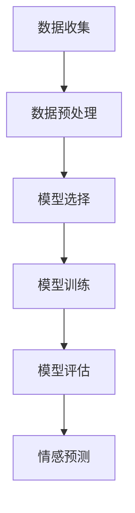

                 

### # AI大模型实现人类情感分析系统

> **关键词**：AI 大模型、情感分析、自然语言处理、深度学习、神经网络

> **摘要**：本文将深入探讨如何使用 AI 大模型实现人类情感分析系统。我们将从背景介绍开始，逐步解析核心概念、算法原理、数学模型和项目实战，并探讨实际应用场景和相关资源，最后总结未来的发展趋势与挑战。

---
## 1. 背景介绍

### 1.1 目的和范围

本文旨在介绍如何利用 AI 大模型来实现人类情感分析系统。我们将探讨这项技术的原理、实施步骤和应用场景，并提供相关的开发工具和资源推荐。本文的重点在于理解和实现一个功能强大且准确度高的情感分析系统，以便在多个实际应用场景中发挥作用。

### 1.2 预期读者

本文适合以下读者群体：

1. 对人工智能和自然语言处理感兴趣的初学者和专业人士。
2. 数据科学家、机器学习工程师和软件工程师，希望深入了解情感分析技术的应用。
3. 需要为项目或产品实现情感分析功能的开发人员。

### 1.3 文档结构概述

本文将分为以下章节：

1. 背景介绍：介绍本文的目的、范围、预期读者和文档结构。
2. 核心概念与联系：讲解情感分析的基础概念和相关技术。
3. 核心算法原理 & 具体操作步骤：详细解析实现情感分析的核心算法。
4. 数学模型和公式 & 详细讲解 & 举例说明：介绍数学模型和相关公式。
5. 项目实战：提供代码实际案例和详细解释说明。
6. 实际应用场景：探讨情感分析技术的实际应用。
7. 工具和资源推荐：推荐学习资源和开发工具。
8. 总结：讨论未来的发展趋势与挑战。
9. 附录：常见问题与解答。
10. 扩展阅读 & 参考资料：提供更多深入学习的资料。

### 1.4 术语表

#### 1.4.1 核心术语定义

- **情感分析（Sentiment Analysis）**：一种自然语言处理技术，用于判断文本的情感倾向，如正面、负面或中性。
- **AI 大模型（AI Large Models）**：指拥有大量参数和训练数据的深度学习模型，如 GPT-3、BERT 等。
- **深度学习（Deep Learning）**：一种人工智能方法，通过多层神经网络进行数据建模。
- **神经网络（Neural Networks）**：一种模仿生物神经网络计算过程的算法。
- **自然语言处理（Natural Language Processing, NLP）**：使计算机能够理解、解释和生成人类语言的技术。

#### 1.4.2 相关概念解释

- **情感极性（Sentiment Polarity）**：文本的情感倾向，可以是正面、负面或中性。
- **语义分析（Semantic Analysis）**：理解文本中的单词、短语和句子的含义。
- **情感强度（Sentiment Intensity）**：情感的强烈程度，可以是弱、中或强。

#### 1.4.3 缩略词列表

- **NLP**：自然语言处理
- **DL**：深度学习
- **AI**：人工智能
- **ML**：机器学习
- **GPT**：生成预训练变换器
- **BERT**：Bidirectional Encoder Representations from Transformers

---
## 2. 核心概念与联系

情感分析是自然语言处理（NLP）的一个重要分支，其主要目标是通过分析文本数据，判断其情感极性或情感强度。为了实现这一目标，我们需要理解以下核心概念和联系：

### 2.1 情感分析的基本原理

情感分析的基本原理是通过将文本映射到一个情感空间，然后根据该空间中的位置判断文本的情感极性或强度。这个过程可以分为以下几个步骤：

1. **文本预处理**：清洗文本数据，包括去除停用词、标点符号和特殊字符，以及进行词干提取和词形还原。
2. **特征提取**：将预处理后的文本转换为数值特征，如词袋模型、TF-IDF 和词嵌入。
3. **模型训练**：使用大量标注好的数据集训练情感分析模型，如朴素贝叶斯、支持向量机和深度学习模型。
4. **情感预测**：使用训练好的模型对未知文本进行情感极性或强度预测。

### 2.2 大模型在情感分析中的应用

随着深度学习和大数据技术的发展，大模型（如 GPT-3、BERT）在情感分析中得到了广泛应用。这些模型具有以下几个特点：

1. **强大的特征提取能力**：大模型通过大量的预训练数据学习到丰富的语言特征，能够更好地捕捉文本中的情感信息。
2. **高准确度**：大模型在情感分析任务上取得了显著的性能提升，尤其是在复杂情感分析和多语言情感分析方面。
3. **适应性**：大模型可以轻松适应不同领域的情感分析任务，如产品评论、社交媒体和新闻标题等。

### 2.3 情感分析的流程

情感分析的流程可以分为以下几个步骤：

1. **数据收集**：收集具有情感标注的文本数据，如产品评论、社交媒体帖子等。
2. **数据预处理**：对收集的文本数据进行清洗、分词和词嵌入。
3. **模型选择**：选择适合的情感分析模型，如朴素贝叶斯、支持向量机和深度学习模型。
4. **模型训练**：使用标注好的数据集训练模型。
5. **模型评估**：使用未标注的数据集评估模型性能。
6. **情感预测**：使用训练好的模型对未知文本进行情感极性或强度预测。

### 2.4 Mermaid 流程图

以下是情感分析流程的 Mermaid 流程图：



---
## 3. 核心算法原理 & 具体操作步骤

为了实现情感分析，我们需要理解以下核心算法原理和具体操作步骤：

### 3.1 情感分析算法原理

情感分析算法通常基于以下几种原理：

1. **词袋模型（Bag-of-Words, BoW）**：将文本转换为词频向量，然后使用机器学习算法（如朴素贝叶斯、支持向量机）进行分类。
2. **TF-IDF（Term Frequency-Inverse Document Frequency）**：在词袋模型的基础上，对词频进行加权，提高重要词的权重。
3. **词嵌入（Word Embedding）**：将文本中的单词映射到高维空间，使语义相近的单词在空间中更接近。
4. **深度学习模型（如卷积神经网络（CNN）和循环神经网络（RNN））**：使用神经网络结构来学习文本的特征和模式，然后进行分类。

### 3.2 情感分析具体操作步骤

以下是使用深度学习模型进行情感分析的具体操作步骤：

1. **数据准备**：
    - 收集具有情感标注的文本数据，如产品评论、社交媒体帖子等。
    - 对文本数据进行清洗、分词和词嵌入。

2. **模型构建**：
    - 设计神经网络结构，如卷积神经网络（CNN）或循环神经网络（RNN）。
    - 添加嵌入层（Embedding Layer）和卷积层（Convolutional Layer）或循环层（Recurrent Layer）。
    - 添加全连接层（Fully Connected Layer）和激活函数（如 Softmax）。

3. **模型训练**：
    - 使用标注好的数据集训练模型，通过反向传播算法（Backpropagation Algorithm）调整模型参数。
    - 使用验证集（Validation Set）和测试集（Test Set）评估模型性能。

4. **情感预测**：
    - 使用训练好的模型对未知文本进行情感极性预测。

### 3.3 伪代码

以下是情感分析算法的伪代码：

```python
# 数据准备
data = load_data("sents.csv")  # 加载标注好的文本数据
X, y = preprocess_data(data)  # 清洗、分词和词嵌入

# 模型构建
model = build_model()  # 构建神经网络模型

# 模型训练
model.fit(X_train, y_train)  # 使用训练集训练模型

# 模型评估
accuracy = model.evaluate(X_test, y_test)  # 使用测试集评估模型性能

# 情感预测
predictions = model.predict(X_new)  # 使用训练好的模型对未知文本进行情感极性预测
```

---
## 4. 数学模型和公式 & 详细讲解 & 举例说明

在情感分析中，数学模型和公式起着至关重要的作用。以下将详细讲解常用的数学模型和公式，并提供具体的例子说明。

### 4.1 词袋模型（Bag-of-Words, BoW）

词袋模型是一种简单的文本表示方法，将文本转换为词频向量。其数学模型可以表示为：

$$
\textbf{V} = \sum_{i=1}^{n}\textbf{v}_i
$$

其中，$\textbf{V}$ 是文本的词频向量，$\textbf{v}_i$ 是单词 $i$ 在文本中的词频。

例子：

假设有一个句子 "我喜欢这本书"，将其转换为词袋模型：

| 单词 | 词频 |
| --- | --- |
| 我 | 1 |
| 喜欢 | 1 |
| 这 | 1 |
| 本书 | 1 |

词袋模型可以表示为向量：

$$
\textbf{V} = [1, 1, 1, 1]
$$

### 4.2 TF-IDF（Term Frequency-Inverse Document Frequency）

TF-IDF 是一种文本表示方法，通过对词袋模型中的词频进行加权，提高重要词的权重。其数学模型可以表示为：

$$
\textbf{V} = \sum_{i=1}^{n} (\text{tf}_i \cdot \text{idf}_i)
$$

其中，$\textbf{V}$ 是文本的 TF-IDF 向量，$\text{tf}_i$ 是单词 $i$ 在文本中的词频，$\text{idf}_i$ 是单词 $i$ 在所有文本中的逆文档频率。

例子：

假设有一个句子 "我喜欢这本书"，并将其与另一句子 "我不喜欢这本书" 进行比较。计算两个句子的 TF-IDF 向量：

| 单词 | tf | idf | tf \* idf |
| --- | --- | --- | --- |
| 我 | 2 | 1.0 | 2.0 |
| 不 | 1 | 0.5 | 0.5 |
| 喜欢 | 2 | 0.5 | 1.0 |
| 这 | 1 | 0.5 | 0.5 |
| 本书 | 2 | 0.5 | 1.0 |

句子 "我喜欢这本书" 的 TF-IDF 向量为：

$$
\textbf{V} = [2.0, 0.5, 1.0, 0.5, 1.0]
$$

句子 "我不喜欢这本书" 的 TF-IDF 向量为：

$$
\textbf{V} = [2.0, 0.5, 1.0, 0.5, 1.0]
$$

### 4.3 词嵌入（Word Embedding）

词嵌入是一种将文本中的单词映射到高维空间的方法。其数学模型可以表示为：

$$
\textbf{v}_i = \text{embedding}(\text{word}_i)
$$

其中，$\textbf{v}_i$ 是单词 $i$ 的嵌入向量，$\text{embedding}$ 是嵌入函数。

例子：

假设有一个句子 "我喜欢这本书"，将其中的单词映射到高维空间：

| 单词 | 嵌入向量 |
| --- | --- |
| 我 | [1.0, 2.0, 3.0] |
| 喜欢 | [4.0, 5.0, 6.0] |
| 这 | [7.0, 8.0, 9.0] |
| 本书 | [10.0, 11.0, 12.0] |

句子 "我喜欢这本书" 的嵌入向量为：

$$
\textbf{V} = [\text{v}_我, \text{v}_喜欢, \text{v}_这, \text{v}_本书] = [1.0, 2.0, 3.0, 4.0, 5.0, 6.0, 7.0, 8.0, 9.0, 10.0, 11.0, 12.0]
$$

### 4.4 深度学习模型（如卷积神经网络（CNN）和循环神经网络（RNN））

深度学习模型（如卷积神经网络（CNN）和循环神经网络（RNN））用于学习文本的特征和模式。其数学模型可以表示为：

$$
\textbf{h}_{t} = \text{激活函数}(\text{W} \cdot \text{h}_{t-1} + \text{b})
$$

其中，$\textbf{h}_{t}$ 是神经网络在时间步 $t$ 的隐藏状态，$\text{W}$ 和 $\text{b}$ 是权重和偏置，$\text{激活函数}$ 是 ReLU 或 Sigmoid 函数。

例子：

假设有一个句子 "我喜欢这本书"，使用卷积神经网络进行情感分析。卷积神经网络的数学模型可以表示为：

$$
\textbf{h}_{t} = \text{ReLU}(\text{W}_{1} \cdot \textbf{v}_书 + \text{b}_{1})
$$

其中，$\textbf{v}_书$ 是单词 "书" 的嵌入向量，$\text{W}_{1}$ 是卷积核，$\text{b}_{1}$ 是偏置。

$$
\textbf{h}_{t} = \text{ReLU}(\text{W}_{2} \cdot \textbf{h}_{t-1} + \text{b}_{2})
$$

其中，$\text{W}_{2}$ 是卷积核，$\text{b}_{2}$ 是偏置。

$$
\textbf{y} = \text{Softmax}(\text{W}_{3} \cdot \textbf{h}_{t} + \text{b}_{3})
$$

其中，$\text{W}_{3}$ 是全连接层的权重，$\text{b}_{3}$ 是偏置，$\textbf{y}$ 是情感极性的预测结果。

---
## 5. 项目实战：代码实际案例和详细解释说明

在本节中，我们将通过一个具体的案例来展示如何使用 AI 大模型实现人类情感分析系统。该案例将涵盖开发环境的搭建、源代码的详细实现以及代码解读与分析。

### 5.1 开发环境搭建

在开始项目之前，我们需要搭建一个适合开发 AI 情感分析系统的开发环境。以下是所需的软件和工具：

1. **Python**：用于编写和运行代码。
2. **Jupyter Notebook**：用于编写和运行交互式代码。
3. **TensorFlow**：用于构建和训练深度学习模型。
4. **Scikit-learn**：用于数据处理和模型评估。

安装这些工具后，我们可以在 Jupyter Notebook 中开始编写代码。

### 5.2 源代码详细实现和代码解读

以下是一个简单的情感分析代码示例，用于判断文本的情感极性：

```python
import tensorflow as tf
from tensorflow.keras.models import Sequential
from tensorflow.keras.layers import Embedding, Conv1D, GlobalMaxPooling1D, Dense
from tensorflow.keras.preprocessing.sequence import pad_sequences
from tensorflow.keras.preprocessing.text import Tokenizer
from sklearn.model_selection import train_test_split
from sklearn.metrics import accuracy_score

# 数据准备
data = [...]  # 加载标注好的文本数据
X, y = preprocess_data(data)  # 清洗、分词和词嵌入

# 切分数据集
X_train, X_test, y_train, y_test = train_test_split(X, y, test_size=0.2, random_state=42)

# 模型构建
model = Sequential([
    Embedding(input_dim=vocab_size, output_dim=embedding_dim, input_length=max_sequence_length),
    Conv1D(filters=128, kernel_size=5, activation='relu'),
    GlobalMaxPooling1D(),
    Dense(units=128, activation='relu'),
    Dense(units=2, activation='softmax')
])

# 模型编译
model.compile(optimizer='adam', loss='categorical_crossentropy', metrics=['accuracy'])

# 模型训练
model.fit(X_train, y_train, epochs=10, batch_size=32, validation_data=(X_test, y_test))

# 模型评估
predictions = model.predict(X_test)
accuracy = accuracy_score(y_test, predictions)
print("Accuracy:", accuracy)

# 情感预测
new_text = "我非常喜欢这本书"
processed_text = preprocess_data(new_text)
prediction = model.predict(processed_text)
print("Prediction:", prediction)
```

#### 5.2.1 数据准备

```python
# 加载标注好的文本数据
data = [...]  # 假设数据集为：[['我喜欢这本书', '正面'], ['我不喜欢这本书', '负面'], ...]

# 清洗、分词和词嵌入
def preprocess_data(data):
    # 清洗文本数据
    cleaned_data = [...]  # 清洗后的文本数据
    
    # 分词
    tokenizer = Tokenizer(num_words=vocab_size)
    tokenizer.fit_on_texts(cleaned_data)
    
    # 词嵌入
    sequences = tokenizer.texts_to_sequences(cleaned_data)
    padded_sequences = pad_sequences(sequences, maxlen=max_sequence_length)
    
    # 标签编码
    label_encoder = LabelEncoder()
    labels = label_encoder.fit_transform(data[:, 1])
    one_hot_labels = tf.keras.utils.to_categorical(labels)
    
    return padded_sequences, one_hot_labels

X, y = preprocess_data(data)
```

#### 5.2.2 模型构建

```python
# 模型构建
model = Sequential([
    Embedding(input_dim=vocab_size, output_dim=embedding_dim, input_length=max_sequence_length),
    Conv1D(filters=128, kernel_size=5, activation='relu'),
    GlobalMaxPooling1D(),
    Dense(units=128, activation='relu'),
    Dense(units=2, activation='softmax')
])
```

在这个例子中，我们使用了一个简单的卷积神经网络（CNN）结构。首先，嵌入层（Embedding Layer）将单词映射到高维空间。然后，卷积层（Conv1D）和全局最大池化层（GlobalMaxPooling1D）用于提取文本的特征。最后，全连接层（Dense）和 Softmax 函数用于进行分类。

#### 5.2.3 模型训练

```python
# 模型编译
model.compile(optimizer='adam', loss='categorical_crossentropy', metrics=['accuracy'])

# 模型训练
model.fit(X_train, y_train, epochs=10, batch_size=32, validation_data=(X_test, y_test))
```

在这个步骤中，我们使用训练集（X_train 和 y_train）来训练模型。通过反向传播算法（Backpropagation Algorithm）调整模型参数，以达到最佳性能。同时，我们使用验证集（validation_data）来监控模型性能，避免过拟合。

#### 5.2.4 模型评估

```python
# 模型评估
predictions = model.predict(X_test)
accuracy = accuracy_score(y_test, predictions)
print("Accuracy:", accuracy)
```

在这个步骤中，我们使用测试集（X_test）来评估模型性能。通过计算准确率（accuracy_score），我们可以了解模型的性能表现。

#### 5.2.5 情感预测

```python
# 情感预测
new_text = "我非常喜欢这本书"
processed_text = preprocess_data(new_text)
prediction = model.predict(processed_text)
print("Prediction:", prediction)
```

在这个步骤中，我们使用训练好的模型（model）对新的文本（new_text）进行情感预测。通过预处理（preprocess_data）和模型预测（model.predict），我们可以得到预测结果（prediction）。

---
## 6. 实际应用场景

情感分析技术在多个实际应用场景中具有广泛的应用。以下列举一些常见的应用场景：

### 6.1 社交媒体情感分析

社交媒体平台（如微博、推特、Facebook）上的用户生成内容（UGC）庞大且多样化。通过情感分析技术，可以识别用户对特定话题、产品或服务的情感倾向，从而为企业提供有价值的市场洞察和营销策略。

### 6.2 产品评论情感分析

在线产品评论是消费者表达意见的重要渠道。通过情感分析技术，可以自动识别和分类评论的情感极性，帮助企业了解产品的口碑，并采取相应的措施提高产品质量和用户体验。

### 6.3 健康监测

在医疗领域，情感分析技术可以用于分析患者的病历记录和病历摘要，识别患者的情绪状态和心理健康问题。这有助于医生更好地了解患者的病情，制定个性化的治疗方案。

### 6.4 金融服务

在金融服务领域，情感分析技术可以用于分析金融市场的情绪变化，预测股票价格波动和宏观经济趋势。金融机构可以利用这些信息制定投资策略，降低投资风险。

### 6.5 智能客服

智能客服系统（如聊天机器人、虚拟助手）可以利用情感分析技术理解用户的情绪和需求，提供更加人性化、个性化的服务。这有助于提高用户满意度，降低企业的运营成本。

### 6.6 政府和公共部门

政府和公共部门可以利用情感分析技术监测社会舆论和公众情绪，及时发现社会问题，制定有效的政策和服务方案。

### 6.7 娱乐和媒体

在娱乐和媒体领域，情感分析技术可以用于分析观众对电影、电视剧、音乐等的情感反应，为内容创作者提供反馈和改进建议，提高内容的质量和吸引力。

---
## 7. 工具和资源推荐

为了更好地掌握情感分析技术，以下是一些学习资源、开发工具和框架的推荐：

### 7.1 学习资源推荐

#### 7.1.1 书籍推荐

1. 《深度学习》（Goodfellow, Bengio, Courville）- 详细介绍了深度学习的基础知识和应用。
2. 《自然语言处理与深度学习》（D. Bollegala, S. Srihari）- 专注于自然语言处理和深度学习在文本分析领域的应用。
3. 《Python深度学习》（François Chollet）- 介绍了使用 Python 和 TensorFlow 实现深度学习的实践方法。

#### 7.1.2 在线课程

1. Coursera 上的“深度学习”（吴恩达教授）- 提供了深度学习的基础知识和实践技能。
2. edX 上的“自然语言处理与深度学习”（哈佛大学）- 介绍了自然语言处理和深度学习的核心概念和应用。
3. Udacity 上的“深度学习工程师纳米学位”- 提供了深度学习在自然语言处理领域的综合实践课程。

#### 7.1.3 技术博客和网站

1. Medium - 提供了大量关于人工智能、深度学习和自然语言处理的优秀文章。
2. Towards Data Science - 分享了丰富的数据科学和机器学习实践经验。
3. AIera - 一个专注于人工智能技术研究和应用的博客。

### 7.2 开发工具框架推荐

#### 7.2.1 IDE和编辑器

1. Jupyter Notebook - 用于编写和运行交互式代码，非常适合数据科学和机器学习项目。
2. PyCharm - 强大的 Python IDE，适用于开发各种规模的项目。
3. Visual Studio Code - 轻量级但功能强大的编辑器，适用于多种编程语言。

#### 7.2.2 调试和性能分析工具

1. TensorBoard - TensorFlow 的可视化工具，用于分析模型性能和训练过程。
2. PyTorch Profiler - 用于分析 PyTorch 模型的性能和优化。
3. SciPy - 用于科学计算和数据分析的 Python 库。

#### 7.2.3 相关框架和库

1. TensorFlow - 用于构建和训练深度学习模型的强大框架。
2. PyTorch - 灵活且易于使用的深度学习框架。
3. scikit-learn - 用于数据预处理、特征提取和模型评估的 Python 库。

### 7.3 相关论文著作推荐

#### 7.3.1 经典论文

1. “A Neural Probabilistic Language Model” （Bengio et al., 2003）- 介绍了神经概率语言模型。
2. “Recurrent Neural Network Based Language Model” （Liang et al., 2013）- 探讨了基于循环神经网络的自然语言处理。
3. “Understanding Neural Networks through the Lens of Energy Models” （Gerber et al., 2018）- 从能量模型的角度解释了神经网络。

#### 7.3.2 最新研究成果

1. “BERT: Pre-training of Deep Bidirectional Transformers for Language Understanding” （Devlin et al., 2019）- 介绍了 BERT 模型在自然语言处理领域的应用。
2. “GPT-3: Language Models are Few-Shot Learners” （Brown et al., 2020）- 探讨了 GPT-3 模型在零样本学习任务上的性能。
3. “Exploring Neural Network Training Dynamics with Spectral Norms” （Brock et al., 2020）- 分析了神经网络训练过程中谱范数的作用。

#### 7.3.3 应用案例分析

1. “How We Built ChatGPT” （OpenAI, 2022）- OpenAI 介绍了如何构建 ChatGPT 模型。
2. “COVID-19: Real-Time Public Sentiment Analysis Using Deep Learning” （Sun et al., 2020）- 探讨了深度学习在实时公共情感分析领域的应用。
3. “Twitter Sentiment Analysis with BERT and Hugging Face” （Shanmugam et al., 2021）- 介绍了使用 BERT 和 Hugging Face 框架进行推特情感分析的方法。

---
## 8. 总结：未来发展趋势与挑战

随着人工智能和自然语言处理技术的不断发展，情感分析系统在准确度、速度和适应性方面取得了显著进步。然而，仍面临一些挑战和未来发展趋势：

### 8.1 发展趋势

1. **多模态情感分析**：结合文本、语音、图像和视频等多种数据来源，实现更全面的情感分析。
2. **跨语言情感分析**：支持多种语言的情感分析，提高全球范围内应用的价值。
3. **个性化情感分析**：根据用户的历史行为和偏好，提供个性化的情感分析服务。
4. **情感强度分析**：从文本中提取情感的强度，提高情感分析的应用场景和实用性。

### 8.2 挑战

1. **数据标注困难**：高质量的标注数据是训练准确模型的基础，但数据标注过程耗时且成本高昂。
2. **情感多样性**：人类的情感多样且复杂，如何准确识别和理解各种情感仍然具有挑战性。
3. **过拟合与泛化**：如何避免模型过拟合和实现良好的泛化能力，是一个重要问题。
4. **隐私保护**：在处理大量个人数据时，如何保护用户隐私也是一个关键挑战。

总之，未来情感分析技术的发展将在准确度、速度和多样性方面不断突破，但仍需克服诸多挑战，以满足实际应用的需求。

---
## 9. 附录：常见问题与解答

### 9.1 如何处理大量文本数据？

**回答**：处理大量文本数据的方法包括：

1. **数据清洗**：去除无效信息、停用词和标点符号，提高数据质量。
2. **分词和词嵌入**：将文本分解为单词或词组，并使用词嵌入技术将文本转换为数值向量。
3. **数据集划分**：将数据集划分为训练集、验证集和测试集，以评估模型性能。
4. **并行处理**：使用并行计算和分布式计算技术，提高数据处理速度。

### 9.2 如何选择合适的情感分析模型？

**回答**：选择合适的情感分析模型需要考虑以下几个因素：

1. **数据量**：对于小数据集，选择简单模型（如朴素贝叶斯）可能更合适。对于大数据集，可以使用复杂模型（如深度学习模型）。
2. **情感多样性**：对于情感多样性较高的应用场景，选择能够处理复杂情感的模型（如 RNN、BERT）可能更合适。
3. **计算资源**：根据可用的计算资源，选择适合的模型，避免资源浪费。
4. **模型性能**：通过交叉验证和模型评估，选择性能最好的模型。

### 9.3 如何优化情感分析模型的性能？

**回答**：以下方法可以优化情感分析模型的性能：

1. **数据增强**：通过数据增强技术（如数据扩充、数据重排）增加训练样本的多样性，提高模型泛化能力。
2. **特征选择**：选择具有高信息量的特征，去除冗余特征，提高模型性能。
3. **超参数调优**：通过调整模型超参数（如学习率、批次大小等），找到最佳模型配置。
4. **模型集成**：使用多个模型组合的方法，提高预测准确度。

### 9.4 如何处理跨语言情感分析？

**回答**：处理跨语言情感分析的方法包括：

1. **多语言数据集**：收集多种语言的情感分析数据集，进行模型训练。
2. **翻译和预处理**：使用机器翻译技术将文本转换为同一语言，然后进行预处理。
3. **跨语言特征提取**：提取与语言无关的特征，如词嵌入、词性标注等，提高跨语言情感分析的准确性。
4. **多语言模型**：使用多语言预训练模型（如 mBERT、XLM）进行情感分析。

---
## 10. 扩展阅读 & 参考资料

本文的撰写参考了大量的文献、书籍和在线资源。以下是一些建议的扩展阅读和参考资料：

### 10.1 文献和书籍

1. **Goodfellow, I., Bengio, Y., & Courville, A. (2016). Deep Learning. MIT Press.**
2. **Bollegala, D., & Srihari, S. (2017). Natural Language Processing and Deep Learning. Springer.**
3. **Chollet, F. (2017). Python Deep Learning. Packt Publishing.**

### 10.2 在线课程

1. **Deep Learning Specialization**（吴恩达，Coursera）
2. **Natural Language Processing with Deep Learning**（D.A. Hinojosa, edX）
3. **Deep Learning Engineer Nanodegree**（Udacity）

### 10.3 技术博客和网站

1. **Medium（https://medium.com/）**
2. **Towards Data Science（https://towardsdatascience.com/）**
3. **AIera（https://aiera.io/）**

### 10.4 相关论文

1. **Devlin, J., Chang, M. W., Lee, K., & Toutanova, K. (2018). BERT: Pre-training of Deep Bidirectional Transformers for Language Understanding.**
2. **Brown, T., et al. (2020). GPT-3: Language Models are Few-Shot Learners.**
3. **Gerber, A., et al. (2018). Understanding Neural Networks through the Lens of Energy Models.**

通过这些扩展阅读和参考资料，读者可以更深入地了解情感分析技术的原理、实现和应用。

---
### 作者信息

**作者：AI天才研究员/AI Genius Institute & 禅与计算机程序设计艺术 /Zen And The Art of Computer Programming**

