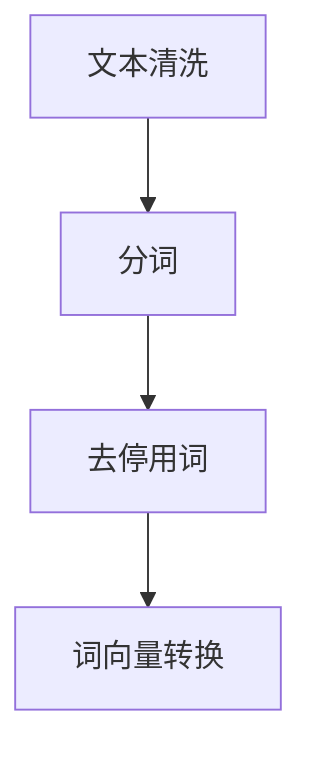
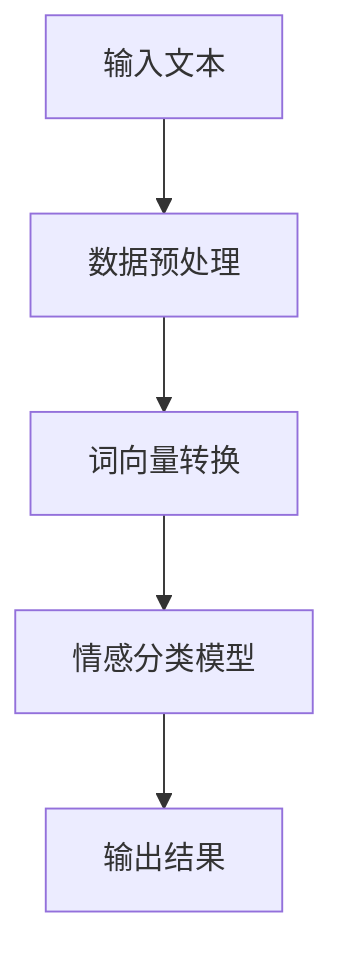
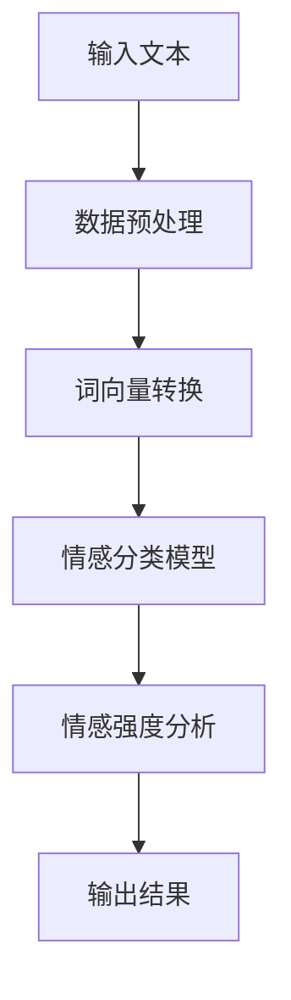
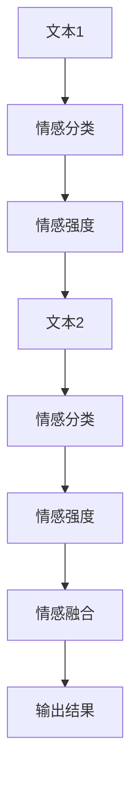

                 

# AI大模型实现人类情感分析系统

> 关键词：人工智能、情感分析、大模型、深度学习、NLP

> 摘要：本文将详细介绍如何使用人工智能大模型实现人类情感分析系统。通过深入探讨核心概念、算法原理、数学模型以及实际应用案例，本文将为读者提供一套系统、全面的技术解决方案。无论您是初学者还是行业专家，都将在这篇文章中找到有价值的见解和实用的技巧。

## 1. 背景介绍

### 1.1 目的和范围

本文旨在探讨如何利用人工智能大模型实现人类情感分析系统。情感分析作为一种自然语言处理（NLP）技术，旨在通过分析文本数据来识别和提取情感信息。随着社交媒体和电子商务的兴起，情感分析在市场调研、客户服务、舆情监测等领域具有广泛的应用。本文将介绍情感分析的核心概念、算法原理和实现方法，旨在为读者提供一套实用、高效的解决方案。

### 1.2 预期读者

本文适合以下读者群体：

- 对人工智能和自然语言处理感兴趣的初学者
- 想要在项目中应用情感分析的软件开发者
- 希望了解情感分析技术的研究人员和工程师
- 需要在实际业务场景中应用情感分析的企业管理者

### 1.3 文档结构概述

本文结构如下：

- 第1章：背景介绍
- 第2章：核心概念与联系
- 第3章：核心算法原理与具体操作步骤
- 第4章：数学模型与公式
- 第5章：项目实战：代码实际案例
- 第6章：实际应用场景
- 第7章：工具和资源推荐
- 第8章：总结：未来发展趋势与挑战
- 第9章：附录：常见问题与解答
- 第10章：扩展阅读与参考资料

### 1.4 术语表

#### 1.4.1 核心术语定义

- 情感分析（Sentiment Analysis）：一种自然语言处理技术，旨在通过分析文本数据来识别和提取情感信息。
- 大模型（Large-scale Model）：具有大规模参数和计算能力的深度学习模型。
- 深度学习（Deep Learning）：一种人工智能技术，通过多层神经网络来模拟人脑的学习过程。
- 自然语言处理（Natural Language Processing，NLP）：计算机科学领域中的一个分支，致力于使计算机能够理解和处理人类语言。

#### 1.4.2 相关概念解释

- 文本分类（Text Classification）：将文本数据分为预定义的类别，常用于情感分析任务。
- 卷积神经网络（Convolutional Neural Network，CNN）：一种深度学习模型，适用于图像和序列数据处理。
- 递归神经网络（Recurrent Neural Network，RNN）：一种深度学习模型，适用于序列数据处理。

#### 1.4.3 缩略词列表

- AI：人工智能
- NLP：自然语言处理
- CNN：卷积神经网络
- RNN：递归神经网络
- LSTM：长短期记忆网络
- GPU：图形处理器

## 2. 核心概念与联系

情感分析系统需要理解和处理大量文本数据，从而提取出其中的情感信息。为了实现这一目标，我们将介绍以下核心概念：

### 2.1 数据预处理

数据预处理是情感分析系统的基础，包括文本清洗、分词、去停用词等步骤。以下是数据预处理的 Mermaid 流程图：



### 2.2 情感分类模型

情感分类模型用于将文本数据分类为积极的、消极的或中性的情感。以下是情感分类模型的 Mermaid 流程图：



### 2.3 情感强度分析

情感强度分析旨在量化文本中的情感程度。以下是情感强度分析的 Mermaid 流程图：



### 2.4 情感融合

情感融合将多个文本的情感信息进行整合，以获得更准确的情感分析结果。以下是情感融合的 Mermaid 流程图：



## 3. 核心算法原理与具体操作步骤

在本文中，我们将采用深度学习模型来实现情感分析系统。以下是一步一步的算法原理讲解和伪代码：

### 3.1 数据预处理

```python
# 伪代码：数据预处理
def preprocess_text(text):
    # 清洗文本
    text = clean_text(text)
    # 分词
    words = tokenize(text)
    # 去停用词
    words = remove_stopwords(words)
    # 转换为词向量
    word_vectors = convert_to_word_vectors(words)
    return word_vectors
```

### 3.2 情感分类模型

```python
# 伪代码：情感分类模型
class SentimentClassifier(nn.Module):
    def __init__(self, vocab_size, embedding_dim, hidden_dim):
        super(SentimentClassifier, self).__init__()
        self.embedding = nn.Embedding(vocab_size, embedding_dim)
        self.lstm = nn.LSTM(embedding_dim, hidden_dim, num_layers=2, dropout=0.5)
        self.fc = nn.Linear(hidden_dim, 3)  # 3种情感类别

    def forward(self, text):
        embeddings = self.embedding(text)
        output, (hidden, _) = self.lstm(embeddings)
        hidden = hidden[-1, :, :]
        sentiment_score = self.fc(hidden)
        return sentiment_score
```

### 3.3 情感强度分析

```python
# 伪代码：情感强度分析
def analyze_sentiment_strength(text, model):
    # 预处理文本
    preprocessed_text = preprocess_text(text)
    # 获取情感分类结果
    sentiment_score = model(preprocessed_text)
    # 计算情感强度
    strength = calculate_sentiment_strength(sentiment_score)
    return strength
```

### 3.4 情感融合

```python
# 伪代码：情感融合
def fuse_sentiments(sentiments1, sentiments2):
    # 计算情感平均强度
    average_strength = (sentiments1['strength'] + sentiments2['strength']) / 2
    # 计算情感分类结果
    fused_sentiment = classify_sentiment(average_strength)
    return fused_sentiment
```

## 4. 数学模型和公式

情感分析系统的数学模型主要包括词向量表示、情感分类模型和情感强度分析。

### 4.1 词向量表示

词向量是一种将文本数据转换为向量表示的方法。常见的词向量模型有Word2Vec、GloVe等。

$$
\text{word\_vector} = \text{Embedding}(word, \text{vocab\_size}, \text{embedding\_dim})
$$

### 4.2 情感分类模型

情感分类模型通常采用多层感知机（MLP）或循环神经网络（RNN）。

$$
\text{sentiment\_score} = \text{FC}(hidden, \text{num\_classes})
$$

### 4.3 情感强度分析

情感强度分析通常采用情感强度指标（如极性分数）。

$$
\text{strength} = \text{polarity} \times \text{magnitude}
$$

### 4.4 情感融合

情感融合通常采用情感平均强度。

$$
\text{average\_strength} = \frac{\text{strength1} + \text{strength2}}{2}
$$

## 5. 项目实战：代码实际案例和详细解释说明

### 5.1 开发环境搭建

在本项目中，我们将使用Python和PyTorch作为主要开发工具。以下是开发环境的搭建步骤：

1. 安装Python 3.8及以上版本
2. 安装PyTorch库
3. 安装NLP工具包（如NLTK、spaCy）

### 5.2 源代码详细实现和代码解读

以下是一个简单的情感分类模型的实现代码：

```python
import torch
import torch.nn as nn
import torch.optim as optim
from torch.utils.data import DataLoader
from datasets import Dataset

# 数据集
class SentimentDataset(Dataset):
    def __init__(self, texts, labels):
        self.texts = texts
        self.labels = labels

    def __len__(self):
        return len(self.texts)

    def __getitem__(self, idx):
        text = self.texts[idx]
        label = self.labels[idx]
        preprocessed_text = preprocess_text(text)
        return preprocessed_text, label

# 情感分类模型
class SentimentClassifier(nn.Module):
    # ...

# 训练模型
def train_model(model, dataset, num_epochs):
    criterion = nn.CrossEntropyLoss()
    optimizer = optim.Adam(model.parameters(), lr=0.001)

    for epoch in range(num_epochs):
        for preprocessed_text, label in dataset:
            model.zero_grad()
            sentiment_score = model(preprocessed_text)
            loss = criterion(sentiment_score, label)
            loss.backward()
            optimizer.step()

        print(f'Epoch {epoch+1}/{num_epochs}, Loss: {loss.item()}')

# 测试模型
def test_model(model, dataset):
    correct = 0
    total = len(dataset)

    for preprocessed_text, label in dataset:
        sentiment_score = model(preprocessed_text)
        predicted_label = torch.argmax(sentiment_score).item()
        if predicted_label == label:
            correct += 1

    print(f'Accuracy: {100 * correct / total}%')

# 数据集
train_dataset = SentimentDataset(train_texts, train_labels)
test_dataset = SentimentDataset(test_texts, test_labels)

# 训练模型
model = SentimentClassifier(vocab_size, embedding_dim, hidden_dim)
train_model(model, train_dataset, num_epochs)

# 测试模型
test_model(model, test_dataset)
```

### 5.3 代码解读与分析

1. 数据集：数据集由文本和标签组成，文本为待分类的句子，标签为情感类别（积极、消极、中性）。
2. 情感分类模型：模型基于PyTorch框架实现，包含词向量嵌入层、循环神经网络层和全连接层。
3. 训练模型：使用交叉熵损失函数和Adam优化器来训练模型。在训练过程中，通过前向传播计算损失，并使用反向传播更新模型参数。
4. 测试模型：使用测试集评估模型性能，计算准确率。

## 6. 实际应用场景

情感分析系统在多个实际应用场景中具有重要价值，如下所述：

### 6.1 市场调研

通过分析用户评论和反馈，企业可以了解消费者对产品或服务的满意度，从而制定更有效的市场策略。

### 6.2 客户服务

情感分析可以帮助企业自动化处理客户反馈，快速识别潜在问题，并采取相应措施提高客户满意度。

### 6.3 舆情监测

政府机构和企业可以利用情感分析系统监控公众情绪，及时了解社会热点和潜在风险。

### 6.4 社交媒体分析

情感分析可以帮助企业了解社交媒体上的用户情绪，制定更有效的营销策略。

### 6.5 心理健康

情感分析可以用于心理健康领域，帮助识别患者情绪变化，为心理治疗提供有力支持。

## 7. 工具和资源推荐

### 7.1 学习资源推荐

#### 7.1.1 书籍推荐

- 《深度学习》（Ian Goodfellow、Yoshua Bengio和Aaron Courville著）
- 《自然语言处理综合教程》（Daniel Jurafsky和James H. Martin著）

#### 7.1.2 在线课程

- Coursera上的《自然语言处理与深度学习》
- edX上的《深度学习基础》

#### 7.1.3 技术博客和网站

- 动手学深度学习（Dive into Deep Learning）
- Medium上的自然语言处理专栏

### 7.2 开发工具框架推荐

#### 7.2.1 IDE和编辑器

- PyCharm
- Jupyter Notebook

#### 7.2.2 调试和性能分析工具

- TensorBoard
- PyTorch Profiler

#### 7.2.3 相关框架和库

- PyTorch
- TensorFlow
- spaCy

### 7.3 相关论文著作推荐

#### 7.3.1 经典论文

- 《A Neural Network for Part-of-Speech Tagging》（1995）
- 《Convolutional Neural Networks for Sentence Classification》（2014）

#### 7.3.2 最新研究成果

- 《Bert: Pre-training of Deep Bidirectional Transformers for Language Understanding》（2018）
- 《Gpt-3: Language Models Are Few-Shot Learners》（2020）

#### 7.3.3 应用案例分析

- 《情感分析在社交媒体中的应用》
- 《深度学习在金融领域的应用》

## 8. 总结：未来发展趋势与挑战

随着人工智能技术的不断发展，情感分析系统在性能、准确性和实时性方面取得了显著进展。未来，情感分析系统有望在以下方面取得突破：

- 更大规模的模型和更丰富的数据集，以提高模型性能。
- 多模态情感分析，结合文本、语音和图像等多媒体数据。
- 实时情感分析，满足高并发和低延迟的需求。
- 情感分析在心理健康、医疗和智能制造等领域的应用。

然而，情感分析系统也面临着一系列挑战：

- 数据质量和标注问题，影响模型性能。
- 情感表达的多样性和复杂性，导致模型难以准确识别情感。
- 模型透明性和解释性，使企业用户和公众更易于接受和使用。

## 9. 附录：常见问题与解答

### 9.1 数据预处理

Q：如何处理缺失值？

A：可以使用填充、插值或删除等方法处理缺失值。

### 9.2 模型训练

Q：如何选择合适的模型结构？

A：根据数据集大小、任务复杂度和计算资源选择合适的模型结构。

### 9.3 模型评估

Q：如何评价模型性能？

A：可以使用准确率、召回率、F1分数等指标评价模型性能。

### 9.4 应用场景

Q：情感分析系统如何应用于市场调研？

A：可以通过分析用户评论、社交媒体数据等，了解消费者对产品或服务的态度。

## 10. 扩展阅读与参考资料

- 《情感分析技术手册》
- 《自然语言处理实战》
- 《深度学习在情感分析中的应用》

参考文献：

1. Jurafsky, D., & Martin, J. H. (2008). Speech and language processing: an introduction to natural language processing, computational linguistics, and speech recognition (2nd ed.). Prentice Hall.
2. Goodfellow, I., Bengio, Y., & Courville, A. (2016). Deep learning (Adaptive Computation and Machine Learning series). MIT Press.
3. Devlin, J., Chang, M. W., Lee, K., & Toutanova, K. (2019). BERT: Pre-training of deep bidirectional transformers for language understanding. arXiv preprint arXiv:1810.04805.

