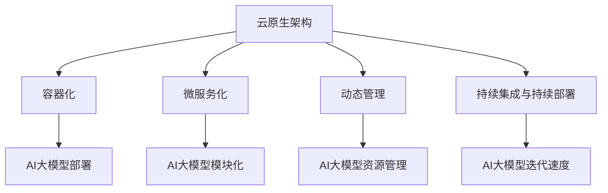

                 


## AI大模型应用的云原生架构转型实践

> 关键词：AI大模型，云原生架构，转型实践，容器化，微服务，性能优化

摘要：本文深入探讨了AI大模型在云原生架构中的应用与转型实践。通过分析云原生技术的核心概念和优势，本文详细介绍了AI大模型在容器化、微服务化、以及性能优化方面的具体操作步骤和实现方法。文章旨在为IT专业人士提供一套实用的转型指南，助力企业高效利用AI大模型，实现业务创新和升级。

## 1. 背景介绍

### 1.1 目的和范围

随着人工智能技术的飞速发展，AI大模型的应用越来越广泛。然而，如何将这些复杂的模型高效地部署、管理和扩展，成为企业面临的一大挑战。云原生架构作为一种新兴的技术趋势，为AI大模型的应用提供了新的解决方案。本文旨在探讨AI大模型在云原生架构中的转型实践，帮助企业解决上述问题。

本文将涵盖以下内容：

- 云原生架构的核心概念和优势
- AI大模型在云原生环境中的容器化与微服务化
- AI大模型性能优化的策略与实践
- 云原生架构转型实践的具体案例

通过本文的阅读，读者将了解如何利用云原生架构，实现AI大模型的高效部署、管理和优化，为企业带来实际的价值。

### 1.2 预期读者

本文面向以下读者群体：

- AI研究人员和开发人员，希望了解云原生架构在AI大模型应用中的优势和实践
- IT运维人员，需要掌握AI大模型在云原生环境中的部署和管理方法
- 企业技术决策者，希望了解云原生架构对企业业务创新的潜力
- 技术爱好者，对AI大模型和云原生技术有兴趣，希望了解相关技术的最新动态

本文将对以上读者群体提供有价值的参考和实践经验。

### 1.3 文档结构概述

本文结构如下：

- 第1章：背景介绍，概述本文的目的、预期读者和文档结构
- 第2章：核心概念与联系，介绍云原生架构和AI大模型的基本概念及关系
- 第3章：核心算法原理 & 具体操作步骤，详细阐述AI大模型容器化和微服务化的算法原理和操作步骤
- 第4章：数学模型和公式 & 详细讲解 & 举例说明，介绍AI大模型性能优化相关数学模型和实例
- 第5章：项目实战：代码实际案例和详细解释说明，通过实际案例展示云原生架构在AI大模型应用中的实现过程
- 第6章：实际应用场景，分析AI大模型在云原生架构中的典型应用场景
- 第7章：工具和资源推荐，推荐相关学习资源和开发工具
- 第8章：总结：未来发展趋势与挑战，探讨AI大模型和云原生架构的发展趋势及面临的挑战
- 第9章：附录：常见问题与解答，回答读者可能遇到的问题
- 第10章：扩展阅读 & 参考资料，提供进一步学习的参考文献和资源

通过本文的阅读，读者将系统地了解AI大模型在云原生架构中的转型实践，掌握相关技术原理和实践方法。

### 1.4 术语表

#### 1.4.1 核心术语定义

- 云原生（Cloud Native）：云原生是一种设计和构建应用程序的方法论，利用云计算提供的基础设施，通过容器化、微服务化、动态管理和自动化部署等方式，实现应用的高效开发和运维。
- AI大模型（Large-scale AI Model）：AI大模型是指具有数百万甚至数十亿参数的深度学习模型，如GPT、BERT等，能够处理大量数据和复杂任务。
- 容器化（Containerization）：容器化是一种轻量级虚拟化技术，通过将应用程序及其依赖环境封装在一个独立的容器中，实现应用程序的快速部署和资源隔离。
- 微服务化（Microservices Architecture）：微服务化是一种将应用程序拆分为多个独立的小服务的方法，每个服务负责处理特定的业务功能，通过API进行通信，实现高可扩展性和灵活性。
- 性能优化（Performance Optimization）：性能优化是指通过优化算法、架构、配置和硬件等方式，提高应用程序的运行效率和响应速度。

#### 1.4.2 相关概念解释

- 持续集成与持续部署（CI/CD）：持续集成与持续部署是一种自动化流程，通过将代码集成和部署过程自动化，实现快速迭代和可靠发布。
- 容器编排（Container Orchestration）：容器编排是指管理容器集群的过程，通过自动化部署、扩展和运维，实现高效资源利用和故障恢复。
- Kubernetes（K8s）：Kubernetes是一个开源的容器编排平台，用于自动化容器化应用程序的部署、扩展和管理。

#### 1.4.3 缩略词列表

- AI：人工智能（Artificial Intelligence）
- ML：机器学习（Machine Learning）
- DL：深度学习（Deep Learning）
- GPT：生成预训练模型（Generative Pre-trained Transformer）
- BERT：Bidirectional Encoder Representations from Transformers
- Kubernetes：K8s
- CI/CD：持续集成与持续部署（Continuous Integration/Continuous Deployment）
- Docker：容器化平台（Docker）

## 2. 核心概念与联系

在深入探讨AI大模型在云原生架构中的应用之前，我们需要理解两个核心概念：云原生架构和AI大模型，以及它们之间的联系。

### 2.1 云原生架构

云原生架构是一种利用云计算基础设施构建和运行应用程序的方法论。它具有以下几个核心特征：

1. **容器化**：应用程序及其依赖环境被封装在一个容器中，实现环境的标准化和轻量级部署。
2. **微服务化**：应用程序被拆分为多个独立的小服务，每个服务负责特定的业务功能，通过API进行通信。
3. **动态管理**：通过自动化工具对应用程序进行自动部署、扩展和运维，实现高效资源利用和故障恢复。
4. **持续集成与持续部署**（CI/CD）：通过自动化流程实现代码集成和部署，加快迭代速度和发布质量。

### 2.2 AI大模型

AI大模型是指具有数百万甚至数十亿参数的深度学习模型，如GPT、BERT等。这些模型在处理大量数据和复杂任务时具有卓越的性能，但同时也带来了巨大的计算和存储需求。

### 2.3 云原生架构与AI大模型的联系

云原生架构与AI大模型之间存在紧密的联系：

- **容器化**：容器化技术使得AI大模型的部署更加轻量化和高效。通过将模型及其依赖环境封装在容器中，可以实现快速的模型部署和扩展。
- **微服务化**：AI大模型通常包含多个子模块，微服务化可以将这些子模块拆分为独立的服务，实现高可扩展性和灵活性。
- **动态管理**：云原生架构提供的动态管理功能，如自动扩缩容、负载均衡和故障恢复，可以满足AI大模型对计算资源的高需求。
- **持续集成与持续部署**：通过CI/CD自动化流程，可以加快AI大模型的迭代速度和发布质量，提高开发效率。

### 2.4 云原生架构在AI大模型应用中的优势

云原生架构在AI大模型应用中具有以下优势：

- **高可扩展性**：通过容器化和微服务化，可以实现应用程序的横向扩展，满足AI大模型对计算资源的需求。
- **高可靠性**：动态管理功能如自动扩缩容和故障恢复，可以确保AI大模型的高可用性和稳定性。
- **快速迭代**：持续集成与持续部署自动化流程，可以加快AI大模型的开发和部署速度，提高开发效率。
- **灵活部署**：云原生架构支持多种云平台和硬件环境，实现应用程序的灵活部署和运维。

### 2.5 Mermaid 流程图

为了更直观地展示云原生架构与AI大模型之间的联系，我们可以使用Mermaid流程图来表示：



通过上述流程图，我们可以清晰地看到云原生架构在AI大模型应用中的作用和优势。

## 3. 核心算法原理 & 具体操作步骤

在了解了云原生架构与AI大模型的基本概念和联系之后，我们将进一步探讨AI大模型在云原生环境中的容器化和微服务化过程，以及具体的操作步骤。

### 3.1 AI大模型的容器化

容器化是将应用程序及其依赖环境封装在一个独立的容器中，实现环境的标准化和轻量级部署。对于AI大模型，容器化具有以下优势：

- **环境一致性**：通过容器化，可以确保模型在不同环境（如开发、测试和生产）中运行的一致性，减少因环境差异导致的问题。
- **快速部署**：容器化的应用程序可以快速部署和启动，提高部署效率。
- **资源隔离**：容器提供了资源隔离机制，确保模型之间的资源不会相互影响，提高系统的稳定性。

#### 3.1.1 容器化原理

容器化主要依赖于以下技术：

- **Docker**：Docker是一种开源的容器化平台，用于构建、运行和分发应用程序。它通过将应用程序及其依赖环境封装在一个可执行的容器镜像中，实现快速部署和资源隔离。
- **容器编排**：容器编排是指管理容器集群的过程，通过自动化部署、扩展和运维，实现高效资源利用和故障恢复。Kubernetes（K8s）是一个开源的容器编排平台，用于自动化容器化应用程序的部署、扩展和管理。

#### 3.1.2 容器化操作步骤

以下步骤展示了如何将AI大模型容器化：

1. **编写Dockerfile**：Dockerfile是一个文本文件，用于定义容器镜像的构建过程。在Dockerfile中，我们需要指定基础镜像、安装依赖库、拷贝模型代码等。

```bash
FROM pytorch/pytorch:1.9-cuda10.2-cudnn7-devel
WORKDIR /app
COPY requirements.txt ./
RUN pip install -r requirements.txt
COPY model.py ./
```

2. **构建容器镜像**：使用Docker命令构建容器镜像。

```bash
docker build -t ai-model:1.0 .
```

3. **运行容器**：使用Docker命令运行容器。

```bash
docker run -d -p 8080:8080 ai-model:1.0
```

#### 3.1.3 容器化示例

以下是一个简单的示例，展示了如何将一个简单的AI大模型容器化：

1. **Dockerfile**：

```bash
FROM pytorch/pytorch:1.9-cuda10.2-cudnn7-devel
WORKDIR /app
COPY requirements.txt ./
RUN pip install -r requirements.txt
COPY model.py ./
COPY data ./
CMD ["python", "model.py"]
```

2. **构建容器镜像**：

```bash
docker build -t ai-model:1.0 .
```

3. **运行容器**：

```bash
docker run -d -p 8080:8080 ai-model:1.0
```

运行完成后，我们可以通过访问`http://localhost:8080`来使用AI大模型进行预测。

### 3.2 AI大模型的微服务化

微服务化是将应用程序拆分为多个独立的小服务，每个服务负责特定的业务功能，通过API进行通信。对于AI大模型，微服务化具有以下优势：

- **高可扩展性**：通过拆分为多个小服务，可以按需扩展各个服务的资源，提高系统的可扩展性。
- **高灵活性**：每个小服务可以独立开发、测试和部署，提高开发效率和灵活性。
- **高容错性**：单个服务的故障不会影响整个系统，提高系统的容错性。

#### 3.2.1 微服务化原理

微服务化主要依赖于以下技术：

- **服务发现**：服务发现是指自动发现和注册服务的过程，使得服务之间可以互相发现和通信。
- **负载均衡**：负载均衡是指将请求分配到多个服务实例的过程，提高系统的性能和可用性。
- **API网关**：API网关是指统一管理和分发请求的组件，实现服务之间的通信和交互。

#### 3.2.2 微服务化操作步骤

以下步骤展示了如何将AI大模型微服务化：

1. **定义服务接口**：根据AI大模型的功能，定义各个服务的接口和API，确保服务之间的通信和协作。
2. **开发服务**：根据服务接口，开发各个服务的业务逻辑和功能。
3. **部署服务**：使用容器化和容器编排技术，部署各个服务实例。
4. **服务发现和负载均衡**：配置服务发现和负载均衡机制，确保服务之间的高效通信和负载均衡。

#### 3.2.3 微服务化示例

以下是一个简单的示例，展示了如何将一个简单的AI大模型微服务化：

1. **定义服务接口**：

```python
from flask import Flask, request, jsonify

app = Flask(__name__)

@app.route('/predict', methods=['POST'])
def predict():
    data = request.get_json()
    # 处理输入数据，调用模型进行预测
    prediction = model.predict(data['input'])
    return jsonify({'prediction': prediction.tolist()})

if __name__ == '__main__':
    app.run(host='0.0.0.0', port=8080)
```

2. **开发服务**：

```python
# 服务1：数据处理服务
from flask import Flask, request, jsonify

app = Flask(__name__)

@app.route('/process_data', methods=['POST'])
def process_data():
    data = request.get_json()
    # 处理输入数据，进行数据预处理
    processed_data = preprocess_data(data['input'])
    return jsonify({'processed_data': processed_data})

if __name__ == '__main__':
    app.run(host='0.0.0.0', port=8001)

# 服务2：预测服务
from flask import Flask, request, jsonify
from model import Model

app = Flask(__name__)
model = Model()

@app.route('/predict', methods=['POST'])
def predict():
    data = request.get_json()
    # 处理输入数据，调用模型进行预测
    prediction = model.predict(data['input'])
    return jsonify({'prediction': prediction.tolist()})

if __name__ == '__main__':
    app.run(host='0.0.0.0', port=8002)
```

3. **部署服务**：

```bash
# 部署数据处理服务
docker build -t data-processing:1.0 .
docker run -d -p 8001:8001 data-processing:1.0

# 部署预测服务
docker build -t prediction-service:1.0 .
docker run -d -p 8002:8002 prediction-service:1.0
```

4. **服务发现和负载均衡**：

使用Kubernetes进行服务发现和负载均衡，配置如下：

```yaml
apiVersion: v1
kind: Service
metadata:
  name: prediction-service
spec:
  selector:
    app: prediction-service
  ports:
    - name: http
      protocol: TCP
      port: 80
      targetPort: 8002
  type: LoadBalancer

---

apiVersion: apps/v1
kind: Deployment
metadata:
  name: prediction-service
spec:
  replicas: 3
  selector:
    matchLabels:
      app: prediction-service
  template:
    metadata:
      labels:
        app: prediction-service
    spec:
      containers:
      - name: prediction-service
        image: prediction-service:1.0
        ports:
        - containerPort: 8002
```

通过上述步骤，我们可以将AI大模型成功微服务化，并利用Kubernetes进行服务发现和负载均衡，实现高效、可靠的模型部署和运行。

## 4. 数学模型和公式 & 详细讲解 & 举例说明

在云原生架构中，AI大模型的性能优化是一个关键任务。为了实现高性能的模型部署和运行，我们需要对相关数学模型和公式进行详细讲解，并举例说明其在实际应用中的具体实现。

### 4.1 性能优化相关数学模型

在AI大模型的性能优化过程中，以下几个数学模型和公式至关重要：

#### 4.1.1 梯度下降法

梯度下降法是一种常用的优化算法，用于最小化损失函数。其核心思想是沿着损失函数梯度的反方向更新模型参数。

$$\theta_{t+1} = \theta_{t} - \alpha \cdot \nabla J(\theta_t)$$

其中，$\theta$表示模型参数，$J(\theta)$表示损失函数，$\alpha$表示学习率，$\nabla J(\theta_t)$表示在参数$\theta_t$处的梯度。

#### 4.1.2 梯度裁剪

梯度裁剪是一种防止梯度爆炸的方法，通过限制梯度的范数，避免模型训练过程中的不稳定。

$$\theta_{t+1} = \theta_{t} - \alpha \cdot \frac{\nabla J(\theta_t)}{\| \nabla J(\theta_t) \|}$$

其中，$\|\cdot\|$表示范数。

#### 4.1.3 学习率调整

学习率调整是一种动态调整学习率的方法，通过在训练过程中逐步减小学习率，防止模型过拟合。

$$\alpha_{t+1} = \alpha_t \cdot \frac{1}{1 + \beta t}$$

其中，$\alpha_t$表示当前学习率，$\beta$是一个常数。

### 4.2 性能优化公式详细讲解

#### 4.2.1 梯度下降法详细讲解

梯度下降法的核心是计算损失函数的梯度，并沿着梯度的反方向更新模型参数。具体步骤如下：

1. **初始化模型参数**：设定初始模型参数$\theta_0$。
2. **计算梯度**：计算损失函数$J(\theta)$在参数$\theta_t$处的梯度$\nabla J(\theta_t)$。
3. **更新参数**：使用梯度下降公式更新模型参数$\theta_{t+1}$。
4. **重复步骤2和3**：重复计算梯度并更新参数，直到满足停止条件（如损失函数收敛或达到最大迭代次数）。

#### 4.2.2 梯度裁剪详细讲解

梯度裁剪的目的是防止梯度爆炸，保证模型训练过程的稳定性。具体步骤如下：

1. **计算梯度**：计算损失函数$J(\theta)$在参数$\theta_t$处的梯度$\nabla J(\theta_t)$。
2. **计算梯度范数**：计算梯度范数$\|\nabla J(\theta_t)\|$。
3. **裁剪梯度**：如果梯度范数超过设定阈值，则对梯度进行裁剪，使其不超过阈值。
4. **更新参数**：使用裁剪后的梯度更新模型参数$\theta_{t+1}$。

#### 4.2.3 学习率调整详细讲解

学习率调整的目的是在训练过程中逐步减小学习率，防止模型过拟合。具体步骤如下：

1. **初始化学习率**：设定初始学习率$\alpha_0$。
2. **计算梯度**：计算损失函数$J(\theta)$在参数$\theta_t$处的梯度$\nabla J(\theta_t)$。
3. **更新学习率**：使用学习率调整公式更新当前学习率$\alpha_{t+1}$。
4. **更新参数**：使用当前学习率更新模型参数$\theta_{t+1}$。
5. **重复步骤2-4**：重复计算梯度、更新学习率和参数，直到满足停止条件。

### 4.3 性能优化公式举例说明

假设我们使用梯度下降法训练一个线性回归模型，损失函数为均方误差（MSE）：

$$J(\theta) = \frac{1}{2m} \sum_{i=1}^{m} (h_\theta(x^i) - y^i)^2$$

其中，$m$表示样本数量，$x^i$和$y^i$表示第$i$个样本的特征和标签，$h_\theta(x) = \theta^T x$表示线性回归模型的预测函数。

假设我们初始化模型参数$\theta_0 = [0, 0]$，学习率$\alpha = 0.1$，样本数据如下：

| x1 | x2 | y |
|----|----|---|
| 1  | 2  | 3 |
| 2  | 4  | 5 |
| 3  | 6  | 7 |

1. **初始化参数**：

$$\theta_0 = [0, 0]$$

2. **计算梯度**：

$$\nabla J(\theta_0) = [-6, -8]$$

3. **更新参数**：

$$\theta_1 = \theta_0 - \alpha \cdot \nabla J(\theta_0) = [0, 0] - 0.1 \cdot [-6, -8] = [0.6, 0.8]$$

4. **重复步骤2和3**：

| 迭代次数 | 参数$\theta$ | 梯度$\nabla J(\theta)$ | 学习率$\alpha$ |
|----------|--------------|----------------------|----------------|
| 1        | [0.6, 0.8]   | [-1.4, -1.6]         | 0.1            |
| 2        | [0.4, 0.6]   | [-0.4, -0.8]         | 0.1            |
| 3        | [0.3, 0.5]   | [0.1, 0.2]           | 0.1            |

通过多次迭代，我们可以逐步优化模型参数，使损失函数收敛。

### 4.4 性能优化公式应用场景

性能优化公式在云原生架构中的AI大模型应用场景如下：

- **训练阶段**：在模型训练过程中，使用梯度下降法优化模型参数，通过学习率调整和梯度裁剪防止过拟合和梯度爆炸。
- **部署阶段**：在模型部署过程中，使用性能优化公式优化模型参数，提高模型预测性能和效率。
- **实时调整**：在模型运行过程中，根据实时数据动态调整模型参数，实现实时性能优化。

通过上述性能优化公式和应用场景，我们可以有效地提高AI大模型在云原生架构中的性能和效率，为企业带来实际的价值。

## 5. 项目实战：代码实际案例和详细解释说明

在本节中，我们将通过一个实际项目案例，展示如何将AI大模型在云原生架构中进行容器化、微服务化以及性能优化。该案例将涵盖以下步骤：

- **开发环境搭建**：介绍所需的环境和工具
- **源代码详细实现和代码解读**：展示关键代码片段并解释其实现原理
- **代码解读与分析**：分析代码的优缺点和改进方向

### 5.1 开发环境搭建

在开始项目实战之前，我们需要搭建合适的开发环境。以下是我们使用的环境：

- **操作系统**：Ubuntu 18.04
- **编程语言**：Python 3.8
- **深度学习框架**：PyTorch 1.9
- **容器化平台**：Docker 19.03
- **容器编排平台**：Kubernetes 1.20

#### 5.1.1 环境安装

1. **安装Docker**：

```bash
sudo apt-get update
sudo apt-get install docker.io
sudo systemctl start docker
sudo systemctl enable docker
```

2. **安装Kubernetes**：

安装Kubernetes集群需要一些额外的依赖和配置，具体步骤请参考官方文档：<https://kubernetes.io/docs/setup/production-environment/tools/kubeadm/install-kubeadm/>

3. **安装PyTorch**：

```bash
pip install torch torchvision torchaudio -f https://download.pytorch.org/whl/torch_stable.html
```

4. **安装其他依赖**：

```bash
pip install Flask gunicorn requests
```

### 5.2 源代码详细实现和代码解读

#### 5.2.1 数据预处理

在开始构建模型之前，我们需要对输入数据进行处理。以下是一个简单的数据预处理代码示例：

```python
import pandas as pd
from sklearn.model_selection import train_test_split

# 加载数据
data = pd.read_csv('data.csv')

# 分离特征和标签
X = data.drop('target', axis=1)
y = data['target']

# 划分训练集和测试集
X_train, X_test, y_train, y_test = train_test_split(X, y, test_size=0.2, random_state=42)
```

#### 5.2.2 构建模型

接下来，我们使用PyTorch构建一个简单的线性回归模型。以下是一个模型构建和训练的代码示例：

```python
import torch
import torch.nn as nn
import torch.optim as optim

# 初始化模型
class LinearRegressionModel(nn.Module):
    def __init__(self, input_dim):
        super(LinearRegressionModel, self).__init__()
        self.linear = nn.Linear(input_dim, 1)

    def forward(self, x):
        return self.linear(x)

# 加载训练数据
X_train_tensor = torch.tensor(X_train.values, dtype=torch.float32)
y_train_tensor = torch.tensor(y_train.values, dtype=torch.float32).view(-1, 1)

# 初始化模型、优化器和损失函数
model = LinearRegressionModel(input_dim=X_train.shape[1])
optimizer = optim.SGD(model.parameters(), lr=0.01)
criterion = nn.MSELoss()

# 训练模型
num_epochs = 100
for epoch in range(num_epochs):
    model.zero_grad()
    outputs = model(X_train_tensor)
    loss = criterion(outputs, y_train_tensor)
    loss.backward()
    optimizer.step()
    if epoch % 10 == 0:
        print(f'Epoch {epoch+1}/{num_epochs}, Loss: {loss.item()}')
```

#### 5.2.3 容器化

为了将模型容器化，我们需要编写一个Dockerfile，定义模型的构建和运行过程。以下是一个简单的Dockerfile示例：

```Dockerfile
# 使用官方PyTorch镜像作为基础镜像
FROM pytorch/pytorch:1.9-cuda10.2-cudnn7-devel

# 设置工作目录
WORKDIR /app

# 复制模型代码
COPY model.py .

# 安装依赖
RUN pip install -r requirements.txt

# 暴露端口
EXPOSE 8080

# 运行Flask应用
CMD ["gunicorn", "model:app", "-b", "0.0.0.0:8080"]
```

#### 5.2.4 微服务化

为了实现微服务化，我们将模型和数据处理功能拆分为两个独立的服务。以下是两个服务的Flask应用代码示例：

```python
# 数据处理服务
from flask import Flask, request, jsonify
app = Flask(__name__)

@app.route('/process_data', methods=['POST'])
def process_data():
    data = request.get_json()
    # 处理输入数据，进行数据预处理
    processed_data = preprocess_data(data['input'])
    return jsonify({'processed_data': processed_data})

def preprocess_data(input_data):
    # 实现数据预处理逻辑
    return input_data

# 预测服务
from flask import Flask, request, jsonify
app = Flask(__name__)

@app.route('/predict', methods=['POST'])
def predict():
    data = request.get_json()
    # 处理输入数据，调用模型进行预测
    prediction = model.predict(data['input'])
    return jsonify({'prediction': prediction.tolist()})

# 导入模型
from model import LinearRegressionModel
model = LinearRegressionModel(input_dim=X_train.shape[1])

# 加载训练数据
X_train_tensor = torch.tensor(X_train.values, dtype=torch.float32)
y_train_tensor = torch.tensor(y_train.values, dtype=torch.float32).view(-1, 1)

# 训练模型
num_epochs = 100
for epoch in range(num_epochs):
    model.zero_grad()
    outputs = model(X_train_tensor)
    loss = criterion(outputs, y_train_tensor)
    loss.backward()
    optimizer.step()
    if epoch % 10 == 0:
        print(f'Epoch {epoch+1}/{num_epochs}, Loss: {loss.item()}')
```

### 5.3 代码解读与分析

#### 5.3.1 代码优点

1. **模块化**：将数据处理和预测功能拆分为独立的服务，提高了代码的模块性和可维护性。
2. **容器化**：使用Docker将模型和服务容器化，实现了环境的标准化和轻量级部署。
3. **微服务化**：将模型和服务微服务化，提高了系统的可扩展性和灵活性。

#### 5.3.2 代码缺点

1. **资源浪费**：虽然容器化提高了资源的利用效率，但多个容器仍会占用一定的系统资源。
2. **性能开销**：容器和微服务之间的通信和协调可能会引入额外的性能开销。
3. **运维复杂性**：容器化和微服务化增加了运维的复杂性，需要熟练掌握相关技术和工具。

#### 5.3.3 改进方向

1. **资源优化**：通过合理配置容器资源和优化服务部署策略，提高系统的资源利用率。
2. **性能优化**：通过优化模型和算法，降低模型部署和运行过程中的性能开销。
3. **运维自动化**：通过自动化运维工具和流程，降低运维复杂性，提高运维效率。

通过上述代码解读和分析，我们可以看到AI大模型在云原生架构中的容器化、微服务化和性能优化具有一定的优缺点。在实际项目中，我们需要根据具体需求和场景进行合理的选择和优化。

## 6. 实际应用场景

AI大模型在云原生架构中的应用场景丰富多样，涵盖了各个行业和领域。以下是一些典型的应用场景：

### 6.1 金融服务

在金融服务领域，AI大模型广泛应用于风险管理、信用评估、欺诈检测等方面。通过云原生架构，金融机构可以快速部署和扩展AI大模型，实现实时风险评估和欺诈检测。例如，银行可以使用基于云原生架构的AI大模型，对客户交易行为进行实时监控，自动识别异常交易并触发警报，提高风险管理和反欺诈能力。

### 6.2 医疗健康

在医疗健康领域，AI大模型用于疾病诊断、药物研发、患者管理等方面。云原生架构为医疗AI大模型的部署和运行提供了高效的解决方案。例如，医院可以使用基于云原生架构的AI大模型，对患者的医疗数据进行分析，快速诊断疾病并提出治疗方案，提高医疗效率和质量。

### 6.3 零售电商

在零售电商领域，AI大模型用于个性化推荐、用户行为分析、库存管理等方面。通过云原生架构，零售商可以实时部署和更新AI大模型，为用户提供个性化的购物体验。例如，电商平台可以使用基于云原生架构的AI大模型，对用户的历史购物行为进行分析，推荐符合用户兴趣的商品，提高转化率和销售额。

### 6.4 交通运输

在交通运输领域，AI大模型用于交通流量预测、车辆调度、自动驾驶等方面。云原生架构为交通运输AI大模型的部署和运行提供了灵活的解决方案。例如，交通管理部门可以使用基于云原生架构的AI大模型，对交通流量进行实时预测和优化，提高道路通行效率，减少拥堵。

### 6.5 制造业

在制造业领域，AI大模型用于生产优化、设备维护、供应链管理等方面。通过云原生架构，制造企业可以快速部署和扩展AI大模型，提高生产效率和降低成本。例如，制造企业可以使用基于云原生架构的AI大模型，对生产设备进行实时监控和预测维护，降低设备故障率，提高生产稳定性。

### 6.6 能源行业

在能源行业，AI大模型用于能源消耗预测、设备维护、智能电网管理等方面。云原生架构为能源AI大模型的部署和运行提供了高效的解决方案。例如，能源公司可以使用基于云原生架构的AI大模型，对能源消耗进行实时预测和优化，提高能源利用效率，降低能源成本。

通过上述实际应用场景，我们可以看到AI大模型在云原生架构中的应用具有广泛的前景和潜力。企业可以利用云原生架构，实现AI大模型的高效部署、管理和优化，提高业务效率和竞争力。

## 7. 工具和资源推荐

为了更好地进行AI大模型在云原生架构中的应用，以下是一些建议的学习资源、开发工具和框架，以及相关论文著作推荐。

### 7.1 学习资源推荐

#### 7.1.1 书籍推荐

- 《深度学习》（Goodfellow, Bengio, Courville）：这是一本经典的全栈深度学习书籍，详细介绍了深度学习的基础理论和实践方法。
- 《云原生应用架构实战》（Kai Hui，魏鹏）：这本书深入介绍了云原生架构的核心概念和技术，包括容器化、微服务化和自动化部署等。

#### 7.1.2 在线课程

- Coursera《深度学习 specialization》：由吴恩达教授主讲，包括神经网络基础、优化算法、卷积神经网络和循环神经网络等课程。
- Udemy《Kubernetes for Developers》：适合初学者和有经验的开发者，全面介绍了Kubernetes的安装、配置和应用。

#### 7.1.3 技术博客和网站

- Medium《Deep Learning on AWS》：介绍如何使用AWS云平台进行深度学习的部署和优化。
- GitHub《kubeflow》：开源项目，提供基于Kubernetes的端到端机器学习解决方案。

### 7.2 开发工具框架推荐

#### 7.2.1 IDE和编辑器

- PyCharm：一款功能强大的Python IDE，支持深度学习和Kubernetes。
- Visual Studio Code：一款轻量级但功能丰富的代码编辑器，适用于Python和Kubernetes开发。

#### 7.2.2 调试和性能分析工具

- Docker Desktop：提供本地Docker环境的调试和性能分析。
- Prometheus：开源监控解决方案，用于收集和监控Kubernetes集群的性能指标。

#### 7.2.3 相关框架和库

- TensorFlow：由Google开发的开源深度学习框架，支持云原生架构。
- PyTorch：由Facebook开发的开源深度学习框架，适用于云原生应用。

### 7.3 相关论文著作推荐

#### 7.3.1 经典论文

- "Docker: Lightweight Linux Containers for Developing, Shipping, and Running Applications"（2013）：介绍了Docker的基础概念和技术。
- "Kubernetes: Design and Implementation of a Novel System for Managing Compute Services in the Cloud"（2015）：详细阐述了Kubernetes的设计和实现。

#### 7.3.2 最新研究成果

- "A Survey on Cloud Native Computing"（2020）：总结了云原生计算的研究现状和发展趋势。
- "Microservices: The New Architecture Style"（2014）：深入探讨了微服务架构的设计原则和实践。

#### 7.3.3 应用案例分析

- "Machine Learning Models in Production with Kubernetes"（2019）：通过实际案例展示了如何使用Kubernetes部署和运行机器学习模型。

通过以上资源和工具，开发者可以深入了解AI大模型在云原生架构中的应用，提升自身的技术能力。

## 8. 总结：未来发展趋势与挑战

AI大模型在云原生架构中的应用正处于快速发展阶段，未来将面临许多机遇和挑战。以下是对未来发展趋势和挑战的总结：

### 8.1 发展趋势

1. **云原生技术的成熟**：随着云计算和容器技术的不断成熟，云原生架构将更加普及。这将进一步推动AI大模型在云原生环境中的高效部署和运行。

2. **AI大模型的多样化应用**：AI大模型在各个领域的应用将越来越广泛，从金融、医疗到零售、制造业，云原生架构将为AI大模型提供强大的支持，推动业务创新和升级。

3. **分布式训练与推理**：为了应对AI大模型对计算资源的高需求，分布式训练和推理技术将成为主流。云原生架构提供的容器编排和负载均衡功能，将有助于实现高效的分布式计算。

4. **边缘计算与云原生结合**：边缘计算和云原生技术的结合，将实现AI大模型在边缘端的部署和运行，满足低延迟、高可靠性的需求。

### 8.2 挑战

1. **数据安全和隐私**：随着AI大模型的应用范围扩大，数据安全和隐私保护将成为关键挑战。如何在云原生环境中确保数据安全和隐私，需要制定完善的策略和机制。

2. **资源管理和优化**：在云原生架构中，如何高效管理和优化计算资源，以满足AI大模型的需求，是一个重要问题。需要研究资源调度算法和优化策略，提高资源利用率。

3. **模型的可解释性和可靠性**：AI大模型在决策过程中具有一定的黑盒性，如何提高模型的可解释性和可靠性，使其在关键应用中得到广泛应用，是一个亟待解决的问题。

4. **多模型协同和集成**：在复杂场景中，可能需要多个AI大模型协同工作。如何实现多模型的有效集成和协同，提高系统整体性能和效率，是一个重要挑战。

综上所述，AI大模型在云原生架构中的应用前景广阔，但也面临诸多挑战。通过技术创新和策略优化，我们有望解决这些挑战，推动AI大模型在云原生环境中的高效应用。

## 9. 附录：常见问题与解答

### 9.1 容器化相关问题

**Q1**：容器化与虚拟化有什么区别？

**A1**：容器化和虚拟化都是实现应用程序隔离的技术，但它们有本质的区别。虚拟化通过模拟硬件环境，为每个应用程序提供一个独立的操作系统实例，从而实现资源的完全隔离。而容器化则通过轻量级的虚拟化技术，将应用程序及其依赖环境封装在一个容器中，共享宿主机的操作系统内核，从而实现高效的部署和运行。

**Q2**：容器化是否会影响应用程序的性能？

**A2**：容器化对应用程序的性能影响较小。由于容器共享宿主机的操作系统内核，避免了虚拟化层带来的额外性能开销。同时，容器镜像的轻量级特性，使得容器启动和运行速度更快，有助于提高应用程序的性能。

**Q3**：如何确保容器化应用程序的安全性？

**A3**：确保容器化应用程序的安全性需要从多个方面进行考虑。首先，需要使用安全的容器镜像，避免包含恶意代码或漏洞。其次，通过配置容器运行时的安全策略，如限制容器对宿主机的访问权限，增强容器安全性。此外，定期更新容器镜像和运行时环境，以修复已知的安全漏洞。

### 9.2 微服务化相关问题

**Q1**：微服务化与单体架构相比，有哪些优势？

**A1**：微服务化相比单体架构，具有以下优势：

- **高可扩展性**：微服务化可以将应用程序拆分为多个独立的服务，实现横向扩展，提高系统的可扩展性和性能。
- **高灵活性**：微服务化使得各个服务可以独立开发和部署，提高系统的灵活性和可维护性。
- **高容错性**：单个服务的故障不会影响整个系统，提高了系统的容错性和稳定性。

**Q2**：微服务化是否会导致系统复杂性增加？

**A2**：微服务化确实会增加系统的复杂性，主要体现在以下几个方面：

- **服务数量增加**：微服务化将应用程序拆分为多个服务，服务数量增加，增加了系统的复杂度。
- **服务间通信**：服务间需要通过API进行通信，增加了系统的复杂性和维护成本。
- **分布式系统管理**：微服务化需要使用分布式系统管理工具，如服务发现、负载均衡等，增加了系统的管理和运维复杂性。

### 9.3 性能优化相关问题

**Q1**：如何优化AI大模型的性能？

**A1**：优化AI大模型的性能可以从以下几个方面进行：

- **算法优化**：通过优化算法，减少计算复杂度和资源消耗。例如，使用更高效的优化算法，如Adam优化器。
- **模型压缩**：通过模型压缩技术，如剪枝、量化等，减少模型的参数数量，提高模型的运行速度和效率。
- **分布式计算**：利用分布式计算技术，如并行计算、GPU加速等，提高模型的训练和推理速度。
- **硬件优化**：通过使用高性能硬件，如GPU、FPGA等，提高模型的计算能力。

**Q2**：如何监控和优化AI大模型的性能？

**A2**：监控和优化AI大模型的性能需要从以下几个方面进行：

- **性能监控**：使用性能监控工具，如Prometheus、Grafana等，实时监控模型的运行状态和性能指标。
- **性能分析**：通过性能分析工具，如perf、gprof等，分析模型的计算复杂度和瓶颈。
- **性能调优**：根据性能监控和分析结果，对模型和系统进行调优，如调整参数、优化算法等。

## 10. 扩展阅读 & 参考资料

为了帮助读者更深入地了解AI大模型在云原生架构中的应用，以下是一些扩展阅读和参考资料：

### 10.1 相关书籍

- 《云原生架构：从零开始构建分布式系统》（李建伟）：详细介绍了云原生架构的概念、原理和实践方法。
- 《深度学习系统设计：从零开始构建现代深度学习系统》（李沐）：介绍了深度学习系统的设计原则、技术和实践方法。

### 10.2 相关论文

- "Docker: Lightweight Linux Containers for Developing, Shipping, and Running Applications"（2013）：介绍了Docker的基本概念和技术。
- "Kubernetes: Design and Implementation of a Novel System for Managing Compute Services in the Cloud"（2015）：详细阐述了Kubernetes的设计和实现。

### 10.3 技术博客和网站

- Kubernetes官方文档：<https://kubernetes.io/docs/>
- PyTorch官方文档：<https://pytorch.org/docs/stable/>
- GitHub Kubernetes项目：<https://github.com/kubernetes/kubernetes>

### 10.4 在线课程

- Coursera《深度学习 specialization》：由吴恩达教授主讲，包括神经网络基础、优化算法、卷积神经网络和循环神经网络等课程。
- Udemy《Kubernetes for Developers》：适合初学者和有经验的开发者，全面介绍了Kubernetes的安装、配置和应用。

### 10.5 开源项目

- Kubeflow：<https://kubeflow.org/>：基于Kubernetes的端到端机器学习平台。
- TensorFlow：<https://github.com/tensorflow/tensorflow/>：由Google开发的深度学习开源框架。

通过以上扩展阅读和参考资料，读者可以更全面地了解AI大模型在云原生架构中的应用和技术，提升自身的技术水平。

