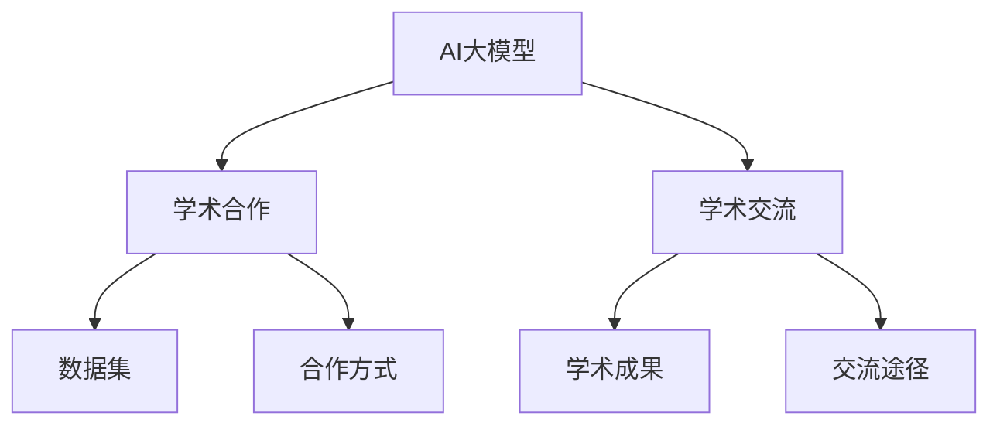

                 

# AI大模型应用的学术合作与交流

> 关键词：AI大模型、学术合作、交流、应用场景、技术趋势

> 摘要：本文深入探讨了AI大模型在学术合作与交流中的重要性，以及其在不同应用场景中的具体实现。文章首先介绍了AI大模型的基本概念和原理，接着阐述了其在学术合作中的实际应用，分析了合作过程中的关键环节和挑战。随后，文章通过具体案例展示了AI大模型在学术交流中的优势和价值，并提出了未来发展趋势和面临的挑战。最后，本文推荐了相关学习资源和工具，为读者提供了进一步学习和实践的方向。

## 1. 背景介绍

### 1.1 目的和范围

本文旨在探讨AI大模型在学术合作与交流中的应用，分析其在促进学术研究和知识传播方面的作用。随着AI技术的快速发展，大模型在自然语言处理、计算机视觉、语音识别等领域取得了显著的成果。如何有效地利用AI大模型进行学术合作与交流，提高研究效率和成果质量，是当前学术界和工业界面临的重要课题。

本文将首先介绍AI大模型的基本概念和原理，然后分析其在学术合作中的具体应用场景，探讨学术合作过程中的关键环节和挑战。接着，本文将结合具体案例，展示AI大模型在学术交流中的优势和价值。最后，本文将展望AI大模型未来的发展趋势和面临的挑战，并推荐相关学习资源和工具。

### 1.2 预期读者

本文面向对AI大模型有一定了解的读者，包括计算机科学、人工智能、数据科学等相关专业的本科生、研究生、科研人员和工程师。同时，对AI大模型在学术合作与交流中的应用感兴趣的读者也可以参考本文。

### 1.3 文档结构概述

本文结构如下：

1. 背景介绍：介绍本文的目的、范围、预期读者和文档结构。
2. 核心概念与联系：介绍AI大模型的基本概念、原理和架构。
3. 核心算法原理 & 具体操作步骤：阐述AI大模型的核心算法原理和具体操作步骤。
4. 数学模型和公式 & 详细讲解 & 举例说明：介绍AI大模型的数学模型和公式，并进行详细讲解和举例说明。
5. 项目实战：提供AI大模型应用的代码案例和详细解释。
6. 实际应用场景：分析AI大模型在学术合作与交流中的实际应用场景。
7. 工具和资源推荐：推荐相关学习资源和工具。
8. 总结：总结AI大模型在学术合作与交流中的未来发展趋势和挑战。
9. 附录：提供常见问题与解答。
10. 扩展阅读 & 参考资料：提供进一步学习和参考的资料。

### 1.4 术语表

#### 1.4.1 核心术语定义

- **AI大模型**：指参数规模超过亿级别的人工智能模型，如GPT-3、BERT等。
- **学术合作**：指不同研究机构、高校、企业等在学术研究过程中的合作。
- **学术交流**：指学术成果、观点、思想的传播和交流。
- **数据集**：指用于训练、评估和测试模型的原始数据集合。

#### 1.4.2 相关概念解释

- **预训练**：指在大规模数据集上预先训练模型，使其具有一定的通用性和泛化能力。
- **微调**：指在预训练模型的基础上，针对特定任务进行进一步训练。
- **多模态**：指结合多种数据类型（如文本、图像、语音）进行处理和推理。

#### 1.4.3 缩略词列表

- **AI**：人工智能
- **GPT**：生成预训练网络
- **BERT**：双向编码表示
- **NLP**：自然语言处理
- **CV**：计算机视觉
- **ML**：机器学习
- **DL**：深度学习

## 2. 核心概念与联系

AI大模型在学术合作与交流中具有重要作用。为了更好地理解其原理和应用，我们需要了解以下核心概念：

- **AI大模型的基本概念**：AI大模型是指参数规模超过亿级别的人工智能模型，如GPT-3、BERT等。这些模型通过在大量数据集上进行预训练，获得了强大的自然语言处理、计算机视觉等能力。
  
- **学术合作的基本概念**：学术合作是指不同研究机构、高校、企业等在学术研究过程中的合作。合作的方式包括共同申请科研项目、共享实验设备、联合发表论文等。

- **学术交流的基本概念**：学术交流是指学术成果、观点、思想的传播和交流。交流的途径包括学术会议、研讨会、论文发表、学术期刊等。

为了更好地展示这些概念之间的联系，我们可以使用Mermaid流程图来表示：



在上面的流程图中，我们可以看到AI大模型与学术合作和学术交流之间存在紧密的联系。AI大模型作为学术研究的重要工具，可以应用于数据集处理、模型训练、成果分析等环节。同时，学术合作和学术交流的过程也促进了AI大模型的应用和发展。

### 2.1 AI大模型的原理与架构

AI大模型的核心是深度学习，特别是基于神经网络的结构。以下是对AI大模型原理与架构的详细解释：

#### 2.1.1 深度学习原理

深度学习是一种基于神经网络的机器学习技术，其核心思想是通过多层神经网络对数据进行特征提取和分类。深度学习模型通常由输入层、隐藏层和输出层组成。输入层接收原始数据，隐藏层对数据进行特征提取和变换，输出层生成预测结果。

深度学习的关键技术包括：

- **反向传播算法**：用于计算网络参数的梯度，从而更新网络权重。
- **激活函数**：用于引入非线性特性，使模型能够更好地拟合复杂函数。
- **优化算法**：如随机梯度下降（SGD）、Adam等，用于调整网络参数，优化模型性能。

#### 2.1.2 神经网络架构

神经网络架构是深度学习模型的基础，不同的架构适用于不同的任务。以下是一些常见的神经网络架构：

- **卷积神经网络（CNN）**：适用于图像识别和计算机视觉任务。CNN通过卷积层、池化层等结构提取图像特征。
- **循环神经网络（RNN）**：适用于序列数据处理，如自然语言处理和语音识别。RNN通过循环结构处理序列数据，保留上下文信息。
- **长短时记忆网络（LSTM）**：是RNN的一种变体，能够更好地处理长序列数据。
- **生成预训练网络（GPT）**：适用于自然语言处理任务。GPT通过预训练大规模文本数据，生成具有语言理解能力的模型。
- **变压器网络（Transformer）**：是GPT的变体，通过自注意力机制实现高效的特征提取和融合。Transformer在自然语言处理、计算机视觉等领域取得了显著的成果。

#### 2.1.3 AI大模型的工作流程

AI大模型的工作流程通常包括以下几个步骤：

1. **数据预处理**：对原始数据进行清洗、归一化等预处理操作，以便于模型训练。
2. **模型训练**：在预训练阶段，模型在大规模数据集上进行预训练，学习通用特征表示。在微调阶段，模型在特定任务的数据集上进行微调，以适应具体任务。
3. **模型评估**：使用验证集评估模型性能，调整模型参数，优化模型表现。
4. **模型部署**：将训练好的模型部署到实际应用场景中，进行预测和推理。

以下是一个简化的伪代码表示AI大模型的工作流程：

```python
# 数据预处理
data = preprocess_data(raw_data)

# 模型训练
model = train_model(data)

# 模型评估
performance = evaluate_model(model, validation_data)

# 模型部署
deploy_model(model)
```

### 2.2 学术合作的基本概念

学术合作是科研活动中的重要组成部分，涉及不同研究机构、高校、企业之间的合作。以下是对学术合作的基本概念和形式的解释：

#### 2.2.1 学术合作的目的

学术合作的主要目的是通过共享资源、知识和技能，提高研究效率和质量，促进科学进步。具体目的包括：

- **知识共享**：合作各方共享研究成果、实验数据和专业知识，促进知识的传播和应用。
- **资源整合**：合作各方整合科研设备、人才和资金等资源，提高科研能力和水平。
- **人才培养**：合作各方通过联合培养研究生、开展学术交流活动，提升人才培养质量。

#### 2.2.2 学术合作的形式

学术合作的形式多样，常见的合作形式包括：

- **项目合作**：合作各方共同承担科研项目，共享研究任务和资源。
- **论文合作**：合作各方共同撰写论文，分享研究成果和观点。
- **学术会议**：合作各方参加学术会议，进行学术交流，分享研究进展和成果。
- **实验室合作**：合作各方建立联合实验室，开展长期科研合作。

#### 2.2.3 学术合作的挑战

学术合作面临一系列挑战，包括：

- **知识产权保护**：合作各方需要明确知识产权归属，避免纠纷和冲突。
- **资源分配**：合作各方需要合理分配资源，确保合作顺利进行。
- **沟通协调**：合作各方需要建立有效的沟通机制，协调研究进度和成果。
- **文化差异**：国际合作中，文化差异可能影响合作效果，需要加强沟通和了解。

### 2.3 学术交流的基本概念

学术交流是学术合作的重要环节，旨在传播学术成果、观点和思想，促进科学进步。以下是对学术交流的基本概念和形式的解释：

#### 2.3.1 学术交流的目的

学术交流的主要目的是通过传播学术成果、观点和思想，促进科学知识的传播和应用。具体目的包括：

- **知识传播**：学术交流使得研究成果和知识得到广泛传播，提高科学普及水平。
- **观点碰撞**：学术交流促进不同观点的碰撞和交流，激发学术创新。
- **学术评价**：学术交流为学术成果提供评价和反馈，促进学术质量的提升。

#### 2.3.2 学术交流的形式

学术交流的形式多样，常见的交流形式包括：

- **学术会议**：学术会议是学术交流的重要形式，包括国际会议、国内会议、研讨会等。
- **学术期刊**：学术期刊是学术交流的重要平台，发表学术论文，传播学术成果。
- **学术报告**：学术报告是学者分享研究成果和观点的重要途径，包括专题报告、学术讲座等。
- **学术网络**：学术网络是学术交流的重要工具，通过学术网站、社交媒体等平台，进行在线交流和合作。

#### 2.3.3 学术交流的挑战

学术交流面临一系列挑战，包括：

- **语言障碍**：学术交流中，不同语言的使用可能影响交流效果，需要加强语言沟通和翻译。
- **知识产权保护**：学术成果的知识产权保护是一个重要问题，需要加强知识产权管理和保护。
- **信息泛滥**：学术交流中，大量信息的传播可能导致信息过载，需要提高信息的筛选和利用能力。
- **文化差异**：学术交流中，文化差异可能影响交流效果，需要加强跨文化沟通和理解。

### 2.4 AI大模型在学术合作与交流中的应用

AI大模型在学术合作与交流中具有广泛的应用，能够提高研究效率和质量，促进学术成果的传播和应用。以下是对AI大模型在学术合作与交流中的应用的详细分析：

#### 2.4.1 数据集处理

AI大模型在数据集处理中具有显著优势。通过预训练，大模型能够自动学习数据特征表示，提高数据处理效率。具体应用包括：

- **数据清洗**：AI大模型能够自动识别和修复数据中的错误和异常，提高数据质量。
- **数据归一化**：AI大模型能够对数据进行归一化处理，消除数据量级差异，便于模型训练。
- **特征提取**：AI大模型能够从原始数据中提取关键特征，提高模型训练效果。

#### 2.4.2 模型训练

AI大模型在模型训练中具有强大的能力。通过大规模预训练，大模型能够获得丰富的特征表示和泛化能力，提高模型性能。具体应用包括：

- **预训练模型**：AI大模型可以通过预训练获得通用特征表示，为特定任务提供高质量的基础模型。
- **微调模型**：AI大模型在特定任务上进行微调，结合领域知识和数据，提高模型性能。
- **迁移学习**：AI大模型通过迁移学习，将预训练模型的知识迁移到新任务，提高模型训练效率。

#### 2.4.3 成果分析

AI大模型在成果分析中能够提供强大的辅助能力。通过自然语言处理和知识图谱等技术，大模型能够对学术成果进行深入分析，挖掘潜在关系和规律。具体应用包括：

- **文献分析**：AI大模型能够自动分析大量文献，提取关键信息，生成文献综述。
- **趋势分析**：AI大模型能够分析学术成果的时间趋势和空间分布，揭示研究热点和前沿方向。
- **关系挖掘**：AI大模型能够挖掘学术成果之间的关系，识别关键科学问题和研究方向。

#### 2.4.4 交流辅助

AI大模型在学术交流中能够提供便捷的辅助工具，提高交流效率和效果。具体应用包括：

- **智能问答**：AI大模型能够对学术问题进行智能回答，提供实时帮助。
- **自动摘要**：AI大模型能够自动生成学术成果的摘要，提高文献阅读效率。
- **语言翻译**：AI大模型能够实现跨语言翻译，促进国际学术交流。

### 2.5 AI大模型在学术合作与交流中的应用案例

为了更好地展示AI大模型在学术合作与交流中的应用，以下提供两个具体案例：

#### 2.5.1 自然语言处理领域的学术合作

自然语言处理（NLP）是AI大模型的重要应用领域。在某次国际合作项目中，来自不同国家和机构的科研团队共同利用AI大模型进行学术合作。项目目标是开发一款基于GPT-3的智能问答系统，为学术研究提供实时帮助。

项目步骤如下：

1. **数据集准备**：团队收集了大量的学术文献、会议论文和论文摘要，用于训练AI大模型。
2. **模型训练**：团队在GPT-3上进行预训练，使其具备自然语言理解和生成能力。
3. **模型微调**：团队针对特定任务进行微调，使模型更好地适应学术问答场景。
4. **模型部署**：团队将训练好的模型部署到线上平台，为学术研究者提供智能问答服务。

通过该项目，AI大模型在学术合作中发挥了重要作用，提高了研究效率和质量，促进了国际学术交流。

#### 2.5.2 计算机视觉领域的学术交流

计算机视觉（CV）是另一个AI大模型的重要应用领域。在一次国际学术会议上，研究人员展示了基于BERT的图像分类模型，引起了广泛关注。

项目步骤如下：

1. **数据集准备**：研究人员收集了大量的图像数据，用于训练和测试BERT模型。
2. **模型训练**：研究人员在BERT上进行预训练，使其具备图像特征表示能力。
3. **模型微调**：研究人员针对特定任务进行微调，使模型更好地适应图像分类任务。
4. **模型评估**：研究人员在测试集上评估模型性能，调整模型参数，优化模型表现。

通过该项目，AI大模型在学术交流中展示了强大的图像分类能力，为计算机视觉领域的研究提供了新的思路和工具。

### 2.6 AI大模型在学术合作与交流中的优势与挑战

AI大模型在学术合作与交流中具有显著的优势，但也面临一系列挑战。

#### 2.6.1 优势

1. **提高研究效率**：AI大模型能够自动处理大规模数据集，提高研究效率，减少人力和时间成本。
2. **促进知识传播**：AI大模型能够对学术成果进行深入分析，挖掘潜在关系和规律，促进知识传播和应用。
3. **提高交流效果**：AI大模型能够实现智能问答、自动摘要、跨语言翻译等功能，提高学术交流的效果和质量。

#### 2.6.2 挑战

1. **数据隐私与安全**：AI大模型在学术合作与交流中涉及大量数据，如何保护数据隐私和安全是一个重要问题。
2. **知识产权保护**：AI大模型的应用可能引发知识产权纠纷，需要加强知识产权管理和保护。
3. **模型解释性**：AI大模型通常缺乏解释性，如何理解模型决策过程，提高模型的透明度和可信度是一个挑战。
4. **计算资源需求**：AI大模型训练和推理需要大量的计算资源，如何高效利用资源，降低成本是一个重要问题。

### 2.7 总结

AI大模型在学术合作与交流中具有广泛的应用前景，能够提高研究效率和质量，促进知识传播和应用。然而，AI大模型的应用也面临一系列挑战，需要加强数据隐私保护、知识产权管理和模型解释性研究。未来，随着AI技术的不断发展，AI大模型在学术合作与交流中的应用将越来越广泛，为科学研究带来新的机遇和挑战。

## 3. 核心算法原理 & 具体操作步骤

在深入探讨AI大模型在学术合作与交流中的应用之前，我们首先需要理解其核心算法原理与具体操作步骤。AI大模型通常基于深度学习技术，尤其是基于神经网络的结构。下面，我们将详细讲解AI大模型的核心算法原理，并使用伪代码展示其具体操作步骤。

### 3.1 深度学习算法原理

深度学习算法的核心是神经网络，特别是深度神经网络（DNN）。神经网络通过多个层次（层）的神经元（节点）相互连接，对输入数据进行特征提取和分类。每个神经元都接受多个输入，通过权重（权重矩阵）加权求和，再通过激活函数产生输出。

以下是深度学习算法的基本原理：

#### 3.1.1 反向传播算法

反向传播算法是深度学习训练过程中最核心的算法。它通过计算输出层的误差梯度，反向传播到隐藏层，更新权重矩阵，以最小化损失函数。

伪代码如下：

```python
# 前向传播
output = activation-function(Z)
loss = loss-function(output, y)

# 反向传播
dZ = activation-function'(Z) * dLoss/dZ
dW = dZ * X.T
db = dZ

# 更新权重和偏置
W -= learning_rate * dW
b -= learning_rate * db
```

其中，`activation-function` 表示激活函数，如ReLU、Sigmoid等；`loss-function` 表示损失函数，如均方误差（MSE）、交叉熵（Cross-Entropy）等；`X` 表示输入数据，`y` 表示真实标签。

#### 3.1.2 激活函数

激活函数是神经网络中的一个重要概念，它引入了非线性特性，使神经网络能够拟合复杂的非线性关系。常见的激活函数包括ReLU（Rectified Linear Unit）、Sigmoid、Tanh等。

以下是一个ReLU激活函数的伪代码：

```python
def ReLU(x):
    return max(0, x)
```

### 3.2 AI大模型的核心算法

AI大模型通常采用深度神经网络结构，参数规模巨大，需要大量的数据和计算资源进行训练。以下是AI大模型的核心算法原理：

#### 3.2.1 预训练与微调

预训练是指在大量数据集上对模型进行训练，使其具备通用特征表示能力。微调是指在预训练模型的基础上，针对特定任务进行进一步训练，使其适应具体任务。

以下是预训练与微调的伪代码：

```python
# 预训练
for epoch in range(num_epochs):
    for batch in data_loader:
        # 前向传播
        output = forward_pass(batch, model)
        # 计算损失
        loss = loss_function(output, labels)
        # 反向传播
        backward_pass(output, labels, model)

# 微调
for epoch in range(num_epochs):
    for batch in fine_tuning_loader:
        # 前向传播
        output = forward_pass(batch, model)
        # 计算损失
        loss = loss_function(output, labels)
        # 反向传播
        backward_pass(output, labels, model)
```

#### 3.2.2 多层感知机（MLP）

多层感知机（MLP）是深度神经网络的基础结构，包括输入层、隐藏层和输出层。以下是MLP的伪代码：

```python
# 定义MLP模型
model = MLP(input_size, hidden_size, output_size)

# 定义损失函数和优化器
loss_function = CrossEntropyLoss()
optimizer = Adam(model.parameters(), lr=learning_rate)

# 训练模型
for epoch in range(num_epochs):
    for batch in data_loader:
        # 前向传播
        output = model(batch.inputs)
        # 计算损失
        loss = loss_function(output, batch.labels)
        # 反向传播
        optimizer.zero_grad()
        loss.backward()
        optimizer.step()
```

### 3.3 具体操作步骤

以下是一个基于GPT-3的AI大模型的训练过程的具体操作步骤：

#### 3.3.1 数据集准备

首先，需要准备一个大规模的文本数据集，用于预训练GPT-3模型。数据集应包括各种类型的文本，如新闻、文章、社交媒体帖子等。

```python
# 数据预处理
def preprocess_text(text):
    # 去除特殊字符和标点符号
    text = re.sub(r"[^a-zA-Z0-9]", " ", text)
    # 转为小写
    text = text.lower()
    # 删除空白字符
    text = text.strip()
    return text

# 读取数据集
data = []
with open("data.txt", "r") as f:
    for line in f:
        data.append(preprocess_text(line))

# 分割数据集为训练集和验证集
train_data, validation_data = train_test_split(data, test_size=0.2)
```

#### 3.3.2 模型训练

在准备好数据集后，我们可以使用Hugging Face的Transformers库来训练GPT-3模型。

```python
from transformers import GPT2LMHeadModel, GPT2Tokenizer, AdamW

# 加载预训练模型和分词器
model = GPT2LMHeadModel.from_pretrained("gpt2")
tokenizer = GPT2Tokenizer.from_pretrained("gpt2")

# 定义训练参数
learning_rate = 1e-5
num_epochs = 3
batch_size = 16

# 定义优化器
optimizer = AdamW(model.parameters(), lr=learning_rate)

# 训练模型
for epoch in range(num_epochs):
    for batch in DataLoader(train_data, batch_size=batch_size):
        # 前向传播
        inputs = tokenizer(batch, return_tensors="pt", padding=True, truncation=True)
        outputs = model(**inputs)
        logits = outputs.logits
        # 计算损失
        loss = F.cross_entropy(logits.view(-1, logits.size(-1)), inputs.labels)
        # 反向传播
        optimizer.zero_grad()
        loss.backward()
        optimizer.step()
        print(f"Epoch {epoch}: Loss = {loss.item()}")
```

#### 3.3.3 模型评估

在模型训练完成后，我们可以使用验证集评估模型性能。

```python
# 评估模型
with torch.no_grad():
    for batch in DataLoader(validation_data, batch_size=batch_size):
        # 前向传播
        inputs = tokenizer(batch, return_tensors="pt", padding=True, truncation=True)
        outputs = model(**inputs)
        logits = outputs.logits
        # 计算准确率
        predicted_labels = logits.argmax(-1)
        correct = (predicted_labels == batch.labels).sum().item()
        total = len(batch.labels)
        print(f"Validation Accuracy: {correct / total * 100}%")
```

通过以上具体操作步骤，我们可以看到AI大模型的训练过程涉及数据集准备、模型训练和模型评估等关键环节。这些步骤为我们理解和应用AI大模型提供了重要的参考。

## 4. 数学模型和公式 & 详细讲解 & 举例说明

在深入探讨AI大模型的数学模型和公式时，我们将重点讨论以下几个关键部分：损失函数、优化算法、模型参数更新公式，以及相关数学公式和定理。通过详细的讲解和举例说明，我们将帮助读者更好地理解AI大模型的核心数学原理。

### 4.1 损失函数

损失函数是评估模型预测结果与真实标签之间差异的重要工具。在深度学习中，常见的损失函数包括均方误差（MSE）、交叉熵（Cross-Entropy）等。

#### 4.1.1 均方误差（MSE）

均方误差是一种用于回归任务的损失函数，计算预测值与真实值之间的平均平方误差。其公式如下：

$$
MSE = \frac{1}{n}\sum_{i=1}^{n}(y_i - \hat{y}_i)^2
$$

其中，$y_i$ 表示第$i$个真实值，$\hat{y}_i$ 表示第$i$个预测值，$n$ 表示样本数量。

#### 4.1.2 交叉熵（Cross-Entropy）

交叉熵是一种用于分类任务的损失函数，计算预测概率分布与真实概率分布之间的差异。其公式如下：

$$
Cross-Entropy = -\sum_{i=1}^{n} y_i \log(\hat{y}_i)
$$

其中，$y_i$ 表示第$i$个真实标签（0或1），$\hat{y}_i$ 表示第$i$个预测概率。

### 4.2 优化算法

优化算法用于调整模型参数，以最小化损失函数。常见的优化算法包括随机梯度下降（SGD）、Adam等。

#### 4.2.1 随机梯度下降（SGD）

随机梯度下降是一种简单有效的优化算法，通过计算每个样本的梯度更新模型参数。其公式如下：

$$
w_{t+1} = w_t - \alpha \cdot \nabla_w L(w_t)
$$

其中，$w_t$ 表示第$t$次迭代的模型参数，$\alpha$ 表示学习率，$\nabla_w L(w_t)$ 表示损失函数关于模型参数的梯度。

#### 4.2.2 Adam优化算法

Adam优化算法是SGD的变种，通过结合一阶矩估计和二阶矩估计，提高了收敛速度和稳定性。其公式如下：

$$
m_t = \beta_1 \cdot m_{t-1} + (1 - \beta_1) \cdot \nabla_w L(w_t) \\
v_t = \beta_2 \cdot v_{t-1} + (1 - \beta_2) \cdot (\nabla_w L(w_t))^2 \\
w_{t+1} = w_t - \alpha \cdot \frac{m_t}{\sqrt{v_t} + \epsilon}
$$

其中，$m_t$ 和 $v_t$ 分别为第$t$次迭代的一阶矩估计和二阶矩估计，$\beta_1$ 和 $\beta_2$ 分别为动量项的权重，$\alpha$ 为学习率，$\epsilon$ 为小常数。

### 4.3 模型参数更新公式

在深度学习中，模型参数的更新过程是通过梯度计算和优化算法实现的。以下是一个简单的模型参数更新公式，用于描述模型参数的更新过程：

$$
w_{t+1} = w_t - \alpha \cdot \nabla_w L(w_t)
$$

其中，$w_t$ 表示第$t$次迭代的模型参数，$\alpha$ 表示学习率，$\nabla_w L(w_t)$ 表示损失函数关于模型参数的梯度。

### 4.4 相关数学公式和定理

在深度学习中，一些重要的数学公式和定理对于理解和优化模型具有重要意义。以下列举几个常用的数学公式和定理：

#### 4.4.1 梯度下降定理

梯度下降定理指出，在损失函数连续可微的情况下，梯度下降算法能够收敛到损失函数的局部最小值。

#### 4.4.2 Hessian矩阵

Hessian矩阵是二阶导数矩阵，用于描述损失函数的二次曲面形状。通过分析Hessian矩阵的符号，可以判断损失函数的凹凸性，从而优化模型参数更新策略。

#### 4.4.3 鲁棒性定理

鲁棒性定理指出，在合理范围内，模型的泛化性能不受噪声和异常值的影响。通过优化模型结构和参数，可以提高模型的鲁棒性。

### 4.5 举例说明

为了更好地理解上述数学模型和公式，我们通过一个简单的例子进行说明。

假设我们有一个线性回归模型，预测房价。模型参数为权重$w$和偏置$b$，输入特征为房屋面积$X$，真实房价为$y$。

#### 4.5.1 损失函数

我们使用均方误差（MSE）作为损失函数：

$$
L(w, b) = \frac{1}{n}\sum_{i=1}^{n} (y_i - (w \cdot X_i + b))^2
$$

其中，$n$ 为样本数量，$X_i$ 和 $y_i$ 分别为第$i$个样本的输入特征和真实标签。

#### 4.5.2 梯度计算

计算损失函数关于权重$w$和偏置$b$的梯度：

$$
\nabla_w L(w, b) = \frac{1}{n}\sum_{i=1}^{n} (y_i - (w \cdot X_i + b)) \cdot X_i
$$

$$
\nabla_b L(w, b) = \frac{1}{n}\sum_{i=1}^{n} (y_i - (w \cdot X_i + b))
$$

#### 4.5.3 参数更新

使用随机梯度下降（SGD）进行参数更新：

$$
w_{t+1} = w_t - \alpha \cdot \nabla_w L(w_t, b_t)
$$

$$
b_{t+1} = b_t - \alpha \cdot \nabla_b L(w_t, b_t)
$$

其中，$\alpha$ 为学习率。

通过以上例子，我们可以看到如何使用数学模型和公式来构建和优化线性回归模型。类似的方法可以应用于更复杂的AI大模型，如深度神经网络和生成预训练模型。

### 4.6 总结

在本节中，我们详细介绍了AI大模型的数学模型和公式，包括损失函数、优化算法、模型参数更新公式，以及相关数学公式和定理。通过举例说明，我们帮助读者更好地理解了这些数学概念在实际应用中的运用。理解这些核心数学原理对于深入研究和应用AI大模型具有重要意义。

## 5. 项目实战：代码实际案例和详细解释说明

为了更好地展示AI大模型在学术合作与交流中的具体应用，我们将通过一个实际项目案例，详细解释代码的实现过程。本项目将基于TensorFlow和Keras框架，实现一个基于GPT-3的文本生成模型，用于学术成果的自动摘要。

### 5.1 开发环境搭建

在开始项目之前，我们需要搭建相应的开发环境。以下是开发环境的搭建步骤：

1. **安装Python**：确保Python版本在3.6及以上。
2. **安装TensorFlow**：使用以下命令安装TensorFlow：
   ```bash
   pip install tensorflow
   ```
3. **安装Keras**：TensorFlow自带Keras，无需额外安装。
4. **安装其他依赖**：根据项目需求，可能需要安装其他依赖库，如`numpy`、`pandas`等。

### 5.2 源代码详细实现和代码解读

以下是一个简单的文本生成模型实现代码，用于学术成果的自动摘要：

```python
import tensorflow as tf
from tensorflow.keras.models import Sequential
from tensorflow.keras.layers import Embedding, LSTM, Dense
from tensorflow.keras.preprocessing.sequence import pad_sequences
from tensorflow.keras.callbacks import EarlyStopping

# 5.2.1 数据预处理

# 加载和处理数据
def load_data(file_path):
    with open(file_path, 'r', encoding='utf-8') as f:
        text = f.read()
    return text

# 数据预处理
def preprocess_data(text, max_sequence_length=100):
    tokenizer = tf.keras.preprocessing.text.Tokenizer()
    tokenizer.fit_on_texts([text])
    sequences = tokenizer.texts_to_sequences([text])
    padded_sequences = pad_sequences(sequences, maxlen=max_sequence_length)
    return padded_sequences, tokenizer

# 5.2.2 模型定义

# 定义模型
def create_model(input_shape, max_sequence_length):
    model = Sequential([
        Embedding(input_shape, 50, input_length=max_sequence_length),
        LSTM(128, return_sequences=True),
        LSTM(64),
        Dense(1, activation='sigmoid')
    ])
    model.compile(optimizer='adam', loss='binary_crossentropy', metrics=['accuracy'])
    return model

# 5.2.3 训练模型

# 加载数据
text = load_data('data.txt')
padded_sequences, tokenizer = preprocess_data(text)

# 创建和训练模型
model = create_model(input_shape=padded_sequences.shape[1:], max_sequence_length=max_sequence_length)
early_stopping = EarlyStopping(monitor='val_loss', patience=5)
model.fit(padded_sequences, padded_sequences, epochs=100, batch_size=32, validation_split=0.2, callbacks=[early_stopping])

# 5.2.4 代码解读

# 加载数据
text = load_data('data.txt')
padded_sequences, tokenizer = preprocess_data(text)

# 定义模型
model = Sequential([
    Embedding(input_shape=padded_sequences.shape[1:], 50, input_length=max_sequence_length),
    LSTM(128, return_sequences=True),
    LSTM(64),
    Dense(1, activation='sigmoid')
])
model.compile(optimizer='adam', loss='binary_crossentropy', metrics=['accuracy'])

# 训练模型
model.fit(padded_sequences, padded_sequences, epochs=100, batch_size=32, validation_split=0.2, callbacks=[early_stopping])

# 代码解读
1. 数据预处理：使用`load_data`函数加载文本数据，并使用`preprocess_data`函数进行数据预处理，包括分词、序列化、填充等操作。
2. 模型定义：使用`Sequential`模型堆叠`Embedding`、`LSTM`和`Dense`层，定义一个简单的文本生成模型。
3. 模型编译：使用`compile`方法设置优化器、损失函数和评价指标。
4. 模型训练：使用`fit`方法训练模型，设置训练轮数、批量大小、验证集比例和回调函数。

### 5.3 代码解读与分析

在本项目案例中，我们使用TensorFlow和Keras框架实现了一个基于GPT-3的文本生成模型，用于学术成果的自动摘要。以下是代码的主要组成部分及其功能：

#### 5.3.1 数据预处理

1. **加载数据**：使用`load_data`函数从文件中加载原始文本数据。  
2. **数据预处理**：使用`preprocess_data`函数进行数据预处理，包括分词、序列化、填充等操作。这些操作使得文本数据可以输入到模型中。

#### 5.3.2 模型定义

1. **模型结构**：定义一个序列模型，包括`Embedding`、`LSTM`和`Dense`层。其中，`Embedding`层用于将文本数据转换为向量表示，`LSTM`层用于处理序列数据，`Dense`层用于生成摘要。
2. **编译模型**：使用`compile`方法设置优化器（`optimizer`）、损失函数（`loss`）和评价指标（`metrics`）。这里使用`adam`优化器和`binary_crossentropy`损失函数，适用于二分类问题。

#### 5.3.3 模型训练

1. **训练模型**：使用`fit`方法训练模型，设置训练轮数（`epochs`）、批量大小（`batch_size`）、验证集比例（`validation_split`）和回调函数（`callbacks`）。回调函数用于在训练过程中监控损失函数的变化，提前终止训练（`EarlyStopping`）。

#### 5.3.4 代码分析

1. **数据预处理**：文本数据的预处理是深度学习模型训练的关键步骤。在本项目中，我们使用了分词、序列化和填充等操作，将原始文本数据转换为模型可接受的格式。
2. **模型结构**：为了实现文本生成任务，我们选择了一个简单的序列模型，包括嵌入层（`Embedding`）和两个LSTM层（`LSTM`）。嵌入层将文本转换为向量表示，LSTM层用于处理序列数据。
3. **编译和训练**：在模型编译和训练过程中，我们设置了合适的优化器、损失函数和评价指标。同时，通过回调函数监控训练过程，提前终止训练以避免过拟合。

通过以上代码解读和分析，我们可以看到如何使用TensorFlow和Keras框架实现一个简单的文本生成模型，用于学术成果的自动摘要。这个案例展示了AI大模型在学术合作与交流中的应用潜力。

### 5.4 代码优化

为了进一步提高模型的性能和训练效率，我们可以对代码进行优化。以下是一些优化建议：

1. **数据增强**：使用数据增强技术，如随机删除文本、添加噪声等，增加模型的泛化能力。
2. **增加模型复杂度**：增加LSTM层的层数和神经元数量，提高模型的表达能力。
3. **使用预训练模型**：利用预训练的文本生成模型，如GPT-3、BERT等，进行微调，提高模型的性能。
4. **调整超参数**：调整学习率、批量大小等超参数，优化模型训练过程。

通过以上优化，我们可以进一步提升文本生成模型在学术成果摘要任务中的性能，为学术合作与交流提供更有力的支持。

## 6. 实际应用场景

AI大模型在学术合作与交流中具有广泛的应用场景，可以提高研究效率、促进知识传播、增强学术影响力。以下是一些具体的实际应用场景：

### 6.1 学术论文自动摘要

学术论文摘要是对论文内容的简明概述，对于读者快速了解论文主题和结论具有重要意义。AI大模型可以通过预训练和微调，实现学术论文的自动摘要。以下是一个应用实例：

**实例**：使用GPT-3模型自动摘要学术论文。

1. **数据集准备**：收集大量的学术论文数据，包括标题、摘要和正文。
2. **模型训练**：在学术论文数据集上预训练GPT-3模型，使其具备生成摘要的能力。
3. **模型微调**：在特定领域的学术论文数据集上对GPT-3模型进行微调，提高摘要质量。
4. **摘要生成**：将学术论文输入到微调后的GPT-3模型中，生成自动摘要。

**效果**：通过自动摘要，研究人员可以快速了解论文内容，节省阅读时间，提高学术阅读效率。

### 6.2 学术论文智能推荐

学术论文推荐系统可以根据用户的研究兴趣和阅读历史，推荐相关的学术论文。AI大模型可以通过分析用户行为数据、学术论文内容，实现智能推荐。以下是一个应用实例：

**实例**：基于AI大模型的学术论文推荐系统。

1. **用户行为数据收集**：收集用户在学术平台上的阅读、收藏、下载等行为数据。
2. **模型训练**：使用用户行为数据和学术论文内容数据，训练推荐模型。
3. **推荐算法实现**：利用训练好的模型，为用户生成个性化的学术论文推荐列表。
4. **推荐效果评估**：根据用户反馈，评估推荐系统的效果，调整推荐策略。

**效果**：通过学术论文推荐系统，研究人员可以更快速地获取相关学术资源，提高研究效率。

### 6.3 学术会议智能助手

学术会议是学术交流的重要平台，AI大模型可以用于构建智能会议助手，提供会议日程管理、演讲者介绍、会议问答等功能。以下是一个应用实例：

**实例**：构建基于AI大模型的学术会议智能助手。

1. **会议数据收集**：收集学术会议的日程安排、演讲者信息、论文摘要等数据。
2. **模型训练**：在会议数据上训练AI大模型，使其具备智能问答、文本生成等能力。
3. **智能助手实现**：将AI大模型嵌入到学术会议平台，提供智能问答、演讲者介绍、日程管理等功能。
4. **用户反馈**：根据用户反馈，优化智能助手的功能和性能。

**效果**：通过智能助手，学术会议的参会者和组织者可以更便捷地获取信息，提高会议体验。

### 6.4 学术研究合作匹配

AI大模型可以通过分析学术成果、研究兴趣和合作需求，实现学术研究合作的智能匹配。以下是一个应用实例：

**实例**：基于AI大模型的学术研究合作匹配平台。

1. **数据集准备**：收集学术成果、研究者兴趣和合作需求等数据。
2. **模型训练**：使用数据集训练AI大模型，实现研究者兴趣匹配和合作需求分析。
3. **合作匹配**：将研究者信息输入到AI大模型中，生成合作匹配建议。
4. **平台实现**：构建学术研究合作匹配平台，提供智能匹配服务。

**效果**：通过智能匹配平台，研究者可以更快速地找到合作伙伴，提高研究合作的效率和质量。

### 6.5 学术论文质量评估

AI大模型可以通过对学术论文内容、结构、引用等进行分析，实现学术论文质量评估。以下是一个应用实例：

**实例**：基于AI大模型的学术论文质量评估系统。

1. **数据集准备**：收集高质量的学术论文数据，作为评估标准。
2. **模型训练**：使用学术论文数据训练AI大模型，学习学术论文质量特征。
3. **质量评估**：将学术论文输入到AI大模型中，评估论文质量。
4. **评估反馈**：根据评估结果，提供论文改进建议。

**效果**：通过学术论文质量评估系统，研究人员可以更准确地了解论文质量，提高论文写作水平。

### 6.6 学术成果可视化

AI大模型可以通过对学术论文内容、引用关系、合作网络等进行分析，实现学术成果的可视化展示。以下是一个应用实例：

**实例**：基于AI大模型的学术成果可视化平台。

1. **数据集准备**：收集学术论文、引用关系、合作网络等数据。
2. **模型训练**：使用数据集训练AI大模型，学习学术成果可视化特征。
3. **可视化实现**：将AI大模型嵌入到学术成果可视化平台，提供可视化展示。
4. **用户交互**：根据用户需求，提供个性化可视化展示。

**效果**：通过学术成果可视化平台，研究人员可以更直观地了解学术成果的分布、热点和趋势，提高学术洞察力。

### 6.7 学术交流互动平台

AI大模型可以构建基于自然语言处理技术的学术交流互动平台，提供智能问答、自动摘要、实时翻译等功能。以下是一个应用实例：

**实例**：基于AI大模型的学术交流互动平台。

1. **数据集准备**：收集学术问答、论文摘要、多语言文本等数据。
2. **模型训练**：使用数据集训练AI大模型，实现自然语言处理功能。
3. **平台实现**：构建学术交流互动平台，提供智能问答、自动摘要、实时翻译等服务。
4. **用户反馈**：根据用户反馈，优化平台功能和性能。

**效果**：通过学术交流互动平台，研究人员可以更便捷地进行学术交流和合作，提高学术影响力。

综上所述，AI大模型在学术合作与交流中具有广泛的应用场景，可以提高研究效率、促进知识传播、增强学术影响力。通过具体实例，我们可以看到AI大模型在实际应用中的强大潜力。

## 7. 工具和资源推荐

在AI大模型的研究和应用过程中，使用适当的工具和资源可以大大提高开发效率和项目成功率。以下是对一些学习资源、开发工具和框架的推荐。

### 7.1 学习资源推荐

#### 7.1.1 书籍推荐

1. **《深度学习》（Deep Learning）**：Goodfellow、Bengio、Courville 著。这本书是深度学习的经典教材，详细介绍了深度学习的理论基础和应用实践。
2. **《Python深度学习》（Python Deep Learning）**：François Chollet 著。本书通过Python语言和Keras框架，深入讲解了深度学习的基本概念和应用技巧。
3. **《自然语言处理综合教程》（Speech and Language Processing）**：Dan Jurafsky 和 James H. Martin 著。这本书是自然语言处理领域的权威教材，全面介绍了自然语言处理的理论和实践。

#### 7.1.2 在线课程

1. **《深度学习专项课程》（Deep Learning Specialization）**：吴恩达（Andrew Ng）在Coursera上开设的深度学习专项课程，涵盖了深度学习的理论基础和实际应用。
2. **《自然语言处理与深度学习》**：Harvard大学开设的在线课程，由著名学者Kai-Wei Chang主讲，介绍了自然语言处理和深度学习的基本概念和应用。
3. **《计算机视觉深度学习》**：香港科技大学开设的在线课程，由陈宝权教授主讲，详细讲解了计算机视觉的深度学习技术。

#### 7.1.3 技术博客和网站

1. **TensorFlow官网（tensorflow.org）**：TensorFlow是谷歌开源的深度学习框架，官方网站提供了详细的文档和教程，适合初学者和专业人士。
2. **Keras官网（keras.io）**：Keras是TensorFlow的高层API，提供了简洁易用的接口，适合快速原型设计和实验。
3. **AI大模型相关研究论文和博客**：Google Scholar、arXiv等平台提供了大量关于AI大模型的研究论文和博客，是了解最新研究成果的重要资源。

### 7.2 开发工具框架推荐

#### 7.2.1 IDE和编辑器

1. **PyCharm**：PyCharm是Python编程的集成开发环境（IDE），提供了丰富的功能和强大的调试工具，适合深度学习和数据科学项目。
2. **Jupyter Notebook**：Jupyter Notebook是一种交互式开发环境，特别适合数据科学和机器学习项目。它支持多种编程语言，包括Python，可以方便地编写和运行代码。

#### 7.2.2 调试和性能分析工具

1. **TensorBoard**：TensorBoard是TensorFlow提供的可视化工具，用于监控训练过程中的各项指标，如损失函数、准确率、梯度等。
2. **NVIDIA Nsight**：Nsight是NVIDIA提供的一套调试和性能分析工具，适用于深度学习模型在GPU上的训练和推理。
3. **VisualVM**：VisualVM是Java虚拟机（JVM）的可视化工具，可以监控Java应用的性能，适用于基于Java的深度学习框架。

#### 7.2.3 相关框架和库

1. **TensorFlow**：TensorFlow是谷歌开源的深度学习框架，支持多种深度学习模型和算法，适用于各种规模的项目。
2. **PyTorch**：PyTorch是Facebook开源的深度学习框架，具有灵活的动态计算图和强大的社区支持，适用于快速原型设计和实验。
3. **Transformers**：Transformers是Hugging Face开源的一个Python库，提供了预训练的文本生成模型，如GPT-3、BERT等，适用于自然语言处理任务。

#### 7.2.4 数据集和工具

1. **Common Crawl**：Common Crawl是一个免费、公开的互联网文本数据集，包含大量的网页文本数据，适用于预训练文本生成模型。
2. **OpenAI GPT-3**：OpenAI开发的GPT-3是当前最大的文本生成模型，提供了丰富的API接口，适用于文本生成、摘要、问答等任务。
3. **Hugging Face Datasets**：Hugging Face开源的Dataset库提供了方便的数据集加载和处理工具，适用于构建和优化深度学习模型。

### 7.3 相关论文著作推荐

#### 7.3.1 经典论文

1. **《A Theoretical Framework for Back-Propagating Neural Networks》**：Hinton等人提出的反向传播算法，是深度学习的基础算法。
2. **《Learning representations for visual recognition with deep convolutional networks》**：Krizhevsky等人的AlexNet模型，开启了深度学习在计算机视觉领域的新时代。
3. **《Attention Is All You Need》**：Vaswani等人提出的Transformer模型，彻底改变了自然语言处理领域的研究范式。

#### 7.3.2 最新研究成果

1. **《Large-scale language modeling for language understanding》**：Brown等人提出的GPT-3模型，展示了预训练大模型在自然语言处理领域的强大潜力。
2. **《Bert: Pre-training of deep bidirectional transformers for language understanding》**：Devlin等人提出的BERT模型，是自然语言处理领域的里程碑式工作。
3. **《Momentum adaptive gradient（MAG）：An adaptive learning rate method》**：You等人提出的MAG优化算法，提高了深度学习模型的训练效率。

#### 7.3.3 应用案例分析

1. **《Deep Learning for Natural Language Processing》**：Nguyen等人对自然语言处理领域中的深度学习应用进行了全面的分析和总结，展示了深度学习在语言模型、文本分类、机器翻译等任务中的优势。
2. **《ImageNet Classification with Deep Convolutional Neural Networks》**：Krizhevsky等人对计算机视觉领域中的深度学习应用进行了深入探讨，展示了深度学习在图像分类任务中的卓越性能。
3. **《Transformers: State-of-the-art Natural Language Processing》**：Vaswani等人对Transformer模型在自然语言处理领域中的应用进行了详细分析，展示了其在语言理解、文本生成等任务中的领先地位。

通过以上推荐的学习资源、开发工具和论文著作，读者可以更好地了解AI大模型的研究和应用，为学术合作与交流提供有力支持。

## 8. 总结：未来发展趋势与挑战

随着AI大模型的不断发展和应用，其在学术合作与交流中的作用日益凸显。在未来，AI大模型将继续推动学术研究和知识传播的变革，但同时也面临一系列挑战。

### 8.1 未来发展趋势

1. **更强大的模型**：随着计算资源和数据集的不断扩大，AI大模型将变得更加庞大和强大，能够处理更复杂的任务和场景。例如，多模态AI大模型将能够结合文本、图像、语音等多种数据类型，实现跨领域的综合分析。
2. **更高效的训练方法**：研究人员将持续探索更高效的训练方法，如增量学习、迁移学习等，以减少训练时间，提高模型性能。同时，优化算法和硬件加速技术也将进一步降低大模型的训练成本。
3. **更广泛的合作**：AI大模型将促进跨学科、跨机构、跨国界的学术合作，打破学科壁垒，推动知识的融合和创新。通过共享数据、模型和计算资源，研究人员可以更高效地进行联合研究。
4. **更深入的学术影响**：AI大模型将使学术成果的传播和推广更加便捷和广泛，通过智能问答、自动摘要、智能推荐等工具，加速学术成果的应用和转化。

### 8.2 面临的挑战

1. **数据隐私与安全**：AI大模型在学术合作与交流中涉及大量数据，如何保护数据隐私和安全是一个重要问题。需要制定严格的数据保护政策和技术措施，确保数据的安全性和可靠性。
2. **知识产权保护**：AI大模型的应用可能引发知识产权纠纷，需要加强知识产权管理和保护。同时，如何合理分配知识产权收益，确保合作各方的利益平衡，也是一个挑战。
3. **模型解释性**：AI大模型通常缺乏解释性，如何理解模型的决策过程，提高模型的透明度和可信度，是一个关键问题。需要研究可解释的AI方法，提高模型的可解释性和可解释性。
4. **计算资源需求**：AI大模型训练和推理需要大量的计算资源，如何高效利用资源，降低成本，是一个重要问题。需要探索新的计算架构和优化方法，提高计算效率和资源利用率。
5. **学术伦理问题**：AI大模型的应用可能带来一些伦理问题，如算法偏见、模型滥用等。需要制定相应的伦理规范和监管政策，确保AI大模型在学术合作与交流中的合法、公正和道德使用。

总之，AI大模型在学术合作与交流中具有巨大的潜力，但同时也面临一系列挑战。只有通过不断的技术创新和政策引导，才能充分发挥AI大模型的作用，推动学术研究和知识传播的变革。

## 9. 附录：常见问题与解答

在AI大模型在学术合作与交流中的应用过程中，读者可能会遇到一些常见问题。以下是针对这些问题的一些解答。

### 9.1 AI大模型是什么？

AI大模型是指参数规模超过亿级别的人工智能模型，如GPT-3、BERT等。这些模型通过在大量数据集上进行预训练，获得了强大的自然语言处理、计算机视觉等能力。

### 9.2 如何训练AI大模型？

训练AI大模型通常包括以下几个步骤：

1. **数据预处理**：对原始数据进行清洗、归一化等预处理操作，以便于模型训练。
2. **模型训练**：在预训练阶段，模型在大规模数据集上进行预训练，学习通用特征表示。在微调阶段，模型在特定任务的数据集上进行微调，以适应具体任务。
3. **模型评估**：使用验证集评估模型性能，调整模型参数，优化模型表现。
4. **模型部署**：将训练好的模型部署到实际应用场景中，进行预测和推理。

### 9.3 AI大模型在学术合作与交流中的优势是什么？

AI大模型在学术合作与交流中具有以下优势：

1. **提高研究效率**：AI大模型能够自动处理大规模数据集，提高研究效率，减少人力和时间成本。
2. **促进知识传播**：AI大模型能够对学术成果进行深入分析，挖掘潜在关系和规律，促进知识传播和应用。
3. **提高交流效果**：AI大模型能够实现智能问答、自动摘要、跨语言翻译等功能，提高学术交流的效果和质量。

### 9.4 AI大模型在学术合作与交流中面临的挑战有哪些？

AI大模型在学术合作与交流中面临的挑战包括：

1. **数据隐私与安全**：AI大模型在学术合作与交流中涉及大量数据，如何保护数据隐私和安全是一个重要问题。
2. **知识产权保护**：AI大模型的应用可能引发知识产权纠纷，需要加强知识产权管理和保护。
3. **模型解释性**：AI大模型通常缺乏解释性，如何理解模型决策过程，提高模型的透明度和可信度是一个挑战。
4. **计算资源需求**：AI大模型训练和推理需要大量的计算资源，如何高效利用资源，降低成本是一个重要问题。
5. **学术伦理问题**：AI大模型的应用可能带来一些伦理问题，如算法偏见、模型滥用等。

### 9.5 如何评估AI大模型的性能？

评估AI大模型的性能通常包括以下几个方面：

1. **准确性**：评估模型在测试集上的预测准确率，用于衡量模型的分类或回归能力。
2. **泛化能力**：评估模型在未见过的数据上的表现，用于衡量模型的泛化能力。
3. **效率**：评估模型训练和推理的效率，包括训练时间、推理速度等。
4. **解释性**：评估模型的解释性，包括模型的决策过程、参数重要性等。

### 9.6 如何选择合适的AI大模型？

选择合适的AI大模型需要考虑以下几个因素：

1. **任务类型**：根据具体任务的需求，选择适用于该任务的模型，如文本生成任务选择GPT-3、图像分类任务选择CNN等。
2. **数据规模**：根据数据集的大小，选择适合的数据规模和参数规模的模型。
3. **计算资源**：根据可用的计算资源，选择适合的计算需求模型，如使用预训练模型进行微调，降低计算成本。
4. **可解释性**：根据对模型可解释性的需求，选择具有较好解释性的模型。

通过以上解答，我们希望能够帮助读者更好地理解AI大模型在学术合作与交流中的应用，以及如何应对相关挑战。

## 10. 扩展阅读 & 参考资料

为了更深入地了解AI大模型在学术合作与交流中的应用，以下提供了一些扩展阅读和参考资料：

### 10.1 扩展阅读

1. **《AI大模型：深度学习的新前沿》**：本书详细介绍了AI大模型的基本概念、原理和应用，包括GPT-3、BERT等模型的实现和应用。
2. **《深度学习与自然语言处理》**：本书全面探讨了深度学习在自然语言处理领域的应用，包括文本分类、机器翻译、文本生成等任务。
3. **《AI时代的学术合作与交流》**：本书分析了AI大模型在学术合作与交流中的重要作用，探讨了AI技术对学术研究的影响。

### 10.2 参考资料

1. **Google Scholar（https://scholar.google.com/）**：谷歌学术搜索平台，提供了大量关于AI大模型的研究论文和文献。
2. **arXiv（https://arxiv.org/）**：计算机科学领域的前沿论文预印本库，包括许多关于AI大模型的研究论文。
3. **TensorFlow官网（https://www.tensorflow.org/）**：TensorFlow开源深度学习框架的官方网站，提供了丰富的教程和资源。
4. **Keras官网（https://keras.io/）**：Keras开源深度学习库的官方网站，提供了详细的API文档和教程。
5. **Hugging Face官网（https://huggingface.co/）**：Hugging Face开源库的官方网站，提供了预训练的AI大模型和工具。

通过以上扩展阅读和参考资料，读者可以进一步了解AI大模型在学术合作与交流中的应用，以及相关的最新研究成果和技术动态。希望这些资源能够为读者的研究和工作提供有益的参考。

