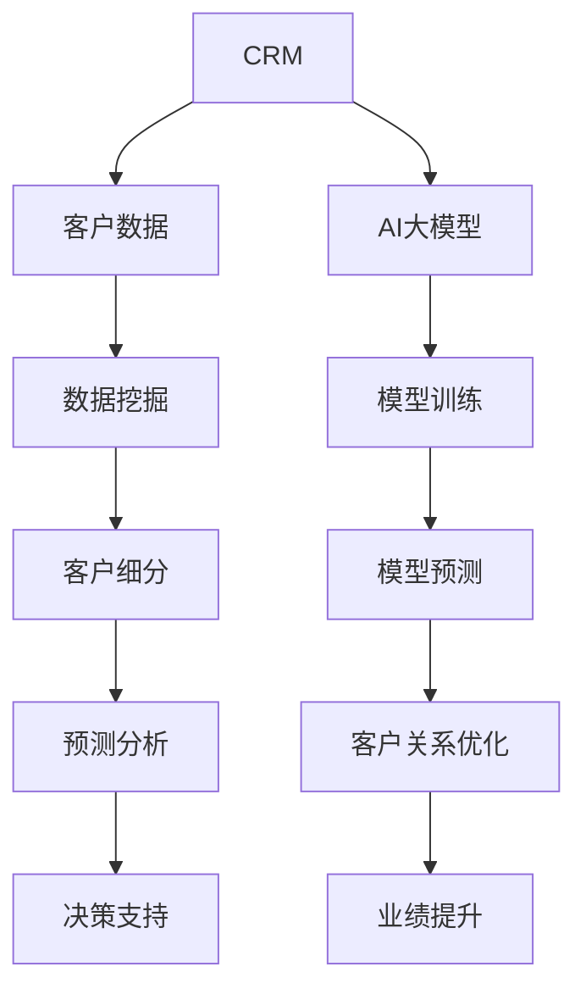

                 

### 1. 背景介绍

#### 1.1 目的和范围

本文旨在探讨人工智能（AI）大模型在客户关系管理（CRM）领域的新应用思路。随着AI技术的迅猛发展，大模型如深度学习、神经网络等已经在各个领域展现出了巨大的潜力。CRM作为企业运营的重要组成部分，其目标是通过高效管理客户关系来提升客户满意度和忠诚度，进而推动企业业绩的增长。因此，将AI大模型引入CRM领域，不仅能够实现客户数据的深度挖掘和分析，还能为企业的决策提供更加精准的依据。

本文将首先介绍AI大模型的基本概念和原理，然后探讨其在CRM中的应用场景和挑战，最后通过具体案例展示如何利用AI大模型提升CRM的效率。本文将涵盖以下几个部分：

1. **背景介绍**：介绍本文的目的、范围、预期读者、文档结构以及相关术语。
2. **核心概念与联系**：通过Mermaid流程图展示AI大模型与CRM的关键概念和联系。
3. **核心算法原理与具体操作步骤**：详细阐述AI大模型在CRM中的应用算法原理和操作步骤。
4. **数学模型和公式**：介绍相关数学模型和公式的详细讲解及举例说明。
5. **项目实战**：通过实际代码案例展示如何应用AI大模型进行CRM开发。
6. **实际应用场景**：探讨AI大模型在CRM领域的具体应用场景。
7. **工具和资源推荐**：推荐学习资源、开发工具框架以及相关论文著作。
8. **总结**：总结AI大模型在CRM领域的发展趋势与挑战。
9. **附录**：常见问题与解答。
10. **扩展阅读与参考资料**：提供进一步阅读的资源。

通过本文的阅读，读者将能够全面了解AI大模型在CRM领域的新思路，掌握其应用原理和操作步骤，并能够为实际项目提供技术支持。

#### 1.2 预期读者

本文主要面向以下几类读者：

1. **CRM系统开发人员**：希望通过本文了解如何利用AI大模型提升CRM系统的效能。
2. **数据分析师**：希望掌握AI大模型在客户数据分析中的应用方法。
3. **企业决策者**：希望了解AI大模型如何帮助企业提升客户关系管理。
4. **AI技术爱好者**：希望了解AI大模型在CRM领域的应用前景。

本文的技术难度适中，既包括基础概念的解释，也涵盖了具体的技术实现和案例分析。因此，无论您是初学者还是资深技术专家，都能够从中获益。

#### 1.3 文档结构概述

本文结构如下：

1. **背景介绍**：介绍本文的目的、范围、预期读者、文档结构以及相关术语。
2. **核心概念与联系**：通过Mermaid流程图展示AI大模型与CRM的关键概念和联系。
3. **核心算法原理与具体操作步骤**：详细阐述AI大模型在CRM中的应用算法原理和操作步骤。
4. **数学模型和公式**：介绍相关数学模型和公式的详细讲解及举例说明。
5. **项目实战**：通过实际代码案例展示如何应用AI大模型进行CRM开发。
6. **实际应用场景**：探讨AI大模型在CRM领域的具体应用场景。
7. **工具和资源推荐**：推荐学习资源、开发工具框架以及相关论文著作。
8. **总结**：总结AI大模型在CRM领域的发展趋势与挑战。
9. **附录**：常见问题与解答。
10. **扩展阅读与参考资料**：提供进一步阅读的资源。

本文将逐步深入探讨每个部分，以帮助读者全面理解AI大模型在CRM领域的新应用思路。

#### 1.4 术语表

在本文中，以下术语将被广泛使用：

#### 1.4.1 核心术语定义

- **客户关系管理（CRM）**：指企业通过系统化的方法来管理客户关系，提升客户满意度和忠诚度，从而推动业务增长。
- **人工智能（AI）**：指模拟人类智能行为的计算机技术，包括机器学习、深度学习、自然语言处理等。
- **大模型**：指具有大规模参数的神经网络模型，如GPT-3、BERT等。
- **数据挖掘**：指从大量数据中发现有用信息和知识的过程。

#### 1.4.2 相关概念解释

- **客户生命周期价值（CLV）**：指一个客户在其与企业合作期间为企业带来的总收益。
- **客户细分**：指根据客户的特征和行为将其分为不同的群体。
- **预测分析**：指利用历史数据预测未来事件或趋势的方法。

#### 1.4.3 缩略词列表

- **AI**：人工智能（Artificial Intelligence）
- **CRM**：客户关系管理（Customer Relationship Management）
- **GPT-3**：大型预训练语言模型（Generative Pre-trained Transformer 3）
- **BERT**：双向编码表示（Bidirectional Encoder Representations from Transformers）

这些术语和概念将在后续内容中详细展开，帮助读者更好地理解AI大模型在CRM领域的应用。

---

**Mermaid 流程图**：

该流程图展示了CRM中客户数据的处理过程，以及AI大模型如何介入并提升客户关系管理的效果。通过数据挖掘、客户细分和预测分析，企业可以获得更加精准的决策支持，从而优化客户关系，提升业绩。

---

**下一步**：接下来，我们将深入探讨AI大模型的核心概念与联系，通过详细的原理和架构分析，为后续内容打下坚实的基础。

---

**注**：以上为第1部分的详细内容，包括背景介绍、预期读者、文档结构概述、术语表等。在撰写后续内容时，将遵循本文的结构和逻辑，逐步深入探讨AI大模型在CRM领域的应用。

