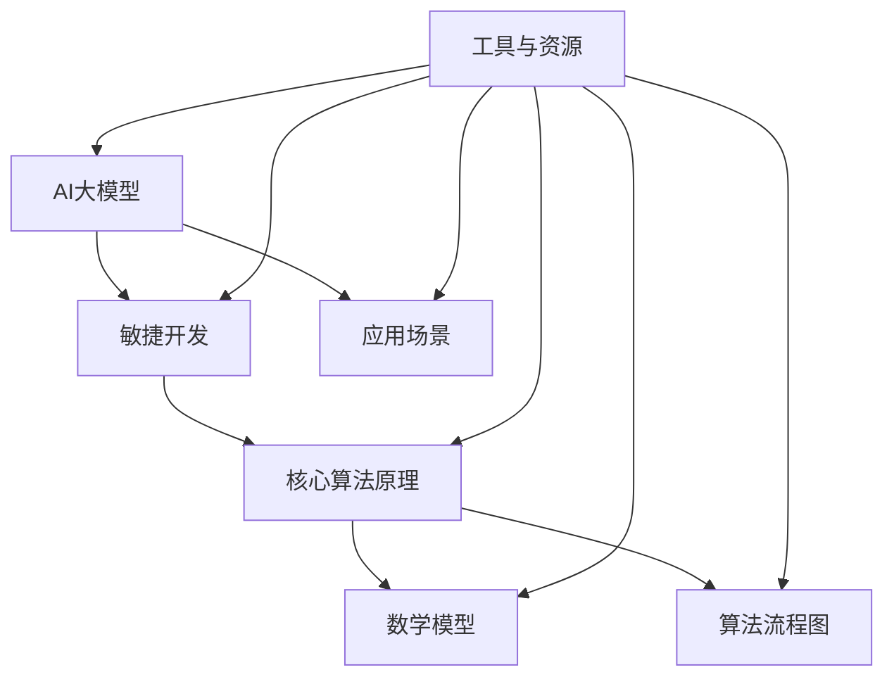

                 

# AI大模型应用的敏捷开发方法论

> **关键词：** 大模型、AI、敏捷开发、应用场景、算法原理、数学模型、代码实现、工具资源

> **摘要：** 本文将深入探讨AI大模型应用的敏捷开发方法论，从核心概念、算法原理到实际案例，全面解析如何在AI大模型开发过程中实现高效敏捷。通过本文的阐述，读者将了解到如何从理论到实践，逐步构建和优化大模型应用，迎接未来的技术挑战。

## 1. 背景介绍

### 1.1 目的和范围

本文旨在为从事AI大模型开发的技术人员提供一套敏捷开发方法论，帮助他们在项目开发过程中实现更高的效率和更好的质量。本文将涵盖以下范围：

- 大模型的核心概念与架构
- 敏捷开发方法论在AI大模型中的应用
- 核心算法原理与数学模型的讲解
- 实际项目中的代码实现与分析
- 实际应用场景与工具资源的推荐

### 1.2 预期读者

本文适合以下读者群体：

- AI领域的研究人员与开发者
- 数据科学家与机器学习工程师
- 软件工程师与技术爱好者
- 企业IT管理人员与架构师

### 1.3 文档结构概述

本文的结构如下：

- 第1章：背景介绍
- 第2章：核心概念与联系
- 第3章：核心算法原理与操作步骤
- 第4章：数学模型与公式讲解
- 第5章：项目实战：代码实际案例
- 第6章：实际应用场景
- 第7章：工具和资源推荐
- 第8章：总结：未来发展趋势与挑战
- 第9章：附录：常见问题与解答
- 第10章：扩展阅读与参考资料

### 1.4 术语表

#### 1.4.1 核心术语定义

- **大模型（Large Model）**：指具有非常大规模参数和复杂结构的机器学习模型，如深度神经网络、Transformer模型等。
- **敏捷开发（Agile Development）**：一种以人为核心、迭代开发和持续交付的软件开发方法论。
- **算法原理**：指算法在解决问题的过程中所依据的数学规则和逻辑关系。
- **数学模型**：用于描述和解决特定问题的数学表达式或结构。

#### 1.4.2 相关概念解释

- **参数调优（Parameter Tuning）**：调整模型参数以优化模型性能的过程。
- **模型评估（Model Evaluation）**：评估模型性能和泛化能力的方法和指标。
- **交叉验证（Cross-Validation）**：一种评估模型性能的统计方法，通过将数据划分为训练集和验证集来避免过拟合。

#### 1.4.3 缩略词列表

- **AI**：人工智能
- **ML**：机器学习
- **DL**：深度学习
- **AGILE**：敏捷开发
- **IDE**：集成开发环境

## 2. 核心概念与联系

为了更好地理解AI大模型应用的敏捷开发方法论，我们需要先了解其中的核心概念和它们之间的关系。以下是一个简化的Mermaid流程图，用于展示大模型、敏捷开发以及算法原理之间的联系。

在这个流程图中，我们可以看到AI大模型是整个方法论的基础，它需要通过敏捷开发方法论来指导开发过程。核心算法原理和数学模型则构成了AI大模型的基石，而算法流程图则展示了算法的实现步骤。应用场景和工具资源则为整个方法论的实施提供了支持和保障。

### 2.1 大模型的基本架构

大模型通常具有以下几个基本架构组件：

1. **输入层（Input Layer）**：接收外部输入数据，如文本、图像或音频。
2. **隐藏层（Hidden Layers）**：包含多个隐藏层，每个隐藏层由多个神经元组成，用于提取和变换输入数据。
3. **输出层（Output Layer）**：产生模型的预测结果或决策。
4. **激活函数（Activation Function）**：用于引入非线性变换，使模型具有更强的表达能力。
5. **损失函数（Loss Function）**：用于衡量模型预测结果与真实值之间的差异。

### 2.2 敏捷开发方法论的核心原则

敏捷开发方法论的核心原则包括：

1. **以用户为中心**：关注用户需求和反馈，确保开发过程始终符合用户需求。
2. **迭代开发**：将开发过程分为多个迭代周期，每次迭代都产生一个可用的产品版本。
3. **持续交付**：通过自动化测试和持续集成，确保每次迭代都能快速交付高质量的产品。
4. **团队合作**：强调团队成员之间的沟通和协作，共同推动项目进展。

### 2.3 核心算法原理

核心算法原理包括：

1. **前向传播（Forward Propagation）**：将输入数据通过模型传递到输出层，计算预测结果。
2. **反向传播（Back Propagation）**：通过计算损失函数梯度，更新模型参数，优化模型性能。
3. **优化算法（Optimization Algorithm）**：如梯度下降（Gradient Descent）、Adam优化器等，用于高效地更新模型参数。

### 2.4 数学模型与公式

数学模型包括：

- **神经元激活函数**：如ReLU函数、Sigmoid函数等。
- **损失函数**：如均方误差（MSE）、交叉熵损失（Cross-Entropy Loss）等。
- **优化目标**：最小化损失函数，使模型预测结果更接近真实值。

以上核心概念和联系构成了AI大模型应用敏捷开发方法论的基础，为后续章节的详细讨论提供了背景和支持。在下一章中，我们将深入探讨大模型的核心算法原理和具体操作步骤。

