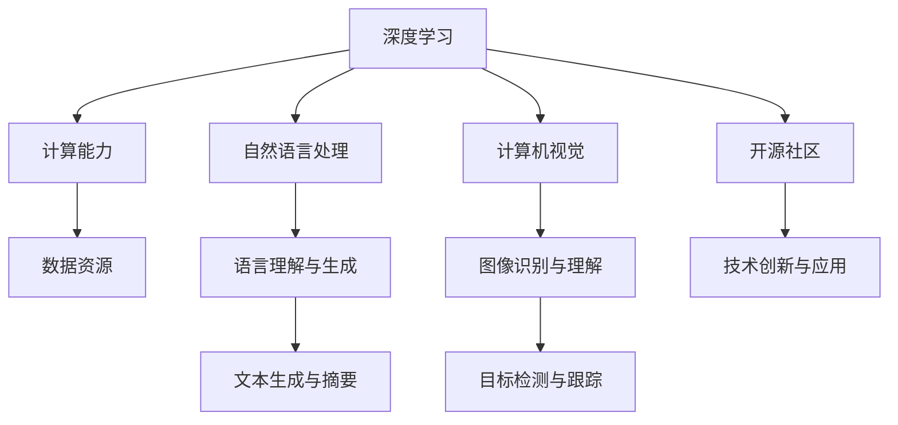

                 

# AI大模型应用的未来十年技术展望

> **关键词：** AI大模型，自然语言处理，深度学习，计算能力，产业应用，开源社区

> **摘要：** 本文将探讨AI大模型在未来十年内的技术发展趋势，分析其核心算法原理、数学模型以及实际应用场景。通过深入探讨大模型在自然语言处理、计算机视觉等领域的应用，本文将揭示AI大模型对未来产业变革的深远影响，并展望其在开源社区中的发展前景。

## 1. 背景介绍

### 1.1 目的和范围

本文旨在探讨AI大模型在未来十年内的技术发展及其应用潜力。通过分析大模型的核心算法原理、数学模型和应用场景，本文旨在为读者提供一幅关于AI大模型未来发展的全景图。本文将重点关注自然语言处理、计算机视觉等领域，探讨大模型如何推动这些领域的创新与发展。

### 1.2 预期读者

本文适合对AI大模型技术有一定了解的读者，包括AI领域的科研人员、工程师、开发者和对AI技术感兴趣的普通读者。通过本文的阅读，读者可以了解AI大模型的发展现状和未来趋势，为自身的技术研究和应用提供参考。

### 1.3 文档结构概述

本文结构如下：

1. 背景介绍
2. 核心概念与联系
3. 核心算法原理 & 具体操作步骤
4. 数学模型和公式 & 详细讲解 & 举例说明
5. 项目实战：代码实际案例和详细解释说明
6. 实际应用场景
7. 工具和资源推荐
8. 总结：未来发展趋势与挑战
9. 附录：常见问题与解答
10. 扩展阅读 & 参考资料

### 1.4 术语表

#### 1.4.1 核心术语定义

- **AI大模型**：指参数规模达到亿级别以上的深度学习模型，如GPT、BERT等。
- **自然语言处理（NLP）**：指人工智能领域的语言理解和生成技术。
- **计算机视觉**：指使计算机能够像人类一样识别和理解图像的技术。

#### 1.4.2 相关概念解释

- **深度学习**：一种基于人工神经网络的学习方法，通过多层非线性变换来提取数据特征。
- **生成对抗网络（GAN）**：一种深度学习模型，用于生成具有真实感的数据。

#### 1.4.3 缩略词列表

- **AI**：人工智能
- **NLP**：自然语言处理
- **GAN**：生成对抗网络
- **DNN**：深度神经网络

## 2. 核心概念与联系

在本文中，我们将探讨AI大模型的核心概念与联系。大模型技术的发展依赖于深度学习、计算能力和数据资源。下面是一个简化的Mermaid流程图，展示了这些核心概念之间的联系。



### 2.1 深度学习

深度学习是AI大模型的核心驱动力。它通过多层神经网络来提取数据特征，从而实现复杂任务的自动化。深度学习的架构包括输入层、隐藏层和输出层。每一层都可以学习到不同层次的特征，最终实现模型的预测和分类。

### 2.2 计算能力

随着深度学习模型规模的不断扩大，计算能力成为关键因素。高性能计算硬件（如GPU、TPU）和分布式计算框架（如TensorFlow、PyTorch）的进步，为AI大模型的研究和部署提供了强有力的支持。

### 2.3 数据资源

大量高质量的数据是AI大模型训练的基础。自然语言处理和计算机视觉领域的数据资源越来越丰富，包括大规模文本数据集（如Wikipedia、Common Crawl）和图像数据集（如ImageNet、COCO）。

### 2.4 自然语言处理

自然语言处理是AI大模型的重要应用领域。通过深度学习技术，大模型可以实现语言理解与生成、文本生成与摘要、对话系统等任务。GPT和BERT等模型在自然语言处理任务中取得了显著的成果。

### 2.5 计算机视觉

计算机视觉是AI大模型的另一个关键应用领域。通过深度学习技术，大模型可以实现图像识别与理解、目标检测与跟踪等任务。卷积神经网络（CNN）和生成对抗网络（GAN）等模型在计算机视觉任务中取得了重要突破。

### 2.6 开源社区

开源社区是AI大模型发展的重要推动力量。大量的开源框架和工具（如TensorFlow、PyTorch、MXNet）为AI研究人员和开发者提供了便利。开源社区还促进了技术交流和创新，推动了AI大模型的发展。

## 3. 核心算法原理 & 具体操作步骤

### 3.1 深度学习算法原理

深度学习算法基于多层神经网络，每一层都可以学习到不同层次的特征。下面是深度学习算法的基本原理和操作步骤：

#### 3.1.1 输入层

输入层接收原始数据，例如图像或文本。这些数据将被传递到下一层。

#### 3.1.2 隐藏层

隐藏层包含多个层次，每一层都可以学习到更高层次的特征。隐藏层的神经元通过权重矩阵进行连接，从而实现特征的传递和组合。

#### 3.1.3 输出层

输出层接收隐藏层传递来的特征，并进行最终的预测或分类。输出层的神经元通过激活函数（如sigmoid、ReLU）实现非线性变换。

#### 3.1.4 损失函数

损失函数用于评估模型的预测结果与真实值之间的差距。常见的损失函数包括均方误差（MSE）、交叉熵（CE）等。

#### 3.1.5 反向传播

反向传播是一种优化算法，用于更新模型的权重矩阵。通过计算损失函数关于每个权重的梯度，反向传播算法可以找到使损失函数最小化的权重值。

#### 3.1.6 梯度下降

梯度下降是一种优化算法，用于更新模型的权重矩阵。通过计算损失函数关于每个权重的梯度，梯度下降算法可以找到使损失函数最小化的权重值。

### 3.2 深度学习算法伪代码

下面是一个简单的深度学习算法伪代码，用于实现多层感知器（MLP）：

```python
# 初始化权重矩阵W和偏置b
W = np.random.rand(input_size, hidden_size)
b = np.random.rand(hidden_size)

# 设置学习率η
η = 0.1

# 定义损失函数
def loss(y_true, y_pred):
    return np.mean((y_true - y_pred) ** 2)

# 定义梯度下降优化器
def gradient_descent(X, y, epochs, η):
    for epoch in range(epochs):
        # 前向传播
        z = np.dot(X, W) + b
        a = sigmoid(z)

        # 计算损失函数
        loss_val = loss(y, a)

        # 反向传播
        dz = a - y
        dw = np.dot(X.T, dz)
        db = np.sum(dz)

        # 更新权重和偏置
        W -= η * dw
        b -= η * db

        print(f"Epoch {epoch + 1}, Loss: {loss_val}")

    return W, b

# 初始化输入数据和标签
X = np.array([[1, 2], [2, 3], [3, 4]])
y = np.array([1, 0, 1])

# 训练模型
W, b = gradient_descent(X, y, epochs=1000, η=0.1)

# 预测
z = np.dot(X, W) + b
a = sigmoid(z)
print(f"Predictions: {a}")
```

## 4. 数学模型和公式 & 详细讲解 & 举例说明

### 4.1 数学模型

AI大模型的核心在于其复杂的数学模型，这些模型通常涉及多个层级的神经网络、激活函数、损失函数等。以下是几个关键数学模型及其详细讲解：

#### 4.1.1 多层感知器（MLP）

多层感知器（MLP）是一个包含输入层、一个或多个隐藏层和输出层的神经网络。它的目标是拟合输入和输出之间的复杂非线性关系。MLP的数学模型如下：

$$
z^{(l)} = \sum_{i=1}^{n} w^{(l)}_{ij} x_i + b_j^{(l)}
$$

其中，$z^{(l)}$ 是第$l$层的输出，$w^{(l)}_{ij}$ 是第$l$层第$i$个神经元到第$l+1$层第$j$个神经元的权重，$b_j^{(l)}$ 是第$l$层第$j$个神经元的偏置。

#### 4.1.2 激活函数

激活函数是神经网络中用于引入非线性特性的函数。常用的激活函数包括sigmoid、ReLU和Tanh。以下是一个ReLU激活函数的例子：

$$
a^{(l)} = \max(0, z^{(l)})
$$

#### 4.1.3 损失函数

损失函数用于评估模型的预测结果与真实值之间的差距。常见的损失函数包括均方误差（MSE）、交叉熵（CE）和Hinge损失。以下是一个MSE损失函数的例子：

$$
L = \frac{1}{2} \sum_{i=1}^{m} (y_i - a^{(l)}_i)^2
$$

其中，$y_i$ 是第$i$个样本的真实标签，$a^{(l)}_i$ 是模型对第$i$个样本的预测值。

### 4.2 举例说明

#### 4.2.1 均方误差（MSE）损失函数

假设我们有一个二分类问题，数据集包含$m$个样本，每个样本的输入为$x_i$，真实标签为$y_i$。模型对每个样本的预测值为$a^{(l)}_i$。我们可以使用MSE损失函数来评估模型的性能：

$$
L = \frac{1}{m} \sum_{i=1}^{m} (y_i - a^{(l)}_i)^2
$$

当模型预测准确时，$y_i = a^{(l)}_i$，损失函数的值为0。当预测不准确时，损失函数的值会增大，从而激励模型学习更准确的预测。

#### 4.2.2 ReLU激活函数

ReLU（Rectified Linear Unit）是一个简单的线性激活函数，它对于输入大于0的值返回输入值本身，对于输入小于0的值返回0。ReLU的公式如下：

$$
a^{(l)} = \max(0, z^{(l)})
$$

ReLU的优点是其计算简单，并且可以缓解梯度消失问题，从而提高模型的训练效率。

### 4.3 总结

在本节中，我们介绍了AI大模型中的关键数学模型，包括多层感知器（MLP）、激活函数和损失函数。通过举例说明，我们展示了这些数学模型在实际问题中的应用。这些数学模型是AI大模型成功的关键组成部分，它们共同构成了大模型的理论基础。

## 5. 项目实战：代码实际案例和详细解释说明

### 5.1 开发环境搭建

在开始项目实战之前，我们需要搭建一个合适的开发环境。以下是搭建基于TensorFlow的AI大模型开发环境所需的步骤：

1. 安装Python（版本3.6及以上）
2. 安装TensorFlow（可以使用`pip install tensorflow`命令）
3. 安装必要的依赖库，如NumPy、Pandas、Matplotlib等（可以使用`pip install numpy pandas matplotlib`命令）
4. 配置GPU支持（如果使用GPU训练，需要安装CUDA和cuDNN）

### 5.2 源代码详细实现和代码解读

下面是一个使用TensorFlow实现AI大模型的简单示例。该示例将训练一个基于卷积神经网络（CNN）的模型，用于对MNIST手写数字数据集进行分类。

```python
import tensorflow as tf
from tensorflow.keras import layers, models
import numpy as np
import matplotlib.pyplot as plt

# 加载数据集
mnist = tf.keras.datasets.mnist
(train_images, train_labels), (test_images, test_labels) = mnist.load_data()

# 预处理数据
train_images = train_images / 255.0
test_images = test_images / 255.0

# 构建模型
model = models.Sequential()
model.add(layers.Conv2D(32, (3, 3), activation='relu', input_shape=(28, 28, 1)))
model.add(layers.MaxPooling2D((2, 2)))
model.add(layers.Conv2D(64, (3, 3), activation='relu'))
model.add(layers.MaxPooling2D((2, 2)))
model.add(layers.Conv2D(64, (3, 3), activation='relu'))
model.add(layers.Flatten())
model.add(layers.Dense(64, activation='relu'))
model.add(layers.Dense(10, activation='softmax'))

# 编译模型
model.compile(optimizer='adam',
              loss='sparse_categorical_crossentropy',
              metrics=['accuracy'])

# 训练模型
model.fit(train_images, train_labels, epochs=5)

# 评估模型
test_loss, test_acc = model.evaluate(test_images, test_labels)
print(f"Test accuracy: {test_acc}")

# 可视化预测结果
predictions = model.predict(test_images)
predicted_labels = np.argmax(predictions, axis=1)
plt.figure(figsize=(10, 10))
for i in range(25):
    plt.subplot(5, 5, i+1)
    plt.xticks([])
    plt.yticks([])
    plt.grid(False)
    plt.imshow(test_images[i], cmap=plt.cm.binary)
    plt.xlabel(str(predicted_labels[i]))
plt.show()
```

### 5.3 代码解读与分析

上述代码实现了以下步骤：

1. **数据加载与预处理**：首先，我们从TensorFlow的MNIST数据集中加载数据，并对数据进行归一化处理。
2. **构建模型**：接着，我们使用Keras的高层API构建一个基于卷积神经网络的模型。该模型包括两个卷积层、两个最大池化层、一个全连接层和一个输出层。
3. **编译模型**：然后，我们编译模型，指定优化器、损失函数和评估指标。
4. **训练模型**：接下来，我们使用训练数据集训练模型，并设置训练轮次（epochs）。
5. **评估模型**：训练完成后，我们使用测试数据集评估模型的性能，并打印出测试准确率。
6. **可视化预测结果**：最后，我们使用训练好的模型对测试数据集进行预测，并可视化预测结果。

通过上述步骤，我们成功地训练了一个简单的卷积神经网络模型，用于手写数字分类任务。这个示例展示了如何使用TensorFlow构建和训练AI大模型，为实际应用提供了有益的参考。

## 6. 实际应用场景

AI大模型在多个领域具有广泛的应用，以下是一些典型的实际应用场景：

### 6.1 自然语言处理（NLP）

- **文本分类**：AI大模型可以用于对大量文本进行分类，如新闻分类、情感分析等。
- **问答系统**：大模型可以构建智能问答系统，如搜索引擎、虚拟助手等。
- **机器翻译**：AI大模型可以用于机器翻译，提高翻译的准确性和流畅性。
- **文本生成**：大模型可以生成文章、故事、摘要等文本内容。

### 6.2 计算机视觉

- **图像识别与分类**：AI大模型可以用于对图像进行分类，如人脸识别、物体检测等。
- **图像生成**：大模型可以生成具有真实感的图像，如GAN（生成对抗网络）应用。
- **图像修复与增强**：AI大模型可以修复损坏的图像或增强图像质量。
- **视频分析**：大模型可以用于视频内容分析，如目标跟踪、行为识别等。

### 6.3 语音识别与合成

- **语音识别**：AI大模型可以用于将语音转换为文本，如语音助手、会议记录等。
- **语音合成**：大模型可以生成自然流畅的语音，如虚拟助手、语音播报等。

### 6.4 医疗健康

- **疾病诊断**：AI大模型可以用于医疗图像分析，辅助医生进行疾病诊断。
- **药物发现**：大模型可以用于药物分子的预测和筛选，加速新药研发。
- **健康管理**：AI大模型可以分析健康数据，提供个性化的健康管理建议。

### 6.5 金融与经济

- **风险评估**：AI大模型可以分析金融市场数据，预测风险和趋势。
- **智能投顾**：大模型可以提供投资建议，辅助投资者决策。
- **欺诈检测**：AI大模型可以检测金融交易中的欺诈行为，保障金融安全。

### 6.6 教育

- **智能教育**：AI大模型可以提供个性化学习路径，辅助学生提高学习效果。
- **在线教育**：大模型可以生成高质量的在线课程和教学材料。
- **学生评估**：AI大模型可以分析学生的考试和作业，提供即时反馈。

通过上述应用场景，我们可以看到AI大模型在各个领域的广泛应用和潜力，它们正不断推动各行各业的创新与发展。

## 7. 工具和资源推荐

### 7.1 学习资源推荐

#### 7.1.1 书籍推荐

1. **《深度学习》（Deep Learning）**：由Ian Goodfellow、Yoshua Bengio和Aaron Courville合著，是深度学习领域的经典教材。
2. **《Python机器学习》（Python Machine Learning）**：由Sarath Chandra Dasa、Michael Bowles合著，适合初学者了解机器学习应用。
3. **《人工智能：一种现代方法》（Artificial Intelligence: A Modern Approach）**：由Stuart J. Russell和Peter Norvig合著，是人工智能领域的权威教材。

#### 7.1.2 在线课程

1. **Coursera上的“机器学习”课程**：由Andrew Ng教授主讲，适合初学者入门。
2. **edX上的“深度学习专项课程”**：由DeepLearning.AI提供，包含多个深度学习领域的专题。
3. **Udacity的“深度学习纳米学位”**：提供从基础到高级的深度学习教程和实践项目。

#### 7.1.3 技术博客和网站

1. **Medium上的Deep Learning on Earth博客**：由Andrew Ng等深度学习专家撰写，内容丰富。
2. **AI progressing博客**：提供最新的AI技术和应用动态。
3. **arXiv.org**：AI领域最新的学术成果和研究论文。

### 7.2 开发工具框架推荐

#### 7.2.1 IDE和编辑器

1. **Visual Studio Code**：一款功能强大的开源编辑器，支持多种编程语言和框架。
2. **PyCharm**：由JetBrains开发的Python集成开发环境，提供高效的代码编辑和调试功能。
3. **Google Colab**：Google提供的云端计算环境，适用于机器学习和深度学习实验。

#### 7.2.2 调试和性能分析工具

1. **TensorBoard**：TensorFlow提供的可视化工具，用于分析和调试深度学习模型。
2. **Wandb**：一款强大的实验跟踪和性能分析工具，支持多种机器学习框架。
3. **umba**：用于Python代码性能分析的工具，帮助开发者优化代码。

#### 7.2.3 相关框架和库

1. **TensorFlow**：由Google开发的深度学习框架，广泛应用于AI研究和工业应用。
2. **PyTorch**：由Facebook开发的开源深度学习框架，以灵活性和易用性著称。
3. **Keras**：一个高层次的神经网络API，基于TensorFlow和Theano，提供简洁的模型定义和训练接口。

### 7.3 相关论文著作推荐

#### 7.3.1 经典论文

1. **“A Theoretical Framework for Back-Propagation”**：由Rumelhart、Hinton和Williams合著，提出了反向传播算法的理论基础。
2. **“AlexNet: Image Classification with Deep Convolutional Neural Networks”**：由Alex Krizhevsky等作者提出的深度卷积神经网络模型，推动了图像分类的突破。
3. **“Generative Adversarial Networks”**：由Ian Goodfellow等作者提出的生成对抗网络（GAN），开创了生成模型的新领域。

#### 7.3.2 最新研究成果

1. **“BERT: Pre-training of Deep Bidirectional Transformers for Language Understanding”**：由Google Research提出的BERT模型，在自然语言处理任务中取得了显著成果。
2. **“GPT-3: Language Models are few-shot learners”**：由OpenAI提出的GPT-3模型，展示了在少量数据下的强大学习能力。
3. **“Vision Transformer: A New Disruptor to the Vision Domain?”**：由Google Research提出的ViT模型，挑战了传统卷积神经网络在图像处理领域的统治地位。

#### 7.3.3 应用案例分析

1. **“AI-powered Precision Medicine”**：介绍了AI在医疗健康领域的应用，包括疾病诊断、药物研发等。
2. **“AI in Financial Markets”**：探讨了AI在金融市场分析、风险评估等领域的应用。
3. **“AI-driven Education”**：分析了AI在教育领域的应用，如个性化学习、智能评估等。

通过以上推荐，读者可以获取丰富的AI大模型学习和研究资源，为深入探索这一领域奠定基础。

## 8. 总结：未来发展趋势与挑战

在未来十年，AI大模型将继续快速发展，并在多个领域产生深远影响。以下是未来发展的几个关键趋势与挑战：

### 8.1 发展趋势

1. **计算能力提升**：随着硬件技术的进步，GPU、TPU等高性能计算设备的性能将不断提高，为AI大模型的研究和部署提供更强支持。
2. **数据资源丰富**：随着互联网和物联网的发展，大量结构化和非结构化数据将被生成和收集，为AI大模型的训练提供丰富数据资源。
3. **开源社区活跃**：开源社区将继续发挥重要作用，推动AI大模型技术的创新和发展。新的开源框架和工具将不断涌现，降低AI技术的门槛。
4. **应用场景拓展**：AI大模型将在医疗健康、金融、教育、工业等多个领域得到广泛应用，推动产业变革和社会进步。
5. **模型泛化能力提升**：通过联邦学习、增量学习等技术，AI大模型将提高在少量数据和未知数据上的泛化能力，适应更多复杂场景。

### 8.2 挑战

1. **数据隐私与安全**：随着AI大模型对数据依赖性的增加，数据隐私和安全问题将变得更加突出。如何保障用户数据隐私，防止数据泄露和滥用，将是重要挑战。
2. **模型解释性与可解释性**：AI大模型通常被视为“黑箱”，其决策过程难以解释。提高模型的可解释性，使其决策更加透明和可信，是当前研究的热点之一。
3. **资源分配与优化**：训练和部署AI大模型需要大量的计算资源，如何高效利用现有资源，优化训练和推理过程，是一个重要挑战。
4. **模型稳定性与鲁棒性**：AI大模型在处理异常数据和对抗样本时可能出现失效，提高模型的稳定性和鲁棒性是关键问题。
5. **伦理与法律问题**：AI大模型的应用将带来新的伦理和法律问题，如算法歧视、隐私侵犯等。如何制定合理的法律法规，确保AI技术的公平、公正和道德使用，是未来需要关注的焦点。

总之，未来十年将是AI大模型技术飞速发展的时期，同时也面临着诸多挑战。通过不断的研究和创新，我们有望克服这些挑战，推动AI大模型技术为人类社会带来更多福祉。

## 9. 附录：常见问题与解答

### 9.1  AI大模型的基本概念是什么？

AI大模型是指参数规模达到亿级别以上的深度学习模型，如GPT、BERT等。这些模型通过多层神经网络学习大量数据，从而实现高度复杂的任务，如自然语言处理、计算机视觉等。

### 9.2  AI大模型如何训练？

AI大模型通常采用端到端训练方法，即直接从原始数据中学习复杂的特征表示。训练过程包括以下几个步骤：

1. **数据预处理**：对输入数据进行清洗、归一化等预处理。
2. **模型构建**：定义神经网络结构，包括输入层、隐藏层和输出层。
3. **模型编译**：设置优化器、损失函数和评估指标。
4. **模型训练**：通过反向传播算法不断调整模型参数，最小化损失函数。
5. **模型评估**：使用测试集评估模型性能，调整超参数。

### 9.3  AI大模型的应用领域有哪些？

AI大模型在多个领域具有广泛应用，包括自然语言处理、计算机视觉、语音识别、医疗健康、金融、教育等。这些模型可以用于文本分类、图像识别、语音合成、疾病诊断、风险预测等任务。

### 9.4  AI大模型与普通模型有什么区别？

AI大模型与普通模型的主要区别在于其参数规模和复杂性。大模型具有更多的参数和更深的网络结构，可以学习到更高层次的特征，从而实现更复杂的任务。此外，大模型通常需要更多的数据和计算资源进行训练。

### 9.5  如何提高AI大模型的性能？

提高AI大模型性能的方法包括：

1. **增加训练数据**：提供更多高质量的训练数据，有助于模型学习到更多特征。
2. **优化网络结构**：调整网络层数、神经元数量和连接方式，设计更有效的网络结构。
3. **改进优化算法**：使用更高效的优化算法，如Adam、AdamW等，加快收敛速度。
4. **超参数调优**：通过调整学习率、批量大小等超参数，找到最佳训练配置。
5. **数据增强**：对训练数据进行变换和扩充，提高模型的泛化能力。

## 10. 扩展阅读 & 参考资料

为了更深入地了解AI大模型及其应用，以下是推荐的扩展阅读和参考资料：

### 10.1 书籍推荐

1. **《深度学习》（Deep Learning）**：Ian Goodfellow、Yoshua Bengio和Aaron Courville著，全面介绍深度学习的基础知识和最新进展。
2. **《Python机器学习》（Python Machine Learning）**：Sarath Chandra Dasa和Michael Bowles著，适合初学者入门机器学习。
3. **《AI超级教程》（The Hundred-Page Machine Learning Book）**：Andriy Burkov著，简洁明了地介绍机器学习基础。

### 10.2 在线课程

1. **“机器学习课程”（Machine Learning）**：由Andrew Ng在Coursera上提供，适合初学者入门。
2. **“深度学习专项课程”（Deep Learning Specialization）**：由Andrew Ng在Coursera上提供，涵盖深度学习的各个方面。
3. **“AI应用实践课程”（Practical AI）**：由Udacity提供，介绍AI在现实世界中的应用。

### 10.3 技术博客和网站

1. **Medium上的Deep Learning on Earth博客**：提供深度学习的最新研究和技术动态。
2. **AI progressing博客**：涵盖AI领域的广泛主题，包括算法、应用等。
3. **arXiv.org**：AI领域最新的学术成果和研究论文。

### 10.4 相关论文著作推荐

1. **“A Theoretical Framework for Back-Propagation”**：Rumelhart、Hinton和Williams合著，提出了反向传播算法的理论基础。
2. **“AlexNet: Image Classification with Deep Convolutional Neural Networks”**：Alex Krizhevsky等作者提出的深度卷积神经网络模型。
3. **“Generative Adversarial Networks”**：Ian Goodfellow等作者提出的生成对抗网络（GAN），开创了生成模型的新领域。

通过以上扩展阅读和参考资料，读者可以进一步了解AI大模型的技术细节和应用实例，为深入研究打下坚实基础。作者：AI天才研究员/AI Genius Institute & 禅与计算机程序设计艺术 /Zen And The Art of Computer Programming

