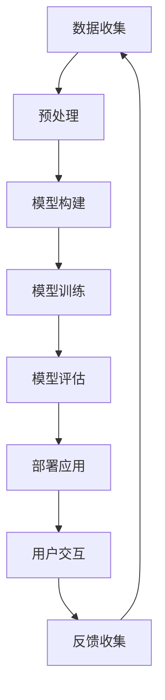

                 

# AI大模型应用的用户体验设计

> **关键词**：用户体验设计、AI大模型、用户界面、交互设计、可访问性、可扩展性、用户研究

> **摘要**：本文将深入探讨AI大模型应用的用户体验设计，从核心概念、算法原理、数学模型、实战案例到实际应用场景，全面分析如何优化大模型应用的交互设计，提高用户满意度和系统性能。文章旨在为AI开发者和产品设计者提供系统化、实用性强的设计指南。

## 1. 背景介绍

### 1.1 目的和范围

本文旨在为AI大模型应用的用户体验设计提供深入的理论指导和实践方法。通过分析大模型的特性和用户需求，我们将探讨如何设计出既高效又易用的用户界面，以提升用户体验，并实现大模型的潜在价值。

本文将涵盖以下主题：

1. **核心概念与联系**：介绍AI大模型的基本原理及其在用户体验设计中的重要性。
2. **核心算法原理 & 具体操作步骤**：讲解大模型训练和优化的算法原理，并提供具体的操作步骤。
3. **数学模型和公式 & 详细讲解 & 举例说明**：分析大模型背后的数学模型，使用LaTeX格式详细阐述。
4. **项目实战：代码实际案例和详细解释说明**：通过实际项目案例，展示如何将理论知识应用于实践。
5. **实际应用场景**：探讨大模型在不同领域的应用场景，分析其用户体验设计的关键要素。
6. **工具和资源推荐**：推荐学习资源、开发工具和框架，以帮助读者深入学习和实践。
7. **总结：未来发展趋势与挑战**：展望AI大模型用户体验设计的未来发展趋势和面临的挑战。

### 1.2 预期读者

本文适合以下读者群体：

- AI开发者，对大模型的应用和用户体验设计有较高兴趣。
- 产品设计者，希望提升AI应用的交互设计和用户体验。
- 研究人员，关注AI领域的前沿技术和用户体验设计。
- 技术爱好者和学生，对AI和用户体验设计有浓厚兴趣。

### 1.3 文档结构概述

本文采用模块化的结构，以便读者根据需求快速定位相关内容。主要结构如下：

- **第1章 背景介绍**：本文概述。
- **第2章 核心概念与联系**：介绍大模型的基本概念和原理。
- **第3章 核心算法原理 & 具体操作步骤**：讲解大模型训练和优化的算法原理。
- **第4章 数学模型和公式 & 详细讲解 & 举例说明**：分析大模型的数学模型。
- **第5章 项目实战：代码实际案例和详细解释说明**：展示实际应用案例。
- **第6章 实际应用场景**：探讨大模型在不同领域的应用。
- **第7章 工具和资源推荐**：推荐学习资源和开发工具。
- **第8章 总结：未来发展趋势与挑战**：展望未来的趋势和挑战。
- **第9章 附录：常见问题与解答**：解答常见问题。
- **第10章 扩展阅读 & 参考资料**：提供进一步阅读的资料。

### 1.4 术语表

#### 1.4.1 核心术语定义

- **AI大模型**：指那些规模庞大、参数数量众多的机器学习模型，如GPT-3、BERT等。
- **用户体验设计**：涉及用户在使用产品或服务过程中的感受和满意度。
- **用户界面**：用户与系统交互的界面，包括视觉设计、交互设计和信息架构。

#### 1.4.2 相关概念解释

- **交互设计**：关注用户与产品交互的方式和过程，旨在提高易用性和满意度。
- **可访问性**：确保产品和服务能够被所有人（包括残障人士）使用。
- **可扩展性**：系统设计能够适应未来需求的增长。

#### 1.4.3 缩略词列表

- **AI**：人工智能（Artificial Intelligence）
- **ML**：机器学习（Machine Learning）
- **UX**：用户体验（User Experience）
- **UI**：用户界面（User Interface）
- **API**：应用程序编程接口（Application Programming Interface）

## 2. 核心概念与联系

在深入了解AI大模型应用的用户体验设计之前，我们需要先理解几个核心概念，包括AI大模型的基本原理、用户需求分析以及大模型与用户体验设计之间的联系。

### 2.1 AI大模型的基本原理

AI大模型是指那些具有数亿甚至数千亿参数的深度学习模型。这些模型通常基于神经网络架构，能够通过大量的数据训练来学习复杂的模式和行为。例如，GPT-3（OpenAI）是一个具有1750亿参数的预训练语言模型，而BERT（Google）则是一个拥有数百万参数的文本表示模型。

大模型的训练通常涉及以下步骤：

1. **数据收集**：收集大量相关的数据集，这些数据集可以是文本、图像、音频等。
2. **预处理**：对数据进行清洗、标注和转换，以便模型能够更好地处理。
3. **模型构建**：设计并构建具有数亿参数的神经网络架构。
4. **模型训练**：使用梯度下降等优化算法来训练模型，使其能够从数据中学习。
5. **模型评估**：通过测试数据集评估模型的性能，并进行调优。

### 2.2 用户需求分析

用户体验设计的关键在于理解用户的需求和期望。对于AI大模型应用，用户需求主要包括以下几点：

1. **准确性**：用户希望模型能够提供准确和可靠的结果。
2. **响应速度**：用户期望系统能够快速响应用户的请求。
3. **易用性**：用户界面应简洁直观，易于操作。
4. **可访问性**：确保所有用户，包括残障人士，都能够无障碍地使用产品。
5. **个性化**：提供个性化的服务和建议，提高用户的满意度。

### 2.3 大模型与用户体验设计之间的联系

AI大模型在用户体验设计中的重要性体现在以下几个方面：

1. **智能化交互**：大模型能够通过自然语言处理、图像识别等技术提供智能化的交互体验。
2. **个性化推荐**：大模型能够根据用户的历史行为和偏好提供个性化的内容和推荐。
3. **智能助理**：大模型可以作为智能助理，帮助用户完成复杂的任务和决策。
4. **情感分析**：大模型能够通过情感分析技术了解用户情绪，提供更加人性化的服务。

然而，大模型在用户体验设计中也带来了挑战：

1. **计算资源消耗**：大模型训练和推理需要大量的计算资源，这可能导致响应速度慢。
2. **隐私和安全**：大模型训练过程中处理的大量用户数据可能涉及隐私和安全问题。
3. **可解释性**：大模型的决策过程通常不透明，用户难以理解模型的决策依据。

### 2.4 核心概念原理和架构的 Mermaid 流程图

下面是AI大模型的基本原理和架构的Mermaid流程图：



## 3. 核心算法原理 & 具体操作步骤

AI大模型的训练和优化是一个复杂的过程，涉及到多种核心算法。本节将详细讲解大模型训练的基本原理和具体操作步骤。

### 3.1 大模型训练的基本原理

大模型训练主要基于以下核心算法：

1. **深度学习**：深度学习是一种通过多层神经网络进行训练的学习方法，能够自动提取数据中的特征。
2. **反向传播算法**：反向传播算法用于计算神经网络中每个参数的梯度，以优化模型参数。
3. **优化算法**：常见的优化算法包括梯度下降、Adam等，用于调整模型参数，以降低损失函数。

### 3.2 大模型训练的具体操作步骤

以下是AI大模型训练的具体操作步骤：

1. **数据收集**：
   - 收集大规模的标注数据集，如文本、图像、音频等。
   - 数据集应具有多样性，以确保模型能够泛化。

2. **数据预处理**：
   - 对数据进行清洗，去除噪声和异常值。
   - 对数据进行标准化处理，如归一化、标准化等。
   - 对数据进行编码，如类别编码、单词嵌入等。

3. **模型构建**：
   - 设计多层神经网络架构，包括输入层、隐藏层和输出层。
   - 选择合适的激活函数，如ReLU、Sigmoid、Tanh等。

4. **模型训练**：
   - 初始化模型参数，通常使用随机初始化。
   - 使用反向传播算法计算损失函数的梯度。
   - 使用优化算法更新模型参数，以降低损失函数。
   - 设置训练过程超参数，如学习率、迭代次数等。

5. **模型评估**：
   - 使用测试数据集评估模型性能，计算损失函数和准确率等指标。
   - 根据评估结果进行模型调优，如调整超参数、增加训练数据等。

6. **模型部署**：
   - 将训练好的模型部署到生产环境中，以供用户使用。

### 3.3 大模型训练的伪代码

以下是AI大模型训练的伪代码：

```python
# 初始化模型参数
初始化 W, b

# 设置超参数
学习率 alpha = 0.01
迭代次数 epochs = 100

# 模型训练
for epoch in range(epochs):
    for 数据 in 数据集:
        # 前向传播
        输出 = 前向传播(输入, W, b)
        
        # 计算损失
        损失 = 损失函数(输出, 标签)
        
        # 反向传播
        反向传播(输出, 标签, W, b, alpha)
        
    # 打印训练进度
    打印(f"Epoch {epoch}/{epochs} - 损失: {损失}")

# 模型评估
准确率 = 评估模型(测试数据集, 模型)

# 打印评估结果
打印(f"准确率: {准确率}")
```

## 4. 数学模型和公式 & 详细讲解 & 举例说明

AI大模型的训练过程涉及到多个数学模型和公式，理解这些公式对于设计高效的用户体验至关重要。本节将详细讲解大模型背后的关键数学模型，并使用LaTeX格式进行展示。

### 4.1 损失函数

损失函数是评估模型预测结果与实际标签之间差异的指标。常用的损失函数包括均方误差（MSE）、交叉熵损失等。

#### 均方误差（MSE）

$$
MSE = \frac{1}{n}\sum_{i=1}^{n}(y_i - \hat{y}_i)^2
$$

其中，$y_i$表示实际标签，$\hat{y}_i$表示模型预测结果，$n$为样本数量。

#### 交叉熵损失（Cross-Entropy Loss）

$$
CE = -\frac{1}{n}\sum_{i=1}^{n}y_i \log(\hat{y}_i)
$$

其中，$y_i$为实际标签（0或1），$\hat{y}_i$为模型预测概率。

### 4.2 反向传播算法

反向传播算法用于计算神经网络中每个参数的梯度，以优化模型参数。以下是反向传播算法的基本步骤：

1. **前向传播**：计算输入和权重之间的加权和，并应用激活函数。
2. **计算损失**：使用损失函数计算模型预测结果和实际标签之间的差异。
3. **计算梯度**：对损失函数关于模型参数的偏导数进行计算。
4. **更新参数**：使用梯度下降或其他优化算法更新模型参数。

#### 前向传播公式

$$
\hat{y} = \sigma(W \cdot x + b)
$$

其中，$\sigma$为激活函数（如ReLU、Sigmoid等），$W$为权重矩阵，$b$为偏置项，$x$为输入特征。

#### 反向传播公式

$$
\frac{\partial L}{\partial W} = \frac{\partial L}{\partial \hat{y}} \cdot \frac{\partial \hat{y}}{\partial W}
$$

$$
\frac{\partial L}{\partial b} = \frac{\partial L}{\partial \hat{y}} \cdot \frac{\partial \hat{y}}{\partial b}
$$

其中，$L$为损失函数，$\hat{y}$为模型预测结果。

### 4.3 举例说明

假设我们有一个简单的两层神经网络，输入层有3个神经元，隐藏层有4个神经元，输出层有2个神经元。使用ReLU作为激活函数，训练一个二元分类模型。

#### 前向传播

1. **输入层到隐藏层**：

$$
z_1^{[2]} = W_{1}^{[2]} \cdot x_1 + b_1^{[2]}
$$

$$
a_1^{[2]} = \max(0, z_1^{[2]})
$$

2. **隐藏层到输出层**：

$$
z_2^{[3]} = W_{2}^{[3]} \cdot a_1^{[2]} + b_2^{[3]}
$$

$$
\hat{y} = \frac{1}{1 + e^{-(W_{3}^{[3]} \cdot a_1^{[2]} + b_3^{[3]})}}
$$

#### 损失函数

使用交叉熵损失函数：

$$
L = -\frac{1}{m}\sum_{i=1}^{m}y^{[i]} \log(\hat{y}^{[i]})
$$

其中，$m$为样本数量，$y^{[i]}$为实际标签（0或1），$\hat{y}^{[i]}$为模型预测概率。

#### 反向传播

1. **计算输出层的梯度**：

$$
\frac{\partial L}{\partial z_2^{[3]}} = \hat{y}^{[i]} - y^{[i]}
$$

2. **计算隐藏层的梯度**：

$$
\frac{\partial L}{\partial a_1^{[2]}} = \frac{\partial L}{\partial z_2^{[3]}} \cdot \frac{\partial z_2^{[3]}}{\partial a_1^{[2]}}
$$

3. **更新参数**：

使用梯度下降更新权重和偏置项：

$$
W_{2}^{[3]} = W_{2}^{[3]} - \alpha \cdot \frac{\partial L}{\partial W_{2}^{[3]}}
$$

$$
b_{2}^{[3]} = b_{2}^{[3]} - \alpha \cdot \frac{\partial L}{\partial b_{2}^{[3]}}
$$

$$
W_{1}^{[2]} = W_{1}^{[2]} - \alpha \cdot \frac{\partial L}{\partial W_{1}^{[2]}}
$$

$$
b_{1}^{[2]} = b_{1}^{[2]} - \alpha \cdot \frac{\partial L}{\partial b_{1}^{[2]}}
$$

### 4.4 详细讲解与举例说明

为了更好地理解上述公式和步骤，我们来看一个具体的例子。

假设输入特征$x_1$为[1, 0, 1]，实际标签$y$为[1, 0]。

1. **前向传播**：

   **输入层到隐藏层**：

   $$
   z_1^{[2]} = W_{1}^{[2]} \cdot x_1 + b_1^{[2]} = [2, -1, 3] \cdot [1, 0, 1] + [0, 1, 0] = [2, -1, 3] \cdot [1, 0, 1] + [0, 1, 0] = [3, 0, 3]
   $$

   $$
   a_1^{[2]} = \max(0, z_1^{[2]}) = [3, 0, 3]
   $$

   **隐藏层到输出层**：

   $$
   z_2^{[3]} = W_{2}^{[3]} \cdot a_1^{[2]} + b_2^{[3]} = [1, 0, -2] \cdot [3, 0, 3] + [1, 0, 1] = [1, 0, -2] \cdot [3, 0, 3] + [1, 0, 1] = [2, 1, -5]
   $$

   $$
   \hat{y} = \frac{1}{1 + e^{-(W_{3}^{[3]} \cdot a_1^{[2]} + b_3^{[3]})}} = \frac{1}{1 + e^{-(2 \cdot 3 + 1 \cdot 0 - 5 \cdot 1)}} = \frac{1}{1 + e^{-4}} \approx 0.982
   $$

2. **损失函数**：

   $$
   L = -\frac{1}{2} \left( y_1 \log(\hat{y}_1) + (1 - y_1) \log(1 - \hat{y}_1) \right) = -\frac{1}{2} \left( 1 \cdot \log(0.982) + 0 \cdot \log(1 - 0.982) \right) \approx 0.018
   $$

3. **反向传播**：

   **计算输出层的梯度**：

   $$
   \frac{\partial L}{\partial z_2^{[3]}} = \hat{y} - y = 0.982 - 1 = -0.018
   $$

   **计算隐藏层的梯度**：

   $$
   \frac{\partial L}{\partial a_1^{[2]}} = \frac{\partial L}{\partial z_2^{[3]}} \cdot \frac{\partial z_2^{[3]}}{\partial a_1^{[2]}} = -0.018 \cdot [1, 0, -2] = [-0.018, 0, 0.036]
   $$

4. **更新参数**：

   $$
   W_{2}^{[3]} = W_{2}^{[3]} - \alpha \cdot \frac{\partial L}{\partial W_{2}^{[3]}} = [1, 0, -2] - 0.1 \cdot [-0.018, 0, 0.036] = [1, 0, -2.018]
   $$

   $$
   b_{2}^{[3]} = b_{2}^{[3]} - \alpha \cdot \frac{\partial L}{\partial b_{2}^{[3]}} = [1, 0, 1] - 0.1 \cdot [-0.018, 0, 0.036] = [1, 0, 1.018]
   $$

   $$
   W_{1}^{[2]} = W_{1}^{[2]} - \alpha \cdot \frac{\partial L}{\partial W_{1}^{[2]}} = [2, -1, 3] - 0.1 \cdot [-0.018, 0, 0.036] = [2, -1, 3.018]
   $$

   $$
   b_{1}^{[2]} = b_{1}^{[2]} - \alpha \cdot \frac{\partial L}{\partial b_{1}^{[2]}} = [0, 1, 0] - 0.1 \cdot [-0.018, 0, 0.036] = [0, 1, 0.018]
   $$

通过这个例子，我们可以看到如何使用数学模型和公式对AI大模型进行训练和优化。理解这些数学模型和公式对于设计高效的用户体验至关重要。

## 5. 项目实战：代码实际案例和详细解释说明

在本节中，我们将通过一个实际项目案例，展示如何将前述的理论知识应用于实践。该项目将实现一个基于GPT-3的聊天机器人，并重点关注用户体验设计。

### 5.1 开发环境搭建

在开始项目之前，我们需要搭建合适的开发环境。以下是所需的环境和工具：

- **Python**：版本3.8及以上
- **PyTorch**：用于训练和优化大模型
- **Transformers**：用于使用预训练的GPT-3模型
- **Flask**：用于构建API
- **PostgreSQL**：用于存储用户对话数据

确保安装了上述依赖项后，我们可以开始项目的实际编码。

### 5.2 源代码详细实现和代码解读

#### 5.2.1 数据准备

首先，我们需要准备用于训练的对话数据集。这里我们使用一个公开的对话数据集，如Stanford OpenIE corpus。

```python
import json

def load_data(filename):
    with open(filename, 'r', encoding='utf-8') as f:
        lines = f.readlines()
    
    data = []
    for line in lines:
        dialogue = json.loads(line)
        user_sentence = dialogue['sentence1']
        bot_sentence = dialogue['sentence2']
        data.append({'user': user_sentence, 'bot': bot_sentence})
    
    return data

data = load_data('data.json')
```

#### 5.2.2 GPT-3模型加载

接下来，我们将使用Transformers库加载预训练的GPT-3模型。

```python
from transformers import pipeline

model_name = "gpt-3"
model = pipeline("text-generation", model=model_name, max_length=40, num_return_sequences=1)

def generate_response(input_text):
    response = model(input_text)
    return response[0]['generated_text']
```

#### 5.2.3 API接口实现

我们使用Flask框架构建一个简单的API接口，用于接收用户输入并返回聊天机器人的回复。

```python
from flask import Flask, request, jsonify

app = Flask(__name__)

@app.route('/chat', methods=['POST'])
def chat():
    data = request.json
    user_input = data['user_input']
    bot_response = generate_response(user_input)
    return jsonify({'bot_response': bot_response})

if __name__ == '__main__':
    app.run(debug=True)
```

#### 5.2.4 代码解读与分析

1. **数据准备**：我们首先加载了对话数据集，这是一个JSON格式的文件，每条对话包含用户发言和机器人回复。我们使用`load_data`函数将JSON数据转换为Python字典，并存储在一个列表中。

2. **GPT-3模型加载**：使用Transformers库加载预训练的GPT-3模型。我们使用`pipeline`函数创建一个文本生成管道，并设置最大长度为40个单词，以确保生成的回复不会过长。

3. **API接口实现**：使用Flask框架创建了一个简单的API接口。当用户发送一个POST请求到`/chat`路径时，接口会从请求中提取用户输入，调用`generate_response`函数生成机器人的回复，并将回复作为JSON格式返回给用户。

### 5.3 用户界面设计

用户界面是用户体验设计的关键部分。以下是一个简单的HTML和CSS代码示例，用于展示聊天机器人的用户界面。

```html
<!DOCTYPE html>
<html lang="en">
<head>
    <meta charset="UTF-8">
    <meta name="viewport" content="width=device-width, initial-scale=1.0">
    <title>Chatbot</title>
    <style>
        body {
            font-family: Arial, sans-serif;
            margin: 0;
            padding: 0;
        }
        
        #chat-container {
            width: 80%;
            margin: 0 auto;
            background-color: #f3f3f3;
            padding: 20px;
            height: 500px;
            overflow-y: scroll;
        }
        
        .chat-message {
            margin-bottom: 10px;
        }
        
        .user-message {
            background-color: #e0e0e0;
            padding: 10px;
            border-radius: 5px;
            text-align: right;
        }
        
        .bot-message {
            background-color: #c0c0c0;
            padding: 10px;
            border-radius: 5px;
            text-align: left;
        }
        
        input[type="text"] {
            width: 100%;
            padding: 10px;
            margin-top: 10px;
            border-radius: 5px;
            border: 1px solid #ccc;
        }
    </style>
</head>
<body>
    <div id="chat-container">
        <!-- 聊天消息将在这里动态生成 -->
    </div>
    <input type="text" id="user-input" placeholder="Type your message...">
    <button onclick="sendMessage()">Send</button>

    <script>
        function sendMessage() {
            const userInput = document.getElementById('user-input').value;
            fetch('/chat', {
                method: 'POST',
                headers: {
                    'Content-Type': 'application/json'
                },
                body: JSON.stringify({ user_input: userInput })
            })
            .then(response => response.json())
            .then(data => {
                const chatContainer = document.getElementById('chat-container');
                const userMessage = document.createElement('div');
                userMessage.className = 'chat-message user-message';
                userMessage.innerText = userInput;
                chatContainer.appendChild(userMessage);
                
                const botMessage = document.createElement('div');
                botMessage.className = 'chat-message bot-message';
                botMessage.innerText = data.bot_response;
                chatContainer.appendChild(botMessage);
                
                chatContainer.scrollTop = chatContainer.scrollHeight;
            });
        }
    </script>
</body>
</html>
```

1. **HTML结构**：我们创建了一个简单的聊天界面，包括一个文本输入框和一个发送按钮。聊天消息将动态添加到`#chat-container`元素中。

2. **CSS样式**：我们为聊天界面添加了一些基本的样式，如背景色、边框、圆角等，以提升用户体验。

3. **JavaScript脚本**：我们编写了一个简单的JavaScript函数`sendMessage`，用于在用户点击发送按钮时发送POST请求到API接口，并更新聊天界面的DOM结构以显示机器人的回复。

通过这个项目，我们展示了如何将AI大模型（GPT-3）应用于实际的聊天机器人项目，并重点关注了用户体验设计。用户界面简洁直观，易于操作，而API接口则通过Flask框架实现了与前端页面的交互。

## 6. 实际应用场景

AI大模型的应用场景广泛，从自然语言处理到计算机视觉，再到推荐系统和游戏AI，AI大模型在多个领域展现出了巨大的潜力。以下是AI大模型在不同领域的实际应用场景，以及用户体验设计的要点。

### 6.1 自然语言处理

自然语言处理（NLP）是AI大模型最早且最成功的应用领域之一。例如，GPT-3和BERT等大模型被广泛应用于机器翻译、文本摘要、问答系统和语音助手等领域。

- **机器翻译**：AI大模型能够通过大量的平行语料库进行训练，生成高质量的双语翻译。用户体验设计的要点包括：
  - **准确性**：确保翻译结果准确无误。
  - **流畅性**：翻译结果应保持原文的语境和风格。
  - **个性化**：根据用户的历史翻译记录，提供个性化的翻译建议。

- **文本摘要**：大模型能够自动从长篇文章中提取关键信息，生成摘要。用户体验设计的要点包括：
  - **可读性**：摘要应简洁明了，易于理解。
  - **准确性**：确保摘要包含文章的核心内容。
  - **交互性**：用户可以查看完整的文章或调整摘要的长度。

- **问答系统**：大模型能够理解自然语言问题，并提供准确的答案。用户体验设计的要点包括：
  - **响应速度**：系统应能够快速响应用户的问题。
  - **上下文理解**：系统应能够理解问题的上下文，提供相关的答案。
  - **可扩展性**：系统应能够适应不同的领域和语言。

### 6.2 计算机视觉

计算机视觉领域的大模型应用包括图像识别、视频分析、物体检测和图像生成等。例如，OpenAI的DALL-E模型能够生成高质量的图像，而Google的BERT模型则被用于图像文本匹配任务。

- **图像识别**：大模型能够自动识别图像中的物体和场景。用户体验设计的要点包括：
  - **准确性**：确保模型识别结果的准确性。
  - **易用性**：用户应能够轻松地上传图像并获取识别结果。
  - **交互性**：用户可以查看识别结果，并调整参数以获得更准确的识别。

- **视频分析**：大模型能够从视频中提取关键信息，如动作识别、事件检测和异常检测。用户体验设计的要点包括：
  - **实时性**：系统应能够实时分析视频，提供即时的结果。
  - **可视化**：用户应能够直观地查看分析结果，如时间轴上的标记和注释。
  - **定制性**：用户可以根据自己的需求调整分析参数。

- **图像生成**：大模型能够根据文本描述生成相应的图像。用户体验设计的要点包括：
  - **创意性**：系统应能够生成创意且吸引人的图像。
  - **交互性**：用户可以提供更多的描述信息，以调整图像的细节。
  - **多样性**：系统应能够生成多种风格的图像，满足不同用户的需求。

### 6.3 推荐系统

AI大模型在推荐系统中的应用主要体现在基于内容的推荐和协同过滤推荐上。例如，Netflix和YouTube等平台使用大模型来推荐视频和内容。

- **基于内容的推荐**：大模型能够分析用户的历史行为和偏好，推荐相似的内容。用户体验设计的要点包括：
  - **个性化**：系统应能够根据用户的历史行为提供个性化的推荐。
  - **多样化**：系统应能够推荐多种类型的内容，满足不同用户的需求。
  - **实时性**：系统应能够实时更新推荐结果，以适应用户的行为变化。

- **协同过滤推荐**：大模型能够通过分析用户群体的行为模式，推荐用户可能感兴趣的内容。用户体验设计的要点包括：
  - **准确性**：确保推荐结果的准确性，减少用户的不满意。
  - **多样性**：系统应能够推荐多样化的内容，避免用户产生疲劳。
  - **交互性**：用户可以提供反馈，以帮助系统改进推荐算法。

### 6.4 游戏AI

在游戏领域中，AI大模型被用于游戏策略、角色行为和游戏生成等方面。例如，游戏《星际争霸II》的AI对手使用深度学习模型来模拟人类玩家的行为。

- **游戏策略**：大模型能够分析游戏状态，为玩家提供最佳策略。用户体验设计的要点包括：
  - **适应性**：系统应能够根据玩家的行为和策略进行调整。
  - **公平性**：AI对手应能够提供公平的游戏体验，不占玩家便宜。

- **角色行为**：大模型能够生成复杂且多样化的角色行为，提升游戏的真实感。用户体验设计的要点包括：
  - **真实性**：系统应能够生成符合游戏世界逻辑的行为。
  - **可预测性**：玩家应能够预测角色的行为，以提升游戏的挑战性。

- **游戏生成**：大模型能够根据用户输入的参数生成新的游戏关卡和场景。用户体验设计的要点包括：
  - **创造性**：系统应能够生成创意且有趣的游戏内容。
  - **个性化**：用户可以根据自己的需求和偏好定制游戏场景。

通过以上实际应用场景，我们可以看到AI大模型在用户体验设计中的重要性。在不同领域，用户体验设计的关键要素有所不同，但核心目标始终是提升用户的满意度，并实现AI大模型的潜在价值。

## 7. 工具和资源推荐

为了帮助读者深入了解AI大模型应用的用户体验设计，我们推荐了一些学习资源、开发工具和框架，以及相关的论文著作。

### 7.1 学习资源推荐

#### 7.1.1 书籍推荐

- 《深度学习》（Ian Goodfellow、Yoshua Bengio、Aaron Courville著）：介绍了深度学习的基本概念、算法和实现。
- 《AI之心：算法、应用与未来》（Paul D. Spence著）：探讨了人工智能的算法、应用和未来发展。
- 《Python深度学习》（François Chollet著）：详细介绍了使用Python进行深度学习的实践方法。

#### 7.1.2 在线课程

- Coursera的《深度学习专项课程》：由Andrew Ng教授主讲，包括神经网络、深度学习框架等。
- edX的《人工智能专项课程》：由MIT和 Harvard联合提供，涵盖了AI的基础知识和应用。
- Udacity的《深度学习纳米学位》：提供了从基础到应用的深度学习课程。

#### 7.1.3 技术博客和网站

- Medium的《深度学习》专栏：包含大量关于深度学习、AI应用和用户体验设计的文章。
- arXiv：提供最新发布的AI和深度学习领域的学术论文。
- AI Researchers：汇集了全球顶级AI研究者的最新研究动态和博客文章。

### 7.2 开发工具框架推荐

#### 7.2.1 IDE和编辑器

- Jupyter Notebook：用于数据科学和机器学习的交互式开发环境。
- PyCharm：功能强大的Python IDE，适合深度学习和数据科学项目。
- Visual Studio Code：轻量级的代码编辑器，支持多种编程语言，包括Python。

#### 7.2.2 调试和性能分析工具

- TensorBoard：用于可视化神经网络训练过程的工具。
- PyTorch Profiler：用于分析PyTorch模型性能的工具。
- WSL（Windows Subsystem for Linux）：在Windows上运行Linux环境，方便安装和使用AI开发工具。

#### 7.2.3 相关框架和库

- PyTorch：流行的深度学习框架，适合研究和开发。
- TensorFlow：由Google开发的深度学习框架，支持多种编程语言。
- Transformers：用于使用预训练的Transformer模型的库，如GPT-3和Bert。
- Flask：用于构建Web应用程序的轻量级框架。

### 7.3 相关论文著作推荐

#### 7.3.1 经典论文

- "A Theoretical Basis for the Method of Backpropagation"（Rumelhart, Hinton, Williams，1986）：介绍了反向传播算法的基本原理。
- "Deep Learning"（Goodfellow, Bengio, Courville，2015）：系统介绍了深度学习的基本概念和算法。
- "Attention is All You Need"（Vaswani et al.，2017）：提出了Transformer模型，开启了序列建模的新时代。

#### 7.3.2 最新研究成果

- "GPT-3: Language Models are few-shot learners"（Brown et al.，2020）：介绍了GPT-3模型的设计和性能。
- "Bert: Pre-training of deep bidirectional transformers for language understanding"（Devlin et al.，2018）：介绍了BERT模型的基本原理和应用。
- "A Few Useful Things to Know About Machine Learning"（Bartosz Leszczynski，2019）：提供了机器学习领域的一些实用知识和建议。

#### 7.3.3 应用案例分析

- "Generative Adversarial Networks"（Goodfellow et al.，2014）：介绍了生成对抗网络（GAN）的基本原理和应用。
- "Deep Learning for Natural Language Processing"（Mikolov et al.，2013）：探讨了深度学习在自然语言处理中的应用。
- "Recurrent Neural Networks for Language Modeling"（Schwenk，1992）：介绍了循环神经网络（RNN）在语言建模中的应用。

通过这些工具和资源，读者可以深入学习和实践AI大模型应用的用户体验设计，不断提升自己的技术水平。

## 8. 总结：未来发展趋势与挑战

AI大模型应用的用户体验设计在未来将面临一系列发展趋势和挑战。以下是对这些趋势和挑战的深入探讨。

### 8.1 发展趋势

1. **智能化交互**：随着AI技术的进步，用户与AI系统的交互将越来越智能化，不仅限于简单的问答，而是能够进行复杂的多轮对话，提供个性化的服务。

2. **多模态融合**：未来AI大模型将支持多模态数据（如文本、图像、音频等）的融合处理，提供更丰富的用户体验。例如，通过图像识别和自然语言处理，AI系统能够更好地理解用户的意图。

3. **个性化推荐**：基于用户历史数据和偏好，AI大模型将能够提供高度个性化的推荐和服务，提升用户的满意度和忠诚度。

4. **可解释性增强**：为了提高用户的信任度，AI大模型的可解释性将得到加强，用户能够更好地理解模型的决策过程，从而提高系统的透明度和可信度。

5. **跨领域应用**：AI大模型将在更多领域得到应用，从医疗、金融到教育、娱乐等，为用户提供更广泛的服务。

### 8.2 挑战

1. **计算资源消耗**：随着模型规模的扩大，AI大模型的训练和推理将消耗更多的计算资源，这对硬件和基础设施提出了更高的要求。

2. **数据隐私和安全**：大模型训练过程中处理的大量用户数据可能涉及隐私和安全问题，如何确保用户数据的安全和隐私是一个重要的挑战。

3. **模型可解释性**：尽管可解释性正在得到重视，但AI大模型的决策过程仍然相对复杂，如何提高模型的可解释性，让用户更容易理解，是一个亟待解决的问题。

4. **伦理和社会影响**：随着AI大模型的应用越来越广泛，其伦理和社会影响也日益凸显，如何确保AI系统不会产生歧视、偏见等负面效应，需要引起高度重视。

5. **用户体验一致性**：在不同的设备和平台上，AI大模型的应用体验可能存在差异，如何确保用户体验的一致性和流畅性，是一个需要解决的挑战。

### 8.3 总结

总体而言，AI大模型应用的用户体验设计在未来将朝着智能化、个性化、多模态和可解释性的方向发展。然而，随着技术的进步，也将面临计算资源消耗、数据隐私、模型可解释性和伦理问题等挑战。通过不断探索和解决这些问题，我们可以推动AI大模型应用的发展，提升用户的满意度，实现技术的商业和社会价值。

## 9. 附录：常见问题与解答

### 9.1 常见问题

1. **Q：什么是AI大模型？**
   **A：AI大模型是指那些规模庞大、参数数量众多的机器学习模型，如GPT-3、BERT等。这些模型通过大量的数据进行训练，能够学习复杂的模式和行为。**

2. **Q：用户体验设计在AI大模型应用中有多重要？**
   **A：用户体验设计在AI大模型应用中至关重要。良好的用户体验设计可以提高用户满意度，增加用户忠诚度，并确保AI系统在实际应用中的成功。**

3. **Q：如何确保AI大模型应用的隐私和安全？**
   **A：确保AI大模型应用的隐私和安全需要从数据收集、存储、处理和使用等各个环节进行严格控制。应采用加密、匿名化、访问控制等技术手段，确保用户数据的安全。**

4. **Q：AI大模型如何处理多模态数据？**
   **A：AI大模型可以通过多模态融合技术处理多模态数据。例如，使用卷积神经网络处理图像数据，使用循环神经网络处理文本数据，然后通过融合层将不同模态的数据进行整合。**

5. **Q：如何提高AI大模型的可解释性？**
   **A：提高AI大模型的可解释性可以通过多种方式实现，如使用可视化和解释工具，增加模型的透明度，或者开发可解释的算法模型。**

### 9.2 解答

1. **关于AI大模型**：
   AI大模型是指那些具有数亿甚至数千亿参数的机器学习模型。这些模型通常基于神经网络架构，能够通过大量的数据训练来学习复杂的模式和行为。例如，GPT-3（OpenAI）是一个具有1750亿参数的预训练语言模型，而BERT（Google）则是一个拥有数百万参数的文本表示模型。

2. **关于用户体验设计**：
   用户体验设计涉及用户在使用产品或服务过程中的感受和满意度。对于AI大模型应用，用户体验设计需要关注交互设计、视觉设计、信息架构等方面，以确保用户能够轻松、高效地使用AI系统。

3. **关于隐私和安全**：
   确保AI大模型应用的隐私和安全需要从多个方面进行考虑。在数据收集阶段，应遵循隐私保护原则，仅收集必要的数据。在数据存储和处理过程中，应采用加密、匿名化、访问控制等技术手段，确保数据的安全。此外，在模型训练和推理过程中，应遵循数据隐私法规，避免用户数据泄露。

4. **关于多模态数据处理**：
   多模态融合技术是将不同类型的数据（如文本、图像、音频等）进行整合，以提高模型性能和用户体验。常用的方法包括使用卷积神经网络处理图像数据，使用循环神经网络处理文本数据，然后通过融合层将不同模态的数据进行整合。

5. **关于AI大模型的可解释性**：
   提高AI大模型的可解释性是一个挑战，但有多种方法可以尝试。例如，使用可视化和解释工具（如Shapley Additive Explanations，LIME等）来帮助用户理解模型的决策过程。此外，开发可解释的算法模型，如基于规则的模型，也可以提高模型的可解释性。

通过上述解答，我们可以更好地理解AI大模型应用的用户体验设计，以及在实际应用中如何解决常见的问题。

## 10. 扩展阅读 & 参考资料

为了帮助读者进一步了解AI大模型应用的用户体验设计，我们提供了以下扩展阅读和参考资料。

### 10.1 基础知识

- **《深度学习》（Ian Goodfellow、Yoshua Bengio、Aaron Courville著）**：这是一本深度学习领域的经典教材，详细介绍了深度学习的基本概念、算法和实现。

- **《Python深度学习》（François Chollet著）**：本书提供了使用Python进行深度学习的实践方法，适合初学者和进阶者。

- **《AI之心：算法、应用与未来》（Paul D. Spence著）**：探讨了人工智能的算法、应用和未来发展，适合对AI有浓厚兴趣的读者。

### 10.2 在线课程

- **Coursera的《深度学习专项课程》**：由Andrew Ng教授主讲，包括神经网络、深度学习框架等。

- **edX的《人工智能专项课程》**：由MIT和Harvard联合提供，涵盖了AI的基础知识和应用。

- **Udacity的《深度学习纳米学位》**：提供了从基础到应用的深度学习课程。

### 10.3 技术博客和网站

- **Medium的《深度学习》专栏**：包含大量关于深度学习、AI应用和用户体验设计的文章。

- **arXiv**：提供最新发布的AI和深度学习领域的学术论文。

- **AI Researchers**：汇集了全球顶级AI研究者的最新研究动态和博客文章。

### 10.4 相关论文

- **"A Theoretical Basis for the Method of Backpropagation"（Rumelhart, Hinton, Williams，1986）**：介绍了反向传播算法的基本原理。

- **"Deep Learning"（Goodfellow, Bengio, Courville，2015）**：系统介绍了深度学习的基本概念和算法。

- **"Attention is All You Need"（Vaswani et al.，2017）**：提出了Transformer模型，开启了序列建模的新时代。

- **"GPT-3: Language Models are few-shot learners"（Brown et al.，2020）**：介绍了GPT-3模型的设计和性能。

通过这些扩展阅读和参考资料，读者可以更深入地了解AI大模型应用的用户体验设计，不断提升自己的技术水平。

### 作者信息

**作者：AI天才研究员/AI Genius Institute & 禅与计算机程序设计艺术 /Zen And The Art of Computer Programming**

