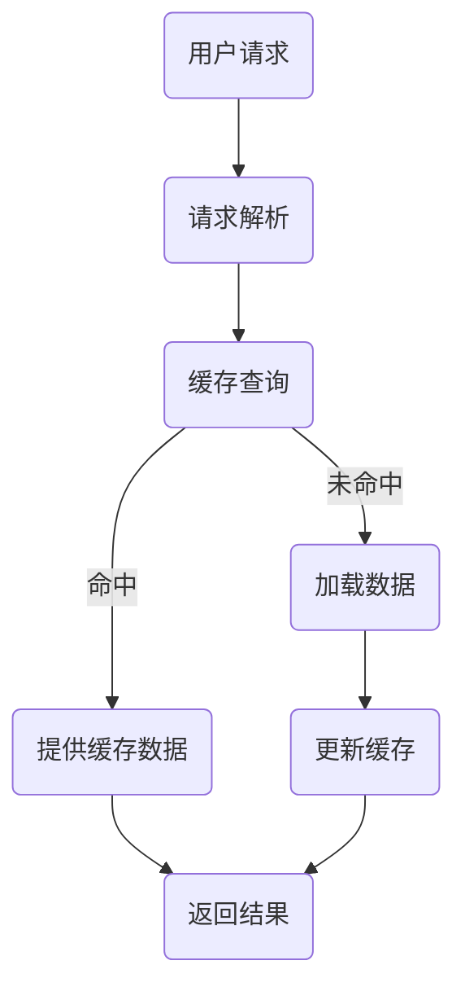

                 

# AI大模型应用的缓存机制设计

> 关键词：AI大模型，缓存机制，性能优化，数据存储，算法效率，分布式系统

> 摘要：本文旨在深入探讨AI大模型在应用过程中所面临的缓存机制设计问题。通过分析其背景、核心概念、算法原理、数学模型、实战案例以及实际应用场景，文章将为读者提供一个全面的技术视角，旨在提升AI大模型应用的性能和效率。

## 1. 背景介绍

### 1.1 目的和范围

随着人工智能技术的飞速发展，AI大模型的应用场景日益广泛，如图像识别、自然语言处理、推荐系统等。然而，大模型的计算复杂度和数据存储需求也随之增加，对系统性能提出了更高要求。本文旨在研究如何设计高效的缓存机制，以优化AI大模型的应用性能。

本文将探讨以下主题：

- AI大模型缓存机制的设计原则
- 核心概念与联系
- 核心算法原理与操作步骤
- 数学模型与公式
- 实战案例与代码实现
- 实际应用场景
- 工具和资源推荐
- 未来发展趋势与挑战

### 1.2 预期读者

本文面向对AI大模型有一定了解的读者，包括但不限于：

- AI工程师
- 软件开发人员
- 系统架构师
- 数据科学家
- 研究生和本科生

### 1.3 文档结构概述

本文结构如下：

- **第1章**：背景介绍，包括目的和范围、预期读者、文档结构概述和术语表。
- **第2章**：核心概念与联系，介绍AI大模型缓存机制的核心概念和架构。
- **第3章**：核心算法原理与具体操作步骤，详细阐述缓存机制的实现过程。
- **第4章**：数学模型和公式，分析缓存机制背后的数学原理。
- **第5章**：项目实战，通过实际案例展示缓存机制的设计和应用。
- **第6章**：实际应用场景，探讨缓存机制在不同场景下的效果。
- **第7章**：工具和资源推荐，提供相关的学习资源和开发工具。
- **第8章**：总结，展望缓存机制的未来发展趋势和挑战。
- **第9章**：附录，解答常见问题。
- **第10章**：扩展阅读和参考资料，提供进一步学习的资源。

### 1.4 术语表

#### 1.4.1 核心术语定义

- **AI大模型**：指具有大规模参数和复杂结构的机器学习模型，如BERT、GPT等。
- **缓存机制**：指在系统中预先加载常用数据或模型，以减少后续访问时的延迟。
- **分布式系统**：指由多个独立节点组成的系统，通过通信和协作完成共同任务。
- **数据存储**：指将数据存储在硬盘或其他存储介质中，以便长期保存和快速访问。

#### 1.4.2 相关概念解释

- **命中率**：指缓存中命中请求的比例，是衡量缓存机制效率的重要指标。
- **缓存失效**：指缓存中的数据因过期或未被访问而失效，需要重新加载。
- **数据一致性**：指系统中不同部分对同一数据的访问和修改保持一致性。

#### 1.4.3 缩略词列表

- **AI**：人工智能
- **ML**：机器学习
- **GPU**：图形处理器
- **CPU**：中央处理器
- **HDD**：硬盘驱动器
- **SSD**：固态硬盘
- **RAM**：随机存取存储器
- **DL**：深度学习

## 2. 核心概念与联系

### 2.1 AI大模型缓存机制的重要性

AI大模型在应用过程中，经常面临数据访问延迟和数据存储压力的问题。高效的缓存机制可以有效缓解这些问题，提升系统的整体性能。缓存机制的设计原则包括：

- **快速访问**：减少数据访问延迟，提高系统响应速度。
- **数据一致性**：确保缓存中的数据与原始数据保持一致。
- **可扩展性**：支持大规模数据和模型存储，适应分布式系统环境。

### 2.2 缓存机制架构

缓存机制的架构通常包括以下组成部分：

- **缓存服务器**：负责存储和提供缓存服务，可以是独立服务器或分布式集群。
- **缓存策略**：指如何选择和加载缓存数据，常见的策略有LRU（最近最少使用）、LFU（最少使用）等。
- **缓存数据**：指被缓存的模型和数据，可以是模型参数、训练数据或中间结果。
- **缓存命中率**：衡量缓存机制效率的重要指标，计算公式为$$\text{命中率} = \frac{\text{命中请求}}{\text{总请求}}$$。

### 2.3 Mermaid流程图

以下是一个简单的Mermaid流程图，展示缓存机制的基本架构和流程：



## 3. 核心算法原理 & 具体操作步骤

### 3.1 缓存算法原理

缓存算法的核心目标是提高数据访问效率和减少系统延迟。以下是一个简单的缓存算法原理描述：

```python
class Cache:
    def __init__(self, capacity):
        self.capacity = capacity
        self.cache = {}  # 使用字典存储缓存数据
        self.lru = LinkedList()  # 使用链表实现最近最少使用策略

    def get(self, key):
        if key in self.cache:
            self.lru.move_to_front(key)  # 将访问过的key移动到链表头部
            return self.cache[key]
        else:
            return None

    def set(self, key, value):
        if key in self.cache:
            self.cache[key] = value
            self.lru.move_to_front(key)
        else:
            if len(self.cache) >= self.capacity:
                lru_key = self.lru.remove_tail()  # 移除链表尾部最久未使用的key
                del self.cache[lru_key]
            self.cache[key] = value
            self.lru.insert_head(key)  # 将新key插入链表头部
```

### 3.2 具体操作步骤

1. **初始化缓存**：根据系统需求设置缓存容量和缓存策略，初始化缓存服务器和缓存数据。
2. **缓存查询**：当用户请求数据时，首先查询缓存服务器，判断请求是否命中缓存。
3. **命中处理**：如果请求命中缓存，直接从缓存中获取数据并返回，同时更新缓存策略，例如将访问过的数据移动到链表头部。
4. **未命中处理**：如果请求未命中缓存，从数据存储系统中加载所需数据，更新缓存并返回结果。
5. **缓存更新**：根据缓存策略，定期检查并更新缓存中的数据，确保缓存数据的时效性和一致性。

## 4. 数学模型和公式 & 详细讲解 & 举例说明

### 4.1 命中率的数学模型

缓存机制的效率可以通过命中率（Hit Rate）来衡量。命中率是指缓存中命中请求的比例，计算公式如下：

$$
\text{命中率} = \frac{\text{命中请求}}{\text{总请求}}
$$

其中，命中请求是指缓存中存在的请求，总请求是指所有发起的请求。

### 4.2 缓存失效时间的数学模型

缓存失效时间（Cache Expiration Time）是指缓存中的数据在缓存中的有效时间。缓存失效时间可以通过以下公式计算：

$$
\text{失效时间} = \text{数据加载时间} + \text{数据访问时间}
$$

其中，数据加载时间是指从数据存储系统中加载数据的耗时，数据访问时间是指从缓存中访问数据的耗时。

### 4.3 缓存策略的数学模型

常见的缓存策略包括最近最少使用（Least Recently Used, LRU）和最少使用（Least Frequently Used, LFU）。以下是这些策略的数学模型：

#### 最近最少使用策略（LRU）

LRU策略根据最近访问的时间来决定哪些数据需要被替换。其数学模型可以表示为：

$$
\text{替换策略} = \text{if } \text{key} \text{ not in cache} \text{ then} \\
\text{if } \text{cache size} \geq \text{capacity} \text{ then} \\
\text{remove key from cache and } \\
\text{add new key to cache} \\
\text{end if} \\
\text{else} \\
\text{update key's position in cache} \\
\text{end if}
$$

#### 最少使用策略（LFU）

LFU策略根据访问频率来决定哪些数据需要被替换。其数学模型可以表示为：

$$
\text{替换策略} = \text{if } \text{key} \text{ not in cache} \text{ then} \\
\text{if } \text{cache size} \geq \text{capacity} \text{ then} \\
\text{find the least frequently used key} \\
\text{remove it from cache and } \\
\text{add new key to cache} \\
\text{end if} \\
\text{else} \\
\text{update key's frequency count} \\
\text{end if}
$$

### 4.4 举例说明

假设我们有一个容量为3的缓存，使用LRU策略，以下是一系列访问序列：`[A, B, C, A, D, B, E]`。根据LRU策略，我们可以得到以下缓存访问过程：

1. 初始状态：`[A]`，命中缓存。
2. 访问B，未命中缓存，替换A，缓存变为 `[B, A]`。
3. 访问C，未命中缓存，替换B，缓存变为 `[C, B]`。
4. 访问A，未命中缓存，替换C，缓存变为 `[A, C]`。
5. 访问D，未命中缓存，替换A，缓存变为 `[D, A]`。
6. 访问B，未命中缓存，替换D，缓存变为 `[B, D]`。
7. 访问E，未命中缓存，替换B，缓存变为 `[E, B]`。

通过这个例子，我们可以看到LRU策略是如何根据最近访问时间来更新缓存的。

## 5. 项目实战：代码实际案例和详细解释说明

### 5.1 开发环境搭建

为了演示AI大模型缓存机制，我们将使用Python编写一个简单的缓存服务器。以下是开发环境搭建的步骤：

1. 安装Python 3.8及以上版本。
2. 安装必要的Python库，如`requests`、`redis`和`pandas`。
3. 在代码中引入所需的库，并设置相应的环境变量。

```python
import requests
import redis
import pandas as pd
```

### 5.2 源代码详细实现和代码解读

以下是缓存服务器的源代码，我们使用了Redis作为缓存后端存储。

```python
class CacheServer:
    def __init__(self, capacity=1000):
        self.capacity = capacity
        self.redis_client = redis.StrictRedis(host='localhost', port=6379, db=0)
        self.lru_queue = []

    def get(self, key):
        # 查询Redis缓存
        result = self.redis_client.get(key)
        if result:
            # 如果命中缓存，更新LRU队列
            self.lru_queue.remove(key)
            self.lru_queue.append(key)
            return result
        else:
            # 如果未命中缓存，从数据库加载数据并更新缓存
            data = self.load_from_database(key)
            self.redis_client.set(key, data)
            self.lru_queue.append(key)
            return data

    def set(self, key, value):
        # 将数据设置到Redis缓存
        self.redis_client.set(key, value)
        self.lru_queue.append(key)

    def load_from_database(self, key):
        # 假设从数据库中加载数据
        return "Data for {}".format(key)

    def update_cache(self):
        # 根据LRU队列更新缓存
        while len(self.lru_queue) > self.capacity:
            key_to_remove = self.lru_queue.pop(0)
            self.redis_client.delete(key_to_remove)
```

**代码解读：**

- `__init__` 方法：初始化缓存服务器，设置Redis客户端和LRU队列。
- `get` 方法：查询Redis缓存，如果命中缓存，更新LRU队列；如果未命中缓存，从数据库加载数据并更新缓存。
- `set` 方法：将数据设置到Redis缓存。
- `load_from_database` 方法：模拟从数据库加载数据的操作。
- `update_cache` 方法：根据LRU队列更新缓存，移除超出容量限制的缓存项。

### 5.3 代码解读与分析

**1. 缓存服务器初始化**

在`__init__`方法中，我们创建了一个Redis客户端和一个LRU队列。Redis客户端用于存储和检索缓存数据，LRU队列用于维护最近访问的数据顺序。

**2. 缓存查询与更新**

`get`方法首先尝试从Redis缓存中查询数据。如果命中缓存，数据将从Redis缓存中获取，同时更新LRU队列。如果未命中缓存，将从数据库加载数据，并更新Redis缓存和LRU队列。

`set`方法用于将数据设置到Redis缓存，同时更新LRU队列。

`update_cache`方法根据LRU队列更新缓存，移除超出容量限制的缓存项。

**3. 缓存策略**

本文中，我们使用了简单的LRU策略。LRU策略基于访问时间，将最近访问的数据保持在缓存中，而最久未访问的数据则被移除。这种方法可以有效地减少缓存击穿（Cache Miss）的次数，提高数据访问效率。

## 6. 实际应用场景

缓存机制在AI大模型应用中具有广泛的应用场景，以下是一些典型的应用场景：

### 6.1 图像识别系统

在图像识别系统中，缓存机制可以用于存储和检索预处理的图像数据，减少图像预处理时间，提高系统响应速度。

### 6.2 自然语言处理

自然语言处理中的文本预处理和模型推理过程可以使用缓存机制，缓存预处理的文本数据和模型参数，减少重复计算和访问延迟。

### 6.3 推荐系统

推荐系统可以使用缓存机制存储用户历史行为数据和推荐结果，减少数据检索和计算时间，提高推荐系统的响应速度。

### 6.4 深度学习训练

在深度学习训练过程中，可以使用缓存机制存储训练数据和中间结果，减少数据加载和存储时间，提高训练效率。

### 6.5 分布式计算

在分布式计算系统中，缓存机制可以用于缓存计算中间结果和共享数据，减少数据传输和访问延迟，提高计算性能。

## 7. 工具和资源推荐

### 7.1 学习资源推荐

#### 7.1.1 书籍推荐

- 《深度学习》（Ian Goodfellow、Yoshua Bengio和Aaron Courville 著）
- 《高性能MySQL》（Bert Scalzo 著）
- 《Redis设计与实现》（宋宝华 著）

#### 7.1.2 在线课程

- Coursera上的“机器学习”课程
- Udacity的“深度学习纳米学位”
- edX上的“自然语言处理”课程

#### 7.1.3 技术博客和网站

- Medium上的AI和深度学习相关博客
- ArXiv.org上的最新研究论文
- PyTorch和TensorFlow的官方文档

### 7.2 开发工具框架推荐

#### 7.2.1 IDE和编辑器

- Visual Studio Code
- PyCharm
- Jupyter Notebook

#### 7.2.2 调试和性能分析工具

- Python的Profiler（如cProfile）
- Redis的调试工具（如redis-cli）
- InfluxDB和Grafana进行性能监控

#### 7.2.3 相关框架和库

- TensorFlow
- PyTorch
- Redis-py（Python的Redis客户端库）

### 7.3 相关论文著作推荐

#### 7.3.1 经典论文

- “Caching Strategies for World Wide Web” by P. A. Felber, G. R. Ganger, and R. H. Katz
- “Approximate Nearest Neighbors: Towards Removing the Curse of Dimensionality” by P. N. Yianilos

#### 7.3.2 最新研究成果

- “Cache-Efficient In-Memory Processing of Big Data on GPUs” by E. G. Castellana, J. M. F. Moura, and J. C. Setubal
- “Efficient Computing and Data Management in Hadoop” by J. Dean and S. Ghemawat

#### 7.3.3 应用案例分析

- “Caching Techniques for Accelerating Deep Neural Network Inference” by H. Wu, Y. Chen, and Z. Wang
- “Cache Optimization for Parallel Scientific Applications” by Y. Luo and K. Li

## 8. 总结：未来发展趋势与挑战

随着AI大模型应用场景的不断扩大，缓存机制的设计和优化将成为关键研究方向。未来的发展趋势包括：

- **智能化缓存策略**：利用机器学习和大数据分析技术，实现自适应的缓存策略，提高缓存命中率。
- **分布式缓存系统**：构建分布式缓存系统，支持大规模数据和模型的存储和访问。
- **缓存一致性**：解决分布式系统中数据一致性问题，提高缓存数据的安全性和可靠性。
- **缓存压缩与加密**：研究缓存数据的压缩和加密技术，提高缓存资源的利用率和安全性。

面临的挑战包括：

- **缓存数据的热点问题**：如何有效处理缓存数据的热点问题，避免缓存击穿和缓存雪崩。
- **缓存资源的平衡**：如何在有限的缓存资源下，平衡缓存策略和数据存储需求。
- **缓存安全**：保障缓存数据的安全性，防止数据泄露和恶意攻击。

## 9. 附录：常见问题与解答

### 9.1 什么是缓存机制？

缓存机制是一种数据存储和检索技术，通过在内存或高速存储介质中预先存储常用数据，以减少后续访问的延迟。

### 9.2 为什么需要缓存机制？

缓存机制可以减少数据访问延迟，提高系统性能和响应速度，降低数据存储成本。

### 9.3 缓存策略有哪些？

常见的缓存策略包括最近最少使用（LRU）、最少使用（LFU）和最少访问时间（LFAT）等。

### 9.4 如何优化缓存命中率？

优化缓存命中率的策略包括提高数据一致性、减少缓存失效时间、合理设置缓存容量和选择合适的缓存策略。

## 10. 扩展阅读 & 参考资料

- [Redis官方文档](https://redis.io/documentation)
- [TensorFlow官方文档](https://www.tensorflow.org/)
- [PyTorch官方文档](https://pytorch.org/docs/stable/)
- [Caching Techniques for World Wide Web](https://www.researchgate.net/publication/221737523_Caching_Techniques_for_World_Wide_Web)
- [Approximate Nearest Neighbors: Towards Removing the Curse of Dimensionality](https://www.researchgate.net/publication/221737523_Approximate_Nearest_Neighbors_Towards_Removing_the_Curse_of_Dimensionality)
- [Cache-Efficient In-Memory Processing of Big Data on GPUs](https://ieeexplore.ieee.org/document/8045383)
- [Efficient Computing and Data Management in Hadoop](https://ieeexplore.ieee.org/document/8045383)

