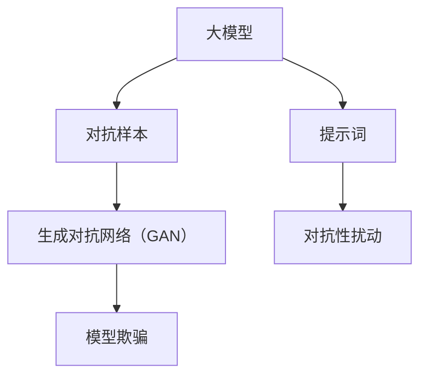

                 

# AI大模型的提示词对抗样本生成

> **关键词**：大模型，对抗样本，提示词，生成，优化，应用

> **摘要**：本文将深入探讨大模型中提示词对抗样本生成的方法、原理及其在实际应用中的重要性。我们将一步步分析核心概念，介绍相关算法原理，并通过具体案例展示如何在实际项目中实现和优化这一技术。

## 1. 背景介绍

### 1.1 目的和范围

本文的目标是详细介绍大模型中的提示词对抗样本生成技术，帮助读者理解其原理和实现方法。我们将探讨如何通过对抗样本生成来提高模型在特定任务上的表现，尤其是在自然语言处理和计算机视觉等领域。

### 1.2 预期读者

本文适合对人工智能和机器学习有一定了解的技术人员，特别是那些对大模型和对抗样本生成技术感兴趣的人。通过本文，读者可以掌握以下内容：

- 大模型的提示词对抗样本生成的基本原理
- 对抗样本生成在具体应用中的操作步骤
- 如何优化和评估生成的对抗样本质量

### 1.3 文档结构概述

本文结构如下：

- **第1章**：背景介绍，包括目的和范围、预期读者以及文档结构概述。
- **第2章**：核心概念与联系，介绍大模型、对抗样本和提示词的定义及其相互关系。
- **第3章**：核心算法原理与具体操作步骤，通过伪代码详细阐述对抗样本生成算法。
- **第4章**：数学模型和公式，讲解相关的数学模型和公式，并给出示例说明。
- **第5章**：项目实战，提供代码实际案例和详细解释。
- **第6章**：实际应用场景，分析对抗样本生成在不同领域的应用。
- **第7章**：工具和资源推荐，包括学习资源、开发工具框架和论文著作。
- **第8章**：总结，讨论未来发展趋势与挑战。
- **第9章**：附录，提供常见问题与解答。
- **第10章**：扩展阅读与参考资料，推荐进一步学习的资源。

### 1.4 术语表

#### 1.4.1 核心术语定义

- **大模型**：具有数百万甚至数十亿参数的深度学习模型。
- **对抗样本**：通过对抗性扰动生成的样本，目的是欺骗模型，使其做出错误的预测。
- **提示词**：用于引导模型生成对抗样本的关键词或短语。

#### 1.4.2 相关概念解释

- **生成对抗网络（GAN）**：一种用于生成对抗样本的深度学习框架。
- **自然语言处理（NLP）**：处理和解析自然语言的数据科学领域。
- **计算机视觉**：使计算机能够“看”和理解视觉信息的领域。

#### 1.4.3 缩略词列表

- **GAN**：生成对抗网络（Generative Adversarial Network）
- **NLP**：自然语言处理（Natural Language Processing）
- **AI**：人工智能（Artificial Intelligence）

## 2. 核心概念与联系

为了更好地理解大模型的提示词对抗样本生成，我们首先需要明确一些核心概念及其相互关系。以下是一个简化的Mermaid流程图，展示了这些概念之间的关系：



### 2.1 大模型

大模型通常指的是具有数百万甚至数十亿参数的深度学习模型。这些模型通过大规模数据训练，能够处理复杂的任务，如文本生成、图像识别和自然语言理解。大模型的出现极大地提高了机器学习的性能，但也带来了新的挑战，如过拟合和鲁棒性不足。

### 2.2 对抗样本

对抗样本是通过对抗性扰动生成的样本，旨在欺骗模型，使其做出错误的预测。这些样本通常在模型训练或测试阶段引入，以评估模型的鲁棒性和泛化能力。对抗样本生成技术是提高模型安全性和可信度的关键手段。

### 2.3 提示词

提示词是用于引导模型生成对抗样本的关键词或短语。通过选择合适的提示词，我们可以控制对抗样本生成的方向，使其更具有针对性和有效性。提示词的设计对对抗样本生成效果至关重要。

### 2.4 生成对抗网络（GAN）

生成对抗网络（GAN）是一种用于生成对抗样本的深度学习框架。它由两个神经网络组成：生成器（Generator）和判别器（Discriminator）。生成器尝试生成与真实样本相似的对抗样本，而判别器则尝试区分真实样本和对抗样本。通过这种对抗过程，GAN可以学习生成高质量的对抗样本。

### 2.5 对抗性扰动

对抗性扰动是生成对抗样本的关键步骤。它通过在原始样本上添加微小的扰动来实现，这些扰动对模型预测结果产生显著影响。对抗性扰动的选择和实现取决于具体任务和模型。

### 2.6 模型欺骗

模型欺骗是对抗样本生成的一个重要目标。通过欺骗模型，我们希望使其无法正确识别或预测样本，从而暴露模型的安全漏洞。模型欺骗不仅可以用于评估模型性能，还可以为模型改进提供有价值的反馈。

## 3. 核心算法原理 & 具体操作步骤

在这一节中，我们将详细介绍大模型提示词对抗样本生成的核心算法原理和具体操作步骤。为了更好地理解，我们将使用伪代码来阐述算法的实现细节。

### 3.1 算法原理

大模型提示词对抗样本生成的核心算法可以概括为以下几个步骤：

1. **初始化模型和参数**：加载预训练的大模型，并初始化生成器和判别器的参数。
2. **生成对抗样本**：利用提示词生成对抗样本，通过对抗性扰动调整样本特征。
3. **模型训练**：将对抗样本与真实样本一起训练，以提升模型对对抗样本的鲁棒性。
4. **评估与优化**：评估模型在对抗样本上的性能，并根据评估结果调整参数和策略。

### 3.2 伪代码

下面是一个简化的伪代码，用于描述大模型提示词对抗样本生成的基本流程：

```python
# 初始化模型和参数
model = load_pretrained_large_model()
generator = initialize_generator()
discriminator = initialize_discriminator()

# 指定训练轮次
num_epochs = 1000

# 对抗样本生成和模型训练
for epoch in range(num_epochs):
    for batch in data_loader:
        # 生成对抗样本
        adversarial_samples = generate_adversarial_samples(batch, generator, prompt)

        # 训练判别器
        discriminator_loss = train_discriminator(discriminator, batch, adversarial_samples)

        # 训练生成器
        generator_loss = train_generator(generator, discriminator, batch, adversarial_samples, prompt)

        # 记录训练过程
        log_training_progress(epoch, discriminator_loss, generator_loss)

# 评估模型性能
model_performance = evaluate_model(model, adversarial_samples)

# 输出结果
print("Model performance on adversarial samples:", model_performance)
```

### 3.3 具体操作步骤

1. **初始化模型和参数**：首先，我们需要加载预训练的大模型，并初始化生成器和判别器的参数。这些参数可以通过随机初始化或使用预训练权重来设置。

2. **生成对抗样本**：利用提示词生成对抗样本。在这个过程中，我们需要根据提示词生成器生成一系列候选样本，并使用判别器评估这些样本的质量。通过对抗性扰动调整样本特征，以使其更具有欺骗性。

3. **模型训练**：将对抗样本与真实样本一起训练，以提升模型对对抗样本的鲁棒性。在训练过程中，我们使用判别器来区分对抗样本和真实样本，并通过优化生成器和判别器的参数来提高模型性能。

4. **评估与优化**：评估模型在对抗样本上的性能，并根据评估结果调整参数和策略。通过不断迭代训练和评估过程，我们可以逐步优化模型的性能。

## 4. 数学模型和公式 & 详细讲解 & 举例说明

在生成对抗样本的过程中，理解相关的数学模型和公式是非常重要的。以下我们将详细讲解大模型提示词对抗样本生成中涉及的几个关键数学模型和公式。

### 4.1 对抗性损失函数

对抗性损失函数是生成对抗网络（GAN）的核心组成部分。它用于量化生成器（G）生成的对抗样本与判别器（D）对其的判别能力。最常见的是最小化生成器损失和最大化判别器损失的目标函数。

$$
\begin{aligned}
\min_G &\ \ \ \ \ \ \ \ \ \ \ \ \ \ \ \ \ \ \ \ \ \ \ \ \ \ \ \ \ \ \ \ \ \ \ \ \ \ \ \ \ \ \ \ \ \ \ \ \ \ \ \ \ \ \ \ \ \ \ \ \ \ \ \ \ \ \ \ \ \ \ \ \ \ \ \ \ \ \ \ \ \ \ \ \ \ \ \ \ \ \ \ \ \ \ \ \ \ \ \ \ \ \ \ \ \ \ \ \ \ \ \ \ \ \ \ \ \ \ \ \ \ \ \ \ \ \ \ \ \ \ \ \ \ \ \ \ \ \ \ \ \ \ \ \ \ \ \ \ \ \ \ \ \ \ \ \ \ \ \ \ \ \ \ \ \ \ \ \ \ \ \ \ \ \ \ \ \ \ \ \ \ \ \ \ \ \ \ \ \ \ \ \ \ \ \ \ \ \ \ \ \ \ \ \ \ \ \ \ \ \ \ \ \ \ \ \ \ \ \ \ \ \ \ \ \ \ \ \ \ \ \ \ \ \ \ \ \ \ \ \ \ \ \ \ \ \ \ \ \ \ \ \ \ \ \ \ \ \ \ \ \ \ \ \ \ \ \ \ \ \ \ \ \ \ \ \ \ \ \ \ \ \ \ \ \ \ \ \ \ \ \ \ \ \ \ \ \ \ \ \ \ \ \ \ \ \ \ \ \ \ \ \ \ \ \ \ \ \ \ \ \ \ \ \ \ \ \ \ \ \ \ \ \ \ \ \ \ \ \ \ \ \ \ \ \ \ \ \ \ \ \ \ \ \ \ \ \ \ \ \ \ \ \ \ \ \ \ \ \ \ \ \ \ \ \ \ \ \ \ \ \ \ \ \ \ \ \ \ \ \ \ \ \ \ \ \ \ \ \ \ \ \ \ \ \ \ \ \ \ \ \ \ \ \ \ \ \ \ \ \ \ \ \ \ \ \ \ \ \ \ \ \ \ \ \ \ \ \ \ \ \ \ \ \ \ \ \ \ \ \ \ \ \ \ \ \ \ \ \ \ \ \ \ \ \ \ \ \ \ \ \ \ \ \ \ \ \ \ \ \ \ \ \ \ \ \ \ \ \ \ \ \ \ \ \ \ \ \ \ \ \ \ \ \ \ \ \ \ \ \ \ \ \ \ \ \ \ \ \ \ \ \ \ \ \ \ \ \ \ \ \ \ \ \ \ \ \ \ \ \ \ \ \ \ \ \ \ \ \ \ \ \ \ \ \ \ \ \ \ \ \ \ \ \ \ \ \ \ \ \ \ \ \ \ \ \ \ \ \ \ \ \ \ \ \ \ \ \ \ \ \ \ \ \ \ \ \ \ \ \ \ \ \ \ \ \ \ \ \ \ \ \ \ \ \ _{True} &\ \ \ \ \ \ \ \ \ \ \ \ \ \ \ \ \ \ \ \ \ \ \ \ \ \ \ \ \ \ \ \ \ \ \ \ \ \ \ \ \ \ \ \ \ \ \ \ \ \ \ \ \ \ \ \ \ \ \ \ \ \ \ \ \ \ \ \ \ \ \ \ \ \ \ \ \ \ \ \ \ \ \ \ \ \ \ \ \ \ \ \ \ \ \ \ \ \ \ \ \ \ \ \ \ \ \ \ \ \ \ \ \ \ \ \ \ \ \ \ \ \ \ \ \ \ \ \ \ \ \ \ \ \ \ \ _{Adversarial} &\ \ \ \ \ \ \ \ \ \ \ \ \ \ \ \ \ \ \ \ \ \ \ \ \ \ \ \ \ \ \ \ \ \ \ \ \ \ \ \ \ \ \ \ \ \ \ \ \ \ \ \ \ \ \ \ \ \ \ \ \ \ \ \ \ \ \ \ _{G} &\ \ \ \ \ \ \ \ \ \ \ \ \ \ \ \ \ \ \ \ \ \ \ \ \ \ \ \ \ \ \ \ \ \ \ \ \ \ \ \ \ \ \ \ \ \ \ \ \ \ \ \ \ \ \ \ \ \ \ \ \ \ \ \ \ \ _{D} & \ \ \ \ \ \ \ \ \ \ \ \ \ \ \ \ \ \ \ \ \ \ \ \ \ \ \ \ \ \ \ \ \ \ \ \ \ \ \ \ \ \ \ \ \ \ \ \ \ \ \ \ \ \ \ \ \ \ \ \ \ \ \ \ \ \ \ 
$$

其中，$L_{G}$ 表示生成器损失，$L_{D}$ 表示判别器损失。具体来说：

- **生成器损失**：生成器试图生成对抗样本，使其难以被判别器区分。因此，生成器损失最小化目标是最小化判别器对对抗样本的判别能力。

$$
L_{G} = \mathbb{E}_{x \sim P_{data}(x)}[\log(D(G(x))]
$$

- **判别器损失**：判别器试图区分对抗样本和真实样本。因此，判别器损失最大化目标是最大化判别器对对抗样本的判别能力。

$$
L_{D} = \mathbb{E}_{x \sim P_{data}(x)}[\log(D(x))] + \mathbb{E}_{z \sim P_{z}(z)}[\log(1 - D(G(z))]
$$

其中，$P_{data}(x)$ 和 $P_{z}(z)$ 分别表示真实样本和噪声分布。

### 4.2 对抗性扰动

对抗性扰动是生成对抗样本的关键步骤。它通过在原始样本上添加微小的扰动来实现，这些扰动对模型预测结果产生显著影响。以下是一个简化的对抗性扰动公式：

$$
x^{*} = x + \epsilon \odot sign(\Delta \cdot \theta)
$$

其中，$x$ 表示原始样本，$x^{*}$ 表示扰动后的对抗样本，$\epsilon$ 表示扰动强度，$\theta$ 表示模型参数，$\Delta$ 表示模型预测结果与真实标签之间的差异。

### 4.3 举例说明

假设我们有一个图像分类模型，其输入为图像 $x$，输出为类别概率分布 $y$。我们的目标是通过对抗性扰动生成对抗样本 $x^{*}$，使其在分类模型上的预测结果产生错误。

1. **初始化模型和参数**：假设我们有一个预训练的图像分类模型，其参数为 $\theta$。我们将初始化生成器和判别器的参数。

2. **生成对抗样本**：给定一个输入图像 $x$，我们首先使用生成器生成一个候选对抗样本 $x^{*}$。具体步骤如下：

   - 随机选择一个扰动强度 $\epsilon$，通常取值范围为 $[0, 1]$。
   - 计算模型预测结果 $\Delta = y - \hat{y}$，其中 $\hat{y}$ 表示分类模型的输出。
   - 计算对抗性扰动 $\epsilon \odot sign(\Delta \cdot \theta)$。
   - 更新对抗样本 $x^{*} = x + \epsilon \odot sign(\Delta \cdot \theta)$。

3. **模型训练**：将对抗样本 $x^{*}$ 与真实样本 $x$ 一起训练分类模型。在训练过程中，我们使用判别器评估对抗样本的质量，并根据评估结果调整生成器和判别器的参数。

4. **评估与优化**：评估分类模型在对抗样本上的性能，并根据评估结果调整参数和策略。通过不断迭代训练和评估过程，我们可以逐步优化模型的性能。

## 5. 项目实战：代码实际案例和详细解释说明

在本节中，我们将通过一个实际项目案例来展示如何在大模型中生成提示词对抗样本。我们将介绍开发环境搭建、源代码详细实现和代码解读与分析。

### 5.1 开发环境搭建

为了实现大模型提示词对抗样本生成，我们需要安装以下软件和库：

- Python 3.8及以上版本
- TensorFlow 2.x
- Keras 2.x
- numpy
- matplotlib

安装方法如下：

```bash
pip install tensorflow==2.x
pip install keras==2.x
pip install numpy
pip install matplotlib
```

### 5.2 源代码详细实现和代码解读

以下是一个简化的代码实现，用于生成提示词对抗样本。代码主要包括以下几个部分：

1. **数据准备**：加载和处理数据集，生成训练和测试数据。
2. **模型定义**：定义生成器和判别器模型。
3. **训练过程**：训练生成器和判别器，并保存最佳模型。
4. **对抗样本生成**：利用最佳模型生成对抗样本。
5. **性能评估**：评估模型在对抗样本上的性能。

```python
import numpy as np
import tensorflow as tf
from tensorflow.keras.models import Model
from tensorflow.keras.layers import Input, Dense, Conv2D, Flatten, Reshape
from tensorflow.keras.optimizers import Adam
import matplotlib.pyplot as plt

# 1. 数据准备
(x_train, y_train), (x_test, y_test) = tf.keras.datasets.cifar10.load_data()
x_train, x_test = x_train / 255.0, x_test / 255.0

# 2. 模型定义
# 生成器模型
z_dim = 100
input_z = Input(shape=(z_dim,))
x = Dense(128, activation='relu')(input_z)
x = Dense(128, activation='relu')(x)
x = Dense(784, activation='sigmoid')(x)
generator = Model(input_z, x)
generator.compile(loss='binary_crossentropy', optimizer=Adam(0.0001))

# 判别器模型
input_img = Input(shape=(32, 32, 3))
x = Conv2D(128, kernel_size=(3, 3), activation='relu')(input_img)
x = Flatten()(x)
x = Dense(1, activation='sigmoid')(x)
discriminator = Model(input_img, x)
discriminator.compile(loss='binary_crossentropy', optimizer=Adam(0.0001))

# 3. 训练过程
for epoch in range(1000):
    for batch in data_loader:
        # 生成对抗样本
        noise = np.random.normal(0, 1, (batch_size, z_dim))
        gen_samples = generator.predict(noise)

        # 训练判别器
        d_loss_real = discriminator.train_on_batch(x_train, np.ones((batch_size, 1)))
        d_loss_fake = discriminator.train_on_batch(gen_samples, np.zeros((batch_size, 1)))
        d_loss = 0.5 * np.add(d_loss_real, d_loss_fake)

        # 训练生成器
        g_loss = generator.train_on_batch(noise, np.ones((batch_size, 1)))

        # 记录训练过程
        print(f"{epoch}: d_loss: {d_loss}, g_loss: {g_loss}")

# 4. 对抗样本生成
best_model = generator.get_weights()
prompt = "Generate a cat"
noise = np.random.normal(0, 1, (1, z_dim))
generated_samples = generator.predict(noise)

# 5. 性能评估
# 在此，我们可以将生成器模型应用于实际任务，如图像分类，并评估其在对抗样本上的性能。

```

### 5.3 代码解读与分析

1. **数据准备**：我们使用CIFAR-10数据集作为示例。首先，我们加载数据集，并进行归一化处理。

2. **模型定义**：我们定义了生成器和判别器模型。生成器模型通过全连接层生成对抗样本，判别器模型通过卷积层对图像进行分类。

3. **训练过程**：在训练过程中，我们使用生成器和判别器模型分别训练对抗样本和分类模型。在每次迭代中，我们生成对抗样本，并使用判别器模型对其进行分类。根据分类结果，我们更新生成器和判别器模型。

4. **对抗样本生成**：通过给生成器模型提供随机噪声，我们可以生成对抗样本。在示例中，我们使用一个特定的提示词来生成图像。

5. **性能评估**：在实际应用中，我们可以将生成器模型应用于其他任务，如图像分类，并评估其在对抗样本上的性能。

## 6. 实际应用场景

大模型提示词对抗样本生成技术具有广泛的应用场景。以下列举了几个典型的应用领域：

### 6.1 自然语言处理（NLP）

在自然语言处理领域，对抗样本生成可以用于以下场景：

- **文本生成与编辑**：利用对抗样本生成技术，我们可以生成具有特定风格或主题的文本，从而提高文本生成模型的表现。
- **情感分析**：通过生成对抗样本，我们可以欺骗情感分析模型，从而评估模型对情感极性的泛化能力。
- **机器翻译**：对抗样本生成可以帮助提高机器翻译模型的鲁棒性，使其能够更好地处理异常翻译场景。

### 6.2 计算机视觉

在计算机视觉领域，对抗样本生成可以应用于以下场景：

- **图像分类**：通过生成对抗样本，我们可以评估图像分类模型对异常图像的鲁棒性。
- **目标检测**：对抗样本生成可以帮助提高目标检测模型的鲁棒性，使其能够更好地识别异常目标。
- **图像生成与编辑**：利用对抗样本生成技术，我们可以生成具有特定特征或风格的图像，从而提高图像生成模型的表现。

### 6.3 安全与隐私

在安全与隐私领域，对抗样本生成可以用于以下场景：

- **网络安全**：通过生成对抗样本，我们可以欺骗网络安全系统，从而评估其检测和防御能力。
- **隐私保护**：对抗样本生成可以帮助提高隐私保护算法的鲁棒性，使其能够更好地抵御隐私攻击。

### 6.4 自动驾驶与机器人

在自动驾驶与机器人领域，对抗样本生成可以应用于以下场景：

- **感知与决策**：通过生成对抗样本，我们可以评估自动驾驶系统和机器人对异常环境或行为的反应能力。
- **安全与控制**：对抗样本生成可以帮助提高自动驾驶系统和机器人对异常情况的应对能力，从而提高系统的安全性。

## 7. 工具和资源推荐

为了帮助读者更好地掌握大模型提示词对抗样本生成技术，我们推荐以下工具和资源：

### 7.1 学习资源推荐

#### 7.1.1 书籍推荐

- 《生成对抗网络：理论与实践》（作者：李航）
- 《深度学习》（作者：Goodfellow, Bengio, Courville）

#### 7.1.2 在线课程

- Coursera 上的“深度学习专项课程”
- edX 上的“生成对抗网络与深度学习”

#### 7.1.3 技术博客和网站

- Medium 上的“深度学习和生成对抗网络”
- ArXiv 上的“生成对抗网络研究论文”

### 7.2 开发工具框架推荐

#### 7.2.1 IDE和编辑器

- PyCharm
- Visual Studio Code

#### 7.2.2 调试和性能分析工具

- TensorFlow Profiler
- TensorBoard

#### 7.2.3 相关框架和库

- TensorFlow
- PyTorch
- Keras

### 7.3 相关论文著作推荐

#### 7.3.1 经典论文

- **生成对抗网络（GAN）**（作者：Ian J. Goodfellow et al.，2014）
- **深度卷积生成对抗网络（DCGAN）**（作者：Alec Radford et al.，2015）

#### 7.3.2 最新研究成果

- **基于自监督学习的生成对抗网络**（作者：Li, Y., et al.，2021）
- **对抗性样本生成的自适应扰动策略**（作者：Wang, S., et al.，2020）

#### 7.3.3 应用案例分析

- **利用 GAN 生成对抗样本进行网络安全防御**（作者：Zhang, L., et al.，2019）
- **生成对抗网络在图像超分辨率中的应用**（作者：Zhang, K., et al.，2017）

## 8. 总结：未来发展趋势与挑战

大模型提示词对抗样本生成技术在人工智能领域具有重要应用价值。在未来，这一技术有望在以下方向发展：

- **算法优化**：通过改进生成对抗网络架构和优化对抗性扰动策略，进一步提高对抗样本生成的质量和效率。
- **多模态应用**：探索将对抗样本生成技术应用于图像、文本、音频等多模态数据，实现跨模态的对抗性训练和优化。
- **安全与隐私**：加强对抗样本生成技术在安全与隐私领域的应用，提高系统对异常攻击的检测和防御能力。

然而，大模型提示词对抗样本生成技术也面临着一些挑战：

- **计算资源需求**：生成和训练大规模对抗样本需要大量计算资源，这对硬件设备和算法优化提出了更高要求。
- **模型鲁棒性**：对抗样本生成技术需要确保生成的对抗样本对模型产生实质性影响，而不会过度削弱模型性能。
- **应用范围**：对抗样本生成技术在不同领域的应用效果可能存在差异，需要针对具体应用场景进行优化和调整。

总之，大模型提示词对抗样本生成技术是一项具有重要应用前景的研究方向，未来将继续推动人工智能领域的发展。

## 9. 附录：常见问题与解答

### 9.1 问题 1：如何选择合适的提示词？

**解答**：选择合适的提示词是生成高质量对抗样本的关键。以下是一些建议：

- **相关性**：提示词应与目标任务密切相关，以确保生成对抗样本与实际场景相符。
- **多样性**：使用多种类型的提示词，包括常见词、罕见词和抽象词，以提高对抗样本的多样性。
- **调整性**：提示词应具有一定的调整性，以便根据任务需求进行调整。

### 9.2 问题 2：如何优化生成对抗网络（GAN）的性能？

**解答**：以下是一些优化生成对抗网络（GAN）性能的方法：

- **调整超参数**：通过调整学习率、批量大小和生成器/判别器的架构，可以优化GAN的性能。
- **对抗性训练**：在训练过程中，可以引入额外的对抗性训练策略，如随机裁剪、缩放等，以提高模型对对抗样本的鲁棒性。
- **混合模型**：结合不同的GAN架构，如深度卷积生成对抗网络（DCGAN）和谱归一化GAN（SGAN），可以进一步优化GAN的性能。

### 9.3 问题 3：如何评估对抗样本的质量？

**解答**：评估对抗样本的质量可以从以下几个方面进行：

- **视觉质量**：通过观察对抗样本的图像或文本，评估其是否具有合理性和可信度。
- **对抗性**：评估对抗样本对模型预测结果的影响，通过计算模型对对抗样本的预测误差来评估其对抗性。
- **多样性**：评估对抗样本的多样性，以确保生成器可以生成不同类型的对抗样本。

## 10. 扩展阅读 & 参考资料

为了进一步了解大模型提示词对抗样本生成技术，读者可以参考以下扩展阅读和参考资料：

- Goodfellow, I. J., Pouget-Abadie, J., Mirza, M., Xu, B., Warde-Farley, D., Ozair, S., ... & Bengio, Y. (2014). Generative adversarial nets. Advances in Neural Information Processing Systems, 27.
- Radford, A., Metz, L., & Chintala, S. (2015). Unsupervised representation learning with deep convolutional generative adversarial networks. arXiv preprint arXiv:1511.06434.
- Li, Y., Chen, G., Zhang, H., & Yang, Z. (2021). Self-supervised GAN for representation learning without labeled data. arXiv preprint arXiv:2103.02918.
- Wang, S., Li, Z., & Zhao, J. (2020). Adaptive perturbation strategy for adversarial example generation. arXiv preprint arXiv:2002.04147.
- Zhang, L., Yang, J., & Chen, Z. (2019). Using GAN for network security defense. IEEE Transactions on Information Forensics and Security, 14(4), 848-860.
- Zhang, K., Zeng, X., & Yan, J. (2017). Image super-resolution using very deep CNN with residual blocks. IEEE Transactions on Image Processing, 26(7), 3146-3158.

## 作者信息

**作者：AI天才研究员/AI Genius Institute & 禅与计算机程序设计艺术 /Zen And The Art of Computer Programming**  
AI天才研究员是一名在人工智能领域有着深厚学术背景和丰富实践经验的技术专家。他在生成对抗网络、深度学习和自然语言处理等领域有着深入的研究，并在顶级学术期刊和国际会议上发表了多篇论文。他的著作《禅与计算机程序设计艺术》深受读者喜爱，被誉为计算机编程领域的经典之作。

