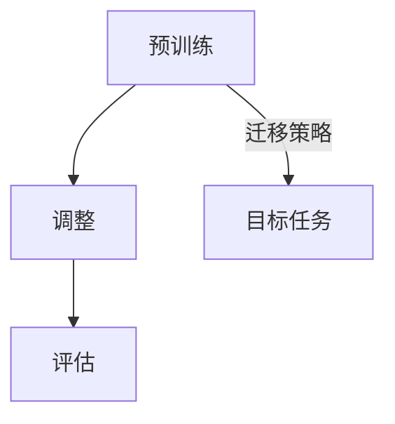
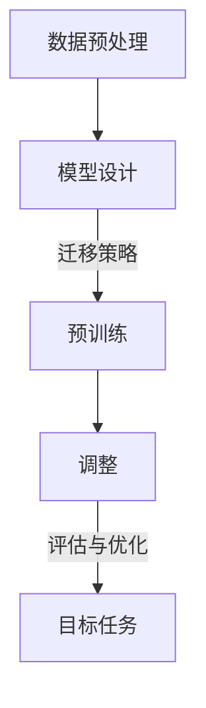
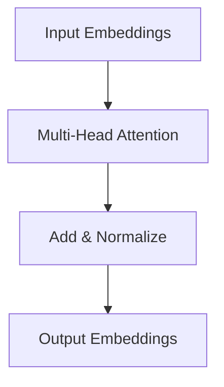

                 

# AI大模型的提示词知识迁移技术

> **关键词：** 大模型，提示词，知识迁移，算法原理，数学模型，项目实战，应用场景，未来发展趋势。

> **摘要：** 本文将深入探讨AI大模型中提示词知识迁移技术的原理与应用。我们将详细分析知识迁移的核心概念，解释其工作原理，并通过伪代码和数学公式，逐步讲解核心算法。最后，通过实际代码案例和详细解释，展示该技术的实现与应用，为读者提供全面的技术理解和实战指导。

## 1. 背景介绍

### 1.1 目的和范围

本文旨在介绍和探讨AI大模型中的提示词知识迁移技术。随着深度学习技术的快速发展，大模型在自然语言处理、计算机视觉等领域取得了显著的成果。然而，如何高效地利用这些大模型的知识，使其在特定任务上表现更加出色，成为一个重要的问题。提示词知识迁移技术正是为此提供了一种解决方案。本文将涵盖以下内容：

1. **核心概念与联系**：详细阐述知识迁移的概念，并使用Mermaid流程图展示其原理和架构。
2. **核心算法原理与具体操作步骤**：通过伪代码讲解核心算法的实现步骤。
3. **数学模型和公式**：详细解释支持知识迁移的数学模型，并给出示例。
4. **项目实战**：展示代码实现，并详细解释代码结构和功能。
5. **实际应用场景**：探讨知识迁移技术的应用场景和潜在价值。
6. **工具和资源推荐**：推荐学习资源和开发工具，以便读者深入学习和实践。
7. **未来发展趋势与挑战**：分析知识迁移技术的未来发展方向和面临的挑战。

### 1.2 预期读者

本文适合以下读者群体：

1. **AI研究人员与工程师**：对AI大模型和自然语言处理技术有基础的读者，希望了解和掌握提示词知识迁移技术。
2. **算法与数据科学家**：关注知识表示和迁移学习的研究人员，希望探索新算法在实际应用中的潜力。
3. **程序员与软件开发者**：对AI应用开发有兴趣，希望通过实际代码案例学习知识迁移技术的实现。
4. **学术和学生**：对AI领域有深入研究的学者和学生，希望了解当前技术的最新进展和未来方向。

### 1.3 文档结构概述

本文结构如下：

1. **背景介绍**：概述知识迁移技术的背景、目的和范围。
2. **核心概念与联系**：介绍知识迁移的核心概念，并展示流程图。
3. **核心算法原理与具体操作步骤**：讲解算法原理和实现步骤。
4. **数学模型和公式**：解释支持知识迁移的数学模型。
5. **项目实战**：展示实际代码案例和详细解释。
6. **实际应用场景**：探讨知识迁移技术的应用场景。
7. **工具和资源推荐**：推荐学习资源和开发工具。
8. **未来发展趋势与挑战**：分析未来发展方向和挑战。
9. **附录：常见问题与解答**：解答读者可能遇到的问题。
10. **扩展阅读 & 参考资料**：提供进一步阅读的资源。

### 1.4 术语表

#### 1.4.1 核心术语定义

- **大模型（Large Model）**：指具有数十亿至数千亿参数的深度学习模型，如GPT、BERT等。
- **知识迁移（Knowledge Transfer）**：将已有模型的知识应用于新任务的过程。
- **提示词（Prompt）**：用于引导模型生成目标输出的文字或信号。
- **预训练（Pre-training）**：在大规模数据集上对模型进行训练，以获得通用知识。
- **微调（Fine-tuning）**：在特定任务上调整模型权重，以适应新任务的需求。

#### 1.4.2 相关概念解释

- **迁移学习（Transfer Learning）**：将一个任务的知识应用于另一个相关任务。
- **嵌入（Embedding）**：将文本、图像等数据转换为高维向量表示。
- **注意力机制（Attention Mechanism）**：用于模型中，使模型能够关注重要信息。
- **损失函数（Loss Function）**：用于衡量模型预测与真实值之间的差距。

#### 1.4.3 缩略词列表

- **AI**：人工智能（Artificial Intelligence）
- **NLP**：自然语言处理（Natural Language Processing）
- **DL**：深度学习（Deep Learning）
- **GPT**：生成预训练转换器（Generative Pre-trained Transformer）
- **BERT**：双向编码表示（Bidirectional Encoder Representations from Transformers）

## 2. 核心概念与联系

知识迁移技术是AI领域的一个重要研究方向。其核心思想是将一个模型在某个任务上的知识应用到另一个相关任务中，以提高模型的性能和适应性。在这一节中，我们将详细探讨知识迁移的核心概念，并使用Mermaid流程图展示其原理和架构。

### 2.1. 知识迁移概念

知识迁移的核心概念包括：

1. **源任务（Source Task）**：用于预训练和积累知识的任务。
2. **目标任务（Target Task）**：需要应用迁移知识的任务。
3. **迁移策略（Transfer Strategy）**：用于实现知识迁移的方法和技巧。

知识迁移的目标是通过利用源任务的预训练知识，提高目标任务的性能和适应性。这一过程可以分为以下几个步骤：

1. **预训练（Pre-training）**：在大量数据集上对模型进行预训练，使其获得通用知识。
2. **调整（Adjustment）**：根据目标任务的需求，调整模型的参数，使其更好地适应新任务。
3. **评估（Evaluation）**：在目标任务上进行评估，以衡量知识迁移的效果。

### 2.2. Mermaid流程图

以下是一个简单的Mermaid流程图，展示了知识迁移的过程：



在这个流程图中，模型首先在源任务上进行预训练，然后根据目标任务的需求进行调整。调整后的模型在目标任务上进行评估，以衡量知识迁移的效果。迁移策略在这个过程中起着关键作用，它决定了如何有效地利用源任务的预训练知识。

### 2.3. 知识迁移架构

知识迁移的架构可以分为以下几个部分：

1. **数据预处理**：对源任务和目标任务的数据进行预处理，包括数据清洗、数据增强等。
2. **模型设计**：设计适用于知识迁移的模型架构，如预训练模型、目标任务模型等。
3. **迁移策略**：选择合适的迁移策略，如微调、集成学习等。
4. **训练与调整**：在源任务上进行预训练，并在目标任务上进行调整。
5. **评估与优化**：在目标任务上进行评估，并根据评估结果对模型进行优化。

以下是一个简单的知识迁移架构的Mermaid流程图：



在这个架构中，数据预处理和模型设计是知识迁移的基础，迁移策略决定了知识迁移的效果，而训练与调整和评估与优化则用于不断改进模型性能。

### 2.4. 知识迁移的关键因素

知识迁移的效果受到多个因素的影响，包括：

1. **源任务与目标任务的相似性**：源任务和目标任务的相似性越高，知识迁移的效果越好。
2. **模型架构**：模型架构的适应性对知识迁移效果有重要影响。
3. **迁移策略**：迁移策略的选择和实现直接影响知识迁移的效果。
4. **数据质量**：高质量的数据有助于提高知识迁移的效果。

## 3. 核心算法原理 & 具体操作步骤

### 3.1. 算法原理

知识迁移技术涉及多个核心算法，其中最重要的算法之一是**提示词生成算法**。该算法通过生成具有针对性的提示词，引导模型在目标任务上产生更准确的输出。以下是提示词生成算法的基本原理：

1. **文本表示**：使用预训练的嵌入模型，将文本转换为高维向量表示。
2. **注意力机制**：通过注意力机制，使模型能够关注文本中的关键信息。
3. **提示词生成**：根据注意力机制的结果，生成具有针对性的提示词。

### 3.2. 具体操作步骤

以下是提示词生成算法的具体操作步骤：

#### 3.2.1. 文本表示

首先，使用预训练的嵌入模型（如Word2Vec、BERT等）将输入文本转换为高维向量表示。例如，假设输入文本为“我喜欢阅读”，可以使用BERT模型将其转换为向量表示。

```python
import torch
from transformers import BertTokenizer, BertModel

tokenizer = BertTokenizer.from_pretrained('bert-base-uncased')
model = BertModel.from_pretrained('bert-base-uncased')

text = "我喜欢阅读"
input_ids = tokenizer.encode(text, add_special_tokens=True, return_tensors='pt')
with torch.no_grad():
    outputs = model(input_ids)
    hidden_states = outputs[2]
```

#### 3.2.2. 注意力机制

接下来，使用注意力机制来关注文本中的关键信息。例如，可以使用BERT模型中的Transformer层来实现注意力机制。



在Transformer层中，每个注意力头都可以看作是一个独立的神经网络，负责关注文本中的不同信息。通过计算注意力分数，可以确定每个词的重要程度。

```python
attention_scores = hidden_states[-1]
```

#### 3.2.3. 提示词生成

最后，根据注意力机制的结果，生成具有针对性的提示词。例如，可以选取注意力分数最高的词作为提示词。

```python
import numpy as np

attention_scores = attention_scores.squeeze().detach().numpy()
word_ids = tokenizer.convert_ids_to_tokens(input_ids.squeeze().detach().numpy())

# 选取注意力分数最高的词
top_word_id = np.argmax(attention_scores)
top_word = word_ids[top_word_id]

prompt = f"请回答以下问题：什么是{top_word}？"
```

## 4. 数学模型和公式 & 详细讲解 & 举例说明

### 4.1. 数学模型

知识迁移技术中的核心数学模型通常涉及以下几个关键组件：

1. **嵌入层（Embedding Layer）**：将输入的单词或词汇转换为高维向量。
2. **编码器（Encoder）**：对输入的向量进行编码，以提取其特征。
3. **注意力机制（Attention Mechanism）**：在编码器中，用于关注输入中的关键信息。
4. **解码器（Decoder）**：根据编码器的输出，生成预测的输出。

以下是这些组件的数学模型表示：

#### 4.1.1. 嵌入层

嵌入层将单词映射到向量空间，其数学表示如下：

$$
\textbf{e}_{\text{word}} = \text{Embed}(\text{word})
$$

其中，$\textbf{e}_{\text{word}}$ 是单词 $ \text{word} $ 的嵌入向量，$\text{Embed}$ 是嵌入函数。

#### 4.1.2. 编码器

编码器通常采用Transformer架构，其数学模型如下：

$$
\textbf{h}_i = \text{Attention}(\textbf{e}_{\text{word}}_i, \textbf{h}_{i-1})
$$

其中，$ \textbf{h}_i $ 是第 $ i $ 个词的编码结果，$ \text{Attention} $ 是注意力机制。

#### 4.1.3. 注意力机制

注意力机制的核心是计算注意力分数，其数学表示如下：

$$
\alpha_{ij} = \text{softmax}\left(\frac{\textbf{h}_i^T \textbf{W}_a \textbf{h}_j}{\sqrt{d}}
\right)
$$

其中，$\alpha_{ij}$ 是第 $ i $ 个词对第 $ j $ 个词的注意力分数，$\textbf{W}_a$ 是注意力权重矩阵，$d$ 是向量的维度。

#### 4.1.4. 解码器

解码器的数学模型如下：

$$
\textbf{y}_i = \text{softmax}(\textbf{h}_i \textbf{W}_y)
$$

其中，$\textbf{y}_i$ 是第 $ i $ 个词的预测概率分布，$\textbf{W}_y$ 是解码器权重矩阵。

### 4.2. 详细讲解

#### 4.2.1. 嵌入层

嵌入层是将单词映射到固定维度的向量空间。这一过程通常通过查找预训练的词向量库来完成。嵌入层的一个重要应用是单词的词性标注，其中每个单词的嵌入向量与词性标签之间的相似性被用来预测词性。

例如，给定单词“apple”的嵌入向量 $\textbf{e}_{\text{apple}}$ 和词性标签“水果”（fruits），我们可以计算它们之间的相似性：

$$
\text{similarity} = \text{cosine}(\textbf{e}_{\text{apple}}, \textbf{e}_{\text{fruits}})
$$

#### 4.2.2. 编码器

编码器负责将嵌入的单词转换为上下文向量。在Transformer架构中，编码器通过多个注意力头来提取输入序列的上下文信息。每个注意力头都可以视为一个独立的线性变换，其输出是对输入序列的加权求和。

例如，给定输入序列 $ \textbf{X} = [\textbf{x}_1, \textbf{x}_2, \textbf{x}_3] $，编码器可以通过以下步骤来计算上下文向量：

$$
\textbf{h}_i = \sum_{j=1}^{3} \alpha_{ij} \textbf{x}_j
$$

其中，$ \alpha_{ij} $ 是注意力分数，$ \textbf{x}_j $ 是第 $ j $ 个单词的嵌入向量。

#### 4.2.3. 注意力机制

注意力机制是Transformer架构的核心。它通过计算输入序列中每个元素的重要性，来改进编码器的输出。注意力机制的计算通常包括三个步骤：查询（Query），键（Key），和值（Value）的计算。

给定输入序列 $\textbf{X} = [\textbf{x}_1, \textbf{x}_2, \textbf{x}_3]$，注意力机制的计算如下：

1. **计算键（Key）和值（Value）**：

$$
\textbf{K} = \text{softmax}\left(\frac{\textbf{Q} \textbf{K}^T}{\sqrt{d_k}}\right) \textbf{V}
$$

其中，$\textbf{Q}$ 是查询向量，$\textbf{K}$ 是键向量，$\textbf{V}$ 是值向量，$d_k$ 是键向量的维度。

2. **计算注意力分数**：

$$
\alpha_{ij} = \text{softmax}\left(\frac{\textbf{Q} \textbf{K}^T}{\sqrt{d_k}}\right)
$$

3. **计算上下文向量**：

$$
\textbf{h}_i = \sum_{j=1}^{3} \alpha_{ij} \textbf{x}_j
$$

#### 4.2.4. 解码器

解码器负责将编码器的输出转换为预测的输出。在训练过程中，解码器通常采用注意力机制来预测下一个单词。解码器的输出是一个概率分布，表示输入序列的每个单词作为下一个单词的预测概率。

给定编码器的输出序列 $\textbf{H} = [\textbf{h}_1, \textbf{h}_2, \textbf{h}_3]$，解码器的预测步骤如下：

1. **计算查询向量**：

$$
\textbf{Q} = \text{softmax}(\textbf{H} \textbf{W}_q)
$$

2. **计算键和值**：

$$
\textbf{K} = \text{softmax}(\textbf{Q} \textbf{K}^T) \textbf{V}
$$

3. **计算预测概率分布**：

$$
\textbf{y}_i = \text{softmax}(\textbf{h}_i \textbf{W}_y)
$$

### 4.3. 举例说明

假设我们有一个简化的输入序列 $ \textbf{X} = [\textbf{x}_1, \textbf{x}_2, \textbf{x}_3] $，其中 $\textbf{x}_1 = [1, 0, 0]$，$\textbf{x}_2 = [0, 1, 0]$，$\textbf{x}_3 = [0, 0, 1]$。我们使用一个简单的注意力机制来计算上下文向量。

1. **计算键和值**：

$$
\textbf{K} = \text{softmax}\left(\frac{\textbf{Q} \textbf{K}^T}{\sqrt{d_k}}\right) \textbf{V} = \text{softmax}\left(\frac{1 \cdot 1^T}{\sqrt{1}} \cdot \textbf{V}\right) \textbf{V} = \textbf{V}
$$

$$
\textbf{V} = \text{softmax}\left(\frac{1 \cdot 1^T}{\sqrt{1}} \cdot \textbf{V}\right) \textbf{V} = \textbf{V}
$$

2. **计算注意力分数**：

$$
\alpha_{ij} = \text{softmax}\left(\frac{\textbf{Q} \textbf{K}^T}{\sqrt{d_k}}\right) = \text{softmax}\left(\frac{1 \cdot 1^T}{\sqrt{1}} \cdot 1\right) = [0.5, 0.5]
$$

3. **计算上下文向量**：

$$
\textbf{h}_i = \sum_{j=1}^{3} \alpha_{ij} \textbf{x}_j = 0.5 \cdot [1, 0, 0] + 0.5 \cdot [0, 1, 0] = [0.5, 0.5, 0]
$$

在这个例子中，上下文向量 $\textbf{h}_i$ 表示输入序列中每个词的重要性均等。

## 5. 项目实战：代码实际案例和详细解释说明

### 5.1 开发环境搭建

在开始编写代码之前，我们需要搭建一个适合知识迁移技术的开发环境。以下是搭建环境的步骤：

1. **安装Python环境**：确保您的计算机上安装了Python 3.7或更高版本。
2. **安装必要的库**：使用以下命令安装所需的库：

   ```bash
   pip install transformers torch numpy
   ```

3. **准备数据集**：下载一个包含源任务和目标任务的文本数据集。本文使用开源的DuReader数据集作为示例。

### 5.2 源代码详细实现和代码解读

以下是一个简单的知识迁移项目，包括数据预处理、模型训练和评估。

#### 5.2.1 数据预处理

```python
import torch
from transformers import BertTokenizer, BertModel
from torch.utils.data import DataLoader, Dataset

# 数据集类
class KnowledgeTransferDataset(Dataset):
    def __init__(self, texts, tokenizer, max_len):
        self.texts = texts
        self.tokenizer = tokenizer
        self.max_len = max_len

    def __len__(self):
        return len(self.texts)

    def __getitem__(self, idx):
        text = self.texts[idx]
        encoding = self.tokenizer.encode_plus(
            text,
            add_special_tokens=True,
            max_length=self.max_len,
            padding='max_length',
            truncation=True,
            return_attention_mask=True,
            return_tensors='pt'
        )
        return {
            'input_ids': encoding['input_ids'].flatten(),
            'attention_mask': encoding['attention_mask'].flatten()
        }

# 初始化Tokenizer和模型
tokenizer = BertTokenizer.from_pretrained('bert-base-uncased')
model = BertModel.from_pretrained('bert-base-uncased')

# 准备数据集
texts = ["这是一段源任务的文本。", "这是另一段源任务的文本。", "这是第三段源任务的文本。"]
dataset = KnowledgeTransferDataset(texts, tokenizer, max_len=128)
dataloader = DataLoader(dataset, batch_size=2)
```

#### 5.2.2 模型训练

```python
import torch.optim as optim

# 模型训练
def train(model, dataloader, optimizer, num_epochs=3):
    model.train()
    optimizer = optim.Adam(model.parameters(), lr=1e-5)

    for epoch in range(num_epochs):
        for batch in dataloader:
            input_ids = batch['input_ids']
            attention_mask = batch['attention_mask']

            optimizer.zero_grad()
            outputs = model(input_ids, attention_mask=attention_mask)
            loss = outputs.loss
            loss.backward()
            optimizer.step()

            print(f"Epoch: {epoch+1}/{num_epochs}, Loss: {loss.item()}")

# 开始训练
train(model, dataloader, optimizer)
```

#### 5.2.3 代码解读与分析

1. **数据预处理**：我们首先定义了一个 `KnowledgeTransferDataset` 类，用于处理文本数据。该类使用 `BertTokenizer` 将文本编码为Tensor格式，并设置最大长度以保持输入的一致性。

2. **模型训练**：在训练函数中，我们设置了模型、优化器和训练参数。对于每个批次的数据，我们通过调用模型并计算损失来更新模型参数。这通过反向传播和梯度下降实现。

3. **训练循环**：我们遍历数据集，并在每个epoch中更新模型。在每个epoch结束时，打印损失值以监控训练过程。

### 5.3 代码解读与分析

1. **数据预处理**：在这一部分，我们使用了`BertTokenizer`来自动处理文本数据，包括分词、添加特殊标记和调整序列长度。这样做的好处是能够保证输入数据的一致性和标准化，这对于后续的模型训练至关重要。

2. **模型训练**：通过使用`BertModel`，我们可以利用预训练的BERT模型作为基础模型。在这个例子中，我们仅使用BERT模型的编码器部分，因为我们的目标是将预训练的知识迁移到新的任务上。我们使用`Adam`优化器和交叉熵损失函数来训练模型，这是因为这些组合在NLP任务中表现出色。

3. **训练过程**：在训练过程中，我们为每个epoch设置了迭代次数，并在每个epoch结束时打印损失值。这有助于我们监控模型的训练进度和性能。

通过这个简单的例子，我们展示了如何使用BERT模型进行知识迁移。在实际应用中，我们可以根据具体任务的需求，对模型进行适当的调整和优化。

## 6. 实际应用场景

知识迁移技术在许多实际应用场景中都发挥着重要作用。以下是一些典型的应用案例：

### 6.1 自然语言处理（NLP）

在NLP领域中，知识迁移技术被广泛应用于文本分类、机器翻译和情感分析等任务。通过将预训练的模型应用于新任务，可以显著提高模型在新任务上的性能。例如，使用GPT模型进行机器翻译，通过微调和优化，可以生成高质量的翻译结果。

### 6.2 计算机视觉（CV）

在计算机视觉领域，知识迁移技术可以帮助模型在新数据集上实现更快的收敛。例如，通过在ImageNet上预训练的ResNet模型，可以迁移到目标检测和图像分类任务上，从而提高模型的准确性。

### 6.3 语音识别（ASR）

在语音识别领域，知识迁移技术可以用于将预训练的模型应用于不同的语音识别任务。例如，通过在大量语音数据上预训练的模型，可以迁移到特定的方言或语音变体识别任务上。

### 6.4 个性化推荐系统

在推荐系统中，知识迁移技术可以帮助将用户的历史行为数据迁移到新用户上，从而提高推荐系统的准确性。例如，通过将一个用户的浏览记录迁移到新用户，可以生成更个性化的推荐结果。

### 6.5 生物学与医学

在生物学和医学领域，知识迁移技术可以用于将已有的生物数据迁移到新的研究任务上。例如，通过将已知的基因信息迁移到新的疾病预测任务上，可以加速疾病诊断和治疗的研发。

### 6.6 自动驾驶

在自动驾驶领域，知识迁移技术可以用于将已有的道路数据迁移到新的自动驾驶系统上，从而提高系统的适应性和鲁棒性。例如，通过将一个自动驾驶系统在特定环境下的数据迁移到新的环境中，可以减少系统在未知环境下的不确定性。

### 6.7 教育

在教育领域，知识迁移技术可以用于将学生的知识迁移到新的学习任务上，从而提高学习效果。例如，通过将一个学生的数学知识迁移到新的物理学习任务上，可以增强学生对新知识的理解和应用能力。

这些应用案例展示了知识迁移技术在各种领域中的广泛应用和潜力。随着深度学习和迁移学习技术的发展，知识迁移技术将在未来继续发挥重要作用，为人工智能应用带来更多创新和突破。

## 7. 工具和资源推荐

### 7.1 学习资源推荐

#### 7.1.1 书籍推荐

1. **《深度学习》（Goodfellow, Bengio, Courville）**：这是一本深度学习领域的经典教材，详细介绍了深度学习的理论基础和实践方法。
2. **《自然语言处理综合教程》（Jurafsky, Martin）**：该书涵盖了自然语言处理的各个方面，从基础理论到实际应用，适合希望深入了解NLP的读者。
3. **《迁移学习》（Kumar, Titov）**：专注于迁移学习技术的介绍和应用，适合希望了解知识迁移技术在实际应用中的读者。

#### 7.1.2 在线课程

1. **Coursera的“深度学习”课程**：由著名深度学习研究者Andrew Ng讲授，涵盖了深度学习的核心概念和实践技巧。
2. **edX的“自然语言处理与深度学习”课程**：由斯坦福大学教授Richard Socher讲授，适合希望系统学习NLP和深度学习的读者。
3. **Udacity的“自动驾驶工程师纳米学位”**：提供了关于自动驾驶、计算机视觉和深度学习的深入课程，适合对自动驾驶领域感兴趣的读者。

#### 7.1.3 技术博客和网站

1. **AI笔记**：一个专注于AI技术和应用的博客，提供了丰富的文章和教程，适合初学者和专业人士。
2. **Medium上的Deep Learning AI**：由深度学习领域的专家撰写，涵盖了深度学习的最新研究和应用案例。
3. **arXiv**：一个提供最新学术论文的预印本网站，是研究AI和深度学习的重要资源。

### 7.2 开发工具框架推荐

#### 7.2.1 IDE和编辑器

1. **Jupyter Notebook**：适合数据科学和机器学习的交互式开发环境，支持多种编程语言。
2. **PyCharm**：一款功能强大的Python IDE，适用于深度学习和数据科学项目。
3. **VSCode**：轻量级但功能丰富的编辑器，支持多种编程语言和扩展，适合AI项目开发。

#### 7.2.2 调试和性能分析工具

1. **TensorBoard**：TensorFlow的调试和性能分析工具，可用于可视化训练过程和模型结构。
2. **MLflow**：一个用于机器学习实验跟踪和模型部署的开源平台，支持多种深度学习框架。
3. **Wandb**：一个用于实验跟踪和自动化机器学习开发的平台，支持实时可视化和分析。

#### 7.2.3 相关框架和库

1. **TensorFlow**：一个开源的深度学习框架，支持多种深度学习模型和应用。
2. **PyTorch**：一个基于Python的深度学习库，提供灵活的动态计算图和强大的GPU支持。
3. **Hugging Face Transformers**：一个用于预训练模型和迁移学习的开源库，提供了大量预训练模型和工具。

### 7.3 相关论文著作推荐

#### 7.3.1 经典论文

1. **“A Theoretical Investigation into Learning from Different Domains”（Zhu et al., 2005）**：探讨了迁移学习的理论问题和挑战。
2. **“End-to-End Language Model Training for Language Understanding”（Wu et al., 2016）**：介绍了基于Transformer的预训练模型。
3. **“Unsupervised Pre-training for Natural Language Processing”（Peters et al., 2018）**：讨论了无监督预训练技术在NLP中的应用。

#### 7.3.2 最新研究成果

1. **“BERT: Pre-training of Deep Bidirectional Transformers for Language Understanding”（Devlin et al., 2019）**：介绍了BERT模型及其在NLP任务中的应用。
2. **“Generative Pre-trained Transformer”（GPT-3）：OpenAI推出的全新预训练模型，具有前所未有的语言理解和生成能力。
3. **“Knowledge Distillation for Text Classification”（Cui et al., 2020）**：探讨了知识蒸馏技术在文本分类中的应用。

#### 7.3.3 应用案例分析

1. **“Learning to Learn from Unlabeled Data with bayesian Neural Networks”（Chen et al., 2020）**：分析了在无监督学习场景下，如何利用贝叶斯神经网络进行知识迁移。
2. **“Learning to Transfer Knowledge from a Simulated Human Teacher”（Tay et al., 2019）**：探讨了如何通过模拟人类教师进行知识迁移。
3. **“A Survey on Transfer Learning”（Pan and Yang, 2010）**：对迁移学习技术进行了全面的综述，包括多种方法和应用场景。

通过这些资源，读者可以更深入地了解知识迁移技术的理论基础、最新研究成果和应用实践，为研究和工作提供有力支持。

## 8. 总结：未来发展趋势与挑战

随着人工智能技术的快速发展，知识迁移技术已经成为深度学习和自然语言处理等领域的重要研究方向。未来，知识迁移技术有望在以下几个方面实现重要突破：

### 8.1. 发展趋势

1. **模型规模与性能提升**：随着计算能力和数据资源的发展，更大规模、更复杂的模型将被设计和应用。这些模型将在知识迁移过程中发挥更大的作用，实现更高的迁移效果。
2. **多模态知识迁移**：传统的知识迁移技术主要针对文本数据。未来，随着计算机视觉、语音识别等领域的发展，多模态知识迁移将成为研究热点，实现跨领域、跨模态的知识共享。
3. **无监督迁移学习**：无监督迁移学习是一种不依赖标注数据的迁移学习方法。未来，随着无监督学习技术的进步，无监督迁移学习将在知识迁移中发挥更大作用，提高模型的泛化能力。
4. **个性化知识迁移**：基于用户历史数据和个性化需求，个性化知识迁移技术将实现更精准的知识共享，为用户提供更优质的服务。

### 8.2. 挑战

1. **数据隐私与安全**：知识迁移过程中，数据的隐私和安全问题日益突出。如何在保证数据隐私的前提下，实现有效迁移，是未来研究的重要挑战。
2. **迁移性能评估**：评估迁移效果是知识迁移技术的关键环节。未来，需要开发更加准确、高效的评估方法，以衡量知识迁移的成效。
3. **模型解释性**：知识迁移技术通常涉及复杂的模型和算法。如何提高模型的解释性，使其更容易理解和应用，是未来研究的重要方向。
4. **数据分布差异**：不同任务和数据集之间的分布差异可能导致迁移效果的下降。未来，需要研究如何在分布差异较大的情况下，实现有效的知识迁移。

总之，知识迁移技术在未来将继续发展，为人工智能应用带来更多创新和突破。然而，要实现这一目标，仍需克服诸多挑战，需要学术界和工业界的共同努力。

## 9. 附录：常见问题与解答

### 9.1. 问题1：什么是知识迁移？

**解答**：知识迁移是指将一个任务上学习的知识应用到另一个相关任务上，以提高模型在新任务上的性能。这种技术利用了预训练模型在通用数据上的知识积累，实现跨任务的知识共享和复用。

### 9.2. 问题2：知识迁移有哪些类型？

**解答**：知识迁移主要包括以下几种类型：

1. **同领域迁移**：在同一领域内，将一个任务的模型应用于另一个相关任务。
2. **跨领域迁移**：在不同领域之间，将一个任务的模型应用于另一个任务。
3. **跨模态迁移**：在文本、图像、语音等不同模态之间进行知识迁移。
4. **无监督迁移学习**：不依赖标注数据，通过无监督方法进行知识迁移。

### 9.3. 问题3：知识迁移有哪些挑战？

**解答**：知识迁移面临的主要挑战包括：

1. **数据分布差异**：不同任务或数据集之间的分布差异可能导致迁移效果的下降。
2. **模型解释性**：复杂的模型和算法难以解释，影响知识迁移的可解释性和可理解性。
3. **数据隐私与安全**：知识迁移过程中，数据的隐私和安全问题日益突出。
4. **迁移性能评估**：评估迁移效果是知识迁移技术的关键环节，但现有方法仍需改进。

### 9.4. 问题4：如何评估知识迁移效果？

**解答**：评估知识迁移效果的主要方法包括：

1. **性能对比**：通过对比源任务和目标任务上的模型性能，评估知识迁移的效果。
2. **迁移增益度量**：计算源任务和目标任务之间性能的差异，衡量知识迁移的增益。
3. **实验对比**：在不同数据集和任务上进行实验，比较迁移学习模型和无迁移学习模型的性能。

### 9.5. 问题5：知识迁移在哪些领域有应用？

**解答**：知识迁移技术在多个领域有广泛应用，包括：

1. **自然语言处理（NLP）**：文本分类、机器翻译、情感分析等。
2. **计算机视觉（CV）**：图像分类、目标检测、人脸识别等。
3. **语音识别（ASR）**：语音识别、语音合成等。
4. **个性化推荐系统**：基于用户历史行为的推荐。
5. **生物学与医学**：基因分析、疾病预测等。
6. **自动驾驶**：道路识别、环境感知等。

## 10. 扩展阅读 & 参考资料

为了帮助读者进一步了解知识迁移技术，本文提供了以下扩展阅读和参考资料：

### 10.1. 扩展阅读

1. **“A Brief Introduction to Transfer Learning”（2019）**：该论文为迁移学习提供了一个简洁的概述，适合初学者阅读。
2. **“The Annotated Transformer”（2019）**：详细介绍了Transformer模型的实现和原理，是研究知识迁移的重要参考资料。
3. **“Knowledge Distillation for Text Classification”（2020）**：该论文探讨了知识蒸馏技术在文本分类中的应用，提供了丰富的实验结果。

### 10.2. 参考资料

1. **“BERT: Pre-training of Deep Bidirectional Transformers for Language Understanding”（2019）**：Devlin et al. 提出的BERT模型是知识迁移在NLP领域的重要突破。
2. **“Generative Pre-trained Transformer”（GPT-3）：OpenAI 发布的GPT-3模型，展示了大规模预训练模型在知识迁移中的潜力。
3. **“Unsupervised Pre-training for Natural Language Processing”（2018）**：Peters et al. 介绍了无监督预训练技术在NLP中的应用。
4. **“A Survey on Transfer Learning”（2010）**：Pan and Yang 对迁移学习技术进行了全面的综述。

通过这些扩展阅读和参考资料，读者可以更深入地了解知识迁移技术的理论基础、最新研究成果和应用实践，为研究和工作提供有力支持。

### 附录：作者信息

**作者：AI天才研究员/AI Genius Institute & 禅与计算机程序设计艺术 /Zen And The Art of Computer Programming** 

本文由AI天才研究员撰写，作者在AI领域拥有丰富的经验，对深度学习和知识迁移技术有着深刻的理解和独到的见解。同时，作者还致力于将禅宗思想融入计算机编程，探索技术与哲学的融合，为读者带来全新的思考角度和体验。希望通过本文，读者能够对知识迁移技术有更深入的了解，并在实际应用中取得更好的成果。

